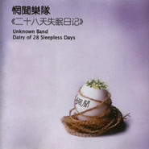

二十八天失眠日记Diary Of 28 Sleepless Days
============================

|  |  |
| :--: | :-- |
| [ 二十八天失眠日记Diary Of 28 Sleepless Days](https://emumo.xiami.com/album/15576) | **艺人**: [惘闻](../index.md) **语种**: 国语 **唱片公司**: 我爱摇滚乐 **发行时间**: 2003年08月01日 **专辑类别**: 录音室专辑 **专辑风格**: 摇滚 Rock & Roll, 后摇 Post-Rock **播放数**: 1085431 **收藏数**: 1728 **评论数**: 131  |

## 简介

这是中国第一支纯正的Post－Rock乐队，成立于1998年。这张专辑中的歌曲其中一半儿都是乐队比较早期的作品，歌曲的框架结构比较简单，稍有些Post Punk的味道。   
整个专辑的歌曲显得风格不是很统一，惘闻的音乐就那么容易的让忧伤也迷茫了，在阳光下开始害怕影子的出现，古老的砖墙和街道，你潜存的善良的幻想或者无知的幼稚，理想下的信念，面对现实的怯懦。你会被自己审问，这一切还有意义？或者这意义都没意义。如果非得定义乐队的风格，他应该是一种介于Post Rock（不是Post Punk）和Progressive Rock之间的东西。   
专辑里，那首《垂死的岁末》很有意思，音乐编排和歌词都不错。   
  
The band was formed in the city of Dalian, a busy seaport in northeast china, in the year of 1999. Wangwen was at first started by two awkward (at that time!) guitarists who were crazy about The Smashing Pumpkins and later joined by the drummer who also brought along the band name, representing the idea of an unknown band and insensibility to what others say. The band began to record their first demo- ’the animal world’ on their own in the same year they formed. Since then the band members had been changing while continuous creation of new pieces of music and performing. ‘lingshuihe’(‘the IceWaterRiver’) was recorded on their own in 2000 and the third demo ‘the Tenebrous Yinyang Road’ was also completed two years later. During this period the music style of the band had been gradually changing from vocal to instrumental and started to draw broad attentions both from the reviews and the audience as well. It was considered as one of the leading bands from China in the fields of post-rock and acid rock. The band was influenced by: Mogwai, Red Red Meat, Mono, Explosion in the Sky, Polvo, Tortois–GYBE, etc.  
  
河北音像出版   
ISRC: CN-C12-03-334-00 

## 曲目

- [光](./15576/nyioe6fd1.md)
- [垂死的岁末](./15576/jlZnd5798.md)
- [丰收](./15576/jlZocc405.md)
- [奔丧](./15576/jlZp986c9.md)
- [报仇](./15576/jlZq9b457.md)
- [汉人](./15576/eZQp6794c.md)
- [辞行](./15576/jlZsdc01e.md)
- [素食者](./15576/nyivf3255.md)
- [A Song For Yu Wen](./15576/rAry1f066.md)

## 评论

|  |  |  |
| :-- | :-- | :-- |
|  [虾米用户](https://emumo.xiami.com/u/440840078) 我还没想好要写什么... 2020-07-06 14:56 赞(0) 踩(0) | 
谢谢
 |
|  [虾米用户](https://emumo.xiami.com/u/5092269) 我还没想好要写什么... 2019-11-28 16:32 赞(3) 踩(0) | 
唱片公司：我爱摇滚乐 爱摇还会复刊吗？
 |
|  [虾米用户](https://emumo.xiami.com/u/180847) 只有心知道 岁月不宽宏 2019-02-22 18:51 赞(0) 踩(0) | 
，
 |
|  [虾米用户](https://emumo.xiami.com/u/42963872) 我还没想好要写什么... 2019-01-03 05:09 赞(0) 踩(0) | 
我的搖滾樂還有意義嗎
 |
|  [虾米用户](https://emumo.xiami.com/u/2784797) 离开是为了回来 2018-12-26 16:03 赞(0) 踩(0) | 
为什么中文介绍写着1998年成立，英文却是1999年？
 |
| ⇒ |  [虾米用户](https://emumo.xiami.com/u/39795806)   2019-04-04 11:46 赞(0) 踩(0) | 
因为一个阳历一个农历（滑稽
 |
| ⇒ |  [虾米用户](https://emumo.xiami.com/u/2784797) 离开是为了回来 2019-04-07 14:05 赞(0) 踩(0) | 
<q><b>青年骗子说：</b></q>
 |
|  [虾米用户](https://emumo.xiami.com/u/112463526) 豆瓣: 坤斤拷    我... 2018-10-06 16:30 赞(0) 踩(0) | 
补
 |
|  [虾米用户](https://emumo.xiami.com/u/996277) ‏‏ 2018-09-11 19:47 赞(0) 踩(0) | 
太8⃣️牛比了
 |
|  [虾米用户](https://emumo.xiami.com/u/1115247) @Nebula_7293 2018-07-05 21:28 赞(0) 踩(0) | 
那时 我才9岁
 |
| ⇒ |  [虾米用户](https://emumo.xiami.com/u/100500408)   2018-08-24 07:19 赞(0) 踩(0) | 
哈哈我那年才出生
 |
|  [虾米用户](https://emumo.xiami.com/u/20177386) 感谢一切美好的遇见❤️ 2018-06-03 17:18 赞(1) 踩(0) | 

 |
| ⇒ |  [虾米用户](https://emumo.xiami.com/u/238363813)  2018-06-04 21:00 赞(0) 踩(0) | 
这里发现你 哈哈
 |
| ⇒ |  [虾米用户](https://emumo.xiami.com/u/20177386) 感谢一切美好的遇见❤️ 2018-06-05 20:07 赞(0) 踩(0) | 
<q><b>　情难自控说：</b></q>
 |
| ⇒ |  [虾米用户](https://emumo.xiami.com/u/238363813)  2018-06-05 20:46 赞(0) 踩(0) | 
<q><b>婆娑说：</b></q>
 |
|  [虾米用户](https://emumo.xiami.com/u/43492923) 行到水穷我才开始害怕，夕... 2018-03-17 21:33 赞(0) 踩(0) | 
&amp;zeta;
 |
|  [虾米用户](https://emumo.xiami.com/u/43492923) 行到水穷我才开始害怕，夕... 2018-03-02 21:22 赞(0) 踩(0) | 
嗯哼
 |
|  [虾米用户](https://emumo.xiami.com/u/43714694) WeChat：96529... 2017-12-25 16:31 赞(0) 踩(0) | 
吱/音
 |
|  [虾米用户](https://emumo.xiami.com/u/260123122)   2017-06-28 15:50 赞(0) 踩(0) | 
早期的WangWen
 |
|  [虾米用户](https://emumo.xiami.com/u/16337726)  2017-06-05 16:41 赞(0) 踩(0) | 
)
 |
|  [虾米用户](https://emumo.xiami.com/u/43714694) WeChat：96529... 2017-04-02 12:01 赞(0) 踩(0) | 
吱/音
 |
|  [虾米用户](https://emumo.xiami.com/u/32457471) 富有想象力的，情感的音乐 2017-03-25 14:58 赞(1) 踩(0) | 
妈呀，2003年就做了这样的音乐。
 |
|  [虾米用户](https://emumo.xiami.com/u/279977217)  2017-03-12 23:46 赞(0) 踩(0) | 
开始
 |
|  [虾米用户](https://emumo.xiami.com/u/2279444) 爱在左，同情在右。 2017-01-03 02:33 赞(0) 踩(0) | 
惘闻变化确实挺大的，原来也是一支麦霸型后摇选手哇～
 |
|  [虾米用户](https://emumo.xiami.com/u/7620119)  2016-06-08 22:45 赞(2) 踩(0) | 
专辑介绍把后摇和后朋混为一谈还有意义吗
 |
|  [虾米用户](https://emumo.xiami.com/u/6614012) bitterhoney  2016-05-04 00:56 赞(1) 踩(0) | 
最丧
 |
|  [虾米用户](https://emumo.xiami.com/u/13085731)   2016-03-23 14:43 赞(2) 踩(0) | 
我爱摇滚乐
 |
|  [虾米用户](https://emumo.xiami.com/u/8233768) 这家伙很潇洒什么也没留下... 2016-02-06 11:03 赞(1) 踩(0) | 
听完这张砖我失眠了28天
 |
|  [虾米用户](https://emumo.xiami.com/u/62273896)  2016-02-02 16:06 赞(0) 踩(0) | 
音乐没问题、思想没问题。只是歌词和表达是硬伤。
 |
|  [虾米用户](https://emumo.xiami.com/u/12402504) 我还没想好要写什么... 2015-12-15 01:06 赞(1) 踩(0) | 
下地狱。
 |
|  [虾米用户](https://emumo.xiami.com/u/34903978)  2015-10-17 23:21 赞(0) 踩(0) | 
失眠第28天了，这专辑有毒
 |
|  [虾米用户](https://emumo.xiami.com/u/38801880)   2015-10-11 19:36 赞(0) 踩(0) | 
^_^
 |
|  [虾米用户](https://emumo.xiami.com/u/13690189)   2015-08-02 00:47 赞(1) 踩(0) | 
这词虚无到极点啊
 |
|  [虾米用户](https://emumo.xiami.com/u/2229698)   2015-06-18 15:46 赞(1) 踩(0) | 
我在二月整整失眠了一个月
 |
|  [虾米用户](https://emumo.xiami.com/u/10510904)  2015-05-30 09:40 赞(3) 踩(0) | 
你唱这歌还有意义吗
 |
|  [虾米用户](https://emumo.xiami.com/u/3474940)  2015-05-19 20:17 赞(0) 踩(0) | 
全是回忆
 |
|  [虾米用户](https://emumo.xiami.com/u/10695277)  2015-05-18 00:34 赞(0) 踩(0) | 
三年前
 |
|  [虾米用户](https://emumo.xiami.com/u/26150947)             ... 2015-05-03 23:26 赞(0) 踩(0) | 
回来听听这个
 |
|  [虾米用户](https://emumo.xiami.com/u/6813122) 活在艺术的梦里 2015-02-28 01:07 赞(0) 踩(0) | 
人生就是一场梦   一切都是幻觉    最后归零！
 |
|  [虾米用户](https://emumo.xiami.com/u/7878205) 我还没想好要写什么... 2015-01-07 11:10 赞(0) 踩(0) | 
无眠
 |
|  [虾米用户](https://emumo.xiami.com/u/18238002) ilove music.... 2014-12-31 16:31 赞(0) 踩(0) | 
ss
 |
|  [虾米用户](https://emumo.xiami.com/u/42938828)  2014-10-23 20:14 赞(0) 踩(0) | 
我的一切还有意义吗，大连哥哥的声音，伴随了大一时期的每一刻孤独，让我的耳朵找到归宿
 |
|  [虾米用户](https://emumo.xiami.com/u/355865) Let it go, l... 2014-10-16 14:38 赞(2) 踩(0) | 
现在听来，有点强说愁的意味
 |
|  [虾米用户](https://emumo.xiami.com/u/8767968) 残酷死亡金属爱好者 2014-10-01 18:32 赞(0) 踩(0) | 
买过磁带
 |
|  [虾米用户](https://emumo.xiami.com/u/13604783) 任何东西都会死的，只要你... 2014-09-09 01:13 赞(2) 踩(0) | 
a Song for yuwen，听到的第一首他们的歌，那年还在初中，那时爱摇送的还是卡带，记得很清楚是B面的最后一首，这么多年过去时至今日依旧能找到第一次听时的感动，20140908，中秋，雨夜，惘闻西安巡演，一个纪念。愿一直陪伴。。
 |
|  [虾米用户](https://emumo.xiami.com/u/4362247) 我还没想好要写什么... 2014-08-02 00:06 赞(0) 踩(0) | 
03年就搞出了这么牛逼的东西，10年才听到，相见恨晚！
 |
|  [虾米用户](https://emumo.xiami.com/u/38777713)  2014-07-08 15:44 赞(0) 踩(0) | 
cool
 |
|  [虾米用户](https://emumo.xiami.com/u/459009) 我还没想好要写什么... 2014-07-07 01:51 赞(0) 踩(0) | 
辞行，曲调最欢快
 |
|  [虾米用户](https://emumo.xiami.com/u/1736735)   2014-06-05 06:27 赞(0) 踩(0) | 
高中听垂死的岁末  绝望的要死
 |
|  [虾米用户](https://emumo.xiami.com/u/7679627) 嘻嘻 2014-03-20 21:59 赞(0) 踩(0) | 
是有多绝望的人才会写出这样能把人拉向地狱的作品
 |
|  [虾米用户](https://emumo.xiami.com/u/1609946) 一即一切 2014-03-11 08:39 赞(1) 踩(0) | 
心 境不二
 |
| ⇒ |  [虾米用户](https://emumo.xiami.com/u/34688888) 我还没想好要写什么... 2014-12-03 10:58 赞(0) 踩(0) | 
求你了哥，别再心境不二了……
 |
| ⇒ |  [虾米用户](https://emumo.xiami.com/u/34688888) 我还没想好要写什么... 2015-03-14 02:13 赞(0) 踩(0) | 
<q><b>兽子说：</b></q>
 |
| ⇒ |  [虾米用户](https://emumo.xiami.com/u/35210469) 我还没想好要写什么... 2017-10-27 23:58 赞(0) 踩(0) | 
<q><b>海说：</b></q>
 |
|  [虾米用户](https://emumo.xiami.com/u/13941620) 逃跑达人 2014-03-02 11:22 赞(1) 踩(0) | 
炒鸡喜欢a song for yuwen
 |
|  [虾米用户](https://emumo.xiami.com/u/576136) Get around 2014-02-16 21:34 赞(0) 踩(0) | 
我的心声
 |
|  [虾米用户](https://emumo.xiami.com/u/11508808)  2014-02-04 23:37 赞(0) 踩(0) | 
求垂死的岁末曲子
 |
|  [虾米用户](https://emumo.xiami.com/u/31751590) 暂无签名~ 2014-01-25 17:13 赞(0) 踩(0) | 
其时中国内地最好的一张后摇
 |
|  [虾米用户](https://emumo.xiami.com/u/9402801) 来自宇宙深处的傻逼 2013-12-29 14:38 赞(0) 踩(0) | 
我的摇滚乐还有意义吗
 |
|  [虾米用户](https://emumo.xiami.com/u/7685124)  2013-10-28 10:07 赞(0) 踩(0) | 
汉人这首出乎意料得好
 |
|  [虾米用户](https://emumo.xiami.com/u/3213832)  2013-09-19 23:16 赞(0) 踩(0) | 
28天失眠日记
 |
|  [虾米用户](https://emumo.xiami.com/u/15381100) 人生就是场即兴表演 2013-08-22 14:36 赞(0) 踩(0) | 
@小白兔玩被撕   不知道你喜欢歌曲吗  但专辑名挺适合你的
 |
|  [虾米用户](https://emumo.xiami.com/u/2586117) 我还没想好要写什么... 2013-08-13 00:06 赞(0) 踩(0) | 
一个月的期待
 |
|  [虾米用户](https://emumo.xiami.com/u/2586117) 我还没想好要写什么... 2013-08-13 00:06 赞(0) 踩(0) | 
一个月的期待
 |
|  [虾米用户](https://emumo.xiami.com/u/8329421) 时光不及你眉眼 2013-07-15 20:00 赞(0) 踩(0) | 
1
 |
|  [虾米用户](https://emumo.xiami.com/u/1231783) 我还没想好要写什么... 2013-06-12 19:47 赞(0) 踩(0) | 
我的高中
 |
|  [虾米用户](https://emumo.xiami.com/u/4275776) 虾米音质检测督查账号 2013-06-07 14:44 赞(19) 踩(0) | 
#音质报告# 已更新合格320K~
 |
|  [虾米用户](https://emumo.xiami.com/u/1644333) 传说中的小明 2013-06-07 00:24 赞(0) 踩(0) | 
ISRC(中国): CNC120333400 我爱摇滚乐 (So Rock! Records) 河北音像
 |
|  [虾米用户](https://emumo.xiami.com/u/155947) 一期一会 2013-05-09 11:20 赞(0) 踩(0) | 
失眠四周目
 |
|  [虾米用户](https://emumo.xiami.com/u/4733623) 我还没想好要写什么... 2013-04-22 09:22 赞(0) 踩(0) | 
在这断腿的日子，纪念下我需要28天一动不动来恢复。
 |
| ⇒ |  [虾米用户](https://emumo.xiami.com/u/6011096) 我还没想好要写什么... 2013-05-08 12:18 赞(0) 踩(0) | 
祝福你
 |
| ⇒ |  [虾米用户](https://emumo.xiami.com/u/4733623) 我还没想好要写什么... 2013-05-08 17:32 赞(0) 踩(0) | 
<q><b>别装笔说：</b></q>
 |
|  [虾米用户](https://emumo.xiami.com/u/12937134) .. 2013-04-17 10:42 赞(1) 踩(0) | 
10年前一遍遍地听，现在依然感动。
 |
|  [虾米用户](https://emumo.xiami.com/u/3205477) 菩提本无树 明镜亦非台 2013-03-24 10:34 赞(0) 踩(0) | 
好安静的摇滚
 |
|  [虾米用户](https://emumo.xiami.com/u/3417405) ADSR 2013-01-23 23:13 赞(0) 踩(0) | 
好颓。。。
 |
|  [虾米用户](https://emumo.xiami.com/u/5465183)  2012-12-31 11:55 赞(0) 踩(0) | 
2012最后一天 遇见惘闻的 垂死的岁末 好巧 28天失眠日记
 |
|  [虾米用户](https://emumo.xiami.com/u/1446377) 暂无签名~ 2012-12-30 01:05 赞(0) 踩(0) | 
不是我的菜但我爱
 |
|  [虾米用户](https://emumo.xiami.com/u/1080627) 我还没想好要写什么... 2012-12-29 13:14 赞(0) 踩(0) | 
❤
 |
|  [虾米用户](https://emumo.xiami.com/u/7984603) i need music... 2012-10-26 14:45 赞(4) 踩(0) | 
长久的失眠就像是掉进了一条深不见底的黑洞，又像是一场永远不会醒来的难以言语的梦。
 |
|  [虾米用户](https://emumo.xiami.com/u/3644698)  2012-10-14 20:02 赞(0) 踩(0) | 
好久远啊
 |
|  [虾米用户](https://emumo.xiami.com/u/8764856) 爸爸,我恐怕不会有爱情了 2012-10-13 04:07 赞(0) 踩(0) | 
垂死的岁末 我的吉他还有意义吗 我的摇滚乐还有意义吗 我的理想还有意义吗
 |
| ⇒ |  [虾米用户](https://emumo.xiami.com/u/2735643)  2012-12-24 15:01 赞(0) 踩(0) | 
我的效果器
 |
|  [虾米用户](https://emumo.xiami.com/u/655219) 老去是最好的招安。 2012-09-19 17:14 赞(0) 踩(0) | 
这个办公室还有意义吗？
 |
|  [虾米用户](https://emumo.xiami.com/u/982033)  2012-08-29 16:37 赞(0) 踩(0) | 
《垂死的岁末》前半段听着很伤感，到后半段，歌词提到他的效果器，突然一种喜感迎上心头········讨论这首歌还有意义嘛
 |
|  [虾米用户](https://emumo.xiami.com/u/2659823) 人間發電所 2012-07-29 17:52 赞(0) 踩(0) | 
据说..是最好的惘闻
 |
| ⇒ |  [虾米用户](https://emumo.xiami.com/u/321360) Segmentation 2012-08-07 20:13 赞(0) 踩(0) | 
IV要哭了
 |
|  [虾米用户](https://emumo.xiami.com/u/3082498)  2012-07-12 12:42 赞(1) 踩(0) | 
有意义吗？有意义吗？有意义吗？有意义吗？有意义吗？有意义吗？有意义吗？有意义吗？有意义吗？有意义吗？有意义吗？有意义吗？有意义吗？有意义吗？有意义吗？有意义吗？有意义吗？有意义吗？有意义吗？有意义吗？有意义吗？有意义吗？有意义吗？有意义吗？有意义吗？有意义吗？有意义吗？有意义吗？有意义吗？有意义吗？有意义吗？有意义吗？有意义吗？有意义吗？
 |
|  [虾米用户](https://emumo.xiami.com/u/7511950) too bright 2012-07-05 13:14 赞(0) 踩(0) | 
垂死的岁末，赞
 |
|  [虾米用户](https://emumo.xiami.com/u/1644168)   2012-06-20 01:13 赞(0) 踩(0) | 
惘闻
 |
|  [虾米用户](https://emumo.xiami.com/u/1598471)  2012-06-19 04:06 赞(0) 踩(0) | 
惘闻的质量真心靠谱
 |
|  [虾米用户](https://emumo.xiami.com/u/2486624) Like a star 2012-06-16 23:24 赞(0) 踩(0) | 
这张总算比前两张接近后摇了，从00年起，他们的音乐一直在往前走
 |
|  [虾米用户](https://emumo.xiami.com/u/9447890)  2012-06-16 07:47 赞(0) 踩(0) | 
111111111
 |
|  [虾米用户](https://emumo.xiami.com/u/348341)   2012-06-10 18:13 赞(0) 踩(0) | 
动荡的夏天听见的祈愿中的光
 |
|  [虾米用户](https://emumo.xiami.com/u/7647547) 垂死的岁末 2012-06-05 10:19 赞(0) 踩(0) | 
别说意义了 什么都是没有意义的
 |
|  [虾米用户](https://emumo.xiami.com/u/1338836)  2012-06-01 19:47 赞(0) 踩(0) | 
第一张听的中国后摇
 |
|  [虾米用户](https://emumo.xiami.com/u/676403) 卧式制作人，呕式歌手 2012-05-27 17:03 赞(0) 踩(0) | 
居然挺好 外加有很爱大连
 |
|  [虾米用户](https://emumo.xiami.com/u/6871629)  2012-05-17 10:13 赞(0) 踩(0) | 
这是最好的惘闻，
 |
|  [虾米用户](https://emumo.xiami.com/u/3394683)  2012-04-18 01:09 赞(0) 踩(0) | 
二十八天失眠日记。好吧失眠是因为我饿！
 |
|  [虾米用户](https://emumo.xiami.com/u/2724706)  2012-03-26 13:04 赞(0) 踩(0) | 
好
 |
|  [虾米用户](https://emumo.xiami.com/u/2724706)  2012-03-26 13:04 赞(0) 踩(0) | 
好
 |
|  [虾米用户](https://emumo.xiami.com/u/8126672)  2012-03-04 14:10 赞(0) 踩(0) | 
大连独立音乐的旗帜
 |
|  [虾米用户](https://emumo.xiami.com/u/4788608) 世界太小，無處可滾。 2012-03-01 13:44 赞(0) 踩(0) | 
殘。
 |
|  [虾米用户](https://emumo.xiami.com/u/1821385)  2012-02-06 12:14 赞(0) 踩(0) | 
心情郁闷的时候听到，感觉很好
 |
|  [虾米用户](https://emumo.xiami.com/u/394893) 理想是情人现实是BZ 2012-02-01 14:34 赞(0) 踩(0) | 
于我，这是最好的惘闻
 |
|  [虾米用户](https://emumo.xiami.com/u/394893) 理想是情人现实是BZ 2012-01-31 22:13 赞(0) 踩(0) | 
失眠依旧
 |
|  [虾米用户](https://emumo.xiami.com/u/7526106)  2012-01-03 16:02 赞(0) 踩(0) | 
挺好，够刻意
 |
|  [虾米用户](https://emumo.xiami.com/u/370254)  2011-12-27 12:50 赞(0) 踩(0) | 
岁末·枯荣
 |
|  [虾米用户](https://emumo.xiami.com/u/2366698) 现在只听歌不说话 2011-11-26 19:59 赞(0) 踩(0) | 
整张下来，只有《光》好一些，若《垂死的年末》是纯净的音乐感觉会更好些，听惘闻，就是因为没有的人声的音乐中有无穷尽的可能.......
 |
|  [虾米用户](https://emumo.xiami.com/u/6535281)  2011-11-06 17:02 赞(0) 踩(0) | 
有点苍茫的东北味 听着特实在特有吸引力
 |
|  [虾米用户](https://emumo.xiami.com/u/246714)  2011-10-30 08:41 赞(0) 踩(0) | 
我失眠已经不止二十八天了。。。
 |
|  [虾米用户](https://emumo.xiami.com/u/265666)  2011-08-07 21:42 赞(0) 踩(0) | 
光、垂死的岁末、丰收，这张专辑最喜欢的三首
 |
|  [虾米用户](https://emumo.xiami.com/u/753500)  2011-07-11 00:40 赞(0) 踩(0) | 
&amp;lt;垂死的岁末&amp;gt; &amp;lt;汉人&amp;gt; &amp;lt;辞行&amp;gt; &amp;lt;素食者&amp;gt;
 |
|  [虾米用户](https://emumo.xiami.com/u/2592377) 我还没想好要写什么... 2011-07-08 21:08 赞(0) 踩(0) | 
后摇的氛围还没有很浓，但是情感很够。
 |
|  [虾米用户](https://emumo.xiami.com/u/360332) 只身打马过草原... 2011-06-22 12:25 赞(0) 踩(0) | 
防得太厉害了，顶多算习作
 |
|  [虾米用户](https://emumo.xiami.com/u/4317068)  2011-06-17 00:29 赞(0) 踩(0) | 
还是后期更好更内敛些
 |
|  [虾米用户](https://emumo.xiami.com/u/2757408)  2011-04-13 21:14 赞(0) 踩(0) | 
惘若未闻
 |
|  [虾米用户](https://emumo.xiami.com/u/3408193)  2011-04-11 23:22 赞(0) 踩(0) | 
早期的惘闻搁到现在听也是那么销魂
 |
|  [虾米用户](https://emumo.xiami.com/u/3457561)  2011-04-06 23:08 赞(0) 踩(0) | 
会想到生命中某个擦身而过的人
 |
|  [虾米用户](https://emumo.xiami.com/u/1505873)  2011-02-28 11:32 赞(0) 踩(0) | 
惘闻
 |
|  [虾米用户](https://emumo.xiami.com/u/465561)  2011-01-30 11:41 赞(0) 踩(0) | 
在黎明前睡去
 |
|  [虾米用户](https://emumo.xiami.com/u/87654)  2011-01-25 03:30 赞(0) 踩(0) | 
民间小后摇
 |
|  [虾米用户](https://emumo.xiami.com/u/87654)  2011-01-25 03:29 赞(0) 踩(0) | 
听二十八的时候我在试图让自己不要在困意中倒下..因为我还有TM的考试.. 总之所有自认为美丽的生物都出来吧 哈哈
 |
|  [虾米用户](https://emumo.xiami.com/u/1055025)  2011-01-23 06:30 赞(0) 踩(0) | 
nice
 |
|  [虾米用户](https://emumo.xiami.com/u/771715) 非正常人类研究中心 南诏... 2011-01-21 02:12 赞(0) 踩(0) | 
夜深 被这样的音乐召唤着 很美
 |
|  [虾米用户](https://emumo.xiami.com/u/1335706) 迷恋感觉从无休 2011-01-19 11:10 赞(0) 踩(0) | 
失眠的时候听《二十八天失眠日记》
 |
|  [虾米用户](https://emumo.xiami.com/u/214154) 时光漫步 2010-09-17 01:07 赞(0) 踩(0) | 
垂死的岁末，里面的歌词每一句或许都在陈述着我这无助的一生
 |
|  [虾米用户](https://emumo.xiami.com/u/989426)  2010-07-20 15:21 赞(0) 踩(0) | 
多一点人声
 |
|  [虾米用户](https://emumo.xiami.com/u/626275)  2010-04-08 03:17 赞(0) 踩(0) | 
失眠，听这个失着失着就想去自杀了……
 |
|  [虾米用户](https://emumo.xiami.com/u/440122)  2009-10-28 17:57 赞(0) 踩(0) | 
夜深时，依然没有睡意，你可以试试这张专辑。
 |
|  [虾米用户](https://emumo.xiami.com/u/17309)  2009-01-16 21:43 赞(0) 踩(0) | 
the sony for everything
 |
| ⇒ |  [虾米用户](https://emumo.xiami.com/u/394893) 理想是情人现实是BZ 2010-05-23 13:29 赞(0) 踩(0) | 
sony..... - -
 |
