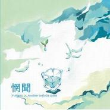

7 Objects in Another Infinite Space
============================

|  |  |
| :--: | :-- |
| [ 7 Objects in Another Infinite Space](https://emumo.xiami.com/album/32778) | **艺人**: [惘闻](../index.md) **语种**: 国语 **唱片公司**: 狐狸尾巴, 噗哧颂 **发行时间**: 2007年04月14日 **专辑类别**: 录音室专辑 **专辑风格**: 摇滚 Rock & Roll, 后摇 Post-Rock **播放数**: 537544 **收藏数**: 1004 **评论数**: 63  |

## 简介

2006 年8月8号这天惘闻带着所有的设备搬进大连的DMMS录音棚，选择大连最热的时候录音完全是出于对夏天喝冰啤酒的一贯追求，控制间的空调坏掉了更增加了我们对啤酒的消耗量。   
  
录音大概持续了一个月左右，每天从下午的5点到晚上10点左右。没有太多的兴奋，更多的认真的完成录音工作。第一次合作的录音师也带给了我们不少想法，所以整体的录音是比较顺利的。   
  
1个月的时间，我们录制完成了10首作品。之后的几个月内，我们甚至都没有去聆听它一遍。一直到07年1月份，我们才决定把它拿出来开始最后的混音工作。   
  
当混音师大辉完成最后的工作后，我们挑出了7首作品，给他起了个名字“7 Objects in Another Infinite Space”，名字背后有着悲痛的故事，但同时看到它时我也会想起一个叫做“Lost Room”的片子。   
  
最终，我们决定把新的这张唱片交给狐狸尾巴唱片，并由中国音乐家唱片出版社发行。总之，同狐狸尾巴合作的开始很偶然，过程很愉快，结果走着瞧。

## 曲目

- [缘](./32778/5aNX3a45b.md)
- [Break the Cars](./32778/kceO974df.md)
- [甜井](./32778/kcePd6a19.md)
- [思乡病](./32778/kceR11728.md)
- [2005.1.26](./32778/fPVO6a429.md)
- [驿站](./32778/fPVQ916dc.md)
- [No Dust at All](./32778/s0wX22678.md)

## 评论

|  |  |  |
| :-- | :-- | :-- |
|  [虾米用户](https://emumo.xiami.com/u/288821963) 安静的后摇狗 2020-12-12 14:25 赞(0) 踩(0) | 
虽然早期 但很好听的一张 也耐听 第一次从刘翔短片得知 我说什么 你懂的
 |
|  [虾米用户](https://emumo.xiami.com/u/440840078) 我还没想好要写什么... 2020-07-06 14:55 赞(0) 踩(0) | 
谢谢
 |
|  [虾米用户](https://emumo.xiami.com/u/112463526) 豆瓣: 坤斤拷    我... 2020-03-17 00:11 赞(0) 踩(0) | 
☆
 |
|  [虾米用户](https://emumo.xiami.com/u/288821963) 安静的后摇狗 2019-07-24 05:53 赞(1) 踩(0) | 
内容已删除
 |
| ⇒ |  [虾米用户](https://emumo.xiami.com/u/375329363) 比永恆多一天 2019-10-24 23:58 赞(0) 踩(0) | 
追
 |
|  [虾米用户](https://emumo.xiami.com/u/352476711) 我还没想好要写什么... 2019-04-15 00:49 赞(0) 踩(0) | 
哦草07年什么神仙
 |
|  [虾米用户](https://emumo.xiami.com/u/18286791) 我还没想好要写什么... 2018-07-17 01:02 赞(2) 踩(0) | 
这张专辑名是个悲伤的故事
 |
| ⇒ |  [虾米用户](https://emumo.xiami.com/u/46123475) 爱甜甜 2018-08-01 19:24 赞(0) 踩(0) | 
Usdb过来的握个手
 |
| ⇒ |  [虾米用户](https://emumo.xiami.com/u/18286791) 我还没想好要写什么... 2018-08-01 21:45 赞(0) 踩(0) | 
<q><b>Wooz说：</b></q>
 |
|  [虾米用户](https://emumo.xiami.com/u/49764735) 。 2018-06-08 15:42 赞(1) 踩(0) | 
甜井是大连甘井子区的意思么？
 |
|  [虾米用户](https://emumo.xiami.com/u/43714694) WeChat：96529... 2018-06-06 10:25 赞(0) 踩(0) | 
吱/音
 |
|  [虾米用户](https://emumo.xiami.com/u/260123122)   2018-01-27 22:15 赞(0) 踩(0) | 
/
 |
|  [虾米用户](https://emumo.xiami.com/u/8202613) 走开 2017-10-30 10:22 赞(1) 踩(0) | 
三天轮着这张入睡。今天轮着这个战斗，配上四个西红柿。。。我特么学习到现在！！！我自己都要感动的哭了啊有木有！！！
 |
|  [虾米用户](https://emumo.xiami.com/u/247358999) 在荒野上跳舞 2017-10-05 12:54 赞(0) 踩(0) | 

 |
|  [虾米用户](https://emumo.xiami.com/u/13057888)  2017-08-15 21:05 赞(1) 踩(0) | 
整盘喜欢
 |
|  [虾米用户](https://emumo.xiami.com/u/8233768) 这家伙很潇洒什么也没留下... 2016-02-19 17:31 赞(0) 踩(0) | 

 |
|  [虾米用户](https://emumo.xiami.com/u/25986892) 最多12个字符 2015-10-27 16:32 赞(0) 踩(0) | 
张岩锋总是这么低调
 |
|  [虾米用户](https://emumo.xiami.com/u/38801880)   2015-10-11 19:38 赞(0) 踩(0) | 
^_^
 |
|  [虾米用户](https://emumo.xiami.com/u/198576)  2015-07-24 11:07 赞(1) 踩(0) | 
how can I not love you, all these years, this very midnight is just the same as before, calming, sinking in, as if nothing has ever changed.
 |
|  [虾米用户](https://emumo.xiami.com/u/35482871)  2015-03-21 11:30 赞(0) 踩(0) | 
好
 |
|  [虾米用户](https://emumo.xiami.com/u/7610981) 虾米不会走 2015-02-11 06:47 赞(0) 踩(0) | 
一场不会失落得甜蜜之旅
 |
| ⇒ |  [虾米用户](https://emumo.xiami.com/u/7610981) 虾米不会走 2015-02-11 06:47 赞(0) 踩(0) | 
的
 |
|  [虾米用户](https://emumo.xiami.com/u/10695504)   2015-02-07 17:59 赞(2) 踩(0) | 
download <a href="http://weibo.com/5061412684/Ba2Um8Qu5" target="_blank" rel="nofollow noreferrer noopener">http://weibo.com/5061412684/Ba2Um8Qu5</a>
 |
|  [虾米用户](https://emumo.xiami.com/u/12957200)   2015-01-07 10:10 赞(0) 踩(0) | 
啓蒙
 |
|  [虾米用户](https://emumo.xiami.com/u/43595653)  2014-12-04 22:48 赞(0) 踩(0) | 
个人理解，《甜井》是老谢最伟大的作品，没有之一。
 |
|  [虾米用户](https://emumo.xiami.com/u/7118858)   2014-11-25 00:10 赞(0) 踩(0) | 
6&amp;#039;23s
 |
|  [虾米用户](https://emumo.xiami.com/u/8764856) 爸爸,我恐怕不会有爱情了 2014-10-27 18:17 赞(0) 踩(0) | 
.....
 |
|  [虾米用户](https://emumo.xiami.com/u/17056273) Amazing! 2014-10-22 09:32 赞(0) 踩(0) | 
牛逼
 |
|  [虾米用户](https://emumo.xiami.com/u/3803809) 人生得意须尽欢 2014-09-28 20:27 赞(0) 踩(0) | 

 |
|  [虾米用户](https://emumo.xiami.com/u/194864)  2014-09-09 23:33 赞(0) 踩(0) | 
躺在沙发上 翘腿 喝啤酒 抽烟 听歌。啧啧..... 老娘理想的生活
 |
|  [虾米用户](https://emumo.xiami.com/u/22431617) 暂无签名~ 2014-07-27 22:51 赞(0) 踩(0) | 
内容已删除
 |
| ⇒ |  [虾米用户](https://emumo.xiami.com/u/95183546) 幻想总把破灭宽恕，破灭却... 2017-05-22 00:37 赞(0) 踩(0) | 
转一张台版全新
 |
|  [虾米用户](https://emumo.xiami.com/u/8662300) 白 2014-04-24 12:05 赞(0) 踩(0) | 
我要融化在这阳光里。
 |
|  [虾米用户](https://emumo.xiami.com/u/34331831)  2014-04-10 13:27 赞(0) 踩(0) | 
还是平
 |
|  [虾米用户](https://emumo.xiami.com/u/3097417)  2014-03-05 13:52 赞(0) 踩(0) | 
那里阳光好温暖
 |
|  [虾米用户](https://emumo.xiami.com/u/11102994) 卡玛大能 2014-02-18 10:41 赞(0) 踩(0) | 
break the cars！
 |
|  [虾米用户](https://emumo.xiami.com/u/3663473)  2014-01-03 23:21 赞(0) 踩(0) | 
闭上眼睛，音乐就会带你去一个地方，那里阳光真灿烂
 |
|  [虾米用户](https://emumo.xiami.com/u/6296124)  2014-01-03 23:13 赞(0) 踩(0) | 
心慢慢融化
 |
|  [虾米用户](https://emumo.xiami.com/u/7685124)  2013-11-05 14:24 赞(0) 踩(0) | 
No dust at all 虽然排在专辑最末，但不失为是一场惊喜
 |
|  [虾米用户](https://emumo.xiami.com/u/5092273)  2013-11-02 20:50 赞(0) 踩(0) | 
不错的后摇，有中国味，说句听起来很装X但实际很直白的话，一听就知道产自中国，就是这个意思。
 |
|  [虾米用户](https://emumo.xiami.com/u/25467009)  2013-10-29 15:27 赞(0) 踩(0) | 
还是这么屌
 |
|  [虾米用户](https://emumo.xiami.com/u/15900712) Sick 2013-10-20 14:11 赞(0) 踩(0) | 
情绪
 |
|  [虾米用户](https://emumo.xiami.com/u/7208075) 隐居修炼 2013-08-20 06:00 赞(0) 踩(0) | 
好听,就是好听,没有理由!!
 |
|  [虾米用户](https://emumo.xiami.com/u/355865) Let it go, l... 2013-06-13 12:45 赞(0) 踩(0) | 
圈P圈C：PutsSound Records（噗哧颂）
 |
|  [虾米用户](https://emumo.xiami.com/u/7090525)  2013-06-11 23:16 赞(14) 踩(0) | 
惘闻真的是治愈系，昨晚痛经难耐结果听着这张砖大概还没听没到思想病就睡着了诶...今晚继续，明天见。
 |
|  [虾米用户](https://emumo.xiami.com/u/1036823) 无风放筝 2013-06-08 02:45 赞(0) 踩(0) | 
六月九号 重庆 来温习功课
 |
| ⇒ |  [虾米用户](https://emumo.xiami.com/u/6258320) CORE & POSTR... 2013-06-10 01:24 赞(0) 踩(0) | 
哥们话说重庆场有无出纸票。。
 |
|  [虾米用户](https://emumo.xiami.com/u/4043410) 唯夜色浪漫 2013-05-05 23:04 赞(0) 踩(0) | 
哎哟，不错喔！
 |
|  [虾米用户](https://emumo.xiami.com/u/2851477)  2013-04-28 12:37 赞(0) 踩(0) | 
好喜欢
 |
|  [虾米用户](https://emumo.xiami.com/u/7122825)  2013-04-25 18:50 赞(0) 踩(0) | 
@Dude张振威  HOPE！
 |
|  [虾米用户](https://emumo.xiami.com/u/6325087)  2013-04-23 11:25 赞(0) 踩(0) | 
最值得收藏的一张专辑
 |
|  [虾米用户](https://emumo.xiami.com/u/12860581) xia'mi我回来啦 2013-03-29 22:40 赞(0) 踩(0) | 
break the cars！！！
 |
|  [虾米用户](https://emumo.xiami.com/u/560664)  2012-10-19 11:56 赞(0) 踩(0) | 
❤
 |
|  [虾米用户](https://emumo.xiami.com/u/11004) 这家伙很聪明什么也没留下... 2012-07-20 20:29 赞(0) 踩(0) | 
xia zai <a href="http://jidangang.com/post/209" target="_blank" rel="nofollow noreferrer noopener">http://jidangang.com/post/209</a>
 |
| ⇒ |  [虾米用户](https://emumo.xiami.com/u/13063788)  2013-02-20 11:12 赞(0) 踩(0) | 
小伙子 进不去了
 |
|  [虾米用户](https://emumo.xiami.com/u/359245) 你听到的喜是我耳朵里的悲 2012-06-25 13:13 赞(0) 踩(0) | 
in memory of XuQian,wish you stay with peace in another space
 |
|  [虾米用户](https://emumo.xiami.com/u/4372109)  2012-06-02 14:42 赞(0) 踩(0) | 
第一次听break听得我浑身颤抖
 |
|  [虾米用户](https://emumo.xiami.com/u/5971058) *Fish Kiss* 2012-03-19 11:39 赞(0) 踩(0) | 
支持国产
 |
|  [虾米用户](https://emumo.xiami.com/u/4788608) 世界太小，無處可滾。 2012-03-01 19:44 赞(0) 踩(0) | 
我難受。
 |
|  [虾米用户](https://emumo.xiami.com/u/7960941) 我还没想好要写什么... 2012-02-19 05:47 赞(0) 踩(0) | 
大连
 |
|  [虾米用户](https://emumo.xiami.com/u/785431) 我还没想好要写什么... 2012-02-06 17:47 赞(0) 踩(0) | 
Break the Cars
 |
|  [虾米用户](https://emumo.xiami.com/u/2366698) 现在只听歌不说话 2011-11-26 20:26 赞(0) 踩(0) | 
&amp;lt;break the cars&amp;gt;无疑是整张里最好的，然后就是《驿站》了...
 |
|  [虾米用户](https://emumo.xiami.com/u/265666)  2011-08-07 21:44 赞(1) 踩(0) | 
当年MP3里的常驻《break the car》，非常非常的适合现场，想到这里都忍不住心潮澎湃！
 |
|  [虾米用户](https://emumo.xiami.com/u/753500)  2011-07-11 03:28 赞(0) 踩(0) | 
&amp;lt;缘&amp;gt; &amp;lt;Break the Cars&amp;gt; &amp;lt;思乡病&amp;gt; &amp;lt;No Dust at All&amp;gt;
 |
|  [虾米用户](https://emumo.xiami.com/u/1883763)  失败的人生 2011-05-26 09:45 赞(4) 踩(0) | 
一个我听了10年的乐队、一个我超喜欢的乐队、一个让我重新认识我自己的乐队、强烈推荐：潮、甜井、Break the Cars ，我认为中国有这样的乐队，牛，还有花伦、48V、甜梅号等等都不错~
 |
