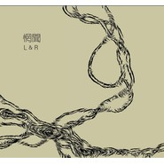

L&R
============================

|  |  |
| :--: | :-- |
| [ L&R](https://emumo.xiami.com/album/376528) | **艺人**: [惘闻](../index.md) **语种**: 国语 **唱片公司**: 狐狸尾巴 **发行时间**: 2010年04月09日 **专辑类别**: 录音室专辑 **专辑风格**: 摇滚 Rock & Roll, 后摇 Post-Rock **播放数**: 669894 **收藏数**: 1509 **评论数**: 135  |

## 简介

这张于2009年秋天在大连New Vision录音棚由录音师柳丕刚录制完成的惘闻最新唱片日前已经在加拿大蒙特利尔著名的Godspeed You! Black Emperor老巢Hotel 2 Tango完成了全部的缩混工作，而担任这张唱片缩混师的正是Godspeed You! Black Emperor的吉他手Efrim。唱片的母带目前尚在蒙特利尔的Grey Marketing Mastering Studio由Harris Newman做最终的后制工作，4月初，惘闻这张全新的唱片将由狐狸尾巴唱片正式推出。

## 曲目

- [童篇](./376528/8Gb0ODee6f8.md)
- [近景 ](./376528/xLq2aeac067.md)
- [焦虑抑制剂 ](./376528/xLq2afc31d4.md)
- [←M→ ](./376528/xLq2aga7a4e.md)
- [悬在时间轴上 ](./376528/JAMzDr24302.md)
- [合乐 ](./376528/xLq2aia5ecd.md)
- [凡士林](./376528/mQ53l959921.md)

## 评论

|  |  |  |  |
| :-- | :-- | :-- | :-- |
|  [虾米用户](https://emumo.xiami.com/u/380388211) 我的耳朵不会骗我 2020-10-29 16:27 赞(0) 踩(0) | 
，
 |
|  [虾米用户](https://emumo.xiami.com/u/112463526) 豆瓣: 坤斤拷    我... 2020-08-25 15:46 赞(0) 踩(0) | 

 |
|  [虾米用户](https://emumo.xiami.com/u/440840078) 我还没想好要写什么... 2020-07-06 14:55 赞(0) 踩(0) | 
谢谢
 |
|  [虾米用户](https://emumo.xiami.com/u/4234256)  2019-12-22 11:00 赞(0) 踩(0) | 
出色
 |
|  [虾米用户](https://emumo.xiami.com/u/3211822) 再见， 2019-08-14 02:23 赞(0) 踩(0) | 
说实话还是老专辑更惘一点
 |
|  [虾米用户](https://emumo.xiami.com/u/32231879) Eine kosmisc... 2019-05-25 16:39 赞(1) 踩(0) | 
謝玉崗盤改錐
 |
|  [虾米用户](https://emumo.xiami.com/u/42963872) 我还没想好要写什么... 2019-01-03 05:08 赞(1) 踩(0) | 
-
 |
|  [虾米用户](https://emumo.xiami.com/u/996277) ‏‏ 2018-09-08 08:33 赞(0) 踩(0) | 
哇哇哇
 |
|  [虾米用户](https://emumo.xiami.com/u/4234256)  2018-05-06 23:21 赞(0) 踩(0) | 
惘闻没让我失望过 期待今年八月份的新专辑
 |
|  [虾米用户](https://emumo.xiami.com/u/4234256)  2018-05-06 23:14 赞(1) 踩(0) | 
这张发现得有点晚了 不过倒是个惊喜 
 |
|  [虾米用户](https://emumo.xiami.com/u/47570236)  　⠀ 2017-07-29 00:10 赞(0) 踩(0) | 
近景
 |
|  [虾米用户](https://emumo.xiami.com/u/260123122)   2017-06-06 20:11 赞(0) 踩(0) | 
M
 |
|  [虾米用户](https://emumo.xiami.com/u/3751787) Comores été  2016-12-07 10:01 赞(0) 踩(0) | 
nando pedro pedra
 |
|  [虾米用户](https://emumo.xiami.com/u/47964271)   2016-10-24 19:02 赞(0) 踩(0) | 
竟然没听过
 |
|  [虾米用户](https://emumo.xiami.com/u/2847661) 我爱摇滚乐 2016-05-10 08:18 赞(0) 踩(0) | 
这是一张非常非常牛逼的专辑！
 |
|  [虾米用户](https://emumo.xiami.com/u/8233768) 这家伙很潇洒什么也没留下... 2016-05-08 11:29 赞(0) 踩(0) | 

 |
|  [虾米用户](https://emumo.xiami.com/u/2279444) 爱在左，同情在右。 2016-02-13 17:53 赞(1) 踩(0) | 
我有这张CD唱片
 |
|  [虾米用户](https://emumo.xiami.com/u/38801880)   2015-10-11 19:39 赞(1) 踩(0) | 
^_^
 |
|  [虾米用户](https://emumo.xiami.com/u/42361202)  2015-10-11 16:42 赞(0) 踩(0) | 
好像在惘闻的音乐里睡去，一觉不醒
 |
|  [虾米用户](https://emumo.xiami.com/u/8097574) 可是我的病就是没有感觉 2015-05-03 14:31 赞(0) 踩(0) | 

 |
|  [虾米用户](https://emumo.xiami.com/u/17733529)   2015-01-22 17:39 赞(0) 踩(0) | 
鼓在眼前 不是带感的境界了
 |
|  [虾米用户](https://emumo.xiami.com/u/759691) 摇 2014-06-22 00:44 赞(0) 踩(0) | 
Left or Right
 |
|  [虾米用户](https://emumo.xiami.com/u/2229698)   2014-06-08 00:27 赞(18) 踩(0) | 
其实整张专辑歌曲的排序是按照人的一生由年少到老年的推进。童稚的童篇，近景的年少，焦虑抑制剂的青春期躁动，←M→的事业权衡，悬在时间轴上的人生思考，合乐的家庭构建，凡士林原谅我还是没能理解╮(╯_╰)╭
 |
| ⇒ |  [虾米用户](https://emumo.xiami.com/u/25232390)  2014-07-07 21:31 赞(0) 踩(0) | 
凡士林应该是光荣以后。
 |
| ⇒ |  [虾米用户](https://emumo.xiami.com/u/744308)  2014-11-06 12:24 赞(0) 踩(0) | 
<q><b>AngusShen说：</b></q>
 |
| ⇒ |  [虾米用户](https://emumo.xiami.com/u/25986892) 最多12个字符 2015-07-23 15:34 赞(0) 踩(0) | 
凡士林一样粘稠的垂死状态 
 |
| ⇒ |  [虾米用户](https://emumo.xiami.com/u/26918209)   2015-09-14 23:03 赞(0) 踩(0) | 
埋在凡士林
 |
| ⇒ |  [虾米用户](https://emumo.xiami.com/u/8510961)  2016-04-26 22:27 赞(0) 踩(0) | 
凡士林是防腐剂，可以用来保存标本和尸，体。
 |
| ⇒ |  [虾米用户](https://emumo.xiami.com/u/1820887) 与虾米共生死~~ 2017-08-07 14:48 赞(0) 踩(0) | 
凡士林是潤滑用，是不是說他們不再有棱角了呢~~
 |
| ⇒ |  [虾米用户](https://emumo.xiami.com/u/1886077) 同归于尽 2020-05-19 00:06 赞(0) 踩(0) | 
年纪大了皮肤干燥上点润肤露
 |
|  [虾米用户](https://emumo.xiami.com/u/12860581) xia'mi我回来啦 2014-04-23 21:49 赞(2) 踩(0) | 
简介吓死！
 |
|  [虾米用户](https://emumo.xiami.com/u/34352589) 一个每天在为生计奔波的农... 2014-03-22 19:37 赞(0) 踩(0) | 
越来越喜欢了
 |
|  [虾米用户](https://emumo.xiami.com/u/2229698)   2014-02-04 13:11 赞(9) 踩(0) | 
整张听完，发觉惘闻这张黑帝的味道特别重。一看简介吓尿了
 |
| ⇒ |  [虾米用户](https://emumo.xiami.com/u/12860581) xia'mi我回来啦 2014-04-23 21:49 赞(0) 踩(0) | 
同感！
 |
|  [虾米用户](https://emumo.xiami.com/u/11213050)   2014-01-04 10:34 赞(0) 踩(0) | 
能勾起回忆及未来的不断联想
 |
|  [虾米用户](https://emumo.xiami.com/u/5092273)  2013-12-13 09:30 赞(0) 踩(0) | 
这张不错
 |
|  [虾米用户](https://emumo.xiami.com/u/10511613) 我还没想好要写什么... 2013-11-07 12:22 赞(0) 踩(0) | 
治愈系
 |
|  [虾米用户](https://emumo.xiami.com/u/7208075) 隐居修炼 2013-08-27 16:49 赞(0) 踩(0) | 
好听!!!!!!!!!!!!!!
 |
|  [虾米用户](https://emumo.xiami.com/u/4275776) 虾米音质检测督查账号 2013-07-02 21:34 赞(11) 踩(0) | 
#音质报告#已更新合格320K~
 |
|  [虾米用户](https://emumo.xiami.com/u/8733110) 电子、人声 2013-06-09 02:59 赞(1) 踩(0) | 
2009年秋天在大连New Vision录音棚由录音师柳丕刚录制
 |
|  [虾米用户](https://emumo.xiami.com/u/267467)  2013-05-22 11:10 赞(0) 踩(0) | 
比《0.7》要好，惘闻的现场非常值得观赏。
 |
|  [虾米用户](https://emumo.xiami.com/u/4314148) NO贪 NO嗔 NO痴 2013-05-06 19:20 赞(0) 踩(0) | 
还是有些许躁
 |
|  [虾米用户](https://emumo.xiami.com/u/4741112)   2013-04-13 16:32 赞(0) 踩(0) | 
10 长沙
 |
|  [虾米用户](https://emumo.xiami.com/u/7246378) 酒腻子 2013-03-28 15:37 赞(0) 踩(0) | 
postrock-made in china
 |
|  [虾米用户](https://emumo.xiami.com/u/699194) 我还没想好要写什么... 2013-02-10 21:42 赞(1) 踩(0) | 
每次听都会全身融化
 |
|  [虾米用户](https://emumo.xiami.com/u/2412165)  2013-01-30 01:23 赞(1) 踩(0) | 
美疯了
 |
|  [虾米用户](https://emumo.xiami.com/u/5696091)  2012-12-29 20:22 赞(0) 踩(0) | 
好棒！！！！！！！！！！！！！！！
 |
|  [虾米用户](https://emumo.xiami.com/u/11812857)  2012-12-28 13:44 赞(0) 踩(0) | 
** <a href="http://ref.so/caj5" target="_blank" rel="nofollow noreferrer noopener">http://ref.so/caj5</a>
 |
|  [虾米用户](https://emumo.xiami.com/u/1698736)  2012-12-19 22:42 赞(0) 踩(0) | 
很好听的一张
 |
|  [虾米用户](https://emumo.xiami.com/u/155947) 一期一会 2012-11-17 15:26 赞(0) 踩(0) | 
向左走？向右走？←M→ 置若罔闻的家伙
 |
|  [虾米用户](https://emumo.xiami.com/u/2730470)  2012-11-17 12:11 赞(0) 踩(0) | 
吉他手石河子的  老乡 ..
 |
|  [虾米用户](https://emumo.xiami.com/u/8628178) 好好做个红苹果 2012-11-10 17:05 赞(2) 踩(0) | 
那么好的post-rock。《惘闻》最喜欢的一张。想起一零年的那个冬天，心里焦躁压抑，此时心情完全不一样，蜕了一层皮，恣意盎然起来。但现在听着依旧很带感。
 |
|  [虾米用户](https://emumo.xiami.com/u/8628178) 好好做个红苹果 2012-11-10 17:02 赞(0) 踩(0) | 
惘闻最喜欢的一张
 |
|  [虾米用户](https://emumo.xiami.com/u/5179289)  2012-11-07 10:25 赞(0) 踩(0) | 
太棒了，震惊了我，元方，你怎么看
 |
|  [虾米用户](https://emumo.xiami.com/u/3006308)  2012-10-15 21:52 赞(0) 踩(0) | 
GOOD！
 |
|  [虾米用户](https://emumo.xiami.com/u/6441252)  2012-09-26 14:41 赞(2) 踩(0) | 
中国竟然有如此优秀的后摇，简直震惊了个奶奶了！
 |
|  [虾米用户](https://emumo.xiami.com/u/10677649)  2012-09-20 16:55 赞(0) 踩(0) | 
惘闻...........
 |
|  [虾米用户](https://emumo.xiami.com/u/10499112)  2012-09-04 20:55 赞(0) 踩(0) | 
这张最近几天晚上都会听一遍
 |
| ⇒ |  [虾米用户](https://emumo.xiami.com/u/6410243) 我还没想好要写什么... 2012-10-16 19:19 赞(0) 踩(0) | 
惹 我也喜欢他
 |
|  [虾米用户](https://emumo.xiami.com/u/164599) 打死我!我想死! 2012-07-27 22:55 赞(1) 踩(0) | 
Life &amp;amp; Right
 |
| ⇒ |  [虾米用户](https://emumo.xiami.com/u/321360) Segmentation 2012-07-29 03:25 赞(0) 踩(0) | 
什么意思  生命和权利？
 |
| ⇒ |  [虾米用户](https://emumo.xiami.com/u/164599) 打死我!我想死! 2012-07-29 11:02 赞(0) 踩(0) | 
<q><b>段错误 (核心已转储)说：</b></q>
 |
| ⇒ |  [虾米用户](https://emumo.xiami.com/u/321360) Segmentation 2012-07-29 13:17 赞(0) 踩(0) | 
<q><b>阿卡撒儿.说：</b></q>
 |
| ⇒ |  [虾米用户](https://emumo.xiami.com/u/164599) 打死我!我想死! 2012-07-30 10:02 赞(0) 踩(0) | 
<q><b>段错误 (核心已转储)说：</b></q>
 |
| ⇒ |  [虾米用户](https://emumo.xiami.com/u/32051445) 女孩儿的歌。 永爱虾米 2018-10-21 19:15 赞(0) 踩(0) | 
404了 可惜
 |
|  [虾米用户](https://emumo.xiami.com/u/164599) 打死我!我想死! 2012-07-27 22:54 赞(0) 踩(0) | 
Life &amp;amp; Right.
 |
|  [虾米用户](https://emumo.xiami.com/u/849822) 一切都要准备 2012-07-06 09:39 赞(0) 踩(0) | 
清心的感觉
 |
|  [虾米用户](https://emumo.xiami.com/u/9589135)  2012-06-26 23:11 赞(0) 踩(0) | 
安静的调却有丰富的画面感，闭上眼睛，静静聆听~
 |
|  [虾米用户](https://emumo.xiami.com/u/1414853)  2012-06-21 12:54 赞(0) 踩(0) | 
最爱近景
 |
|  [虾米用户](https://emumo.xiami.com/u/666000) 我会永远爱你，虾米的朋友... 2012-06-17 17:43 赞(0) 踩(0) | 
记得是和兔子在回声，果断的买了这张专辑，大爱后摇止痛片儿
 |
|  [虾米用户](https://emumo.xiami.com/u/4658)  2012-06-13 20:07 赞(0) 踩(0) | 
这张专辑竟然叫「L &amp;amp; R」诶…
 |
|  [虾米用户](https://emumo.xiami.com/u/3441287)  2012-06-11 23:57 赞(0) 踩(0) | 
听不够他们的现场，怎么办
 |
|  [虾米用户](https://emumo.xiami.com/u/9436206)  2012-06-10 19:41 赞(0) 踩(0) | 
国产摇滚的代表作！
 |
| ⇒ |  [虾米用户](https://emumo.xiami.com/u/1447058) 已迁移至网易云，祝好——... 2012-06-11 11:32 赞(0) 踩(0) | 
后摇滚不是摇滚 切记
 |
| ⇒ |  [虾米用户](https://emumo.xiami.com/u/9436206)  2012-06-11 18:52 赞(0) 踩(0) | 
<q><b>暗叉说：</b></q>
 |
| ⇒ |  [虾米用户](https://emumo.xiami.com/u/321360) Segmentation 2012-12-06 16:09 赞(0) 踩(0) | 
<q><b>暗叉说：</b></q>
 |
| ⇒ |  [虾米用户](https://emumo.xiami.com/u/1447058) 已迁移至网易云，祝好——... 2012-12-06 16:23 赞(0) 踩(0) | 
<q><b>段错误 (核心已转储)说：</b></q>
 |
|  [虾米用户](https://emumo.xiami.com/u/9346796)  2012-06-01 13:58 赞(0) 踩(0) | 
安静坚守
 |
|  [虾米用户](https://emumo.xiami.com/u/9325585)  2012-05-30 10:28 赞(0) 踩(0) | 
后摇滚之曙光
 |
|  [虾米用户](https://emumo.xiami.com/u/224904)  2012-05-27 19:58 赞(0) 踩(0) | 
= =一周内被两个毫不相关的人推荐了
 |
|  [虾米用户](https://emumo.xiami.com/u/1404478)  2012-05-21 17:40 赞(0) 踩(0) | 
从机长那听说的。
 |
|  [虾米用户](https://emumo.xiami.com/u/3394683)  2012-04-18 01:18 赞(0) 踩(0) | 
国产后摇砥柱
 |
|  [虾米用户](https://emumo.xiami.com/u/1936256)  2012-03-24 20:01 赞(0) 踩(0) | 
纯音乐
 |
|  [虾米用户](https://emumo.xiami.com/u/59223) 落之木然 2012-03-16 15:21 赞(0) 踩(0) | 
泪&amp;amp;乳
 |
|  [虾米用户](https://emumo.xiami.com/u/2440056) 不开心就是尼玛不开心 2012-03-09 23:41 赞(0) 踩(0) | 
三个字太棒了 说多了都是泪
 |
|  [虾米用户](https://emumo.xiami.com/u/8180025)  2012-02-25 18:00 赞(0) 踩(0) | 
好听
 |
|  [虾米用户](https://emumo.xiami.com/u/3776314)  2012-02-20 11:19 赞(0) 踩(0) | 
MISS.
 |
|  [虾米用户](https://emumo.xiami.com/u/4788608) 世界太小，無處可滾。 2012-01-16 22:16 赞(0) 踩(0) | 
我又開始了從頭到尾。
 |
|  [虾米用户](https://emumo.xiami.com/u/2118043)  2011-12-27 11:35 赞(0) 踩(0) | 
中国很好的后摇，很意外
 |
|  [虾米用户](https://emumo.xiami.com/u/2420268) 温婉主义迂回而上 2011-12-17 17:20 赞(0) 踩(0) | 
遗忘和记忆
 |
|  [虾米用户](https://emumo.xiami.com/u/1644168)   2011-12-11 13:03 赞(0) 踩(0) | 
好。
 |
|  [虾米用户](https://emumo.xiami.com/u/1644168)   2011-12-11 13:02 赞(0) 踩(0) | 
惘闻
 |
|  [虾米用户](https://emumo.xiami.com/u/7137787)  2011-12-07 14:03 赞(0) 踩(0) | 
动听的旋律
 |
|  [虾米用户](https://emumo.xiami.com/u/6705686)  2011-11-11 19:16 赞(0) 踩(0) | 
萎
 |
|  [虾米用户](https://emumo.xiami.com/u/5622694) 鼻涕邋遢拍电影 2011-10-31 21:45 赞(0) 踩(0) | 
感觉不如前几张好了 但依然很喜欢
 |
|  [虾米用户](https://emumo.xiami.com/u/1126943)  2011-09-19 01:27 赞(0) 踩(0) | 
前天收到了 感谢小赵相送！！
 |
|  [虾米用户](https://emumo.xiami.com/u/342052)   2011-09-01 23:58 赞(0) 踩(0) | 
清冷的声音
 |
|  [虾米用户](https://emumo.xiami.com/u/265666)  2011-08-07 21:40 赞(0) 踩(0) | 
自上一张专辑《IV》之后，曲风转为冷色，音乐水准依然保持在高水平，赞。
 |
|  [虾米用户](https://emumo.xiami.com/u/2533816) 我还没想好要写什么... 2011-07-23 15:19 赞(0) 踩(0) | 
今晚不能陪王教去小酒馆听电子核，献上中国少有的后摇赔罪~~~~！
 |
|  [虾米用户](https://emumo.xiami.com/u/753500)  2011-07-11 08:30 赞(0) 踩(0) | 
&amp;lt;全部&amp;gt;
 |
|  [虾米用户](https://emumo.xiami.com/u/3064501)  2011-06-30 23:56 赞(0) 踩(0) | 
我一直想找的就是这种震撼的纯音乐
 |
|  [虾米用户](https://emumo.xiami.com/u/2650371)  2011-06-24 06:41 赞(0) 踩(0) | 
太棒了
 |
|  [虾米用户](https://emumo.xiami.com/u/4229010)  2011-06-17 19:15 赞(0) 踩(0) | 
19：13
 |
|  [虾米用户](https://emumo.xiami.com/u/2220281) 一个乐队和半个城市 2011-06-16 14:24 赞(0) 踩(0) | 
一年以后翻出来听.重温一下夏日.
 |
|  [虾米用户](https://emumo.xiami.com/u/3369197) May the lost... 2011-04-26 18:37 赞(0) 踩(0) | 
垂死的未来
 |
|  [虾米用户](https://emumo.xiami.com/u/1332274)  2011-03-30 17:01 赞(0) 踩(0) | 
近期最爱
 |
|  [虾米用户](https://emumo.xiami.com/u/2399706)  2011-03-30 11:40 赞(0) 踩(0) | 
3/30/2011 11:39
 |
|  [虾米用户](https://emumo.xiami.com/u/683540)  2011-03-27 21:59 赞(0) 踩(0) | 
后摇
 |
|  [虾米用户](https://emumo.xiami.com/u/2546922)  2011-02-17 21:32 赞(0) 踩(0) | 
很好的东西纯音乐
 |
|  [虾米用户](https://emumo.xiami.com/u/2546922)  2011-02-17 21:32 赞(0) 踩(0) | 
喜欢
 |
|  [虾米用户](https://emumo.xiami.com/u/816626) Nothing spec... 2011-01-28 22:44 赞(0) 踩(0) | 
每次听 近景  整个人就会变得很安静。
 |
|  [虾米用户](https://emumo.xiami.com/u/2650371)  2011-01-28 06:11 赞(0) 踩(0) | 
近景非常出色啊……
 |
| ⇒ |  [虾米用户](https://emumo.xiami.com/u/2546922)  2011-02-17 21:33 赞(0) 踩(0) | 
近景？什么意思？
 |
|  [虾米用户](https://emumo.xiami.com/u/2042375)  2011-01-13 21:42 赞(0) 踩(0) | 
惘闻
 |
|  [虾米用户](https://emumo.xiami.com/u/573243)  2010-07-23 17:50 赞(0) 踩(0) | 
在上一张让人惊喜的人声尝试后，惘闻的第五张专辑《L&amp;amp;R》彻底回归了以传统的三大件为主，以及画龙点睛的诸如手鼓、提琴等乐器的辅助阶段。另一方面，惘闻在旋律和氛围的主体之余，还有着即兴化的有意尝试。意境也好，还是旋律也罢，都没有落于下风。无论是乐队从专辑里所表达的技术，或是所尝试的方向，都可以看出他们已经将自己和国内的其他后摇滚乐队之间的差距又远远地拉开了一大截。
 |
|  [虾米用户](https://emumo.xiami.com/u/3773)  2010-06-06 15:39 赞(0) 踩(0) | 
贝斯手很可爱
 |
| ⇒ |  [虾米用户](https://emumo.xiami.com/u/29) 耍中偶得 2010-10-29 11:28 赞(0) 踩(0) | 
铮子背向观众
 |
|  [虾米用户](https://emumo.xiami.com/u/157815) 日光之下 并无新事。 2010-05-28 23:22 赞(0) 踩(0) | 
现场贝斯手一直背对观众，也不愿签名。
 |
| ⇒ |  [虾米用户](https://emumo.xiami.com/u/584186)  2010-05-28 23:31 赞(0) 踩(0) | 
＂惘闻＂的含义就是不在乎外界的看法，也没有人会了解到．所以应当理解他们的低调做法．
 |
| ⇒ |  [虾米用户](https://emumo.xiami.com/u/157815) 日光之下 并无新事。 2010-05-28 23:40 赞(0) 踩(0) | 
<q><b>童心一说：</b></q>
 |
|  [虾米用户](https://emumo.xiami.com/u/57912) 我还没想好要写什么... 2010-05-23 11:04 赞(0) 踩(0) | 
现场绝对更好啊惘闻的现场真的没话说
 |
|  [虾米用户](https://emumo.xiami.com/u/606976) 南来北往，人生在世，有火... 2010-05-15 18:46 赞(0) 踩(0) | 
永不放弃生的信仰—惘闻现场归来记
 |
|  [虾米用户](https://emumo.xiami.com/u/816626) Nothing spec... 2010-04-20 21:04 赞(0) 踩(0) | 
还是专辑听着会舒服些吧
 |
| ⇒ |  [虾米用户](https://emumo.xiami.com/u/211129) 灼眼的阳光,仿佛臻腻的梦... 2010-05-17 20:06 赞(0) 踩(0) | 
我觉得现场好~
 |
| ⇒ |  [虾米用户](https://emumo.xiami.com/u/29) 耍中偶得 2010-07-21 17:17 赞(0) 踩(0) | 
现场有某种气场会把你吸进去的专辑的气场可能就要小一些了
 |
|  [虾米用户](https://emumo.xiami.com/u/267467)  2010-04-20 21:01 赞(0) 踩(0) | 
我倒是不会买，不过惘闻6月来昆明我会去看，票价贵点也能接受。
 |
|  [虾米用户](https://emumo.xiami.com/u/658523)  2010-04-15 01:50 赞(0) 踩(0) | 
人家正在专辑首发巡演呢，淘宝上也买的到，能不能不要这么快就放出来！！！知不知道一张独立唱片放了多大的心血和感情在里面哪天真逼得没人做音乐了看你们听什么
 |
| ⇒ |  [虾米用户](https://emumo.xiami.com/u/179438)  2010-04-15 19:49 赞(0) 踩(0) | 
喜欢的试听完了还是会买的，提供试听没什么不好
 |
| ⇒ |  [虾米用户](https://emumo.xiami.com/u/396650)   2010-04-17 16:49 赞(0) 踩(0) | 
<q><b>missixthed说：</b></q>
 |
| ⇒ |  [虾米用户](https://emumo.xiami.com/u/179438)  2010-04-17 16:54 赞(0) 踩(0) | 
<q><b>Eme说：</b></q>
 |
| ⇒ |  [虾米用户](https://emumo.xiami.com/u/396650)   2010-04-17 17:55 赞(0) 踩(0) | 
<q><b>missixthed说：</b></q>
 |
| ⇒ |  [虾米用户](https://emumo.xiami.com/u/29) 耍中偶得 2010-07-21 17:17 赞(0) 踩(0) | 
喜欢的 听了还是会买的
 |
| ⇒ |  [虾米用户](https://emumo.xiami.com/u/29) 耍中偶得 2010-07-21 17:18 赞(0) 踩(0) | 
<q><b>Eme说：</b></q>
 |
|  [虾米用户](https://emumo.xiami.com/u/85788)  2010-04-12 14:40 赞(0) 踩(0) | 
听专辑和听现场感觉不同 但都一样出色
 |
| ⇒ |  [虾米用户](https://emumo.xiami.com/u/606976) 南来北往，人生在世，有火... 2010-05-15 18:43 赞(0) 踩(0) | 
才从昨天晚上重庆的现场回来其实后半段的时候耳朵都有些木了  第一排的缘故虾米上能遇见年上的人还真是难得
 |
