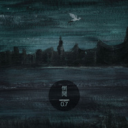

0.7
============================

|  |  |
| :--: | :-- |
| [ 0.7](https://emumo.xiami.com/album/511908) | **艺人**: [惘闻](../index.md) **语种**: 其他 **唱片公司**: Weary Bird **发行时间**: 2012年06月08日 **专辑类别**: 录音室专辑 **专辑风格**: 后摇 Post-Rock **播放数**: 1691488 **收藏数**: 2871 **评论数**: 352  |

## 简介

惘闻全新专辑经过再三的跳票这次终于真的来了!这依然是一张纯器乐的惘闻风格唱片，但较之以往的作品，惘闻新作愈发成熟自然，情绪表现的更加自如，各种不同的音乐元素均为其所用，它像催眠术般将听者与不同的记忆体验紧紧缠绕在了一起，就这样惘闻又一次引领大家进入自我内心深处，做一次伤心与喜悦皆有的旅行。将以8面豪华Digipak环保装CD(限量1000)以及12寸180克高质量黑胶(限量300)的形式发行!同时,惘闻也将携带新专辑开始新一轮的全国巡演,目前已经确定的城市有:北京、天津、上海 、南京、武汉、重庆、成都 7th studio album from the long serving Chinese Post Rock masters Wangwen! Like their other works, this is an instrumental Wangwen-ish album; but unlike their former works, this album is more mature and more natural, emotions flow from beginning to the end. In this album Wangwen uses different kinds of musical elements to tightly intertwine you with different memorial experiences like a hypnotizor. Let Wangwen bring you into the depth of your soul one more time, and get ready for a journey with heartbreak and ecstasy. Released on 8-Panel Digipak CD (Lim. 1000 and 12”Vinyl (Lim. 300)!

## 曲目

- [2012](./511908/mQBSEo72678.md)
- [Rain Watcher看雨](./511908/mQBSEp562fe.md)
- [Lonely God浪味仙](./511908/xLwR2Qd70d6.md)
- [Angelo's Portrait安其罗的画像](./511908/8GhQr119557.md)
- [Absent Minded Theme健忘者主题](./511908/xLwR2Sa47d5.md)
- [Dragon in the Pool龙王塘](./511908/bCkFJkX4a92e.md)
- [Seasons四季歌](./511908/mQBSEu79442.md)

## 评论

|  |  |  |
| :-- | :-- | :-- |
|  [虾米用户](https://emumo.xiami.com/u/57019130) 我还没想好要写什么... 2020-10-27 15:54 赞(0) 踩(0) | 
听了那么多年 还是2012的这张专辑最合我心
 |
|  [虾米用户](https://emumo.xiami.com/u/440840078) 我还没想好要写什么... 2020-07-06 14:55 赞(0) 踩(0) | 
谢谢
 |
|  [虾米用户](https://emumo.xiami.com/u/112463526) 豆瓣: 坤斤拷    我... 2020-03-22 22:46 赞(0) 踩(0) | 
:)
 |
|  [虾米用户](https://emumo.xiami.com/u/18768451)  2020-03-13 22:59 赞(0) 踩(0) | 
Lost my description
 |
|  [虾米用户](https://emumo.xiami.com/u/364885617) 力量，不复存在 2020-02-07 03:46 赞(0) 踩(0) | 
我听不出什么技巧，也说不出什么优点。只是觉得，好听极了
 |
|  [虾米用户](https://emumo.xiami.com/u/73740960)  2020-01-04 11:04 赞(0) 踩(0) | 
还是老专辑有调子
 |
|  [虾米用户](https://emumo.xiami.com/u/400785289) 我还没想好要写什么... 2019-11-11 22:42 赞(1) 踩(0) | 
丰富有层次，舒服又过瘾。
 |
|  [虾米用户](https://emumo.xiami.com/u/6667032)   2019-10-17 00:26 赞(0) 踩(0) | 
情绪的出口
 |
|  [虾米用户](https://emumo.xiami.com/u/246720) 感谢一路陪伴，2Ever... 2019-07-19 01:11 赞(1) 踩(0) | 
sigar,你能听到吗？声音太大。也怕你听不到嘶吼
 |
|  [虾米用户](https://emumo.xiami.com/u/50315293)  2019-07-17 08:09 赞(1) 踩(0) | 
后摇巅峰
 |
|  [虾米用户](https://emumo.xiami.com/u/251780414) 蓝调,爵士,电子,咽嗓,... 2019-07-02 17:47 赞(0) 踩(0) | 
有许多影子……唯盼不要气屡，向前走。继续努力創作的事业。
 |
|  [虾米用户](https://emumo.xiami.com/u/43704014)  2019-05-11 23:41 赞(1) 踩(0) | 
个人感觉国内最牛逼的后摇专辑
 |
|  [虾米用户](https://emumo.xiami.com/u/16337726)  2019-04-08 18:52 赞(1) 踩(0) | 
)
 |
|  [虾米用户](https://emumo.xiami.com/u/414909769)  2019-02-19 14:28 赞(0) 踩(0) | 
喜欢
 |
|  [虾米用户](https://emumo.xiami.com/u/42963872) 我还没想好要写什么... 2019-01-03 05:07 赞(0) 踩(0) | 
-
 |
|  [虾米用户](https://emumo.xiami.com/u/215911403) もも 2018-12-29 14:59 赞(0) 踩(0) | 
好
 |
|  [虾米用户](https://emumo.xiami.com/u/139076708)   2018-11-26 12:35 赞(0) 踩(0) | 
今晚见
 |
|  [虾米用户](https://emumo.xiami.com/u/21880854) 救われる 2018-11-26 10:28 赞(0) 踩(0) | 
我24/7的消極
 |
|  [虾米用户](https://emumo.xiami.com/u/47014665) 如同时光 总是滚滚向黄昏... 2018-10-14 20:53 赞(0) 踩(0) | 
有好专，没好评就过分了…… 
 |
|  [虾米用户](https://emumo.xiami.com/u/4095521) 善行无辙迹 2018-09-21 06:44 赞(0) 踩(0) | 
神乎其技
 |
|  [虾米用户](https://emumo.xiami.com/u/996277) ‏‏ 2018-09-08 07:41 赞(2) 踩(0) | 
我的定情砖 最近重温 因为谢老师要来啦
 |
|  [虾米用户](https://emumo.xiami.com/u/324519930) 我和热猫是一对，黄色的一... 2018-08-31 23:05 赞(0) 踩(0) | 
明天 北京 愿意一起沉醉一场吗
 |
|  [虾米用户](https://emumo.xiami.com/u/140110966) floating in ... 2018-08-02 14:54 赞(0) 踩(0) | 
听了他们的最新专辑来留言，变了很多，这张《0.7》真的入坑之作
 |
| ⇒ |  [虾米用户](https://emumo.xiami.com/u/140110966) floating in ... 2018-08-02 14:57 赞(0) 踩(0) | 
对lonely god和rain watcher动了真感情
 |
|  [虾米用户](https://emumo.xiami.com/u/359739135) PEACE&LOVE 2018-07-19 14:41 赞(0) 踩(0) | 
这是张同期专辑哦
 |
|  [虾米用户](https://emumo.xiami.com/u/9154037) 到水星散心去了。 2018-06-28 17:09 赞(0) 踩(0) | 
❤
 |
|  [虾米用户](https://emumo.xiami.com/u/78055580) . 2018-05-01 23:01 赞(0) 踩(0) | 
prefect.
 |
|  [虾米用户](https://emumo.xiami.com/u/260123122)   2018-01-18 17:32 赞(0) 踩(0) | 
/
 |
|  [虾米用户](https://emumo.xiami.com/u/4342871) 我还没想好要写什么... 2017-12-01 16:30 赞(1) 踩(0) | 
惘闻的新歌听不懂，这个还是听的懂的
 |
|  [虾米用户](https://emumo.xiami.com/u/21450282) 哞~ 咩~ 2017-11-22 13:32 赞(0) 踩(0) | 
这两天一直想买这一张 今天惊喜发现独音有少量现货 两张抢到了一张 
 |
|  [虾米用户](https://emumo.xiami.com/u/4278414) 死去吧~骚年 2017-10-28 00:32 赞(4) 踩(0) | 
Lonely God 让我循环了好久好久。  我承认，这张真心好。比以往的都好~这张，我觉得，可能对于乐队本身也是颠覆性的。中国的时过夏末和惘闻，真的是很坚强的乐队。我在长沙看时过夏末录音的那会，真的看到了音乐人对完美的追求。惘闻之前的作品总让我感觉过于晦涩，不敢于完全沉浸听。但这张，真的带给了我惊喜。
 |
|  [虾米用户](https://emumo.xiami.com/u/1810594) 喜欢hiphop但不懂 2017-10-27 23:28 赞(1) 踩(0) | 
我最近有点喜欢后摇了
 |
|  [虾米用户](https://emumo.xiami.com/u/1673693) 把夜晚染黑。 2017-10-27 23:06 赞(1) 踩(0) | 
最近好多人出新砖啊！！Sonata Arctica专辑《Stones Grow Her Name》，左小祖咒《左小祖咒去**房》，啊！！！都是商量好的？啊哈哈，丰收的五月啊～表示赞赞赞。继续享受这张新砖 :D
 |
|  [虾米用户](https://emumo.xiami.com/u/1115247) @Nebula_7293 2017-10-25 22:29 赞(0) 踩(0) | 
/
 |
|  [虾米用户](https://emumo.xiami.com/u/76004672) じゃ おやすみなさい( ... 2017-10-08 23:03 赞(0) 踩(0) | 
中国后摇经典代表
 |
|  [虾米用户](https://emumo.xiami.com/u/36938932) 倒霉的小伙子比洞還潮濕的... 2017-08-31 23:25 赞(0) 踩(0) | 
超神的专？
 |
|  [虾米用户](https://emumo.xiami.com/u/173002)  2017-08-30 10:07 赞(2) 踩(0) | 
海边湿重的雾气，清幽冷寂的悬崖，荒无人气的滩涂，青苔绿藻的石砾，掠空而去的飞鸟，暴雨前后的云层。。。。。。等等这些，没来由地就让人想到李商隐所说的&amp;ldquo;星沉海底当窗见，雨过河源隔座看&amp;rdquo;的风云与恬淡。
 |
|  [虾米用户](https://emumo.xiami.com/u/11629739) 增删分裂不明 2017-08-11 12:29 赞(0) 踩(0) | 
甚至觉得在回声关业前才终于拥有0.7是件神圣的事儿  半个月来每次想到我买到了都会特别特别开心 好久没有这样舍不得拆开的东西 现在到底还是为了让自己的伤心有意义些 见面了 ​​​
 |
|  [虾米用户](https://emumo.xiami.com/u/205702900)  2017-07-24 12:53 赞(0) 踩(0) | 
可以说是经典了
 |
|  [虾米用户](https://emumo.xiami.com/u/200409838) 修相机的 2017-06-27 02:04 赞(0) 踩(0) | 
惘闻成熟的一张专辑 温润不尖锐  浪味仙 啊 仙
 |
|  [虾米用户](https://emumo.xiami.com/u/793888) 我还没想好要写什么... 2017-06-24 22:08 赞(0) 踩(0) | 
2021
 |
|  [虾米用户](https://emumo.xiami.com/u/25822680) 谁在主张被聆听的权威？ 2017-06-16 00:54 赞(1) 踩(0) | 
一开口就全是抱怨 不喜欢我这样。
 |
|  [虾米用户](https://emumo.xiami.com/u/49387712) 不要安静地如此响亮 2017-06-12 13:09 赞(0) 踩(0) | 
第2009个收藏
 |
|  [虾米用户](https://emumo.xiami.com/u/299531723)  2017-05-28 11:46 赞(0) 踩(0) | 
最喜欢的一张专辑 与普鲁斯特的追忆似水年华很配 记忆的剖面与荒原
 |
|  [虾米用户](https://emumo.xiami.com/u/4200163) 很无趣一人。 2017-05-16 20:42 赞(1) 踩(0) | 
有幸抽奖获得一张签名《0.7》，很喜欢。
 |
|  [虾米用户](https://emumo.xiami.com/u/69307508) 雀跃的人在河边骑脚踏车，... 2017-05-02 21:29 赞(1) 踩(0) | 
谁说浪味仙成仙了，明明是成精了&amp;hellip;&amp;hellip;
 |
|  [虾米用户](https://emumo.xiami.com/u/84174724) 我会有更多:） 2017-04-13 10:50 赞(0) 踩(0) | 
站在0.7的边缘
 |
|  [虾米用户](https://emumo.xiami.com/u/238300984) 世界很大 时间太少 2017-03-19 21:57 赞(0) 踩(0) | 
这张专喜欢的
 |
|  [虾米用户](https://emumo.xiami.com/u/15817091) 最终之战 2017-03-08 09:39 赞(0) 踩(0) | 
CD已经买了
 |
|  [虾米用户](https://emumo.xiami.com/u/264283064) bye  2017-02-01 10:19 赞(0) 踩(0) | 
△
 |
|  [虾米用户](https://emumo.xiami.com/u/8094301) Bye bye wx n... 2017-01-06 08:13 赞(0) 踩(0) | 
0.7在我心里独一份儿。
 |
|  [虾米用户](https://emumo.xiami.com/u/4095521) 善行无辙迹 2016-12-16 06:49 赞(1) 踩(0) | 
沉浸在Lonely God 中 无法自拔
 |
|  [虾米用户](https://emumo.xiami.com/u/3516796)  2016-08-17 22:23 赞(0) 踩(0) | 
7-7
 |
|  [虾米用户](https://emumo.xiami.com/u/50705515) 静默，是最无负担的互动。 2016-07-30 00:58 赞(0) 踩(0) | 

 |
|  [虾米用户](https://emumo.xiami.com/u/95500084) 或许你从来没有听说过我。 2016-07-19 18:05 赞(0) 踩(0) | 
我都听好久了，为什么这么晚才来评论啊
 |
|  [虾米用户](https://emumo.xiami.com/u/4962224) 我还没想好要写什么... 2016-07-15 21:03 赞(0) 踩(0) | 
一个人的日子是忧美的
 |
|  [虾米用户](https://emumo.xiami.com/u/45110439) 祸福悲喜。都只因你。 2016-06-29 21:36 赞(0) 踩(0) | 
好听qwq
 |
|  [虾米用户](https://emumo.xiami.com/u/4234256)  2016-06-27 07:33 赞(0) 踩(0) | 
昨晚听了胜利玫瑰的现场，发现还是惘闻的现场更赞。
 |
|  [虾米用户](https://emumo.xiami.com/u/39256343) 网易云账号：ViaMis... 2016-06-09 13:06 赞(0) 踩(0) | 
封面好看
 |
|  [虾米用户](https://emumo.xiami.com/u/8094301) Bye bye wx n... 2016-05-09 17:27 赞(0) 踩(0) | 
能陪我做作业的专辑都是好专辑。
 |
|  [虾米用户](https://emumo.xiami.com/u/30617820) 窝列大窝列大哟 2016-04-13 16:29 赞(0) 踩(0) | 
＝＝
 |
|  [虾米用户](https://emumo.xiami.com/u/45692209)  2016-03-28 19:08 赞(0) 踩(0) | 
完美(๑•̀ㅁ•́ฅ✧
 |
|  [虾米用户](https://emumo.xiami.com/u/884177)  2016-03-18 23:01 赞(3) 踩(0) | 
每次听《Rain Watcher》和《Lonely God》总会想起小时候，不只是因为名字…
 |
|  [虾米用户](https://emumo.xiami.com/u/35328214) 朝生暮死，日复一日。没有... 2016-01-21 08:18 赞(1) 踩(0) | 
这是我听过的最美丽的后摇。
 |
|  [虾米用户](https://emumo.xiami.com/u/91151988)  2015-12-20 15:07 赞(0) 踩(0) | 
纯音乐
 |
|  [虾米用户](https://emumo.xiami.com/u/3320290)  2015-12-09 11:40 赞(2) 踩(0) | 
真的非常幸运在那年的张冠李戴 作为志愿者 负责惘闻。感谢惘闻，也是第一次听后摇的现场，喜欢这样内心激动而外表平静的感觉
 |
|  [虾米用户](https://emumo.xiami.com/u/88518246)  2015-12-03 23:36 赞(0) 踩(0) | 
好听
 |
|  [虾米用户](https://emumo.xiami.com/u/38801880)   2015-10-11 19:39 赞(0) 踩(0) | 
^_^
 |
|  [虾米用户](https://emumo.xiami.com/u/11142489) 我记得 2015-08-28 09:45 赞(0) 踩(0) | 
傻到爆！！！怎么没有买这张！！！
 |
|  [虾米用户](https://emumo.xiami.com/u/12266366) a grave of m... 2015-08-21 14:39 赞(0) 踩(0) | 
se
 |
|  [虾米用户](https://emumo.xiami.com/u/564445) 暂无签名~ 2015-07-28 21:48 赞(0) 踩(0) | 
惘闻就是大连 大连就是惘闻
 |
|  [虾米用户](https://emumo.xiami.com/u/8226204) ≡ 2015-07-23 19:00 赞(0) 踩(0) | 
1
 |
|  [虾米用户](https://emumo.xiami.com/u/223419)  2015-07-08 20:59 赞(1) 踩(0) | 
搬家弄丢了！还是签名版    
 |
|  [虾米用户](https://emumo.xiami.com/u/3474555)  2015-06-27 21:09 赞(2) 踩(0) | 
外不定型，内不失真 惘闻也
 |
|  [虾米用户](https://emumo.xiami.com/u/11946980) 蓝调爵士金属 核 土摇都... 2015-05-12 09:30 赞(0) 踩(0) | 
治愈一切
 |
|  [虾米用户](https://emumo.xiami.com/u/8503967)  2015-03-30 22:44 赞(0) 踩(0) | 
好听
 |
|  [虾米用户](https://emumo.xiami.com/u/1650765) 五色全味 2015-03-25 09:50 赞(1) 踩(0) | 
听了窦唯的旺天下，我又过来找惘闻了
 |
|  [虾米用户](https://emumo.xiami.com/u/10695504)   2015-02-07 17:58 赞(0) 踩(0) | 
download <a href="http://weibo.com/5061412684/Ba2VByfyZ" target="_blank" rel="nofollow noreferrer noopener">http://weibo.com/5061412684/Ba2VByfyZ</a>
 |
|  [虾米用户](https://emumo.xiami.com/u/34753) 朋友们，未来新作将继续在... 2015-01-26 23:40 赞(0) 踩(0) | 
好丰富的编配
 |
|  [虾米用户](https://emumo.xiami.com/u/6314160) 直到世界尽头 2015-01-11 08:27 赞(0) 踩(0) | 
啥时候上架了我才看见
 |
|  [虾米用户](https://emumo.xiami.com/u/40600451)  2014-12-03 22:00 赞(0) 踩(0) | 
真让人温暖呐
 |
|  [虾米用户](https://emumo.xiami.com/u/6515158) weibo：杯砸_aer... 2014-11-19 14:35 赞(0) 踩(0) | 
上架了！！！才发现！Lonely God好好好！
 |
| ⇒ |  [虾米用户](https://emumo.xiami.com/u/305651) END. 2015-01-15 09:58 赞(0) 踩(0) | 
w
 |
|  [虾米用户](https://emumo.xiami.com/u/355865) Let it go, l... 2014-10-13 21:30 赞(0) 踩(0) | 
<a href="http://emumo.xiami.com/u/30705" target="_blank" rel="nofollow" name_card="30705">@beson</a> 这个有无损，目前是不太完美320K，要更换么～
 |
|  [虾米用户](https://emumo.xiami.com/u/9289904) 美丽的失落者 2014-09-21 20:08 赞(0) 踩(0) | 
惘闻最优
 |
|  [虾米用户](https://emumo.xiami.com/u/3256844) 恩斯波肯 多姆 2014-07-01 23:46 赞(0) 踩(0) | 
居然上架了。。
 |
|  [虾米用户](https://emumo.xiami.com/u/305651) END. 2014-06-27 14:49 赞(0) 踩(0) | 
上架了就应该收！
 |
|  [虾米用户](https://emumo.xiami.com/u/5653031) 我家还有一条狗叫藤原宁次 2014-06-22 23:31 赞(0) 踩(0) | 
超爱，实体cd价格也不贵。
 |
|  [虾米用户](https://emumo.xiami.com/u/37680587)  2014-06-20 15:26 赞(0) 踩(0) | 
后摇~
 |
|  [虾米用户](https://emumo.xiami.com/u/8670108)  2014-06-20 02:24 赞(1) 踩(0) | 
赞！
 |
|  [虾米用户](https://emumo.xiami.com/u/9475026) 岁月流淌 音乐相伴 2014-06-04 16:24 赞(0) 踩(0) | 
终于有了！
 |
|  [虾米用户](https://emumo.xiami.com/u/3663473)  2014-06-04 10:30 赞(0) 踩(0) | 
真个要人命啊，有长有爽
 |
|  [虾米用户](https://emumo.xiami.com/u/13981119) Morning Coll... 2014-06-04 04:01 赞(0) 踩(0) | 
啪啪啪
 |
|  [虾米用户](https://emumo.xiami.com/u/1447058) 已迁移至网易云，祝好——... 2014-06-03 22:45 赞(0) 踩(0) | 
喜闻乐见
 |
|  [虾米用户](https://emumo.xiami.com/u/1450698) 若学不会游戏人生便逃不脱... 2014-06-03 20:29 赞(0) 踩(0) | 
甜睡宝宝
 |
|  [虾米用户](https://emumo.xiami.com/u/355865) Let it go, l... 2014-06-03 14:56 赞(1) 踩(0) | 
呀！恢复上架了呀！mua<a href="http://emumo.xiami.com/u/30705" target="_blank" rel="nofollow" name_card="30705">@beson</a> <a href="http://emumo.xiami.com/u/29" target="_blank" rel="nofollow" name_card="29">@唐喜</a>
 |
|  [虾米用户](https://emumo.xiami.com/u/8662300) 白 2014-05-30 16:01 赞(0) 踩(0) | 
不能下载吗
 |
|  [虾米用户](https://emumo.xiami.com/u/5892716) 公众号：poorjiax... 2014-05-20 14:11 赞(0) 踩(0) | 
浪味仙...
 |
|  [虾米用户](https://emumo.xiami.com/u/5788405) 欢迎使用高德地图。 2014-05-15 13:44 赞(0) 踩(0) | 
。
 |
|  [虾米用户](https://emumo.xiami.com/u/5585061) 堕落的脚趾 2014-05-15 08:39 赞(0) 踩(0) | 
终于又上架了
 |
|  [虾米用户](https://emumo.xiami.com/u/1277938)   2014-05-15 00:09 赞(0) 踩(0) | 
终于有了
 |
|  [虾米用户](https://emumo.xiami.com/u/1722979) 无信仰 无主义 无类型 ... 2012-09-10 21:41 赞(0) 踩(0) | 
后摇
 |
|  [虾米用户](https://emumo.xiami.com/u/134991) 失去一切才能追求一切 2012-09-09 13:46 赞(0) 踩(0) | 
支持!!!
 |
|  [虾米用户](https://emumo.xiami.com/u/267467)  2012-08-30 14:34 赞(0) 踩(0) | 
惘闻～
 |
|  [虾米用户](https://emumo.xiami.com/u/2708144)  2012-08-30 11:46 赞(0) 踩(0) | 
lonely god~ time lord~
 |
|  [虾米用户](https://emumo.xiami.com/u/10278400)  2012-08-22 15:20 赞(4) 踩(0) | 
身心俱做白鹿，忽而风来   吹来一个湛青青的你。
 |
|  [虾米用户](https://emumo.xiami.com/u/666000) 我会永远爱你，虾米的朋友... 2012-08-20 21:05 赞(33) 踩(0) | 
内容已删除
 |
| ⇒ |  [虾米用户](https://emumo.xiami.com/u/666000) 我会永远爱你，虾米的朋友... 2014-07-02 15:33 赞(0) 踩(0) | 
<q><b>说：</b></q>
 |
| ⇒ |  [虾米用户](https://emumo.xiami.com/u/33086706) 暂时回归 2015-08-01 22:29 赞(0) 踩(0) | 
我也翻了这个错误！！
 |
| ⇒ |  [虾米用户](https://emumo.xiami.com/u/271949067) 野马无疆 2017-04-25 15:00 赞(0) 踩(0) | 
我有。你要不要
 |
| ⇒ |  [虾米用户](https://emumo.xiami.com/u/4300813)  2017-11-08 23:56 赞(0) 踩(0) | 
最近才正儿八经听完这张，话说还能买到么 
 |
| ⇒ |  [虾米用户](https://emumo.xiami.com/u/666000) 我会永远爱你，虾米的朋友... 2017-11-09 01:18 赞(0) 踩(0) | 
<q><b>childish说：</b></q>
 |
| ⇒ |  [虾米用户](https://emumo.xiami.com/u/32461597) 楼船夜雪瓜洲渡，铁马秋风... 2017-12-25 21:50 赞(0) 踩(0) | 
淘宝现在还有呀
 |
|  [虾米用户](https://emumo.xiami.com/u/852715)  2012-08-06 23:35 赞(1) 踩(0) | 
浪味仙不好吃了，变硬了
 |
|  [虾米用户](https://emumo.xiami.com/u/672223) 人世难逢开口笑 2012-08-05 19:05 赞(0) 踩(0) | 
让我想到你
 |
|  [虾米用户](https://emumo.xiami.com/u/3860837) \m/ 2012-08-05 00:56 赞(0) 踩(0) | 
这张专辑音乐氛围做得真的很棒，最适合晚上一个人静静地听... 音乐比较有思想，编配也很无懈可击，喝点小酒，迷幻一下....
 |
|  [虾米用户](https://emumo.xiami.com/u/5987125)  2012-08-04 20:38 赞(1) 踩(0) | 
支持惘闻 惘闻 不但音乐好 对东北的好多乐队来说 意义也是不一样的 东北乐队 没去RA演出过的 估计 也不多 第一次知道后摇 也是听惘闻 是因为去RA.CLUB演出 看到他们在排练 说不出的感觉 被那旋律抓着 这么多年 惘闻 的努力 一直是我作为一个摇滚乐手特别支持的 有灵魂的音乐 和 没主题的和旋 一下是能听得出来的 真心支持惘闻 越来越好
 |
|  [虾米用户](https://emumo.xiami.com/u/9280584)  2012-08-03 23:40 赞(0) 踩(0) | 
。。。
 |
|  [虾米用户](https://emumo.xiami.com/u/1672677)  2012-07-30 19:47 赞(43) 踩(0) | 
甜梅号是少年心气，惘闻真是沧桑。
 |
|  [虾米用户](https://emumo.xiami.com/u/450387)  2012-07-29 19:58 赞(0) 踩(0) | 
好~
 |
|  [虾米用户](https://emumo.xiami.com/u/925249)  2012-07-26 10:32 赞(1) 踩(0) | 
好东西，值得一生典藏
 |
|  [虾米用户](https://emumo.xiami.com/u/4959584)  2012-07-22 11:12 赞(0) 踩(0) | 
为了一包浪味仙，我湿透了
 |
|  [虾米用户](https://emumo.xiami.com/u/1559482) 科学。民主。自由。 2012-07-20 18:39 赞(1) 踩(0) | 
短暂的愉悦，或而是长久的悲恸。不，都不是。这是成长的赞礼。热泪盈眶，满眼幸福的光泽。岁月的洗劫终于成就了你自己。
 |
|  [虾米用户](https://emumo.xiami.com/u/7650580) 扫兴 2012-07-16 12:54 赞(0) 踩(0) | 
好喜欢
 |
|  [虾米用户](https://emumo.xiami.com/u/414225) .......~_~ 2012-07-14 23:05 赞(0) 踩(0) | 
没二话，收藏！！！
 |
|  [虾米用户](https://emumo.xiami.com/u/9767947) 暂无签名~ 2012-07-11 12:32 赞(0) 踩(0) | 
脑残粉
 |
|  [虾米用户](https://emumo.xiami.com/u/1895303) 我还没想好要写什么... 2012-07-11 07:54 赞(0) 踩(0) | 
真的能被感动的一张专辑
 |
|  [虾米用户](https://emumo.xiami.com/u/8868298) --------☆ 2012-07-08 19:52 赞(0) 踩(0) | 
T AT
 |
|  [虾米用户](https://emumo.xiami.com/u/9504881) 探索、改变、更好！ 2012-07-08 15:42 赞(0) 踩(0) | 
6/15听了上海是巡演。
 |
|  [虾米用户](https://emumo.xiami.com/u/5124502)  2012-07-07 20:29 赞(18) 踩(0) | 
我怎么说都不算后摇的脑残粉，大部分没人唱歌的东西我到底是没耐心听完一整张，这张例外了。在别的后摇都越来越清新巴不得脑袋上长棵草的时候，惘闻变的大气了，是一种令人舒服的态度，这是一个令人期待的趋势。另：封面设计的也好看多了，我攒两天钱等把这张和诱导社的新砖收了吧，都不容易。
 |
|  [虾米用户](https://emumo.xiami.com/u/1272411)  2012-07-06 13:13 赞(0) 踩(0) | 
不到长城非好汉 不看惘闻真遗憾。哎。@王原力
 |
|  [虾米用户](https://emumo.xiami.com/u/8148342)  2012-07-06 01:22 赞(0) 踩(0) | 
会湿眼
 |
|  [虾米用户](https://emumo.xiami.com/u/7511950) too bright 2012-07-05 13:11 赞(1) 踩(0) | 
浪味仙是会听哭的
 |
|  [虾米用户](https://emumo.xiami.com/u/849822) 一切都要准备 2012-07-05 10:12 赞(0) 踩(0) | 
摇滚不是很浓 但有思想的感觉
 |
|  [虾米用户](https://emumo.xiami.com/u/505706)  2012-07-05 00:54 赞(0) 踩(0) | 
2012 的端午 张冠李戴~初识惘闻。初见，只觉得是一帮很萌的大龄宅男在极度认真地摆弄音乐~俄而，现场听得一首歌让我在这个毕业的夏天仿佛心中了毒一般哭的稀里哗啦，后知名是lonely god。真的好喜欢，
 |
|  [虾米用户](https://emumo.xiami.com/u/4085628)  2012-07-03 19:24 赞(0) 踩(0) | 
就是这张。。
 |
|  [虾米用户](https://emumo.xiami.com/u/226778) 叩问圣谛真义，胸中万语千... 2012-07-03 11:56 赞(0) 踩(0) | 
一直都是很喜欢的。。可是怎么就不来昆明呢？
 |
|  [虾米用户](https://emumo.xiami.com/u/4743615)  2012-07-01 22:46 赞(0) 踩(0) | 
真DIAO
 |
|  [虾米用户](https://emumo.xiami.com/u/1272493)  2012-07-01 20:38 赞(0) 踩(0) | 
并不是我预期的发展趋势。。所以我打算放弃你们了。。
 |
| ⇒ |  [虾米用户](https://emumo.xiami.com/u/1219446) Intro 2014-07-30 01:34 赞(0) 踩(0) | 
你是逗逼，不过好可爱，说放弃的时候
 |
|  [虾米用户](https://emumo.xiami.com/u/155647)  2012-06-30 21:38 赞(1) 踩(0) | 
美一个，签名新砖到手。
 |
|  [虾米用户](https://emumo.xiami.com/u/155647)  2012-06-30 21:37 赞(1) 踩(0) | 
昨晚现场很热。另外，内个洒了酒到我后背让我湿了一背的妹纸或是谁，你至少该来个“不好意思”撒子的。告诉你，你不礼貌了，哥真心忍了。另外，几位短发妹纸的烟瘾不小，其实你几口抽了倒没撒子，你捏着不抽这就不对了，这是熏房么？大家都不是香肠腊肉...
 |
|  [虾米用户](https://emumo.xiami.com/u/1139631)  2012-06-29 16:10 赞(0) 踩(0) | 
惘闻是中国新音乐的希望！很独特，但作品很棒！加油！！！！
 |
|  [虾米用户](https://emumo.xiami.com/u/142500)  2012-06-28 11:52 赞(0) 踩(0) | 
后天见~
 |
| ⇒ |  [虾米用户](https://emumo.xiami.com/u/2937029)  2012-06-28 22:24 赞(0) 踩(0) | 
有什么活动？
 |
| ⇒ |  [虾米用户](https://emumo.xiami.com/u/2537009) seamlesswave 2012-06-29 14:05 赞(0) 踩(0) | 
<q><b>Juana说：</b></q>
 |
|  [虾米用户](https://emumo.xiami.com/u/891989) 我还没想好要写什么... 2012-06-27 15:23 赞(0) 踩(0) | 
喜欢如何说起……
 |
|  [虾米用户](https://emumo.xiami.com/u/3854411) 半梦半醒半浮生 2012-06-26 19:56 赞(0) 踩(0) | 
纯音乐
 |
|  [虾米用户](https://emumo.xiami.com/u/836896) 也许某一天，我紧闭双眼，... 2012-06-26 19:27 赞(1) 踩(0) | 
听着这么张专辑突然好多憧憬。。
 |
| ⇒ |  [虾米用户](https://emumo.xiami.com/u/3404763) 滚 2012-06-29 14:54 赞(0) 踩(0) | 
是憧憬，满眼的憧憬。
 |
|  [虾米用户](https://emumo.xiami.com/u/836896) 也许某一天，我紧闭双眼，... 2012-06-26 19:23 赞(0) 踩(0) | 
看到lonely god和浪味仙互为译名 顿时被折服了。。 以前惘闻没小提琴吧 突然整体效果变更完整了 post-rock+instrumental music
 |
| ⇒ |  [虾米用户](https://emumo.xiami.com/u/1615467)   2012-06-28 13:02 赞(0) 踩(0) | 
污水塘里就有。。
 |
| ⇒ |  [虾米用户](https://emumo.xiami.com/u/836896) 也许某一天，我紧闭双眼，... 2012-06-28 19:30 赞(0) 踩(0) | 
<q><b>Reee说：</b></q>
 |
| ⇒ |  [虾米用户](https://emumo.xiami.com/u/1447058) 已迁移至网易云，祝好——... 2012-07-05 14:19 赞(0) 踩(0) | 
浪味仙的翻译确实是lonely god 包装上写着╮(╯﹏╰）╭
 |
| ⇒ |  [虾米用户](https://emumo.xiami.com/u/836896) 也许某一天，我紧闭双眼，... 2012-07-06 02:25 赞(0) 踩(0) | 
<q><b>暗叉说：</b></q>
 |
|  [虾米用户](https://emumo.xiami.com/u/3670865) 我还没想好要写什么... 2012-06-26 14:42 赞(0) 踩(0) | 
(注意:0.7 LP版本母带处理和CD版本不一样)
 |
|  [虾米用户](https://emumo.xiami.com/u/2691842) get dough 2012-06-26 14:31 赞(0) 踩(0) | 
lonely god还不错
 |
|  [虾米用户](https://emumo.xiami.com/u/2892750) 如果，你也喜欢。 2012-06-26 08:50 赞(0) 踩(0) | 
上次去福声没买到！下次一定买！！！！lonely god湿了一地
 |
|  [虾米用户](https://emumo.xiami.com/u/155647)  2012-06-25 23:18 赞(0) 踩(0) | 
稍显鸡动...，29号重庆\&amp;quot;坚果\&amp;quot;现场！！哈哈！
 |
| ⇒ |  [虾米用户](https://emumo.xiami.com/u/8012520)  2012-06-27 16:15 赞(0) 踩(0) | 
你是一个人去吗？我们可以同行吗？
 |
|  [虾米用户](https://emumo.xiami.com/u/2598688) 我还没想好要写什么... 2012-06-24 05:45 赞(0) 踩(0) | 
还行 买了正版支持一下
 |
|  [虾米用户](https://emumo.xiami.com/u/5399918) 我还没想好要写什么... 2012-06-24 00:08 赞(0) 踩(0) | 
实在太棒了！！！
 |
|  [虾米用户](https://emumo.xiami.com/u/1273725) 世界终焉 2012-06-23 20:40 赞(0) 踩(0) | 
洋气！
 |
|  [虾米用户](https://emumo.xiami.com/u/1076144)  2012-06-23 09:43 赞(0) 踩(0) | 
支持一下惘闻 我擦 好有希望 T_T
 |
|  [虾米用户](https://emumo.xiami.com/u/798876)  2012-06-23 09:22 赞(0) 踩(0) | 
惘闻，惘闻，置若罔闻~我是多么想听听你们新专的现场啊~  龙王塘，浪味仙~最喜安琪罗的画像~
 |
|  [虾米用户](https://emumo.xiami.com/u/976378) 地主家也没有余粮了啊 2012-06-23 02:11 赞(0) 踩(0) | 
明天下午张冠李戴见~
 |
|  [虾米用户](https://emumo.xiami.com/u/2750932) 听网易云我不配 2012-06-22 10:23 赞(0) 踩(0) | 
惘闻一贯的风格, 中国后摇的希望。
 |
|  [虾米用户](https://emumo.xiami.com/u/5599366)  2012-06-21 21:55 赞(0) 踩(0) | 
惘闻大气了。
 |
|  [虾米用户](https://emumo.xiami.com/u/9536859)  2012-06-21 16:30 赞(0) 踩(0) | 
惘闻出新歌了
 |
|  [虾米用户](https://emumo.xiami.com/u/1414853)  2012-06-21 12:49 赞(0) 踩(0) | 
等6.30 的成都专场了
 |
|  [虾米用户](https://emumo.xiami.com/u/1478498) 我还没想好要写什么... 2012-06-21 10:09 赞(0) 踩(0) | 
喜欢前三首
 |
|  [虾米用户](https://emumo.xiami.com/u/3187897) 我以黑色的名义打开了黑色 2012-06-21 00:44 赞(0) 踩(0) | 
龙王塘    还可以
 |
|  [虾米用户](https://emumo.xiami.com/u/242061) 母星的飞船何时抵达 2012-06-20 21:33 赞(0) 踩(0) | 
就盼着他们出新专辑听《十三》这首歌呢，竟然没有！！太遗憾了！
 |
| ⇒ |  [虾米用户](https://emumo.xiami.com/u/2598688) 我还没想好要写什么... 2012-06-24 05:45 赞(0) 踩(0) | 
13应该会收录在和pglost的split里 不出意外 年底会出
 |
|  [虾米用户](https://emumo.xiami.com/u/1644168)   2012-06-20 18:40 赞(0) 踩(0) | 
惘闻，大神不解释。
 |
|  [虾米用户](https://emumo.xiami.com/u/1644168)   2012-06-20 00:07 赞(0) 踩(0) | 
虾米有了！
 |
|  [虾米用户](https://emumo.xiami.com/u/2208174) 暂无签名~ 2012-06-19 00:46 赞(0) 踩(0) | 
昨天在武汉VOX，听到没被收录的曲子《十三》，老谢说这首曲子是为惘闻成立十三周年而写的，闭着眼睛听完整曲，其中数次被击中泪点，不知何故
 |
| ⇒ |  [虾米用户](https://emumo.xiami.com/u/8834672) 我还没想好要写什么... 2012-06-21 12:49 赞(0) 踩(0) | 
没去。。仙子遗憾死了。。
 |
| ⇒ |  [虾米用户](https://emumo.xiami.com/u/2208174) 暂无签名~ 2012-06-23 02:31 赞(0) 踩(0) | 
<q><b>未知生物说：</b></q>
 |
| ⇒ |  [虾米用户](https://emumo.xiami.com/u/8834672) 我还没想好要写什么... 2012-06-24 23:45 赞(0) 踩(0) | 
<q><b>手冷说：</b></q>
 |
|  [虾米用户](https://emumo.xiami.com/u/1948683)  2012-06-18 23:14 赞(0) 踩(0) | 
今晚有点起伏
 |
|  [虾米用户](https://emumo.xiami.com/u/7205091) 胡同串子 2012-06-17 14:09 赞(0) 踩(0) | 
谢谢惘闻 谢谢你们一直坚持做这么好的音乐
 |
|  [虾米用户](https://emumo.xiami.com/u/937121)  2012-06-16 23:06 赞(0) 踩(0) | 
真心的好听lol
 |
|  [虾米用户](https://emumo.xiami.com/u/4930881)  2012-06-16 12:26 赞(0) 踩(0) | 
大爱这张专。
 |
|  [虾米用户](https://emumo.xiami.com/u/4926807) 你会变成这样都是我害的 2012-06-16 11:34 赞(0) 踩(0) | 
成仙了 那首浪味仙
 |
|  [虾米用户](https://emumo.xiami.com/u/3406249)  2012-06-15 17:57 赞(0) 踩(0) | 
最爱浪味仙那首~~
 |
|  [虾米用户](https://emumo.xiami.com/u/60038)  2012-06-15 11:44 赞(0) 踩(0) | 
真适合这个季节~
 |
|  [虾米用户](https://emumo.xiami.com/u/7858730)  2012-06-14 20:44 赞(0) 踩(0) | 
听到了日系后摇的味道。
 |
|  [虾米用户](https://emumo.xiami.com/u/3517817) 白云苍狗，盛者必衰。 2012-06-14 19:58 赞(0) 踩(0) | 
竟然有首叫做《龙王塘》，我去龙王塘的时候怎么没有这些感触……
 |
|  [虾米用户](https://emumo.xiami.com/u/8500792)  2012-06-14 11:35 赞(0) 踩(0) | 
新专辑弦乐的编配烘托了氛围，乐曲结构更加明晰也更加多元。
 |
|  [虾米用户](https://emumo.xiami.com/u/626345) 这家伙很聪明什么也没留下... 2012-06-14 00:54 赞(0) 踩(0) | 
的确比起过去有些变化，不过这张还是很不错的
 |
|  [虾米用户](https://emumo.xiami.com/u/3598756)  2012-06-13 22:55 赞(0) 踩(0) | 
@黎明公主睡不醒 先听听吧，看喜不喜欢~ @不惙 新砖
 |
|  [虾米用户](https://emumo.xiami.com/u/1429752)  2012-06-13 22:13 赞(0) 踩(0) | 
国内最强后摇乐团
 |
|  [虾米用户](https://emumo.xiami.com/u/1429752)  2012-06-13 22:13 赞(0) 踩(0) | 
强烈围观！
 |
|  [虾米用户](https://emumo.xiami.com/u/1048040) 我还没想好要写什么... 2012-06-13 14:33 赞(0) 踩(0) | 
看到的一句话‘给五星是你不知道十年前他们有多丰富’。这张也是有质量的，但是不能再给我太深刻的印象了。他们的风格变了一点点哦，通俗讲这张比l&amp;amp;r清新了点，成熟了点。感觉上还有点收敛，不知道我这样说恰当不。里面我最喜欢的是那首lonely god，是能成为代表的一首。
 |
|  [虾米用户](https://emumo.xiami.com/u/59223) 落之木然 2012-06-13 10:45 赞(0) 踩(0) | 
我擦  终于发布了。评论真速度。
 |
|  [虾米用户](https://emumo.xiami.com/u/1048040) 我还没想好要写什么... 2012-06-13 10:03 赞(0) 踩(0) | 
这终于能听了
 |
|  [虾米用户](https://emumo.xiami.com/u/1378753)  2012-06-13 09:57 赞(0) 踩(0) | 
支持。
 |
|  [虾米用户](https://emumo.xiami.com/u/3512827)  2012-06-13 07:13 赞(0) 踩(0) | 
他们竟然能用吉他弹出琵琶一样的音，神啊！
 |
|  [虾米用户](https://emumo.xiami.com/u/7096774) 我还没想好要写什么... 2012-06-13 04:56 赞(1) 踩(0) | 
01. 2012 02. 看雨 (Rain Watcher) 03. 浪味仙 (Lonely God) 04. 安其罗的画像 (Angelo’s Portrait) 05. 心不在焉 (Absent Minded Theme) 06. 龙王塘 (Dragon in the Pool) 07. 四季歌 (Seasons)
 |
|  [虾米用户](https://emumo.xiami.com/u/1546360) 就是如此清新脱俗 2012-06-13 00:26 赞(1) 踩(0) | 
终于发布了+1
 |
|  [虾米用户](https://emumo.xiami.com/u/1723958)  2012-06-13 00:23 赞(0) 踩(0) | 
来欧洲巡演吧
 |
|  [虾米用户](https://emumo.xiami.com/u/3779740)  2012-06-12 23:15 赞(0) 踩(0) | 
终于发布了！！！
 |
|  [虾米用户](https://emumo.xiami.com/u/813405)   2012-06-12 23:07 赞(0) 踩(0) | 
围观群众 都好激动...
 |
|  [虾米用户](https://emumo.xiami.com/u/2927515)  2012-06-12 22:11 赞(0) 踩(0) | 
Chill out
 |
|  [虾米用户](https://emumo.xiami.com/u/2994924)  2012-06-12 21:55 赞(0) 踩(0) | 
我很遗憾，你见过那个外国人 歌名用中文写~？~ 我们中国的后摇却用英文当歌名，大家支持你们是因为你们是chinese~~ 不懂吗？
 |
| ⇒ |  [虾米用户](https://emumo.xiami.com/u/412809)  2012-06-13 10:41 赞(0) 踩(0) | 
别那么愤青了，日本大部分歌名都是英文的，英文能更好的让其他国家的人收听，难道你没碰过想找一首日文歌但是发现它全部是平假名片假名，你都不知道如何去查找这首歌的时候么，英文就是国际化最好的方法，懂不懂
 |
| ⇒ |  [虾米用户](https://emumo.xiami.com/u/2994924)  2012-06-13 12:10 赞(0) 踩(0) | 
<q><b>hty说：</b></q>
 |
|  [虾米用户](https://emumo.xiami.com/u/534609)  2012-06-12 21:40 赞(0) 踩(0) | 
人们给五星，大体是不知道十年前他们多丰富 ！
 |
|  [虾米用户](https://emumo.xiami.com/u/598423)  2012-06-12 20:59 赞(0) 踩(0) | 
牛逼
 |
|  [虾米用户](https://emumo.xiami.com/u/4394572)  2012-06-12 20:46 赞(0) 踩(0) | 
11
 |
|  [虾米用户](https://emumo.xiami.com/u/9149221) ชานมข้นกว่าเ... 2012-06-12 20:41 赞(0) 踩(0) | 
ｂ（￣▽￣）ｄ
 |
|  [虾米用户](https://emumo.xiami.com/u/1654637)  2012-06-12 20:24 赞(0) 踩(0) | 
很好！！！！！！！很好！！！！！！比之前的好！！！！好！！！rain watcher第一段这么忧伤的旋律我竟然边听边微笑！！！！！纯器乐的东西太美好了！！！55太美好了荣升我心目中大陆后摇第一位
 |
|  [虾米用户](https://emumo.xiami.com/u/7080979)  2012-06-12 20:00 赞(0) 踩(0) | 
发布了。。。终于。。。
 |
|  [虾米用户](https://emumo.xiami.com/u/1686991)  2012-06-12 18:46 赞(0) 踩(0) | 
真的很好听，我平常不怎么听国内摇滚，做的这样真的是很不错
 |
|  [虾米用户](https://emumo.xiami.com/u/2899231)  2012-06-12 17:54 赞(0) 踩(0) | 
很好听
 |
|  [虾米用户](https://emumo.xiami.com/u/3210792) Podcast@频率FM 2012-06-12 16:05 赞(0) 踩(0) | 
人们给五星，大体是不知道十年前他们多丰富
 |
|  [虾米用户](https://emumo.xiami.com/u/3210792) Podcast@频率FM 2012-06-12 16:05 赞(0) 踩(0) | 
人们给五星，大体是不知道十年前他们多丰富
 |
|  [虾米用户](https://emumo.xiami.com/u/2759713)  2012-06-12 15:37 赞(0) 踩(0) | 
这么多年听下来，和这些兄弟一起成长，老去。只有好的音乐留下来，未曾改变，听音乐是最重要的。好音乐让人有好感动就足够了。别的都是浮云。
 |
|  [虾米用户](https://emumo.xiami.com/u/1918017)  2012-06-12 13:47 赞(0) 踩(0) | 
还是那个调调儿呀。
 |
|  [虾米用户](https://emumo.xiami.com/u/325488)  2012-06-12 13:24 赞(0) 踩(0) | 
我该用什么情绪处理那句：全世界最帅的男的，一个是我爸爸，一个是你。
 |
|  [虾米用户](https://emumo.xiami.com/u/3330853)  2012-06-12 12:33 赞(0) 踩(0) | 
！！！期待已久
 |
|  [虾米用户](https://emumo.xiami.com/u/691267) DialterM 2012-06-12 12:13 赞(0) 踩(0) | 
砖已入手 哇咔咔
 |
|  [虾米用户](https://emumo.xiami.com/u/3848385)   2012-06-12 02:27 赞(0) 踩(0) | 
不是发布了么！！！！
 |
|  [虾米用户](https://emumo.xiami.com/u/6417086) 这里，只有聆听。 2012-06-11 22:06 赞(0) 踩(0) | 
《0.7》 - 喜欢惘闻的    豆瓣抢先听！
 |
|  [虾米用户](https://emumo.xiami.com/u/7154254) 他人亦已歌 2012-06-11 21:22 赞(0) 踩(0) | 
没了？
 |
|  [虾米用户](https://emumo.xiami.com/u/1447058) 已迁移至网易云，祝好——... 2012-06-11 20:52 赞(0) 踩(0) | 
多大仇
 |
|  [虾米用户](https://emumo.xiami.com/u/3941451) 能屈能伸可软可萌只攻不受 2012-06-11 20:36 赞(0) 踩(0) | 
月底来重庆啊 去看看
 |
|  [虾米用户](https://emumo.xiami.com/u/1079581) 你觉得我不好，我觉得这不... 2012-06-11 20:31 赞(0) 踩(0) | 
怎么转眼又变成了未发布！！！
 |
|  [虾米用户](https://emumo.xiami.com/u/155947) 一期一会 2012-06-11 20:00 赞(0) 踩(0) | 
后摇听多了容易自嗨
 |
|  [虾米用户](https://emumo.xiami.com/u/4233111)   2012-06-11 19:21 赞(1) 踩(0) | 
中午的时候不是有吗，现在怎么没了。
 |
|  [虾米用户](https://emumo.xiami.com/u/4400366) 再也不见 2012-06-11 15:53 赞(0) 踩(0) | 
买不着
 |
|  [虾米用户](https://emumo.xiami.com/u/1459086) Todd？ 2012-06-11 15:24 赞(0) 踩(0) | 
非常非常给力！
 |
|  [虾米用户](https://emumo.xiami.com/u/123623) OI/W 2012-06-11 14:33 赞(0) 踩(0) | 
一般~~~没感觉~~~
 |
|  [虾米用户](https://emumo.xiami.com/u/210780) 呀~~~ 2012-06-11 14:21 赞(0) 踩(0) | 
终于有了~
 |
|  [虾米用户](https://emumo.xiami.com/u/7758594) 别乱写标签啊混蛋 2012-06-11 14:08 赞(0) 踩(0) | 
除了好已经不能再说别的了
 |
|  [虾米用户](https://emumo.xiami.com/u/553371) 我还没想好要写什么... 2012-06-11 13:27 赞(0) 踩(0) | 
下不了啊=。=
 |
|  [虾米用户](https://emumo.xiami.com/u/1277075)   2012-06-11 13:03 赞(0) 踩(0) | 
专辑名0.7有何意义？
 |
| ⇒ |  [虾米用户](https://emumo.xiami.com/u/3840903)  2012-06-11 13:14 赞(0) 踩(0) | 
第七张专辑 其实是正式的第六张 还有一张限定ep《0603》
 |
| ⇒ |  [虾米用户](https://emumo.xiami.com/u/1447058) 已迁移至网易云，祝好——... 2012-06-11 13:47 赞(0) 踩(0) | 
十分之七 10首录好的选7首╮(╯▽╰)╭
 |
| ⇒ |  [虾米用户](https://emumo.xiami.com/u/3840903)  2012-06-11 17:37 赞(0) 踩(0) | 
<q><b>暗叉说：</b></q>
 |
|  [虾米用户](https://emumo.xiami.com/u/892809)  2012-06-11 12:37 赞(0) 踩(0) | 
好 歌名都改英文用啦...~
 |
|  [虾米用户](https://emumo.xiami.com/u/3066) 人为容器，手传心意 2012-06-11 12:09 赞(0) 踩(0) | 
wow~~~~~~
 |
|  [虾米用户](https://emumo.xiami.com/u/327565) 一叶渡海 2012-06-11 12:07 赞(0) 踩(0) | 
新砖哦
 |
|  [虾米用户](https://emumo.xiami.com/u/1375269) 吾识郁 2012-06-11 11:41 赞(0) 踩(0) | 
终于好了
 |
|  [虾米用户](https://emumo.xiami.com/u/2990716)  2012-06-11 11:05 赞(0) 踩(0) | 
17号在武汉哦 Dragon in the Pool 后面真是太厉害了 有炫技成分哦
 |
|  [虾米用户](https://emumo.xiami.com/u/7653003)  2012-06-10 00:01 赞(0) 踩(0) | 
今儿在13CLUB听了巡演，赞个！~
 |
|  [虾米用户](https://emumo.xiami.com/u/1546360) 就是如此清新脱俗 2012-06-08 23:31 赞(0) 踩(0) | 
怎么搞的啊。 还没审核通过。一直放在精选集里听。<a href="http://www.xiami.com/song/showcollect/id/11518066" target="_blank" rel="nofollow noreferrer noopener">http://www.xiami.com/song/showcollect/id/11518066</a>
 |
|  [虾米用户](https://emumo.xiami.com/u/4011588)  2012-06-08 20:26 赞(0) 踩(0) | 
都开始巡演了...审核还没通过啊~
 |
|  [虾米用户](https://emumo.xiami.com/u/6649580)  2012-06-07 21:12 赞(0) 踩(0) | 
真有高人 哪找的专辑呀
 |
|  [虾米用户](https://emumo.xiami.com/u/179438)  2012-06-06 16:38 赞(0) 踩(0) | 
LONGLY GOD不错啊，感觉吉他部分更多了，旋律还是很好听，虽然没离开三大件的模式
 |
|  [虾米用户](https://emumo.xiami.com/u/179438)  2012-06-06 16:23 赞(0) 踩(0) | 
晕。。。出新专了啊?
 |
|  [虾米用户](https://emumo.xiami.com/u/8215783)  2012-06-06 15:59 赞(0) 踩(0) | 
我擦。。在虾歌上明明检测到是192的。。。还是发布不了。。。说是音质不够。。。难道让我去搞无损。。。
 |
| ⇒ |  [虾米用户](https://emumo.xiami.com/u/7096774) 我还没想好要写什么... 2012-06-13 04:59 赞(0) 踩(0) | 
和我之前发布的专辑一样，320KB说不到192！最后果断把虾歌卸之，谁有心谁就上传吧，我是没那个耐性了~
 |
|  [虾米用户](https://emumo.xiami.com/u/3771846)  2012-06-06 04:36 赞(0) 踩(0) | 
支持曾经的青春乐队 伴随我们走向成熟
 |
|  [虾米用户](https://emumo.xiami.com/u/8215783)  2012-06-05 19:33 赞(0) 踩(0) | 
喜欢。。。感觉中国音乐有救了。。。
 |
|  [虾米用户](https://emumo.xiami.com/u/741270)  2012-06-05 13:14 赞(0) 踩(0) | 
这是第一张我从头到尾完完全全听过一遍的内地乐队的专辑，之所以完全听完了，就是因为这张确实做得不错。貌似我对Post Rock的接受度比较高。。。
 |
|  [虾米用户](https://emumo.xiami.com/u/886830)  2012-06-04 23:08 赞(0) 踩(0) | 
麋鹿在一场雾来临之前  消失在那片青湖  我不知道  你走出了我的梦境  又会出现在谁的眼睛
 |
|  [虾米用户](https://emumo.xiami.com/u/1546360) 就是如此清新脱俗 2012-06-04 00:04 赞(0) 踩(0) | 
分享奇怪地址的是好人.顶之. 听说很不错的!两年的积淀
 |
|  [虾米用户](https://emumo.xiami.com/u/3782793)  2012-06-03 23:59 赞(0) 踩(0) | 
期待放空ING
 |
|  [虾米用户](https://emumo.xiami.com/u/4727415) swallowyours... 2012-06-02 23:26 赞(0) 踩(0) | 
电驴出了
 |
|  [虾米用户](https://emumo.xiami.com/u/7154254) 他人亦已歌 2012-06-02 23:15 赞(0) 踩(0) | 
坐等啊！
 |
|  [虾米用户](https://emumo.xiami.com/u/928576) 　　　　　　　　　 2012-06-02 12:42 赞(0) 踩(0) | 
赶快审核通过！！！！！！！！！！！！！！！！！！！！！！！！！！！
 |
|  [虾米用户](https://emumo.xiami.com/u/689951) 我还没想好要写什么... 2012-05-29 21:02 赞(0) 踩(0) | 
lonely god   要的留邮箱啊
 |
|  [虾米用户](https://emumo.xiami.com/u/6649580)  2012-05-29 19:23 赞(0) 踩(0) | 
这个是谁呀
 |
|  [虾米用户](https://emumo.xiami.com/u/3512827)  2012-05-29 03:28 赞(0) 踩(0) | 
期待！！！！！！！
 |
|  [虾米用户](https://emumo.xiami.com/u/4011588)  2012-05-28 18:45 赞(0) 踩(0) | 
急切啊~等待买新砖吧！
 |
|  [虾米用户](https://emumo.xiami.com/u/3957771)  2012-05-27 22:32 赞(0) 踩(0) | 
不知所云，你们到底爱哪点？？？
 |
|  [虾米用户](https://emumo.xiami.com/u/1786175) 岁月无痕，且行且珍惜。 2012-05-27 10:42 赞(0) 踩(0) | 
不知道什么时候爱上后摇，却一发不可收拾！
 |
|  [虾米用户](https://emumo.xiami.com/u/1335669)  2012-05-27 03:41 赞(0) 踩(0) | 
惘闻的新砖很牛逼，半夜推荐一下
 |
|  [虾米用户](https://emumo.xiami.com/u/977952)  2012-05-26 12:42 赞(0) 踩(0) | 
等
 |
|  [虾米用户](https://emumo.xiami.com/u/140387)  2012-05-25 22:22 赞(0) 踩(0) | 
一如既往的牛逼
 |
|  [虾米用户](https://emumo.xiami.com/u/1156608)   2012-05-25 19:42 赞(0) 踩(0) | 
在国外一家PR交流站看到发布了资源那是一个冲动啊!!!!!
 |
|  [虾米用户](https://emumo.xiami.com/u/1375269) 吾识郁 2012-05-23 08:57 赞(0) 踩(0) | 
我真的怒了
 |
|  [虾米用户](https://emumo.xiami.com/u/1671501)  2012-05-22 10:06 赞(0) 踩(0) | 
AUV你倒是快点审核啊！！！！！
 |
|  [虾米用户](https://emumo.xiami.com/u/1644168)   2012-05-21 23:14 赞(0) 踩(0) | 
就等着买正版了
 |
|  [虾米用户](https://emumo.xiami.com/u/1375269) 吾识郁 2012-05-21 10:24 赞(0) 踩(0) | 
我用手机软件听可以听的
 |
|  [虾米用户](https://emumo.xiami.com/u/632129)  2012-05-20 23:44 赞(0) 踩(0) | 
这是闹哪样啊……
 |
|  [虾米用户](https://emumo.xiami.com/u/7676482)  2012-05-19 22:42 赞(0) 踩(0) | 
怎么才能听啊
 |
|  [虾米用户](https://emumo.xiami.com/u/928576) 　　　　　　　　　 2012-05-18 16:02 赞(0) 踩(0) | 
啊啊啊啊！回去先下载了！！
 |
|  [虾米用户](https://emumo.xiami.com/u/2724706)  2012-05-18 12:45 赞(0) 踩(0) | 
好
 |
|  [虾米用户](https://emumo.xiami.com/u/4905138) 不以物喜，不以己悲！ 2012-05-18 10:49 赞(0) 踩(0) | 
什么情况？怎么接到通知了却没有试听？还竟然有试听次数。。。这尼玛是撞鬼了么。。。
 |
| ⇒ |  [虾米用户](https://emumo.xiami.com/u/1156608)   2012-05-19 00:08 赞(0) 踩(0) | 
其实是能听的喔~正在发布的专辑是能听的虽然我只知道微博是个渠道...大概是发布了没多久又拿去审核..
 |
| ⇒ |  [虾米用户](https://emumo.xiami.com/u/316456) 2005 2012-05-19 11:08 赞(0) 踩(0) | 
我刚才还在自家的电台听到了呢, 过来一瞧居然还是未发布的状态 = =
 |
|  [虾米用户](https://emumo.xiami.com/u/321360) Segmentation 2012-05-18 00:30 赞(0) 踩(0) | 
我要留到现场听
 |
|  [虾米用户](https://emumo.xiami.com/u/590302) 猫背オッさん 2012-05-18 00:05 赞(0) 踩(0) | 
那天演了346 浪味仙什么的 我能把龙王塘听成冥王塘还行..
 |
|  [虾米用户](https://emumo.xiami.com/u/675425)  2012-05-17 23:09 赞(0) 踩(0) | 
我传的，被删了，说什么低音质转高音质，碉堡了，真心不知道低怎么转高，另外老子发布个320K都发布不了，转成128K就行，这是要闹哪样？
 |
| ⇒ |  [虾米用户](https://emumo.xiami.com/u/3784733)  2012-05-18 11:07 赞(0) 踩(0) | 
虾米脑残了。。
 |
| ⇒ |  [虾米用户](https://emumo.xiami.com/u/134270) 暂无签名~ 2012-05-30 08:49 赞(0) 踩(0) | 
求上传**共享一下320k的资源吧好人
 |
| ⇒ |  [虾米用户](https://emumo.xiami.com/u/631740)  2012-06-06 12:14 赞(0) 踩(0) | 
为什么他们的CD会泄露呢···不过无所谓反正页要去现场买
 |
|  [虾米用户](https://emumo.xiami.com/u/6193601) 听点阳间的东西 2012-05-17 18:02 赞(0) 踩(0) | 
听后竟然无感  好吧我去面壁
 |
|  [虾米用户](https://emumo.xiami.com/u/2916963)  2012-05-17 17:47 赞(0) 踩(0) | 
再次发失败了。。。看来只能坐等了
 |
| ⇒ |  [虾米用户](https://emumo.xiami.com/u/4146038)  2012-05-17 21:50 赞(0) 踩(0) | 
<q><b>说：</b></q>
 |
|  [虾米用户](https://emumo.xiami.com/u/3779740)  2012-05-17 17:47 赞(0) 踩(0) | 
被忽悠了！
 |
|  [虾米用户](https://emumo.xiami.com/u/6193601) 听点阳间的东西 2012-05-17 17:33 赞(0) 踩(0) | 
你妹
 |
|  [虾米用户](https://emumo.xiami.com/u/2916963)  2012-05-17 17:11 赞(0) 踩(0) | 
怎么忽悠- -。。。。明明收到发布通知了却没试听。。那我再发个
 |
|  [虾米用户](https://emumo.xiami.com/u/5937547)  2012-05-17 15:44 赞(0) 踩(0) | 
艹
 |
| ⇒ |  [虾米用户](https://emumo.xiami.com/u/5937547)  2012-05-17 17:13 赞(0) 踩(0) | 
<q><b>说：</b></q>
 |
|  [虾米用户](https://emumo.xiami.com/u/2551200) 我还没想好要写什么... 2012-05-17 13:31 赞(0) 踩(0) | 
你妹
 |
|  [虾米用户](https://emumo.xiami.com/u/1170903) 我妖气重我自豪 2012-05-17 12:21 赞(0) 踩(0) | 
什么概念...已经有试听记录却被和谐了????
 |
| ⇒ |  [虾米用户](https://emumo.xiami.com/u/2688180) 喜新不厌旧 2012-05-17 17:36 赞(0) 踩(0) | 
<q><b>说：</b></q>
 |
| ⇒ |  [虾米用户](https://emumo.xiami.com/u/1170903) 我妖气重我自豪 2012-05-17 21:07 赞(0) 踩(0) | 
<q><b>说：</b></q>
 |
|  [虾米用户](https://emumo.xiami.com/u/5971058) *Fish Kiss* 2012-05-17 11:42 赞(0) 踩(0) | 
wTF?
 |
| ⇒ |  [虾米用户](https://emumo.xiami.com/u/2356846) 666\m/666 2012-05-17 11:56 赞(0) 踩(0) | 
前一阵下载流出来你没下？
 |
| ⇒ |  [虾米用户](https://emumo.xiami.com/u/5971058) *Fish Kiss* 2012-05-17 15:53 赞(0) 踩(0) | 
<q><b>Vertigo说：</b></q>
 |
| ⇒ |  [虾米用户](https://emumo.xiami.com/u/2526494)   2012-05-17 16:58 赞(0) 踩(0) | 
<q><b>kaleidoscope说：</b></q>
 |
| ⇒ |  [虾米用户](https://emumo.xiami.com/u/2526494)   2012-05-17 16:59 赞(0) 踩(0) | 
<q><b>Vertigo说：</b></q>
 |
| ⇒ |  [虾米用户](https://emumo.xiami.com/u/5971058) *Fish Kiss* 2012-05-17 19:01 赞(0) 踩(0) | 
<q><b>Pieh说：</b></q>
 |
|  [虾米用户](https://emumo.xiami.com/u/1375269) 吾识郁 2012-05-17 11:37 赞(0) 踩(0) | 
what happen？
 |
| ⇒ |  [虾米用户](https://emumo.xiami.com/u/2526494)   2012-05-17 16:59 赞(0) 踩(0) | 
<a href="http://115.com/file/c2k6j79b" target="_blank" rel="nofollow noreferrer noopener">http://115.com/file/c2k6j79b</a>
 |
| ⇒ |  [虾米用户](https://emumo.xiami.com/u/1375269) 吾识郁 2012-05-18 08:45 赞(0) 踩(0) | 
<q><b>Pieh说：</b></q>
 |
|  [虾米用户](https://emumo.xiami.com/u/4485514) 共勉 2012-05-17 10:56 赞(0) 踩(0) | 
什么情况
 |
| ⇒ |  [虾米用户](https://emumo.xiami.com/u/2526494)   2012-05-17 16:59 赞(0) 踩(0) | 
<a href="http://115.com/file/c2k6j79b" target="_blank" rel="nofollow noreferrer noopener">http://115.com/file/c2k6j79b</a>
 |
|  [虾米用户](https://emumo.xiami.com/u/286248) 怕屁 2012-05-17 10:55 赞(0) 踩(0) | 
突然就。。。
 |
| ⇒ |  [虾米用户](https://emumo.xiami.com/u/2526494)   2012-05-17 16:59 赞(0) 踩(0) | 
<a href="http://115.com/file/c2k6j79b" target="_blank" rel="nofollow noreferrer noopener">http://115.com/file/c2k6j79b</a>
 |
|  [虾米用户](https://emumo.xiami.com/u/2757327) 是不是该谢谢你提醒我 2012-05-17 10:55 赞(0) 踩(0) | 
!!!!!!!!!!
 |
|  [虾米用户](https://emumo.xiami.com/u/3406249)  2012-05-17 10:37 赞(0) 踩(0) | 
《0.7》这个名字是因为第7张专辑呢？还是因为是从10首里选了最好的7首呢？还是别的原因呢？？坐等答案，听了几首真的非常赞~~~
 |
|  [虾米用户](https://emumo.xiami.com/u/724005) 我还没想好要写什么... 2012-05-17 10:27 赞(0) 踩(0) | 
伤心和喜悦皆有的旅行   甚好
 |
|  [虾米用户](https://emumo.xiami.com/u/1673693) 把夜晚染黑。 2012-05-17 10:26 赞(0) 踩(0) | 
新砖砖！！！还在听中，前面三首风格依旧柔肠，陶冶还是不错的Hoho~淡定你的心。
 |
|  [虾米用户](https://emumo.xiami.com/u/3406249)  2012-05-17 10:20 赞(0) 踩(0) | 
(⊙v⊙)嗯，大学时就看好这个乐队，新专辑必须推荐一下~~
 |
|  [虾米用户](https://emumo.xiami.com/u/2551200) 我还没想好要写什么... 2012-05-17 10:04 赞(0) 踩(0) | 
出了
 |
|  [虾米用户](https://emumo.xiami.com/u/7485291)  2012-05-16 23:36 赞(0) 踩(0) | 
妈呀~~快点出！
 |
|  [虾米用户](https://emumo.xiami.com/u/655806) 看世界很美。 2012-05-16 10:32 赞(0) 踩(0) | 
惘闻新砖~
 |
|  [虾米用户](https://emumo.xiami.com/u/316456) 2005 2012-05-15 20:12 赞(0) 踩(0) | 
听完了, 这张果然大好.
 |
|  [虾米用户](https://emumo.xiami.com/u/1512674) 玩您 2012-05-15 11:15 赞(0) 踩(0) | 
c2k6j79b  你们懂的！
 |
| ⇒ |  [虾米用户](https://emumo.xiami.com/u/1629551) いつの日か誰かがこの道を 2012-05-17 10:22 赞(0) 踩(0) | 
爱你MUA！
 |
| ⇒ |  [虾米用户](https://emumo.xiami.com/u/1512674) 玩您 2012-05-17 17:56 赞(0) 踩(0) | 
<q><b>骨朵说：</b></q>
 |
|  [虾米用户](https://emumo.xiami.com/u/198576)  2012-05-14 22:51 赞(0) 踩(0) | 
我想听
 |
|  [虾米用户](https://emumo.xiami.com/u/2916963)  2012-05-14 10:57 赞(0) 踩(0) | 
这么快就有发布了
 |
|  [虾米用户](https://emumo.xiami.com/u/1475537)  2012-05-14 03:06 赞(0) 踩(0) | 
正在审核。。。
 |
|  [虾米用户](https://emumo.xiami.com/u/2551200) 我还没想好要写什么... 2012-05-13 19:48 赞(0) 踩(0) | 
哈
 |
|  [虾米用户](https://emumo.xiami.com/u/316456) 2005 2012-05-13 11:10 赞(0) 踩(0) | 
亲们快来啊 围观啊围观~
 |
|  [虾米用户](https://emumo.xiami.com/u/3672572)  2012-05-11 17:29 赞(0) 踩(0) | 
很期待！
 |
|  [虾米用户](https://emumo.xiami.com/u/2208174) 暂无签名~ 2012-05-09 18:09 赞(0) 踩(0) | 
“ 您好，经过音频频谱的查看，您发布的mp3文件，实际音质在192K以下 ，请检查您的源文件或者压缩软件的参数设置，抱歉。 ”  悲剧...
 |
|  [虾米用户](https://emumo.xiami.com/u/2208174) 暂无签名~ 2012-05-09 13:05 赞(0) 踩(0) | 
大家肯定都有资源吧，听完了都不发布，那我就不客气了，虾币拿走了... PS：192的，有320的朋友请速度更新
 |
|  [虾米用户](https://emumo.xiami.com/u/3365524)   2012-05-09 12:46 赞(0) 踩(0) | 
！ 超级棒
 |
|  [虾米用户](https://emumo.xiami.com/u/6011838)  2012-05-08 17:47 赞(0) 踩(0) | 
流弊 流弊 大气
 |
|  [虾米用户](https://emumo.xiami.com/u/689951) 我还没想好要写什么... 2012-05-08 09:20 赞(0) 踩(0) | 
大清早起床   就这么刺激
 |
|  [虾米用户](https://emumo.xiami.com/u/2652428)  2012-05-07 18:45 赞(0) 踩(0) | 
....1，2，3，4
 |
|  [虾米用户](https://emumo.xiami.com/u/4485514) 共勉 2012-05-07 09:48 赞(0) 踩(0) | 
嗯 国货 期待下
 |
|  [虾米用户](https://emumo.xiami.com/u/1640829)  2012-05-07 02:03 赞(0) 踩(0) | 
打滚儿！
 |
|  [虾米用户](https://emumo.xiami.com/u/3992475) 2B 2012-05-06 23:55 赞(0) 踩(0) | 
Angelo\'s Portrait  这首太他妈好听了。
 |
|  [虾米用户](https://emumo.xiami.com/u/97031)  2012-05-06 23:32 赞(0) 踩(0) | 
泄的好及时
 |
|  [虾米用户](https://emumo.xiami.com/u/785431) 我还没想好要写什么... 2012-05-06 22:22 赞(0) 踩(0) | 
站桩中
 |
|  [虾米用户](https://emumo.xiami.com/u/478817)  2012-05-06 20:35 赞(0) 踩(0) | 
满分满分 真心是脑残粉了
 |
| ⇒ |  [虾米用户](https://emumo.xiami.com/u/1447058) 已迁移至网易云，祝好——... 2012-05-10 22:15 赞(0) 踩(0) | 
哈哈
 |
| ⇒ |  [虾米用户](https://emumo.xiami.com/u/478817)  2012-05-10 22:17 赞(0) 踩(0) | 
<q><b>暗叉说：</b></q>
 |
| ⇒ |  [虾米用户](https://emumo.xiami.com/u/1447058) 已迁移至网易云，祝好——... 2012-05-10 22:22 赞(0) 踩(0) | 
<q><b>小苦瓜说：</b></q>
 |
| ⇒ |  [虾米用户](https://emumo.xiami.com/u/478817)  2012-05-11 11:33 赞(0) 踩(0) | 
<q><b>暗叉说：</b></q>
 |
| ⇒ |  [虾米用户](https://emumo.xiami.com/u/1447058) 已迁移至网易云，祝好——... 2012-05-11 12:16 赞(0) 踩(0) | 
<q><b>小苦瓜说：</b></q>
 |
|  [虾米用户](https://emumo.xiami.com/u/1454062)  2012-05-06 01:16 赞(0) 踩(0) | 
<a href="http://www.musicsailor.com/post/201205/%E6%83%98%E9%97%BB-wang-wen-0-7-2012.html" target="_blank" rel="nofollow noreferrer noopener">http://www.musicsailor.com/post/201205/%E6%83%98%E9%97%BB-wang-wen-0-7-2012.html</a>
 |
|  [虾米用户](https://emumo.xiami.com/u/889878)  2012-05-05 16:16 赞(0) 踩(0) | 
******
 |
|  [虾米用户](https://emumo.xiami.com/u/478817)  2012-05-05 12:54 赞(0) 踩(0) | 
惘闻 - 0.7 115 c2k6j79b by .y. 毛子真可怕+0.7
 |
