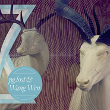

Split
============================

|  |  |
| :--: | :-- |
| [ Split](https://emumo.xiami.com/album/564955) | **艺人**: [惘闻](../index.md) **语种**: 英语 **唱片公司**: Weary Bird Records, Genjing Records, New Noise **发行时间**: 2012年12月31日 **专辑类别**: 录音室专辑 **专辑风格**: 后摇 Post-Rock **播放数**: 262439 **收藏数**: 1803 **评论数**: 187  |

## 简介

这张由瑞典实验乐队pg.lost和中国乐队惘闻发行的12寸黑胶证明了中国的音乐家正渐渐成为全球富有创造力的社区的伙伴之一。
 
  

pg.lost在这张唱片中收录了一组20分钟的组曲，“Desperdicio Parts I &amp; II”，开场是犹如决断厄运般的意大利西部片风格缓缓进入舒适的后摇氛围，岩石崩裂般的时刻使听者陶醉，合着有力的旋律带着他们穿过怒海情涛。
 
  

惘闻擅长于反复、多次的在一首歌中酝酿由阴郁失落到饱含希望的情绪过程，音乐声音上的力量使他们为艰难时刻创造配乐。
 
  

在B面中，来自中国的五个人与炽烈的pg.lost相反，用三首内向、柔和的乐曲回应了pg.lost的音乐。“13th”是首由厚重、复杂吉他踏板回授控制的温暖、细碎的开场曲。
 
  

“乡音”是一个由温和的钟琴，风琴、细致的打击乐、高飞的吉他和小提琴轮番登台的小岛，像是暴风雨来前的短暂宁静。“鼠歌”听起来就像是一场雷暴，七分钟长的竭尽疯狂jam由旋律吉他和充满阳光的合成器交互支撑下来到了一个中点，在此之后，乐队把自己投向了电影中宣泄的场景，伴随着狂躁的吉他，之后天空变亮，一切如常，再次置若罔闻。
 

 
 

<strong>A面 / pg.lost</strong>
 

1. Desperdicio (part I)
 

2. Desperdicio (part II)  
  

 

<strong>B面 / 惘闻</strong>
 

1. 13th
 

2. Homeland Accent
 

3. Mouse Song
 
  

 
 

pg.lost
 
  

Mattias Bhatt – 吉他
 

Martin Hjertstedt – 鼓
 

Gustav Almberg – 吉他
 

Kristian Karlsson – 贝司
 
  

惘闻
 
  

谢玉岗 – 吉他
 

耿鑫 – 吉他
 

徐增铮 – 贝司
 

周连江 – 鼓
 

张岩峰 – 键盘
 
  
This self-titled 12” vinyl split between Swedish experimental instrumentalists pg.lost and domestic post-rock outfit Wang Wen (罔聞) is definitive proof that China’s musicians have become equal partners in the global creative community.   
  
pg.lost tackles the A-side with a suite of two ten-minute songs—“Desperdicio Parts I &amp; II”—that open with a decidedly doom-influenced Spaghetti Western flair before nestling into more comfortable post-rock ground: crashing rock movements that intoxicate the listener and ferry them through waters of aching, almost heartbreaking emotion stamped with forceful, triumphant and occasionally-violent melodies that recall sweeping windswept vistas.   
  
Wang Wen excels at running emotional relays from melancholy grief to guarded hope—and back again—multiple times within single songs, feats of sonic prowess that make their contributions an ideal soundtrack for these troubled times.   
  
On the B-side, the Chinese quintet counters pg.lost’s fiery, outward-looking tracks with three subdued and inward-looking sketches. The fragile opener, “13th”, is dominated by mellow, intricate guitar interplay overlaid upon warm and reassuring throbbing organ tones before disintegrating into a pedal-induced feedback fuzz.   
  
“Homeland Accent,” a subdued island in which a glockenspiel, Hammond organ, earnest percussion work, soaring lead guitars and a violin all take turns occupying center stage, offers a tranquil respite before the barnstorming closer “Mouse Song,” the aural equivalent to a flash thunderstorm.   
  
The seven-minute jam neatly pivots from languid mandolin and violin-laced guitar wizardry backed by sunny, bubbling synths to a brief midpoint moment of stark lucidity before the band throws themselves into cathartic, film credits territory marred by agitated and fitful guitar squalls.   
  
And then the sky brightens, the string section chirps and all is well again—置若罔聞: turning a deaf ear to the wolf at the door.

## 曲目

- [Desperdicio (part I)](./564955/xLzjYgc96fd.md)
- [Desperdicio (part II)](./564955/xLzjYh195bc.md)
- [13th ](./564955/xLzjYi1687a.md)
- [Homeland Accent ](./564955/xLzjYj9a6e7.md)
- [Mouse Song](./564955/mQEljA736d8.md)

## 评论

|  |  |  |
| :-- | :-- | :-- |
|  [虾米用户](https://emumo.xiami.com/u/3300888) A Crazy Perf... 2020-03-01 20:43 赞(1) 踩(0) | 
Sergio Leone.
 |
|  [虾米用户](https://emumo.xiami.com/u/42963872) 我还没想好要写什么... 2019-01-03 05:07 赞(2) 踩(0) | 
-
 |
|  [虾米用户](https://emumo.xiami.com/u/260123122)   2018-01-21 18:36 赞(1) 踩(0) | 
/
 |
|  [虾米用户](https://emumo.xiami.com/u/3556002) wubba lubba 2018-01-15 23:05 赞(2) 踩(0) | 
233333
 |
|  [虾米用户](https://emumo.xiami.com/u/31537778)   2017-11-03 06:52 赞(1) 踩(0) | 
这张在pg lost主页居然找不到。。
 |
| ⇒ |  [虾米用户](https://emumo.xiami.com/u/2679882) blindsided 2018-01-30 03:03 赞(0) 踩(0) | 
you can find it on pg lost&amp;amp;#039;s bandcamp :p
 |
|  [虾米用户](https://emumo.xiami.com/u/24814862) - 2017-10-27 22:58 赞(0) 踩(0) | 
很想找到同类。  希望我们在生活中失去的，都能从后摇滚中找回来。 在做后摇推荐微博，仅此而已。  欢迎关注。 Weibo ID : 后摇狗VALON_
 |
|  [虾米用户](https://emumo.xiami.com/u/35305861) 厌倦和眷恋 2016-09-26 14:10 赞(0) 踩(0) | 

 |
|  [虾米用户](https://emumo.xiami.com/u/142497646)  2016-04-16 03:13 赞(0) 踩(0) | 
55675764323455
 |
|  [虾米用户](https://emumo.xiami.com/u/25922167) 用音乐思考,而非娱乐. 2016-04-07 13:16 赞(3) 踩(0) | 
pg.lost的两首真牛逼！
 |
|  [虾米用户](https://emumo.xiami.com/u/4721787) 我有条尾巴 我会用它调情 2015-10-12 21:33 赞(0) 踩(0) | 
小姐姐听得
 |
|  [虾米用户](https://emumo.xiami.com/u/38801880)   2015-10-11 19:40 赞(0) 踩(0) | 
^_^
 |
|  [虾米用户](https://emumo.xiami.com/u/8226204) ≡ 2015-06-14 11:41 赞(0) 踩(0) | 
#
 |
|  [虾米用户](https://emumo.xiami.com/u/9988026) 虾米，圣诞节快乐。 2014-12-19 16:49 赞(1) 踩(0) | 
bang!bangbangbangbang!---
 |
|  [虾米用户](https://emumo.xiami.com/u/33457836)   2014-12-13 18:11 赞(0) 踩(0) | 
-
 |
|  [虾米用户](https://emumo.xiami.com/u/281428) 活得自己 2014-09-17 13:35 赞(2) 踩(0) | 
这张砖封面真国际化。
 |
|  [虾米用户](https://emumo.xiami.com/u/213465)  2014-09-15 18:40 赞(0) 踩(0) | 
音乐群：257325256
 |
|  [虾米用户](https://emumo.xiami.com/u/5099665)   2014-08-19 12:06 赞(0) 踩(0) | 
乱入 乱出
 |
|  [虾米用户](https://emumo.xiami.com/u/8277916) 矢量操作 2014-06-03 18:56 赞(0) 踩(0) | 
x pglost 男神合体
 |
|  [虾米用户](https://emumo.xiami.com/u/8277916) 矢量操作 2014-06-03 18:46 赞(0) 踩(0) | 
男神合体
 |
|  [虾米用户](https://emumo.xiami.com/u/22098522)  2014-05-28 17:56 赞(9) 踩(0) | 
黑胶已收，老谢签名（没错我就是来嘚瑟的）
 |
|  [虾米用户](https://emumo.xiami.com/u/3345141)  2014-04-16 19:51 赞(0) 踩(0) | 
啊呀
 |
|  [虾米用户](https://emumo.xiami.com/u/2111972) 我还没想好要写什么... 2014-04-04 14:53 赞(0) 踩(0) | 
后三首和前面差了点
 |
|  [虾米用户](https://emumo.xiami.com/u/752707) Hola 2014-02-17 06:43 赞(1) 踩(0) | 
国字号后摇大旗
 |
|  [虾米用户](https://emumo.xiami.com/u/11254756) music❤ 2014-02-16 14:14 赞(0) 踩(0) | 
眼泪都快流出来
 |
|  [虾米用户](https://emumo.xiami.com/u/4801435) ! 2014-02-04 21:38 赞(0) 踩(0) | 
惘闻 ，一直听 ，不断， pg得换歌  ，惘闻成长快！都很好，，
 |
|  [虾米用户](https://emumo.xiami.com/u/31988704)  2014-01-21 19:55 赞(0) 踩(0) | 
h
 |
|  [虾米用户](https://emumo.xiami.com/u/30850452)  2014-01-13 04:31 赞(0) 踩(0) | 
我直接听的惘闻
 |
|  [虾米用户](https://emumo.xiami.com/u/5604492) ‪‪♬✧訂閱號：Morn... 2014-01-06 22:53 赞(0) 踩(0) | 
神专一枚
 |
|  [虾米用户](https://emumo.xiami.com/u/3663473)  2013-12-27 23:55 赞(0) 踩(0) | 
犹横舟江上，看两岸尽是繁华，忽狂风大作，荡过万重山
 |
|  [虾米用户](https://emumo.xiami.com/u/666000) 我会永远爱你，虾米的朋友... 2013-12-03 17:38 赞(1) 踩(0) | 
为何忘记收藏！！
 |
|  [虾米用户](https://emumo.xiami.com/u/25759929) 纸老虎 2013-10-31 09:39 赞(0) 踩(0) | 
惘闻是中国最好的POST ROCK乐队，没有之一
 |
|  [虾米用户](https://emumo.xiami.com/u/3046665)  2013-08-19 09:15 赞(20) 踩(0) | 
求解，啥叫做意大利西部片？
 |
| ⇒ |  [虾米用户](https://emumo.xiami.com/u/10055585) 浑身解数 2014-03-21 18:23 赞(0) 踩(0) | 
比如Django
 |
| ⇒ |  [虾米用户](https://emumo.xiami.com/u/4293293)  2014-05-28 00:03 赞(0) 踩(0) | 
貌似是意大利有一段时间山寨好莱坞西部片山寨出了自己的风味。
 |
| ⇒ |  [虾米用户](https://emumo.xiami.com/u/4293293)  2014-05-28 00:05 赞(0) 踩(0) | 
啊，我说错了，“是西部片的其中一种类型，泛指一些出现在1960年代、由意大利人导演及监制（多与西班牙或德国联合制片）的西部片。”
 |
| ⇒ |  [虾米用户](https://emumo.xiami.com/u/4277042) 不是非要飘扬。 2014-06-04 12:46 赞(0) 踩(0) | 
意思就是意大利的西部哪种赶脚的东西。
 |
| ⇒ |  [虾米用户](https://emumo.xiami.com/u/1493800)  2014-11-15 23:43 赞(0) 踩(0) | 
意思就是法国片儿！意大利西边就是法国！这都不知道，还能不能好好听歌了！！
 |
| ⇒ |  [虾米用户](https://emumo.xiami.com/u/9156158) 心 月似钩三星挂 2017-10-27 23:03 赞(0) 踩(0) | 
哈哈哈，这是暴力美学的范畴。 这个专辑乐评我估计是中国式教授写的。。灰常让人有再教育赶脚- -
 |
| ⇒ |  [虾米用户](https://emumo.xiami.com/u/33086706) 暂时回归 2017-10-28 00:14 赞(0) 踩(0) | 
在杂志上看到过一点，就是大概二战后吧，美国电影霸占欧洲市场，西部片很火，意大利的导演们就开始试图小成本制作本土西部片,就指成本较低的欧洲西部片？大概这个意思，这有个专名但忘记了 
 |
| ⇒ |  [虾米用户](https://emumo.xiami.com/u/8109588) Post Rock & ... 2020-11-03 15:25 赞(0) 踩(0) | 
Western spaghetti
 |
|  [虾米用户](https://emumo.xiami.com/u/8653671) 废材一根 2013-08-15 22:06 赞(0) 踩(0) | 
中国后摇中的战斗机！！！
 |
|  [虾米用户](https://emumo.xiami.com/u/8653671) 废材一根 2013-08-15 18:53 赞(0) 踩(0) | 
中国后摇中的战斗机！！！
 |
|  [虾米用户](https://emumo.xiami.com/u/10519596)  2013-08-11 15:09 赞(0) 踩(0) | 
爱后摇！！！
 |
|  [虾米用户](https://emumo.xiami.com/u/478527) 好想跟衣服在洗衣机里滚 2013-08-01 19:04 赞(0) 踩(0) | 
不明觉厉。为什么要把pg和他们放到一起出一张，谁来告诉我，why？
 |
| ⇒ |  [虾米用户](https://emumo.xiami.com/u/1447058) 已迁移至网易云，祝好——... 2013-08-13 14:20 赞(0) 踩(0) | 
你觉得惘闻不配吗
 |
| ⇒ |  [虾米用户](https://emumo.xiami.com/u/1828555) Omnivore 2013-08-16 15:16 赞(0) 踩(0) | 
<q><b>暗叉说：</b></q>
 |
| ⇒ |  [虾米用户](https://emumo.xiami.com/u/618645)  2013-08-18 16:16 赞(0) 踩(0) | 
因为他们是基友
 |
| ⇒ |  [虾米用户](https://emumo.xiami.com/u/478527) 好想跟衣服在洗衣机里滚 2013-08-18 16:20 赞(0) 踩(0) | 
<q><b>荒野邮局说：</b></q>
 |
|  [虾米用户](https://emumo.xiami.com/u/3902837)  2013-08-01 13:22 赞(0) 踩(0) | 
pg的歌名我就没懂几个= =part I 给我的感觉就是！这就是Pg.lost！
 |
|  [虾米用户](https://emumo.xiami.com/u/4335954)   2013-07-27 15:27 赞(0) 踩(0) | 
合作专辑！！
 |
|  [虾米用户](https://emumo.xiami.com/u/11932346) 這個世界為什麼那麼邪惡呢 2013-07-25 17:59 赞(0) 踩(0) | 
中国的post-rock！
 |
|  [虾米用户](https://emumo.xiami.com/u/9102421) 为后摇而来。 2013-07-18 14:27 赞(0) 踩(0) | 
惘闻的歌真心适合旅行的时候听啊！！
 |
|  [虾米用户](https://emumo.xiami.com/u/3002907) 我还没想好要写什么... 2013-07-11 14:41 赞(0) 踩(0) | 
第一次听是被pg.lost的鼓点吸引的，后来发现，惘闻的很耐听。
 |
| ⇒ |  [虾米用户](https://emumo.xiami.com/u/10624773)  2014-10-20 01:18 赞(0) 踩(0) | 
对
 |
|  [虾米用户](https://emumo.xiami.com/u/7584160)  2013-06-17 19:45 赞(0) 踩(0) | 
惘闻和pg lost放一起听，pg lost是我最喜欢的后摇，这两个都是世界水准的
 |
|  [虾米用户](https://emumo.xiami.com/u/91841)  2013-06-17 19:03 赞(1) 踩(0) | 
不明觉厉
 |
|  [虾米用户](https://emumo.xiami.com/u/2419026)  2013-06-15 01:35 赞(0) 踩(0) | 
国际水准
 |
|  [虾米用户](https://emumo.xiami.com/u/7733575)  2013-06-13 10:41 赞(0) 踩(0) | 
分享给大家
 |
|  [虾米用户](https://emumo.xiami.com/u/2375635) 一匹死在南方的母马 2013-06-12 22:58 赞(0) 踩(0) | 
两个都喜欢的团
 |
|  [虾米用户](https://emumo.xiami.com/u/7623143)  2013-06-12 20:21 赞(0) 踩(0) | 
好听！Pg比较多！！！
 |
|  [虾米用户](https://emumo.xiami.com/u/8970340) 小石头 2013-06-12 15:36 赞(0) 踩(0) | 
听着好爽 画面自觉出现
 |
|  [虾米用户](https://emumo.xiami.com/u/2318651)  2013-06-12 10:27 赞(0) 踩(0) | 
******
 |
|  [虾米用户](https://emumo.xiami.com/u/2146124)  2013-06-11 22:05 赞(0) 踩(0) | 
哦 好久没有听这样的了  感觉超级棒
 |
|  [虾米用户](https://emumo.xiami.com/u/15303427)  2013-06-11 14:23 赞(0) 踩(0) | 
非常喜欢！
 |
|  [虾米用户](https://emumo.xiami.com/u/2005458)  2013-06-11 11:09 赞(0) 踩(0) | 
惘闻给力。
 |
|  [虾米用户](https://emumo.xiami.com/u/782508) 公众号：失控的王国 2013-06-11 09:31 赞(0) 踩(0) | 
你们在说啥
 |
|  [虾米用户](https://emumo.xiami.com/u/287994)  2013-06-11 08:15 赞(0) 踩(0) | 
等的就是这张 Pg lost &amp;amp; 惘闻 @Viola_zyc
 |
|  [虾米用户](https://emumo.xiami.com/u/3719355)  2013-06-10 23:16 赞(0) 踩(0) | 
听着还可以
 |
|  [虾米用户](https://emumo.xiami.com/u/90632)  2013-06-10 16:34 赞(0) 踩(0) | 
欣赏不了，有点单调
 |
|  [虾米用户](https://emumo.xiami.com/u/90632)  2013-06-10 16:33 赞(0) 踩(0) | 
曲子没什么变化
 |
|  [虾米用户](https://emumo.xiami.com/u/4313652) 一念起，萬水千山 2013-06-10 11:00 赞(0) 踩(0) | 
真是產生了了不得的化學反應呢~~
 |
|  [虾米用户](https://emumo.xiami.com/u/2486624) Like a star 2013-06-09 23:55 赞(0) 踩(0) | 
大气，哈哈~~结果我喜欢的是后面惘闻的三首，pg.lost有什么想说的吗?
 |
|  [虾米用户](https://emumo.xiami.com/u/2486624) Like a star 2013-06-09 23:54 赞(0) 踩(0) | 
很大气，哈哈！
 |
|  [虾米用户](https://emumo.xiami.com/u/2571428)  2013-06-09 12:35 赞(0) 踩(0) | 
这次的中国演出不会演奏pg lost的两首曲目吧
 |
|  [虾米用户](https://emumo.xiami.com/u/3658825)  2013-06-09 11:37 赞(0) 踩(0) | 
wangwen真长脸 给力
 |
|  [虾米用户](https://emumo.xiami.com/u/4032516)  2013-06-09 11:22 赞(0) 踩(0) | 
直指花心
 |
|  [虾米用户](https://emumo.xiami.com/u/2768776)  2013-06-09 10:46 赞(0) 踩(0) | 
post-rock、how great！
 |
|  [虾米用户](https://emumo.xiami.com/u/4043410) 唯夜色浪漫 2013-06-09 10:21 赞(0) 踩(0) | 
哇噻，我要给满分！！！
 |
|  [虾米用户](https://emumo.xiami.com/u/965806)  2013-06-09 09:56 赞(0) 踩(0) | 
哥们发黑胶啦....
 |
|  [虾米用户](https://emumo.xiami.com/u/782027) 成长中的后摇新势力 2013-06-09 03:52 赞(0) 踩(0) | 
国产后摇必须顶，pg.lost的两首依旧大气磅礴！
 |
|  [虾米用户](https://emumo.xiami.com/u/1268101)  2013-06-08 23:21 赞(0) 踩(0) | 
反复的情调与单循环。
 |
|  [虾米用户](https://emumo.xiami.com/u/5765540) 红家·各类BGM爱好·杂... 2013-06-08 22:38 赞(0) 踩(0) | 
我需要與失誤split！！！
 |
|  [虾米用户](https://emumo.xiami.com/u/1192824) （づ￣3￣）づ╭❤～ 2013-06-08 22:37 赞(0) 踩(0) | 
吓屎，我最爱的Pg和惘闻的合作真正点
 |
|  [虾米用户](https://emumo.xiami.com/u/13430485) 我对你的赤子之心永存。 2013-06-08 20:37 赞(0) 踩(0) | 
听的过程就像在看电影。
 |
|  [虾米用户](https://emumo.xiami.com/u/566243)  2013-06-08 18:15 赞(0) 踩(0) | 
被首页显示的最新流行专辑吓尿
 |
|  [虾米用户](https://emumo.xiami.com/u/2440056) 不开心就是尼玛不开心 2013-06-08 17:08 赞(0) 踩(0) | 
听完整张怒评五星!!!力荐之!!
 |
|  [虾米用户](https://emumo.xiami.com/u/8585986) 后摇依赖症候群 2013-06-08 16:20 赞(0) 踩(0) | 
内心如潮水般汹涌 好不容易按耐住激动 表面平静地听完了整张专辑  耳朵里还留着回声。Desperdicio带给我的震撼 和TWDY的层层推进是完全不同的、 容我 小小地 兴奋一下。
 |
|  [虾米用户](https://emumo.xiami.com/u/2006807)  2013-06-08 16:17 赞(0) 踩(0) | 
我昨天听了一天第一首歌的单曲循环。但是我以为我听的是整张专辑的循环。大概只有后摇能特么有这种效果吧。。。我还xin思呢，这惘闻咋跟pg.los这么像。。。都不分彼此的。。。同一首歌，能不像么。。。
 |
|  [虾米用户](https://emumo.xiami.com/u/24003)  2013-06-08 15:53 赞(1) 踩(0) | 
:o
 |
|  [虾米用户](https://emumo.xiami.com/u/1346871) Parallel. 2013-06-08 11:51 赞(0) 踩(0) | 
真的是越来越有国际范了，不能更赞！
 |
|  [虾米用户](https://emumo.xiami.com/u/387315)  2013-06-08 10:24 赞(0) 踩(0) | 
越来越有国际范了
 |
|  [虾米用户](https://emumo.xiami.com/u/1604346) 再見 2013-06-08 09:51 赞(0) 踩(0) | 
封面绝杀！！！！！！！！！！！
 |
| ⇒ |  [虾米用户](https://emumo.xiami.com/u/15244009) hihihihihihi 2013-06-08 10:13 赞(0) 踩(0) | 
死埋一边!!!!!!!!!!!!!!! you！go to hell！
 |
|  [虾米用户](https://emumo.xiami.com/u/8838682) 坐在海边看日落和喝菠萝啤 2013-06-08 08:42 赞(1) 踩(0) | 
只有听过的人，才明白我为何奋不顾身地打了五星。
 |
| ⇒ |  [虾米用户](https://emumo.xiami.com/u/2659)  2013-06-09 10:30 赞(0) 踩(0) | 
都奋不顾身了！拼了啊
 |
|  [虾米用户](https://emumo.xiami.com/u/15512789) 至少我来过爱过！ 2013-06-08 04:26 赞(0) 踩(0) | 
不错 ！
 |
|  [虾米用户](https://emumo.xiami.com/u/13882508)  2013-06-07 23:13 赞(0) 踩(0) | 
力荐
 |
|  [虾米用户](https://emumo.xiami.com/u/1255298)  2013-06-07 23:10 赞(2) 踩(0) | 
之前很喜欢MONO~原来咱们自己的后摇也很棒~
 |
|  [虾米用户](https://emumo.xiami.com/u/2056961) 杂食动物 2013-06-07 22:37 赞(0) 踩(0) | 
心情很澎湃
 |
|  [虾米用户](https://emumo.xiami.com/u/3092111) 走走停停 2013-06-07 22:28 赞(0) 踩(0) | 
你有没有听~？有没有听？？
 |
|  [虾米用户](https://emumo.xiami.com/u/1384536) 感谢拥有耳朵去听song 2013-06-07 20:56 赞(1) 踩(0) | 
据说是中国不错的后腰乐队
 |
|  [虾米用户](https://emumo.xiami.com/u/1301955) 我拥有的都是侥幸啊 2013-06-07 17:48 赞(0) 踩(0) | 
昨天在地铁站看到有人穿着惘闻的t恤衫，很神奇诶~
 |
| ⇒ |  [虾米用户](https://emumo.xiami.com/u/589764) The 1st cut ... 2013-06-07 18:18 赞(0) 踩(0) | 
这样的组合也和神奇
 |
|  [虾米用户](https://emumo.xiami.com/u/12666959)  2013-06-07 15:40 赞(0) 踩(0) | 
暗流涌动呐!
 |
|  [虾米用户](https://emumo.xiami.com/u/2929690) 一位脱离低级趣味的城乡结... 2013-06-07 15:31 赞(0) 踩(0) | 
唱片里的Pg.lost是以前的惘闻，大气不张扬，气场内敛有劲；现在的惘闻是一如既往的Moonlit Sailor式北欧清新风，如夏风拂面和萤火虫舞动之深夜。
 |
| ⇒ |  [虾米用户](https://emumo.xiami.com/u/2929690) 一位脱离低级趣味的城乡结... 2013-06-08 21:08 赞(0) 踩(0) | 
<q><b>说：</b></q>
 |
| ⇒ |  [虾米用户](https://emumo.xiami.com/u/3902837)  2013-06-10 00:14 赞(0) 踩(0) | 
<q><b>L.Yip说：</b></q>
 |
|  [虾米用户](https://emumo.xiami.com/u/2245211) 声光伴我飞 2013-06-07 13:34 赞(0) 踩(0) | 
DOWN，随那黑色晶体后的假像......碎了一地的红.
 |
|  [虾米用户](https://emumo.xiami.com/u/2378069) 不灭。 2013-06-07 11:00 赞(0) 踩(0) | 
曾经的最好，现在最好的，未来也会是最好。我知道，不会改变。
 |
|  [虾米用户](https://emumo.xiami.com/u/2378069) 不灭。 2013-06-07 10:55 赞(0) 踩(0) | 
曾经最好的，现在最好的，也是未来最好的。我相信，什么都不会变。
 |
|  [虾米用户](https://emumo.xiami.com/u/1296984)  2013-06-07 04:35 赞(0) 踩(0) | 
pg lost + 惘闻～～
 |
|  [虾米用户](https://emumo.xiami.com/u/98927) 最多12个字符。 2013-06-07 00:45 赞(1) 踩(0) | 
哎呀   和pg  lost 的合作。 好哈皮
 |
|  [虾米用户](https://emumo.xiami.com/u/1369788)  2013-06-06 20:35 赞(0) 踩(0) | 
赞赞赞
 |
|  [虾米用户](https://emumo.xiami.com/u/6993154) 我还没想好要写什么... 2013-06-06 17:44 赞(0) 踩(0) | 
买了。。。。。。。。就为了320K
 |
| ⇒ |  [虾米用户](https://emumo.xiami.com/u/1644333) 传说中的小明 2013-06-07 00:55 赞(0) 踩(0) | 
其实。。。这张目前是192K
 |
|  [虾米用户](https://emumo.xiami.com/u/3330853)  2013-06-06 16:53 赞(0) 踩(0) | 
我擦。。。六月你是怎么了
 |
|  [虾米用户](https://emumo.xiami.com/u/1936425) 不要吵 2013-06-06 16:31 赞(0) 踩(0) | 
....没带耳机TAT
 |
|  [虾米用户](https://emumo.xiami.com/u/15864074)  2013-06-06 15:00 赞(0) 踩(0) | 
操蛋的青春。老娘喷。。。。
 |
|  [虾米用户](https://emumo.xiami.com/u/7706300) 夹着尾巴逃跑啦 2013-06-06 13:41 赞(0) 踩(0) | 
@一碗狗屎木 @庸人北出 @假发很长不晃会被撞到地上 赞！
 |
|  [虾米用户](https://emumo.xiami.com/u/704395)  2013-06-06 13:38 赞(0) 踩(0) | 
出新了！！！！！！！！！！！！！！！还没有听就迫不及待地……
 |
|  [虾米用户](https://emumo.xiami.com/u/431391)  2013-06-06 12:52 赞(0) 踩(0) | 
我感觉我要飞了
 |
|  [虾米用户](https://emumo.xiami.com/u/1525064)  2013-06-06 12:38 赞(0) 踩(0) | 
很棒！
 |
|  [虾米用户](https://emumo.xiami.com/u/3536302) 网易云同名 2013-06-06 11:35 赞(0) 踩(0) | 
!!!!!
 |
|  [虾米用户](https://emumo.xiami.com/u/3257661) Semper Eadem 2013-06-06 11:23 赞(0) 踩(0) | 
惘闻和屁股丢了。。0.0
 |
|  [虾米用户](https://emumo.xiami.com/u/226778) 叩问圣谛真义，胸中万语千... 2013-06-06 11:06 赞(0) 踩(0) | 
两个都是大爱啊。在一起无法不爱呢。
 |
|  [虾米用户](https://emumo.xiami.com/u/226778) 叩问圣谛真义，胸中万语千... 2013-06-06 11:05 赞(0) 踩(0) | 
两个都是大爱。真是感动兴奋得要命了。
 |
|  [虾米用户](https://emumo.xiami.com/u/8920340) : 3 2013-06-06 10:38 赞(0) 踩(0) | 
两个乐队的风格结合得好融洽
 |
|  [虾米用户](https://emumo.xiami.com/u/891989) 我还没想好要写什么... 2013-06-06 10:22 赞(0) 踩(0) | 
惘闻好棒啊~~~牛逼牛逼
 |
|  [虾米用户](https://emumo.xiami.com/u/197725) 我还没想好要写什么... 2013-06-06 09:24 赞(0) 踩(0) | 
好音乐，认真的态度
 |
|  [虾米用户](https://emumo.xiami.com/u/1784025)  2013-06-06 09:20 赞(0) 踩(0) | 
屁股丢了和惘闻      大爱的两个乐队啊。。。。。
 |
|  [虾米用户](https://emumo.xiami.com/u/1728826)  2013-06-06 09:16 赞(0) 踩(0) | 
嗷嗷嗷.........
 |
|  [虾米用户](https://emumo.xiami.com/u/2288372) 我还没想好要写什么... 2013-06-06 08:23 赞(0) 踩(0) | 
竟然是这两只！！
 |
|  [虾米用户](https://emumo.xiami.com/u/7840814) 视觉旋律 2013-06-06 01:16 赞(0) 踩(0) | 
大半夜 两个最爱二合一 提神
 |
|  [虾米用户](https://emumo.xiami.com/u/15856093)  2013-06-06 01:06 赞(0) 踩(0) | 
说不好为什么突然被感触 也许是今天的梦太多太湮 也许是今晚又周期性想太多 所有觉得这首的9分33秒竟全都与最好的预期契合。也许音乐就是心境。
 |
|  [虾米用户](https://emumo.xiami.com/u/7322777) ∮ 2013-06-06 00:49 赞(0) 踩(0) | 
17
 |
|  [虾米用户](https://emumo.xiami.com/u/4065805) 自娱自乐爱好者 2013-06-06 00:45 赞(0) 踩(0) | 
聽了好想哭~太棒了
 |
|  [虾米用户](https://emumo.xiami.com/u/6209186)  2013-06-06 00:15 赞(0) 踩(0) | 
赞
 |
|  [虾米用户](https://emumo.xiami.com/u/2586857) 我还没想好要写什么... 2013-06-06 00:07 赞(0) 踩(0) | 
强强联手！！！！！！！！！！！！
 |
|  [虾米用户](https://emumo.xiami.com/u/4363123) Heya 2013-06-05 23:28 赞(0) 踩(0) | 
thanks
 |
|  [虾米用户](https://emumo.xiami.com/u/3506625) 偏爱类型：Rock N'... 2013-06-05 22:46 赞(0) 踩(0) | 
是这张啊啊啊 貌似是惘闻之前去纽约参加什么音乐节还是巡演来着 然后就和P.gLost合作的实验性EP
 |
|  [虾米用户](https://emumo.xiami.com/u/3506625) 偏爱类型：Rock N'... 2013-06-05 22:46 赞(0) 踩(0) | 
是这张啊啊啊 貌似是惘闻之前去纽约参加什么音乐节还是巡演来着 然后就和P.gLost合作的实验性EP 果断分享之
 |
|  [虾米用户](https://emumo.xiami.com/u/1359732)  2013-06-05 22:15 赞(0) 踩(0) | 
pg.lost &amp;amp; 惘闻   好！
 |
|  [虾米用户](https://emumo.xiami.com/u/355865) Let it go, l... 2013-06-05 22:14 赞(1) 踩(0) | 
#音质报告# 192K
 |
|  [虾米用户](https://emumo.xiami.com/u/7392978)  莪嫒沵狆国，杺嫒哋毋儭 2013-06-05 22:00 赞(0) 踩(0) | 
无脑转
 |
|  [虾米用户](https://emumo.xiami.com/u/7392978)  莪嫒沵狆国，杺嫒哋毋儭 2013-06-05 22:00 赞(0) 踩(0) | 
只想买碟
 |
|  [虾米用户](https://emumo.xiami.com/u/4052616)  2013-06-05 21:24 赞(0) 踩(0) | 
实验...
 |
|  [虾米用户](https://emumo.xiami.com/u/7205091) 胡同串子 2013-06-05 20:37 赞(0) 踩(0) | 
最喜欢的国内乐队 没有之一
 |
|  [虾米用户](https://emumo.xiami.com/u/2972280) 让生活平静的流 2013-06-05 20:01 赞(0) 踩(0) | 
如果盲听不知道多少人觉得NB。至少我觉得一般，噱头大点罢了。
 |
|  [虾米用户](https://emumo.xiami.com/u/1409314)  2013-06-05 19:49 赞(0) 踩(0) | 
粗了
 |
|  [虾米用户](https://emumo.xiami.com/u/102487)  2013-06-05 19:38 赞(0) 踩(0) | 
穿越了
 |
|  [虾米用户](https://emumo.xiami.com/u/7022554) 谨记初心 2013-06-05 18:56 赞(0) 踩(0) | 
...黑胶 高端了
 |
|  [虾米用户](https://emumo.xiami.com/u/1365298) 我能呆在河边一整天钓鱼 2013-06-05 18:45 赞(0) 踩(0) | 
说实在的真心不错
 |
|  [虾米用户](https://emumo.xiami.com/u/3468208)   2013-06-05 17:24 赞(0) 踩(0) | 
很震惊居然出来了
 |
|  [虾米用户](https://emumo.xiami.com/u/13882508)  2013-06-05 17:14 赞(0) 踩(0) | 
！！
 |
|  [虾米用户](https://emumo.xiami.com/u/2866724) 一大大二大大三大大四大爷 2013-06-05 17:11 赞(0) 踩(0) | 
&amp;quot;证明了中国的音乐家正渐渐成为全球富有创造力的社区的伙伴之一&amp;quot;  戴了个好大的高帽
 |
|  [虾米用户](https://emumo.xiami.com/u/94794) post-rock 2013-06-05 16:47 赞(0) 踩(0) | 
爱死惘闻了
 |
|  [虾米用户](https://emumo.xiami.com/u/1471733)  2013-06-05 16:45 赞(0) 踩(0) | 
两支喜欢的后摇乐队！
 |
|  [虾米用户](https://emumo.xiami.com/u/2732049)   2013-06-05 16:39 赞(0) 踩(0) | 
哎呦我去split
 |
|  [虾米用户](https://emumo.xiami.com/u/2405684) 为了冈多！ 2013-06-05 16:38 赞(0) 踩(0) | 
走向国际
 |
|  [虾米用户](https://emumo.xiami.com/u/812392) q音网易搜央央小月，酷g... 2013-06-05 16:32 赞(0) 踩(0) | 
ヽ(●´ε｀●)ノ
 |
|  [虾米用户](https://emumo.xiami.com/u/15) 吃嘛嘛香 2013-06-05 16:28 赞(0) 踩(0) | 
这张黑胶赞！
 |
|  [虾米用户](https://emumo.xiami.com/u/5920185) 失业在家貌似也只能画画. 2013-06-05 16:27 赞(0) 踩(0) | 
黑胶噢. 这是正儿八经做音乐的主儿.
 |
|  [虾米用户](https://emumo.xiami.com/u/3110397)  2013-06-05 16:23 赞(0) 踩(0) | 
虾米好牛逼大赞
 |
|  [虾米用户](https://emumo.xiami.com/u/8218530) 加油！ 2013-06-05 16:18 赞(0) 踩(0) | 
哦也~
 |
|  [虾米用户](https://emumo.xiami.com/u/8244559)  2013-06-05 16:15 赞(0) 踩(0) | 
******
 |
|  [虾米用户](https://emumo.xiami.com/u/11289446) 懒得讲 2013-06-05 16:13 赞(0) 踩(0) | 
..
 |
| ⇒ |  [虾米用户](https://emumo.xiami.com/u/2854547) Cielo 2013-06-05 16:27 赞(0) 踩(0) | 
...
 |
| ⇒ |  [虾米用户](https://emumo.xiami.com/u/8949062) 我的旧时光 2013-06-05 16:28 赞(0) 踩(0) | 
<q><b>Chielo.说：</b></q>
 |
| ⇒ |  [虾米用户](https://emumo.xiami.com/u/2854547) Cielo 2013-06-05 16:29 赞(0) 踩(0) | 
<q><b>Suriano说：</b></q>
 |
| ⇒ |  [虾米用户](https://emumo.xiami.com/u/8949062) 我的旧时光 2013-06-05 16:33 赞(0) 踩(0) | 
<q><b>Chielo.说：</b></q>
 |
| ⇒ |  [虾米用户](https://emumo.xiami.com/u/11289446) 懒得讲 2013-06-05 16:41 赞(0) 踩(0) | 
<q><b>Suriano说：</b></q>
 |
| ⇒ |  [虾米用户](https://emumo.xiami.com/u/8949062) 我的旧时光 2013-06-05 16:47 赞(0) 踩(0) | 
<q><b>慢性愉悦说：</b></q>
 |
|  [虾米用户](https://emumo.xiami.com/u/330914)  2013-06-05 16:08 赞(0) 踩(0) | 
晚了两分种！
 |
|  [虾米用户](https://emumo.xiami.com/u/812392) q音网易搜央央小月，酷g... 2013-06-05 16:08 赞(0) 踩(0) | 
多少年没有出过新歌啊，快别拦我，我激动！
 |
|  [虾米用户](https://emumo.xiami.com/u/812392) q音网易搜央央小月，酷g... 2013-06-05 16:07 赞(0) 踩(0) | 
我竟然不是沙发
 |
|  [虾米用户](https://emumo.xiami.com/u/8218530) 加油！ 2013-05-27 20:49 赞(0) 踩(0) | 
..
 |
|  [虾米用户](https://emumo.xiami.com/u/10458906)  2013-05-18 20:14 赞(0) 踩(0) | 
。。。早就听过了 好像是在逆音上吧
 |
|  [虾米用户](https://emumo.xiami.com/u/59223) 落之木然 2013-04-01 16:28 赞(0) 踩(0) | 
快出来！
 |
|  [虾米用户](https://emumo.xiami.com/u/59223) 落之木然 2013-04-01 16:26 赞(0) 踩(0) | 
还木有出来哇！！！！
 |
|  [虾米用户](https://emumo.xiami.com/u/670702)  2013-02-20 03:52 赞(0) 踩(0) | 
<a href="http://pglost.bandcamp.com/album/pg-lost-wang-wen-split" target="_blank" rel="nofollow noreferrer noopener">http://pglost.bandcamp.com/album/pg-lost-wang-wen-split</a> 瞬间可以继续写论文了
 |
|  [虾米用户](https://emumo.xiami.com/u/155947) 一期一会 2013-02-08 03:03 赞(0) 踩(0) | 
Pg.lost主页试听 <a href="http://pglost.bandcamp.com/album/pg-lost-wang-wen-split" target="_blank" rel="nofollow noreferrer noopener">http://pglost.bandcamp.com/album/pg-lost-wang-wen-split</a>
 |
|  [虾米用户](https://emumo.xiami.com/u/4268757) 我也不知道，在你向往的日... 2012-12-25 22:10 赞(0) 踩(0) | 
好像听！！！
 |
|  [虾米用户](https://emumo.xiami.com/u/1869163) 再见啦虾米，谢谢有你们 2012-12-23 12:31 赞(0) 踩(0) | 
惘闻和 pg.lost！
 |
|  [虾米用户](https://emumo.xiami.com/u/2652428)  2012-12-19 15:21 赞(0) 踩(0) | 
黑胶！这张应该传上去就会被立马和谐掉- -
 |
