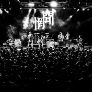
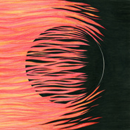
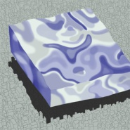
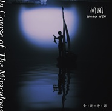
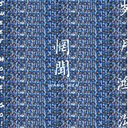
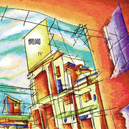
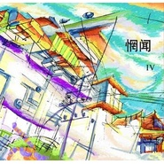
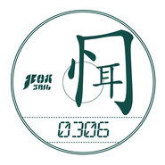
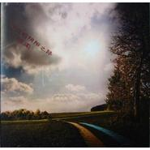
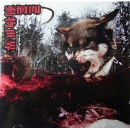

惘闻
============================

|  |  |
| :--: | :-- |
| [ 惘闻](https://i.xiami.com/wangwen) | **播放数**: 12205183 **粉丝数**: 62690 **评论数**: 1499 **地区**: China 中国大陆 **风格**: 摇滚 Rock & Roll, 后摇 Post-Rock  |

## 档案

惘闻---中国器乐摇滚领军乐队；最为勤奋、踏实、在国际舞台最为活跃的中国乐队之壹。1999年成军于中国的海滨城市大连，成军近20年的惘闻，至今发行过9张录音室专辑，1张电影原声专辑，1张与瑞典后摇乐团Pg.Lost共同发行的Split专辑。     乐队由六位成员组成：  吉他：谢玉岗  吉他：耿鑫  贝斯：徐增铮  钢琴/小提琴：张岩峰  鼓手：周连江  小号：黄凯     惘闻壹直保持着勤奋且低调的创作之姿，不断突破创新，不仅是中国后摇滚、器乐摇滚的绝对代表乐队，更壹直活跃在国际舞台之上；惘闻迄今为止进行过三次欧洲巡演，2015年受邀参加欧洲最为专业的器乐摇滚音乐节之壹：比利时Dunk!Festival大获好评，被评为当年Dunk音乐节的最大惊喜；在欧洲、美洲都有发行多张黑胶专辑并不断再版；2017年赴日本参加After Hours音乐节。     2016年，乐队发行了他们的第九张录音室作品《岁月鸿沟》Sweet Home,Go! 于尼泊尔首演，随后展开超过40城的中国巡演，并计划继续开始欧洲巡演；2018年，惘闻成军20年之际，乐队也将远赴冰岛开始他们第10张录音室专辑的录制。

## 专辑

| 名称 | 语种 | 唱片公司 | 发行时间 | 专辑类别 | 专辑风格 |
| :--: | :-- | :-- | :-- | :-- | :-- |
| [ 十万个为什么](./albums/5021702371.md) | 纯音乐 | Space Circle | 2020年10月24日 | 录音室专辑 | 后摇 Post-Rock |
| [ 无穹《挑战吧！太空》主曲](./albums/2104616240.md) | 其他 | Space Circle | 2019年02月22日 | EP, 单曲 | 后摇 Post-Rock |
| [ 看不见的城市](./albums/2103773401.md) | 纯音乐 | Space Circle | 2018年08月03日 | 录音室专辑 | 后摇 Post-Rock |
| [ 奇迹寻踪In Course Of The Miraculous](./albums/2102852803.md) | 国语 | Space Circle | 2017年08月31日 | 原声带, 影视音乐 | 氛围音乐 Ambient, 实验音乐 Experimental |
| [ 岁月鸿沟Sweet Home，Go！](./albums/2100314322.md) | 其他 | Space Circle | 2016年04月25日 | 录音室专辑 | 后摇 Post-Rock |
| [ IV（2014）2014年再版](./albums/1217589258.md) | 英语 | New Noise | 2014年12月01日 | 录音室专辑 | 后摇 Post-Rock |
| [ 八匹马](./albums/1401775015.md) | 其他 | New Noise | 2014年06月03日 | 录音室专辑 | 后摇 Post-Rock |
| [ Split](./albums/564955.md) | 英语 | Weary Bird Records, Genjing Records, New Noise | 2012年12月31日 | 录音室专辑 | 后摇 Post-Rock |
| [ 0.7](./albums/511908.md) | 其他 | Weary Bird | 2012年06月08日 | 录音室专辑 | 后摇 Post-Rock |
| [ L&R](./albums/376528.md) | 国语 | 狐狸尾巴 | 2010年04月09日 | 录音室专辑 | 摇滚 Rock & Roll, 后摇 Post-Rock |
| [ IV](./albums/171499.md) | 国语 | 狐狸尾巴 | 2008年05月17日 | 录音室专辑 | 摇滚 Rock & Roll, 后摇 Post-Rock |
| [ 0306](./albums/215895.md) | 国语 | Fox Tail | 2007年12月15日 | EP, 单曲 | 摇滚 Rock & Roll |
| [ 7 Objects in Another Infinite Space](./albums/32778.md) | 国语 | 狐狸尾巴, 噗哧颂 | 2007年04月14日 | 录音室专辑 | 摇滚 Rock & Roll, 后摇 Post-Rock |
| [ RE: RE: RE:](./albums/15575.md) | 国语 | 嚎叫唱片 | 2005年12月01日 | 录音室专辑 | 摇滚 Rock & Roll, 后摇 Post-Rock |
| [ 二十八天失眠日记Diary Of 28 Sleepless Days](./albums/15576.md) | 国语 | 我爱摇滚乐 | 2003年08月01日 | 录音室专辑 | 摇滚 Rock & Roll, 后摇 Post-Rock |
| [ 晦涩的阴阳之路](./albums/443197.md) | 国语 | 独立发行 | 2002年08月01日 | 录音室专辑 | 摇滚 Rock & Roll, 后摇 Post-Rock |
| [ 凌水河](./albums/443397.md) | 国语 | 独立发行 | 2000年09月01日 | 录音室专辑 | 摇滚 Rock & Roll, 后摇 Post-Rock |
| [ 动物世界](./albums/459177.md) | 国语 | 独立发行 | 1999年01月30日 | 录音室专辑 | 后摇 Post-Rock |

## 评论

|  |  |  |  |
| :-- | :-- | :-- | :-- |
|  [虾米用户](https://emumo.xiami.com/u/411408359) 爱你虾米  爱你编辑部 2021-01-26 15:19 赞(0) 踩(0) | 
爱你虾米 
 |
|  [虾米用户](https://emumo.xiami.com/u/328838625)  2021-01-11 11:51 赞(0) 踩(0) | 
出一张厦门的演出票，朋友不去了替他转 原价原价原价
 |
|  [虾米用户](https://emumo.xiami.com/u/358104299) 悲观的唯心存在现实解构虚... 2020-12-16 08:19 赞(0) 踩(0) | 
43202
 |
|  [虾米用户](https://emumo.xiami.com/u/35611003) 做个安静的听者   2020-11-25 22:13 赞(1) 踩(0) | 
听合集时，惘闻的音乐总是值得倒回去再听一遍的 ~
 |
|  [虾米用户](https://emumo.xiami.com/u/38439058) 金属音乐的魅力是无穷的 2020-11-16 22:26 赞(1) 踩(0) | 
昨晚在昆明看了现场，太棒了
 |
|  [虾米用户](https://emumo.xiami.com/u/444571639) 一团 2020-11-10 11:42 赞(1) 踩(0) | 
。
 |
|  [虾米用户](https://emumo.xiami.com/u/46378692) If you come.... 2020-11-06 03:02 赞(1) 踩(0) | 
很爱很爱
 |
|  [虾米用户](https://emumo.xiami.com/u/321178345)  2020-11-05 03:49 赞(2) 踩(0) | 
惘闻加油，从我爱摇滚杂志上听到你们的失眠二十八天就一发不可收拾。加油加油
 |
|  [虾米用户](https://emumo.xiami.com/u/379912005) 感谢虾米，永远记得。 2020-10-28 03:51 赞(1) 踩(0) | 
一
 |
|  [虾米用户](https://emumo.xiami.com/u/38439058) 金属音乐的魅力是无穷的 2020-10-27 22:18 赞(0) 踩(0) | 
11.15号昆明见
 |
|  [虾米用户](https://emumo.xiami.com/u/9286704) A lo lejos..... 2020-10-26 08:41 赞(0) 踩(0) | 
长沙见 
 |
|  [虾米用户](https://emumo.xiami.com/u/100725250) 我还没想好要写什么... 2020-10-12 02:28 赞(1) 踩(0) | 
新专都不上虾米了吗？？？唉
 |
|  [虾米用户](https://emumo.xiami.com/u/4222206)  2020-09-26 16:08 赞(2) 踩(0) | 
十万个为什么 虾米加油&amp;hellip;
 |
| ⇒ |  [虾米用户](https://emumo.xiami.com/u/4222206)  2020-10-24 07:29 赞(0) 踩(0) | 
来了
 |
|  [虾米用户](https://emumo.xiami.com/u/996277) ‏‏ 2020-09-26 10:40 赞(1) 踩(0) | 
无法拥有wyy的快乐
 |
|  [虾米用户](https://emumo.xiami.com/u/1689069)  2020-09-24 19:01 赞(0) 踩(0) | 
&amp;hellip;&amp;hellip;朋友不小心多买到两张北京的票，有需要可以私聊。原价出。不是黄牛啦。[流泪]
 |
|  [虾米用户](https://emumo.xiami.com/u/933157) 泥豪啊同志！ 2020-09-24 11:47 赞(0) 踩(0) | 
已
 |
|  [虾米用户](https://emumo.xiami.com/u/3714518) 死人 2020-09-24 08:34 赞(1) 踩(0) | 
虾米你争点气啊！
 |
|  [虾米用户](https://emumo.xiami.com/u/225730375) 我爱你. zl 2020-09-17 11:03 赞(0) 踩(0) | 
假若明天来临今日已是过去
 |
|  [虾米用户](https://emumo.xiami.com/u/996277) ‏‏ 2020-09-16 23:29 赞(0) 踩(0) | 

 |
|  [虾米用户](https://emumo.xiami.com/u/225730375) 我爱你. zl 2020-09-11 12:54 赞(0) 踩(0) | 
11月见
 |
|  [虾米用户](https://emumo.xiami.com/u/48243517) Hello，I am J... 2020-08-15 09:11 赞(1) 踩(0) | 
西太湖见
 |
|  [虾米用户](https://emumo.xiami.com/u/21880854) 救われる 2020-07-22 22:24 赞(0) 踩(0) | 
​ ​​ ​​ ​​ ​​ ​​ ​
 |
|  [虾米用户](https://emumo.xiami.com/u/29119620) 夜幕海岸線/藍色大門後/... 2020-06-20 15:32 赞(0) 踩(0) | 
彩胶到手！
 |
|  [虾米用户](https://emumo.xiami.com/u/338955454) 不用披秋雨，深情送你 2020-05-23 14:37 赞(1) 踩(0) | 
非常喜欢你的 lonely god
 |
|  [虾米用户](https://emumo.xiami.com/u/48002304) 这家伙不怎么聪明但也什么... 2020-05-01 00:37 赞(0) 踩(0) | 
听了跑火车电台对谢玉岗的专访，好有意思的人 
 |
|  [虾米用户](https://emumo.xiami.com/u/440774174) 我的bandcamp号 2020-03-20 10:48 赞(1) 踩(0) | 
不错，我是音乐人易长文，有机会也去听下我的东西
 |
|  [虾米用户](https://emumo.xiami.com/u/435393120)  2020-03-20 09:44 赞(1) 踩(0) | 
你追求极致 你渴望完美
 |
|  [虾米用户](https://emumo.xiami.com/u/358104299) 悲观的唯心存在现实解构虚... 2020-02-15 12:10 赞(1) 踩(0) | 
14695
 |
|  [虾米用户](https://emumo.xiami.com/u/231705) 没事儿瞎听吧 2019-12-31 08:45 赞(0) 踩(0) | 
有卡带的青春系列
 |
|  [虾米用户](https://emumo.xiami.com/u/50590954) Shoegaze|Pos... 2019-12-21 08:44 赞(0) 踩(0) | 
谢谢昨晚的西安场，永远爱你们。
 |
|  [虾米用户](https://emumo.xiami.com/u/8280845) 狸狸狸 2019-11-24 01:51 赞(0) 踩(0) | 
然后…然后…然后然后…呃然后… (噗哈哈哈我太坏了
 |
|  [虾米用户](https://emumo.xiami.com/u/225730375) 我爱你. zl 2019-11-24 01:16 赞(1) 踩(0) | 
如果 没有今天
 |
| ⇒ |  [虾米用户](https://emumo.xiami.com/u/6175619) 我是男孩子 2019-11-24 02:04 赞(0) 踩(0) | 
拿去喂狗
 |
|  [虾米用户](https://emumo.xiami.com/u/50083327) 金城武的武 2019-11-15 22:11 赞(0) 踩(0) | 
出上海newnoise十周年门票两张，预售260一张
 |
|  [虾米用户](https://emumo.xiami.com/u/14426351) 暴躁女 2019-11-10 10:10 赞(1) 踩(0) | 
是你们在试音吗 现在 西湖边
 |
|  [虾米用户](https://emumo.xiami.com/u/49655313) 除了再见还可以说些什么呢 2019-10-23 20:45 赞(0) 踩(0) | 
12.20见！
 |
|  [虾米用户](https://emumo.xiami.com/u/10643094) 要加组织的朋友发站内信 2019-10-08 20:55 赞(0) 踩(0) | 
可
 |
|  [虾米用户](https://emumo.xiami.com/u/15205002) ？ 2019-08-27 20:26 赞(1) 踩(0) | 
年年岁岁看惘闻
 |
|  [虾米用户](https://emumo.xiami.com/u/340903899) 我还没想好要写什么... 2019-08-20 16:02 赞(1) 踩(0) | 
……
 |
|  [虾米用户](https://emumo.xiami.com/u/7960941) 我还没想好要写什么... 2019-07-13 17:26 赞(2) 踩(0) | 
大连骄傲
 |
| ⇒ |  [虾米用户](https://emumo.xiami.com/u/231705) 没事儿瞎听吧 2019-12-31 08:46 赞(0) 踩(0) | 
骄傲！！！
 |
|  [虾米用户](https://emumo.xiami.com/u/13740776)   2019-06-06 14:05 赞(1) 踩(0) | 
惘闻一生吹就爱你们的低调就爱你们默默无闻坚持二十年已经成为我的精神榜样
 |
|  [虾米用户](https://emumo.xiami.com/u/7543614) Music best e... 2019-05-14 04:27 赞(3) 踩(0) | 
今晚现场声音太好了 乐手素质高的惊人就不用讲了 惘闻的调音师是真的牛逼 各种锦上添花的动态控制,音色处理跟效果切换 全场跟着乐队一块“玩”音效 意识想法太太好了 名副其实乐队第七人
 |
|  [虾米用户](https://emumo.xiami.com/u/35686946) 曾经是个走廊歌手 2019-05-03 00:32 赞(2) 踩(0) | 
太棒了
 |
|  [虾米用户](https://emumo.xiami.com/u/407085769) 脱离了高级趣味的人 2019-04-17 21:46 赞(1) 踩(0) | 
惘闻×发光曲线这种组合也太妙了吧
 |
|  [虾米用户](https://emumo.xiami.com/u/303695671) Life goes on... 2019-03-30 18:17 赞(0) 踩(0) | 
现在在 武汉草莓音乐节现场
 |
|  [虾米用户](https://emumo.xiami.com/u/9375428)  2019-03-29 22:29 赞(2) 踩(0) | 
听惘闻的时候总会觉得 我自己是如此真实地存在在这个宇宙中
 |
|  [虾米用户](https://emumo.xiami.com/u/36089180) 我还没想好要写什么... 2019-03-23 23:27 赞(0) 踩(0) | 
对啊 我的晚上又废了 但反正我也是废人
 |
|  [虾米用户](https://emumo.xiami.com/u/120918630) 在百转柔肠间，一天天地冷... 2019-03-01 00:28 赞(1) 踩(0) | 
♡
 |
|  [虾米用户](https://emumo.xiami.com/u/4363731)  2019-02-24 19:46 赞(0) 踩(0) | 
什么时候开live噢 看了下最近都没有计划
 |
|  [虾米用户](https://emumo.xiami.com/u/246689266)  2019-02-24 07:55 赞(0) 踩(0) | 
;-)
 |
|  [虾米用户](https://emumo.xiami.com/u/224351290) I love the o... 2019-02-23 09:31 赞(2) 踩(0) | 
中国的超级乐队，必须支持
 |
|  [虾米用户](https://emumo.xiami.com/u/11105318) 我是个很懒很懒的人，懒到... 2019-02-22 23:00 赞(0) 踩(0) | 
我在迷笛从来挤不到前排，估计都是二十排朝后的地带。然而17年在惘闻演出的时候，人不多，我一路进前十进前五最后挤到了第三排…至今我也不懂那次，这种腕儿，竟然没多少人
 |
|  [虾米用户](https://emumo.xiami.com/u/325143321) 就这 2019-02-22 22:56 赞(1) 踩(0) | 
和其他后摇明显不同的是，听惘闻听得老子现在性冷淡了？
 |
|  [虾米用户](https://emumo.xiami.com/u/45686435) 一壺飛鳧 尋山夢鶴   ... 2019-02-22 20:09 赞(0) 踩(0) | 
〰️
 |
|  [虾米用户](https://emumo.xiami.com/u/47488765) The First Sc... 2019-02-22 18:01 赞(0) 踩(0) | 
棒
 |
|  [虾米用户](https://emumo.xiami.com/u/401396011)  2019-02-22 10:06 赞(0) 踩(0) | 
越来越喜欢这个团
 |
|  [虾米用户](https://emumo.xiami.com/u/409127559) 这家伙很聪明什么也没留下... 2019-01-25 17:29 赞(0) 踩(0) | 
你们这个乐队真的他妈的让我笑了
 |
| ⇒ |  [虾米用户](https://emumo.xiami.com/u/5020087)   2019-02-23 10:06 赞(0) 踩(0) | 
你这个人的素质，真他妈让我笑了
 |
| ⇒ |  [虾米用户](https://emumo.xiami.com/u/409127559) 这家伙很聪明什么也没留下... 2019-02-23 22:07 赞(0) 踩(0) | 
<q><b>枚仁信说：</b></q>
 |
|  [虾米用户](https://emumo.xiami.com/u/42963872) 我还没想好要写什么... 2019-01-03 05:02 赞(3) 踩(0) | 
听过现场你会感觉，大陆其他所有团和惘闻一比都是弟弟。
 |
|  [虾米用户](https://emumo.xiami.com/u/33341742) 听音乐 2018-12-26 19:56 赞(0) 踩(0) | 
真的很喜欢你们的音乐！
 |
|  [虾米用户](https://emumo.xiami.com/u/88364060) 我还没想好要写什么... 2018-12-06 22:58 赞(1) 踩(0) | 
台北简单生活音乐节，第一次听，听到放空
 |
|  [虾米用户](https://emumo.xiami.com/u/35328214) 朝生暮死，日复一日。没有... 2018-11-27 08:05 赞(0) 踩(0) | 
深圳现场真的哭了
 |
|  [虾米用户](https://emumo.xiami.com/u/21880854) 救われる 2018-11-26 10:25 赞(0) 踩(0) | 
你呀你呀你呀
 |
|  [虾米用户](https://emumo.xiami.com/u/5586779) be nice,be c... 2018-11-12 00:58 赞(1) 踩(0) | 
现场真的十分美妙了❤️
 |
|  [虾米用户](https://emumo.xiami.com/u/44131706) 助我成长 2018-11-11 23:51 赞(0) 踩(0) | 
感恩
 |
|  [虾米用户](https://emumo.xiami.com/u/56944622)  2018-10-30 09:11 赞(0) 踩(0) | 
最爱
 |
|  [虾米用户](https://emumo.xiami.com/u/170211738) 上帝在开始爱着了 2018-10-16 21:30 赞(0) 踩(0) | 
竟然错过了
 |
|  [虾米用户](https://emumo.xiami.com/u/303908549) 长胡子的女生有几个是好人... 2018-10-14 05:23 赞(1) 踩(0) | 
出一张签名转走咸~鱼~ 
 |
|  [虾米用户](https://emumo.xiami.com/u/35328214) 朝生暮死，日复一日。没有... 2018-10-03 21:42 赞(0) 踩(0) | 
十一月深圳场有人去吗
 |
| ⇒ |  [虾米用户](https://emumo.xiami.com/u/295306)   2018-10-04 19:37 赞(0) 踩(0) | 
请问会来广州吗？
 |
| ⇒ |  [虾米用户](https://emumo.xiami.com/u/35328214) 朝生暮死，日复一日。没有... 2018-10-05 19:54 赞(0) 踩(0) | 
<q><b>arkar说：</b></q>
 |
|  [虾米用户](https://emumo.xiami.com/u/71178106) 塵世や 酒、風呂を抜け ... 2018-09-22 19:14 赞(2) 踩(0) | 
♡
 |
|  [虾米用户](https://emumo.xiami.com/u/9286704) A lo lejos..... 2018-09-21 00:49 赞(0) 踩(0) | 
回味中..
 |
|  [虾米用户](https://emumo.xiami.com/u/7792043)  2018-09-21 00:14 赞(0) 踩(0) | 
内容已删除
 |
| ⇒ |  [虾米用户](https://emumo.xiami.com/u/43524221)   2018-09-26 10:46 赞(0) 踩(0) | 
。。。那是第八层地狱吧
 |
|  [虾米用户](https://emumo.xiami.com/u/70200008) 唱不了情歌也要保持听力的... 2018-09-20 13:07 赞(0) 踩(0) | 
云师大
 |
|  [虾米用户](https://emumo.xiami.com/u/13942851)   2018-09-13 23:00 赞(0) 踩(0) | 
黄凯治好了我的丧病
 |
|  [虾米用户](https://emumo.xiami.com/u/41963105) 你又抑郁啦？ 2018-09-12 22:29 赞(0) 踩(0) | 
现场太棒
 |
|  [虾米用户](https://emumo.xiami.com/u/5549216) 是认真的。 2018-09-10 09:49 赞(0) 踩(0) | 
听了现场，真的十分震撼，太棒了，感谢有这么好的乐队！
 |
|  [虾米用户](https://emumo.xiami.com/u/17280488) 安静点吧 2018-09-10 00:12 赞(0) 踩(0) | 
今天的杭州MAO 无与伦比的震撼
 |
|  [虾米用户](https://emumo.xiami.com/u/13740776)   2018-09-08 16:29 赞(1) 踩(0) | 
晚上见
 |
|  [虾米用户](https://emumo.xiami.com/u/50536344) 总会生猛的！ 2018-09-06 01:23 赞(0) 踩(0) | 
9.11宁波的有带吗，我外地的！
 |
|  [虾米用户](https://emumo.xiami.com/u/10442668)   2018-09-03 22:57 赞(0) 踩(0) | 
让我们一起，对抗荒谬
 |
|  [虾米用户](https://emumo.xiami.com/u/704779) ( ͡° ͜ʖ ͡° ২ 2018-08-31 23:32 赞(3) 踩(0) | 
今天看了演出，谢谢惘闻 
 |
|  [虾米用户](https://emumo.xiami.com/u/20340668)   2018-08-26 22:25 赞(0) 踩(0) | 
100出成都的票，走闲鱼
 |
|  [虾米用户](https://emumo.xiami.com/u/502127) 我还没想好要写什么... 2018-08-24 20:17 赞(0) 踩(0) | 
11.11 福州 MAKER LIVE...这三个点的含义，是还有更多城市么...?
 |
|  [虾米用户](https://emumo.xiami.com/u/367309832) 我还没想好要写什么... 2018-08-16 04:59 赞(0) 踩(0) | 
福州双11见
 |
|  [虾米用户](https://emumo.xiami.com/u/218109850)  2018-08-14 00:11 赞(0) 踩(0) | 
巡演不来广州嘛
 |
|  [虾米用户](https://emumo.xiami.com/u/10643094) 要加组织的朋友发站内信 2018-08-08 14:25 赞(0) 踩(0) | 
杭州
 |
|  [虾米用户](https://emumo.xiami.com/u/400533034) 个位数 2018-08-06 22:52 赞(1) 踩(0) | 
谢谢你们的音乐
 |
|  [虾米用户](https://emumo.xiami.com/u/86431792) 遁世离群，置若罔闻 2018-08-06 18:45 赞(0) 踩(0) | 
有在大连的小伙伴吗？现场怎么样呢？
 |
|  [虾米用户](https://emumo.xiami.com/u/41963105) 你又抑郁啦？ 2018-08-02 16:37 赞(0) 踩(0) | 
你 终于要来苏州了啊
 |
|  [虾米用户](https://emumo.xiami.com/u/1689069)  2018-08-02 07:51 赞(0) 踩(0) | 
等购票链接
 |
|  [虾米用户](https://emumo.xiami.com/u/50792813) 爱你 虾米 2018-08-02 00:50 赞(1) 踩(0) | 
西安见（错过两年终于看上巡演了
 |
|  [虾米用户](https://emumo.xiami.com/u/100371650)  2018-07-31 09:49 赞(2) 踩(0) | 
所有的封面实在配不上乐曲
 |
|  [虾米用户](https://emumo.xiami.com/u/73790620)  2018-07-02 19:19 赞(0) 踩(0) | 
秀动提示出新砖啦 坐等
 |
|  [虾米用户](https://emumo.xiami.com/u/6775979) 我还没想好要写什么... 2018-07-02 16:32 赞(1) 踩(0) | 
网纹 丝袜
 |
|  [虾米用户](https://emumo.xiami.com/u/49700107) 怕人类 2018-07-02 13:24 赞(0) 踩(0) | 
南京见
 |
| ⇒ |  [虾米用户](https://emumo.xiami.com/u/245035905) 再见 2018-07-04 13:45 赞(0) 踩(0) | 
南京见
 |
| ⇒ |  [虾米用户](https://emumo.xiami.com/u/49700107) 怕人类 2018-07-04 14:11 赞(0) 踩(0) | 
<q><b>猫屎四号机说：</b></q>
 |
|  [虾米用户](https://emumo.xiami.com/u/7946225) damn u annoy... 2018-07-02 12:53 赞(0) 踩(0) | 
隔壁风生水起了，你还不快点！！焦灼啊再问一句 深圳场有去的吗
 |
|  [虾米用户](https://emumo.xiami.com/u/3210084) 我还没想好要写什么... 2018-07-02 12:02 赞(1) 踩(0) | 
新专呢？
 |
|  [虾米用户](https://emumo.xiami.com/u/112463526) 豆瓣: 坤斤拷    我... 2018-07-02 11:56 赞(2) 踩(0) | 
不想给隔壁打钱，等虾米 
 |
|  [虾米用户](https://emumo.xiami.com/u/44273773) 树上有云 2018-07-02 00:26 赞(2) 踩(0) | 
不情不愿的给隔壁打钱，下下来再搬到虾米听
 |
|  [虾米用户](https://emumo.xiami.com/u/9375301) 我还没想好要写什么... 2018-07-02 00:12 赞(0) 踩(0) | 
隔壁出新专了诶！
 |
|  [虾米用户](https://emumo.xiami.com/u/996277) ‏‏ 2018-06-30 11:37 赞(0) 踩(0) | 
9.22！！！！！虾米咋肥四！！！我要听新专辑！！！
 |
| ⇒ |  [虾米用户](https://emumo.xiami.com/u/13740776)   2018-07-25 23:14 赞(0) 踩(0) | 
哈哈哈 咋肥四
 |
|  [虾米用户](https://emumo.xiami.com/u/366298613) Less is more 2018-06-29 21:45 赞(0) 踩(0) | 
就等9月9杭州
 |
| ⇒ |  [虾米用户](https://emumo.xiami.com/u/10643094) 要加组织的朋友发站内信 2018-07-18 17:45 赞(0) 踩(0) | 
嗯嗯
 |
|  [虾米用户](https://emumo.xiami.com/u/82893668) 我还没想好要写什么... 2018-06-29 20:44 赞(0) 踩(0) | 
隔壁某易某讯都有新单曲了，我大虾米啊
 |
|  [虾米用户](https://emumo.xiami.com/u/10643094) 要加组织的朋友发站内信 2018-06-28 16:15 赞(0) 踩(0) | 
好
 |
|  [虾米用户](https://emumo.xiami.com/u/20320543)  2018-06-28 02:41 赞(0) 踩(0) | 
等！
 |
|  [虾米用户](https://emumo.xiami.com/u/1115247) @Nebula_7293 2018-06-28 02:00 赞(0) 踩(0) | 
虾米能不能争点气
 |
|  [虾米用户](https://emumo.xiami.com/u/50792813) 爱你 虾米 2018-06-28 00:15 赞(0) 踩(0) | 
水之湄
 |
|  [虾米用户](https://emumo.xiami.com/u/9972139) -Welcome to ... 2018-06-27 20:21 赞(10) 踩(0) | 
《看不见的城市》惘闻第十张录音室专辑2018中国巡演8月31日 天津 卓扬艺术空间9月1日 北京 糖果LIVE9月2日 石家庄 守望者展演中心9月4日 青岛 Downtown9月5日 济南 班卓音乐酒吧9月6日 合肥 ON THE WAY9月7日 南京 欧拉艺术空间9月8日 上海 万代南梦宫上海文化中心 梦想剧场9月9日 杭州 MAO Livehouse9月11日 宁波 灯塔音乐现场9月12日 苏州 Wave Livehouse9月13日 无锡 活塞Livehouse9月14日 南昌 黑铁LIVEHOUSE9月15日 郑州 7LIVEHOUSE
 |
| ⇒ |  [虾米用户](https://emumo.xiami.com/u/11428127) 可爱迷人的反派角色 2018-09-07 20:24 赞(0) 踩(0) | 
广州场取消了吗 
 |
| ⇒ |  [虾米用户](https://emumo.xiami.com/u/9972139) -Welcome to ... 2018-09-07 20:31 赞(0) 踩(0) | 
<q><b>我会魔法哦！说：</b></q>
 |
| ⇒ |  [虾米用户](https://emumo.xiami.com/u/11428127) 可爱迷人的反派角色 2018-09-07 20:31 赞(0) 踩(0) | 
<q><b>meanz说：</b></q>
 |
|  [虾米用户](https://emumo.xiami.com/u/9972139) -Welcome to ... 2018-06-27 20:21 赞(2) 踩(0) | 
9月16日 武汉 VOX LIVEHOUSE9月18日 长沙 46LIVEHOUSE9月19日 贵阳 劲Livehouse9月20日 昆明 Modernsky Lab9月21日 重庆 坚果Livehouse9月22日 成都 小酒馆万象城店9月23日 西安 光音169月24日 兰州 葵Livehouse9月26日 乌鲁木齐 嬉游Livehouse
 |
|  [虾米用户](https://emumo.xiami.com/u/9972139) -Welcome to ... 2018-06-27 20:20 赞(4) 踩(0) | 
10月6日 大连 赫兹10月7日 大连 赫兹11月11日 福州 makerlive11月14日 厦门 Real Live11月15日 广州 Mao Livehouse11月23日 澳门 LMA11月24日 香港 This Town Need11月26日 深圳 B10 LIVE
 |
|  [虾米用户](https://emumo.xiami.com/u/44273773) 树上有云 2018-06-27 15:52 赞(0) 踩(0) | 
九月巡演啦！
 |
|  [虾米用户](https://emumo.xiami.com/u/9154037) 到水星散心去了。 2018-06-27 15:05 赞(0) 踩(0) | 
来听新歌了。
 |
|  [虾米用户](https://emumo.xiami.com/u/44273773) 树上有云 2018-06-27 00:42 赞(1) 踩(0) | 
隔壁新单曲已上 
 |
|  [虾米用户](https://emumo.xiami.com/u/342528628)   2018-06-07 00:05 赞(0) 踩(0) | 
我的天原来这个乐队这么有名的啊
 |
| ⇒ |  [虾米用户](https://emumo.xiami.com/u/1104064)  2018-06-28 09:06 赞(0) 踩(0) | 
国内第一后摇团，你觉得呢？
 |
|  [虾米用户](https://emumo.xiami.com/u/45361149) 我还没想好要写什么... 2018-05-10 22:46 赞(0) 踩(0) | 
这么牛逼的乐队我为什么以前没听过
 |
|  [虾米用户](https://emumo.xiami.com/u/43722266)  2018-05-03 21:24 赞(0) 踩(0) | 
今年怎么不来大胡建了
 |
|  [虾米用户](https://emumo.xiami.com/u/92686490)  2018-05-03 00:28 赞(0) 踩(0) | 
没有深圳 down
 |
| ⇒ |  [虾米用户](https://emumo.xiami.com/u/134062826) 未生 2018-05-03 00:30 赞(0) 踩(0) | 
来广州啊 up
 |
| ⇒ |  [虾米用户](https://emumo.xiami.com/u/92686490)  2018-05-03 00:31 赞(0) 踩(0) | 
<q><b>羊圆说：</b></q>
 |
| ⇒ |  [虾米用户](https://emumo.xiami.com/u/134062826) 未生 2018-05-03 00:33 赞(0) 踩(0) | 
<q><b>ZERO.Z.A说：</b></q>
 |
| ⇒ |  [虾米用户](https://emumo.xiami.com/u/7946225) damn u annoy... 2018-07-02 12:54 赞(0) 踩(0) | 
有深圳呀 周一晚上就是
 |
| ⇒ |  [虾米用户](https://emumo.xiami.com/u/92686490)  2018-07-02 14:21 赞(0) 踩(0) | 
<q><b>☻ДАНИ说：</b></q>
 |
|  [虾米用户](https://emumo.xiami.com/u/1115247) @Nebula_7293 2018-05-02 23:06 赞(0) 踩(0) | 
不来重庆 不开心
 |
|  [虾米用户](https://emumo.xiami.com/u/221749517) 勿扰 2018-04-29 23:39 赞(0) 踩(0) | 
今晚北京草莓太牛逼了
 |
|  [虾米用户](https://emumo.xiami.com/u/2574566) 阿比安吉。 2018-04-17 16:27 赞(1) 踩(0) | 
啊啊 果然国内后摇最喜欢惘闻了！
 |
|  [虾米用户](https://emumo.xiami.com/u/13740776)   2018-04-08 16:30 赞(0) 踩(0) | 
真他妈好听
 |
|  [虾米用户](https://emumo.xiami.com/u/5699385)   2018-03-25 20:50 赞(0) 踩(0) | 
有人知道惘闻今年还有巡演吗
 |
| ⇒ |  [虾米用户](https://emumo.xiami.com/u/13740776)   2018-04-08 15:44 赞(0) 踩(0) | 
听他们说过今年会新有专辑 我想应该会有巡演的
 |
| ⇒ |  [虾米用户](https://emumo.xiami.com/u/5699385)   2018-04-08 15:50 赞(0) 踩(0) | 
<q><b>反说：</b></q>
 |
| ⇒ |  [虾米用户](https://emumo.xiami.com/u/88218194) 阿森纳 2018-04-22 15:16 赞(0) 踩(0) | 
5月26 27 长沙橘洲音乐节
 |
| ⇒ |  [虾米用户](https://emumo.xiami.com/u/43558685) 别找我聊天。我会吃人 2018-06-04 17:52 赞(0) 踩(0) | 
上周现场问了岗哥，8月有新专巡演
 |
| ⇒ |  [虾米用户](https://emumo.xiami.com/u/5699385)   2018-06-07 16:13 赞(0) 踩(0) | 
<q><b>左一笔说：</b></q>
 |
|  [虾米用户](https://emumo.xiami.com/u/43514985) 无聊 2018-03-24 23:38 赞(2) 踩(0) | 
在后台默默目送你们走 没有勇气上前说一句话 转身偷偷拿走了你们印在a4白纸上的名字
 |
|  [虾米用户](https://emumo.xiami.com/u/18577189) 假如再也不能见到你，祝你... 2018-03-24 22:51 赞(0) 踩(0) | 
看到惹  现场超开心
 |
|  [虾米用户](https://emumo.xiami.com/u/43492923) 行到水穷我才开始害怕，夕... 2018-03-17 21:40 赞(0) 踩(0) | 
&amp;phi;
 |
|  [虾米用户](https://emumo.xiami.com/u/268340271) 我还没想好要写什么... 2018-01-26 17:51 赞(0) 踩(0) | 
在柏林看了你们 现场超棒
 |
|  [虾米用户](https://emumo.xiami.com/u/285049473) 剛拿起酒杯想和你碰杯 才... 2018-01-10 17:59 赞(0) 踩(0) | 
以后去见你们
 |
|  [虾米用户](https://emumo.xiami.com/u/305651) 攒钱买碟的路遥遥无期 2018-01-09 22:31 赞(0) 踩(0) | 
想见惘闻。
 |
|  [虾米用户](https://emumo.xiami.com/u/892835)   2017-12-31 00:51 赞(2) 踩(0) | 
今晚迷笛听完惘闻，感动的鸡皮疙瘩起一身，每次听都会很感动，真的很好听
 |
|  [虾米用户](https://emumo.xiami.com/u/53008228) 尝试用旋律纪念我成长的一... 2017-12-24 14:58 赞(0) 踩(0) | 
用心做音乐歌曲还不收费，加油！
 |
|  [虾米用户](https://emumo.xiami.com/u/4234256)  2017-12-23 11:28 赞(1) 踩(0) | 
一群坚持自己音乐这么多年的大叔们，真的是国宝啊
 |
|  [虾米用户](https://emumo.xiami.com/u/20316094)  2017-12-15 19:31 赞(1) 踩(0) | 
五一在迷笛当乐接，惘闻做事十分严谨，看到了音乐人的追求，深圳见。
 |
|  [虾米用户](https://emumo.xiami.com/u/49073959) 我还没想好要写什么... 2017-12-10 02:02 赞(2) 踩(0) | 
又可以看惘闻了  那一年去深圳跨年 我19岁 那时候在迷笛露营草坪区就站在远处 第一次听到惘闻 看着远处独自呢喃的谢玉岗&amp;hellip;
 |
|  [虾米用户](https://emumo.xiami.com/u/85165792) COMING 2017-11-28 21:28 赞(0) 踩(0) | 
LIKE
 |
|  [虾米用户](https://emumo.xiami.com/u/4727415) swallowyours... 2017-11-28 02:56 赞(0) 踩(0) | 
Blow 吹音樂11 小时 &amp;middot;「中式傳統音樂里的表現力豐富的五聲音階的確影響了惘聞，但是我並不急於下定論說惘聞的音樂是他們文化傳統的合理延伸。對我來說，《八匹馬》的音樂似乎並不飽含中國的精神，而是關於中國的荒誕傳奇：馬可波羅、絲綢之路、歐洲殖民入侵、鴉片戰爭⋯⋯。」Wang Wen (惘闻) 12 月將來台演出，落地前一週，將會舉辦「《奇跡尋蹤》一場奇妙的放映會 + 黑膠首發現場」，包含 540 分鐘的電影，240 分鐘的實驗音樂。活動日期：11/25（六）-11/30（四）地點：海邊的卡夫卡 Kafka by the Sea
 |
|  [虾米用户](https://emumo.xiami.com/u/4727415) swallowyours... 2017-11-25 16:58 赞(4) 踩(0) | 
昆蟲白 insecteens19小时 &amp;middot;不用懷疑，惘闻 就是中國最好的後搖滾樂團。你很難找到另一個樂團以這般近乎學術研究的探索精神，孜孜不倦吸納各家精華之後，穩定多產地出了一張又一張精彩耐聽的專輯，也留下演進的軌跡。我在2009年時為了他們第一次來台表演而寫過一篇文章，如今再看，他們仍然如文中那般勤奮。甜梅號曾經和惘聞一起演出過三次，第一次就是2009高雄PutsSound，第二次和第三次都是在2013年，五月在上海交大，六月在台北PutsSound，轉眼四年已過，我想再去看看老謝是不是還一樣看似纖細但喝了酒之後就是個肚子脹脹的北方豪邁漢子， 用略帶沙啞的嗓子一起聊聊彼此近年的人生。
 |
|  [虾米用户](https://emumo.xiami.com/u/254599177) 人生就是一场旅行，到精彩... 2017-11-18 08:20 赞(0) 踩(0) | 
不错加油
 |
|  [虾米用户](https://emumo.xiami.com/u/290225125)   2017-11-08 19:00 赞(0) 踩(0) | 
无与伦比的棒-挑剔的耳朵。
 |
|  [虾米用户](https://emumo.xiami.com/u/1115247) @Nebula_7293 2017-11-01 18:45 赞(1) 踩(0) | 
台北
 |
|  [虾米用户](https://emumo.xiami.com/u/7615820) 80后/民谣/后摇/力量... 2017-10-30 10:23 赞(1) 踩(0) | 
上次推荐过其中的一首，这次索性推个整版吧。个人感觉是不错的一支治愈系后摇。另加一句：比台湾的甜梅号略胜一筹。不喜勿喷。。。
 |
|  [虾米用户](https://emumo.xiami.com/u/10212316)  2017-10-30 10:19 赞(0) 踩(0) | 
你离我不远不近
 |
|  [虾米用户](https://emumo.xiami.com/u/3207882)   2017-10-28 00:10 赞(0) 踩(0) | 
寫年度總結了嗎 沒靈感了嗎 厭煩人聲了嗎 想撫慰心靈嗎 事與願違嗎 亦或其他的其他更多的 情緒 負面的 不忍直視的 無處可去的 都該聽會後搖 週五週六折騰報告 聽到罔聞 恰似不錯
 |
|  [虾米用户](https://emumo.xiami.com/u/40439220)  2017-10-27 23:06 赞(1) 踩(0) | 
去了大连了，很喜欢**附近
 |
| ⇒ |  [虾米用户](https://emumo.xiami.com/u/15205002) ？ 2017-12-23 20:27 赞(0) 踩(0) | 
我猜你说的是**
 |
|  [虾米用户](https://emumo.xiami.com/u/24814862) - 2017-10-27 22:58 赞(2) 踩(0) | 
很想找到同类。希望我们在生活中失去的，都能从后摇滚中找回来。在做后摇推荐微博，仅此而已。欢迎关注。Weibo ID : 后摇狗VALON_
 |
|  [虾米用户](https://emumo.xiami.com/u/7569165) 。 2017-10-26 23:07 赞(0) 踩(0) | 
今天还行
 |
|  [虾米用户](https://emumo.xiami.com/u/4131849) 网易云：非人類兔子Agy... 2017-10-11 23:39 赞(0) 踩(0) | 
1
 |
|  [虾米用户](https://emumo.xiami.com/u/315964673)  2017-10-09 19:48 赞(0) 踩(0) | 
Oh my! 我找到了块宝石!♡♡♡歌词还加分!(≧&amp;nabla;≦)
 |
|  [虾米用户](https://emumo.xiami.com/u/76004672) じゃ おやすみなさい( ... 2017-10-06 18:50 赞(0) 踩(0) | 
瞧 我发现了什么
 |
|  [虾米用户](https://emumo.xiami.com/u/11051264) 我还没想好要写什么... 2017-10-05 22:18 赞(2) 踩(0) | 
之前觉得后摇是安静的绝望 可是我却在这里听到了希望
 |
|  [虾米用户](https://emumo.xiami.com/u/32160836) 我还没想好要写什么... 2017-10-02 01:54 赞(0) 踩(0) | 
今天听Lonely god感受到了孤独 一定是因为我国庆太闲了
 |
| ⇒ |  [虾米用户](https://emumo.xiami.com/u/46123475) 爱甜甜 2017-10-04 19:30 赞(0) 踩(0) | 
来大连看惘闻双专场啊 =）
 |
| ⇒ |  [虾米用户](https://emumo.xiami.com/u/9886018)  2017-10-05 20:50 赞(0) 踩(0) | 
<q><b>Wooz说：</b></q>
 |
| ⇒ |  [虾米用户](https://emumo.xiami.com/u/46123475) 爱甜甜 2017-10-06 00:58 赞(0) 踩(0) | 
<q><b>荞麦1895说：</b></q>
 |
| ⇒ |  [虾米用户](https://emumo.xiami.com/u/34099527) Rust inside  2017-10-17 11:46 赞(0) 踩(0) | 
lonelygod我听超开心的哈哈
 |
|  [虾米用户](https://emumo.xiami.com/u/83893196) 我还没想好要写什么... 2017-10-01 10:45 赞(0) 踩(0) | 
嗯
 |
|  [虾米用户](https://emumo.xiami.com/u/3469857) 站在枝头看你妹 2017-09-28 21:44 赞(0) 踩(0) | 
笔芯(づ￣3￣)づ╭❤～
 |
|  [虾米用户](https://emumo.xiami.com/u/327222322)  2017-09-28 18:59 赞(1) 踩(0) | 
我们永远无法明白作者的表达，因为每一次音乐带我走的都是我自己走过的少年宫
 |
|  [虾米用户](https://emumo.xiami.com/u/327220642)  2017-09-28 18:54 赞(0) 踩(0) | 
没有词只有词也能被吸引，最喜欢二十一世纪不适症，摆脱了形式限制，只要表达自己所想就好
 |
|  [虾米用户](https://emumo.xiami.com/u/26848858) 我还没想好要写什么... 2017-09-28 18:52 赞(0) 踩(0) | 
没有词只有曲的音乐也能很吸引人，最喜欢二十一世纪不适症，摆脱歌词这种形式限制，纯粹表达自己所想就好～
 |
|  [虾米用户](https://emumo.xiami.com/u/168865254)   2017-09-28 17:57 赞(0) 踩(0) | 
据说现场比Yndi halda好的惘闻，还是有机会想去见识一下
 |
|  [虾米用户](https://emumo.xiami.com/u/168865254)   2017-09-28 17:55 赞(0) 踩(0) | 
去年惘闻来了合肥，错过了，不知道什么时候还有机会&amp;hellip;
 |
|  [虾米用户](https://emumo.xiami.com/u/327222222)  2017-09-28 17:47 赞(0) 踩(0) | 
总是重复听着同一首歌，忘记听了几遍，听到觉得自己像消失了，钻进那首歌里去了。最近就是污水塘
 |
|  [虾米用户](https://emumo.xiami.com/u/325944780)  2017-09-28 17:46 赞(0) 踩(0) | 
谁知道 垂死的岁末 哪里能听得到去年现场版的音频
 |
|  [虾米用户](https://emumo.xiami.com/u/327221698)   2017-09-28 17:35 赞(0) 踩(0) | 
看到了space circle发的大连攻略 谢谢替我想好了白天要去干嘛的问题！     
 |
|  [虾米用户](https://emumo.xiami.com/u/327220642)  2017-09-28 17:35 赞(0) 踩(0) | 
没有词只有曲也能被吸引，最喜欢二十一世纪不适症啦
 |
|  [虾米用户](https://emumo.xiami.com/u/327219849)  2017-09-28 17:29 赞(0) 踩(0) | 
楼下那个一直错过的，你要记住，人生就是这样。错过，才有遇见。
 |
|  [虾米用户](https://emumo.xiami.com/u/327221250)  2017-09-28 17:28 赞(0) 踩(0) | 
后知后觉的我知道大连巡演的时候已经没票了 我可能是个假粉
 |
|  [虾米用户](https://emumo.xiami.com/u/32160836) 我还没想好要写什么... 2017-09-28 17:20 赞(1) 踩(0) | 
错过了岁月鸿沟巡演 不想再错过了 （当时巡演这么多城市也能错过我也厉害）
 |
|  [虾米用户](https://emumo.xiami.com/u/327219387)  2017-09-28 17:18 赞(0) 踩(0) | 
据说明年年初会录制新专辑 那么什么时候发行什么时候新专辑巡演啊
 |
|  [虾米用户](https://emumo.xiami.com/u/327218321)  2017-09-28 17:11 赞(0) 踩(0) | 
&amp;ldquo;曲线甜 直线咸&amp;rdquo;
 |
|  [虾米用户](https://emumo.xiami.com/u/327218054)  2017-09-28 17:08 赞(0) 踩(0) | 
惘闻有歌词的歌也是首首经典啊～超级喜欢rust inside
 |
|  [虾米用户](https://emumo.xiami.com/u/325907562)  2017-09-28 17:07 赞(0) 踩(0) | 
谢玉岗和taka的巡演有人去看吗 很好奇两个个人音乐项目 氛围音乐的现场是怎么样的
 |
|  [虾米用户](https://emumo.xiami.com/u/13531196)  2017-09-28 17:06 赞(0) 踩(0) | 
听了现场深陷其中。
 |
|  [虾米用户](https://emumo.xiami.com/u/325907562)  2017-09-28 17:03 赞(0) 踩(0) | 
   
 |
|  [虾米用户](https://emumo.xiami.com/u/50149115) 我还没想好要写什么... 2017-09-28 16:51 赞(0) 踩(0) | 
♪♪♪♪♪♪♪♪～～～～
 |
|  [虾米用户](https://emumo.xiami.com/u/46459599)  2017-09-28 16:48 赞(2) 踩(0) | 
网上找到了《八匹马》的一个采访视频 没想到《welcome to utopia》是因为这样一件奇妙的事情起的名字！！！   
 |
|  [虾米用户](https://emumo.xiami.com/u/327214830)  2017-09-28 16:46 赞(0) 踩(0) | 
2016年12月15日第一次见到惘闻，第一次在live house里听后摇。
 |
|  [虾米用户](https://emumo.xiami.com/u/320441402) 此生已够无聊，不要来世了 2017-09-28 16:39 赞(0) 踩(0) | 
云淡风轻，阅尽千帆，有一种释然，像鸟儿不再需要翅膀
 |
|  [虾米用户](https://emumo.xiami.com/u/320441402) 此生已够无聊，不要来世了 2017-09-28 16:37 赞(0) 踩(0) | 
我期待的晚年，老子将至，记得前半生的琐事，铁罐里有春茶，台阶有落叶。
 |
|  [虾米用户](https://emumo.xiami.com/u/320441402) 此生已够无聊，不要来世了 2017-09-28 16:36 赞(0) 踩(0) | 
就醒来，读书，写长长的信
 |
|  [虾米用户](https://emumo.xiami.com/u/320441402) 此生已够无聊，不要来世了 2017-09-28 16:36 赞(0) 踩(0) | 
世上只有一种英雄主义，就是在认清生活的真相之后仍然热爱他。
 |
|  [虾米用户](https://emumo.xiami.com/u/320441402) 此生已够无聊，不要来世了 2017-09-28 16:34 赞(0) 踩(0) | 
如果我们把苍茫大地上的每一颗沙粒的声音都听过，每一次死亡都亲眼目睹，我想，那样我们便学会了慈悲。
 |
|  [虾米用户](https://emumo.xiami.com/u/320441402) 此生已够无聊，不要来世了 2017-09-28 16:30 赞(0) 踩(0) | 
既然人总是要死的，那就得讲究活法。
 |
|  [虾米用户](https://emumo.xiami.com/u/325944780)  2017-09-28 16:23 赞(0) 踩(0) | 
奇迹寻踪电影哪里能看的到啊？之前有去放映活动的朋友们可以分享一下感受吗 
 |
|  [虾米用户](https://emumo.xiami.com/u/355587) about nothin 2017-09-28 16:22 赞(0) 踩(0) | 
有人知道十一专场演出现场票还有吗？ 我看预售似乎都卖完了 呜 好想去！！！
 |
|  [虾米用户](https://emumo.xiami.com/u/124828790)   2017-09-28 16:19 赞(1) 踩(0) | 
谢玉岗和TAKA的演出，十月上海，有一起吗？大连去不了了   
 |
|  [虾米用户](https://emumo.xiami.com/u/32160836) 我还没想好要写什么... 2017-09-28 02:18 赞(2) 踩(0) | 
5号6号都去的老铁们是真的厉害 铁粉铁粉 佩服佩服
 |
|  [虾米用户](https://emumo.xiami.com/u/3642162) 动次打次动次打次 2017-09-27 11:22 赞(0) 踩(0) | 
取关还要来说一句，脸也是大。
 |
|  [虾米用户](https://emumo.xiami.com/u/77530550) 喵ฅ 2017-09-22 14:23 赞(0) 踩(0) | 
( &amp;acute;･ᴗ･` ) 五号去见您～
 |
|  [虾米用户](https://emumo.xiami.com/u/43157364) 宁谧 2017-09-20 22:53 赞(0) 踩(0) | 
取关
 |
|  [虾米用户](https://emumo.xiami.com/u/778543) ！ 2017-09-20 20:36 赞(1) 踩(0) | 
回楼下下 5号6号都去
 |
|  [虾米用户](https://emumo.xiami.com/u/325944780)  2017-09-20 15:19 赞(1) 踩(0) | 
回楼下的哥们 我去6号那场
 |
|  [虾米用户](https://emumo.xiami.com/u/325907562)  2017-09-20 15:12 赞(3) 踩(0) | 
有人国庆期间来大连看演出吗？ 
 |
|  [虾米用户](https://emumo.xiami.com/u/16452767) 我还没想好要写什么... 2017-09-19 17:41 赞(1) 踩(0) | 
闻说9月24日上海愚园路546号有个活动，下午两点到晚上8点。现场有惘闻的新专辑《奇迹寻踪》实体展出。我准备去瞧瞧。
 |
| ⇒ |  [虾米用户](https://emumo.xiami.com/u/32160836) 我还没想好要写什么... 2017-09-20 23:31 赞(0) 踩(0) | 
额 上海有《奇迹寻踪》的活动了？？？
 |
|  [虾米用户](https://emumo.xiami.com/u/32160836) 我还没想好要写什么... 2017-09-19 12:21 赞(0) 踩(0) | 
一直很疑惑为什么网易上和虾米上的热门歌曲会这么不一样 
 |
| ⇒ |  [虾米用户](https://emumo.xiami.com/u/778543) ！ 2017-09-20 02:32 赞(0) 踩(0) | 
污水塘大概在我上高中第一次听惘闻的时候就是第一&amp;hellip;&amp;hellip;&amp;hellip;由此可见虾米这么多年用户并没有太大增长 
 |
| ⇒ |  [虾米用户](https://emumo.xiami.com/u/325907562)  2017-09-20 10:03 赞(0) 踩(0) | 
<q><b>Lyn说：</b></q>
 |
| ⇒ |  [虾米用户](https://emumo.xiami.com/u/778543) ！ 2017-09-20 20:36 赞(0) 踩(0) | 
<q><b>㍿说：</b></q>
 |
|  [虾米用户](https://emumo.xiami.com/u/5521347) 我还没睡醒... 2017-09-12 11:31 赞(1) 踩(0) | 
取消关注了&amp;hellip;&amp;hellip;总是更新信息
 |
|  [虾米用户](https://emumo.xiami.com/u/221695408) 我还没想好要写什么... 2017-09-06 21:46 赞(0) 踩(0) | 
♪
 |
|  [虾米用户](https://emumo.xiami.com/u/3400048) Spotify ID: ... 2017-09-06 10:58 赞(2) 踩(0) | 
别天天刷屏好吗？烦不烦？
 |
|  [虾米用户](https://emumo.xiami.com/u/54662992) 这家伙也太可爱了吧 2017-09-06 10:47 赞(2) 踩(0) | 
别更新了，一次讲完不行吗
 |
|  [虾米用户](https://emumo.xiami.com/u/2279444) 爱在左，同情在右。 2017-09-06 10:46 赞(3) 踩(0) | 
再更新报警了啊
 |
|  [虾米用户](https://emumo.xiami.com/u/44056264) 答案在风中飘扬 2017-09-05 20:57 赞(0) 踩(0) | 
什么时候来新疆？我的老哥
 |
|  [虾米用户](https://emumo.xiami.com/u/6030867) 你的问题主要在于读书不多... 2017-08-28 16:33 赞(1) 踩(0) | 
看看偶的头像，嘻嘻
 |
|  [虾米用户](https://emumo.xiami.com/u/205357450) 爆炸头拔出武士刀 血红樱... 2017-08-28 16:06 赞(0) 踩(0) | 
人忽然多了起来
 |
|  [虾米用户](https://emumo.xiami.com/u/49764735) 。 2017-08-14 20:01 赞(1) 踩(0) | 
对大连的期待是惘闻了
 |
|  [虾米用户](https://emumo.xiami.com/u/46557237)  2017-08-11 11:03 赞(0) 踩(0) | 
浑浊，繁杂
 |
|  [虾米用户](https://emumo.xiami.com/u/313255875) 唉，管那么多呢，听歌 2017-07-31 11:47 赞(1) 踩(0) | 
生活是生活，希望我们也还是我们
 |
|  [虾米用户](https://emumo.xiami.com/u/83893196) 我还没想好要写什么... 2017-07-27 17:04 赞(0) 踩(0) | 

 |
|  [虾米用户](https://emumo.xiami.com/u/205357450) 爆炸头拔出武士刀 血红樱... 2017-07-27 00:24 赞(0) 踩(0) | 
怎么关注忽然就上万
 |
| ⇒ |  [虾米用户](https://emumo.xiami.com/u/555614) 这家伙很懒很聪明，什么都... 2017-09-12 15:57 赞(0) 踩(0) | 
不是忽然，记得一年前就四万多的
 |
| ⇒ |  [虾米用户](https://emumo.xiami.com/u/205357450) 爆炸头拔出武士刀 血红樱... 2017-09-12 16:02 赞(0) 踩(0) | 
<q><b>小刚说：</b></q>
 |
|  [虾米用户](https://emumo.xiami.com/u/13704947) 豆瓣见：无悲渊。 2017-07-13 15:51 赞(0) 踩(0) | 
(｀&amp;iota;_&amp;acute;メ)又去不了，这公告太扎心了。
 |
|  [虾米用户](https://emumo.xiami.com/u/1663201) 来自地球 2017-07-10 17:07 赞(0) 踩(0) | 
草泥马 新歌去日本音乐节
 |
|  [虾米用户](https://emumo.xiami.com/u/8205127)  2017-07-03 18:11 赞(42) 踩(0) | 
惘闻新歌2 日本After Hours音乐节现场 这首单曲我们将收录在乐队2018年计划发行的第十张专辑之中：<a href="http://www.xiami.com/mv/K6YaKV?spm=a1z1s.6639561.0.0.wJ82v9" target="_blank" rel="nofollow noreferrer noopener">http://www.xiami.com/mv/K6YaKV?spm=a1z1s.6639561.0.0.wJ82v9</a>
 |
| ⇒ |  [虾米用户](https://emumo.xiami.com/u/11720811)  2018-02-27 13:43 赞(0) 踩(0) | 
什么时候来北京演出呀 期待
 |
| ⇒ |  [虾米用户](https://emumo.xiami.com/u/64811908) 永遠留下來 2018-04-11 14:10 赞(0) 踩(0) | 
<q><b>lacool说：</b></q>
 |
| ⇒ |  [虾米用户](https://emumo.xiami.com/u/11720811)  2018-04-11 18:34 赞(0) 踩(0) | 
<q><b>hrafntinna说：</b></q>
 |
| ⇒ |  [虾米用户](https://emumo.xiami.com/u/64811908) 永遠留下來 2018-04-11 21:39 赞(0) 踩(0) | 
<q><b>lacool说：</b></q>
 |
| ⇒ |  [虾米用户](https://emumo.xiami.com/u/11720811)  2018-04-14 13:15 赞(0) 踩(0) | 
<q><b>hrafntinna说：</b></q>
 |
|  [虾米用户](https://emumo.xiami.com/u/294360539)  2017-06-28 20:40 赞(0) 踩(0) | 
噢 表白闻闻❤
 |
|  [虾米用户](https://emumo.xiami.com/u/6429584) 请让我延续 所有的思念 2017-06-26 06:36 赞(0) 踩(0) | 
不管在哪听了总是想哭好想大连好想家
 |
|  [虾米用户](https://emumo.xiami.com/u/273392332) 我还没想好要写什么... 2017-06-14 11:38 赞(0) 踩(0) | 
凉凉的回忆，这种感觉
 |
|  [虾米用户](https://emumo.xiami.com/u/5902337) 我的微信longerpp... 2017-06-12 00:30 赞(0) 踩(0) | 
很被你的名字的头像吸引，希望交个朋友，缘分啊，longerppv我微信号
 |
|  [虾米用户](https://emumo.xiami.com/u/74916020) 最後只好躺下来. 2017-06-08 05:27 赞(0) 踩(0) | 
可以来一次南宁吗？这个城市没有后摇 
 |
|  [虾米用户](https://emumo.xiami.com/u/804381) 说似一物即不中 2017-06-07 10:16 赞(0) 踩(0) | 
心无旁骛，置若罔闻
 |
|  [虾米用户](https://emumo.xiami.com/u/10643094) 要加组织的朋友发站内信 2017-06-01 14:32 赞(1) 踩(0) | 
建了个杭州后摇裙，杭城的后摇小伙伴come on~那个软件号是HermannFegelein  你懂的
 |
|  [虾米用户](https://emumo.xiami.com/u/48276337) 22世纪不道德 2017-06-01 00:49 赞(0) 踩(0) | 

 |
|  [虾米用户](https://emumo.xiami.com/u/300300825) 我还没想好要写什么... 2017-05-30 10:10 赞(0) 踩(0) | 
听了第一首好好听啊也是第一次听国产后摇，真的太棒了
 |
|  [虾米用户](https://emumo.xiami.com/u/50792813) 爱你 虾米 2017-05-15 15:57 赞(0) 踩(0) | 
每次错过
 |
|  [虾米用户](https://emumo.xiami.com/u/43022736) NYU‘21 2017-05-13 18:30 赞(1) 踩(0) | 
在西安草莓节 现场很强
 |
|  [虾米用户](https://emumo.xiami.com/u/38813251)  2017-05-08 00:52 赞(0) 踩(0) | 
内容已删除
 |
| ⇒ |  [虾米用户](https://emumo.xiami.com/u/48795607)  2017-05-22 17:07 赞(0) 踩(0) | 
北方向北
 |
| ⇒ |  [虾米用户](https://emumo.xiami.com/u/38813251)  2017-05-22 21:51 赞(0) 踩(0) | 
<q><b>ct无崖子说：</b></q>
 |
| ⇒ |  [虾米用户](https://emumo.xiami.com/u/38813251)  2017-05-22 21:51 赞(0) 踩(0) | 
<q><b>ct无崖子说：</b></q>
 |
|  [虾米用户](https://emumo.xiami.com/u/11848387) 希望你开心 2017-04-24 23:24 赞(0) 踩(0) | 
名字不错
 |
|  [虾米用户](https://emumo.xiami.com/u/5669721) 享受生活，生命不悔 2017-04-17 09:30 赞(1) 踩(0) | 
家乡大连的乐队，支持一下
 |
|  [虾米用户](https://emumo.xiami.com/u/13740776)   2017-04-14 23:48 赞(0) 踩(0) | 
这日子是17年的？？？又开始巡演了？
 |
| ⇒ |  [虾米用户](https://emumo.xiami.com/u/195921226) Σ(っ °Д °;)っ 2017-04-15 08:10 赞(0) 踩(0) | 
去年的
 |
|  [虾米用户](https://emumo.xiami.com/u/44937009)  2017-04-12 15:31 赞(1) 踩(0) | 
因为垂死的岁末之前纠结意义这个问题 几个月人不太好哈哈哈不要思考意义了惘闻 意义这个词儿也是千百种解释
 |
|  [虾米用户](https://emumo.xiami.com/u/8094301) Bye bye wx n... 2017-04-11 10:31 赞(0) 踩(0) | 
太想念了
 |
|  [虾米用户](https://emumo.xiami.com/u/18953307) 暂无签名~ 2017-04-06 08:21 赞(0) 踩(0) | 
180出张杭州MAO的Spacecircle一周年票，有惘闻央吉玛小巫师，且酒水畅饮还送海报，可走闲鱼
 |
|  [虾米用户](https://emumo.xiami.com/u/1477967) 应无所住而生其心 2017-04-03 21:46 赞(0) 踩(0) | 
讲真 感觉完全不输给欧美的后摇  希望大陆的音乐人越来越牛逼
 |
| ⇒ |  [虾米用户](https://emumo.xiami.com/u/52609399) 音乐.人生 2017-05-17 00:39 赞(0) 踩(0) | 
这不是输不输的问题，每个地区都有自己的风格音乐，谈不上谁优秀谁次点的
 |
| ⇒ |  [虾米用户](https://emumo.xiami.com/u/1477967) 应无所住而生其心 2017-05-17 21:34 赞(0) 踩(0) | 
<q><b>∞说：</b></q>
 |
| ⇒ |  [虾米用户](https://emumo.xiami.com/u/52609399) 音乐.人生 2017-05-18 14:39 赞(0) 踩(0) | 
<q><b>Mr.Blue说：</b></q>
 |
|  [虾米用户](https://emumo.xiami.com/u/85148548)  2017-03-30 09:39 赞(0) 踩(0) | 
嗷
 |
|  [虾米用户](https://emumo.xiami.com/u/32051445) 女孩儿的歌。 永爱虾米 2017-03-26 12:41 赞(2) 踩(0) | 
卸载了网易云我觉得浑身轻松
 |
|  [虾米用户](https://emumo.xiami.com/u/32051445) 女孩儿的歌。 永爱虾米 2017-03-26 12:41 赞(0) 踩(0) | 
听完文雀我更爱你们了
 |
|  [虾米用户](https://emumo.xiami.com/u/50348963) @37am 2017-03-23 18:33 赞(0) 踩(0) | 
。
 |
|  [虾米用户](https://emumo.xiami.com/u/43284262)   2017-03-22 17:47 赞(0) 踩(0) | 
挺好的
 |
|  [虾米用户](https://emumo.xiami.com/u/221952359) 不忘初心。 2017-03-16 14:20 赞(0) 踩(0) | 
竟然还有弱评！
 |
|  [虾米用户](https://emumo.xiami.com/u/9260656) whatever 2017-02-15 18:50 赞(0) 踩(0) | 
还得再看一场惘闻
 |
|  [虾米用户](https://emumo.xiami.com/u/8094301) Bye bye wx n... 2017-02-14 10:03 赞(0) 踩(0) | 
想念
 |
| ⇒ |  [虾米用户](https://emumo.xiami.com/u/33717830) 天生神经质 & 2017-02-18 09:47 赞(0) 踩(0) | 
早上好
 |
| ⇒ |  [虾米用户](https://emumo.xiami.com/u/8094301) Bye bye wx n... 2017-02-18 09:58 赞(0) 踩(0) | 
<q><b>不看红绿灯说：</b></q>
 |
|  [虾米用户](https://emumo.xiami.com/u/9360414) 我比一只昆虫小 2017-02-09 06:11 赞(92) 踩(0) | 
看惘闻的一个专访视频，他们说乐队名字取自成语“置若罔闻”。他们很喜欢这个态度，不顾环境和周遭，旁若无人得做好自己喜欢的事。罔闻，罔闻，最后又在罔字旁边加了一个竖心旁，变成“惘闻”。因为他们是有心的。
 |
| ⇒ |  [虾米用户](https://emumo.xiami.com/u/9323541)   2017-07-03 20:18 赞(0) 踩(0) | 
我看到的版本好像是把罔写错了，写成了惘&amp;hellip;
 |
|  [虾米用户](https://emumo.xiami.com/u/98914) 耳朵具有自动过滤歌词功能 2017-01-21 05:15 赞(0) 踩(0) | 
看到的东北大连第二支乐队，眼前一亮，感觉大连的音乐氛围真的不错，出色的乐队真不少
 |
|  [虾米用户](https://emumo.xiami.com/u/112463526) 豆瓣: 坤斤拷    我... 2017-01-17 20:01 赞(0) 踩(0) | 
惘然
 |
|  [虾米用户](https://emumo.xiami.com/u/54381849) 我还没想好要写什么... 2016-12-18 14:19 赞(0) 踩(0) | 
巡演第一首演的什么啊
 |
|  [虾米用户](https://emumo.xiami.com/u/46834356) 幻觉以及对幻觉的迷恋 2016-12-18 12:36 赞(2) 踩(0) | 
昨晚真是好到可以让我夸八百回
 |
|  [虾米用户](https://emumo.xiami.com/u/30281108)   2016-12-17 02:07 赞(0) 踩(0) | 
12.15昆明mao，一切沉醉一切完美，人生中少了一个遗憾
 |
|  [虾米用户](https://emumo.xiami.com/u/11453655) 循环。 2016-12-16 22:19 赞(0) 踩(0) | 
求17号惘闻成都小酒馆的票 
 |
|  [虾米用户](https://emumo.xiami.com/u/20839708) 灬 2016-12-13 21:21 赞(0) 踩(0) | 
葵刚出来，挤得要死
 |
|  [虾米用户](https://emumo.xiami.com/u/253874680)  2016-12-12 14:45 赞(0) 踩(0) | 
谁来12/16重庆听他们?
 |
|  [虾米用户](https://emumo.xiami.com/u/1454062)  2016-12-11 17:22 赞(1) 踩(0) | 
西安超讚
 |
|  [虾米用户](https://emumo.xiami.com/u/44362004) ： 2016-12-11 00:31 赞(1) 踩(0) | 
西安完美打卡
 |
|  [虾米用户](https://emumo.xiami.com/u/26070224) 你不要吃我，我唱好听的歌... 2016-12-10 15:27 赞(0) 踩(0) | 
回不去西安 那就银川见吧
 |
|  [虾米用户](https://emumo.xiami.com/u/7546116) GFY 2016-12-07 14:48 赞(0) 踩(0) | 
兰州见
 |
|  [虾米用户](https://emumo.xiami.com/u/7610981) 虾米不会走 2016-12-06 20:07 赞(0) 踩(0) | 
在西安等
 |
|  [虾米用户](https://emumo.xiami.com/u/8668457)  2016-11-30 14:19 赞(0) 踩(0) | 
业界良心啊!!!
 |
|  [虾米用户](https://emumo.xiami.com/u/221749517) 勿扰 2016-11-26 14:11 赞(0) 踩(0) | 
出色
 |
|  [虾米用户](https://emumo.xiami.com/u/52609399) 音乐.人生 2016-11-21 16:23 赞(0) 踩(0) | 
新砖超赞
 |
|  [虾米用户](https://emumo.xiami.com/u/868020) 我还没想好要写什么... 2016-11-19 10:17 赞(0) 踩(0) | 
这么久 你们还是一直有优秀的作品 没有惘然众人矣 你们真的很棒！
 |
|  [虾米用户](https://emumo.xiami.com/u/44362004) ： 2016-11-15 02:55 赞(1) 踩(0) | 
欢迎您们
 |
|  [虾米用户](https://emumo.xiami.com/u/41920978) 虾米我回来啦！虾米就剩虾... 2016-10-17 08:21 赞(0) 踩(0) | 
各个都是旋律高手
 |
|  [虾米用户](https://emumo.xiami.com/u/235340303)  2016-10-10 17:00 赞(0) 踩(0) | 

 |
|  [虾米用户](https://emumo.xiami.com/u/7331208) 比俗世有趣多了 2016-10-04 01:05 赞(1) 踩(0) | 
好像要来重庆？
 |
| ⇒ |  [虾米用户](https://emumo.xiami.com/u/13520634) 今天喝可乐了吗 2016-10-28 15:20 赞(0) 踩(0) | 
12月16是重庆
 |
| ⇒ |  [虾米用户](https://emumo.xiami.com/u/7331208) 比俗世有趣多了 2016-10-31 07:30 赞(0) 踩(0) | 
<q><b>霹雳队长说：</b></q>
 |
| ⇒ |  [虾米用户](https://emumo.xiami.com/u/7331208) 比俗世有趣多了 2016-12-13 23:40 赞(0) 踩(0) | 
1216，已买票
 |
|  [虾米用户](https://emumo.xiami.com/u/222595531)   2016-09-24 14:05 赞(0) 踩(0) | 
www
 |
|  [虾米用户](https://emumo.xiami.com/u/38781023)  2016-09-22 16:02 赞(4) 踩(0) | 
还是依旧喜欢lonely god
 |
|  [虾米用户](https://emumo.xiami.com/u/41495555) 悲袭则惘，狂喜而然。 2016-09-21 14:41 赞(1) 踩(0) | 
当初我给自己取艺名的时候就想取惘闻的。
 |
|  [虾米用户](https://emumo.xiami.com/u/36057872) 网易/BC: Breat... 2016-09-17 20:43 赞(2) 踩(0) | 
瘫立在草地听得如痴如醉，后来被某人拖去听重塑了
 |
|  [虾米用户](https://emumo.xiami.com/u/36057872) 网易/BC: Breat... 2016-09-17 20:39 赞(0) 踩(0) | 
现场太棒～
 |
|  [虾米用户](https://emumo.xiami.com/u/5771419) fun in funer... 2016-09-17 20:20 赞(2) 踩(0) | 
舞台特效太好了 尤其是人工降雨（不对
 |
| ⇒ |  [虾米用户](https://emumo.xiami.com/u/13520634) 今天喝可乐了吗 2016-10-28 15:20 赞(0) 踩(0) | 
人工降雨是啥？？
 |
| ⇒ |  [虾米用户](https://emumo.xiami.com/u/5771419) fun in funer... 2016-10-29 01:05 赞(0) 踩(0) | 
<q><b>霹雳队长说：</b></q>
 |
| ⇒ |  [虾米用户](https://emumo.xiami.com/u/13520634) 今天喝可乐了吗 2016-10-29 15:30 赞(0) 踩(0) | 
<q><b>GX说：</b></q>
 |
|  [虾米用户](https://emumo.xiami.com/u/51987187) 路人。 2016-08-19 12:06 赞(0) 踩(0) | 
- i
 |
|  [虾米用户](https://emumo.xiami.com/u/44140680) 旅途愉快 2016-08-12 11:30 赞(0) 踩(0) | 
⚫️
 |
|  [虾米用户](https://emumo.xiami.com/u/14041117)  2016-08-12 02:04 赞(0) 踩(0) | 
牛
 |
|  [虾米用户](https://emumo.xiami.com/u/305651) 攒钱买碟的路遥遥无期 2016-08-11 19:24 赞(0) 踩(0) | 
下半年还想再刷一次~
 |
|  [虾米用户](https://emumo.xiami.com/u/98352152) 你会明白真实的真 2016-08-01 20:25 赞(0) 踩(0) | 
未来的希望
 |
|  [虾米用户](https://emumo.xiami.com/u/44140680) 旅途愉快 2016-07-31 17:25 赞(0) 踩(0) | 
⚫️
 |
|  [虾米用户](https://emumo.xiami.com/u/42403249)  2016-07-16 17:09 赞(0) 踩(0) | 
听完一遍Lonely god  感觉走完一遍人生
 |
|  [虾米用户](https://emumo.xiami.com/u/35201727) 再见 2016-07-10 12:23 赞(0) 踩(0) | 
，
 |
|  [虾米用户](https://emumo.xiami.com/u/45435466) Learn By Hea... 2016-07-09 14:28 赞(0) 踩(0) | 
跪！
 |
|  [虾米用户](https://emumo.xiami.com/u/51859526) 少年 2016-06-17 22:47 赞(0) 踩(0) | 
最爱的后摇乐队
 |
|  [虾米用户](https://emumo.xiami.com/u/50483454) 摇摇欲坠 2016-06-16 11:43 赞(0) 踩(0) | 
直击心灵
 |
|  [虾米用户](https://emumo.xiami.com/u/13520634) 今天喝可乐了吗 2016-06-14 15:27 赞(0) 踩(0) | 
谢谢惘闻带我进入另一个世界6.2
 |
|  [虾米用户](https://emumo.xiami.com/u/34849625) come for me 2016-06-13 02:24 赞(1) 踩(0) | 
巡演最後一站 感動 還要聽很多很多場惘聞
 |
|  [虾米用户](https://emumo.xiami.com/u/29) 耍中偶得 2016-06-12 11:33 赞(7) 踩(0) | 
惘闻不甜了，跟我们的年纪一样，过了散发甜香和血腥味的时候，进入岁月不可测的鸿沟。
 |
|  [虾米用户](https://emumo.xiami.com/u/544063)   2016-06-12 00:01 赞(0) 踩(0) | 
深圳场好棒  已经在期待明年的了 太贪心
 |
| ⇒ |  [虾米用户](https://emumo.xiami.com/u/18286791) 我还没想好要写什么... 2016-10-16 09:49 赞(0) 踩(0) | 
明年还有吗
 |
|  [虾米用户](https://emumo.xiami.com/u/9260656) whatever 2016-06-11 09:57 赞(1) 踩(0) | 
在b10的两小时过得太快
 |
|  [虾米用户](https://emumo.xiami.com/u/3797757) 说什么好  2016-06-11 00:31 赞(22) 踩(0) | 
不听一次现场 你永远不知道真正的惘闻 是什么 .
 |
| ⇒ |  [虾米用户](https://emumo.xiami.com/u/30503077) 被电音电过的僵尸 2016-06-11 01:38 赞(0) 踩(0) | 
第一次听惘闻现场，很震撼 他们的音乐律动的是一种撕裂的感情要从身体迸发出来的颤抖，一次喧闹后又归于宁静的安抚体验。
 |
|  [虾米用户](https://emumo.xiami.com/u/3797757) 说什么好  2016-06-11 00:27 赞(2) 踩(0) | 
今晚的深圳，重新认识了 惘闻.
 |
|  [虾米用户](https://emumo.xiami.com/u/332372) 执执念而生。 2016-06-10 22:50 赞(1) 踩(0) | 
深圳场今晚绝了 现场听无悔。
 |
|  [虾米用户](https://emumo.xiami.com/u/3797757) 说什么好  2016-06-10 21:39 赞(0) 踩(0) | 
今晚 深圳 ing
 |
|  [虾米用户](https://emumo.xiami.com/u/26491283)   2016-06-10 12:42 赞(0) 踩(0) | 
昨天聽到後面思想已經飄離了現實...散場才發現自己在看show..
 |
|  [虾米用户](https://emumo.xiami.com/u/46152277) 温柔！ 2016-06-10 08:19 赞(0) 踩(0) | 
我也想要听现场 
 |
|  [虾米用户](https://emumo.xiami.com/u/544063)   2016-06-10 00:05 赞(1) 踩(0) | 
omgomg 深圳今晚见！
 |
|  [虾米用户](https://emumo.xiami.com/u/37568307) Be your own ... 2016-06-09 22:19 赞(0) 踩(0) | 
很不错！看完之后好几天了还沉醉其中
 |
|  [虾米用户](https://emumo.xiami.com/u/14817065)  2016-06-09 00:32 赞(1) 踩(0) | 
端午节见
 |
|  [虾米用户](https://emumo.xiami.com/u/1864862)  2016-06-08 13:47 赞(0) 踩(0) | 
转一张今晚厦门的 可议价
 |
|  [虾米用户](https://emumo.xiami.com/u/1886864) Where words ... 2016-06-05 21:17 赞(1) 踩(0) | 
合肥站等待中
 |
|  [虾米用户](https://emumo.xiami.com/u/478527) 好想跟衣服在洗衣机里滚 2016-06-04 21:45 赞(3) 踩(0) | 
＃20160604杭州站手记＃上帝说要有光，于是舞台亮起来了，上帝说要有声，于是惘闻开始用音乐说话。他们的音乐里有鲲鹏大海，有戈壁鸿沟，有回不去的从前，有躲不开的现在，有到不了的未来。新的七人组合，准时开始，准时谢礼，像一场仪式，心已穿越回了上海育音堂。来自iPhone客户端
 |
|  [虾米用户](https://emumo.xiami.com/u/27804577) Stay simple,... 2016-06-04 19:51 赞(1) 踩(0) | 
6月1日在wave喝了酒听到情绪失控。后摇真是有毒。
 |
| ⇒ |  [虾米用户](https://emumo.xiami.com/u/44776716) Let alone ki... 2016-06-18 16:40 赞(0) 踩(0) | 
苏州的？！
 |
| ⇒ |  [虾米用户](https://emumo.xiami.com/u/27804577) Stay simple,... 2016-06-18 19:46 赞(0) 踩(0) | 
<q><b>缁尘说：</b></q>
 |
|  [虾米用户](https://emumo.xiami.com/u/7677996) Welcome to t... 2016-06-04 14:23 赞(0) 踩(0) | 
昨天竟然演了break the cars！！！
 |
| ⇒ |  [虾米用户](https://emumo.xiami.com/u/83489220) 別關注一位患者 2016-06-11 00:52 赞(0) 踩(0) | 
超喜欢！！！
 |
|  [虾米用户](https://emumo.xiami.com/u/2000213) 自由 2016-06-04 00:09 赞(0) 踩(0) | 
上海返场曲叫什么，求告知
 |
| ⇒ |  [虾米用户](https://emumo.xiami.com/u/8293666)  2016-06-04 08:14 赞(0) 踩(0) | 
Welcome to Utopia
 |
| ⇒ |  [虾米用户](https://emumo.xiami.com/u/2000213) 自由 2016-06-04 11:05 赞(0) 踩(0) | 
<q><b>BelmontLiu说：</b></q>
 |
|  [虾米用户](https://emumo.xiami.com/u/45488279) 夭夭 2016-06-03 18:23 赞(0) 踩(0) | 
晚上见！
 |
|  [虾米用户](https://emumo.xiami.com/u/83489220) 別關注一位患者 2016-06-03 00:16 赞(0) 踩(0) | 
刚看完长沙站。
 |
| ⇒ |  [虾米用户](https://emumo.xiami.com/u/81303768) 我还没想好要写什么... 2016-06-03 01:41 赞(0) 踩(0) | 
怎么样？
 |
| ⇒ |  [虾米用户](https://emumo.xiami.com/u/83489220) 別關注一位患者 2016-06-03 11:36 赞(0) 踩(0) | 
<q><b>行方不明。说：</b></q>
 |
| ⇒ |  [虾米用户](https://emumo.xiami.com/u/81303768) 我还没想好要写什么... 2016-06-03 13:36 赞(0) 踩(0) | 
<q><b>Alice mmm说：</b></q>
 |
|  [虾米用户](https://emumo.xiami.com/u/15309216)   2016-06-01 09:14 赞(0) 踩(0) | 
转一张深圳b10的，可议价
 |
| ⇒ |  [虾米用户](https://emumo.xiami.com/u/2022341) 懶似精靈。。。。 2016-06-09 08:51 赞(0) 踩(0) | 
多少？
 |
|  [虾米用户](https://emumo.xiami.com/u/9628318)   2016-05-30 21:55 赞(0) 踩(0) | 
卧槽！成都喃
 |
|  [虾米用户](https://emumo.xiami.com/u/47217231) 山河大川 2016-05-29 12:06 赞(0) 踩(0) | 
今天在无锡
 |
|  [虾米用户](https://emumo.xiami.com/u/35870288) hi 2016-05-29 00:48 赞(0) 踩(0) | 
28.5.2016 von WangWen in Nanjing 下回见
 |
|  [虾米用户](https://emumo.xiami.com/u/39693170) 我还没想好要写什么... 2016-05-28 14:16 赞(1) 踩(0) | 
昨天的武汉站太牛逼
 |
|  [虾米用户](https://emumo.xiami.com/u/7857624)  2016-05-28 10:35 赞(1) 踩(0) | 
武汉vox回来留个言嘿嘿
 |
|  [虾米用户](https://emumo.xiami.com/u/306551) 不带耳机出门浑身难受。 2016-05-28 00:20 赞(0) 踩(0) | 
今晚武汉vox回来留个言纪念一下好了。
 |
|  [虾米用户](https://emumo.xiami.com/u/194110) 我还没想好要写什么... 2016-05-26 23:44 赞(0) 踩(0) | 
今晚济南看了，非常棒
 |
|  [虾米用户](https://emumo.xiami.com/u/2837061) 无知少女 2016-05-26 16:56 赞(0) 踩(0) | 
晚上见
 |
| ⇒ |  [虾米用户](https://emumo.xiami.com/u/37145779)  2016-05-27 13:25 赞(0) 踩(0) | 
哈哈哈 晚上人会好多
 |
| ⇒ |  [虾米用户](https://emumo.xiami.com/u/2837061) 无知少女 2016-05-27 13:28 赞(0) 踩(0) | 
<q><b>阿吕mj说：</b></q>
 |
| ⇒ |  [虾米用户](https://emumo.xiami.com/u/37145779)  2016-05-27 13:44 赞(0) 踩(0) | 
<q><b>还是蜉蝣说：</b></q>
 |
|  [虾米用户](https://emumo.xiami.com/u/18620690) 乐声塑造着我的灵魂。 2016-05-23 23:08 赞(2) 踩(0) | 
在一个妹子的朋友圈看到的21世纪不适症。妹子穿衣经常走棉麻风格，背一个棕黄色双肩皮包，喜欢养猫，讨论课总是很有见地。她最近的朋友圈是“如何握住一把声音。”
 |
|  [虾米用户](https://emumo.xiami.com/u/12043570) vx：mixergym 2016-05-23 21:42 赞(1) 踩(0) | 
周末 南京见
 |
|  [虾米用户](https://emumo.xiami.com/u/48138891) 因为我不放心我自己⋯ 2016-05-23 20:47 赞(0) 踩(0) | 
小伙子们，咱明儿见。 
 |
|  [虾米用户](https://emumo.xiami.com/u/7382342) 为日后会面预备，别为幸福... 2016-05-23 13:10 赞(0) 踩(0) | 
惘聞，廣州見。
 |
|  [虾米用户](https://emumo.xiami.com/u/4234256)  2016-05-22 10:07 赞(1) 踩(0) | 
真的是去对了啊！有了签名加合影啊！
 |
|  [虾米用户](https://emumo.xiami.com/u/37568307) Be your own ... 2016-05-22 08:25 赞(1) 踩(0) | 
惘闻杭州见
 |
| ⇒ |  [虾米用户](https://emumo.xiami.com/u/478527) 好想跟衣服在洗衣机里滚 2016-05-23 22:32 赞(0) 踩(0) | 
OK
 |
| ⇒ |  [虾米用户](https://emumo.xiami.com/u/37568307) Be your own ... 2016-06-06 01:04 赞(0) 踩(0) | 
<q><b>WIKI魏说：</b></q>
 |
| ⇒ |  [虾米用户](https://emumo.xiami.com/u/478527) 好想跟衣服在洗衣机里滚 2016-06-06 18:52 赞(0) 踩(0) | 
<q><b>Issac_a说：</b></q>
 |
|  [虾米用户](https://emumo.xiami.com/u/6030867) 你的问题主要在于读书不多... 2016-05-22 00:55 赞(0) 踩(0) | 
终于去了现场，差点泪奔~~(&amp;gt;_&amp;lt;)~~
 |
|  [虾米用户](https://emumo.xiami.com/u/91204482)   2016-05-21 00:37 赞(0) 踩(0) | 
有人转票的话 请联系我 求两张521的票 谢谢～
 |
|  [虾米用户](https://emumo.xiami.com/u/9714753)  2016-05-20 23:39 赞(0) 踩(0) | 
什么时候来西南！！穷鬼花样吃土也要去！
 |
|  [虾米用户](https://emumo.xiami.com/u/175045698)   2016-05-20 23:36 赞(0) 踩(0) | 
求一张521的票 有的请m我 来自一只单身母狗的问候 
 |
|  [虾米用户](https://emumo.xiami.com/u/765377) 世界原本就是你脑中的投影 2016-05-20 09:42 赞(0) 踩(0) | 
今晚石家庄见
 |
|  [虾米用户](https://emumo.xiami.com/u/83489220) 別關注一位患者 2016-05-20 03:40 赞(0) 踩(0) | 
2016上海的有没有。一个人很迷
 |
|  [虾米用户](https://emumo.xiami.com/u/4798514) 听，你的容颜 2016-05-19 17:30 赞(0) 踩(0) | 
求一张21号北京的票，有的朋友M我，谢谢
 |
|  [虾米用户](https://emumo.xiami.com/u/5188664)   2016-05-17 20:51 赞(0) 踩(0) | 
给你钱给你钱喜欢你就给你钱
 |
|  [虾米用户](https://emumo.xiami.com/u/29335352)  2016-05-16 13:34 赞(0) 踩(0) | 
这是暗潮吧。。。哈哈
 |
|  [虾米用户](https://emumo.xiami.com/u/36770110) 蘋藻攸陈飨祭 2016-05-09 13:25 赞(0) 踩(0) | 
巡演见
 |
|  [虾米用户](https://emumo.xiami.com/u/770102)  2016-05-06 12:51 赞(1) 踩(0) | 
看来巡演（上）还不包含西南地区 （下）记得要来重庆哦 重庆重庆重庆
 |
|  [虾米用户](https://emumo.xiami.com/u/40961407)  2016-05-06 11:27 赞(0) 踩(0) | 
以前没听过。
 |
|  [虾米用户](https://emumo.xiami.com/u/36673521) a shi sou r ... 2016-05-05 23:24 赞(1) 踩(0) | 
青岛见
 |
|  [虾米用户](https://emumo.xiami.com/u/6044227) 人生如戏，戏如人生…… 2016-05-05 22:45 赞(0) 踩(0) | 
活着还有意义吗……
 |
|  [虾米用户](https://emumo.xiami.com/u/6314160) 直到世界尽头 2016-05-05 17:21 赞(1) 踩(0) | 
巡演没有大连怎么事儿！！！
 |
|  [虾米用户](https://emumo.xiami.com/u/34162354) 我还没想好要写什么... 2016-05-04 22:45 赞(0) 踩(0) | 
儿童节见啦！
 |
|  [虾米用户](https://emumo.xiami.com/u/118258690) 我还没想好要写什么... 2016-05-03 21:19 赞(0) 踩(0) | 
第一次听抿嘴瑶，就喜欢的不行不行的了。后来听了北方和污水，太喜欢了。之前一直听类似Enigma的音乐，后来发现你们的音域很宽，同时音乐中的纵深感很强层级清晰。喜欢你们，加油。
 |
|  [虾米用户](https://emumo.xiami.com/u/118258690) 我还没想好要写什么... 2016-05-03 21:19 赞(0) 踩(0) | 
第一次听抿嘴瑶，就喜欢的不行不行的了。后来听了北方和污水，太喜欢了。之前一直听类似Enigma的音乐，后来发现你们的音域很宽，同时音乐中的纵深感很强层级清晰。喜欢你们，加油。
 |
|  [虾米用户](https://emumo.xiami.com/u/7133174) 我还没想好要写什么... 2016-05-03 14:19 赞(0) 踩(0) | 
后摇真的不是新世纪么 
 |
| ⇒ |  [虾米用户](https://emumo.xiami.com/u/49281390) 绝赞放送中 2016-05-09 19:45 赞(0) 踩(0) | 
后摇和新世纪各自的风格还是很明显的
 |
|  [虾米用户](https://emumo.xiami.com/u/143717762)  2016-04-28 10:30 赞(0) 踩(0) | 
后摇
 |
|  [虾米用户](https://emumo.xiami.com/u/3384851)  2016-04-19 19:53 赞(8) 踩(0) | 
草，居然让网易首发，虾米你的节操呢？马爸爸出来买买买啊
 |
|  [虾米用户](https://emumo.xiami.com/u/6561)  2016-04-19 17:21 赞(2) 踩(0) | 
惘闻新专辑定名《岁月鸿沟》，首轮巡演20站公布<a href="http://weibo.com/p/1001603963872615785829" target="_blank" rel="nofollow noreferrer noopener">http://weibo.com/p/1001603963872615785829</a> 如同我们此前所预告，这将是惘闻成立以来规模最大、站数最多的一次巡演。由5月下旬至6月中的首轮巡回贯穿中国中东部的主要城市。预计第二轮将以西部和西南为主。
 |
| ⇒ |  [虾米用户](https://emumo.xiami.com/u/478527) 好想跟衣服在洗衣机里滚 2016-05-03 21:50 赞(0) 踩(0) | 
感谢分享
 |
|  [虾米用户](https://emumo.xiami.com/u/3855316) drmfslx 2016-04-18 20:39 赞(3) 踩(0) | 
为啥网易先发了？？？？？？虾米怎么会没有！
 |
| ⇒ |  [虾米用户](https://emumo.xiami.com/u/8293666)  2016-04-19 11:37 赞(0) 踩(0) | 
虾米要到25号
 |
| ⇒ |  [虾米用户](https://emumo.xiami.com/u/3855316) drmfslx 2016-04-19 15:35 赞(0) 踩(0) | 
<q><b>BelmontLiu说：</b></q>
 |
| ⇒ |  [虾米用户](https://emumo.xiami.com/u/8293666)  2016-04-19 19:33 赞(0) 踩(0) | 
<q><b>siriusma说：</b></q>
 |
|  [虾米用户](https://emumo.xiami.com/u/450722) 中年人徐二千 2016-04-17 15:53 赞(0) 踩(0) | 
预售呐！？快给我链接！
 |
|  [虾米用户](https://emumo.xiami.com/u/8943891) 你咋那么可爱？ 2016-04-16 07:39 赞(0) 踩(0) | 
丨
 |
|  [虾米用户](https://emumo.xiami.com/u/24022810)   2016-04-14 11:09 赞(0) 踩(0) | 
多想再看一遍
 |
|  [虾米用户](https://emumo.xiami.com/u/30617820) 窝列大窝列大哟 2016-04-13 16:29 赞(0) 踩(0) | 
＝＝
 |
|  [虾米用户](https://emumo.xiami.com/u/3677661) Enter the vo... 2016-04-13 16:11 赞(0) 踩(0) | 
5.21，北京愚公移山
 |
|  [虾米用户](https://emumo.xiami.com/u/6561)  2016-04-03 01:40 赞(2) 踩(0) | 
惘闻5月下旬启动新专辑巡演 <a href="http://weibo.com/5892198825/Dp7p2Dl5C" target="_blank" rel="nofollow noreferrer noopener">http://weibo.com/5892198825/Dp7p2Dl5C</a> 谢玉岗表示，这将是一次略显“疯狂”的巡回，是他们历年来去到城市最多的一次。
 |
|  [虾米用户](https://emumo.xiami.com/u/1196231)  2016-03-15 16:30 赞(4) 踩(0) | 
惘闻要巡演啦
 |
|  [虾米用户](https://emumo.xiami.com/u/37107125) 僕の中に、誰がいるの？ 2016-03-13 22:06 赞(1) 踩(0) | 
加油
 |
|  [虾米用户](https://emumo.xiami.com/u/9691046) 木言 2016-03-03 14:34 赞(2) 踩(0) | 
我想我们以后也会像他们一样开一场没有唱词的演唱会。
 |
|  [虾米用户](https://emumo.xiami.com/u/39378443)  things chan... 2016-03-01 19:39 赞(1) 踩(0) | 
永远是最爱你们 谢谢
 |
|  [虾米用户](https://emumo.xiami.com/u/52506830) 再见 2016-02-23 01:29 赞(0) 踩(0) | 
惘
 |
|  [虾米用户](https://emumo.xiami.com/u/8032729)  2016-01-19 23:58 赞(0) 踩(0) | 
收了再说
 |
|  [虾米用户](https://emumo.xiami.com/u/50342917) 太平记将于11月底进行乐... 2015-12-30 15:30 赞(46) 踩(0) | 
惘闻的老谢在大连东港边开了一家书店，里面可以看书也可以喝咖啡。而我则是书店旁边酒吧的驻唱歌手，据店员说谢玉岗经常会过来，所以我开始了每天唱一会歌都会溜出来往书店里跑的习惯，为了狙击一下心中喜欢的音乐人以及看看他的朋友们，包括边远，杨海菘
 |
| ⇒ |  [虾米用户](https://emumo.xiami.com/u/309254) 让世界充满爱。 2016-01-11 22:22 赞(0) 踩(0) | 
请问一下这个书店叫什么名字，具体在哪里呢？真的真的真的很喜欢惘闻，想去拜访一下！如能告知不胜感激！
 |
| ⇒ |  [虾米用户](https://emumo.xiami.com/u/50342917) 太平记将于11月底进行乐... 2016-01-12 14:36 赞(0) 踩(0) | 
<q><b>卢小毛说：</b></q>
 |
| ⇒ |  [虾米用户](https://emumo.xiami.com/u/48211350) 已弃虾米，勿扰 2016-01-21 22:12 赞(0) 踩(0) | 
卧槽PK14里那个杨海松？
 |
| ⇒ |  [虾米用户](https://emumo.xiami.com/u/50342917) 太平记将于11月底进行乐... 2016-01-21 22:24 赞(0) 踩(0) | 
<q><b>三天之内说：</b></q>
 |
| ⇒ |  [虾米用户](https://emumo.xiami.com/u/48211350) 已弃虾米，勿扰 2016-01-22 00:56 赞(0) 踩(0) | 
<q><b>霜天说：</b></q>
 |
| ⇒ |  [虾米用户](https://emumo.xiami.com/u/3449737) ww 2016-04-13 15:04 赞(0) 踩(0) | 
<q><b>霜天说：</b></q>
 |
| ⇒ |  [虾米用户](https://emumo.xiami.com/u/5700043) 嗯 2016-04-13 19:08 赞(0) 踩(0) | 
<q><b>犀牛说：</b></q>
 |
|  [虾米用户](https://emumo.xiami.com/u/30983284) 会有一个绚烂的人    ... 2015-12-11 22:53 赞(99) 踩(0) | 
没有时间听后摇。一个课间只有十分钟，你可以打一趟水，小憩一觉，扯点段子，去趟卫生间。或是像学霸一样，一篇短文改错，一篇语法填空，一段诗词鉴赏。把时间安排的紧紧凑凑，无缝隙地编织好生活。后摇如果在空荡的夜毫无预兆地响起，我便会知道这晚上又他妈废了。沉醉的鼓点，迷幻的吉他，细腻的提琴，把生活紧凑的编织拆分得和思绪一样飘荡在空躁的夜里。
 |
| ⇒ |  [虾米用户](https://emumo.xiami.com/u/330538643) 不要回头，回头是土 2018-01-17 08:53 赞(0) 踩(0) | 
做这些的同时都可以在耳朵里塞后摇
 |
| ⇒ |  [虾米用户](https://emumo.xiami.com/u/113861188) 是个人 2018-01-29 21:27 赞(0) 踩(0) | 
<q><b>三三说：</b></q>
 |
| ⇒ |  [虾米用户](https://emumo.xiami.com/u/330538643) 不要回头，回头是土 2018-01-29 22:05 赞(0) 踩(0) | 
<q><b>懒癌排骨说：</b></q>
 |
| ⇒ |  [虾米用户](https://emumo.xiami.com/u/113861188) 是个人 2018-01-30 11:50 赞(0) 踩(0) | 
<q><b>三三说：</b></q>
 |
| ⇒ |  [虾米用户](https://emumo.xiami.com/u/18263830) 审美疲劳中 2018-08-02 08:27 赞(0) 踩(0) | 
老朋友啊，你还在吗
 |
| ⇒ |  [虾米用户](https://emumo.xiami.com/u/30983284) 会有一个绚烂的人    ... 2018-12-17 14:13 赞(0) 踩(0) | 
<q><b>INSIDE. 说：</b></q>
 |
| ⇒ |  [虾米用户](https://emumo.xiami.com/u/18263830) 审美疲劳中 2018-12-17 19:00 赞(0) 踩(0) | 
<q><b>Coldplayer说：</b></q>
 |
|  [虾米用户](https://emumo.xiami.com/u/175748) so it is 2015-12-11 00:01 赞(0) 踩(0) | 
跪求来海口 之前错过你们两三次 现在到海口后感觉见到你们的机会更少了
 |
|  [虾米用户](https://emumo.xiami.com/u/49637572) 看到我写的评论@下我 我... 2015-12-10 11:20 赞(0) 踩(0) | 
要来巡演了
 |
|  [虾米用户](https://emumo.xiami.com/u/39214839) 更多自由 2015-12-10 10:23 赞(0) 踩(0) | 
请问大大们何时来长春 
 |
|  [虾米用户](https://emumo.xiami.com/u/2735360) mort au somm... 2015-12-09 17:30 赞(8) 踩(0) | 
”大家可以在惘闻的Bandcamp页面收听和购买数位版本的《晚霞子》：<a href="http://wangwen.bandcamp.com/album/white-shirt" target="_blank" rel="nofollow noreferrer noopener">http://wangwen.bandcamp.com/album/white-shirt</a>这张相对实验和即兴的概念专辑是惘闻的吉他手：谢玉岗 与 PK14的主唱：杨海崧 的双个人合作专辑。完全区别于两支乐队本身的音乐，很多元素你似乎可以在他们截然不同的音乐中找到，比如：嘶吼，诗歌，各种噪音实验“
 |
|  [虾米用户](https://emumo.xiami.com/u/179339)   2015-12-07 14:28 赞(0) 踩(0) | 
bandcamp的更新比虾米呀~
 |
|  [虾米用户](https://emumo.xiami.com/u/1008774)   2015-12-03 08:01 赞(1) 踩(0) | 
想把后摇做好毕竟那么难，纯音就已经挡住很多人了，他们根本不能听没有词儿的曲儿。后摇就像一部公路电影，编曲儿的必须赞一个啊，没有好的内容，其他都是shirt。服的不行
 |
| ⇒ |  [虾米用户](https://emumo.xiami.com/u/3234339) I'm pickle R... 2015-12-10 12:08 赞(0) 踩(0) | 
其他都是&amp;#039;shirt&amp;#039;.....都是T恤吗
 |
| ⇒ |  [虾米用户](https://emumo.xiami.com/u/1008774)   2015-12-28 11:36 赞(0) 踩(0) | 
<q><b>无限后空翻说：</b></q>
 |
| ⇒ |  [虾米用户](https://emumo.xiami.com/u/3935517) 我还没想好要写什么... 2015-12-31 14:12 赞(0) 踩(0) | 
<q><b>无限后空翻说：</b></q>
 |
| ⇒ |  [虾米用户](https://emumo.xiami.com/u/3234339) I'm pickle R... 2015-12-31 15:14 赞(0) 踩(0) | 
<q><b>砉说：</b></q>
 |
| ⇒ |  [虾米用户](https://emumo.xiami.com/u/35033393)  2017-10-28 00:41 赞(0) 踩(0) | 
<q><b>无限后空翻说：</b></q>
 |
|  [虾米用户](https://emumo.xiami.com/u/617826) 后摇band仔狗 2015-12-02 10:16 赞(1) 踩(0) | 
借问一下东莞草莓音乐节他们的第一首和第四首歌叫什么名啊，怎么找都找不到
 |
| ⇒ |  [虾米用户](https://emumo.xiami.com/u/9156158) 心 月似钩三星挂 2015-12-10 21:37 赞(0) 踩(0) | 
问了惘闻的岩峰，这两首歌都是新歌还没改名，第一首他们乐队演绎时暂定【新歌3】、第四首暂定【新歌6】。
 |
|  [虾米用户](https://emumo.xiami.com/u/10860494) 这家伙很懒连逗号都不愿意... 2015-11-29 02:18 赞(0) 踩(0) | 
阿飞阿雅的确棒
 |
|  [虾米用户](https://emumo.xiami.com/u/5489840) 不听金属！ 2015-11-23 00:40 赞(0) 踩(0) | 
垂死的岁末
 |
|  [虾米用户](https://emumo.xiami.com/u/47369751) 大米大米！ 2015-11-18 22:59 赞(1) 踩(0) | 
个人排名:惘闻，阿飞阿雅，文雀。
 |
| ⇒ |  [虾米用户](https://emumo.xiami.com/u/3910283) 基本款 2015-11-29 21:49 赞(0) 踩(0) | 
阿飞阿雅？不是阿飞西雅吗？
 |
|  [虾米用户](https://emumo.xiami.com/u/2279444) 爱在左，同情在右。 2015-11-15 11:34 赞(0) 踩(0) | 
不知道这样的大牌现在还会不会做小巡演了，大剧院也行，成为粉时间不长，希望能看到一场Live 
 |
| ⇒ |  [虾米用户](https://emumo.xiami.com/u/49834945)   2015-11-18 09:03 赞(0) 踩(0) | 
我也是。。
 |
| ⇒ |  [虾米用户](https://emumo.xiami.com/u/46210121)   2015-11-28 21:26 赞(0) 踩(0) | 
<q><b>Crystal说：</b></q>
 |
| ⇒ |  [虾米用户](https://emumo.xiami.com/u/49834945)   2015-12-03 05:11 赞(0) 踩(0) | 
<q><b>李若莹说：</b></q>
 |
| ⇒ |  [虾米用户](https://emumo.xiami.com/u/2279444) 爱在左，同情在右。 2015-12-10 15:46 赞(0) 踩(0) | 
<q><b>Crystal说：</b></q>
 |
| ⇒ |  [虾米用户](https://emumo.xiami.com/u/3449737) ww 2016-04-13 15:04 赞(0) 踩(0) | 
嗷嗷嗷新专辑巡演要来啦！
 |
|  [虾米用户](https://emumo.xiami.com/u/41113145) 回忆过去 忘记之前 2015-11-15 01:35 赞(0) 踩(0) | 
最近一直迷恋后摇  内心孤独
 |
|  [虾米用户](https://emumo.xiami.com/u/22711777) 这家伙很聪明什么也没留下 2015-11-10 17:18 赞(1) 踩(0) | 
啊……提示我改了公告栏 还以为要巡演了 果然想多
 |
|  [虾米用户](https://emumo.xiami.com/u/1375269) 吾识郁 2015-11-10 15:53 赞(0) 踩(0) | 
东莞草莓节见！
 |
| ⇒ |  [虾米用户](https://emumo.xiami.com/u/9633967) pink floyd 2015-11-14 08:03 赞(0) 踩(0) | 
求确切日期
 |
| ⇒ |  [虾米用户](https://emumo.xiami.com/u/9633967) pink floyd 2015-11-14 08:10 赞(0) 踩(0) | 
惘闻也会去么？现在只看到万青
 |
| ⇒ |  [虾米用户](https://emumo.xiami.com/u/1375269) 吾识郁 2015-11-14 12:58 赞(0) 踩(0) | 
<q><b>一个短篇说：</b></q>
 |
| ⇒ |  [虾米用户](https://emumo.xiami.com/u/2279444) 爱在左，同情在右。 2015-11-15 11:34 赞(0) 踩(0) | 
<q><b>一个短篇说：</b></q>
 |
|  [虾米用户](https://emumo.xiami.com/u/8205127)  2015-11-10 13:40 赞(2) 踩(0) | 
<a href="http://v.youku.com/v_show/id_XMTMyMzAzOTI3Ng==.html?from=s1.8-1-1.2" target="_blank" rel="nofollow noreferrer noopener">http://v.youku.com/v_show/id_XMTMyMzAzOTI3Ng==.html?from=s1.8-1-1.2</a>
 |
|  [虾米用户](https://emumo.xiami.com/u/460752) 我还没想好要写什么... 2015-11-08 10:24 赞(0) 踩(0) | 
前卫艺术摇滚翻译组收人啦～欢迎加入前卫艺术摇歌词研究舍，qq群号码：279065238只要你有一颗热爱音乐的心！只要你忠于艺术以及前卫摇滚！只要你喜爱琢磨与推敲！快快加入我们吧～无论是喜爱pink floyd、yes、kingcrimson、rush、gensis等7080年代大牌乐队toto、styx流行前卫乐队 gentle giant、Van der graaf generator激进前卫摇滚 trffic、文艺复兴等传统及爵士乐队 或是喜欢雏鸟等老牌前卫faust、Can等德国酸菜、意大利法国前卫都请和我们一同翻译吧～将艺摇前摇的歌词诗意化，许我们一个美梦吧！
 |
|  [虾米用户](https://emumo.xiami.com/u/41495555) 悲袭则惘，狂喜而然。 2015-11-03 18:03 赞(0) 踩(0) | 
日
 |
|  [虾米用户](https://emumo.xiami.com/u/7676740) 没关系。 2015-11-02 01:16 赞(1) 踩(0) | 
今晚现场中间那首太赞
 |
|  [虾米用户](https://emumo.xiami.com/u/4712775)   2015-11-02 00:39 赞(0) 踩(0) | 
今晚广州FEi 只有短短3首，没有污水塘没有lonely god，留下一大片遗憾，期待了太久
 |
|  [虾米用户](https://emumo.xiami.com/u/44015496) 愿一年四季温暖如春 2015-10-24 19:04 赞(0) 踩(0) | 
去迷笛时是深夜场，听完热燥的摇滚过来听他们的音乐，跟夜风一样舒服~
 |
|  [虾米用户](https://emumo.xiami.com/u/69568870)   2015-10-06 17:29 赞(0) 踩(0) | 
爱你们
 |
|  [虾米用户](https://emumo.xiami.com/u/25746829) 等等，你听的歌好变态 2015-10-04 11:20 赞(0) 踩(0) | 
不知不觉因为一个人，爱上了后摇。他走后，我找到了惘闻，停不了对惘闻的喜欢。
 |
|  [虾米用户](https://emumo.xiami.com/u/49231105) 夜幕覆盖华北平原，青春四... 2015-09-30 10:18 赞(0) 踩(0) | 
采样终极爱好者
 |
|  [虾米用户](https://emumo.xiami.com/u/488688)  2015-09-25 12:47 赞(0) 踩(0) | 
没有张楚的气质，学人家装逼
 |
| ⇒ |  [虾米用户](https://emumo.xiami.com/u/3300536) 喜欢睡觉因为梦里什么都有 2015-09-26 17:19 赞(0) 踩(0) | 
加个前缀”年轻的“
 |
|  [虾米用户](https://emumo.xiami.com/u/46906864)   2015-09-24 22:32 赞(0) 踩(0) | 
什么时候来上海啊
 |
|  [虾米用户](https://emumo.xiami.com/u/6870332) 拥挤乐园 2015-09-23 19:38 赞(1) 踩(0) | 
和谢玉岗合照的时候太激动忘了强抱他。
 |
|  [虾米用户](https://emumo.xiami.com/u/9818730)  2015-09-22 16:10 赞(0) 踩(0) | 
hao
 |
|  [虾米用户](https://emumo.xiami.com/u/37162235) 男人就像一元钱硬币，正面... 2015-09-16 01:02 赞(4) 踩(0) | 
乐队成员看到了我大学时代的乐理老师，感慨万千
 |
| ⇒ |  [虾米用户](https://emumo.xiami.com/u/50210473) 激流冲击，我的信仰! 2015-09-20 14:41 赞(0) 踩(0) | 
哪个？
 |
| ⇒ |  [虾米用户](https://emumo.xiami.com/u/37162235) 男人就像一元钱硬币，正面... 2016-02-13 10:26 赞(0) 踩(0) | 
<q><b>激流炸妈骑士说：</b></q>
 |
|  [虾米用户](https://emumo.xiami.com/u/37162235) 男人就像一元钱硬币，正面... 2015-09-16 01:02 赞(1) 踩(0) | 
乐队成员看到了我大学时代的乐理老师，感慨万千
 |
|  [虾米用户](https://emumo.xiami.com/u/37162235) 男人就像一元钱硬币，正面... 2015-09-16 01:02 赞(0) 踩(0) | 
乐队成员看到了我大学时代的乐理老师，感慨万千
 |
|  [虾米用户](https://emumo.xiami.com/u/45226274) 我还没想好要写什么... 2015-09-13 00:50 赞(0) 踩(0) | 
希望惘闻越来越成熟 越来越稳定 越来越好
 |
|  [虾米用户](https://emumo.xiami.com/u/600869) 董二千** 2015-09-13 00:27 赞(0) 踩(0) | 
惘闻于我就是中国的Sigur Ros.
 |
| ⇒ |  [虾米用户](https://emumo.xiami.com/u/42071492)   2015-10-05 14:29 赞(0) 踩(0) | 
这是两种风格吧……
 |
| ⇒ |  [虾米用户](https://emumo.xiami.com/u/600869) 董二千** 2015-10-06 09:25 赞(0) 踩(0) | 
<q><b>Vkkkk说：</b></q>
 |
|  [虾米用户](https://emumo.xiami.com/u/3677661) Enter the vo... 2015-09-08 08:51 赞(0) 踩(0) | 
相关艺人都什么鬼
 |
|  [虾米用户](https://emumo.xiami.com/u/6271851) 没啥好看的 2015-09-05 20:47 赞(0) 踩(0) | 
入手《八匹马》的胶
 |
|  [虾米用户](https://emumo.xiami.com/u/8767968) 残酷死亡金属爱好者 2015-09-03 14:22 赞(0) 踩(0) | 
喜欢后摇的好多文艺骚年
 |
|  [虾米用户](https://emumo.xiami.com/u/44206889) kms 2015-09-03 09:05 赞(0) 踩(0) | 
~
 |
|  [虾米用户](https://emumo.xiami.com/u/44206889) kms 2015-09-03 09:05 赞(0) 踩(0) | 
~
 |
|  [虾米用户](https://emumo.xiami.com/u/54935140) spinning lef... 2015-09-02 13:18 赞(0) 踩(0) | 
我来组成1001
 |
|  [虾米用户](https://emumo.xiami.com/u/9794040)  哈哈哈哈哈哈哈哈哈哈 2015-08-31 22:47 赞(0) 踩(0) | 
1000
 |
|  [虾米用户](https://emumo.xiami.com/u/9794040)  哈哈哈哈哈哈哈哈哈哈 2015-08-31 13:29 赞(0) 踩(0) | 
1000
 |
|  [虾米用户](https://emumo.xiami.com/u/9794040)  哈哈哈哈哈哈哈哈哈哈 2015-08-31 13:29 赞(0) 踩(0) | 
1000
 |
|  [虾米用户](https://emumo.xiami.com/u/41833605) 三冗禾日 2015-08-27 12:02 赞(0) 踩(0) | 
大师们，我来朝拜来了
 |
|  [虾米用户](https://emumo.xiami.com/u/11830631)   2015-08-21 02:29 赞(0) 踩(0) | 
为什么没有听雨
 |
|  [虾米用户](https://emumo.xiami.com/u/37149364) 我不是不爱你 看不到自己... 2015-08-12 23:10 赞(1) 踩(0) | 
好听。
 |
|  [虾米用户](https://emumo.xiami.com/u/17654506) 晴耕雨种，向死而生。 2015-08-11 15:43 赞(4) 踩(0) | 
这年头，还是听没有歌词的后摇比较安全。不会被禁
 |
| ⇒ |  [虾米用户](https://emumo.xiami.com/u/1938644) 1月13日 20:30 ... 2015-09-30 03:43 赞(0) 踩(0) | 
哈哈哈
 |
|  [虾米用户](https://emumo.xiami.com/u/47365062) windy 2015-08-09 22:10 赞(0) 踩(0) | 
太好听
 |
|  [虾米用户](https://emumo.xiami.com/u/8640604)  2015-08-03 17:55 赞(0) 踩(0) | 
惘闻
 |
|  [虾米用户](https://emumo.xiami.com/u/25986892) 最多12个字符 2015-07-23 16:31 赞(2) 踩(0) | 
屁民小感……四，是对平静现状的精心描绘，稳扎稳打地歌颂美好，与对未来景象的期盼八匹马，泽是忽然一次对当下令人焦虑的生存环境愤慨又无奈的咆哮。置若罔闻的态度，却又逐渐惊艳的成长，以音色音韵饱满的姿态，前进！
 |
|  [虾米用户](https://emumo.xiami.com/u/9047369)  2015-07-17 00:00 赞(2) 踩(0) | 
你永远也不知道有多少牛掰的音乐！
 |
|  [虾米用户](https://emumo.xiami.com/u/15348372)   2015-07-14 01:03 赞(2) 踩(0) | 
大连的骄傲爱惘闻爱苔藓
 |
|  [虾米用户](https://emumo.xiami.com/u/5524632)  2015-07-07 09:07 赞(0) 踩(0) | 
post-rock
 |
|  [虾米用户](https://emumo.xiami.com/u/12111524) love will te... 2015-07-06 17:03 赞(2) 踩(0) | 
之前不太喜欢，但平心而论，歌做的真可以，最好别把主观的一些东西带到作品里，认真听歌，不管他们是谁
 |
|  [虾米用户](https://emumo.xiami.com/u/7748233) 狗 2015-07-05 00:43 赞(1) 踩(0) | 
惘闻是好，我也爱后摇爱的死去活来。但不得不承认的是，每只后摇乐队都很难有突破性改变，所以我选择博爱。
 |
|  [虾米用户](https://emumo.xiami.com/u/10365245) Reality come... 2015-07-04 20:29 赞(1) 踩(0) | 
大概是我听得最顺耳的中国后摇吧(☄⊙ω⊙)☄
 |
|  [虾米用户](https://emumo.xiami.com/u/981094)  2015-07-03 16:01 赞(0) 踩(0) | 
歌儿好就挺会  逼装会儿就得  没完没了了还
 |
|  [虾米用户](https://emumo.xiami.com/u/33310909) I can do any... 2015-07-02 12:47 赞(3) 踩(0) | 
有没有试过，在大街上走着，耳机大声放着后摇，看着行走的人们，熙攘的车流，静伫的花木，突然感觉，生活像是一部电影，曾经期待过的美好，显得那么遥远...
 |
|  [虾米用户](https://emumo.xiami.com/u/7154254) 他人亦已歌 2015-07-02 09:23 赞(0) 踩(0) | 
嘛时候来西安啊？
 |
|  [虾米用户](https://emumo.xiami.com/u/7032756)  2015-06-23 16:40 赞(0) 踩(0) | 
后摇 Post-Rock
 |
|  [虾米用户](https://emumo.xiami.com/u/9309785) 五年，2018 2015-06-16 12:21 赞(0) 踩(0) | 
好厉害  好喜欢
 |
|  [虾米用户](https://emumo.xiami.com/u/14865945) ... 2015-06-13 22:19 赞(9) 踩(0) | 
狠狠打了那些，几首作品唱十年的，乐队的，屁股
 |
|  [虾米用户](https://emumo.xiami.com/u/3285105)  2015-06-11 00:01 赞(0) 踩(0) | 
浪味仙哈哈哈。我记得我很多年前就热爱这个英文名。
 |
|  [虾米用户](https://emumo.xiami.com/u/1686991)  2015-06-08 19:07 赞(4) 踩(0) | 
中国会有惘闻真的很骄傲
 |
|  [虾米用户](https://emumo.xiami.com/u/32247927) 白昼之光 岂知黑夜之深。 2015-06-03 08:52 赞(0) 踩(0) | 
。
 |
|  [虾米用户](https://emumo.xiami.com/u/9589589) Light on 2015-06-01 21:30 赞(2) 踩(0) | 
我真的好开心我可以说大连有个惘闻
 |
|  [虾米用户](https://emumo.xiami.com/u/9535910) 两只狗 2015-06-01 13:06 赞(0) 踩(0) | 
哎，总是错过你的演出，这能算铁粉吗
 |
|  [虾米用户](https://emumo.xiami.com/u/38640339) 我想好写什么了…… 2015-05-25 09:35 赞(0) 踩(0) | 

 |
|  [虾米用户](https://emumo.xiami.com/u/176046) 人间正道是沧桑 2015-05-24 21:56 赞(0) 踩(0) | 
有提琴的后摇才是好后摇！浪味仙味道绝佳！
 |
|  [虾米用户](https://emumo.xiami.com/u/37147798) 原来你也在这里 2015-05-24 10:09 赞(0) 踩(0) | 
典型后摇
 |
|  [虾米用户](https://emumo.xiami.com/u/3489311)  2015-05-23 23:35 赞(0) 踩(0) | 
nice
 |
|  [虾米用户](https://emumo.xiami.com/u/15839554) 很高興與您相遇 什麼蝦米 2015-04-28 19:17 赞(0) 踩(0) | 
我來啦!排行第40000粉絲
 |
|  [虾米用户](https://emumo.xiami.com/u/8215361) 蔻娜[傲雪凌霜] 又新增... 2015-04-18 18:54 赞(0) 踩(0) | 
不错呢
 |
|  [虾米用户](https://emumo.xiami.com/u/41532190) 要听就听一辈子 少一天一... 2015-04-17 18:35 赞(2) 踩(0) | 
被lonely god惊艳到 又知道了一个很棒的乐队 开心
 |
|  [虾米用户](https://emumo.xiami.com/u/13347542) 好锤子哦 2015-04-16 12:23 赞(0) 踩(0) | 
想起来重庆的时候 。重庆的氛围真是看着心酸
 |
|  [虾米用户](https://emumo.xiami.com/u/2167035)  2015-04-13 22:39 赞(0) 踩(0) | 
有5月份一起去比利时看惘闻的嘛！！
 |
|  [虾米用户](https://emumo.xiami.com/u/9066420) 我还没想好要写什么... 2015-04-11 00:06 赞(1) 踩(0) | 
怪不得我一听就觉得觉得那么熟悉和美妙的孤独，原来他们也喜欢Smashing Pumpkins！！！
 |
|  [虾米用户](https://emumo.xiami.com/u/45055057)  2015-04-08 23:43 赞(0) 踩(0) | 
无病呻吟。
 |
|  [虾米用户](https://emumo.xiami.com/u/37443022) 我們開著巨大的黃色潛水艇... 2015-04-05 00:38 赞(1) 踩(0) | 
我要和這廝啪啪啪！
 |
| ⇒ |  [虾米用户](https://emumo.xiami.com/u/2418786) 做个牛逼音乐人 2015-06-01 03:14 赞(0) 踩(0) | 
豆瓣月亮小组欢迎你
 |
| ⇒ |  [虾米用户](https://emumo.xiami.com/u/37443022) 我們開著巨大的黃色潛水艇... 2015-08-14 19:41 赞(0) 踩(0) | 
<q><b>ldd™说：</b></q>
 |
| ⇒ |  [虾米用户](https://emumo.xiami.com/u/37443022) 我們開著巨大的黃色潛水艇... 2015-08-14 19:41 赞(0) 踩(0) | 
<q><b>ldd™说：</b></q>
 |
|  [虾米用户](https://emumo.xiami.com/u/31749205)  2015-03-12 12:33 赞(0) 踩(0) | 
******
 |
|  [虾米用户](https://emumo.xiami.com/u/45759342) 唯音乐与爱情不可辜负！ 2015-03-11 17:58 赞(1) 踩(0) | 
惘闻,
 |
|  [虾米用户](https://emumo.xiami.com/u/42992148) 听着么多歌 都不如听你 2015-03-04 00:55 赞(2) 踩(0) | 
中国人后摇的骄傲
 |
|  [虾米用户](https://emumo.xiami.com/u/478527) 好想跟衣服在洗衣机里滚 2015-03-01 19:54 赞(0) 踩(0) | 
找不到这首Kahu Echo（<a href="http://site.douban.com/wangwen/room/3727122/" target="_blank" rel="nofollow noreferrer noopener">http://site.douban.com/wangwen/room/3727122/</a>）
 |
|  [虾米用户](https://emumo.xiami.com/u/10040670)  2015-02-25 21:24 赞(0) 踩(0) | 
太他妈好听了 一听就爱上了 牛逼
 |
|  [虾米用户](https://emumo.xiami.com/u/1938644) 1月13日 20:30 ... 2015-02-22 19:25 赞(0) 踩(0) | 
最爱这种安静的后摇
 |
|  [虾米用户](https://emumo.xiami.com/u/47359885)   2015-02-17 14:52 赞(3) 踩(0) | 
太美太屌 惘闻来深圳的几次都错过了下次绝对不能再错过了！ 每首歌都可以走进人的内心里去 自己的乐队也搞后摇 音乐不只是一种旋律 是一种心情 更是一种态度 希望自己的乐队越来越棒 把后摇发扬～
 |
| ⇒ |  [虾米用户](https://emumo.xiami.com/u/6175619) 我是男孩子 2015-02-20 12:56 赞(0) 踩(0) | 
四月深圳好多后摇
 |
|  [虾米用户](https://emumo.xiami.com/u/29152477) 你是李缇 我是余虹 2015-02-11 10:18 赞(2) 踩(0) | 
在我最痛苦最孤独的时候，谢谢垂死的岁末陪着我
 |
|  [虾米用户](https://emumo.xiami.com/u/10695504)   2015-02-07 18:14 赞(1) 踩(0) | 
download<a href="http://weibo.com/5061412684/B21E1DQzT" target="_blank" rel="nofollow noreferrer noopener">http://weibo.com/5061412684/B21E1DQzT</a>
 |
|  [虾米用户](https://emumo.xiami.com/u/11570777) 暂无签名~ 2015-01-30 11:05 赞(0) 踩(0) | 
国内后摇先驱
 |
|  [虾米用户](https://emumo.xiami.com/u/9875106)  2015-01-29 22:30 赞(0) 踩(0) | 
好想听现场。
 |
|  [虾米用户](https://emumo.xiami.com/u/16255463) @Revolution9... 2015-01-28 02:29 赞(0) 踩(0) | 
。
 |
|  [虾米用户](https://emumo.xiami.com/u/18326317) The coast no... 2015-01-25 00:16 赞(0) 踩(0) | 
今晚又是你陪我入眠
 |
|  [虾米用户](https://emumo.xiami.com/u/305651) 攒钱买碟的路遥遥无期 2015-01-15 10:01 赞(3) 踩(0) | 
第二次去欧洲，惘闻走向世界！！！dunk！一路走好！
 |
|  [虾米用户](https://emumo.xiami.com/u/23498092) 会飞的豆子！ 2015-01-12 13:48 赞(0) 踩(0) | 
什么是后摇
 |
|  [虾米用户](https://emumo.xiami.com/u/45558482)   2015-01-11 20:54 赞(0) 踩(0) | 
很好听的国内后摇，器乐
 |
|  [虾米用户](https://emumo.xiami.com/u/6314160) 直到世界尽头 2015-01-11 08:14 赞(0) 踩(0) | 
昨晚告我妈跟以前大学室友出去吃饭跑去看的，十一点多回家还是被念叨半天，躺床上半天睡不着，还好今天不上班哈哈哈。去年就说怎么巡演居然没有大连，赶在年初首场了，一个字，血受。
 |
|  [虾米用户](https://emumo.xiami.com/u/13005049) 凶相无色，恶意无声 2015-01-10 15:23 赞(0) 踩(0) | 
今晚回大连，但是下飞机就十一点半了，赶不上演出了好遗憾
 |
|  [虾米用户](https://emumo.xiami.com/u/13438221)  2015-01-07 23:22 赞(0) 踩(0) | 
噢噢，要回大连了啊
 |
|  [虾米用户](https://emumo.xiami.com/u/9538005) 具島直子歌迷 2015-01-07 23:11 赞(0) 踩(0) | 
大连昂！！！！！！！！！！！！
 |
|  [虾米用户](https://emumo.xiami.com/u/19064380)  2015-01-07 14:31 赞(0) 踩(0) | 
快点吧《新歌2》发布到虾米吧
 |
| ⇒ |  [虾米用户](https://emumo.xiami.com/u/8205127)  2015-01-14 15:23 赞(0) 踩(0) | 
等第九张专辑吧
 |
|  [虾米用户](https://emumo.xiami.com/u/2649706) 我还没想好要写什么... 2015-01-07 14:03 赞(0) 踩(0) | 
新歌听着让人心慌~
 |
|  [虾米用户](https://emumo.xiami.com/u/11968494) . 2015-01-07 11:19 赞(0) 踩(0) | 
·
 |
|  [虾米用户](https://emumo.xiami.com/u/617826) 后摇band仔狗 2015-01-05 10:44 赞(1) 踩(0) | 
请问惘闻迷笛的第一首歌叫什么？
 |
| ⇒ |  [虾米用户](https://emumo.xiami.com/u/8205127)  2015-01-14 15:22 赞(0) 踩(0) | 
是一个Intro
 |
|  [虾米用户](https://emumo.xiami.com/u/18263830) 审美疲劳中 2015-01-03 10:47 赞(0) 踩(0) | 
国内的后摇应该没有能超越惘闻的了吧。
 |
|  [虾米用户](https://emumo.xiami.com/u/17154820) 住在心里孤独的海怪 2015-01-01 23:12 赞(0) 踩(0) | 
今晚的迷笛 震撼 惘闻牛逼
 |
|  [虾米用户](https://emumo.xiami.com/u/1779215)  2014-12-31 23:00 赞(0) 踩(0) | 
听了几首他的歌，前面平缓带着压抑的节奏，后期爆发，收尾，很有快感。不错的后摇！
 |
|  [虾米用户](https://emumo.xiami.com/u/16492404) 无赖是我 2014-12-31 22:33 赞(1) 踩(0) | 
我希望将来我也可以演奏后摇
 |
|  [虾米用户](https://emumo.xiami.com/u/11420919)   2014-12-31 09:24 赞(0) 踩(0) | 
迷笛见！！！！！
 |
|  [虾米用户](https://emumo.xiami.com/u/11873617) 不耐听的都不算好歌。 2014-12-28 18:56 赞(0) 踩(0) | 
高二那会特别喜欢，现在大三了，偶然间又翻出来，感觉没了...
 |
|  [虾米用户](https://emumo.xiami.com/u/42055479)  2014-12-14 20:26 赞(0) 踩(0) | 
今天偶然听到，好听，32个赞！
 |
|  [虾米用户](https://emumo.xiami.com/u/43242388) 杂食的牛虻 2014-12-09 20:56 赞(1) 踩(0) | 
第一个接触并喜欢上的后摇乐队。
 |
|  [虾米用户](https://emumo.xiami.com/u/44616956)  2014-12-09 15:56 赞(1) 踩(0) | 
很大连的感觉
 |
|  [虾米用户](https://emumo.xiami.com/u/559177) 郑力健 2014-12-06 10:33 赞(0) 踩(0) | 
才听到 赞一下
 |
|  [虾米用户](https://emumo.xiami.com/u/8054968) 妄想走近 因此生出了遗憾 2014-12-05 14:27 赞(0) 踩(0) | 
嘿嘿
 |
|  [虾米用户](https://emumo.xiami.com/u/7837260) You need to ... 2014-12-05 09:39 赞(0) 踩(0) | 
新生的岁末。
 |
|  [虾米用户](https://emumo.xiami.com/u/307883)   2014-12-04 22:31 赞(0) 踩(0) | 
新增加的大提琴和小提琴元素，更是值得期待，乐队也透露，他们将更多在现场演出小提琴、大提琴增加后的新作品！
 |
|  [虾米用户](https://emumo.xiami.com/u/6334257) 我愿乘风到别处 2014-12-04 20:51 赞(0) 踩(0) | 
他们的音乐太有诗人气质了
 |
|  [虾米用户](https://emumo.xiami.com/u/522205) 一切很美，音為有你﹏ 2014-12-04 11:13 赞(0) 踩(0) | 
垂死的岁末——听这首歌和发这个评论，还有意义吗？
 |
|  [虾米用户](https://emumo.xiami.com/u/33319953)  2014-12-01 16:15 赞(0) 踩(0) | 
喜欢好多年的国内后摇乐队
 |
|  [虾米用户](https://emumo.xiami.com/u/28962678)  2014-12-01 13:43 赞(0) 踩(0) | 
福音琴行铮哥
 |
|  [虾米用户](https://emumo.xiami.com/u/2880077) 我会再见到你的 2014-11-26 21:21 赞(0) 踩(0) | 
wow 居然补了不少专辑
 |
|  [虾米用户](https://emumo.xiami.com/u/11629739) 增删分裂不明 2014-11-25 12:48 赞(1) 踩(0) | 
你们从来不说话 我也不知道到底我了解多少
 |
|  [虾米用户](https://emumo.xiami.com/u/296864) 我是你，我是他，我是它，... 2014-11-19 14:19 赞(0) 踩(0) | 
番薯是哪首来着= =
 |
| ⇒ |  [虾米用户](https://emumo.xiami.com/u/7792043)  2014-11-19 20:37 赞(0) 踩(0) | 
近景
 |
| ⇒ |  [虾米用户](https://emumo.xiami.com/u/296864) 我是你，我是他，我是它，... 2014-11-22 02:26 赞(0) 踩(0) | 
<q><b>未知生物说：</b></q>
 |
|  [虾米用户](https://emumo.xiami.com/u/8205127)  2014-11-19 13:18 赞(33) 踩(0) | 
嗨~各位朋友，推荐一则我们自己最喜欢的乐评：<a href="http://site.douban.com/newnoise/widget/notes/936124/note/450477830/" target="_blank" rel="nofollow noreferrer noopener">http://site.douban.com/newnoise/widget/notes/936124/note/450477830/</a>我们喜欢这则更具评价观点的乐评文字（并不在于他对乐队的褒奖，连不足的表达同样让我们喜爱，你可以看到笔者智慧的闪烁，看到更立体和全面的文化架构）在此也分享给更多的朋友们。
 |
| ⇒ |  [虾米用户](https://emumo.xiami.com/u/307883)   2014-11-19 13:36 赞(0) 踩(0) | 
m
 |
|  [虾米用户](https://emumo.xiami.com/u/8205127)  2014-11-19 12:58 赞(4) 踩(0) | 
【近期演出】惘闻将以新加入的弦乐部分整编七人阵容参加【妞闹壹日--New Noise五周年派对】12月11日 成都 MINI LIVE12月12日 上海 MAO LIVE HOUSE12月13日 北京 愚公移山详见：<a href="http://www.douban.com/event/23023316/" target="_blank" rel="nofollow noreferrer noopener">http://www.douban.com/event/23023316/</a>【最新动态】惘闻 《八匹马》黑胶 上线 购买地址：<a href="http://item.taobao.com/item.htm?spm=a1z10.5.w4002-728576530.15.hdhK0r&amp;amp;id=41727337470" target="_blank" rel="nofollow noreferrer noopener">http://item.taobao.com/item.htm?spm=a1z10.5.w4002-728576530.15.hdhK0r&amp;amp;id=41727337470</a>《八匹马》专辑 购买地址：<a href="http://item.taobao.com/i" target="_blank" rel="nofollow noreferrer noopener">http://item.taobao.com/i</a>
 |
|  [虾米用户](https://emumo.xiami.com/u/7853153)  2014-11-18 21:20 赞(6) 踩(0) | 
还记得那个晚上，到了酒吧却买不到票，进不了场内却又不舍离开，因为美妙的旋律飘了出来。
 |
|  [虾米用户](https://emumo.xiami.com/u/4274466) 把酒黄昏后  醉卧水云间 2014-11-18 20:32 赞(0) 踩(0) | 
NICE
 |
|  [虾米用户](https://emumo.xiami.com/u/6720081)  2014-11-18 11:58 赞(0) 踩(0) | 
焦躁的时候还是污水塘治愈，北方向北听起来太煎熬了
 |
|  [虾米用户](https://emumo.xiami.com/u/7086047)  2014-11-12 15:24 赞(0) 踩(0) | 
很有腔调的乐队，喜欢！
 |
|  [虾米用户](https://emumo.xiami.com/u/33457836)   2014-11-04 19:48 赞(0) 踩(0) | 
-
 |
|  [虾米用户](https://emumo.xiami.com/u/8946950) 灌不饱的耳朵 2014-10-29 13:15 赞(0) 踩(0) | 
我不会再这样置若——惘闻，因为我已经找到了此生挚爱。
 |
|  [虾米用户](https://emumo.xiami.com/u/10695504)   2014-10-25 13:20 赞(0) 踩(0) | 
download<a href="http://weibo.com/5061412684/B21E1DQzT?mod=weibotime" target="_blank" rel="nofollow noreferrer noopener">http://weibo.com/5061412684/B21E1DQzT?mod=weibotime</a>
 |
|  [虾米用户](https://emumo.xiami.com/u/765377) 世界原本就是你脑中的投影 2014-10-24 08:39 赞(0) 踩(0) | 
换了Gretsch 6128之后的惘闻将会愈发的华丽和骚气～
 |
|  [虾米用户](https://emumo.xiami.com/u/2975607)  2014-10-23 15:21 赞(0) 踩(0) | 
因《垂死的岁末》
 |
|  [虾米用户](https://emumo.xiami.com/u/2560976)  2014-10-18 00:20 赞(0) 踩(0) | 
发现太迟，口味太对，这就是爱
 |
| ⇒ |  [虾米用户](https://emumo.xiami.com/u/35278791)  2014-11-11 15:14 赞(0) 踩(0) | 
才发现！
 |
|  [虾米用户](https://emumo.xiami.com/u/5500167) 我还没想好要写什么... 2014-10-12 10:16 赞(0) 踩(0) | 
迷笛只听到最后一首就觉得好震撼，挺遗憾的
 |
|  [虾米用户](https://emumo.xiami.com/u/152649) 我都看见了~ 2014-10-12 09:54 赞(0) 踩(0) | 
我想知道长江迷笛第一首是甚么？和b10的第一首一样
 |
| ⇒ |  [虾米用户](https://emumo.xiami.com/u/3256844) 恩斯波肯 多姆 2014-10-12 12:49 赞(0) 踩(0) | 
记得应该是北方向北--welcome to utopia--第八层地狱--最后旅程
 |
| ⇒ |  [虾米用户](https://emumo.xiami.com/u/17128081)   2014-10-17 23:17 赞(0) 踩(0) | 
北方向北
 |
|  [虾米用户](https://emumo.xiami.com/u/41285113) 我原本在黑暗里卷缩着，你... 2014-10-09 23:12 赞(0) 踩(0) | 
好乐队
 |
|  [虾米用户](https://emumo.xiami.com/u/13552)  2014-10-09 14:41 赞(0) 踩(0) | 
污水塘
 |
|  [虾米用户](https://emumo.xiami.com/u/19412883) 难耐别离多。 2014-10-07 18:43 赞(0) 踩(0) | 
MIDI最后真是感动哭
 |
|  [虾米用户](https://emumo.xiami.com/u/3256844) 恩斯波肯 多姆 2014-10-05 01:04 赞(0) 踩(0) | 
现场越来越棒了 保安都听得很入迷呢（。
 |
| ⇒ |  [虾米用户](https://emumo.xiami.com/u/33124377)  2014-10-12 11:43 赞(0) 踩(0) | 
惘闻果肉皮最后乘着惘闻的面包车去哪了啦
 |
| ⇒ |  [虾米用户](https://emumo.xiami.com/u/3256844) 恩斯波肯 多姆 2014-10-12 12:47 赞(0) 踩(0) | 
<q><b>Чечины说：</b></q>
 |
|  [虾米用户](https://emumo.xiami.com/u/3521420)  2014-10-04 18:40 赞(1) 踩(0) | 
昨天终于见到你们了。感动中，到现在亦无法平复
 |
|  [虾米用户](https://emumo.xiami.com/u/466627) 我还没想好要写什么... 2014-10-04 15:37 赞(1) 踩(0) | 
昨晚MIDI，最后旅程的mv哭倒一片<a href="http://www.letv.com/ptv/vplay/20131794.html?spm=a1z1s.3061781.0.0.bfsjMp" target="_blank" rel="nofollow noreferrer noopener">http://www.letv.com/ptv/vplay/20131794.html?spm=a1z1s.3061781.0.0.bfsjMp</a>
 |
|  [虾米用户](https://emumo.xiami.com/u/4978325) gotohell 2014-10-04 00:52 赞(1) 踩(0) | 
今天MIDI很精彩
 |
| ⇒ |  [虾米用户](https://emumo.xiami.com/u/1214437)  2014-10-04 03:18 赞(0) 踩(0) | 
第一次看见有把吉他当大提琴拉的乐手，膜拜
 |
| ⇒ |  [虾米用户](https://emumo.xiami.com/u/316456) 2005 2014-10-04 14:39 赞(0) 踩(0) | 
终于见到惘闻兄了，心里好鸡冻
 |
| ⇒ |  [虾米用户](https://emumo.xiami.com/u/3256844) 恩斯波肯 多姆 2014-10-05 01:04 赞(0) 踩(0) | 
<q><b>5秒说：</b></q>
 |
| ⇒ |  [虾米用户](https://emumo.xiami.com/u/3256844) 恩斯波肯 多姆 2014-10-05 01:04 赞(0) 踩(0) | 
。。
 |
| ⇒ |  [虾米用户](https://emumo.xiami.com/u/4978325) gotohell 2014-10-07 00:35 赞(0) 踩(0) | 
<q><b>godtoldmeto说：</b></q>
 |
| ⇒ |  [虾米用户](https://emumo.xiami.com/u/3256844) 恩斯波肯 多姆 2014-10-07 01:29 赞(0) 踩(0) | 
<q><b>Seeeeea说：</b></q>
 |
| ⇒ |  [虾米用户](https://emumo.xiami.com/u/9142155) 郝虾米 未知生物是敏感词 2014-11-13 11:37 赞(0) 踩(0) | 
<q><b>godtoldmeto说：</b></q>
 |
| ⇒ |  [虾米用户](https://emumo.xiami.com/u/3256844) 恩斯波肯 多姆 2014-11-14 18:46 赞(0) 踩(0) | 
<q><b>未知生物说：</b></q>
 |
| ⇒ |  [虾米用户](https://emumo.xiami.com/u/32386195) 金属 2014-12-23 11:24 赞(0) 踩(0) | 
<q><b>5秒说：</b></q>
 |
|  [虾米用户](https://emumo.xiami.com/u/34272626) 我还没想好要写什么... 2014-10-03 14:50 赞(0) 踩(0) | 
棒
 |
|  [虾米用户](https://emumo.xiami.com/u/678878) 我已坠入看不见爱的国度… 2014-09-26 16:00 赞(0) 踩(0) | 
置若罔闻
 |
|  [虾米用户](https://emumo.xiami.com/u/35482871)  2014-09-26 08:06 赞(0) 踩(0) | 
h
 |
|  [虾米用户](https://emumo.xiami.com/u/40460827) 肮脏的卡纳斯塔把泰菲鸭的... 2014-09-22 17:21 赞(0) 踩(0) | 
谢老师哦哦哦好帅好帅谢老师在切弦好帅好帅哦哦哦头发垂下来的谢老师也好帅好帅prprpr●ω●
 |
|  [虾米用户](https://emumo.xiami.com/u/9535840)  2014-09-21 09:45 赞(0) 踩(0) | 
《九层妖楼》参考音乐
 |
|  [虾米用户](https://emumo.xiami.com/u/307883)   2014-09-16 16:18 赞(1) 踩(0) | 
9月10号郑州7livehouse1.北方以北2.万佛朝宗3.大连天空3.酒神经4.M5.Lonely God6.第八层地狱7.Rust inside8.Welcome to UtopiaLast污水塘
 |
| ⇒ |  [虾米用户](https://emumo.xiami.com/u/25700435) 此账号不再使用 2014-09-20 16:46 赞(0) 踩(0) | 
显然，你屌已经去了
 |
|  [虾米用户](https://emumo.xiami.com/u/213465)  2014-09-15 18:39 赞(0) 踩(0) | 
音乐群：257325256
 |
|  [虾米用户](https://emumo.xiami.com/u/6746170)  2014-09-15 15:11 赞(0) 踩(0) | 
深圳b10演了rust inside 和污水塘，太棒了！！！！！污水塘一响起来差点哭出来！！
 |
|  [虾米用户](https://emumo.xiami.com/u/851674)  2014-09-15 02:35 赞(1) 踩(0) | 
現場歸來，很棒，謝謝！祝你們在廈門的旅途愉快~ 希望下次能再來。晚安~
 |
|  [虾米用户](https://emumo.xiami.com/u/21602704) 我还没想好要写什么... 2014-09-14 13:31 赞(0) 踩(0) | 
昨晚深圳场看哭了。。
 |
| ⇒ |  [虾米用户](https://emumo.xiami.com/u/1287417) 我还没想好要写什么... 2014-09-26 16:04 赞(0) 踩(0) | 
尼玛 居然来深圳了。。错过了。。。。
 |
|  [虾米用户](https://emumo.xiami.com/u/3476890) 　無詞歌　 2014-09-13 11:11 赞(0) 踩(0) | 
今晚B10见。
 |
|  [虾米用户](https://emumo.xiami.com/u/6167242)  2014-09-13 00:47 赞(0) 踩(0) | 
酒神艺术家惘闻，给虚无创造了一条回归大自然的道路。长沙的演出很棒！！！
 |
|  [虾米用户](https://emumo.xiami.com/u/773393) GALAXY 2014-09-13 00:16 赞(0) 踩(0) | 
今晚听到北方向北已经很满足了~~
 |
|  [虾米用户](https://emumo.xiami.com/u/21494976)   2014-09-12 18:09 赞(0) 踩(0) | 
后摇音乐，有许多让人感同身受的音乐
 |
|  [虾米用户](https://emumo.xiami.com/u/3178441)  2014-09-12 01:18 赞(1) 踩(0) | 
距离惘闻还有19个小时
 |
|  [虾米用户](https://emumo.xiami.com/u/316456) 2005 2014-09-11 23:41 赞(0) 踩(0) | 
十分想见惘闻兄
 |
|  [虾米用户](https://emumo.xiami.com/u/8662913) 深夜食堂 2014-09-11 01:02 赞(0) 踩(0) | 
9.10 满足 w
 |
|  [虾米用户](https://emumo.xiami.com/u/3076783)  2014-09-10 23:34 赞(0) 踩(0) | 
广州人民翘首以盼凡士林
 |
|  [虾米用户](https://emumo.xiami.com/u/307883)   2014-09-10 22:59 赞(0) 踩(0) | 
很好谢谢
 |
|  [虾米用户](https://emumo.xiami.com/u/307883)   2014-09-09 15:01 赞(0) 踩(0) | 
郑州有一块撸的没
 |
|  [虾米用户](https://emumo.xiami.com/u/32204214)  2014-09-09 07:09 赞(0) 踩(0) | 
9.8现场再也不是我和你
 |
|  [虾米用户](https://emumo.xiami.com/u/10282385) · 2014-09-07 23:27 赞(0) 踩(0) | 
球个去长沙场的伴儿！！TUT
 |
| ⇒ |  [虾米用户](https://emumo.xiami.com/u/8844990) 暂无签名~ 2014-09-09 11:56 赞(0) 踩(0) | 
我也想去
 |
| ⇒ |  [虾米用户](https://emumo.xiami.com/u/10282385) · 2014-09-09 12:23 赞(0) 踩(0) | 
<q><b>hilow说：</b></q>
 |
| ⇒ |  [虾米用户](https://emumo.xiami.com/u/10282385) · 2014-09-09 12:30 赞(0) 踩(0) | 
<q><b>hilow说：</b></q>
 |
| ⇒ |  [虾米用户](https://emumo.xiami.com/u/8844990) 暂无签名~ 2014-09-09 12:31 赞(0) 踩(0) | 
<q><b>Allegra说：</b></q>
 |
| ⇒ |  [虾米用户](https://emumo.xiami.com/u/8844990) 暂无签名~ 2014-09-09 12:32 赞(0) 踩(0) | 
<q><b>Allegra说：</b></q>
 |
| ⇒ |  [虾米用户](https://emumo.xiami.com/u/8844990) 暂无签名~ 2017-12-18 11:12 赞(0) 踩(0) | 
<q><b>Allegra说：</b></q>
 |
|  [虾米用户](https://emumo.xiami.com/u/2143883)  2014-09-07 11:10 赞(0) 踩(0) | 
昨晚成都minilive，从未听过后腰的朋友说他记住了螺丝刀发出的女高音。
 |
|  [虾米用户](https://emumo.xiami.com/u/4061322)   2014-09-07 03:20 赞(0) 踩(0) | 
今晚见
 |
|  [虾米用户](https://emumo.xiami.com/u/13347542) 好锤子哦 2014-09-04 22:46 赞(0) 踩(0) | 
9.5 重庆
 |
|  [虾米用户](https://emumo.xiami.com/u/22431617) 暂无签名~ 2014-08-29 21:13 赞(0) 踩(0) | 
可惜因为种种原因不能去大连海边看你们演出了。我去哭会儿
 |
|  [虾米用户](https://emumo.xiami.com/u/17060200)   2014-08-27 23:30 赞(0) 踩(0) | 
夜晚 关灯 一个人 黑暗 静
 |
|  [虾米用户](https://emumo.xiami.com/u/36576635) 冰岛游客热带地区唯一指定... 2014-08-27 20:40 赞(0) 踩(0) | 
风格
 |
|  [虾米用户](https://emumo.xiami.com/u/30263391)  2014-08-25 17:29 赞(0) 踩(0) | 
太好听
 |
|  [虾米用户](https://emumo.xiami.com/u/4448666)  2014-08-25 13:12 赞(3) 踩(0) | 
为什么我们这里那么多的人对Post Rock这个玩意，那么的情有独钟呢，我特别的不理解，说实话后摇这东西充其量只能算是前卫音乐里的极小极小的分支，这种迷惘萧条夹杂着苦涩冗长的调调，为什么这么吸引人呢？难道是人们骨子里对这种音乐有特殊的喜好吗？能引起这么多人的共鸣？为什么这样萧条苦涩的音乐有这么多人喜欢？能看到那么多国内乐队涌现在Post上面只能说是一种奇特现象，也许在前卫摇滚上也有中国特色吧，中国特色哪里都有，后摇如果总是这样生搬硬套没有突破，就永远不能让人过耳不忘，后摇在中国已经变成一种让人慢慢疲劳颓废的仿佛慢性吸毒一样的精神鸦片，如果不再突破那就趁早退出历史舞台吧！（这里不针对惘闻）
 |
| ⇒ |  [虾米用户](https://emumo.xiami.com/u/408249)  2014-09-01 14:42 赞(0) 踩(0) | 
你说不针对，可是还是会觉得。如果不喜欢，其实可以忽略的，本来就是人家可以选择做什么，你可以选择听什么。
 |
| ⇒ |  [虾米用户](https://emumo.xiami.com/u/7758594) 别乱写标签啊混蛋 2014-09-02 12:45 赞(0) 踩(0) | 
说的挺有道理的。我想这大概是因为人们，或者说我们习惯了沉默地发泄自己的感情吧……所以金属、电子在国内不如国外那样受欢迎大概就是这个原因？不敢疯狂，不愿起舞罢了
 |
| ⇒ |  [虾米用户](https://emumo.xiami.com/u/16650480)  2014-09-04 13:32 赞(0) 踩(0) | 
大概是我们都喜欢沉默的发泄
 |
| ⇒ |  [虾米用户](https://emumo.xiami.com/u/36087638) 缩在无限大的包围圈里面 2014-09-05 23:54 赞(0) 踩(0) | 
事实上 被你一句轻描淡写的“苦涩冗长的调调”正是很多人所喜欢的原因 .没有歌词 全是乐器合奏 在一些人眼里这只是冰冷乐器分离地同时播放 而在其他人耳朵里不一样 它的叙事性在其中是完全展现出来的.我觉得每首都像是在讲一个故事吧 你可能经历过 也可能从未听说 但当你入耳时脑袋里开始浮想联翩 开始制造脑海里的场景并为之心情波动时 苦涩冗长成为它跟你共鸣的媒介.把你带到湖面瞧瞧 每个人看到的都不一样 微风徐徐 湖面起了波澜 每个人看到的都一样.这世上既然有后摇就一定有支持喜欢它的人和理由 重金属 grunge 其他的都不会缺.细化分类有时候是件特愚蠢的事情 它把人变狭隘了.
 |
| ⇒ |  [虾米用户](https://emumo.xiami.com/u/5700043) 嗯 2016-03-12 18:51 赞(0) 踩(0) | 
后摇乐队都是国外的五流 另外国内乐队在国际上都是六流及以下
 |
| ⇒ |  [虾米用户](https://emumo.xiami.com/u/114325144)   2016-03-27 17:01 赞(0) 踩(0) | 
<q><b>xiami已死说：</b></q>
 |
| ⇒ |  [虾米用户](https://emumo.xiami.com/u/5700043) 嗯 2016-03-27 23:20 赞(0) 踩(0) | 
<q><b>美丽的邂逅说：</b></q>
 |
| ⇒ |  [虾米用户](https://emumo.xiami.com/u/3210084) 我还没想好要写什么... 2016-04-13 14:39 赞(0) 踩(0) | 
<q><b>xiami已死说：</b></q>
 |
|  [虾米用户](https://emumo.xiami.com/u/9494086)  2014-08-25 01:59 赞(0) 踩(0) | 
重慶見。
 |
|  [虾米用户](https://emumo.xiami.com/u/29682762) 网易云：滑滑的_ 2014-08-22 19:25 赞(0) 踩(0) | 
爱惘闻
 |
|  [虾米用户](https://emumo.xiami.com/u/5535987)  2014-08-21 23:07 赞(0) 踩(0) | 
9月看来是又要去成都了。
 |
|  [虾米用户](https://emumo.xiami.com/u/11797975) 我也有过难忘的时刻。仅仅... 2014-08-21 14:51 赞(0) 踩(0) | 
我是在一个写农药老鼠蟑螂苍蝇蚊子的下午，爱上惘闻的。然后，我要继续去写了。
 |
|  [虾米用户](https://emumo.xiami.com/u/765377) 世界原本就是你脑中的投影 2014-08-18 18:58 赞(0) 踩(0) | 
我来是想问一下，咱们说好的IV的再版呢？
 |
|  [虾米用户](https://emumo.xiami.com/u/15896553) 我还没想好要写什么... 2014-08-17 20:30 赞(0) 踩(0) | 
广州
 |
|  [虾米用户](https://emumo.xiami.com/u/799222) ฅ՞•ﻌ•՞ฅ 2014-08-16 11:52 赞(0) 踩(0) | 
广州场有没有小伙伴一起组队的？
 |
| ⇒ |  [虾米用户](https://emumo.xiami.com/u/3178441)  2014-08-30 00:35 赞(0) 踩(0) | 
我去广州场~
 |
|  [虾米用户](https://emumo.xiami.com/u/42666)  2014-08-15 22:24 赞(0) 踩(0) | 
支持一下国产，确实挺好听的
 |
|  [虾米用户](https://emumo.xiami.com/u/1894356) 我还没想好要写什么... 2014-08-15 10:22 赞(1) 踩(0) | 
9月5日，重庆见
 |
|  [虾米用户](https://emumo.xiami.com/u/39437241) 来大床上睡会儿吧 2014-08-13 02:46 赞(0) 踩(0) | 
赞一个
 |
|  [虾米用户](https://emumo.xiami.com/u/3497555)  2014-08-12 06:52 赞(0) 踩(0) | 
这不算post rock吧，index rock
 |
| ⇒ |  [虾米用户](https://emumo.xiami.com/u/9289904) 美丽的失落者 2014-08-15 22:14 赞(0) 踩(0) | 
快来围观大神噜！！！！！！！
 |
|  [虾米用户](https://emumo.xiami.com/u/30277259) 嗓子落满了红尘，山河在琴... 2014-08-08 15:24 赞(0) 踩(0) | 
好想去看现场
 |
| ⇒ |  [虾米用户](https://emumo.xiami.com/u/7242072) 暂无签名~ 2014-08-09 21:55 赞(0) 踩(0) | 
八月广州，八匹马
 |
|  [虾米用户](https://emumo.xiami.com/u/6925948) 我还没想好要写什么... 2014-08-05 17:33 赞(0) 踩(0) | 
~
 |
|  [虾米用户](https://emumo.xiami.com/u/2097176)   2014-08-05 00:51 赞(0) 踩(0) | 
成都票已买，去见见这个国内元老级的后摇乐队吧。
 |
|  [虾米用户](https://emumo.xiami.com/u/16492404) 无赖是我 2014-08-03 00:12 赞(0) 踩(0) | 
认识惘闻是在飞机杂志上 外面的穿过云朵的阳光照亮中国后摇四个字 如此相遇
 |
|  [虾米用户](https://emumo.xiami.com/u/2165528)   2014-08-01 16:45 赞(0) 踩(0) | 
9.6成都求面基
 |
| ⇒ |  [虾米用户](https://emumo.xiami.com/u/5535987)  2014-08-21 23:16 赞(0) 踩(0) | 
妹子，9.6我要上成都来看现场哦，带我去吃成都小吃吧！
 |
| ⇒ |  [虾米用户](https://emumo.xiami.com/u/2165528)   2014-08-30 23:00 赞(0) 踩(0) | 
<q><b>摇摆的鱼说：</b></q>
 |
|  [虾米用户](https://emumo.xiami.com/u/16000516)   2014-07-31 21:29 赞(0) 踩(0) | 
谢玉岗门下走狗.
 |
|  [虾米用户](https://emumo.xiami.com/u/4351107) 美的全称是“不完美” 2014-07-30 21:04 赞(0) 踩(0) | 
9月广州巡演
 |
|  [虾米用户](https://emumo.xiami.com/u/8754154) sunshine 2014-07-28 22:05 赞(0) 踩(0) | 
北方的北方
 |
|  [虾米用户](https://emumo.xiami.com/u/1582945) 我还没想好要写什么... 2014-07-15 13:53 赞(0) 踩(0) | 
后摇
 |
|  [虾米用户](https://emumo.xiami.com/u/35665268) 向阳花 2014-07-15 01:19 赞(0) 踩(0) | 
惘闻的歌暖心，mono的歌刺心。
 |
|  [虾米用户](https://emumo.xiami.com/u/12860581) xia'mi我回来啦 2014-07-13 21:31 赞(0) 踩(0) | 
大概还有两个月，我就可以见到你们了… for the first time…
 |
|  [虾米用户](https://emumo.xiami.com/u/7174852) 我还没想好要写什么... 2014-07-11 15:18 赞(2) 踩(0) | 
因为七匹狼
 |
|  [虾米用户](https://emumo.xiami.com/u/231797) 活着真好 好好活着 2014-07-09 22:12 赞(0) 踩(0) | 
~
 |
|  [虾米用户](https://emumo.xiami.com/u/774687)  2014-07-08 21:52 赞(0) 踩(0) | 
活在现场
 |
|  [虾米用户](https://emumo.xiami.com/u/38777713)  2014-07-07 19:48 赞(0) 踩(0) | 
祥爷喜欢 我没怎么注意过
 |
|  [虾米用户](https://emumo.xiami.com/u/13447037) sentimental 2014-07-02 19:33 赞(0) 踩(0) | 
好听
 |
|  [虾米用户](https://emumo.xiami.com/u/17567916)  2014-06-30 00:02 赞(3) 踩(0) | 
老谢螺丝刀果然吊
 |
|  [虾米用户](https://emumo.xiami.com/u/17567916)  2014-06-29 23:46 赞(0) 踩(0) | 
上海场简直炸了！
 |
|  [虾米用户](https://emumo.xiami.com/u/32154778)  2014-06-29 01:54 赞(0) 踩(0) | 
牛逼！！！！上海站棒极了！！特别喜欢污水塘！！！！！！！！好听到爆炸！
 |
|  [虾米用户](https://emumo.xiami.com/u/8108519)  2014-06-29 01:08 赞(0) 踩(0) | 
大爱之
 |
|  [虾米用户](https://emumo.xiami.com/u/5547345) 我还没想好要写什么... 2014-06-29 00:58 赞(0) 踩(0) | 
上海现场很赞，鼓手和小号的联袂真的是牛逼到不行
 |
|  [虾米用户](https://emumo.xiami.com/u/3256844) 恩斯波肯 多姆 2014-06-29 00:58 赞(1) 踩(0) | 
表演还是很出色的 小号版污水塘也很不错但实在的 后摇现场大幅度甩头pogo和金属现场挥个荧光棒有什么区别呢...
 |
| ⇒ |  [虾米用户](https://emumo.xiami.com/u/31355651) 我还没想好要写什么... 2014-06-29 10:10 赞(0) 踩(0) | 
哈哈哈哈哈哈…
 |
| ⇒ |  [虾米用户](https://emumo.xiami.com/u/3256844) 恩斯波肯 多姆 2014-06-30 22:04 赞(0) 踩(0) | 
<q><b>Janeeee说：</b></q>
 |
| ⇒ |  [虾米用户](https://emumo.xiami.com/u/31355651) 我还没想好要写什么... 2014-07-02 12:55 赞(0) 踩(0) | 
<q><b>godtoldmeto说：</b></q>
 |
| ⇒ |  [虾米用户](https://emumo.xiami.com/u/20491889)   2014-07-18 21:45 赞(0) 踩(0) | 
现场好多人甩头，甩到最后找不着节拍了，那怅然的模样，感觉跟进了厕所一摸口袋打火机没带的表情有异曲同工之妙。
 |
| ⇒ |  [虾米用户](https://emumo.xiami.com/u/415332)  2014-07-19 02:23 赞(0) 踩(0) | 
<q><b>说：</b></q>
 |
| ⇒ |  [虾米用户](https://emumo.xiami.com/u/3256844) 恩斯波肯 多姆 2014-07-19 02:55 赞(0) 踩(0) | 
<q><b>说：</b></q>
 |
| ⇒ |  [虾米用户](https://emumo.xiami.com/u/20491889)   2014-08-01 22:16 赞(0) 踩(0) | 
<q><b>godtoldmeto说：</b></q>
 |
| ⇒ |  [虾米用户](https://emumo.xiami.com/u/3256844) 恩斯波肯 多姆 2014-08-01 22:55 赞(0) 踩(0) | 
<q><b>说：</b></q>
 |
|  [虾米用户](https://emumo.xiami.com/u/305651) 攒钱买碟的路遥遥无期 2014-06-28 00:57 赞(3) 踩(0) | 
今天武汉站= =encore完了之后，老谢感谢各位的到来啥的，然后我旁边一哥们就喊了句：老谢牛逼！老谢回应到：你们牛逼然后那哥们：老谢最牛逼老谢：武汉最牛逼= =我当时= =不知道怎么表达这种微妙的心情。
 |
|  [虾米用户](https://emumo.xiami.com/u/1104006)  2014-06-27 23:38 赞(0) 踩(0) | 
人真心多，怕听完回不来，提前撤了
 |
|  [虾米用户](https://emumo.xiami.com/u/11142387) 奔向未来的日子 2014-06-27 21:44 赞(0) 踩(0) | 
都是些良心音乐啊
 |
|  [虾米用户](https://emumo.xiami.com/u/8662300) 白 2014-06-27 01:14 赞(0) 踩(0) | 
今晚合肥的太棒了
 |
|  [虾米用户](https://emumo.xiami.com/u/450722) 中年人徐二千 2014-06-26 23:52 赞(0) 踩(0) | 
今晚合肥的还不耐啊
 |
|  [虾米用户](https://emumo.xiami.com/u/16293545) fastbreaktra... 2014-06-25 23:52 赞(0) 踩(0) | 
今晚为了赶车回去来不及买新专了，太遗憾了...
 |
|  [虾米用户](https://emumo.xiami.com/u/10343630) 来来来无边 2014-06-25 07:32 赞(0) 踩(0) | 
昨晚苏州的演出很棒，帮助我思考一些不敢动的敏感，战胜一些不敢接近的恐惧。
 |
| ⇒ |  [虾米用户](https://emumo.xiami.com/u/4363123) Heya 2014-06-25 21:32 赞(0) 踩(0) | 
同意，我也去过 *-*
 |
|  [虾米用户](https://emumo.xiami.com/u/10695504)   2014-06-23 21:11 赞(0) 踩(0) | 
download<a href="http://weibo.com/5061412684/profile?topnav=1&amp;amp;wvr=5" target="_blank" rel="nofollow noreferrer noopener">http://weibo.com/5061412684/profile?topnav=1&amp;amp;wvr=5</a>
 |
|  [虾米用户](https://emumo.xiami.com/u/10914944) . 2014-06-22 14:56 赞(0) 踩(0) | 
0.7上架太晚了，Rain Watcher，Lonely God，dragon in the pool，这样的好歌都落到后面去了
 |
|  [虾米用户](https://emumo.xiami.com/u/8169731) 我还没想好要写什么... 2014-06-22 03:02 赞(0) 踩(0) | 
昨天现场忘了买件体恤了。。。
 |
|  [虾米用户](https://emumo.xiami.com/u/155947) 一期一会 2014-06-22 02:34 赞(0) 踩(0) | 
占座，现场视频回上传下
 |
|  [虾米用户](https://emumo.xiami.com/u/18793000)  2014-06-21 23:26 赞(0) 踩(0) | 
这回演出没演rust inside 乐队是不是应该多关心关心乐迷的心态阿
 |
| ⇒ |  [虾米用户](https://emumo.xiami.com/u/2216665)  2014-06-23 14:16 赞(0) 踩(0) | 
宁波有诶~~~~
 |
| ⇒ |  [虾米用户](https://emumo.xiami.com/u/18793000)  2014-06-28 15:34 赞(0) 踩(0) | 
<q><b>avici说：</b></q>
 |
|  [虾米用户](https://emumo.xiami.com/u/4039272) 我的孤独是一座花园 2014-06-21 14:11 赞(0) 踩(0) | 
游荡
 |
|  [虾米用户](https://emumo.xiami.com/u/2383925) 独音唱片 2014-06-20 15:35 赞(0) 踩(0) | 
【独音唱片】惘闻乐队全体亲笔签名 2014新专 八匹马 正版现货！<a href="http://item.taobao.com/item.htm?spm=0.0.0.0.3jupzq&amp;amp;id=39632765968" target="_blank" rel="nofollow noreferrer noopener">http://item.taobao.com/item.htm?spm=0.0.0.0.3jupzq&amp;amp;id=39632765968</a>
 |
|  [虾米用户](https://emumo.xiami.com/u/37799002) 放马过来！ 2014-06-20 12:47 赞(1) 踩(0) | 
你知道的 那样一种情绪 莫名。
 |
|  [虾米用户](https://emumo.xiami.com/u/11463043) 我的心里，永远住着一只小... 2014-06-19 23:33 赞(1) 踩(0) | 
晚上一个人的时候适合听后摇
 |
|  [虾米用户](https://emumo.xiami.com/u/6130155)  2014-06-19 12:32 赞(7) 踩(0) | 
北方向北 中间一段广播实在败笔...
 |
|  [虾米用户](https://emumo.xiami.com/u/71547) l'épisode su... 2014-06-19 11:24 赞(0) 踩(0) | 
为什么不早一点来成都T T/ 去不了了
 |
|  [虾米用户](https://emumo.xiami.com/u/4159521)  2014-06-18 05:02 赞(1) 踩(0) | 
被八匹馬的封面吸引著點開的，居然有驚喜。從來不喜歡搖滾，現在可以接受了。聽第一次沒啥感覺，再聽一次感覺就出來了。支持啊！
 |
|  [虾米用户](https://emumo.xiami.com/u/4980322) 破~! 2014-06-17 02:02 赞(0) 踩(0) | 
怀念你陪我高考的日子
 |
|  [虾米用户](https://emumo.xiami.com/u/10695504)   2014-06-14 12:33 赞(1) 踩(0) | 
download<a href="http://weibo.com/5061412684/B21E1DQzT?mod=weibotime" target="_blank" rel="nofollow noreferrer noopener">http://weibo.com/5061412684/B21E1DQzT?mod=weibotime</a>
 |
|  [虾米用户](https://emumo.xiami.com/u/22219308) 笑一个吧！~ 2014-06-14 09:51 赞(0) 踩(0) | 
一首 垂死的岁末，听得我好生惆怅
 |
|  [虾米用户](https://emumo.xiami.com/u/18793000)  2014-06-14 00:26 赞(1) 踩(0) | 
上豆瓣发现马頔关注人数是惘闻两倍 眼已瞎
 |
|  [虾米用户](https://emumo.xiami.com/u/2505423) 狂级马克十一在茁壮成长。 2014-06-09 19:28 赞(1) 踩(0) | 
相比国内发一两张专辑就跑好几年音乐节的乐队 惘闻都可以甩他们好几条街了
 |
|  [虾米用户](https://emumo.xiami.com/u/2966131) 我还没想好要写什么... 2014-06-08 23:18 赞(0) 踩(0) | 
求购0306
 |
|  [虾米用户](https://emumo.xiami.com/u/522205) 一切很美，音為有你﹏ 2014-06-08 18:19 赞(0) 踩(0) | 
对人声摇滚已经无爱，现在是纯音摇滚进行时~
 |
| ⇒ |  [虾米用户](https://emumo.xiami.com/u/10348901) 哈哈哈哈 2014-06-11 23:11 赞(0) 踩(0) | 
哈哈，握爪！记得三年前哥还成天黑金死金旋死激流，如今时过境迁，心底一沉，才发现人果然是老得快啊！
 |
| ⇒ |  [虾米用户](https://emumo.xiami.com/u/522205) 一切很美，音為有你﹏ 2014-06-12 21:49 赞(0) 踩(0) | 
<q><b>Rain Watcher说：</b></q>
 |
| ⇒ |  [虾米用户](https://emumo.xiami.com/u/673015) NM$L 2014-06-15 12:41 赞(0) 踩(0) | 
<q><b>Rain Watcher说：</b></q>
 |
|  [虾米用户](https://emumo.xiami.com/u/12804407) I happen to ... 2014-06-07 15:58 赞(0) 踩(0) | 
真是不错的中国后摇 支持一下 国货加油！
 |
|  [虾米用户](https://emumo.xiami.com/u/4894804)   2014-06-06 16:27 赞(0) 踩(0) | 
记得阴阳路的时候还是读yuwen二十八天失眠日记的时候变成unknow band 现在又变成wangwen 到底是要哪样。。。不过我一直都读成wangwen的。。。。。
 |
|  [虾米用户](https://emumo.xiami.com/u/16551745) byebye｛wb/in... 2014-06-05 21:51 赞(0) 踩(0) | 
•
 |
|  [虾米用户](https://emumo.xiami.com/u/8657795) i hate beats 2014-06-04 17:07 赞(0) 踩(0) | 
再无rust inside
 |
|  [虾米用户](https://emumo.xiami.com/u/952245) 548362 2014-06-04 14:38 赞(0) 踩(0) | 
好流弊的乐队...只能怪自己的孤陋寡闻了
 |
|  [虾米用户](https://emumo.xiami.com/u/9589589) Light on 2014-06-04 11:35 赞(0) 踩(0) | 
大连乐队？❤
 |
|  [虾米用户](https://emumo.xiami.com/u/4471602) 灵魂讲述师。 2014-06-04 09:35 赞(0) 踩(0) | 
八匹马。
 |
|  [虾米用户](https://emumo.xiami.com/u/4926807) 你会变成这样都是我害的 2014-06-03 19:01 赞(0) 踩(0) | 
《浪味仙》居然不在前十不能接受心好痛
 |
| ⇒ |  [虾米用户](https://emumo.xiami.com/u/1447058) 已迁移至网易云，祝好——... 2014-06-03 22:50 赞(0) 踩(0) | 
要不是之前下架了早特么第二了
 |
| ⇒ |  [虾米用户](https://emumo.xiami.com/u/15896553) 我还没想好要写什么... 2014-06-06 10:14 赞(0) 踩(0) | 
那张专辑放上去不久而已
 |
|  [虾米用户](https://emumo.xiami.com/u/812392) 【封面控】毛驴牌❤小众好... 2014-06-03 14:58 赞(0) 踩(0) | 
内个 新砖巡演 求加南宁站
 |
| ⇒ |  [虾米用户](https://emumo.xiami.com/u/2424439)   2014-06-03 19:21 赞(0) 踩(0) | 
介个，不可能。
 |
| ⇒ |  [虾米用户](https://emumo.xiami.com/u/12388953) D.S 2014-06-07 15:26 赞(0) 踩(0) | 
月底在杭州~~~到时还不知我在不在这边了~
 |
| ⇒ |  [虾米用户](https://emumo.xiami.com/u/812392) 【封面控】毛驴牌❤小众好... 2014-06-07 18:04 赞(0) 踩(0) | 
<q><b>大“骚”先生说：</b></q>
 |
| ⇒ |  [虾米用户](https://emumo.xiami.com/u/12388953) D.S 2014-06-07 18:36 赞(0) 踩(0) | 
<q><b>我是小毛驴说：</b></q>
 |
| ⇒ |  [虾米用户](https://emumo.xiami.com/u/812392) 【封面控】毛驴牌❤小众好... 2014-06-07 21:03 赞(0) 踩(0) | 
<q><b>大“骚”先生说：</b></q>
 |
| ⇒ |  [虾米用户](https://emumo.xiami.com/u/12388953) D.S 2014-06-09 10:20 赞(0) 踩(0) | 
<q><b>我是小毛驴说：</b></q>
 |
|  [虾米用户](https://emumo.xiami.com/u/10857955) - - 2014-06-03 10:09 赞(0) 踩(0) | 
八匹马什么时候发布啊
 |
|  [虾米用户](https://emumo.xiami.com/u/6737420) 快看，满天的繁星… 2014-06-02 13:12 赞(0) 踩(0) | 
<a href="http://site.douban.com/wangwen/" target="_blank" rel="nofollow noreferrer noopener">http://site.douban.com/wangwen/</a>点进《八匹马》试听！！！！
 |
|  [虾米用户](https://emumo.xiami.com/u/36925245)   2014-06-02 02:55 赞(0) 踩(0) | 
国内最好后摇乐队。没有之一。
 |
|  [虾米用户](https://emumo.xiami.com/u/5800966) Comedy biaaa... 2014-05-31 11:28 赞(0) 踩(0) | 
身在大连没看过惘闻的现场无法再愧疚
 |
| ⇒ |  [虾米用户](https://emumo.xiami.com/u/9142155) 郝虾米 未知生物是敏感词 2014-06-03 15:08 赞(0) 踩(0) | 
去赫兹找他们呗
 |
|  [虾米用户](https://emumo.xiami.com/u/9149221) ชานมข้นกว่าเ... 2014-05-30 22:03 赞(0) 踩(0) | 
真的不能说最喜欢，可是最亲切
 |
|  [虾米用户](https://emumo.xiami.com/u/7842116) 我早已失魂落魄 2014-05-28 15:01 赞(0) 踩(0) | 
快上八条马
 |
|  [虾米用户](https://emumo.xiami.com/u/478817)  2014-05-28 09:32 赞(0) 踩(0) | 
灵性全无，只剩噱头，不知道在玩什么，还有说像ENVY的。惘闻再见。
 |
| ⇒ |  [虾米用户](https://emumo.xiami.com/u/1447058) 已迁移至网易云，祝好——... 2014-06-03 22:53 赞(0) 踩(0) | 
会不会是自己太浮躁了
 |
| ⇒ |  [虾米用户](https://emumo.xiami.com/u/478817)  2014-06-04 09:20 赞(0) 踩(0) | 
<q><b>暗叉说：</b></q>
 |
| ⇒ |  [虾米用户](https://emumo.xiami.com/u/1447058) 已迁移至网易云，祝好——... 2014-06-05 13:06 赞(0) 踩(0) | 
<q><b>小苦瓜说：</b></q>
 |
|  [虾米用户](https://emumo.xiami.com/u/450722) 中年人徐二千 2014-05-26 20:16 赞(2) 踩(0) | 
逃离母宇宙
 |
|  [虾米用户](https://emumo.xiami.com/u/25398190) 我还没想好要写什么... 2014-05-26 10:15 赞(0) 踩(0) | 
美
 |
|  [虾米用户](https://emumo.xiami.com/u/35864296) 信仰是什么 2014-05-23 10:45 赞(0) 踩(0) | 
后摇滚一直很喜欢，中国人自己的后摇滚当然要支持！
 |
|  [虾米用户](https://emumo.xiami.com/u/478817)  2014-05-20 20:57 赞(0) 踩(0) | 
八马的铁观音怎么样？
 |
|  [虾米用户](https://emumo.xiami.com/u/3178441)  2014-05-20 15:54 赞(4) 踩(0) | 
【巡演信息】6月20日 周五 北京 愚公移山 嘉宾：花伦6月21日 周六 杭州 酒球会6月22日 周日 宁波 城门口6月24日 周二 苏州 Wave Live House6月25日 周三 南京 61House6月26日 周四 合肥 On the way6月27日 周五 武汉 Vox Live House6月28日 周六 上海 Mao Live House 嘉宾：天声<a href="http://www.douban.com/event/21648432/" target="_blank" rel="nofollow noreferrer noopener">http://www.douban.com/event/21648432/</a>【新砖巡演!!!!超级[期待] (☆▽☆) 】
 |
|  [虾米用户](https://emumo.xiami.com/u/12424426) be aware 2014-05-10 21:03 赞(0) 踩(0) | 
.
 |
|  [虾米用户](https://emumo.xiami.com/u/7974183) Ryo 2014-05-09 14:37 赞(0) 踩(0) | 
0.7这张呢？！
 |
|  [虾米用户](https://emumo.xiami.com/u/2551869)  2014-05-07 20:39 赞(0) 踩(0) | 
为啥top10里出现了一首其他乐队的歌谁来解释一下……
 |
| ⇒ |  [虾米用户](https://emumo.xiami.com/u/6533291) 我还没想好要写什么... 2014-05-21 09:46 赞(0) 踩(0) | 
因为那张是Pg.lost和惘闻合作出的。
 |
| ⇒ |  [虾米用户](https://emumo.xiami.com/u/478817)  2014-05-28 09:33 赞(0) 踩(0) | 
<q><b>七海说：</b></q>
 |
|  [虾米用户](https://emumo.xiami.com/u/4788803) 虾米，我爱你。 2014-05-06 22:49 赞(1) 踩(0) | 
好好听！！！孤陋寡闻！！相见恨晚！！！！
 |
|  [虾米用户](https://emumo.xiami.com/u/9285502) 挖开挖开 2014-05-06 21:42 赞(0) 踩(0) | 
以前是有0.7的哎 怎么最近下架了？
 |
|  [虾米用户](https://emumo.xiami.com/u/9199546)  2014-04-24 10:44 赞(1) 踩(0) | 
内容已删除
 |
| ⇒ |  [虾米用户](https://emumo.xiami.com/u/1736735)   2014-04-30 08:05 赞(0) 踩(0) | 
赞
 |
|  [虾米用户](https://emumo.xiami.com/u/12063649)   2014-04-23 22:03 赞(2) 踩(0) | 
国内最牛逼的后摇，还用怀疑么。。
 |
| ⇒ |  [虾米用户](https://emumo.xiami.com/u/21888912) Fire walk wi... 2014-12-09 23:42 赞(0) 踩(0) | 
还有更喜欢的
 |
|  [虾米用户](https://emumo.xiami.com/u/15287037) 暂无签名~ 2014-04-22 13:21 赞(2) 踩(0) | 
爱死抿嘴谣！
 |
|  [虾米用户](https://emumo.xiami.com/u/9475026) 岁月流淌 音乐相伴 2014-04-18 17:16 赞(1) 踩(0) | 
为什么木有浪味仙%&amp;gt;_&amp;lt;%
 |
|  [虾米用户](https://emumo.xiami.com/u/720215)  2014-04-16 23:13 赞(1) 踩(0) | 
中国后摇
 |
|  [虾米用户](https://emumo.xiami.com/u/645218) 任性逍遥于有欲无欲之间 2014-04-15 01:43 赞(1) 踩(0) | 
喜欢这个调调
 |
|  [虾米用户](https://emumo.xiami.com/u/15369060)  2014-04-06 11:39 赞(2) 踩(0) | 
从几乎不听后摇到慢慢接受最后发现惊喜。
 |
| ⇒ |  [虾米用户](https://emumo.xiami.com/u/13404111) 人可生如蚁而美如神 2014-05-30 21:03 赞(0) 踩(0) | 
我有个好友是  Mr. Chung
 |
| ⇒ |  [虾米用户](https://emumo.xiami.com/u/15369060)  2014-06-01 00:43 赞(0) 踩(0) | 
<q><b>SIU SING说：</b></q>
 |
|  [虾米用户](https://emumo.xiami.com/u/223419)  2014-03-28 20:09 赞(0) 踩(0) | 
谁能告诉我为什么没有0.7专辑？当时重庆live看完立马就买了0.7，但是一直都舍不得听啊……结果虾米上又木有……
 |
|  [虾米用户](https://emumo.xiami.com/u/7208075) 隐居修炼 2014-03-12 23:36 赞(1) 踩(0) | 
有个性！
 |
|  [虾米用户](https://emumo.xiami.com/u/25237413) 暂无签名~ 2014-03-10 06:17 赞(9) 踩(0) | 
虾米没有0.7， 于是其他地方0.7成了热门专辑
 |
|  [虾米用户](https://emumo.xiami.com/u/7269731) 謎樣跨次元喵¤電波星¤ 2014-03-05 00:30 赞(0) 踩(0) | 
幾乎每首都有階段性變化....驚豔!
 |
|  [虾米用户](https://emumo.xiami.com/u/1871884)  2014-02-26 11:52 赞(1) 踩(0) | 
0.7那张专辑呢？
 |
|  [虾米用户](https://emumo.xiami.com/u/1644168)   2014-02-24 20:20 赞(0) 踩(0) | 
welcome to utopia
 |
|  [虾米用户](https://emumo.xiami.com/u/234316)   2014-02-09 18:46 赞(0) 踩(0) | 
需要0.7的朋友，来我地方留言邮箱
 |
| ⇒ |  [虾米用户](https://emumo.xiami.com/u/27904668)   2014-04-20 22:57 赞(0) 踩(0) | 
<a href="mailto:583694764@qq.com">583694764@qq.com</a>
 |
|  [虾米用户](https://emumo.xiami.com/u/10955806) 以太 2014-02-06 20:37 赞(0) 踩(0) | 
welcome to utopia
 |
|  [虾米用户](https://emumo.xiami.com/u/9721407)  2014-02-03 00:18 赞(0) 踩(0) | 
pretty good! cn post rock. @v_venus
 |
|  [虾米用户](https://emumo.xiami.com/u/8543906) 死气沉沉 2014-02-02 12:13 赞(0) 踩(0) | 
太棒了！
 |
|  [虾米用户](https://emumo.xiami.com/u/5604492) ‪‪♬✧訂閱號：Morn... 2014-01-30 13:59 赞(1) 踩(0) | 
可惜没有lonely god
 |
|  [虾米用户](https://emumo.xiami.com/u/1804525) 魂之挽歌 2014-01-29 14:37 赞(0) 踩(0) | 
中国后摇，值得一听！
 |
|  [虾米用户](https://emumo.xiami.com/u/14880931)  2014-01-26 14:05 赞(0) 踩(0) | 
在后摇中冥想。
 |
|  [虾米用户](https://emumo.xiami.com/u/12957200)   2014-01-26 12:10 赞(0) 踩(0) | 
看在路涂的時候接觸到惘聞 第一首是break the cars 一開始給我感覺是一直以來的壓抑 沉重的貝斯在耳朵里迴響 讓人渾身顫動頭皮發麻的感覺 繼而是絕地逢生 像樓下說的 明明不是歡快的調子 但讓我想要好好活下去 再去感受生命中美好和不美好的一切
 |
|  [虾米用户](https://emumo.xiami.com/u/2126608) 再见虾米，再见青春，再也... 2014-01-19 07:49 赞(0) 踩(0) | 
还真是不知道我们大连有这有深度的乐队 孤陋寡闻了
 |
|  [虾米用户](https://emumo.xiami.com/u/30414448)  2014-01-16 16:32 赞(0) 踩(0) | 
嗨哟~~还真可以来~~
 |
|  [虾米用户](https://emumo.xiami.com/u/412437)  2014-01-15 22:56 赞(0) 踩(0) | 
为什么没有0 7 这张
 |
|  [虾米用户](https://emumo.xiami.com/u/27833058)  2014-01-07 09:48 赞(0) 踩(0) | 
惘闻乐队
 |
|  [虾米用户](https://emumo.xiami.com/u/7038107)  2014-01-05 21:10 赞(0) 踩(0) | 
lonely god
 |
|  [虾米用户](https://emumo.xiami.com/u/7274881) 宇宙 2014-01-02 08:47 赞(0) 踩(0) | 
居然忘了收藏
 |
|  [虾米用户](https://emumo.xiami.com/u/3663473)  2013-12-29 23:46 赞(0) 踩(0) | 
刚喜欢上后摇就遇到这么一支国内的乐队，听得很爽
 |
|  [虾米用户](https://emumo.xiami.com/u/6586753) 冷起来是个迷 2013-12-18 14:14 赞(1) 踩(0) | 
垂死的岁末
 |
| ⇒ |  [虾米用户](https://emumo.xiami.com/u/1929787) 让一部分非洲大人富起来，... 2014-04-24 10:00 赞(0) 踩(0) | 
死了吗
 |
| ⇒ |  [虾米用户](https://emumo.xiami.com/u/6586753) 冷起来是个迷 2014-04-24 10:06 赞(0) 踩(0) | 
<q><b>满目疮痍说：</b></q>
 |
| ⇒ |  [虾米用户](https://emumo.xiami.com/u/1929787) 让一部分非洲大人富起来，... 2014-04-24 10:15 赞(0) 踩(0) | 
<q><b>Sour说：</b></q>
 |
| ⇒ |  [虾米用户](https://emumo.xiami.com/u/6586753) 冷起来是个迷 2014-04-24 10:32 赞(0) 踩(0) | 
<q><b>满目疮痍说：</b></q>
 |
| ⇒ |  [虾米用户](https://emumo.xiami.com/u/1929787) 让一部分非洲大人富起来，... 2014-04-24 10:41 赞(0) 踩(0) | 
<q><b>Sour说：</b></q>
 |
|  [虾米用户](https://emumo.xiami.com/u/305651) 攒钱买碟的路遥遥无期 2013-12-17 22:59 赞(1) 踩(0) | 
感觉接触太晚了好后悔啊！！！好听到cry
 |
|  [虾米用户](https://emumo.xiami.com/u/28720453) 我好紧张害怕而且有点想死 2013-12-14 14:54 赞(0) 踩(0) | 
不会念名字
 |
| ⇒ |  [虾米用户](https://emumo.xiami.com/u/281428) 活得自己 2014-01-06 13:52 赞(0) 踩(0) | 
Wang Wen
 |
|  [虾米用户](https://emumo.xiami.com/u/4369590)  2013-12-10 14:35 赞(0) 踩(0) | 
没有权衡和标尺的是热爱。
 |
|  [虾米用户](https://emumo.xiami.com/u/13711627)  2013-12-06 15:13 赞(0) 踩(0) | 
够迷幻 够味儿！
 |
|  [虾米用户](https://emumo.xiami.com/u/14017200)  2013-12-02 12:11 赞(0) 踩(0) | 
今天才听到，真是太晚了
 |
|  [虾米用户](https://emumo.xiami.com/u/12398907) Love is Roar 2013-12-01 18:34 赞(1) 踩(0) | 
去过自己的生活，要不去死
 |
|  [虾米用户](https://emumo.xiami.com/u/11049694)  2013-11-26 08:40 赞(0) 踩(0) | 
没有听过，但是被理念所打动。
 |
|  [虾米用户](https://emumo.xiami.com/u/15323389) ！M！ 2013-11-13 21:52 赞(1) 踩(0) | 
惘闻的名字，真的很有诗意！
 |
|  [虾米用户](https://emumo.xiami.com/u/480820)  2013-11-11 20:31 赞(0) 踩(0) | 
好牛逼，居然是中国的
 |
|  [虾米用户](https://emumo.xiami.com/u/9441855)  2013-11-06 22:15 赞(4) 踩(0) | 
lonely god 最好听  怎么没有啊。、。。
 |
|  [虾米用户](https://emumo.xiami.com/u/1229617) 我在城市里，纪念你 2013-11-06 13:31 赞(9) 踩(0) | 
上周终于在西湖畔亲眼见到了你们，第一次。当我在默然无闻的人群中牢牢地举起双手，突然有一种想要落泪、想要匍匐在地的冲动。是的，那是一种朝圣的感觉。
 |
|  [虾米用户](https://emumo.xiami.com/u/11127726)  2013-11-03 14:08 赞(0) 踩(0) | 
好
 |
|  [虾米用户](https://emumo.xiami.com/u/12491490) 周星星 2013-10-30 01:17 赞(0) 踩(0) | 
嘴角上扬~
 |
|  [虾米用户](https://emumo.xiami.com/u/13851175)  2013-10-29 20:52 赞(0) 踩(0) | 
我所有的所有，还有什么意义。
 |
|  [虾米用户](https://emumo.xiami.com/u/1577426)  2013-10-28 19:09 赞(0) 踩(0) | 
ok
 |
|  [虾米用户](https://emumo.xiami.com/u/3295272)  2013-10-28 10:48 赞(1) 踩(0) | 
26号的西湖音乐节就是冲惘闻去的，只拍了两张照，其余时间都在享受他们
 |
| ⇒ |  [虾米用户](https://emumo.xiami.com/u/7685124)  2013-11-05 09:42 赞(0) 踩(0) | 
惘闻26号全场最佳！
 |
| ⇒ |  [虾米用户](https://emumo.xiami.com/u/3295272)  2013-11-05 19:24 赞(0) 踩(0) | 
<q><b>锦瑟说：</b></q>
 |
| ⇒ |  [虾米用户](https://emumo.xiami.com/u/1229617) 我在城市里，纪念你 2013-11-18 09:18 赞(0) 踩(0) | 
<q><b>锦瑟说：</b></q>
 |
| ⇒ |  [虾米用户](https://emumo.xiami.com/u/7685124)  2013-11-18 10:42 赞(0) 踩(0) | 
<q><b>Jack.a夏天说：</b></q>
 |
| ⇒ |  [虾米用户](https://emumo.xiami.com/u/1229617) 我在城市里，纪念你 2013-11-18 13:01 赞(0) 踩(0) | 
<q><b>锦瑟说：</b></q>
 |
|  [虾米用户](https://emumo.xiami.com/u/11214) 不浪费 2013-10-28 09:46 赞(0) 踩(0) | 
狠狠地入粉
 |
|  [虾米用户](https://emumo.xiami.com/u/15968858)  2013-10-27 16:33 赞(0) 踩(0) | 
组建这种乐团的一定不是独生子，一定不会没饭吃。。。。。。。。。所以难怪中国没有这些艺术家，这得多大决心和勇气能去干这个啊。。。。。。。。热爱不是问题问题是环境滴说
 |
|  [虾米用户](https://emumo.xiami.com/u/10516618) 我只信仰一位会跳舞的神 2013-10-27 14:57 赞(0) 踩(0) | 
超有感~极品
 |
|  [虾米用户](https://emumo.xiami.com/u/4827724) 嗯 2013-10-27 01:33 赞(0) 踩(0) | 
不错，支持，有自己的路线就好...
 |
|  [虾米用户](https://emumo.xiami.com/u/9600378)  2013-10-26 23:19 赞(0) 踩(0) | 
国摇 后摇
 |
|  [虾米用户](https://emumo.xiami.com/u/3256844) 恩斯波肯 多姆 2013-10-25 05:36 赞(0) 踩(0) | 
惘闻在西湖有签售啊？啊啊啊啊卧槽啊还有签售7 Objects in Another Infinite Space这张啊！！这不都绝版了吗啊！！！啊啊啊啊啊
 |
|  [虾米用户](https://emumo.xiami.com/u/8935751) COBHC 2013-10-19 23:53 赞(0) 踩(0) | 
今晚的赫兹太赞了！谢老师真人好帅啊~~~好吧，第三首Break the Cars 我哭了，晚安佳颐..
 |
|  [虾米用户](https://emumo.xiami.com/u/15316967)  2013-10-18 17:03 赞(1) 踩(0) | 
我爱上你了，就在听lonely god的时候
 |
|  [虾米用户](https://emumo.xiami.com/u/1160979)  2013-10-16 03:49 赞(0) 踩(0) | 
不为什么应为好听
 |
|  [虾米用户](https://emumo.xiami.com/u/287994)  2013-10-14 12:48 赞(0) 踩(0) | 
怎么没有0.7 ？？没地儿下载
 |
| ⇒ |  [虾米用户](https://emumo.xiami.com/u/394070)  2013-10-16 19:38 赞(0) 踩(0) | 
是啊，都进驻虾米音乐人了，怎么还不放出来
 |
| ⇒ |  [虾米用户](https://emumo.xiami.com/u/287994)  2013-10-17 02:53 赞(0) 踩(0) | 
<q><b>双林说：</b></q>
 |
| ⇒ |  [虾米用户](https://emumo.xiami.com/u/394070)  2013-10-17 16:33 赞(0) 踩(0) | 
<q><b>vera说：</b></q>
 |
| ⇒ |  [虾米用户](https://emumo.xiami.com/u/287994)  2013-10-18 01:57 赞(0) 踩(0) | 
<q><b>双林说：</b></q>
 |
|  [虾米用户](https://emumo.xiami.com/u/747847) 吐出无氧的粉色泡泡、无法... 2013-10-11 23:19 赞(0) 踩(0) | 
惊艳了
 |
|  [虾米用户](https://emumo.xiami.com/u/11945012)  2013-10-11 21:46 赞(0) 踩(0) | 
miao
 |
|  [虾米用户](https://emumo.xiami.com/u/135601)  2013-10-07 16:35 赞(0) 踩(0) | 
为什么没有12年的专辑 0.7  ？？
 |
|  [虾米用户](https://emumo.xiami.com/u/8935751) COBHC 2013-10-05 10:34 赞(0) 踩(0) | 
10.19 赫兹见~
 |
|  [虾米用户](https://emumo.xiami.com/u/4266048)  2013-10-03 19:18 赞(0) 踩(0) | 
恩
 |
|  [虾米用户](https://emumo.xiami.com/u/5765082) 来自第九区 2013-10-02 22:43 赞(1) 踩(0) | 
用音乐表现画面和情绪。后摇是比之新世纪更好的载体，惘闻是一流的画师。
 |
|  [虾米用户](https://emumo.xiami.com/u/23504667)  2013-10-02 09:11 赞(0) 踩(0) | 
很好听
 |
|  [虾米用户](https://emumo.xiami.com/u/6342961) 菊次郎。 2013-09-28 22:08 赞(0) 踩(0) | 
喂，你孤独吗？
 |
|  [虾米用户](https://emumo.xiami.com/u/20732789)  2013-09-26 05:17 赞(0) 踩(0) | 
大连人顶
 |
|  [虾米用户](https://emumo.xiami.com/u/22801417) PM5.30 2013-09-24 20:45 赞(0) 踩(0) | 
舒服，还能有比舒服更合适的理由吗
 |
|  [虾米用户](https://emumo.xiami.com/u/2170007) 一傻一傻亮晶晶 2013-09-20 15:09 赞(0) 踩(0) | 
喜欢打开后摇的播放列表然后干自己的事情，只会偶尔看一看惊艳到我的歌是哪一首，发现这只国产后摇乐队很不错~
 |
|  [虾米用户](https://emumo.xiami.com/u/4266048)  2013-09-19 12:45 赞(0) 踩(0) | 
好听
 |
|  [虾米用户](https://emumo.xiami.com/u/9777922) 金属米 2013-09-19 09:25 赞(0) 踩(0) | 
不错 好听
 |
|  [虾米用户](https://emumo.xiami.com/u/1577426)  2013-09-16 14:24 赞(0) 踩(0) | 
ok
 |
|  [虾米用户](https://emumo.xiami.com/u/7742202)  2013-09-13 14:02 赞(1) 踩(0) | 
悠远的平静
 |
|  [虾米用户](https://emumo.xiami.com/u/8268136) 石榴树 2013-09-11 12:36 赞(1) 踩(0) | 
后摇希望
 |
|  [虾米用户](https://emumo.xiami.com/u/9063201)  2013-09-09 07:19 赞(1) 踩(0) | 
华丽的孤独
 |
|  [虾米用户](https://emumo.xiami.com/u/16959036) Fayě 2013-09-08 23:15 赞(1) 踩(0) | 
夏天的尾声
 |
|  [虾米用户](https://emumo.xiami.com/u/10448227) 不拒绝任何风格的音乐，音... 2013-09-08 12:56 赞(1) 踩(0) | 
有没有人跟我解释一下后摇和厄运金属的区别.....
 |
|  [虾米用户](https://emumo.xiami.com/u/12199611)  2013-09-03 23:57 赞(1) 踩(0) | 
灵魂，在不起眼的角落中凝固！
 |
|  [虾米用户](https://emumo.xiami.com/u/9135379)  2013-09-01 21:18 赞(1) 踩(0) | 
泪流满面
 |
|  [虾米用户](https://emumo.xiami.com/u/9932996)  2013-09-01 21:15 赞(1) 踩(0) | 
惘闻
 |
|  [虾米用户](https://emumo.xiami.com/u/18607536) 安静听歌，无关其他 2013-08-26 13:20 赞(1) 踩(0) | 
挺喜欢的~
 |
|  [虾米用户](https://emumo.xiami.com/u/3848385)   2013-08-22 21:41 赞(0) 踩(0) | 
入住是神马。十分想见惘闻兄。
 |
|  [虾米用户](https://emumo.xiami.com/u/10145845) 温柔的恶魔，狂暴的天使 2013-08-20 11:41 赞(0) 踩(0) | 
.
 |
|  [虾米用户](https://emumo.xiami.com/u/10216484) 随便听听 2013-08-19 21:45 赞(0) 踩(0) | 
欢迎入驻~！
 |
|  [虾米用户](https://emumo.xiami.com/u/8175760)   2013-08-17 23:02 赞(0) 踩(0) | 
欢迎入驻~
 |
|  [虾米用户](https://emumo.xiami.com/u/7387192) 青春年少，我有梦想。 2013-08-17 10:55 赞(0) 踩(0) | 
热烈欢迎~撒花~
 |
|  [虾米用户](https://emumo.xiami.com/u/2643944)  2013-08-17 06:17 赞(0) 踩(0) | 
牛逼！对了，请问下惘闻十周年纪录片贯穿整个影片的背景音乐是什么？<a href="http://v.youku.com/v_show/id_XMTE5ODc3NDYw.html" target="_blank" rel="nofollow noreferrer noopener">http://v.youku.com/v_show/id_XMTE5ODc3NDYw.html</a>求告知啊！今天无意中听了些古琴，旋律有点像 酒狂啊。
 |
|  [虾米用户](https://emumo.xiami.com/u/71547) l'épisode su... 2013-08-17 00:45 赞(0) 踩(0) | 
哎呀惘闻（¯﹃¯）...
 |
|  [虾米用户](https://emumo.xiami.com/u/2759713)  2013-08-16 22:42 赞(1) 踩(0) | 
小谢你好，真没想到能在虾米遇到你，真的特别开心，你还好吗？很想你们。我是唐山的金明，我很怀念在大连的那些日子。真的希望有机会我们能在见，有空常联系哦，我的好兄弟，保重身体。
 |
|  [虾米用户](https://emumo.xiami.com/u/6005918) 网易云账号同名：pans... 2013-08-16 22:18 赞(0) 踩(0) | 
热烈欢迎~撒花~
 |
|  [虾米用户](https://emumo.xiami.com/u/489902) 皆梦 2013-08-16 22:08 赞(0) 踩(0) | 
入住了？！热烈欢迎！！！
 |
|  [虾米用户](https://emumo.xiami.com/u/681448) 你应该是一棵树，或者一条... 2013-08-16 21:09 赞(0) 踩(0) | 
吧
 |
|  [虾米用户](https://emumo.xiami.com/u/4430245) Mare…Cullami... 2013-08-16 18:33 赞(0) 踩(0) | 
必须欢迎啊~~~
 |
|  [虾米用户](https://emumo.xiami.com/u/8433176) Enjoy 2013-08-16 18:22 赞(0) 踩(0) | 
来了!!!!!! 09应该会有了吧!!!!
 |
|  [虾米用户](https://emumo.xiami.com/u/1536353)  2013-08-16 18:02 赞(0) 踩(0) | 
他们来了！
 |
|  [虾米用户](https://emumo.xiami.com/u/6429584) 请让我延续 所有的思念 2013-08-16 17:17 赞(0) 踩(0) | 
惘闻来啦！！我同学说你们是赫兹的老板？真的是吗？你们近期在大连还会有演出吗好想看啊。期末考试的那段时间是homeland accent陪我走过来的~好想听你们的现场。
 |
| ⇒ |  [虾米用户](https://emumo.xiami.com/u/4358515)  2013-08-16 21:32 赞(0) 踩(0) | 
没错啊...耿老师是赫兹的老板没错,不过大连他们也不是总演,好在阳历年底似乎经常可能有演出...
 |
| ⇒ |  [虾米用户](https://emumo.xiami.com/u/6429584) 请让我延续 所有的思念 2013-08-17 19:31 赞(0) 踩(0) | 
<q><b>smallandred说：</b></q>
 |
|  [虾米用户](https://emumo.xiami.com/u/3110981) :з」∠ 2013-08-16 17:10 赞(0) 踩(0) | 
欢迎~~
 |
|  [虾米用户](https://emumo.xiami.com/u/587402) Då Som Nu Fö... 2013-08-16 17:10 赞(0) 踩(0) | 
你来啦 惘闻兄。
 |
|  [虾米用户](https://emumo.xiami.com/u/478527) 好想跟衣服在洗衣机里滚 2013-08-16 17:09 赞(0) 踩(0) | 
吼吼，惘闻也来了
 |
|  [虾米用户](https://emumo.xiami.com/u/584186)  2013-08-16 16:51 赞(0) 踩(0) | 
我从在武汉读书到去广州工作，都看了你们的现场live。很喜欢你们，在我心目中你们是中国最优秀的音乐人
 |
|  [虾米用户](https://emumo.xiami.com/u/29) 耍中偶得 2013-08-16 16:24 赞(0) 踩(0) | 
我耐乃们。
 |
|  [虾米用户](https://emumo.xiami.com/u/2773105) ⑨⑨⑨ 2013-08-16 15:55 赞(0) 踩(0) | 
欢迎入驻!!!
 |
|  [虾米用户](https://emumo.xiami.com/u/4312812)  2013-08-16 15:53 赞(0) 踩(0) | 
青春期的回忆。
 |
|  [虾米用户](https://emumo.xiami.com/u/73) 等风景都看透 谁陪我看细... 2013-08-16 15:50 赞(0) 踩(0) | 
哇！终于来了！欢迎欢迎！！！
 |
|  [虾米用户](https://emumo.xiami.com/u/15) 吃嘛嘛香 2013-08-16 15:46 赞(0) 踩(0) | 
欢迎！！！！！！！！！！！！
 |
|  [虾米用户](https://emumo.xiami.com/u/782757) LESS IS MORE 2013-08-16 15:23 赞(0) 踩(0) | 
荒淫荒淫！
 |
|  [虾米用户](https://emumo.xiami.com/u/2551200) 我还没想好要写什么... 2013-08-16 14:51 赞(0) 踩(0) | 
求放两张新专辑试听
 |
|  [虾米用户](https://emumo.xiami.com/u/2551200) 我还没想好要写什么... 2013-08-16 14:49 赞(0) 踩(0) | 
大虾米威武
 |
|  [虾米用户](https://emumo.xiami.com/u/3256844) 恩斯波肯 多姆 2013-08-16 14:36 赞(1) 踩(0) | 
我操！！入驻了！！！@郝虾米 快来看啊
 |
| ⇒ |  [虾米用户](https://emumo.xiami.com/u/9142155) 郝虾米 未知生物是敏感词 2013-08-16 19:04 赞(0) 踩(0) | 
哎 可惜我没考上大连 有机会去赫兹啊小胖！
 |
| ⇒ |  [虾米用户](https://emumo.xiami.com/u/3256844) 恩斯波肯 多姆 2013-08-16 22:32 赞(0) 踩(0) | 
<q><b>未知生物说：</b></q>
 |
|  [虾米用户](https://emumo.xiami.com/u/880490) 其实我姓“曰” 2013-08-16 14:31 赞(0) 踩(0) | 
恭贺乔迁之喜！
 |
|  [虾米用户](https://emumo.xiami.com/u/691880) BGM on! 2013-08-16 14:28 赞(0) 踩(0) | 
欢迎！
 |
|  [虾米用户](https://emumo.xiami.com/u/1154943) 嬲 2013-08-16 14:26 赞(0) 踩(0) | 
终于！！！
 |
|  [虾米用户](https://emumo.xiami.com/u/5585061) 堕落的脚趾 2013-08-16 14:23 赞(0) 踩(0) | 
嘻嘻，入驻了
 |
|  [虾米用户](https://emumo.xiami.com/u/1170903) 我妖气重我自豪 2013-08-16 14:22 赞(0) 踩(0) | 
惘闻终于也来了
 |
|  [虾米用户](https://emumo.xiami.com/u/5913428) 後搖患者//樂是萬能藥 2013-08-16 14:21 赞(0) 踩(0) | 
嘿，老谢！
 |
|  [虾米用户](https://emumo.xiami.com/u/66) 六楼后座 2013-08-16 14:19 赞(0) 踩(0) | 
在这个闷热烦躁的周末下午，突然一下就来了精神！！！！
 |
|  [虾米用户](https://emumo.xiami.com/u/886551)  2013-08-16 14:16 赞(0) 踩(0) | 
嘿，你好。
 |
|  [虾米用户](https://emumo.xiami.com/u/812392) 【封面控】毛驴牌❤小众好... 2013-08-16 14:15 赞(0) 踩(0) | 
看到入驻了 立马屁颠屁颠地跑过来了 记得上传demo啊
 |
| ⇒ |  [虾米用户](https://emumo.xiami.com/u/355865) Let it go, l... 2013-08-16 14:20 赞(0) 踩(0) | 
<a href="http://www.xiami.com/album/459177?spm=a1z1s.6639561.0.0.WlFv8q" target="_blank" rel="nofollow noreferrer noopener">http://www.xiami.com/album/459177?spm=a1z1s.6639561.0.0.WlFv8q</a> 谁帮忙把这张发布了啊啊~~
 |
|  [虾米用户](https://emumo.xiami.com/u/5737411) rice maple 2013-08-16 14:15 赞(0) 踩(0) | 
啦啦啦~惘闻终于入驻音乐人~~(ˇˍˇ）
 |
|  [虾米用户](https://emumo.xiami.com/u/665580)   2013-08-16 14:14 赞(0) 踩(0) | 
入驻了！！！！
 |
|  [虾米用户](https://emumo.xiami.com/u/355865) Let it go, l... 2013-08-16 14:12 赞(0) 踩(0) | 
哟哟哟，入驻了啊~
 |
|  [虾米用户](https://emumo.xiami.com/u/331793)   2013-08-15 10:09 赞(0) 踩(0) | 
...Turning a deaf ear to the wolf at the door....
 |
|  [虾米用户](https://emumo.xiami.com/u/1065005)  2013-07-29 01:43 赞(0) 踩(0) | 
黑怕狗，朋克狗，英伦狗，电子狗，后摇狗。
 |
| ⇒ |  [虾米用户](https://emumo.xiami.com/u/6862230)   2014-05-19 11:05 赞(0) 踩(0) | 
黑尾狗
 |
|  [虾米用户](https://emumo.xiami.com/u/5520016)   2013-07-23 04:59 赞(1) 踩(0) | 
<a href="https://soundcloud.com/cuso4-1/newsong-by-wangwen-live" target="_blank" rel="nofollow noreferrer noopener">https://soundcloud.com/cuso4-1/newsong-by-wangwen-live</a>
 |
|  [虾米用户](https://emumo.xiami.com/u/6231832) 我还没想好要写什么... 2013-07-22 21:03 赞(0) 踩(0) | 
我认识他们的贝斯手
 |
|  [虾米用户](https://emumo.xiami.com/u/6139765) 杂食党 2013-07-14 22:46 赞(0) 踩(0) | 
不错。名字是真好
 |
|  [虾米用户](https://emumo.xiami.com/u/530490) 音乐不说谎。 2013-06-26 11:39 赞(0) 踩(0) | 
我的小拇指还有意义吗？有意思，后摇！
 |
|  [虾米用户](https://emumo.xiami.com/u/16292975)  2013-06-24 15:34 赞(0) 踩(0) | 
听着停舒服的音乐
 |
|  [虾米用户](https://emumo.xiami.com/u/4165342)  2013-06-24 11:11 赞(0) 踩(0) | 
post rock
 |
|  [虾米用户](https://emumo.xiami.com/u/14098366)  2013-06-24 03:40 赞(0) 踩(0) | 
谢老师抬一下头嘛
 |
|  [虾米用户](https://emumo.xiami.com/u/271166) punk 2013-06-24 01:49 赞(0) 踩(0) | 
后摇总是让人有超脱现实的感觉 不是么
 |
|  [虾米用户](https://emumo.xiami.com/u/11191785)  2013-06-23 14:01 赞(0) 踩(0) | 
好听
 |
|  [虾米用户](https://emumo.xiami.com/u/9450792) 嗨你好吗今天全国都放假 2013-06-17 17:31 赞(0) 踩(0) | 
为什么没有0.7啊啊啊啊啊啊啊！！！！
 |
| ⇒ |  [虾米用户](https://emumo.xiami.com/u/355865) Let it go, l... 2013-06-30 13:39 赞(0) 踩(0) | 
对啊奇怪。<a href="http://emumo.xiami.com/u/30705" target="_blank" rel="nofollow" name_card="30705">@beson</a> 森森帮忙看看0.7这张是被屏蔽了还是？资料：<a href="http://music.douban.com/subject/10736085/" target="_blank" rel="nofollow noreferrer noopener">http://music.douban.com/subject/10736085/</a>
 |
| ⇒ |  [虾米用户](https://emumo.xiami.com/u/30705) 我还没想好要写什么... 2013-06-30 13:50 赞(0) 踩(0) | 
<q><b>Desperado说：</b></q>
 |
| ⇒ |  [虾米用户](https://emumo.xiami.com/u/355865) Let it go, l... 2013-07-01 10:28 赞(0) 踩(0) | 
<q><b>beson说：</b></q>
 |
| ⇒ |  [虾米用户](https://emumo.xiami.com/u/478817)  2013-07-20 11:18 赞(0) 踩(0) | 
<q><b>beson说：</b></q>
 |
|  [虾米用户](https://emumo.xiami.com/u/12500408) ------------ 2013-06-15 12:12 赞(0) 踩(0) | 
13号TU凸的现场 好几次都想落泪 感谢 把我拉近了一个个故事。 又把我拉出现实  生存 生活 。
 |
|  [虾米用户](https://emumo.xiami.com/u/2810122) 那不重要。 2013-06-14 13:20 赞(0) 踩(0) | 
100个赞的live~
 |
|  [虾米用户](https://emumo.xiami.com/u/8585986) 后摇依赖症候群 2013-06-14 00:28 赞(0) 踩(0) | 
昨晚在广州 TU凸 看了惘闻的现场 到现在心情都难以平伏  好像说 CD和现场的感觉 实在是太不同的 现场确实好厉害 可是效果做得丰富有点让我压抑 好像突然之间要和我述说大片大片的故事 而我却是个局外人 我不理解 不明白 这些故事的由来和经历 以致于我听得有点难过 到现在好像还没有走出来那样。  最后上去和鼓手合影 问鼓手要了一根鼓棍 也算了了个心愿 满足了。或者 生活就是这样 世界再恐怖  我们还是要活下去。
 |
|  [虾米用户](https://emumo.xiami.com/u/10158366)  2013-06-11 21:17 赞(0) 踩(0) | 
有好好生活的力量
 |
|  [虾米用户](https://emumo.xiami.com/u/803160)  2013-06-07 13:28 赞(0) 踩(0) | 
VOX 电子烟记录
 |
|  [虾米用户](https://emumo.xiami.com/u/355865) Let it go, l... 2013-06-07 01:00 赞(0) 踩(0) | 
他们第一张DEMO专辑《动物世界》是被版权屏蔽了还是被和谐了还是根本就没收录？<a href="http://emumo.xiami.com/u/30705" target="_blank" rel="nofollow" name_card="30705">@beson</a> <a href="http://emumo.xiami.com/u/6630660" target="_blank" rel="nofollow" name_card="6630660">@楓的孩子</a> 求查一下。如果是没收录的话，那我添加下资料吧。如果是版权问题的话，可否把资料显示出来，用下架的方式来呈现？
 |
|  [虾米用户](https://emumo.xiami.com/u/8564786)  2013-06-07 00:24 赞(0) 踩(0) | 
快要來廣州了～嘿嘿～
 |
|  [虾米用户](https://emumo.xiami.com/u/6429584) 请让我延续 所有的思念 2013-06-06 17:52 赞(0) 踩(0) | 
我的家乡还有这么棒的乐队~
 |
|  [虾米用户](https://emumo.xiami.com/u/2103793)  2013-06-06 12:29 赞(0) 踩(0) | 
后摇赛高，支持家乡乐队
 |
|  [虾米用户](https://emumo.xiami.com/u/954611) 春从二楼落下。 2013-06-05 22:49 赞(0) 踩(0) | 
西安8号有人同去么&amp;gt;_&amp;lt;
 |
| ⇒ |  [虾米用户](https://emumo.xiami.com/u/1712095) 永夜月同孤 2013-06-05 23:43 赞(0) 踩(0) | 
必然呐
 |
|  [虾米用户](https://emumo.xiami.com/u/13529696)  2013-06-05 19:33 赞(0) 踩(0) | 
惘闻的音乐仿佛在讲述一个个藏于他们内心的故事，或而是短暂的愉悦，或而是长久的悲恸。
 |
|  [虾米用户](https://emumo.xiami.com/u/15535673) 《Oscillate》实... 2013-05-31 12:25 赞(1) 踩(0) | 
一个纯粹描绘风景与美丽的乐队，还有内心
 |
| ⇒ |  [虾米用户](https://emumo.xiami.com/u/19462503) 内部装修中…… 2016-07-07 12:03 赞(0) 踩(0) | 
＝ ＝活捉
 |
|  [虾米用户](https://emumo.xiami.com/u/2169168)  2013-05-27 01:32 赞(0) 踩(0) | 
0.0
 |
|  [虾米用户](https://emumo.xiami.com/u/4363123) Heya 2013-05-25 23:58 赞(0) 踩(0) | 
generalmente me encantan
 |
|  [虾米用户](https://emumo.xiami.com/u/8225159) 以前叫抖良 2013-05-11 07:53 赞(0) 踩(0) | 
不装逼。不卖萌。不淘气。
 |
| ⇒ |  [虾米用户](https://emumo.xiami.com/u/803160)  2013-06-07 13:29 赞(0) 踩(0) | 
确实不装BB哦
 |
|  [虾米用户](https://emumo.xiami.com/u/12541701)   2013-05-10 22:08 赞(0) 踩(0) | 
交大现场太棒了！你不知道我有多喜欢你们！！
 |
|  [虾米用户](https://emumo.xiami.com/u/2804922)  2013-05-09 20:43 赞(0) 踩(0) | 
交大现场太棒了～！
 |
|  [虾米用户](https://emumo.xiami.com/u/8446807)   2013-05-09 16:13 赞(0) 踩(0) | 
萝卜推荐的~~~
 |
|  [虾米用户](https://emumo.xiami.com/u/155947) 一期一会 2013-05-09 09:45 赞(0) 踩(0) | 
晚上上海交大见
 |
|  [虾米用户](https://emumo.xiami.com/u/8623344)   2013-05-08 23:46 赞(0) 踩(0) | 
喵呜~
 |
|  [虾米用户](https://emumo.xiami.com/u/6768504) 万水千山总是情，聚散也有... 2013-05-06 18:41 赞(2) 踩(0) | 
我是多么的喜欢你们！！！！！！！！！！
 |
|  [虾米用户](https://emumo.xiami.com/u/9142155) 郝虾米 未知生物是敏感词 2013-05-03 14:39 赞(0) 踩(0) | 
你们是让我选择草莓音乐节的理由
 |
|  [虾米用户](https://emumo.xiami.com/u/1372483)  2013-05-02 00:18 赞(0) 踩(0) | 
amazing
 |
|  [虾米用户](https://emumo.xiami.com/u/10870935)  2013-04-28 16:31 赞(0) 踩(0) | 
国内牛逼后摇.
 |
|  [虾米用户](https://emumo.xiami.com/u/110416)  2013-04-28 10:55 赞(0) 踩(0) | 
怎么没有0.7
 |
|  [虾米用户](https://emumo.xiami.com/u/5578967)  2013-04-27 18:34 赞(0) 踩(0) | 
先mark
 |
|  [虾米用户](https://emumo.xiami.com/u/2328516) 不回头，不幻想，不可不柔... 2013-04-21 09:38 赞(0) 踩(0) | 
这个中国后摇乐队沉稳而有力，有福气了。
 |
|  [虾米用户](https://emumo.xiami.com/u/4029716) No matter wh... 2013-04-20 01:30 赞(0) 踩(0) | 
惘闻的英文名是wang wen么？
 |
|  [虾米用户](https://emumo.xiami.com/u/5760014) 迷幻、后摇、沙发、驰放。... 2013-04-12 22:18 赞(0) 踩(0) | 
珍贵。。。对于国内来讲，中期窦唯的赶脚！
 |
|  [虾米用户](https://emumo.xiami.com/u/8539366) 我们在网易云音乐相见，网... 2013-04-11 22:52 赞(0) 踩(0) | 
Rust Inside
 |
|  [虾米用户](https://emumo.xiami.com/u/632129)  2013-04-07 18:50 赞(0) 踩(0) | 
爱上惘闻是某个阴雨清晨坐在校车最后一排
 |
|  [虾米用户](https://emumo.xiami.com/u/632129)  2013-04-07 18:44 赞(0) 踩(0) | 
惘闻的现场也超棒
 |
|  [虾米用户](https://emumo.xiami.com/u/2731100) I listen, th... 2013-04-03 19:34 赞(2) 踩(0) | 
本来觉得前奏有点长…结果全听完也没听见歌词…爱！
 |
| ⇒ |  [虾米用户](https://emumo.xiami.com/u/632129)  2013-04-07 18:42 赞(0) 踩(0) | 
…………您是来搞笑的吧……哈哈
 |
|  [虾米用户](https://emumo.xiami.com/u/9276944)  2013-03-26 12:53 赞(0) 踩(0) | 
后现代摇滚~
 |
| ⇒ |  [虾米用户](https://emumo.xiami.com/u/8318418)  2013-03-26 20:15 赞(0) 踩(0) | 
畜生，看到你的头就认出你了！！
 |
|  [虾米用户](https://emumo.xiami.com/u/9911415)  2013-03-26 12:38 赞(0) 踩(0) | 
有点惊喜
 |
|  [虾米用户](https://emumo.xiami.com/u/8101617)  2013-03-24 15:59 赞(0) 踩(0) | 
后摇，无人声，纯器乐。国内的好乐队。轻松空旷如浩瀚宇宙。周末的阳光下，你，需要这样的音乐。
 |
|  [虾米用户](https://emumo.xiami.com/u/1476807)  2013-03-21 12:40 赞(0) 踩(0) | 
post-rock
 |
|  [虾米用户](https://emumo.xiami.com/u/1328037) 暂无签名~ 2013-03-20 23:02 赞(0) 踩(0) | 
国产也有不错的－－
 |
|  [虾米用户](https://emumo.xiami.com/u/1525127) 你猜 2013-03-20 21:35 赞(0) 踩(0) | 
后摇
 |
|  [虾米用户](https://emumo.xiami.com/u/1033542)  2013-03-14 21:54 赞(0) 踩(0) | 
迷幻
 |
|  [虾米用户](https://emumo.xiami.com/u/2209629)  2013-03-14 16:51 赞(0) 踩(0) | 
WS
 |
|  [虾米用户](https://emumo.xiami.com/u/10906)  2013-03-12 22:21 赞(0) 踩(0) | 
怎么还没有 0.7 呢？
 |
| ⇒ |  [虾米用户](https://emumo.xiami.com/u/3256844) 恩斯波肯 多姆 2013-03-24 05:10 赞(0) 踩(0) | 
本来有，下架了
 |
|  [虾米用户](https://emumo.xiami.com/u/9352515) 哦？ 2013-03-09 22:04 赞(0) 踩(0) | 
喜欢后摇的朋友你们懂的。。
 |
|  [虾米用户](https://emumo.xiami.com/u/5095954)  2013-03-08 00:13 赞(0) 踩(0) | 
突然发现两个酷爱 碎南瓜的... ..难怪.....
 |
|  [虾米用户](https://emumo.xiami.com/u/7252584) 新的梦想 2013-03-06 17:04 赞(0) 踩(0) | 
国内音乐有希望了，越来越给人惊喜了，希望更多的中国人能听到真正的好音乐，后摇啊后摇。
 |
|  [虾米用户](https://emumo.xiami.com/u/480176)  2013-02-28 00:57 赞(0) 踩(0) | 
喜爱独立音乐。喜爱后摇。
 |
|  [虾米用户](https://emumo.xiami.com/u/334057) 你的主题曲是什么 2013-02-25 22:27 赞(0) 踩(0) | 
很合适.
 |
|  [虾米用户](https://emumo.xiami.com/u/7033786)  2013-02-24 16:27 赞(1) 踩(0) | 
之前一直觉得污水塘释放的情绪还稍微有点不够。但是新年的前一天晚上，我见过一个老友，心情愉悦，在雪夜里独自走回家，耳朵里听着污水塘，大概没有别的曲子更能准确的描述我那时候的安宁平静有带着点雀跃的心情，让人对新的一天充满了期望。
 |
|  [虾米用户](https://emumo.xiami.com/u/1417268) 那我种草莓给你啊~ 2013-02-23 19:26 赞(0) 踩(0) | 
rust inside
 |
|  [虾米用户](https://emumo.xiami.com/u/1416241)  2013-02-20 20:26 赞(0) 踩(0) | 
《0.7》<a href="http://www.kuwo.cn/album/111521" target="_blank" rel="nofollow noreferrer noopener">http://www.kuwo.cn/album/111521</a>
 |
|  [虾米用户](https://emumo.xiami.com/u/3489311)  2013-02-16 11:24 赞(0) 踩(0) | 
nice
 |
|  [虾米用户](https://emumo.xiami.com/u/12539511) 映照虚无之镜 2013-02-06 11:09 赞(0) 踩(0) | 
灰茫天幕上流动着或温暖或冷涩的回忆。
 |
|  [虾米用户](https://emumo.xiami.com/u/8662295) 哈哈哈哈哈哈哈 2013-02-06 07:42 赞(0) 踩(0) | 
收了
 |
|  [虾米用户](https://emumo.xiami.com/u/5195830) 我还没想好要写什么... 2013-01-31 14:21 赞(0) 踩(0) | 
十年惘闻
 |
|  [虾米用户](https://emumo.xiami.com/u/2412165)  2013-01-30 01:12 赞(0) 踩(0) | 
就是没有0.7……其余的都很好！
 |
|  [虾米用户](https://emumo.xiami.com/u/2412165)  2013-01-30 00:59 赞(0) 踩(0) | 
还不错，真的还不错
 |
|  [虾米用户](https://emumo.xiami.com/u/10135948) ⭐️ 2013-01-29 11:48 赞(0) 踩(0) | 
太喜欢污水塘了
 |
|  [虾米用户](https://emumo.xiami.com/u/9327494) http://www.x... 2013-01-29 00:21 赞(0) 踩(0) | 
love
 |
|  [虾米用户](https://emumo.xiami.com/u/4009638) 我只想在乎我在乎的 2013-01-21 23:47 赞(0) 踩(0) | 
丰收该上榜的
 |
|  [虾米用户](https://emumo.xiami.com/u/4733392)  2013-01-16 10:27 赞(0) 踩(0) | 
惘闻一直都很赞
 |
|  [虾米用户](https://emumo.xiami.com/u/3910283) 基本款 2013-01-15 09:10 赞(612) 踩(0) | 
有没有试过，走在路上，耳机里大声放着后摇，看着行走的人们、熙攘的车流和静伫的花木，你感觉生活就像一部电影，感觉到... ...一种遥远
 |
| ⇒ |  [虾米用户](https://emumo.xiami.com/u/336150)  2013-01-23 00:52 赞(0) 踩(0) | 
曾经出现过的感觉
 |
| ⇒ |  [虾米用户](https://emumo.xiami.com/u/1336762) 别打开我 2013-03-21 18:39 赞(0) 踩(0) | 
经常这种感觉，慢动作的画面。
 |
| ⇒ |  [虾米用户](https://emumo.xiami.com/u/10428810) 追寻音乐，寻找内心的声音 2013-03-31 12:53 赞(0) 踩(0) | 
这个很有想法~~~一种水月镜花的感觉
 |
| ⇒ |  [虾米用户](https://emumo.xiami.com/u/14044953)   2013-08-05 15:34 赞(0) 踩(0) | 
常有同样的心情。
 |
| ⇒ |  [虾米用户](https://emumo.xiami.com/u/9485783)   2013-08-06 13:11 赞(0) 踩(0) | 
是
 |
| ⇒ |  [虾米用户](https://emumo.xiami.com/u/12491490) 周星星 2013-10-30 01:17 赞(0) 踩(0) | 
嘴角上扬！
 |
| ⇒ |  [虾米用户](https://emumo.xiami.com/u/7685124)  2013-11-05 09:42 赞(0) 踩(0) | 
眼前很苍白，脑海中很绚烂
 |
| ⇒ |  [虾米用户](https://emumo.xiami.com/u/559427) 你觉得恨，却离不开 2014-03-15 09:11 赞(0) 踩(0) | 
唯一的一次，走在高峰期的地下人行隧道，耳机里放Circadian Eyes的The Days of Snow, 第一个音出来的一瞬间有种被什么人从屏幕里拉了出来的感觉，甚至控制不住自己走路的方向了。听了很多后摇和氛围团，Circadian Eyes也不是我的最爱，但依然觉得很神奇
 |
| ⇒ |  [虾米用户](https://emumo.xiami.com/u/179438)  2014-06-11 10:49 赞(0) 踩(0) | 
任何时候听到那样的音乐都会浮现这种情景
 |
| ⇒ |  [虾米用户](https://emumo.xiami.com/u/981094)  2014-07-30 10:59 赞(0) 踩(0) | 
酸死我了  哥哥
 |
| ⇒ |  [虾米用户](https://emumo.xiami.com/u/5913428) 後搖患者//樂是萬能藥 2014-09-05 19:28 赞(0) 踩(0) | 
我想說我不光感覺到一種遙遠還感覺到生活更像一坨shit
 |
| ⇒ |  [虾米用户](https://emumo.xiami.com/u/9293463) eNu 2014-09-20 18:01 赞(0) 踩(0) | 
我试过旋死。
 |
| ⇒ |  [虾米用户](https://emumo.xiami.com/u/17195889) 两棵树的距离. 2015-03-03 12:29 赞(0) 踩(0) | 
同
 |
| ⇒ |  [虾米用户](https://emumo.xiami.com/u/11517092) 不知道&也许有 2015-05-23 21:28 赞(0) 踩(0) | 
我就总是这样。。。
 |
| ⇒ |  [虾米用户](https://emumo.xiami.com/u/43501260)  2015-09-03 00:36 赞(0) 踩(0) | 
是的，一种有点虚伪或者什么的吧，我想说得是去下耳机后的那种，唉
 |
| ⇒ |  [虾米用户](https://emumo.xiami.com/u/1008774)   2015-12-03 07:54 赞(0) 踩(0) | 
可能抑郁症就是这么来的吧
 |
| ⇒ |  [虾米用户](https://emumo.xiami.com/u/47165999)  2015-12-28 21:37 赞(0) 踩(0) | 
然后手机丢了
 |
| ⇒ |  [虾米用户](https://emumo.xiami.com/u/3910283) 基本款 2015-12-28 21:38 赞(0) 踩(0) | 
<q><b>colors说：</b></q>
 |
| ⇒ |  [虾米用户](https://emumo.xiami.com/u/136806932)   2016-04-16 06:19 赞(0) 踩(0) | 
同感
 |
| ⇒ |  [虾米用户](https://emumo.xiami.com/u/307511) w x同号 2017-07-05 14:10 赞(0) 踩(0) | 
世界本来就和我没意义上干系，我只是看着它不断地流动纷攘
 |
| ⇒ |  [虾米用户](https://emumo.xiami.com/u/53590447) 梦归隐 2017-12-04 16:32 赞(0) 踩(0) | 
感受到 放飞
 |
| ⇒ |  [虾米用户](https://emumo.xiami.com/u/2788175)   2017-12-07 02:51 赞(0) 踩(0) | 
感觉到不孤单的孤独
 |
| ⇒ |  [虾米用户](https://emumo.xiami.com/u/36132484) 我还没想好要写什么... 2018-09-12 13:07 赞(0) 踩(0) | 
昨天晚上就是，身边很多人，其实就我一个
 |
| ⇒ |  [虾米用户](https://emumo.xiami.com/u/95673674)  2018-09-16 08:19 赞(0) 踩(0) | 
<q><b>师云说：</b></q>
 |
| ⇒ |  [虾米用户](https://emumo.xiami.com/u/147027) 嗯～ 2019-02-28 11:29 赞(0) 踩(0) | 
感觉到孤独
 |
|  [虾米用户](https://emumo.xiami.com/u/47296)   2013-01-14 20:11 赞(0) 踩(0) | 
2012华语专辑
 |
|  [虾米用户](https://emumo.xiami.com/u/5759104) 青烟浮世，踏梦入魂。 2013-01-14 15:27 赞(1) 踩(0) | 
中国也有这么好的后摇~很感动
 |
|  [虾米用户](https://emumo.xiami.com/u/6445430) 当来笑 2013-01-12 20:58 赞(0) 踩(0) | 
/||||!||||\\
 |
|  [虾米用户](https://emumo.xiami.com/u/7532254)  2013-01-11 22:07 赞(0) 踩(0) | 
lonely god呢
 |
|  [虾米用户](https://emumo.xiami.com/u/5804789)  2013-01-10 16:20 赞(0) 踩(0) | 
这音乐听的有多爽呢？ 你听了才会知道的。
 |
|  [虾米用户](https://emumo.xiami.com/u/3640005)  2013-01-08 13:49 赞(0) 踩(0) | 
爱惘闻，爱谢老师
 |
|  [虾米用户](https://emumo.xiami.com/u/956998)  2013-01-07 21:13 赞(0) 踩(0) | 
只恨太晚认识惘闻
 |
|  [虾米用户](https://emumo.xiami.com/u/4313652) 一念起，萬水千山 2013-01-07 13:53 赞(0) 踩(0) | 
&amp;gt;///&amp;lt;
 |
|  [虾米用户](https://emumo.xiami.com/u/9327494) http://www.x... 2013-01-04 14:07 赞(0) 踩(0) | 
love
 |
|  [虾米用户](https://emumo.xiami.com/u/1884670)  2013-01-04 12:50 赞(0) 踩(0) | 
纯音乐的新的一种感受
 |
|  [虾米用户](https://emumo.xiami.com/u/7914194) None 2013-01-02 16:40 赞(0) 踩(0) | 
0.7qq音乐都有了
 |
| ⇒ |  [虾米用户](https://emumo.xiami.com/u/321360) Segmentation 2013-01-02 18:05 赞(0) 踩(0) | 
0.7有过，可能是版权问题被删了
 |
| ⇒ |  [虾米用户](https://emumo.xiami.com/u/7914194) None 2013-01-09 12:59 赞(0) 踩(0) | 
<q><b>段错误 (核心已转储)说：</b></q>
 |
|  [虾米用户](https://emumo.xiami.com/u/8834672) 我还没想好要写什么... 2013-01-02 14:02 赞(0) 踩(0) | 
一直都没有0.7 唉。。
 |
|  [虾米用户](https://emumo.xiami.com/u/724026)   2013-01-01 01:17 赞(0) 踩(0) | 
迷惘 沉静在思绪中 你的魅力
 |
|  [虾米用户](https://emumo.xiami.com/u/152235) 行走的背景乐 2012-12-31 19:00 赞(0) 踩(0) | 
想去看一次真正的演出，然後身邊是合適的人
 |
| ⇒ |  [虾米用户](https://emumo.xiami.com/u/7914194) None 2013-01-02 16:41 赞(0) 踩(0) | 
31号晚在大连有
 |
|  [虾米用户](https://emumo.xiami.com/u/824976) 蹒跚着面对太阳 2012-12-31 10:57 赞(0) 踩(0) | 
能带动思绪和脉动的音乐！
 |
|  [虾米用户](https://emumo.xiami.com/u/9132571) 唯有爱、音乐与文字，不可... 2012-12-31 10:43 赞(0) 踩(0) | 
那音乐太让我心动
 |
|  [虾米用户](https://emumo.xiami.com/u/884177)  2012-12-30 13:00 赞(0) 踩(0) | 
0.7到底为什么不见了谁能告诉我！
 |
|  [虾米用户](https://emumo.xiami.com/u/4013439) 暂无签名~ 2012-12-30 10:12 赞(1) 踩(0) | 
今天发现专题居然推了惘闻。。。=v=大好
 |
|  [虾米用户](https://emumo.xiami.com/u/1080627) 我还没想好要写什么... 2012-12-29 14:54 赞(0) 踩(0) | 
❤
 |
|  [虾米用户](https://emumo.xiami.com/u/8363968)  2012-12-27 15:51 赞(0) 踩(0) | 
本土后摇~支持！
 |
|  [虾米用户](https://emumo.xiami.com/u/12043984)  2012-12-22 13:54 赞(0) 踩(0) | 
很有感觉
 |
|  [虾米用户](https://emumo.xiami.com/u/1299462)  2012-12-16 15:07 赞(0) 踩(0) | 
breaking the cars
 |
|  [虾米用户](https://emumo.xiami.com/u/1853988) 我们的未来是一片海洋 2012-12-14 16:39 赞(0) 踩(0) | 
最爱
 |
|  [虾米用户](https://emumo.xiami.com/u/11085924) 村庄还好 2012-12-12 14:32 赞(0) 踩(0) | 
罔闻
 |
|  [虾米用户](https://emumo.xiami.com/u/5408493) 永恒不比须臾长 2012-12-09 10:46 赞(0) 踩(0) | 
要出黑胶了！期待啊
 |
|  [虾米用户](https://emumo.xiami.com/u/1447058) 已迁移至网易云，祝好——... 2012-12-08 18:28 赞(0) 踩(0) | 
<a href="http://genjingrecords.bandcamp.com/album/split-lp-2" target="_blank" rel="nofollow noreferrer noopener">http://genjingrecords.bandcamp.com/album/split-lp-2</a>2012-12-31惘闻and屁股肉丝合辑在这里面惘闻真是“国际范”十足
 |
| ⇒ |  [虾米用户](https://emumo.xiami.com/u/2598688) 我还没想好要写什么... 2012-12-12 12:04 赞(0) 踩(0) | 
这个消息我大概是买07时候就知道了,一直等到现在,不容易啊,现在差不多放弃后摇了.
 |
| ⇒ |  [虾米用户](https://emumo.xiami.com/u/478817)  2012-12-15 22:21 赞(0) 踩(0) | 
这张有希望发到上面来吧又不是倦鸟出的听了以后很迷惑 他们为什么要一起发黑胶呢？为什么呢？他们这几个作品之间有什么微妙的关系么？抿嘴摇录成这样是为什么呢？封面为什么会搞的跟后金封面一样呢？
 |
| ⇒ |  [虾米用户](https://emumo.xiami.com/u/478817)  2012-12-15 22:42 赞(0) 踩(0) | 
多听几遍 希望这几首曲子能打动我
 |
| ⇒ |  [虾米用户](https://emumo.xiami.com/u/1447058) 已迁移至网易云，祝好——... 2012-12-16 21:55 赞(0) 踩(0) | 
<q><b>小苦瓜说：</b></q>
 |
|  [虾米用户](https://emumo.xiami.com/u/81818)  2012-12-06 00:24 赞(0) 踩(0) | 
一渡堂那场太酣畅了
 |
|  [虾米用户](https://emumo.xiami.com/u/8672694) 我还没想好要写什么... 2012-12-03 09:37 赞(0) 踩(0) | 
喜欢就是喜欢，说个屁
 |
|  [虾米用户](https://emumo.xiami.com/u/11748000) 一滴热血 2012-12-02 12:11 赞(0) 踩(0) | 
亲爱的，我喜欢
 |
|  [虾米用户](https://emumo.xiami.com/u/3046) Love Fighter 2012-12-01 11:37 赞(0) 踩(0) | 
昨晚，一渡堂，震。
 |
| ⇒ |  [虾米用户](https://emumo.xiami.com/u/2125185)  2012-12-02 21:52 赞(0) 踩(0) | 
震
 |
| ⇒ |  [虾米用户](https://emumo.xiami.com/u/857977)  2012-12-06 12:43 赞(0) 踩(0) | 
嚯嚯
 |
|  [虾米用户](https://emumo.xiami.com/u/1199082)  2012-11-28 21:29 赞(0) 踩(0) | 
惊喜
 |
|  [虾米用户](https://emumo.xiami.com/u/1599811) Don‘tbepanic 2012-11-28 17:36 赞(0) 踩(0) | 
好好生活
 |
|  [虾米用户](https://emumo.xiami.com/u/1599811) Don‘tbepanic 2012-11-28 17:24 赞(0) 踩(0) | 
专辑怎么不全啊？！！ 想下lonely god啊
 |
|  [虾米用户](https://emumo.xiami.com/u/1229617) 我在城市里，纪念你 2012-11-28 15:25 赞(0) 踩(0) | 
为什么最近的专辑都下架了？
 |
|  [虾米用户](https://emumo.xiami.com/u/3823434)  2012-11-22 02:58 赞(0) 踩(0) | 
惘闻走出国门了T T
 |
|  [虾米用户](https://emumo.xiami.com/u/40576)  2012-11-21 17:20 赞(0) 踩(0) | 
来自心灵的音乐，   国人的骄傲。
 |
|  [虾米用户](https://emumo.xiami.com/u/1936466) 我要我的音乐。 2012-11-15 15:10 赞(0) 踩(0) | 
木有Lonely God？
 |
|  [虾米用户](https://emumo.xiami.com/u/11472495)  2012-11-13 13:14 赞(0) 踩(0) | 
爱后摇
 |
|  [虾米用户](https://emumo.xiami.com/u/9724623) newage fan 2012-11-10 18:40 赞(0) 踩(0) | 
post rock
 |
|  [虾米用户](https://emumo.xiami.com/u/884177)  2012-11-10 11:29 赞(0) 踩(0) | 
我擦 0.7呢？！ 怎么不见了
 |
|  [虾米用户](https://emumo.xiami.com/u/478817)  2012-11-09 17:48 赞(0) 踩(0) | 
重听0.7 这张 总体觉得L&amp;amp;R中的灵性还有 但是更多的感触是老道了 我不想用成熟这个词惘闻是聪明的乐队 不会做艰涩难懂的曲子
 |
| ⇒ |  [虾米用户](https://emumo.xiami.com/u/1447058) 已迁移至网易云，祝好——... 2012-11-20 12:52 赞(0) 踩(0) | 
我了个艹 今天才知道谢老师的背后纹着gybe的那两只手的封面╮(╯▽╰)╭
 |
| ⇒ |  [虾米用户](https://emumo.xiami.com/u/478817)  2012-11-21 09:38 赞(0) 踩(0) | 
<q><b>暗叉说：</b></q>
 |
| ⇒ |  [虾米用户](https://emumo.xiami.com/u/1447058) 已迁移至网易云，祝好——... 2012-11-21 10:20 赞(0) 踩(0) | 
<q><b>小苦瓜说：</b></q>
 |
|  [虾米用户](https://emumo.xiami.com/u/3257661) Semper Eadem 2012-11-03 22:48 赞(0) 踩(0) | 
明天去听现场！！激了个动~~~
 |
|  [虾米用户](https://emumo.xiami.com/u/654083)  2012-11-01 23:15 赞(0) 踩(0) | 
：D  周六去听...
 |
|  [虾米用户](https://emumo.xiami.com/u/86220) 晚安 梦到我 2012-11-01 19:09 赞(0) 踩(0) | 
后摇启蒙.感谢带我进后摇世界
 |
|  [虾米用户](https://emumo.xiami.com/u/2357015)   2012-10-30 15:27 赞(1) 踩(0) | 
只要坚持听豆瓣电台就一定会找到自己喜欢的乐队，好感动TAT
 |
|  [虾米用户](https://emumo.xiami.com/u/478817)  2012-10-28 10:22 赞(1) 踩(0) | 
所以在虾米上 猫总就是传说中的【一签没】 签猫总那的专辑 总会不留太长时间
 |
| ⇒ |  [虾米用户](https://emumo.xiami.com/u/1447058) 已迁移至网易云，祝好——... 2012-11-01 00:28 赞(0) 踩(0) | 
赔死他爹了╮(╯▽╰)╭叫猫总悠着点呗  该买的人总会买滴
 |
|  [虾米用户](https://emumo.xiami.com/u/918665)  2012-10-26 11:02 赞(428) 踩(0) | 
就再矫情一下：MONO是雪里燃尽的灰，四根螺丝是峡湾外出现的冰川和鲸，Yndi Halda是星光下的沙滩，WEG是旧梦里的枪口枪口里的旧梦，Buddhistson总算有了暖意，在冬夜寒气后闪耀的繁灯和红围巾和重逢。但唯有惘闻，能够真正把我拉回地面。不是欢快跳脱的调子，但让我想好好生活下去。
 |
| ⇒ |  [虾米用户](https://emumo.xiami.com/u/654083)  2012-11-01 23:17 赞(0) 踩(0) | 
... 沉重的步子
 |
| ⇒ |  [虾米用户](https://emumo.xiami.com/u/637148) 一个吉他老师 2012-12-20 12:21 赞(0) 踩(0) | 
表示还是喜欢 Buddhistson
 |
| ⇒ |  [虾米用户](https://emumo.xiami.com/u/7387192) 青春年少，我有梦想。 2013-05-24 11:48 赞(0) 踩(0) | 
棒儿！
 |
| ⇒ |  [虾米用户](https://emumo.xiami.com/u/3389854)  2013-11-25 19:23 赞(0) 踩(0) | 
The Evpatoria Report是太空中的宇宙飞船
 |
| ⇒ |  [虾米用户](https://emumo.xiami.com/u/13783323)  2014-05-11 16:37 赞(0) 踩(0) | 
够矫情
 |
| ⇒ |  [虾米用户](https://emumo.xiami.com/u/8178574)  2014-09-13 14:09 赞(0) 踩(0) | 
the seven mile journey 呢
 |
| ⇒ |  [虾米用户](https://emumo.xiami.com/u/11629739) 增删分裂不明 2015-07-29 05:31 赞(0) 踩(0) | 
四根螺丝是哪队？
 |
| ⇒ |  [虾米用户](https://emumo.xiami.com/u/33744629) 一个女孩在地铁一号线前哭... 2015-08-05 19:18 赞(0) 踩(0) | 
<q><b>狱猫子说：</b></q>
 |
| ⇒ |  [虾米用户](https://emumo.xiami.com/u/3369578) 我还没想好要写什么... 2015-08-24 18:15 赞(0) 踩(0) | 
你没听明白。。。
 |
| ⇒ |  [虾米用户](https://emumo.xiami.com/u/20316094)  2016-04-24 20:14 赞(0) 踩(0) | 
今年来咯
 |
|  [虾米用户](https://emumo.xiami.com/u/7096774) 我还没想好要写什么... 2012-10-25 17:10 赞(0) 踩(0) | 
新砖被下了，哈哈~
 |
|  [虾米用户](https://emumo.xiami.com/u/552826) 幽微灵秀地，无可奈何天。 2012-10-21 19:24 赞(3) 踩(0) | 
我爱你！可是我爱你的时候我会想，我爱你会有意义吗？
 |
|  [虾米用户](https://emumo.xiami.com/u/10386642)  2012-10-20 11:32 赞(0) 踩(0) | 
很好听！Like the ocean rushing over a many layered sandy beach.  太给力！
 |
|  [虾米用户](https://emumo.xiami.com/u/243446)  2012-10-19 14:11 赞(0) 踩(0) | 
赶快把新砖搬上来啊~~~~~
 |
|  [虾米用户](https://emumo.xiami.com/u/3006308)  2012-10-15 21:07 赞(0) 踩(0) | 
11月3号来北京演出，准备去
 |
| ⇒ |  [虾米用户](https://emumo.xiami.com/u/373456)  2012-10-31 21:16 赞(0) 踩(0) | 
同去！已经买了票
 |
| ⇒ |  [虾米用户](https://emumo.xiami.com/u/3006308)  2012-10-31 21:20 赞(0) 踩(0) | 
<q><b>melon说：</b></q>
 |
|  [虾米用户](https://emumo.xiami.com/u/958889) 老板，来包点八中南海！ 2012-10-14 21:43 赞(0) 踩(0) | 
0.7呢？
 |
|  [虾米用户](https://emumo.xiami.com/u/1156608)   2012-10-12 21:36 赞(0) 踩(0) | 
...下架OJZ
 |
|  [虾米用户](https://emumo.xiami.com/u/4064615) - Destiny ta... 2012-10-08 22:56 赞(0) 踩(0) | 
听。
 |
|  [虾米用户](https://emumo.xiami.com/u/5622084)  2012-10-07 11:05 赞(0) 踩(0) | 
SHIT~我太喜欢他们了 直落落敲到我心里
 |
|  [虾米用户](https://emumo.xiami.com/u/774676) 一个缺乏互动的人，欢迎跟... 2012-10-03 04:12 赞(0) 踩(0) | 
太美
 |
|  [虾米用户](https://emumo.xiami.com/u/1686991)  2012-10-01 13:59 赞(0) 踩(0) | 
who can tell me where I can find 《0.7》
 |
|  [虾米用户](https://emumo.xiami.com/u/6378580)  2012-09-30 07:08 赞(0) 踩(0) | 
0.7咋没了？？
 |
|  [虾米用户](https://emumo.xiami.com/u/7586307)  2012-09-29 20:20 赞(0) 踩(0) | 
最喜欢那首抿嘴摇~
 |
| ⇒ |  [虾米用户](https://emumo.xiami.com/u/86220) 晚安 梦到我 2012-11-01 19:13 赞(0) 踩(0) | 
同喜欢啊这是我后摇入门一听不可收拾T^T
 |
|  [虾米用户](https://emumo.xiami.com/u/2664186)  2012-09-28 21:37 赞(0) 踩(0) | 
某些歌可以和coldplay媲美了。。。。（没有贬低任何乐队的意思）
 |
| ⇒ |  [虾米用户](https://emumo.xiami.com/u/2551200) 我还没想好要写什么... 2012-10-01 22:32 赞(0) 踩(0) | 
-_,-
 |
| ⇒ |  [虾米用户](https://emumo.xiami.com/u/4937185) 不吃饭不会死的后摇星人 2012-10-05 02:26 赞(0) 踩(0) | 
这。。。你说个神马mogwai 之类的还能理解
 |
| ⇒ |  [虾米用户](https://emumo.xiami.com/u/987294) 暂无签名~ 2012-10-11 11:58 赞(0) 踩(0) | 
<q><b>easonlee说：</b></q>
 |
| ⇒ |  [虾米用户](https://emumo.xiami.com/u/1975236) 晚安 2012-10-18 10:45 赞(0) 踩(0) | 
-_,-
 |
| ⇒ |  [虾米用户](https://emumo.xiami.com/u/4937185) 不吃饭不会死的后摇星人 2012-10-22 03:58 赞(0) 踩(0) | 
<q><b>大大大大大大大说：</b></q>
 |
| ⇒ |  [虾米用户](https://emumo.xiami.com/u/987294) 暂无签名~ 2012-10-22 16:14 赞(0) 踩(0) | 
<q><b>easonlee说：</b></q>
 |
|  [虾米用户](https://emumo.xiami.com/u/4152727) 心无挂碍 2012-09-26 13:54 赞(0) 踩(0) | 
中国最美的后摇乐队。
 |
|  [虾米用户](https://emumo.xiami.com/u/3783509)  2012-09-25 00:17 赞(0) 踩(0) | 
这个也只能点收藏了
 |
|  [虾米用户](https://emumo.xiami.com/u/321360) Segmentation 2012-09-20 13:49 赞(0) 踩(0) | 
0.7呢？
 |
|  [虾米用户](https://emumo.xiami.com/u/10660952) 神探亨特卓 2012-09-20 10:09 赞(0) 踩(0) | 
神探亨特卓飘过...
 |
|  [虾米用户](https://emumo.xiami.com/u/2551200) 我还没想好要写什么... 2012-09-16 23:43 赞(0) 踩(0) | 
尼玛，新专呢
 |
|  [虾米用户](https://emumo.xiami.com/u/8078590) 我会告诉你我是小号么? 2012-09-15 12:30 赞(0) 踩(0) | 
我最喜欢的下架了.....
 |
|  [虾米用户](https://emumo.xiami.com/u/4011588)  2012-09-15 10:17 赞(0) 踩(0) | 
0.7呢？
 |
|  [虾米用户](https://emumo.xiami.com/u/736862)  2012-09-06 21:09 赞(0) 踩(0) | 
国内后摇界的翘楚，国产乐队的希望之火
 |
|  [虾米用户](https://emumo.xiami.com/u/10484379) 一花一世界 2012-09-03 17:26 赞(0) 踩(0) | 
关注有十年了吧
 |
|  [虾米用户](https://emumo.xiami.com/u/8414426)  2012-09-02 12:56 赞(0) 踩(0) | 
现场很棒 牛逼的后摇
 |
|  [虾米用户](https://emumo.xiami.com/u/717998)  2012-08-30 18:37 赞(0) 踩(0) | 
令人感动的器乐摇滚
 |
|  [虾米用户](https://emumo.xiami.com/u/4015583) 永遠的蝦米 2012-08-29 20:55 赞(0) 踩(0) | 
错过mono，不想再错过惘闻了！有机会一定到现场！
 |
|  [虾米用户](https://emumo.xiami.com/u/828132)  2012-08-29 10:33 赞(0) 踩(0) | 
喜欢这种带着灵魂的音乐
 |
|  [虾米用户](https://emumo.xiami.com/u/4051204)  2012-08-28 03:14 赞(0) 踩(0) | 
午夜有惊喜，Lonely God，掷地有声
 |
|  [虾米用户](https://emumo.xiami.com/u/10212884)  2012-08-27 16:27 赞(0) 踩(0) | 
Telephone Tel Aviv
 |
|  [虾米用户](https://emumo.xiami.com/u/6493471) . 2012-08-26 22:35 赞(0) 踩(0) | 
武汉站的演出太牛逼
 |
|  [虾米用户](https://emumo.xiami.com/u/9225571) 啊啊啊啊啊啊 2012-08-24 00:53 赞(0) 踩(0) | 
惘闻,惘闻,惘闻,惘闻,惘闻,
 |
|  [虾米用户](https://emumo.xiami.com/u/2860963) 690313618/No... 2012-08-23 20:33 赞(1) 踩(0) | 
中国最好的后摇，没有之一！
 |
|  [虾米用户](https://emumo.xiami.com/u/300413)  2012-08-23 08:52 赞(0) 踩(0) | 
The deep……pain
 |
|  [虾米用户](https://emumo.xiami.com/u/10321924)  2012-08-22 16:34 赞(0) 踩(0) | 
触碰灵魂。
 |
|  [虾米用户](https://emumo.xiami.com/u/10278400)  2012-08-22 15:16 赞(0) 踩(0) | 
沸水滚茶，牙齿咬到西瓜籽
 |
|  [虾米用户](https://emumo.xiami.com/u/958889) 老板，来包点八中南海！ 2012-08-19 21:11 赞(0) 踩(0) | 
超赞
 |
|  [虾米用户](https://emumo.xiami.com/u/7489857)  2012-08-13 16:08 赞(0) 踩(0) | 
wow .lonely god gives me a big suprise !
 |
|  [虾米用户](https://emumo.xiami.com/u/6253345)  2012-08-11 23:36 赞(0) 踩(0) | 
才华。灵气
 |
|  [虾米用户](https://emumo.xiami.com/u/3235848)  2012-08-10 19:32 赞(0) 踩(0) | 
惘闻~~
 |
|  [虾米用户](https://emumo.xiami.com/u/330914)  2012-08-07 21:58 赞(0) 踩(0) | 
简直就是空爆的**
 |
|  [虾米用户](https://emumo.xiami.com/u/652513) weibo:acidta... 2012-08-01 14:08 赞(0) 踩(0) | 
话说酒狂和最后的麻山是不是颠倒了
 |
|  [虾米用户](https://emumo.xiami.com/u/7858730)  2012-07-31 08:40 赞(0) 踩(0) | 
新专辑给人耳目一新的感觉，中国最强后摇！
 |
|  [虾米用户](https://emumo.xiami.com/u/205161)  2012-07-25 23:19 赞(0) 踩(0) | 
惘闻成立于1999年的大连，这是由当时2个酷爱The Smashing Pumpkins的蹩脚吉他手发起的乐队，鼓手加入并为乐队带来了“惘闻”这个名字，当时的想法是：没有人知道，也不在意外界的看法。
 |
|  [虾米用户](https://emumo.xiami.com/u/2187474)  2012-07-24 12:59 赞(0) 踩(0) | 
我爱惘闻
 |
|  [虾米用户](https://emumo.xiami.com/u/3702036) 操操噪操操噪噪操操噪 2012-07-20 17:27 赞(0) 踩(0) | 
是叫POST ROCK来着？
 |
|  [虾米用户](https://emumo.xiami.com/u/398232)   2012-07-19 21:36 赞(0) 踩(0) | 
真心的喜欢lonely god这首，轻松里带着一丝说不明道不白的小得意，且有些伤感
 |
|  [虾米用户](https://emumo.xiami.com/u/8272077) 我在梦里行走！双脚也不会... 2012-07-16 14:12 赞(1) 踩(0) | 
74
 |
|  [虾米用户](https://emumo.xiami.com/u/9799610) H&D 2012-07-16 10:55 赞(0) 踩(0) | 
后摇
 |
|  [虾米用户](https://emumo.xiami.com/u/541464) 我还没想好要写什么... 2012-07-12 23:46 赞(0) 踩(0) | 
迷幻后摇
 |
|  [虾米用户](https://emumo.xiami.com/u/711352)   2012-07-11 11:08 赞(0) 踩(0) | 
还不错
 |
|  [虾米用户](https://emumo.xiami.com/u/2208174) 暂无签名~ 2012-07-09 11:43 赞(1) 踩(0) | 
看评论总能发现一些人，也能发现一些“人”
 |
|  [虾米用户](https://emumo.xiami.com/u/505706)  2012-07-05 00:26 赞(0) 踩(0) | 
一枪中情
 |
|  [虾米用户](https://emumo.xiami.com/u/626345) 这家伙很聪明什么也没留下... 2012-07-02 12:32 赞(0) 踩(0) | 
之前由于各种各种原因，很多巡演都错过了，这是我5年后摇的首次现场…非常精彩！
 |
|  [虾米用户](https://emumo.xiami.com/u/626345) 这家伙很聪明什么也没留下... 2012-06-30 21:10 赞(0) 踩(0) | 
哈哈 明天见
 |
|  [虾米用户](https://emumo.xiami.com/u/3871290) I got it 2012-06-30 11:34 赞(0) 踩(0) | 
很不错的后摇
 |
|  [虾米用户](https://emumo.xiami.com/u/4930881)  2012-06-30 08:19 赞(0) 踩(0) | 
你妹啊，你管别人喜不喜欢，至少我觉得0.7是好的，这张让我让我喜欢上惘闻。
 |
|  [虾米用户](https://emumo.xiami.com/u/3871290) I got it 2012-06-29 18:29 赞(0) 踩(0) | 
今晚去坚果看他们的演出！（才考烂了就去看演出，真没心没肺）
 |
| ⇒ |  [虾米用户](https://emumo.xiami.com/u/4101270)   2012-06-30 18:29 赞(0) 踩(0) | 
昨天晚上差点看泪了
 |
| ⇒ |  [虾米用户](https://emumo.xiami.com/u/3871290) I got it 2012-07-02 14:34 赞(0) 踩(0) | 
<q><b>焖梨说：</b></q>
 |
| ⇒ |  [虾米用户](https://emumo.xiami.com/u/4101270)   2012-07-02 21:35 赞(0) 踩(0) | 
<q><b>Frozen说：</b></q>
 |
| ⇒ |  [虾米用户](https://emumo.xiami.com/u/3871290) I got it 2012-07-03 14:58 赞(0) 踩(0) | 
<q><b>焖梨说：</b></q>
 |
| ⇒ |  [虾米用户](https://emumo.xiami.com/u/4101270)   2012-07-03 15:46 赞(0) 踩(0) | 
<q><b>Frozen说：</b></q>
 |
| ⇒ |  [虾米用户](https://emumo.xiami.com/u/4101270)   2012-07-03 15:46 赞(0) 踩(0) | 
<q><b>Frozen说：</b></q>
 |
| ⇒ |  [虾米用户](https://emumo.xiami.com/u/3871290) I got it 2012-07-03 15:49 赞(0) 踩(0) | 
<q><b>焖梨说：</b></q>
 |
|  [虾米用户](https://emumo.xiami.com/u/4736102)  2012-06-29 13:31 赞(1) 踩(0) | 
笑死了，看评论比较欢乐
 |
|  [虾米用户](https://emumo.xiami.com/u/3082790)  2012-06-27 11:18 赞(0) 踩(0) | 
这人气啧啧
 |
| ⇒ |  [虾米用户](https://emumo.xiami.com/u/478817)  2012-06-27 12:57 赞(0) 踩(0) | 
但是你看看这大多都是些啥人
 |
| ⇒ |  [虾米用户](https://emumo.xiami.com/u/1416623) 愿你被许多人爱 如果没有... 2012-06-28 10:45 赞(0) 踩(0) | 
<q><b>小苦瓜说：</b></q>
 |
| ⇒ |  [虾米用户](https://emumo.xiami.com/u/478817)  2012-06-28 13:41 赞(0) 踩(0) | 
<q><b>lesley说：</b></q>
 |
| ⇒ |  [虾米用户](https://emumo.xiami.com/u/478817)  2012-06-28 13:49 赞(0) 踩(0) | 
<q><b>lesley说：</b></q>
 |
| ⇒ |  [虾米用户](https://emumo.xiami.com/u/1447058) 已迁移至网易云，祝好——... 2012-07-05 14:21 赞(0) 踩(0) | 
<q><b>lesley说：</b></q>
 |
| ⇒ |  [虾米用户](https://emumo.xiami.com/u/1447058) 已迁移至网易云，祝好——... 2012-07-05 14:22 赞(0) 踩(0) | 
<q><b>小苦瓜说：</b></q>
 |
| ⇒ |  [虾米用户](https://emumo.xiami.com/u/478817)  2012-07-05 16:27 赞(0) 踩(0) | 
<q><b>暗叉说：</b></q>
 |
| ⇒ |  [虾米用户](https://emumo.xiami.com/u/478817)  2012-07-05 16:29 赞(0) 踩(0) | 
<q><b>暗叉说：</b></q>
 |
| ⇒ |  [虾米用户](https://emumo.xiami.com/u/1447058) 已迁移至网易云，祝好——... 2012-07-05 18:59 赞(0) 踩(0) | 
<q><b>小苦瓜说：</b></q>
 |
| ⇒ |  [虾米用户](https://emumo.xiami.com/u/1416623) 愿你被许多人爱 如果没有... 2012-07-08 21:59 赞(0) 踩(0) | 
<q><b>暗叉说：</b></q>
 |
| ⇒ |  [虾米用户](https://emumo.xiami.com/u/1416623) 愿你被许多人爱 如果没有... 2012-07-08 22:02 赞(0) 踩(0) | 
<q><b>暗叉说：</b></q>
 |
| ⇒ |  [虾米用户](https://emumo.xiami.com/u/1447058) 已迁移至网易云，祝好——... 2012-07-08 22:51 赞(0) 踩(0) | 
<q><b>lesley说：</b></q>
 |
| ⇒ |  [虾米用户](https://emumo.xiami.com/u/1416623) 愿你被许多人爱 如果没有... 2017-10-27 23:14 赞(0) 踩(0) | 
<q><b>小苦瓜说：</b></q>
 |
| ⇒ |  [虾米用户](https://emumo.xiami.com/u/3082790)  2017-10-28 00:32 赞(0) 踩(0) | 
<q><b>小苦瓜说：</b></q>
 |
|  [虾米用户](https://emumo.xiami.com/u/2538643)   2012-06-26 17:44 赞(0) 踩(0) | 
被Lonely God吸引，一些没唱词的曲子还可以经的起单循环的考验。
 |
|  [虾米用户](https://emumo.xiami.com/u/478817)  2012-06-26 10:56 赞(1) 踩(0) | 
留言板显然暴露了惘闻已经是土摇了
 |
| ⇒ |  [虾米用户](https://emumo.xiami.com/u/631740)  2012-06-27 22:11 赞(0) 踩(0) | 
哪个队都有脑残粉- -这几乎是必然会发生的
 |
| ⇒ |  [虾米用户](https://emumo.xiami.com/u/1447058) 已迁移至网易云，祝好——... 2012-07-05 14:24 赞(0) 踩(0) | 
也有说成中国摇滚的希望的我顿时就凌乱了 后摇跟摇滚他喵的完全八竿子挨不着啊~
 |
| ⇒ |  [虾米用户](https://emumo.xiami.com/u/478817)  2012-07-05 16:29 赞(0) 踩(0) | 
<q><b>暗叉说：</b></q>
 |
|  [虾米用户](https://emumo.xiami.com/u/1874585) 下次再一起去图书馆 2012-06-24 22:30 赞(0) 踩(0) | 
国内厉害的高水准post rock
 |
|  [虾米用户](https://emumo.xiami.com/u/9423530)  2012-06-24 21:49 赞(0) 踩(0) | 
听起来很舒服~~
 |
|  [虾米用户](https://emumo.xiami.com/u/709761) 你帮我填签名吧 2012-06-22 19:35 赞(0) 踩(0) | 
只是太多人把这乐队置若罔闻了，我记住你们的名字了，罔闻！
 |
|  [虾米用户](https://emumo.xiami.com/u/709761) 你帮我填签名吧 2012-06-22 19:35 赞(0) 踩(0) | 
只是太多人把这乐队置若罔闻了，我记住你们的名字了，罔闻！
 |
|  [虾米用户](https://emumo.xiami.com/u/552826) 幽微灵秀地，无可奈何天。 2012-06-22 17:28 赞(0) 踩(0) | 
今晚见~
 |
|  [虾米用户](https://emumo.xiami.com/u/7392978)  莪嫒沵狆国，杺嫒哋毋儭 2012-06-22 00:22 赞(0) 踩(0) | 
矮油 我又OUT了  姿势不够
 |
|  [虾米用户](https://emumo.xiami.com/u/1416623) 愿你被许多人爱 如果没有... 2012-06-18 15:09 赞(0) 踩(0) | 
不错的大陆后摇团
 |
|  [虾米用户](https://emumo.xiami.com/u/1812295) 我还没想好要写什么... 2012-06-18 13:56 赞(0) 踩(0) | 
昨晚让我耳膜颤抖的
 |
|  [虾米用户](https://emumo.xiami.com/u/9384862)  2012-06-18 11:35 赞(0) 踩(0) | 
简单而深邃
 |
|  [虾米用户](https://emumo.xiami.com/u/631740)  2012-06-18 01:33 赞(71) 踩(0) | 
今晚武汉站的演出太牛逼
 |
| ⇒ |  [虾米用户](https://emumo.xiami.com/u/6590687) 招一个贝斯和鼓手和合成器 2012-06-21 12:20 赞(0) 踩(0) | 
明晚还有
 |
| ⇒ |  [虾米用户](https://emumo.xiami.com/u/631740)  2012-06-23 11:10 赞(0) 踩(0) | 
<q><b>青蛙君的秘密基地说：</b></q>
 |
| ⇒ |  [虾米用户](https://emumo.xiami.com/u/687576) 分享疲惫灵魂中高贵的梦想 2012-06-25 02:12 赞(0) 踩(0) | 
汉口江滩，中法音乐节，效果不错，后面的法国少女组合乐队也不错！
 |
| ⇒ |  [虾米用户](https://emumo.xiami.com/u/918665)  2012-10-26 11:03 赞(0) 踩(0) | 
除了当时的音响烂得像中学广播体操
 |
| ⇒ |  [虾米用户](https://emumo.xiami.com/u/631740)  2012-10-26 13:34 赞(0) 踩(0) | 
<q><b>没药说：</b></q>
 |
| ⇒ |  [虾米用户](https://emumo.xiami.com/u/1008774)   2015-12-03 07:54 赞(0) 踩(0) | 
怎么样
 |
|  [虾米用户](https://emumo.xiami.com/u/194738)  2012-06-18 01:32 赞(0) 踩(0) | 
惘闻最牛逼
 |
|  [虾米用户](https://emumo.xiami.com/u/194738)  2012-06-18 01:32 赞(1) 踩(0) | 
懒得骂楼下 不解释
 |
|  [虾米用户](https://emumo.xiami.com/u/853856)  2012-06-16 19:22 赞(0) 踩(0) | 
没有唱词的音乐越显得纯粹
 |
|  [虾米用户](https://emumo.xiami.com/u/4930881)  2012-06-16 12:25 赞(0) 踩(0) | 
大爱0.7
 |
|  [虾米用户](https://emumo.xiami.com/u/2208174) 暂无签名~ 2012-06-14 20:28 赞(0) 踩(0) | 
17号武汉VOX   淘宝已付款  期待
 |
|  [虾米用户](https://emumo.xiami.com/u/1397054) 趴在美女身上的虫虫 2012-06-14 11:45 赞(0) 踩(0) | 
在MAO听了他们新专辑发布会 节奏很好听 但是呢 没有歌词的乐队我实在不知道你们要表达的思想啊。。。音乐不能光好听啊------------------弱弱分割线------------------------同志们这么多人弱我啊 首先声明我也很喜欢他们的音乐的 只是希望他们能多出一些带歌词的歌曲 就更棒了 仅此而已
 |
| ⇒ |  [虾米用户](https://emumo.xiami.com/u/194738)  2012-06-18 01:33 赞(0) 踩(0) | 
碉堡的评论贝多芬 舒伯特 巴赫 莫扎特都哭了
 |
|  [虾米用户](https://emumo.xiami.com/u/3369578) 我还没想好要写什么... 2012-06-13 16:03 赞(1) 踩(0) | 
新专辑听不到什么精神内核
 |
| ⇒ |  [虾米用户](https://emumo.xiami.com/u/2208174) 暂无签名~ 2012-06-14 20:30 赞(0) 踩(0) | 
您真有深度，哈
 |
|  [虾米用户](https://emumo.xiami.com/u/9447890)  2012-06-12 12:41 赞(0) 踩(0) | 
喜欢没有什么为什么~~
 |
|  [虾米用户](https://emumo.xiami.com/u/321360) Segmentation 2012-06-11 20:08 赞(0) 踩(0) | 
下个星期天 武汉
 |
|  [虾米用户](https://emumo.xiami.com/u/1399785)  2012-06-11 16:56 赞(0) 踩(0) | 
有点偏美式，我觉得挺不错的。能做到这么好不容易。支持~！
 |
|  [虾米用户](https://emumo.xiami.com/u/9414610)  2012-06-08 13:46 赞(0) 踩(0) | 
喜欢没道理
 |
|  [虾米用户](https://emumo.xiami.com/u/1383972) 世事如歌，而我偏爱这一首 2012-06-08 12:58 赞(0) 踩(0) | 
莫名其妙就喜欢了
 |
|  [虾米用户](https://emumo.xiami.com/u/4273103) hard to slee 2012-06-06 11:49 赞(0) 踩(0) | 
后摇
 |
|  [虾米用户](https://emumo.xiami.com/u/170399)  2012-06-05 21:38 赞(0) 踩(0) | 
因为喜欢
 |
|  [虾米用户](https://emumo.xiami.com/u/3517817) 白云苍狗，盛者必衰。 2012-06-05 20:54 赞(0) 踩(0) | 
原来是大连的啊……
 |
|  [虾米用户](https://emumo.xiami.com/u/3576635)  2012-06-05 05:52 赞(0) 踩(0) | 
他妈的，太好听的，必须留言，否则对不起脖子上挂的拨片
 |
|  [虾米用户](https://emumo.xiami.com/u/3848385)   2012-06-04 23:04 赞(0) 踩(0) | 
加油啊 谢老厮
 |
|  [虾米用户](https://emumo.xiami.com/u/3705953)  2012-06-04 22:08 赞(0) 踩(0) | 
CHINA POSTROCK
 |
|  [虾米用户](https://emumo.xiami.com/u/6248499) 天地蜉蝣，沧海一粟 2012-06-04 14:05 赞(0) 踩(0) | 
欣赏不了
 |
|  [虾米用户](https://emumo.xiami.com/u/3250440)  2012-06-04 09:34 赞(0) 踩(0) | 
听了下，感觉国内粉丝虚高
 |
|  [虾米用户](https://emumo.xiami.com/u/3250440)  2012-06-04 09:08 赞(0) 踩(0) | 
寡闻了，才见到
 |
|  [虾米用户](https://emumo.xiami.com/u/1714679)  2012-06-01 10:55 赞(0) 踩(0) | 
国内后摇。。。。支持啊！！
 |
|  [虾米用户](https://emumo.xiami.com/u/9285502) 挖开挖开 2012-05-31 12:33 赞(0) 踩(0) | 
第1次接触到的后摇乐队很安静很好期待现场
 |
|  [虾米用户](https://emumo.xiami.com/u/6240188)  2012-05-30 21:15 赞(0) 踩(0) | 
第一次听现场就是他们
 |
|  [虾米用户](https://emumo.xiami.com/u/9308282)   2012-05-28 14:44 赞(0) 踩(0) | 
中国后摇第1队儿
 |
|  [虾米用户](https://emumo.xiami.com/u/4915069)  2012-05-23 00:46 赞(0) 踩(0) | 
xihuan
 |
|  [虾米用户](https://emumo.xiami.com/u/4934328)  2012-05-21 15:31 赞(0) 踩(0) | 
才华横溢！
 |
|  [虾米用户](https://emumo.xiami.com/u/1426854) scientist 2012-05-19 18:03 赞(0) 踩(0) | 
没什么好说的
 |
|  [虾米用户](https://emumo.xiami.com/u/9189983)  2012-05-16 11:39 赞(0) 踩(0) | 
纯音乐
 |
|  [虾米用户](https://emumo.xiami.com/u/478817)  2012-05-15 11:28 赞(0) 踩(0) | 
龙王塘还真是有趣
 |
|  [虾米用户](https://emumo.xiami.com/u/886551)  2012-05-10 15:30 赞(0) 踩(0) | 
7000+粉丝。人气真高。
 |
|  [虾米用户](https://emumo.xiami.com/u/9127711) 暂无签名~ 2012-05-10 09:59 赞(0) 踩(0) | 
曾经国内最好
 |
| ⇒ |  [虾米用户](https://emumo.xiami.com/u/1447058) 已迁移至网易云，祝好——... 2012-05-10 22:15 赞(0) 踩(0) | 
如今谁最好
 |
| ⇒ |  [虾米用户](https://emumo.xiami.com/u/478817)  2012-05-11 11:28 赞(0) 踩(0) | 
如今谁最好
 |
| ⇒ |  [虾米用户](https://emumo.xiami.com/u/9127711) 暂无签名~ 2012-05-11 13:09 赞(0) 踩(0) | 
<q><b>暗叉说：</b></q>
 |
|  [虾米用户](https://emumo.xiami.com/u/155947) 一期一会 2012-05-09 20:25 赞(0) 踩(0) | 
今天才听到，置若罔闻了
 |
|  [虾米用户](https://emumo.xiami.com/u/7489847) V9 2012-05-06 12:45 赞(0) 踩(0) | 
中国后摇~！
 |
|  [虾米用户](https://emumo.xiami.com/u/478817)  2012-05-05 12:44 赞(0) 踩(0) | 
内容已删除
 |
| ⇒ |  [虾米用户](https://emumo.xiami.com/u/2916963)  2012-05-14 11:03 赞(0) 踩(0) | 
感谢分享
 |
|  [虾米用户](https://emumo.xiami.com/u/4134808) 我还没想好要写什么... 2012-05-02 21:29 赞(0) 踩(0) | 
lonely god里的提琴很有dirty three的味道
 |
|  [虾米用户](https://emumo.xiami.com/u/478817)  2012-04-28 23:56 赞(0) 踩(0) | 
浪味仙
 |
|  [虾米用户](https://emumo.xiami.com/u/5136877) 南方萝贝。 2012-04-28 17:33 赞(0) 踩(0) | 
不错的国产后摇。惘闻-没有人知道，亦不在意外界的看法。
 |
|  [虾米用户](https://emumo.xiami.com/u/1508426)  2012-04-17 14:16 赞(0) 踩(0) | 
喜欢！
 |
|  [虾米用户](https://emumo.xiami.com/u/1477158) http://weibo... 2012-04-11 21:11 赞(0) 踩(0) | 
国货也不错
 |
|  [虾米用户](https://emumo.xiami.com/u/3235848)  2012-04-05 08:50 赞(0) 踩(0) | 
国产哦^ ^
 |
|  [虾米用户](https://emumo.xiami.com/u/2429518)  2012-03-31 17:46 赞(1) 踩(0) | 
越是沉寂，越如爆发，重复的旋律中仿佛在积蓄呐喊的力量，直到最终淡淡消失于耳际，只想摘下耳机，大叫一声。
 |
|  [虾米用户](https://emumo.xiami.com/u/4930881)  2012-03-29 21:07 赞(0) 踩(0) | 
不叫污水塘就好了。
 |
|  [虾米用户](https://emumo.xiami.com/u/4408859) ☞ 2012-03-26 21:16 赞(0) 踩(0) | 
推荐一个澳门的后摇。WhyOceans。也很不错。
 |
| ⇒ |  [虾米用户](https://emumo.xiami.com/u/3016066) No Surprise. 2012-05-08 12:28 赞(0) 踩(0) | 
擦 我听过，居然是澳门的？？？
 |
|  [虾米用户](https://emumo.xiami.com/u/2724706)  2012-03-26 13:04 赞(0) 踩(0) | 
好
 |
|  [虾米用户](https://emumo.xiami.com/u/2724706)  2012-03-26 13:04 赞(0) 踩(0) | 
好
 |
|  [虾米用户](https://emumo.xiami.com/u/2357772)  2012-03-25 14:09 赞(0) 踩(0) | 
很欣慰，因为发现我们还有“惘闻”
 |
|  [虾米用户](https://emumo.xiami.com/u/5919791)  2012-03-24 22:37 赞(0) 踩(0) | 
nothing
 |
|  [虾米用户](https://emumo.xiami.com/u/654068)   2012-03-22 16:17 赞(0) 踩(0) | 
rust inside 最爱这首
 |
|  [虾米用户](https://emumo.xiami.com/u/6053953)  2012-03-21 23:38 赞(0) 踩(0) | 
赶时髦
 |
|  [虾米用户](https://emumo.xiami.com/u/3848385)   2012-03-19 20:56 赞(0) 踩(0) | 
rust inside
 |
|  [虾米用户](https://emumo.xiami.com/u/4912971)  2012-03-15 22:05 赞(0) 踩(0) | 
123123
 |
|  [虾米用户](https://emumo.xiami.com/u/8433670)  2012-03-15 10:24 赞(0) 踩(0) | 
oo
 |
|  [虾米用户](https://emumo.xiami.com/u/2440056) 不开心就是尼玛不开心 2012-03-09 22:54 赞(0) 踩(0) | 
歌词每一句或许都在陈述着人生
 |
|  [虾米用户](https://emumo.xiami.com/u/4981039)  2012-03-08 16:17 赞(0) 踩(0) | 
吊
 |
|  [虾米用户](https://emumo.xiami.com/u/7567328) 何以如此喧囂? 2012-03-06 21:07 赞(0) 踩(0) | 
post-rock！！！！
 |
|  [虾米用户](https://emumo.xiami.com/u/1673693) 把夜晚染黑。 2012-02-29 13:31 赞(0) 踩(0) | 
Post-Rock里的小清新么？
 |
|  [虾米用户](https://emumo.xiami.com/u/798876)  2012-02-25 11:16 赞(0) 踩(0) | 
我孤落寡闻了，原来国内也是有不错的post-rock乐队~
 |
|  [虾米用户](https://emumo.xiami.com/u/5043154)  2012-02-24 19:30 赞(0) 踩(0) | 
这中二得  废话一堆
 |
|  [虾米用户](https://emumo.xiami.com/u/8032694)  2012-02-20 23:58 赞(0) 踩(0) | 
it is special~
 |
|  [虾米用户](https://emumo.xiami.com/u/1076283) 神经偏执的音乐妄想者… 2012-02-19 20:35 赞(0) 踩(0) | 
垂死的岁末~
 |
|  [虾米用户](https://emumo.xiami.com/u/7960941) 我还没想好要写什么... 2012-02-19 05:45 赞(0) 踩(0) | 
支持大连
 |
|  [虾米用户](https://emumo.xiami.com/u/4988171)  2012-02-18 11:57 赞(0) 踩(0) | 
好
 |
|  [虾米用户](https://emumo.xiami.com/u/785431) 我还没想好要写什么... 2012-02-12 15:39 赞(0) 踩(0) | 
今年新砖有消息？
 |
|  [虾米用户](https://emumo.xiami.com/u/7889103)   2012-02-10 19:10 赞(0) 踩(0) | 
我觉得这几人长的不错。。。。。
 |
|  [虾米用户](https://emumo.xiami.com/u/4926807) 你会变成这样都是我害的 2012-02-07 13:08 赞(0) 踩(0) | 
最喜欢那首 奔丧 ~
 |
|  [虾米用户](https://emumo.xiami.com/u/373683) 思想不是处才可怕 2012-02-02 17:04 赞(0) 踩(0) | 
加油~ 旋律再来的灵性
 |
|  [虾米用户](https://emumo.xiami.com/u/7652242)  2012-01-31 15:42 赞(0) 踩(0) | 
祖国之光哟
 |
|  [虾米用户](https://emumo.xiami.com/u/3761110)  2012-01-18 23:10 赞(0) 踩(0) | 
听了几年了，还是可以
 |
|  [虾米用户](https://emumo.xiami.com/u/1467058)  2012-01-11 15:07 赞(0) 踩(0) | 
中国式后摇情绪
 |
|  [虾米用户](https://emumo.xiami.com/u/5601090)  2012-01-05 12:26 赞(0) 踩(0) | 
挺不错的后摇~
 |
|  [虾米用户](https://emumo.xiami.com/u/6510085) a way to ess... 2012-01-05 03:10 赞(0) 踩(0) | 
可以的，中国有这样的后摇乐队很欣慰
 |
|  [虾米用户](https://emumo.xiami.com/u/6206189)  2011-12-28 08:58 赞(0) 踩(0) | 
一层拨不开的忧郁  在黑暗中晒着惨白
 |
|  [虾米用户](https://emumo.xiami.com/u/2200683)  2011-12-23 15:34 赞(0) 踩(0) | 
你好不好 好不好，我是真的不知道
 |
|  [虾米用户](https://emumo.xiami.com/u/1804747) 暂无签名~ 2011-12-19 09:55 赞(0) 踩(0) | 
后摇
 |
|  [虾米用户](https://emumo.xiami.com/u/7239990)   2011-12-14 18:01 赞(0) 踩(0) | 
污水塘
 |
|  [虾米用户](https://emumo.xiami.com/u/469851) 这世间，唯有梦想和好姑娘... 2011-12-14 16:18 赞(0) 踩(0) | 
...
 |
|  [虾米用户](https://emumo.xiami.com/u/4268757) 我也不知道，在你向往的日... 2011-12-12 21:21 赞(0) 踩(0) | 
只有旋律  = =！
 |
|  [虾米用户](https://emumo.xiami.com/u/6193183) 音乐带动我的生活 2011-12-12 18:43 赞(0) 踩(0) | 
不屑于用声音表达…
 |
|  [虾米用户](https://emumo.xiami.com/u/3814003)  2011-12-12 16:46 赞(0) 踩(0) | 
他们已经不屑于用声音来表达了
 |
|  [虾米用户](https://emumo.xiami.com/u/3577257)  2011-12-12 11:42 赞(0) 踩(0) | 
不错不错
 |
|  [虾米用户](https://emumo.xiami.com/u/1411221)  2011-12-11 13:41 赞(0) 踩(0) | 
听着真舒服，支持惘闻
 |
|  [虾米用户](https://emumo.xiami.com/u/3761822)  2011-12-03 02:38 赞(0) 踩(0) | 
适合夜里听
 |
|  [虾米用户](https://emumo.xiami.com/u/4240907)  2011-11-29 16:44 赞(0) 踩(0) | 
因为大子
 |
|  [虾米用户](https://emumo.xiami.com/u/4240907)  2011-11-29 16:24 赞(0) 踩(0) | 
因为大子
 |
|  [虾米用户](https://emumo.xiami.com/u/1900325)  2011-11-29 09:01 赞(0) 踩(0) | 
在虾米电台听到，听得出来并不是刻意描摹或寻求意义的后摇之声。
 |
|  [虾米用户](https://emumo.xiami.com/u/1858508) 人可生如蚁而美如神 2011-11-27 16:02 赞(0) 踩(0) | 
一向对后摇没什么感觉，除了这支。
 |
|  [虾米用户](https://emumo.xiami.com/u/2366698) 现在只听歌不说话 2011-11-26 19:42 赞(0) 踩(0) | 
第一次听他们的时候是break the cars感觉太好了，然后从最初的专辑听过来，吸引我是从《二十八天失眠日记》里的《光》的那中间一段的电吉他开始的，现在仍在一曲一曲的听.....很喜欢~
 |
|  [虾米用户](https://emumo.xiami.com/u/803718)   2011-11-25 19:17 赞(0) 踩(0) | 
后摇
 |
|  [虾米用户](https://emumo.xiami.com/u/2080572)  2011-11-24 15:25 赞(0) 踩(0) | 
有感觉
 |
|  [虾米用户](https://emumo.xiami.com/u/3333206)  2011-11-23 17:06 赞(0) 踩(0) | 
好摇滚，至少不无病呻吟，盲目模仿！
 |
|  [虾米用户](https://emumo.xiami.com/u/2049027)  2011-11-21 00:50 赞(0) 踩(0) | 
咱国内最好听的后摇
 |
|  [虾米用户](https://emumo.xiami.com/u/1342560)  2011-11-15 14:49 赞(0) 踩(0) | 
国内后摇代表，挺好~  挺好~ 挺好~  ：-）
 |
|  [虾米用户](https://emumo.xiami.com/u/6552386)  2011-11-15 14:06 赞(0) 踩(0) | 
我的第一支后摇乐队 你给我听焦虑抑制剂 后来我自己找来←M→
 |
|  [虾米用户](https://emumo.xiami.com/u/3294610) 迷雾 2011-11-15 09:49 赞(0) 踩(0) | 
惘闻
 |
|  [虾米用户](https://emumo.xiami.com/u/312179) 潜入深蓝，放肆幻听 2011-11-13 14:53 赞(0) 踩(0) | 
一支高水平的乐队。另一种震撼！
 |
|  [虾米用户](https://emumo.xiami.com/u/4092687) 快要二十岁 有点慌 2011-11-11 22:26 赞(0) 踩(0) | 
很少听说外面的事情，对外面也不在乎
 |
|  [虾米用户](https://emumo.xiami.com/u/5622694) 鼻涕邋遢拍电影 2011-10-31 22:17 赞(0) 踩(0) | 
龙西真的好听的要死啊
 |
|  [虾米用户](https://emumo.xiami.com/u/250378) 我还没想好要写什么... 2011-10-24 17:26 赞(0) 踩(0) | 
很好。
 |
|  [虾米用户](https://emumo.xiami.com/u/5698805)  2011-10-21 23:20 赞(0) 踩(0) | 
中国特色社会主义音乐
 |
|  [虾米用户](https://emumo.xiami.com/u/3829442) 我还没想好要写什么... 2011-10-18 13:37 赞(0) 踩(0) | 
不在意外界在不在意 只为直指灵魂的音乐 惘闻。支持国产 尤其大陆
 |
|  [虾米用户](https://emumo.xiami.com/u/834110)  2011-10-17 10:02 赞(0) 踩(0) | 
国内摇滚有这个水平我是满意了
 |
|  [虾米用户](https://emumo.xiami.com/u/6212642)  2011-10-13 20:49 赞(0) 踩(0) | 
1111
 |
|  [虾米用户](https://emumo.xiami.com/u/6175102)  2011-10-11 14:00 赞(0) 踩(0) | 
很好
 |
|  [虾米用户](https://emumo.xiami.com/u/3152121)  2011-10-07 11:59 赞(0) 踩(0) | 
相当牛逼的后腰乐队，知名度虽然不高，但音乐的水准却远远高于知名度
 |
|  [虾米用户](https://emumo.xiami.com/u/6028513)  2011-10-01 23:15 赞(0) 踩(0) | 
喜欢   灵魂在摇摆
 |
|  [虾米用户](https://emumo.xiami.com/u/6021993) 爱上层楼  2011-09-29 16:50 赞(0) 踩(0) | 
memoria
 |
|  [虾米用户](https://emumo.xiami.com/u/925249)  2011-09-24 11:28 赞(0) 踩(0) | 
穿透心灵的旋律
 |
|  [虾米用户](https://emumo.xiami.com/u/3047390)  2011-09-22 17:27 赞(0) 踩(0) | 
喜欢
 |
|  [虾米用户](https://emumo.xiami.com/u/118842)  2011-09-19 18:32 赞(0) 踩(0) | 
不错~
 |
|  [虾米用户](https://emumo.xiami.com/u/5788810)  2011-09-19 12:02 赞(0) 踩(0) | 
喜欢不需要理由
 |
|  [虾米用户](https://emumo.xiami.com/u/385005)   2011-09-19 11:06 赞(0) 踩(0) | 
喜欢吉他，喜欢后摇风格的音乐，音乐声响起，所有埋藏在心底的情绪会被拉出，在弦间飞舞。
 |
|  [虾米用户](https://emumo.xiami.com/u/1126943)  2011-09-19 01:27 赞(0) 踩(0) | 
美丽的
 |
|  [虾米用户](https://emumo.xiami.com/u/644713)  2011-09-18 21:32 赞(0) 踩(0) | 
第一次听中国大陆的后摇
 |
|  [虾米用户](https://emumo.xiami.com/u/644713)  2011-09-18 21:31 赞(0) 踩(0) | 
很不错，令人感动
 |
|  [虾米用户](https://emumo.xiami.com/u/5164434) 通过音乐抵达灵魂！ 2011-09-18 19:47 赞(0) 踩(0) | 
中国的后摇中我比较喜欢的
 |
|  [虾米用户](https://emumo.xiami.com/u/1058885) 2020 好好听歌 2011-09-15 21:13 赞(0) 踩(0) | 
中国后摇也是很不错滴^支持！
 |
|  [虾米用户](https://emumo.xiami.com/u/1357523)  2011-09-13 21:50 赞(0) 踩(0) | 
听过她们的一张专辑，蛮喜欢
 |
|  [虾米用户](https://emumo.xiami.com/u/4951514)  2011-09-08 22:04 赞(0) 踩(0) | 
牛逼
 |
|  [虾米用户](https://emumo.xiami.com/u/746548)  2011-09-07 09:32 赞(0) 踩(0) | 
支持中国后摇！
 |
|  [虾米用户](https://emumo.xiami.com/u/2175617)  2011-09-07 06:46 赞(0) 踩(0) | 
你难道听不出来点门道吗..
 |
|  [虾米用户](https://emumo.xiami.com/u/304405)  2011-09-05 17:21 赞(0) 踩(0) | 
大连也能有这样的乐队！满足了！！！
 |
|  [虾米用户](https://emumo.xiami.com/u/2606035)  2011-09-05 00:50 赞(0) 踩(0) | 
最爱
 |
|  [虾米用户](https://emumo.xiami.com/u/1936425) 不要吵 2011-09-05 00:13 赞(0) 踩(0) | 
中国后摇界老大啊
 |
|  [虾米用户](https://emumo.xiami.com/u/5631545)  2011-09-03 14:11 赞(0) 踩(0) | 
明朗
 |
|  [虾米用户](https://emumo.xiami.com/u/3696167)  2011-09-01 13:04 赞(0) 踩(0) | 
每个人的心里都有一片阴暗地方，惘闻的音乐直达到了我的心里，像一束阳光撒在那里，又像强风，阵阵撞击着我的内心。
 |
|  [虾米用户](https://emumo.xiami.com/u/3157627)  2011-09-01 04:52 赞(0) 踩(0) | 
血受儿~
 |
|  [虾米用户](https://emumo.xiami.com/u/3415972)  2011-08-31 17:22 赞(0) 踩(0) | 
大连银，行！
 |
|  [虾米用户](https://emumo.xiami.com/u/2557321)   2011-08-31 12:19 赞(0) 踩(0) | 
后摇、大爱！
 |
|  [虾米用户](https://emumo.xiami.com/u/2389949)  2011-08-30 22:56 赞(0) 踩(0) | 
喜欢这个乐队的名字
 |
|  [虾米用户](https://emumo.xiami.com/u/337132)  2011-08-30 20:33 赞(0) 踩(0) | 
有一阵对音乐几乎失去兴趣了，认为没有再可以打动我的东西。结果突然有一天听到他们的专辑，第一次听后摇之后，就无可救药了。
 |
|  [虾米用户](https://emumo.xiami.com/u/2142945)  2011-08-27 18:11 赞(0) 踩(0) | 
我艹，评分都好高
 |
|  [虾米用户](https://emumo.xiami.com/u/2688180) 喜新不厌旧 2011-08-25 16:42 赞(0) 踩(0) | 
惘闻成立于1999年的大连，post-rock
 |
|  [虾米用户](https://emumo.xiami.com/u/284231)  2011-08-22 20:27 赞(0) 踩(0) | 
没听说过惘闻你都不好意思说自己是后摇爱好者了。
 |
|  [虾米用户](https://emumo.xiami.com/u/5526229) 暂无签名~ 2011-08-22 12:46 赞(0) 踩(0) | 
垂死的岁末，我还活着。
 |
|  [虾米用户](https://emumo.xiami.com/u/1282630)  2011-08-16 17:15 赞(0) 踩(0) | 
让人迷幻的曲风。
 |
|  [虾米用户](https://emumo.xiami.com/u/1109457)  2011-08-13 14:17 赞(0) 踩(0) | 
大连
 |
|  [虾米用户](https://emumo.xiami.com/u/4195624)  2011-08-12 23:53 赞(0) 踩(0) | 
由“龙西”这首曲子开始听，不错不错，中国的后摇。。
 |
|  [虾米用户](https://emumo.xiami.com/u/3958823)  2011-08-12 11:49 赞(0) 踩(0) | 
舒服
 |
|  [虾米用户](https://emumo.xiami.com/u/4279622)  2011-08-11 18:53 赞(0) 踩(0) | 
个人推崇的一支国内post-rock band!
 |
|  [虾米用户](https://emumo.xiami.com/u/5126636)  2011-08-08 21:58 赞(0) 踩(0) | 
美丽的音乐，很享受。
 |
|  [虾米用户](https://emumo.xiami.com/u/3058145)  2011-08-06 08:28 赞(0) 踩(0) | 
嗯嗯 后摇
 |
|  [虾米用户](https://emumo.xiami.com/u/5110985) —— 2011-08-03 20:47 赞(0) 踩(0) | 
嗯？
 |
|  [虾米用户](https://emumo.xiami.com/u/3776822)  2011-07-30 15:10 赞(0) 踩(0) | 
听自己
 |
|  [虾米用户](https://emumo.xiami.com/u/456577)  2011-07-29 15:31 赞(0) 踩(0) | 
nice!~不输给国外的post-rock 很享受支持
 |
|  [虾米用户](https://emumo.xiami.com/u/95249)  2011-07-29 14:57 赞(0) 踩(0) | 
这种几乎纯乐器的感觉特别好呀~
 |
|  [虾米用户](https://emumo.xiami.com/u/434647) Simulator 2011-07-26 00:11 赞(0) 踩(0) | 
还是这样的后摇好听
 |
|  [虾米用户](https://emumo.xiami.com/u/4981312)  2011-07-25 12:38 赞(0) 踩(0) | 
hao   hao  ting
 |
|  [虾米用户](https://emumo.xiami.com/u/4754845)  2011-07-25 10:36 赞(0) 踩(0) | 
带来小惊讶的好音乐
 |
|  [虾米用户](https://emumo.xiami.com/u/1915334) 好的大王，没问题大王 2011-07-23 14:11 赞(0) 踩(0) | 
骄傲地表示，这是中国的post-rock！！！美绝！！
 |
|  [虾米用户](https://emumo.xiami.com/u/4965832)  2011-07-22 01:38 赞(0) 踩(0) | 
中国重量级后摇乐队
 |
|  [虾米用户](https://emumo.xiami.com/u/4051783)  2011-07-20 21:11 赞(0) 踩(0) | 
听过惘闻早期的作品很棒的
 |
|  [虾米用户](https://emumo.xiami.com/u/4912002) 知黑守白 2011-07-19 19:59 赞(0) 踩(0) | 
后摇后摇！！
 |
|  [虾米用户](https://emumo.xiami.com/u/943938)  2011-07-16 19:54 赞(0) 踩(0) | 
额 还不错嘛
 |
|  [虾米用户](https://emumo.xiami.com/u/4804381)  2011-07-16 00:31 赞(0) 踩(0) | 
带来小惊讶的好音乐
 |
|  [虾米用户](https://emumo.xiami.com/u/1678157) U Know what?... 2011-07-12 09:40 赞(0) 踩(0) | 
朋友介绍的 .. 关注我的好朋友们 .. 试试 .. 反正我是听不来 ..
 |
|  [虾米用户](https://emumo.xiami.com/u/1656884) 甚记忆而美。 2011-07-08 07:02 赞(0) 踩(0) | 
.....
 |
|  [虾米用户](https://emumo.xiami.com/u/29304)  2011-07-07 21:02 赞(0) 踩(0) | 
看到乐队名字，顿时惊艳了
 |
|  [虾米用户](https://emumo.xiami.com/u/899643) 引力 2011-07-04 20:05 赞(0) 踩(0) | 
知道被陷入音乐是什么感觉吗！
 |
|  [虾米用户](https://emumo.xiami.com/u/1952167)  2011-07-04 15:45 赞(0) 踩(0) | 
很好听
 |
|  [虾米用户](https://emumo.xiami.com/u/685594) 我还没想好要写什么... 2011-06-30 06:21 赞(0) 踩(0) | 
额。。。
 |
|  [虾米用户](https://emumo.xiami.com/u/279490)  2011-06-29 07:29 赞(0) 踩(0) | 
很棒。
 |
|  [虾米用户](https://emumo.xiami.com/u/340426) Oops 2011-06-27 16:24 赞(0) 踩(0) | 
惘闻，惊艳十年。潜藏无限唯美感的，由心点燃，刹那散发出一股摄人的忧郁，这便是后摇。惘闻，从早期作品人声的编排到朝着向纯乐式的转变。一张张的波澜不惊。吉它声的轻盈细纱，循环中音层的厚度与深度推向顶端，震撼低徊很长很久，思绪停滞在那而融化了，完美的后摇之路。。。
 |
|  [虾米用户](https://emumo.xiami.com/u/1203018) 不可说不可说 2011-06-26 19:13 赞(0) 踩(0) | 
据说是中国最好的后摇
 |
| ⇒ |  [虾米用户](https://emumo.xiami.com/u/675670) 我不会再来这里 2011-07-03 17:41 赞(0) 踩(0) | 
真的？
 |
|  [虾米用户](https://emumo.xiami.com/u/4029716) No matter wh... 2011-06-26 01:48 赞(0) 踩(0) | 
哈，他们都喜欢The Smashing Pumpkins啊...我也喜欢！
 |
|  [虾米用户](https://emumo.xiami.com/u/4423631)  2011-06-25 22:56 赞(0) 踩(0) | 
喜欢。
 |
|  [虾米用户](https://emumo.xiami.com/u/126939)  2011-06-20 14:31 赞(0) 踩(0) | 
虾米改版了啊~
 |
|  [虾米用户](https://emumo.xiami.com/u/115386)  2011-06-20 02:32 赞(0) 踩(0) | 
海水的味道
 |
|  [虾米用户](https://emumo.xiami.com/u/1972182)  2011-06-17 20:33 赞(0) 踩(0) | 
不错 的队儿~
 |
|  [虾米用户](https://emumo.xiami.com/u/1972182)  2011-06-17 20:33 赞(0) 踩(0) | 
第一次听,这对儿还不错呀~
 |
|  [虾米用户](https://emumo.xiami.com/u/696756) life uninten... 2011-06-17 14:37 赞(0) 踩(0) | 
听了一首歌觉得不错就收了
 |
|  [虾米用户](https://emumo.xiami.com/u/2837431)  2011-06-14 22:17 赞(0) 踩(0) | 
很有感觉
 |
|  [虾米用户](https://emumo.xiami.com/u/4291933)  2011-06-14 20:55 赞(0) 踩(0) | 
大连
 |
|  [虾米用户](https://emumo.xiami.com/u/4151557)  2011-06-14 16:37 赞(0) 踩(0) | 
支持一下，莫光坐着
 |
|  [虾米用户](https://emumo.xiami.com/u/3421618)  2011-06-13 10:31 赞(0) 踩(0) | 
不错
 |
|  [虾米用户](https://emumo.xiami.com/u/1093708)  2011-06-12 15:13 赞(0) 踩(0) | 
!!!
 |
|  [虾米用户](https://emumo.xiami.com/u/4255527) 我还没想好要写什么... 2011-06-12 13:45 赞(0) 踩(0) | 
垂死的岁末和RE RE RE
 |
|  [虾米用户](https://emumo.xiami.com/u/2357836) 2017.9.5 学习吧... 2011-06-04 13:58 赞(0) 踩(0) | 
国产！？= =挺好听的……支持一下。
 |
|  [虾米用户](https://emumo.xiami.com/u/563576)  2011-06-01 23:35 赞(0) 踩(0) | 
10分想
 |
|  [虾米用户](https://emumo.xiami.com/u/3127313)  2011-05-29 11:37 赞(0) 踩(0) | 
凭一首污水塘。
 |
|  [虾米用户](https://emumo.xiami.com/u/3251606) 仰望星空，脚踏实地 2011-05-28 01:31 赞(0) 踩(0) | 
惘闻
 |
|  [虾米用户](https://emumo.xiami.com/u/3779740)  2011-05-24 13:00 赞(0) 踩(0) | 
舒服
 |
|  [虾米用户](https://emumo.xiami.com/u/478817)  2011-05-20 17:41 赞(0) 踩(0) | 
签入倦鸟了么
 |
|  [虾米用户](https://emumo.xiami.com/u/3139015)  2011-05-19 23:05 赞(0) 踩(0) | 
也范儿
 |
|  [虾米用户](https://emumo.xiami.com/u/2190900) 肥橘宅 2011-05-12 14:20 赞(0) 踩(0) | 
惊现国产后摇！旋律很有亲切感
 |
|  [虾米用户](https://emumo.xiami.com/u/3900914)  2011-05-11 14:12 赞(0) 踩(0) | 
牛逼啊!
 |
|  [虾米用户](https://emumo.xiami.com/u/2668019) 我还没想好要写什么... 2011-05-10 18:53 赞(0) 踩(0) | 
话说有个乐队的音乐能带你重返记忆深处，它就是惘闻
 |
| ⇒ |  [虾米用户](https://emumo.xiami.com/u/2833635) 修休秀羞锈嗅咻~ 2011-06-01 23:15 赞(0) 踩(0) | 
啊~评价好高啊
 |
|  [虾米用户](https://emumo.xiami.com/u/3886489)  2011-05-10 11:29 赞(0) 踩(0) | 
有些有点窦唯《暮春秋色》的感觉，让人很陶醉很自然！总觉得有影响漂浮在眼前，一触即散，如诗如画！
 |
|  [虾米用户](https://emumo.xiami.com/u/1467731) 世上的无奈，需要我去忍耐 2011-05-10 07:07 赞(0) 踩(0) | 
这个乐队做的音乐挺好的
 |
|  [虾米用户](https://emumo.xiami.com/u/2618777)  2011-05-08 18:16 赞(0) 踩(0) | 
k
 |
|  [虾米用户](https://emumo.xiami.com/u/2618777)  2011-05-08 18:16 赞(0) 踩(0) | 
p
 |
| ⇒ |  [虾米用户](https://emumo.xiami.com/u/180848) 我还没想好要写什么... 2011-05-10 15:49 赞(0) 踩(0) | 
哈哈
 |
|  [虾米用户](https://emumo.xiami.com/u/3843536)  2011-05-06 21:38 赞(0) 踩(0) | 
嘻嘻嘻嘻
 |
|  [虾米用户](https://emumo.xiami.com/u/563576)  2011-05-03 19:36 赞(0) 踩(0) | 
十分
 |
|  [虾米用户](https://emumo.xiami.com/u/3805405)   2011-05-02 17:54 赞(0) 踩(0) | 
中国最牛的后摇了。
 |
|  [虾米用户](https://emumo.xiami.com/u/3806123) parker 2011-05-02 11:30 赞(0) 踩(0) | 
惘闻嘛  没什么可说的
 |
| ⇒ |  [虾米用户](https://emumo.xiami.com/u/3441287)  2011-10-26 00:01 赞(0) 踩(0) | 
没什么可说的。
 |
|  [虾米用户](https://emumo.xiami.com/u/3764630)  2011-05-01 09:21 赞(0) 踩(0) | 
喜欢
 |
|  [虾米用户](https://emumo.xiami.com/u/981384)  2011-05-01 07:20 赞(0) 踩(0) | 
瑞姐推荐的，不错。
 |
|  [虾米用户](https://emumo.xiami.com/u/972497)  2011-04-28 20:31 赞(0) 踩(0) | 
牛逼 就是牛逼
 |
|  [虾米用户](https://emumo.xiami.com/u/1698845)  2011-04-26 15:34 赞(0) 踩(0) | 
惘闻无疑是国内后摇最牛逼！
 |
|  [虾米用户](https://emumo.xiami.com/u/3041971) 往心里填点煤球 让它烧得... 2011-04-25 21:51 赞(0) 踩(0) | 
让我在迷惘的路上 偶尔惊醒回头 不致迷失
 |
|  [虾米用户](https://emumo.xiami.com/u/2692304)  2011-04-25 14:27 赞(0) 踩(0) | 
my crlme是什么，怎么回事。
 |
|  [虾米用户](https://emumo.xiami.com/u/406853)  2011-04-22 17:08 赞(0) 踩(0) | 
听一听还是不错的
 |
|  [虾米用户](https://emumo.xiami.com/u/987251) 一 念 之 间 2011-04-22 04:39 赞(0) 踩(0) | 
原来惘闻的音乐是我最早接触到的后摇啊 神奇。。
 |
|  [虾米用户](https://emumo.xiami.com/u/3346811)   2011-04-21 16:05 赞(0) 踩(0) | 
我听着他们的音乐.....在这里评论还有意义吗......
 |
| ⇒ |  [虾米用户](https://emumo.xiami.com/u/3441287)  2011-10-26 00:00 赞(0) 踩(0) | 
置若罔闻，他们的存在便是意义
 |
|  [虾米用户](https://emumo.xiami.com/u/406853)  2011-04-21 11:01 赞(0) 踩(0) | 
好像还不错
 |
|  [虾米用户](https://emumo.xiami.com/u/748238) 暂无签名~ 2011-04-17 14:56 赞(0) 踩(0) | 
近景
 |
|  [虾米用户](https://emumo.xiami.com/u/676512) ¤電波星¤ 2011-04-15 16:04 赞(0) 踩(0) | 
中国最好的后摇
 |
|  [虾米用户](https://emumo.xiami.com/u/3330853)  2011-04-14 23:02 赞(0) 踩(0) | 
我就是听这个长大的。。。
 |
|  [虾米用户](https://emumo.xiami.com/u/3408193)  2011-04-11 23:16 赞(0) 踩(0) | 
国内的后摇先驱
 |
|  [虾米用户](https://emumo.xiami.com/u/3230788)  2011-04-11 23:13 赞(0) 踩(0) | 
“垂死的岁末 ”张楚的“爱情”口述般的絮叨~和张楚学的么？
 |
|  [虾米用户](https://emumo.xiami.com/u/1481559)  2011-04-08 14:11 赞(0) 踩(0) | 
post-rock还是很火
 |
|  [虾米用户](https://emumo.xiami.com/u/3317366)  2011-04-08 00:11 赞(0) 踩(0) | 
垂死的岁末
 |
|  [虾米用户](https://emumo.xiami.com/u/3516526)  2011-04-07 22:44 赞(0) 踩(0) | 
后摇中的佼佼者
 |
|  [虾米用户](https://emumo.xiami.com/u/3516526)  2011-04-07 22:42 赞(0) 踩(0) | 
梦真妞的小推荐。 我很喜欢
 |
|  [虾米用户](https://emumo.xiami.com/u/3516526)  2011-04-07 22:42 赞(0) 踩(0) | 
虽然不是很懂，但是只能说听到的时候觉得很好很好。至于什么是后摇。好愚昧哦、
 |
|  [虾米用户](https://emumo.xiami.com/u/530396)  2011-03-30 18:41 赞(0) 踩(0) | 
支持大陆后摇
 |
|  [虾米用户](https://emumo.xiami.com/u/463783)  2011-03-30 14:33 赞(0) 踩(0) | 
启蒙乐队，让我第一次认识到后摇
 |
|  [虾米用户](https://emumo.xiami.com/u/3386888)  2011-03-30 01:07 赞(0) 踩(0) | 
China Post Rock!
 |
|  [虾米用户](https://emumo.xiami.com/u/3214950)  2011-03-28 13:44 赞(0) 踩(0) | 
出乎意料的不错~
 |
|  [虾米用户](https://emumo.xiami.com/u/2230334) 老不死的地球你好！ 2011-03-27 19:56 赞(0) 踩(0) | 
思之惘，不予闻。
 |
|  [虾米用户](https://emumo.xiami.com/u/3349499)  2011-03-25 17:09 赞(0) 踩(0) | 
国内难得的后摇
 |
|  [虾米用户](https://emumo.xiami.com/u/2863612)  2011-03-24 11:53 赞(0) 踩(0) | 
有点像深绿海
 |
|  [虾米用户](https://emumo.xiami.com/u/877753)   2011-03-24 09:23 赞(0) 踩(0) | 
好听~~
 |
|  [虾米用户](https://emumo.xiami.com/u/1246149)  2011-03-22 14:55 赞(0) 踩(0) | 
支持中国自己的后摇
 |
|  [虾米用户](https://emumo.xiami.com/u/472737)  2011-03-21 21:11 赞(0) 踩(0) | 
螺丝批！
 |
|  [虾米用户](https://emumo.xiami.com/u/576000) 我还没想好要写什么... 2011-03-19 19:01 赞(0) 踩(0) | 
喜欢迷幻音乐。因为我能在里面找到一些在现实中得不到的。比如说，醉生梦死。
 |
|  [虾米用户](https://emumo.xiami.com/u/3249698)  2011-03-19 14:19 赞(0) 踩(0) | 
頹廢的令人著迷阿
 |
|  [虾米用户](https://emumo.xiami.com/u/852715)  2011-03-11 15:18 赞(0) 踩(0) | 
与国际接轨 才是中国音乐的出路啊
 |
|  [虾米用户](https://emumo.xiami.com/u/575039)  揪心的玩笑与漫长的白日... 2011-03-08 20:30 赞(0) 踩(0) | 
大爱，
 |
|  [虾米用户](https://emumo.xiami.com/u/3108337)  2011-03-07 12:15 赞(0) 踩(0) | 
大连的后摇，音乐里没有海蛎子味儿。
 |
| ⇒ |  [虾米用户](https://emumo.xiami.com/u/45830)  2011-03-15 01:44 赞(0) 踩(0) | 
哈哈这哥们评论太给力了……我也是辽宁人。
 |
|  [虾米用户](https://emumo.xiami.com/u/2718671) 你来啦：） 2011-03-06 20:46 赞(0) 踩(0) | 
總是讓我沉默的歌者
 |
|  [虾米用户](https://emumo.xiami.com/u/2993956) 可掌握奇異能量 2011-03-06 00:19 赞(0) 踩(0) | 
好听的东西不一定需要太高的技巧，
 |
|  [虾米用户](https://emumo.xiami.com/u/2364194)  2011-03-02 18:25 赞(0) 踩(0) | 
。。。。
 |
|  [虾米用户](https://emumo.xiami.com/u/2327968) 少说话 2011-03-02 13:34 赞(0) 踩(0) | 
乐器,人声
 |
|  [虾米用户](https://emumo.xiami.com/u/509421) 迷失在城市 2011-02-26 14:36 赞(0) 踩(0) | 
明明有收藏过。。为毛没了？
 |
|  [虾米用户](https://emumo.xiami.com/u/248810) 豆姐与宝宝 2011-02-24 14:29 赞(0) 踩(0) | 
听听
 |
|  [虾米用户](https://emumo.xiami.com/u/1101004)  2011-02-14 21:01 赞(0) 踩(0) | 
鹏鸟的羽毛~
 |
|  [虾米用户](https://emumo.xiami.com/u/2812252)  2011-02-12 11:33 赞(0) 踩(0) | 
垂死
 |
|  [虾米用户](https://emumo.xiami.com/u/2491143) 孤独地灭亡。 2011-02-12 09:34 赞(0) 踩(0) | 
岁月里惘若不闻的音乐。
 |
|  [虾米用户](https://emumo.xiami.com/u/1900720)  2011-02-08 19:43 赞(0) 踩(0) | 
惘闻
 |
|  [虾米用户](https://emumo.xiami.com/u/2762784) 世界末日的狂欢 2011-02-07 21:39 赞(0) 踩(0) | 
很好的后摇乐队
 |
|  [虾米用户](https://emumo.xiami.com/u/2737029)  2011-02-07 20:39 赞(0) 踩(0) | 
安静 希望 光芒
 |
|  [虾米用户](https://emumo.xiami.com/u/310808) 暂无签名~ 2011-02-05 20:14 赞(0) 踩(0) | 
后摇
 |
|  [虾米用户](https://emumo.xiami.com/u/2680484)  2011-01-30 15:58 赞(0) 踩(0) | 
熟
 |
|  [虾米用户](https://emumo.xiami.com/u/816626) Nothing spec... 2011-01-27 23:02 赞(0) 踩(0) | 
我想知道怎样把他们的新歌下下来····
 |
| ⇒ |  [虾米用户](https://emumo.xiami.com/u/2164564)  2011-01-30 01:06 赞(0) 踩(0) | 
用IE缓存
 |
|  [虾米用户](https://emumo.xiami.com/u/2639592)  2011-01-27 14:21 赞(0) 踩(0) | 
我心中中国后摇的老大！
 |
|  [虾米用户](https://emumo.xiami.com/u/2461501)  2011-01-26 21:13 赞(0) 踩(0) | 
有些张楚的感觉。。
 |
|  [虾米用户](https://emumo.xiami.com/u/2602007)  2011-01-25 15:21 赞(0) 踩(0) | 
不能置若罔闻
 |
|  [虾米用户](https://emumo.xiami.com/u/2578522)  2011-01-24 14:00 赞(0) 踩(0) | 
支持老乡的音乐
 |
|  [虾米用户](https://emumo.xiami.com/u/398824)  2011-01-23 13:29 赞(0) 踩(0) | 
很強的中國POST ROCK。
 |
|  [虾米用户](https://emumo.xiami.com/u/2511296)  2011-01-18 01:08 赞(0) 踩(0) | 
。。。
 |
|  [虾米用户](https://emumo.xiami.com/u/460089) 我还没想好要写什么... 2011-01-09 19:00 赞(0) 踩(0) | 
后摇!
 |
|  [虾米用户](https://emumo.xiami.com/u/478527) 好想跟衣服在洗衣机里滚 2010-12-16 17:11 赞(0) 踩(0) | 
本土的 支持的
 |
|  [虾米用户](https://emumo.xiami.com/u/2062485) 深夜的沿海公路配音乐 2010-12-10 14:38 赞(0) 踩(0) | 
支持国产，况且这一次的国产没有令大家失望。
 |
|  [虾米用户](https://emumo.xiami.com/u/470723) 侘寂 2010-11-21 14:39 赞(0) 踩(0) | 
太美好了。。。美好。。。好。。。
 |
|  [虾米用户](https://emumo.xiami.com/u/586558)  2010-11-05 21:58 赞(0) 踩(0) | 
惘闻，惘闻，哈尔滨人民需要你们的音乐！
 |
|  [虾米用户](https://emumo.xiami.com/u/1533919)  2010-11-01 12:57 赞(0) 踩(0) | 
你好，宁静
 |
|  [虾米用户](https://emumo.xiami.com/u/928576) 　　　　　　　　　 2010-09-26 18:34 赞(0) 踩(0) | 
好。我的男朋友。
 |
|  [虾米用户](https://emumo.xiami.com/u/1132759)  2010-08-21 13:05 赞(0) 踩(0) | 
不曾知道国内有这么出众的音乐。乐队。第一次感到自己狭隘了。
 |
|  [虾米用户](https://emumo.xiami.com/u/1262198)  2010-08-03 13:36 赞(0) 踩(0) | 
五年了 从第一次听到他们漂亮的吉他声音开始就越来越无法自拔了
 |
|  [虾米用户](https://emumo.xiami.com/u/897089) 不告诉你 2010-07-31 01:08 赞(0) 踩(0) | 
很喜欢惘闻，每一首歌都像有一个故事。
 |
|  [虾米用户](https://emumo.xiami.com/u/293203)  2010-05-01 20:05 赞(0) 踩(0) | 
最爱污水塘和break the cars，期待2010.5.14他们的现场。
 |
|  [虾米用户](https://emumo.xiami.com/u/163900) 我在网易云音乐 2010-03-16 17:19 赞(0) 踩(0) | 
惘闻小组<a href="http://www.xiami.com/group/11452" target="_blank" rel="nofollow noreferrer noopener">http://www.xiami.com/group/11452</a>
 |
|  [虾米用户](https://emumo.xiami.com/u/370490)  2009-09-06 13:44 赞(0) 踩(0) | 
能让人沉醉犹如飞天的音乐
 |
| ⇒ |  [虾米用户](https://emumo.xiami.com/u/857977)  2010-05-28 13:18 赞(0) 踩(0) | 
哦 燉煌
 |
|  [虾米用户](https://emumo.xiami.com/u/334816) 13号 2009-08-20 16:48 赞(0) 踩(0) | 
他们的歌让我想到了张楚的那首《爱情》
 |
|  [虾米用户](https://emumo.xiami.com/u/299705)  2009-08-07 20:52 赞(0) 踩(0) | 
05年的时候在现场看过他们演出~那天给我的感觉他们都好干净~~主音吉他给我感觉像是在读诗~那天比起音乐，我更喜欢他们的台风~
 |
