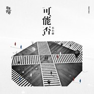
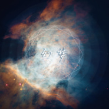
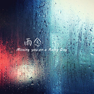
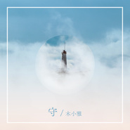

木小雅
============================

|  |  |
| :--: | :-- |
| [ 木小雅](https://i.xiami.com/sia94) | **地区**: China 中国大陆 **风格**: 民谣流行 Folk Pop, 独立民谣 Indie Folk, 国语流行 Mandarin Pop **播放数**: 4170948 **粉丝数**: 3619 **评论数**: 108  |

## 档案

94年出生的水瓶座girl。 
幼时学习过二胡，后又自学了吉他和尤克里里。 
大学二年级时在校创立Ukulele社团，从那时起开始尝试写歌。 
所学为设计专业，毕业后成为了一名设计师，在一家书店工作。 
业余时间依然弹琴写歌，一直以文字、音乐和设计作品，践行自己的理想主义。 
写于2016年秋天的《大地上的异乡者》，成功入围2017第十二届华研·阿里词曲唱作人大赛全国40强。 
2017年夏天，所创作的《守》被选为《了不起的匠人》第二季的网络宣传曲。 
2017年12月，携原创作品《坠星》参加虾米音乐主办的造音之星大赛，入围全国十强并获得第6名。 
2018年3月，所写歌曲《城南谣》和《可能否》入选网易云石头计划第二季。

## 专辑

| 名称 | 语种 | 唱片公司 | 发行时间 | 专辑类别 | 专辑风格 |
| :--: | :-- | :-- | :-- | :-- | :-- |
| [ 愿](./albums/5020841703.md) | 国语 | 网易音乐人 | 2020年05月31日 | 录音室专辑 | 国语流行 Mandarin Pop |
| [ 可能否](./albums/2103726447.md) | 国语 | 独立发行 | 2018年05月30日 | EP, 单曲 |  |
| [ 最忆是南京](./albums/2103715285.md) | 国语 | 独立发行 | 2018年05月21日 | EP, 单曲 | 民谣 Folk, 独立流行 Indie Pop, 华语唱作人 Chinese Singer-Songwriter |
| [ 幻梦](./albums/2103568117.md) | 国语 | 独立发行 | 2018年02月28日 | EP, 单曲 | 独立流行 Indie Pop, 中国风 China-Wave, 华语唱作人 Chinese Singer-Songwriter |
| [ Live Your Dream乐训之歌](./albums/2103494899.md) | 国语 | 独立发行 | 2018年01月18日 | EP, 单曲 | 国语流行 Mandarin Pop, 独立流行 Indie Pop, 华语唱作人 Chinese Singer-Songwriter |
| [ 坠星](./albums/2102890164.md) | 国语 | 独立发行 | 2017年10月30日 | EP, 单曲 | 独立流行 Indie Pop, 华语唱作人 Chinese Singer-Songwriter, 民谣流行 Folk Pop |
| [ 雨念](./albums/2102857699.md) | 国语 | 独立发行 | 2017年09月15日 | EP, 单曲 | 独立流行 Indie Pop, 华语唱作人 Chinese Singer-Songwriter |
| [ 守（《了不起的匠人》网络宣传曲）微纪录片《了不起的匠人》网络宣传曲](./albums/2102769679.md) | 国语 | 独立发行 | 2017年06月21日 | EP, 单曲 | 独立民谣 Indie Folk, 华语唱作人 Chinese Singer-Songwriter |
| [ 大地上的异乡者（New）](./albums/2102759865.md) | 国语 | 独立发行 | 2017年06月05日 | EP, 单曲 | 独立民谣 Indie Folk, 华语唱作人 Chinese Singer-Songwriter, 独立流行 Indie Pop |

## 评论

|  |  |  |
| :-- | :-- | :-- |
|  [虾米用户](https://emumo.xiami.com/u/37663555)  2020-02-24 13:32 赞(0) 踩(0) | 
城门开哪有下载？
 |
|  [虾米用户](https://emumo.xiami.com/u/248907560) 诗酒趁年华，醉卧美人膝。 2020-01-29 16:33 赞(0) 踩(0) | 
但愿早日拿到版权吧虾米，配图我也是醉了，辣眼睛……
 |
|  [虾米用户](https://emumo.xiami.com/u/47552480) a town calle... 2019-11-29 13:16 赞(1) 踩(0) | 
今天在南京台看到你的作品了   恭喜恭喜！
 |
|  [虾米用户](https://emumo.xiami.com/u/377158212)  2019-09-05 20:59 赞(0) 踩(0) | 
城南摇很好听，麒麟音乐节听过的，可是怎么始终找不到？
 |
|  [虾米用户](https://emumo.xiami.com/u/283040611) 不忘初心，方得始终。 2019-07-12 09:18 赞(2) 踩(0) | 
需要静下心来品的歌，美， 
 |
|  [虾米用户](https://emumo.xiami.com/u/402879998) 以后的路，边走边爱，反正... 2019-05-02 12:18 赞(4) 踩(0) | 
沉浸在清欢这样的小心思，便于冥想。 清欢是一场偶遇，犹在古意里萌芽初绽，春愁匝匝而起，一种思绪总是合着谈谈的惆怅不约而来。
 |
|  [虾米用户](https://emumo.xiami.com/u/14004084) 你好 2019-04-20 22:24 赞(0) 踩(0) | 
优秀优秀很喜欢 
 |
|  [虾米用户](https://emumo.xiami.com/u/400558082) 北斗星向左。 2019-03-31 10:59 赞(4) 踩(0) | 
小雅~歌真的很好听 歌词里满满都是最真的冲动呢 我也是只设计狗 喜欢你的生活方式 好好写歌 天天设计 加油呀⊙▽⊙ mua~小雅
 |
|  [虾米用户](https://emumo.xiami.com/u/246689266)  2019-02-24 11:13 赞(0) 踩(0) | 
加油;-)
 |
|  [虾米用户](https://emumo.xiami.com/u/5854459) 潮牌https://dw... 2019-02-07 11:18 赞(1) 踩(0) | 
我代表里尔克感谢你~！太好听了~！
 |
|  [虾米用户](https://emumo.xiami.com/u/285923831)  2019-01-13 21:33 赞(1) 踩(0) | 
超级喜欢民谣也喜欢写歌淘歌 每次听到自己喜欢的声音就像淘到宝一样 羡慕可以坚持写歌 有机会唱给大家听的你们 加油(ง •̀_•́)ง 我也加油 写给自己 唱给自己听 
 |
|  [虾米用户](https://emumo.xiami.com/u/411783168) 而立 2019-01-13 09:04 赞(9) 踩(0) | 
<a href="http://emumo.xiami.com/u/19261701" target="_blank" rel="nofollow" name_card="19261701">@木小雅 </a>您好！不知道您能否看到这条信息，我来自贵州省最南边的一个小山城，荔波县，一个美丽的地方；前段时间在人民日报平台上听了你的《时光是座博物馆》，旋律和词给了我很大的启发，一遍一遍的听，也给了我很多能量，我现在在做关爱山区留守儿童的公益活动，自己组了一个民间组织。叫萤火虫公益，我在酝酿一首团队的主题曲，如果可能，想让您给听听，给点建议。
 |
|  [虾米用户](https://emumo.xiami.com/u/53615004) 十四 2018-12-20 23:29 赞(2) 踩(0) | 
相信你
 |
|  [虾米用户](https://emumo.xiami.com/u/410220317)  2018-12-14 20:35 赞(1) 踩(0) | 
加油⊙▽⊙
 |
|  [虾米用户](https://emumo.xiami.com/u/40254483)  2018-12-12 21:49 赞(3) 踩(0) | 
声音好听，会一直关注你的歌（声音和李雨有点像）
 |
|  [虾米用户](https://emumo.xiami.com/u/26078991) 珍惜～逐梦～ 2018-12-12 11:17 赞(3) 踩(0) | 
很好听的歌，收藏了！ 加油小妹！有梦想并去追逐是最快乐的事情！
 |
|  [虾米用户](https://emumo.xiami.com/u/40611886) 嘿嘿嘿！你好你好呀！ 2018-12-02 22:23 赞(1) 踩(0) | 
很棒的你！
 |
|  [虾米用户](https://emumo.xiami.com/u/309548596) 音乐让我说…… 2018-11-23 16:51 赞(3) 踩(0) | 
你的歌让其他的人红了    
 |
|  [虾米用户](https://emumo.xiami.com/u/335681133) 美好的一天，从听到电台头... 2018-11-21 04:52 赞(1) 踩(0) | 
日推推到你的歌哦，真是有缘~
 |
|  [虾米用户](https://emumo.xiami.com/u/336159698) 完成生命中，每个阶段想做... 2018-09-11 00:50 赞(2) 踩(0) | 
好听，这首可能否我喜欢。
 |
|  [虾米用户](https://emumo.xiami.com/u/339191478)   2018-09-02 23:26 赞(1) 踩(0) | 
❤
 |
|  [虾米用户](https://emumo.xiami.com/u/120300852)  2018-08-22 20:24 赞(1) 踩(0) | 
可能否
 |
|  [虾米用户](https://emumo.xiami.com/u/42834561) 我还没想好要写什么... 2018-08-16 23:04 赞(4) 踩(0) | 
版权啊 小虾米给点力
 |
|  [虾米用户](https://emumo.xiami.com/u/102071270) 我还没想好要写什么... 2018-08-16 15:33 赞(0) 踩(0) | 
  
 |
|  [虾米用户](https://emumo.xiami.com/u/81933)  2018-08-01 21:32 赞(2) 踩(0) | 
干净的声音，难得！
 |
|  [虾米用户](https://emumo.xiami.com/u/356143265)  2018-07-08 17:03 赞(1) 踩(0) | 
加油啊！
 |
|  [虾米用户](https://emumo.xiami.com/u/317862547) 我还没想好要写什 2018-07-04 21:02 赞(2) 踩(0) | 
一直支持你 
 |
|  [虾米用户](https://emumo.xiami.com/u/349406797)  2018-06-24 23:29 赞(10) 踩(0) | 
小雅啊，你的歌现在有超级多的人喜欢了呢。 我真的很替你开心呢。 第一次听你的歌，就被你的声音吸引了。 我真的很喜欢你的声音
 |
|  [虾米用户](https://emumo.xiami.com/u/98394128) 这个家伙有点懒 2018-06-20 15:55 赞(23) 踩(0) | 
可能否啥时候可以回归呀
 |
|  [虾米用户](https://emumo.xiami.com/u/293045922)  2018-06-14 23:38 赞(4) 踩(0) | 
喜欢听小姐姐讲故事w  小姐姐加油呐
 |
|  [虾米用户](https://emumo.xiami.com/u/49895220) 一念静心花开遍世界 2018-06-10 23:45 赞(33) 踩(0) | 
我不用网易、一直用虾米、在网上听到可能否、来虾米找、竟然被网易拿去了   
 |
| ⇒ |  [虾米用户](https://emumo.xiami.com/u/81933)  2018-08-01 21:32 赞(0) 踩(0) | 
虾米死了
 |
|  [虾米用户](https://emumo.xiami.com/u/2469317) 每个人心中都有一团火，路... 2018-05-29 20:33 赞(6) 踩(0) | 
找不到《可能否》
 |
| ⇒ |  [虾米用户](https://emumo.xiami.com/u/19261701) 好好写歌，天天设计。 2018-05-29 20:34 赞(0) 踩(0) | 
嗯嗯，刚下架了~明天会在网易云发布重新制作的版本~请多多支持~
 |
|  [虾米用户](https://emumo.xiami.com/u/344807712) 呆有呆福 2018-05-26 19:04 赞(2) 踩(0) | 
歌声似春风轻轻吹过大南京，声音干净，好听，循环中。加油。   
 |
|  [虾米用户](https://emumo.xiami.com/u/10389433) 不听不听，小鬼念经 2018-05-21 13:17 赞(3) 踩(0) | 
虾米的好 就是你总能听到意外的好，不可否认曲调和声线都让我回味。一直长时间循环也是没问题，但希望作者能有所成长，一成不变的曲风很快就会被听乏味，不得不说现有阶段确实让人听着很舒服。。。为了更好的歌曲希望你不要停下，尽量摒弃不必要的商业味道，越走越远！加油！
 |
| ⇒ |  [虾米用户](https://emumo.xiami.com/u/19261701) 好好写歌，天天设计。 2018-05-21 13:22 赞(0) 踩(0) | 
谢谢鼓励与诚恳的评价，我会加油(* ॑꒳ ॑* )
 |
| ⇒ |  [虾米用户](https://emumo.xiami.com/u/10389433) 不听不听，小鬼念经 2018-05-21 13:24 赞(0) 踩(0) | 
<q><b>木小雅说：</b></q>
 |
| ⇒ |  [虾米用户](https://emumo.xiami.com/u/6204023)  2018-05-29 14:19 赞(0) 踩(0) | 
<q><b>木小雅说：</b></q>
 |
|  [虾米用户](https://emumo.xiami.com/u/259264141)  2018-05-14 12:52 赞(1) 踩(0) | 
第一次听朋友放《大地上的异乡者》，就在想是什么样的女孩唱进了我心里。
 |
| ⇒ |  [虾米用户](https://emumo.xiami.com/u/19261701) 好好写歌，天天设计。 2018-05-14 16:11 赞(0) 踩(0) | 
你和你朋友品味都很好了(&amp;bull;͈˽&amp;bull;͈)
 |
| ⇒ |  [虾米用户](https://emumo.xiami.com/u/259264141)  2018-05-15 06:21 赞(0) 踩(0) | 
<q><b>木小雅说：</b></q>
 |
|  [虾米用户](https://emumo.xiami.com/u/245415765) 在梦与非梦之间，要隐藏多... 2018-04-08 01:34 赞(2) 踩(0) | 
将所有歌都听了一遍，下了一半慢慢听。
 |
| ⇒ |  [虾米用户](https://emumo.xiami.com/u/19261701) 好好写歌，天天设计。 2018-04-08 09:16 赞(0) 踩(0) | 
哇，感谢资瓷~
 |
|  [虾米用户](https://emumo.xiami.com/u/318388273) 逢考必过，高分通过 2018-03-04 09:31 赞(2) 踩(0) | 
我在听你的每一首歌
 |
| ⇒ |  [虾米用户](https://emumo.xiami.com/u/19261701) 好好写歌，天天设计。 2018-03-29 14:52 赞(0) 踩(0) | 
谢谢(ˊᵒ̴̶̷̤ꇴᵒ̴̶̷̤ˋ)
 |
| ⇒ |  [虾米用户](https://emumo.xiami.com/u/318388273) 逢考必过，高分通过 2018-03-29 18:33 赞(0) 踩(0) | 
<q><b>木小雅说：</b></q>
 |
|  [虾米用户](https://emumo.xiami.com/u/306377096) 如是 2018-03-01 00:32 赞(1) 踩(0) | 
超级喜欢你的音乐和词
 |
| ⇒ |  [虾米用户](https://emumo.xiami.com/u/306377096) 如是 2018-09-13 15:15 赞(0) 踩(0) | 
哈哈，祝越来越好
 |
|  [虾米用户](https://emumo.xiami.com/u/349406797)  2018-02-12 16:42 赞(4) 踩(0) | 
声音真的真的很干净，(//&amp;nabla;//)超级好听，以后要加油(ง &amp;bull;̀_&amp;bull;́)ง
 |
| ⇒ |  [虾米用户](https://emumo.xiami.com/u/19261701) 好好写歌，天天设计。 2018-02-12 16:47 赞(0) 踩(0) | 
好嘞~感谢 
 |
|  [虾米用户](https://emumo.xiami.com/u/287493221) 三年时光  若珍惜，则如... 2018-01-28 09:05 赞(3) 踩(0) | 
木小雅你唱歌很好听呢，在新的一年里继续加油吧
 |
| ⇒ |  [虾米用户](https://emumo.xiami.com/u/19261701) 好好写歌，天天设计。 2018-01-28 09:15 赞(0) 踩(0) | 
谢谢~一定加油
 |
| ⇒ |  [虾米用户](https://emumo.xiami.com/u/287493221) 三年时光  若珍惜，则如... 2018-01-28 09:28 赞(0) 踩(0) | 
<q><b>木小雅说：</b></q>
 |
|  [虾米用户](https://emumo.xiami.com/u/284677821) 不死在这里. 2018-01-25 22:48 赞(3) 踩(0) | 
晚安 陌生人天气冷了多穿点
 |
|  [虾米用户](https://emumo.xiami.com/u/278600117)  2018-01-25 10:51 赞(4) 踩(0) | 
清新淡雅的你，在一号鸭绒的我眼里独一无二，特别的爱给特别的木小雅 
 |
| ⇒ |  [虾米用户](https://emumo.xiami.com/u/19261701) 好好写歌，天天设计。 2018-01-25 22:49 赞(0) 踩(0) | 
哈哈，我的粉丝叫鸭绒 认证！
 |
|  [虾米用户](https://emumo.xiami.com/u/267794614) 往往需要的是一瞬间的灵感 2018-01-25 08:21 赞(1) 踩(0) | 
2018新势力有你啊
 |
| ⇒ |  [虾米用户](https://emumo.xiami.com/u/19261701) 好好写歌，天天设计。 2018-01-25 10:18 赞(0) 踩(0) | 
嗯呐，刚看到啦~好惊喜~
 |
| ⇒ |  [虾米用户](https://emumo.xiami.com/u/267794614) 往往需要的是一瞬间的灵感 2018-01-26 14:14 赞(0) 踩(0) | 
<q><b>木小雅说：</b></q>
 |
|  [虾米用户](https://emumo.xiami.com/u/284677821) 不死在这里. 2018-01-21 15:19 赞(3) 踩(0) | 
好听，支持支持支持
 |
| ⇒ |  [虾米用户](https://emumo.xiami.com/u/19261701) 好好写歌，天天设计。 2018-01-23 10:54 赞(0) 踩(0) | 
谢谢啦~
 |
| ⇒ |  [虾米用户](https://emumo.xiami.com/u/284677821) 不死在这里. 2018-01-25 22:49 赞(0) 踩(0) | 
<q><b>木小雅说：</b></q>
 |
|  [虾米用户](https://emumo.xiami.com/u/2001520) Song for you... 2018-01-10 11:48 赞(1) 踩(0) | 
好舒服的声音，真的很棒！支持支持！！
 |
| ⇒ |  [虾米用户](https://emumo.xiami.com/u/19261701) 好好写歌，天天设计。 2018-01-16 13:39 赞(0) 踩(0) | 
感谢支持~我一定继续加油~
 |
|  [虾米用户](https://emumo.xiami.com/u/52860300) 永远没时间整理歌单 2017-12-20 20:58 赞(2) 踩(0) | 
声音猴猴听
 |
| ⇒ |  [虾米用户](https://emumo.xiami.com/u/19261701) 好好写歌，天天设计。 2017-12-27 10:35 赞(0) 踩(0) | 
哈哈真的嘛~感谢鼓励~
 |
|  [虾米用户](https://emumo.xiami.com/u/1156476) 四体不勤，五谷不分 2017-12-12 20:34 赞(2) 踩(0) | 
一开口我就被好听得起了鸡皮疙瘩
 |
|  [虾米用户](https://emumo.xiami.com/u/85568296) 只有阳光而无阴影 只有欢... 2017-12-04 14:07 赞(2) 踩(0) | 
好文艺范吖
 |
|  [虾米用户](https://emumo.xiami.com/u/10177360)  2017-12-03 02:04 赞(2) 踩(0) | 
惊喜连连，感动不断&amp;hellip;&amp;hellip;谢谢你，小雅！Be yourself!
 |
| ⇒ |  [虾米用户](https://emumo.xiami.com/u/19261701) 好好写歌，天天设计。 2017-12-27 10:33 赞(0) 踩(0) | 
好~I will be myself.
 |
|  [虾米用户](https://emumo.xiami.com/u/338230970)  2017-12-02 12:29 赞(2) 踩(0) | 
真好听，从小看着长大的小姑娘变得太优秀了
 |
|  [虾米用户](https://emumo.xiami.com/u/202544570)  2017-11-23 00:37 赞(2) 踩(0) | 
我没有偶像，现在有了，就决定是你了(&amp;acute;&amp;epsilon;｀ )♡
 |
| ⇒ |  [虾米用户](https://emumo.xiami.com/u/19261701) 好好写歌，天天设计。 2017-11-30 15:12 赞(0) 踩(0) | 
哈哈很荣幸~
 |
|  [虾米用户](https://emumo.xiami.com/u/269230109)  2017-10-23 14:42 赞(2) 踩(0) | 
加油
 |
|  [虾米用户](https://emumo.xiami.com/u/50347642)  2017-10-17 21:53 赞(1) 踩(0) | 
好听哇！！！超喜欢你的歌
 |
| ⇒ |  [虾米用户](https://emumo.xiami.com/u/19261701) 好好写歌，天天设计。 2017-11-30 15:06 赞(0) 踩(0) | 
谢谢 
 |
|  [虾米用户](https://emumo.xiami.com/u/79857982)  2017-09-24 23:23 赞(2) 踩(0) | 
这么好听 还用问？！
 |
|  [虾米用户](https://emumo.xiami.com/u/100994174)  2017-09-23 07:55 赞(0) 踩(0) | 
为学姐打卡
 |
|  [虾米用户](https://emumo.xiami.com/u/46233818)  2017-09-22 12:15 赞(0) 踩(0) | 
特殊的声音
 |
|  [虾米用户](https://emumo.xiami.com/u/46233818)  2017-09-22 09:42 赞(1) 踩(0) | 
是否还能多创作几首类似于城南谣 异乡者这样风格的歌曲？很期待你的作品~
 |
| ⇒ |  [虾米用户](https://emumo.xiami.com/u/19261701) 好好写歌，天天设计。 2017-09-22 12:10 赞(0) 踩(0) | 
谢谢喜欢~我一定继续加油，写出更好的作品 
 |
|  [虾米用户](https://emumo.xiami.com/u/606670) 哈！某人！ 2017-09-08 10:14 赞(0) 踩(0) | 
城南谣多美好呀~
 |
| ⇒ |  [虾米用户](https://emumo.xiami.com/u/19261701) 好好写歌，天天设计。 2017-09-11 09:11 赞(0) 踩(0) | 
嗯哪，很美好～
 |
|  [虾米用户](https://emumo.xiami.com/u/311629294)  2017-07-12 19:28 赞(3) 踩(0) | 
像在远处呢喃，使人静下来，好听
 |
| ⇒ |  [虾米用户](https://emumo.xiami.com/u/19261701) 好好写歌，天天设计。 2017-07-12 19:30 赞(0) 踩(0) | 
☺
 |
|  [虾米用户](https://emumo.xiami.com/u/50302951) 未来的憧憬 2017-07-11 09:47 赞(0) 踩(0) | 
排比歌词手
 |
|  [虾米用户](https://emumo.xiami.com/u/309819368)  2017-07-05 21:41 赞(2) 踩(0) | 
当年的小姑娘长大了，喜欢你的词，你的曲，你的声音，低吟浅唱。我会一直关注你的，小雅！
 |
| ⇒ |  [虾米用户](https://emumo.xiami.com/u/19261701) 好好写歌，天天设计。 2017-07-25 22:25 赞(0) 踩(0) | 
诶？看来是位故人~
 |
|  [虾米用户](https://emumo.xiami.com/u/309153004)  2017-07-02 23:22 赞(1) 踩(0) | 
从看视频片尾曲听了《守》这首歌，记住几句歌词，一直在寻找《守》这首歌，在网上提问，论坛求助，今天终于找到，原来歌名字叫《守》，真好听的一首歌，已经设为手机来电铃声。
 |
| ⇒ |  [虾米用户](https://emumo.xiami.com/u/19261701) 好好写歌，天天设计。 2017-07-25 22:27 赞(0) 踩(0) | 
谢谢如此喜爱《守》~希望每天有很多人call你 
 |
|  [虾米用户](https://emumo.xiami.com/u/9978123)   2017-06-11 13:22 赞(0) 踩(0) | 
旋律写的好听
 |
|  [虾米用户](https://emumo.xiami.com/u/170243082)  2017-06-05 22:11 赞(0) 踩(0) | 
声音很好，一直支持你 
 |
|  [虾米用户](https://emumo.xiami.com/u/11811199) 多少唏嘘的你在人海　 2017-05-23 19:31 赞(2) 踩(0) | 
因为异乡者！！！！小雅，加油↖(^&amp;omega;^)↗
 |
| ⇒ |  [虾米用户](https://emumo.xiami.com/u/19261701) 好好写歌，天天设计。 2017-05-23 19:54 赞(0) 踩(0) | 
好，一定加油 
 |
|  [虾米用户](https://emumo.xiami.com/u/49931) Easy man! 2017-04-07 16:30 赞(0) 踩(0) | 
挺好的，加油！！
 |
| ⇒ |  [虾米用户](https://emumo.xiami.com/u/19261701) 好好写歌，天天设计。 2017-04-07 16:31 赞(0) 踩(0) | 
好哒，谢谢☺
 |
|  [虾米用户](https://emumo.xiami.com/u/30131165)  2017-04-06 10:01 赞(0) 踩(0) | 
Y
 |
|  [虾米用户](https://emumo.xiami.com/u/12549836)  2017-03-09 22:09 赞(0) 踩(0) | 
明天和意外，哪个会先到来
 |
|  [虾米用户](https://emumo.xiami.com/u/261925795) 一天不自虐就难受 2017-01-14 21:05 赞(0) 踩(0) | 
嘿嘿嘿 猜猜我是谁
 |
|  [虾米用户](https://emumo.xiami.com/u/37104707)  2015-12-01 13:46 赞(0) 踩(0) | 
美好的 深入我心的
 |
| ⇒ |  [虾米用户](https://emumo.xiami.com/u/19261701) 好好写歌，天天设计。 2015-12-04 18:36 赞(0) 踩(0) | 
谢谢~我会继续写美好的作品的。
 |
|  [虾米用户](https://emumo.xiami.com/u/1305094)  2015-03-10 17:03 赞(0) 踩(0) | 
一下子都听了
 |
|  [虾米用户](https://emumo.xiami.com/u/47968608)  2015-03-09 08:39 赞(0) 踩(0) | 
赞赞
 |
|  [虾米用户](https://emumo.xiami.com/u/47717947)  2015-03-06 12:31 赞(0) 踩(0) | 
优美清新，委婉动听
 |
|  [虾米用户](https://emumo.xiami.com/u/47721239)  2015-03-03 21:54 赞(0) 踩(0) | 
歌词美，曲清新！
 |
|  [虾米用户](https://emumo.xiami.com/u/46951824) 无~~ 2015-02-05 09:12 赞(0) 踩(0) | 
想起柔柔的妹子~
 |
|  [虾米用户](https://emumo.xiami.com/u/19261701) 好好写歌，天天设计。 2014-09-13 00:38 赞(4) 踩(0) | 
我刚入驻了虾米音乐人，欢迎大家来我的个人主页，收听我的最新音乐
 |
