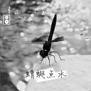

蜻蜓点水
============================

|  |  |
| :--: | :-- |
| [ 蜻蜓点水](https://emumo.xiami.com/album/2103923540) | **艺人**: [文劲松](../index.md) **语种**: 国语 **唱片公司**: 太声文化 **发行时间**: 2018年08月15日 **专辑类别**: EP, 单曲 **专辑风格**:  **播放数**: 1059 **收藏数**: 1 **评论数**: 0  |

## 简介

“蜻蜓点水”指蜻蜓在水面飞行时用尾部轻触水面的动作，比喻做事肤浅不深入。 -  来自百科

## 曲目

## 评论

