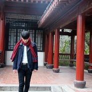
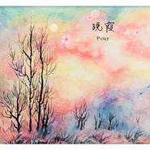
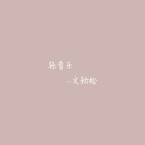

文劲松
============================

|  |  |
| :--: | :-- |
| [ 文劲松](https://i.xiami.com/acymusic) | **地区**: China 中国大陆 **风格**: 国语流行 Mandarin Pop, 轻音乐流行 Light Pop **播放数**: 13604809 **粉丝数**: 602 **评论数**: 37  |

## 档案

文劲松，出生于1993年8月28日，词曲创作人，原创歌手。 代表作：《笛月》、《他们》、《轻音乐系列》。 新浪微博：@文劲松

## 专辑

| 名称 | 语种 | 唱片公司 | 发行时间 | 专辑类别 | 专辑风格 |
| :--: | :-- | :-- | :-- | :-- | :-- |
| [ 失眠修复](./albums/5021694108.md) | 国语 | 太声文化 | 2020年10月19日 | EP, 单曲 | 国语流行 Mandarin Pop |
| [ 堂燕](./albums/5021344198.md) | 纯音乐 | 太声文化 | 2020年08月25日 | EP, 单曲 | 国语流行 Mandarin Pop |
| [ 霓虹之夜](./albums/5021201124.md) | 纯音乐 | 太声文化 | 2020年08月03日 | EP, 单曲 | 电子 Electronic |
| [ 枫叶的故事](./albums/2105652424.md) | 纯音乐 | 太声文化 | 2019年12月31日 | EP, 单曲 | 国语流行 Mandarin Pop |
| [ 写给女朋友的歌](./albums/2105059816.md) | 国语 | 太声文化 | 2019年08月07日 | EP, 单曲 |  |
| [ 翩翩](./albums/2104687925.md) | 国语 | 太声文化 | 2019年03月21日 | EP, 单曲 | 国语流行 Mandarin Pop |
| [ 异地时光](./albums/2104390425.md) | 国语 | 太声文化 | 2018年12月18日 | EP, 单曲 | 国语流行 Mandarin Pop |
| [ 思语](./albums/2104174414.md) | 国语 | 太声文化 | 2018年11月05日 | EP, 单曲 | 国语流行 Mandarin Pop |
| [ 流星](./albums/2104084599.md) | 国语 | 太声文化 | 2018年10月09日 | EP, 单曲 | 国语流行 Mandarin Pop |
| [ 蜻蜓点水](./albums/2103923540.md) | 国语 | 太声文化 | 2018年08月15日 | EP, 单曲 |  |
| [ 晚霞](./albums/2103827953.md) | 国语 | 太声文化 | 2018年07月20日 | EP, 单曲 | 流行 Pop, 轻音乐 Easy Listening |
| [ 彩虹深渊](./albums/2103746935.md) | 国语 | 太声文化 | 2018年06月12日 | EP, 单曲 |  |
| [ 灯花](./albums/2103471835.md) | 纯音乐 | 独立发行 | 2018年01月06日 | EP, 单曲 | 轻音乐 Easy Listening |
| [ 文劲松2015 - 2017原创精选](./albums/2102859244.md) | 国语 | 太声文化 | 2017年09月20日 | 精选集 | 中国风 China-Wave, 轻音乐 Easy Listening |
| [ 文劲松编曲合辑](./albums/2102729014.md) | 国语 | 独立发行 | 2017年04月08日 | 合集, 杂锦 | 国语流行 Mandarin Pop, 中国风 China-Wave |
| [ 那年盛夏](./albums/2100340666.md) | 国语 | 太声文化 | 2016年05月20日 | 录音室专辑 | 国语流行 Mandarin Pop |
| [ 轻音乐Soft music](./albums/2102411013.md) | 国语 | 太声文化 | 2015年04月08日 | 录音室专辑 | 轻音乐 Easy Listening |

## 评论

|  |  |  |
| :-- | :-- | :-- |
|  [虾米用户](https://emumo.xiami.com/u/93970146)  2020-10-17 18:57 赞(1) 踩(0) | 

 |
|  [虾米用户](https://emumo.xiami.com/u/328436973)  2020-02-11 11:55 赞(1) 踩(0) | 
巨佬
 |
|  [虾米用户](https://emumo.xiami.com/u/414274557)  2019-11-18 08:10 赞(1) 踩(0) | 
你真的太棒了
 |
|  [虾米用户](https://emumo.xiami.com/u/358104299) 悲观的唯心存在现实解构虚... 2019-06-18 15:28 赞(1) 踩(0) | 
12140
 |
|  [虾米用户](https://emumo.xiami.com/u/330156454)  2019-04-14 07:08 赞(3) 踩(0) | 
乐曲奏响，泉水喷涌，潺潺溪流，心间暖暖，节拍悠扬，旋律优美，飘过时空，点赞劲松⋯⋯
 |
|  [虾米用户](https://emumo.xiami.com/u/180759270)  2019-02-28 18:39 赞(1) 踩(0) | 
不会太吵
 |
|  [虾米用户](https://emumo.xiami.com/u/345444296)  2019-02-22 16:17 赞(1) 踩(0) | 
我也觉着好
 |
|  [虾米用户](https://emumo.xiami.com/u/6742936) 我还没想好要写什么... 2019-01-21 21:32 赞(1) 踩(0) | 

 |
|  [虾米用户](https://emumo.xiami.com/u/376328463)  2018-12-26 08:19 赞(2) 踩(0) | 
很喜欢你的音乐！每天都听！支持支持哦  
 |
|  [虾米用户](https://emumo.xiami.com/u/407744449)  2018-11-03 16:24 赞(2) 踩(0) | 
好喜欢你，音乐干净，太棒了，纯净，加油加油加油
 |
|  [虾米用户](https://emumo.xiami.com/u/336140332) 我还没想好要写什么... 2018-07-05 18:16 赞(3) 踩(0) | 
工作的时候放你的音乐让人很放松，加油哦～ 
 |
|  [虾米用户](https://emumo.xiami.com/u/335727115) 高维世界之神秘，无人可测 2018-06-24 21:37 赞(2) 踩(0) | 
继续努力，你是一名有前途的音乐家
 |
|  [虾米用户](https://emumo.xiami.com/u/335727115) 高维世界之神秘，无人可测 2018-06-23 21:18 赞(2) 踩(0) | 
我把你一个专辑的轻音乐做成歌单。 我在动态发了。我想你会成名，加油
 |
|  [虾米用户](https://emumo.xiami.com/u/348781585)  2018-06-07 09:58 赞(1) 踩(0) | 
我是你第二百颗❤，手动*^O^*
 |
|  [虾米用户](https://emumo.xiami.com/u/348781585)  2018-06-07 09:56 赞(1) 踩(0) | 
音乐真的很棒，支持你，喜欢你的音乐
 |
|  [虾米用户](https://emumo.xiami.com/u/332265024) 好音乐，在这里 2018-05-27 14:27 赞(1) 踩(0) | 
好听
 |
|  [虾米用户](https://emumo.xiami.com/u/339627529)  2018-03-29 19:22 赞(2) 踩(0) | 
好评。
 |
|  [虾米用户](https://emumo.xiami.com/u/6066908) 光芒与希望 *JazzH... 2018-02-11 09:57 赞(1) 踩(0) | 
很文艺
 |
|  [虾米用户](https://emumo.xiami.com/u/334697137)  2017-12-27 21:01 赞(1) 踩(0) | 
清新
 |
|  [虾米用户](https://emumo.xiami.com/u/309014677)  2017-12-12 08:05 赞(1) 踩(0) | 
好久
 |
|  [虾米用户](https://emumo.xiami.com/u/326188696) 哞～ 2017-10-28 20:50 赞(1) 踩(0) | 
为楼主打电话 
 |
|  [虾米用户](https://emumo.xiami.com/u/293904031)  2017-09-26 20:55 赞(1) 踩(0) | 
是真的好听，有才 
 |
|  [虾米用户](https://emumo.xiami.com/u/324376048) qq,350784464... 2017-09-24 18:54 赞(0) 踩(0) | 
挺好的
 |
|  [虾米用户](https://emumo.xiami.com/u/295632843) 除了工作就是音乐 2017-09-06 21:29 赞(0) 踩(0) | 
前途无量，加油
 |
|  [虾米用户](https://emumo.xiami.com/u/318578959)  2017-08-10 22:46 赞(0) 踩(0) | 
好好听呀
 |
|  [虾米用户](https://emumo.xiami.com/u/261516833)  2017-08-01 14:46 赞(0) 踩(0) | 
挺好听的，听着感觉心情比较舒畅
 |
|  [虾米用户](https://emumo.xiami.com/u/309258877)  2017-07-16 22:41 赞(0) 踩(0) | 
好好听  
 |
|  [虾米用户](https://emumo.xiami.com/u/292702849)  2017-04-30 21:47 赞(0) 踩(0) | 
212
 |
|  [虾米用户](https://emumo.xiami.com/u/27055776) 爱音乐 爱自己 2016-12-07 08:58 赞(0) 踩(0) | 
宁静的感觉
 |
|  [虾米用户](https://emumo.xiami.com/u/11682961)  2014-10-13 17:48 赞(34) 踩(0) | 
我刚入驻了虾米音乐人，欢迎大家来我的个人主页，收听我的最新音乐
 |
| ⇒ |  [虾米用户](https://emumo.xiami.com/u/292702849)  2017-06-05 06:08 赞(0) 踩(0) | 
212
 |
| ⇒ |  [虾米用户](https://emumo.xiami.com/u/334923679)  2017-11-12 22:36 赞(0) 踩(0) | 
谢谢你的歌让我放松 
 |
| ⇒ |  [虾米用户](https://emumo.xiami.com/u/264101869)  ~ヾ(≧O≦)〃嗷~ 2017-12-24 17:15 赞(0) 踩(0) | 
我觉得文劲松的曲调，歌词都很棒，听了好多歌，只有他的歌让人觉得放松与安心。加油！为文劲松打call！ 
 |
| ⇒ |  [虾米用户](https://emumo.xiami.com/u/328714663)  2018-01-24 17:13 赞(0) 踩(0) | 
听着很舒服，加油
 |
| ⇒ |  [虾米用户](https://emumo.xiami.com/u/324455362)   你怂啥怂。 2018-08-21 13:31 赞(0) 踩(0) | 
喜欢安静下来听轻音乐 
 |
| ⇒ |  [虾米用户](https://emumo.xiami.com/u/354754320)  2018-10-02 00:20 赞(0) 踩(0) | 
加油，好好领会不忘初心的含义，你很优秀，但要记住，以后的路上，宁缺毋滥，无论是作品还是其它，也不要随波逐流。我希望文劲松给我的映象永远都像他现在的音乐给我的映象一样---宁静，自然...
 |
| ⇒ |  [虾米用户](https://emumo.xiami.com/u/106137022)  2018-11-15 23:20 赞(0) 踩(0) | 
蕲春的老乡，小小年纪，有这种造诣，前途无量！
 |
