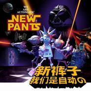

我们是自动的We Are Automatic
============================

|  |  |
| :--: | :-- |
| [ 我们是自动的We Are Automatic](https://emumo.xiami.com/album/15700) | **艺人**: [新裤子](../index.md) **语种**: 国语 **唱片公司**: 摩登天空 **发行时间**: 2002年12月31日 **专辑类别**: 录音室专辑 **专辑风格**: 摇滚 Rock & Roll **播放数**: 448192 **收藏数**: 785 **评论数**: 58  |

## 简介

1998年来中国最畅销乐队——新裤子2002岁末回归之作，充满探索精神的第三张大碟《我们是自动的》定于2002年12月31日全国同步发行。  
  
在这张全新专辑中，既有延续Punk-Pop风格的“我们不听流行音乐”、“Great Time”，又有回到80年代充满躁动的“她是自动的”、“年轻的习惯”，也有电动感极强的“Fashion1983”、“机器猫”，甚至有美到残酷的“我们不能在一起”、“通过呼吸感受这悲伤”。而且新裤子乐队更带来了第一主打作品《她是自动的》超级精彩音乐录影带，由乐队主唱彭磊执导，汇集15名内地顶尖专业技术人员之超越之作，耗时两个月斥资20万元工作结晶，以电影《星球大战》为背景，场面恢弘，构思精美，定格动画与3D技术完美结合。新裤子乐队公然宣称“机械时代”的到来，以铁皮玩偶形象直面未来主义，在浩瀚宇宙中展开一场惊心动魄的追逐之战。  
  
在“年轻的习惯”中，新裤子宣称，“我们需要彼此/我们不必懂恋爱/也没有习不习惯/迟早一天我们分开”，年轻的心态仍旧一览无遗；而在谈到“我们不听流行音乐”时，主唱彭磊则表示，到现在为止“其实一直还是在反对很多东西”；而在主打歌曲“她是自动的”中，则反复的重复着“She is Automatic”一句简单的歌词——他们已抛开了许多形式上的限定，更加实验性与回归到音乐本质。  
  
新裤子乐队前两张专辑《新裤子》和《Disco Girl》均以过10万张的销量占领国内唱片市场，主打歌曲“我们的时代”更成为年轻一代时尚青年的处世格言！此次新裤子乐队以第三张大碟回归乐坛放弃原定的专辑名称《NP3》而更名为《我们是自动的》，其实是一种天真，幻想一种未来的生活方式，正如乐队键盘声庞宽所幻想的，保留自己的意识，而身体其它部位则都由机器组成——他们已经把自己的生活态度与音乐完美结合，但他们并没有活在简单幻想当中。  
  
通听此张专辑，不由不让人感叹新裤子乐队在音乐上的进取和努力，他们一直在不懈地努力并且进步着；当然也叹服键盘与吉他的完美编配，但是更让我们欣喜的是，彭磊的演唱依然是那样充满魅力的“含糊不清”。

## 曲目

## 评论

|  |  |  |
| :-- | :-- | :-- |
|  [虾米用户](https://emumo.xiami.com/u/96296322)  2019-08-13 13:57 赞(0) 踩(0) | 
.
 |
|  [虾米用户](https://emumo.xiami.com/u/14506462) 辣鸡 2017-10-27 22:58 赞(0) 踩(0) | 
记得是千禧年那时候好像满大街都有卖CD磁带各种光盘的，应该是淘的这张磁带。当时越听越喜欢。现在应该找不到了，我也长大了。
 |
|  [虾米用户](https://emumo.xiami.com/u/39569391)  2016-05-18 11:49 赞(0) 踩(0) | 
[FLAC，无损] <a href="http://www.162wp.com/yinle/2016-05-18/26403.html" target="_blank" rel="nofollow noreferrer noopener">http://www.162wp.com/yinle/2016-05-18/26403.html</a>
 |
|  [虾米用户](https://emumo.xiami.com/u/6359925)  2016-01-28 20:40 赞(0) 踩(0) | 
我大一时听的，现在依然超爱。
 |
|  [虾米用户](https://emumo.xiami.com/u/4706723) 网易云jiihan 签名... 2016-01-20 19:49 赞(0) 踩(0) | 
居然听哭了
 |
|  [虾米用户](https://emumo.xiami.com/u/5700043) 嗯 2015-07-28 00:21 赞(0) 踩(0) | 
这张开始新裤子才有了所谓的音乐性
 |
|  [虾米用户](https://emumo.xiami.com/u/13824464)  2015-05-21 18:09 赞(1) 踩(0) | 
03年 的夏天 陪伴我！
 |
|  [虾米用户](https://emumo.xiami.com/u/4286734) 我控萝莉我自豪~ 2014-10-25 21:52 赞(0) 踩(0) | 
小学时我哥买了三盒磁带 一盒是新裤子首张专辑 另外两盒是鲍家街43号
 |
|  [虾米用户](https://emumo.xiami.com/u/7940125) 麻烦你，鱼丸粗面。 2014-07-15 12:22 赞(0) 踩(0) | 
再说一遍 中国的！！！电子！！
 |
|  [虾米用户](https://emumo.xiami.com/u/2391092) 666 2014-06-17 16:58 赞(1) 踩(0) | 
初中的时候无意中听到过她是自动的，当时觉得这都是啥啊，果然当时太连清了。。。。。
 |
|  [虾米用户](https://emumo.xiami.com/u/9711250)  2014-04-26 22:03 赞(0) 踩(0) | 
初中听的，喜欢
 |
|  [虾米用户](https://emumo.xiami.com/u/2119676) 爱国摇，爱90年代 2014-03-20 11:35 赞(1) 踩(0) | 
听she is auto整个人都躁起来了，我的青春从此变得虚幻又美丽
 |
|  [虾米用户](https://emumo.xiami.com/u/5450918)  2014-03-11 19:50 赞(1) 踩(0) | 
初一的时候无意中买到这盘磁带（因为封面好卡通），还是正版的，结果幼小的心灵受到了重创，当时真是接受不来啊，无论是旋律还是唱腔都听着又难受又奇怪又让人欲罢不能。。。现在想来那是我第一次接触摇滚吧（当然除了beyond）
 |
| ⇒ |  [虾米用户](https://emumo.xiami.com/u/6359925)  2017-10-27 23:40 赞(0) 踩(0) | 
我小学时听了表哥买的崔健卡带，直接无语，受到重创，无法理解与欣赏。。。 结果上初中后开始听黑豹、唐朝以及崔健等，从此深陷于摇滚乐中。
 |
|  [虾米用户](https://emumo.xiami.com/u/789449) 德能胜妖 2014-01-11 06:45 赞(0) 踩(0) | 
年轻的时候错过了这张，那时候在平湖的CD铺里看到，但我选了无聊军队
 |
|  [虾米用户](https://emumo.xiami.com/u/414225) .......~_~ 2014-01-05 20:30 赞(0) 踩(0) | 
newpants的punk时代.........
 |
|  [虾米用户](https://emumo.xiami.com/u/195251) 我不高兴 就随时大姨妈 2013-12-27 10:18 赞(6) 踩(0) | 
我小学买的  虽然是盗版 也是恨死这个团队了 声音跟弱智一样 难听死了 还我三块钱！！
 |
|  [虾米用户](https://emumo.xiami.com/u/6359925)  2013-11-27 22:35 赞(1) 踩(0) | 
这专辑我03年时，天天反复听，超爱。有时外出，带着卡带随身听，此一盘足矣，反复重复N遍。
 |
|  [虾米用户](https://emumo.xiami.com/u/23778903)  2013-10-25 15:11 赞(0) 踩(0) | 
忘了昨天，忘了随便的誓言
 |
|  [虾米用户](https://emumo.xiami.com/u/4001366)   2013-10-16 15:15 赞(0) 踩(0) | 
封面恶搞星战么。。
 |
|  [虾米用户](https://emumo.xiami.com/u/7101064)  2013-09-22 09:31 赞(0) 踩(0) | 
最爱新裤子！
 |
|  [虾米用户](https://emumo.xiami.com/u/10708744)  2013-03-02 22:07 赞(0) 踩(0) | 
还是这么喜欢新裤子
 |
|  [虾米用户](https://emumo.xiami.com/u/6642241) never stop 2013-02-19 13:52 赞(0) 踩(0) | 
好久没听新裤子了，今天重温一下，还是像第一次听那样感动，赞
 |
|  [虾米用户](https://emumo.xiami.com/u/277269)  2013-01-12 14:44 赞(1) 踩(0) | 
平静的听着这张专辑，听到《我们不能在一起》，忽然我的心就像玻璃，不堪一击。我们不能在一起，只因为明天会分离，这句话很不是时候的来到了我的耳边。 这个声音是那样的绝望与无助，我一遍又一遍的听着，听着这个男人在我耳边说着这句话，一直以来都没有一个人对我说这句我心里早以明白的话。
 |
|  [虾米用户](https://emumo.xiami.com/u/11181005) 7 2012-10-31 15:08 赞(0) 踩(0) | 
电子 新裤子
 |
|  [虾米用户](https://emumo.xiami.com/u/63360) Yahoo↖(^ω^)↗ 2012-09-25 13:55 赞(0) 踩(0) | 
第一次听到国内的摇滚乐，就是新裤子的。那时候是2002年，十年后，我依旧听着他们的歌。
 |
|  [虾米用户](https://emumo.xiami.com/u/325488)  2012-09-12 09:28 赞(0) 踩(0) | 
太棒了
 |
|  [虾米用户](https://emumo.xiami.com/u/7530877)   2012-08-30 11:37 赞(0) 踩(0) | 
原来他们还挺朋啊
 |
| ⇒ |  [虾米用户](https://emumo.xiami.com/u/24827071)  2013-10-19 04:48 赞(0) 踩(0) | 
中国的雷蒙斯
 |
|  [虾米用户](https://emumo.xiami.com/u/150395)  2012-07-25 13:11 赞(0) 踩(0) | 
十多年了 不变的感动~
 |
| ⇒ |  [虾米用户](https://emumo.xiami.com/u/24827071)  2013-10-19 04:48 赞(0) 踩(0) | 
年轻过
 |
|  [虾米用户](https://emumo.xiami.com/u/150395)  2012-07-25 13:09 赞(0) 踩(0) | 
啊~~~小时候听的 攒了一星期的早餐钱买了这盘磁带。。哈~  她是自动的~~~
 |
|  [虾米用户](https://emumo.xiami.com/u/1280296) 暂无签名~ 2012-05-29 15:44 赞(1) 踩(0) | 
她是自动的
 |
|  [虾米用户](https://emumo.xiami.com/u/8116178)  2012-04-21 12:14 赞(0) 踩(0) | 
比较前卫的音乐了，只是年少时没听出来。
 |
|  [虾米用户](https://emumo.xiami.com/u/6705699)  2012-04-08 16:50 赞(0) 踩(0) | 
嗷呜嗷呜的声音
 |
|  [虾米用户](https://emumo.xiami.com/u/244089) 好好学习 2012-03-01 02:44 赞(0) 踩(0) | 
我最喜欢的1，机器猫。2，我们不能在一起。3，Baby i want u.
 |
|  [虾米用户](https://emumo.xiami.com/u/7903271)  2012-02-04 05:53 赞(0) 踩(0) | 
我是裤子迷
 |
|  [虾米用户](https://emumo.xiami.com/u/4788608) 世界太小，無處可滾。 2012-01-10 00:14 赞(0) 踩(0) | 
隨便聽聽。
 |
|  [虾米用户](https://emumo.xiami.com/u/63360) Yahoo↖(^ω^)↗ 2011-12-31 10:32 赞(0) 踩(0) | 
第一次知道新裤子 的专辑
 |
|  [虾米用户](https://emumo.xiami.com/u/6735380) 自我封闭患者 2011-12-24 16:34 赞(0) 踩(0) | 
新裤子
 |
|  [虾米用户](https://emumo.xiami.com/u/636837)  2011-12-09 22:34 赞(0) 踩(0) | 
都很好听 我想看他们的现场
 |
|  [虾米用户](https://emumo.xiami.com/u/767116) 暂无签名~ 2011-11-28 21:02 赞(0) 踩(0) | 
那时代的回忆
 |
|  [虾米用户](https://emumo.xiami.com/u/767116) 暂无签名~ 2011-11-28 20:57 赞(0) 踩(0) | 
那时代的记忆都在里面了
 |
|  [虾米用户](https://emumo.xiami.com/u/785774)  2011-11-26 01:48 赞(0) 踩(0) | 
nice
 |
|  [虾米用户](https://emumo.xiami.com/u/6155436)  2011-10-08 08:45 赞(0) 踩(0) | 
我初中的时候买过的卡带
 |
|  [虾米用户](https://emumo.xiami.com/u/6155436)  2011-10-08 08:45 赞(0) 踩(0) | 
我以前还初中的时候买过的卡带
 |
|  [虾米用户](https://emumo.xiami.com/u/3255139)  2011-07-15 22:34 赞(0) 踩(0) | 
感觉
 |
|  [虾米用户](https://emumo.xiami.com/u/4783939)  2011-07-11 18:16 赞(0) 踩(0) | 
我们是电动的
 |
|  [虾米用户](https://emumo.xiami.com/u/1461104)  2011-05-08 15:56 赞(0) 踩(0) | 
这张真好
 |
|  [虾米用户](https://emumo.xiami.com/u/1333134)  2011-05-05 10:43 赞(0) 踩(0) | 
动听，时髦，童年时对迪斯科合成器的迷恋融合在青年时对摇滚音乐的热血中，铸造了活力四射的幸福感。
 |
| ⇒ |  [虾米用户](https://emumo.xiami.com/u/6155436)  2011-10-08 09:08 赞(0) 踩(0) | 
原来是迪斯科合成器，我就是很喜欢那个
 |
|  [虾米用户](https://emumo.xiami.com/u/3380543)  2011-04-04 22:49 赞(0) 踩(0) | 
摇滚有感觉......
 |
|  [虾米用户](https://emumo.xiami.com/u/3418951)   2011-04-03 22:13 赞(0) 踩(0) | 
大爱
 |
|  [虾米用户](https://emumo.xiami.com/u/504192)  2011-01-07 20:36 赞(0) 踩(0) | 
机器猫
 |
|  [虾米用户](https://emumo.xiami.com/u/1073894) 天佑人性 2010-10-06 21:58 赞(0) 踩(0) | 
《我们不听流行音乐》那首里有《18岁》
 |
|  [虾米用户](https://emumo.xiami.com/u/443682)  2009-10-30 08:41 赞(0) 踩(0) | 
还记得那是个初中 有个破旧的小屋子 我们在里面淘宝 结果 找到了“新裤子”
 |
|  [虾米用户](https://emumo.xiami.com/u/443682)  2009-10-30 08:41 赞(0) 踩(0) | 
还记得那是个初中 有个破旧的小屋子 我们在里面淘宝 结果 找到了“新裤子”
 |
|  [虾米用户](https://emumo.xiami.com/u/443682)  2009-10-30 08:40 赞(0) 踩(0) | 
还记得那是个初中 有个破旧的小屋子 我们在里面淘宝 结果 找到了“新裤子”
 |
