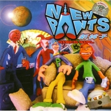

Disco Girl
============================

|  |  |
| :--: | :-- |
| [ Disco Girl](https://emumo.xiami.com/album/15701) | **艺人**: [新裤子](../index.md) **语种**: 国语 **唱片公司**: 摩登天空 **发行时间**: 2000年10月01日 **专辑类别**: 录音室专辑 **专辑风格**: 摇滚 Rock & Roll **播放数**: 863419 **收藏数**: 818 **评论数**: 60  |

## 简介

时隔一年，不长不短，“新裤子”又推出了他们的第二张专辑《Disco Girl》。就听过之后的第一感觉而言，他们已经向朋克团队说了再见，而越来越靠近主流阵营了，时尚感与潮流感成为他们所扯起的新的旗帜。  
  
整张专辑给人的感觉是“新裤子”几乎已经彻底摒弃了他们从前所惯用的以三个和弦为明显特征的Punk音乐，转而以流畅的吉他流行曲和一度风靡的电子乐为主要架构，可以看得出新裤子在音乐类型上的不断尝试和音乐理念上的变化。  
  
一首"Disco Girl"是唱给都市新新人类的，他们的生活是可以通宵达旦地沉溺于Disco的刺激，他们是在酒吧和迪厅里定情的，他们是集体接吻的。  
  
在这张专辑里，很有意思的是“新裤子”唱了一首叫做"Modern Sky"的歌，这自然让人联想到他们的唱片公司的名字。当年鼎鼎大名的朋克乐队Sex Pistols也有一首歌叫做"EMI"，同样是唱给自己的唱片公司的。当然“新裤子”此举在一片乌烟瘴气的中国摇滚乐坛难免会成为某些人用来攻击的目标，但是实际上“新裤子”赋予了"Modern Sky"新潮和时尚的意义，一片摩登的天空下生活着的新新人类，他们有自己的生活态度、世界观和更为开阔的眼界，他们可以有“这是我们的时代”、“我愿意我愿意享受痛苦的每一天”这样的口头哲学。  
  
“新裤子”开口唱英文歌了，虽然吐字发音上还不是很流畅，但这也是他们向国际化接轨所走出的一步，相较那些只能使用一些简单的美国俚语单词的乐队而言，他们已经算是有了一定的进步了。  
  
还有一件需要交待的事情就是，“新裤子”的主唱彭磊导演了“我爱你”的Music Video，动用了黏土动画，这在国内还是首次。同时彭磊的粘土工作室"Ultra Girl"也作为一个制作黏土动画Music Video的子品牌纳入了摩登天空旗下。  
  
当朋克浪潮的火爆还依稀在昨日历历在目时，今天的阳光已经跟昨天不太一样了。（南野）

## 曲目

## 评论

|  |  |  |
| :-- | :-- | :-- |
|  [虾米用户](https://emumo.xiami.com/u/14514591) collage 拼贴制作... 2020-11-13 17:44 赞(0) 踩(0) | 
磁带到手～[带墨镜笑]
 |
|  [虾米用户](https://emumo.xiami.com/u/96296322)  2019-08-12 17:31 赞(0) 踩(0) | 
.
 |
|  [虾米用户](https://emumo.xiami.com/u/95275198)  2019-07-23 23:11 赞(0) 踩(0) | 
怀念小时候用复读机听裤子花儿中国火
 |
|  [虾米用户](https://emumo.xiami.com/u/32824512) 阴凉潮湿晦暗 回到无人洞... 2016-09-01 09:41 赞(1) 踩(0) | 
过完了八月就下架了 还好我的八月都在听新裤子
 |
|  [虾米用户](https://emumo.xiami.com/u/39394031) 他是个饶舌歌手 2016-01-13 00:08 赞(1) 踩(0) | 
一首我爱你当年火的不行，mv太潮了
 |
|  [虾米用户](https://emumo.xiami.com/u/98225988) 普洱一壶诉衷肠 菩提一挂... 2016-01-07 18:52 赞(0) 踩(0) | 
我快哭了 我的青春我的摇滚乐
 |
|  [虾米用户](https://emumo.xiami.com/u/87854144)  2015-12-01 20:50 赞(1) 踩(0) | 
听过这个专辑的都暴露年龄了吧
 |
|  [虾米用户](https://emumo.xiami.com/u/56942442)  2015-09-11 18:24 赞(0) 踩(0) | 
曾经非常喜欢的一张专辑。
 |
|  [虾米用户](https://emumo.xiami.com/u/44136294)   2015-08-23 06:13 赞(0) 踩(0) | 
来过 来过
 |
|  [虾米用户](https://emumo.xiami.com/u/560540) 勇敢的好姑娘永垂不朽 2015-08-19 11:00 赞(0) 踩(0) | 
我爱你，怕再也见不到你，也怕失去你，所以我爱你
 |
|  [虾米用户](https://emumo.xiami.com/u/3001275)   2015-06-13 12:18 赞(0) 踩(0) | 
一直在向主流靠近，一直在矜持着妥协
 |
|  [虾米用户](https://emumo.xiami.com/u/5396944)  2015-02-21 17:06 赞(6) 踩(0) | 
好好的Punk乐队为毛去唱电子啊，为毛啊
 |
| ⇒ |  [虾米用户](https://emumo.xiami.com/u/5148458) 骨子里还是庸俗 2017-11-06 04:59 赞(0) 踩(0) | 
其实这张就已经很电了，你听听计算机
 |
|  [虾米用户](https://emumo.xiami.com/u/3620633) 我还没想好要写什么... 2014-09-04 02:09 赞(0) 踩(0) | 
我爱你总怕再见不到你
 |
|  [虾米用户](https://emumo.xiami.com/u/3498718)  2014-08-25 15:43 赞(1) 踩(0) | 
我买的卡带没有最后一首《空袭》
 |
|  [虾米用户](https://emumo.xiami.com/u/2431209)  2014-07-19 23:57 赞(0) 踩(0) | 
才华横溢的乐队
 |
|  [虾米用户](https://emumo.xiami.com/u/30769811)   2014-06-02 08:36 赞(1) 踩(0) | 
我最喜欢的乐队，陪伴我快要十年了，，，，
 |
|  [虾米用户](https://emumo.xiami.com/u/25283492) 我就想当个丁克怎么了 2014-05-22 13:44 赞(0) 踩(0) | 
我们明天就分手  这首歌听了十多年了，是我最爱的一首歌。
 |
|  [虾米用户](https://emumo.xiami.com/u/7211158) 我们的世界不能没有音乐！ 2014-03-27 23:35 赞(0) 踩(0) | 
是的:…楼上说的很好…
 |
|  [虾米用户](https://emumo.xiami.com/u/2119676) 爱国摇，爱90年代 2014-03-20 11:34 赞(0) 踩(0) | 
这么多年过去了，每次听到新裤子的歌还是会热泪盈眶，尤其是老歌没人能超越
 |
|  [虾米用户](https://emumo.xiami.com/u/1742538)   2014-01-25 13:42 赞(14) 踩(0) | 
为数不多的没有土腥味的大陆乐队
 |
|  [虾米用户](https://emumo.xiami.com/u/148521)  2014-01-15 21:27 赞(0) 踩(0) | 
！！！！！！！！
 |
|  [虾米用户](https://emumo.xiami.com/u/519583)  2013-11-04 19:31 赞(0) 踩(0) | 
我特别喜欢Modern Sky这首歌，很长时间没听再听，莫名的感动。
 |
|  [虾米用户](https://emumo.xiami.com/u/7101064)  2013-09-22 09:32 赞(0) 踩(0) | 
最爱新裤子！
 |
|  [虾米用户](https://emumo.xiami.com/u/16244285) 我还没想好要写什么... 2013-06-27 16:37 赞(1) 踩(0) | 
She Is The One
 |
|  [虾米用户](https://emumo.xiami.com/u/11771688)  2012-12-05 14:31 赞(0) 踩(0) | 
好音乐！用心做的音乐！
 |
|  [虾米用户](https://emumo.xiami.com/u/7623143)  2012-11-04 11:19 赞(0) 踩(0) | 
我爱你我爱你我爱你！！！！！！
 |
|  [虾米用户](https://emumo.xiami.com/u/11181005) 7 2012-10-31 15:00 赞(0) 踩(0) | 
迪斯科新裤子
 |
|  [虾米用户](https://emumo.xiami.com/u/6767955) 求存是異種 2012-09-25 01:01 赞(0) 踩(0) | 
新裤子！！！！！！！！！不错的大陆乐团。
 |
| ⇒ |  [虾米用户](https://emumo.xiami.com/u/752597)  2013-06-17 13:02 赞(0) 踩(0) | 
你好港澳台同胞
 |
|  [虾米用户](https://emumo.xiami.com/u/4163765)  2012-09-10 11:10 赞(0) 踩(0) | 
我爱你
 |
|  [虾米用户](https://emumo.xiami.com/u/9979392)  2012-07-27 11:16 赞(0) 踩(0) | 
最早的最爱的、
 |
|  [虾米用户](https://emumo.xiami.com/u/5021)  2012-04-08 19:14 赞(0) 踩(0) | 
一直都是我的最爱。是最爱
 |
|  [虾米用户](https://emumo.xiami.com/u/244089) 好好学习 2012-03-01 02:42 赞(31) 踩(0) | 
真好听啊！５５５５我哭了。可以听一辈子了。强烈要求全国ＫＴＶ把新裤子的每首歌都弄进去。
 |
| ⇒ |  [虾米用户](https://emumo.xiami.com/u/594556)   2012-04-25 13:53 赞(0) 踩(0) | 
我们这只能唱唱BYE BYE DISCO 、、、、
 |
| ⇒ |  [虾米用户](https://emumo.xiami.com/u/7168207)  2012-10-06 15:34 赞(0) 踩(0) | 
<q><b>justify harm说：</b></q>
 |
| ⇒ |  [虾米用户](https://emumo.xiami.com/u/7168207)  2012-10-06 15:34 赞(0) 踩(0) | 
<q><b>justify harm说：</b></q>
 |
| ⇒ |  [虾米用户](https://emumo.xiami.com/u/244089) 好好学习 2013-02-14 23:22 赞(0) 踩(0) | 
<q><b>justify harm说：</b></q>
 |
| ⇒ |  [虾米用户](https://emumo.xiami.com/u/7874472) 我还没想好要写什么... 2013-11-13 23:41 赞(0) 踩(0) | 
我又来听
 |
| ⇒ |  [虾米用户](https://emumo.xiami.com/u/244089) 好好学习 2013-11-14 06:01 赞(0) 踩(0) | 
<q><b>芬_兰说：</b></q>
 |
|  [虾米用户](https://emumo.xiami.com/u/7903271)  2012-02-04 06:16 赞(0) 踩(0) | 
喜欢
 |
|  [虾米用户](https://emumo.xiami.com/u/7049446)  2012-01-12 16:23 赞(0) 踩(0) | 
其实一张专辑里面总有好听和不好听···但这不是要选择的~而是他们乐队成长所必须的！
 |
|  [虾米用户](https://emumo.xiami.com/u/1998189)  2011-12-25 19:18 赞(1) 踩(0) | 
上高中时候听的歌，很喜欢呢，转眼十年过去了，依旧是那么的熟悉。
 |
|  [虾米用户](https://emumo.xiami.com/u/4238965)  2011-11-29 18:59 赞(0) 踩(0) | 
cool
 |
|  [虾米用户](https://emumo.xiami.com/u/785774)  2011-11-26 01:46 赞(0) 踩(0) | 
nice
 |
|  [虾米用户](https://emumo.xiami.com/u/2006056)  2011-09-16 23:07 赞(0) 踩(0) | 
真实的好东西啊。。童年的美好回忆
 |
|  [虾米用户](https://emumo.xiami.com/u/260853) 少听音乐多上火 2011-08-24 23:10 赞(0) 踩(0) | 
我爱你，我总怕见不到你
 |
|  [虾米用户](https://emumo.xiami.com/u/3255139)  2011-07-15 22:33 赞(0) 踩(0) | 
感觉
 |
|  [虾米用户](https://emumo.xiami.com/u/3083299)  2011-06-17 15:30 赞(0) 踩(0) | 
我总怕见到你
 |
|  [虾米用户](https://emumo.xiami.com/u/324649)  2011-06-12 00:21 赞(0) 踩(0) | 
如果我自殺，我一定播放這裡的某首歌。
 |
|  [虾米用户](https://emumo.xiami.com/u/542035)  2010-11-23 11:47 赞(0) 踩(0) | 
猴子可以拿去卖
 |
|  [虾米用户](https://emumo.xiami.com/u/1240301) 我还没想好要写什么... 2010-08-28 18:54 赞(0) 踩(0) | 
追随the cure的风格
 |
| ⇒ |  [虾米用户](https://emumo.xiami.com/u/312179) 潜入深蓝，放肆幻听 2011-11-09 13:04 赞(0) 踩(0) | 
居然能听出THECURE的风格，真服了。
 |
| ⇒ |  [虾米用户](https://emumo.xiami.com/u/10499065)  2013-11-13 22:08 赞(0) 踩(0) | 
<q><b>sober说：</b></q>
 |
|  [虾米用户](https://emumo.xiami.com/u/1245184) 我还没想好要写什么... 2010-08-03 18:13 赞(0) 踩(0) | 
最尴尬的时刻和我爱你 伴我度过了美好时光 海苔 我要美好时光 对不起 又胡言乱语了 该吃药了
 |
|  [虾米用户](https://emumo.xiami.com/u/4385) (ง •̀_•́)ง 2010-07-10 18:19 赞(0) 踩(0) | 
我爱你，我总怕见不到你
 |
|  [虾米用户](https://emumo.xiami.com/u/183580)   2010-06-27 12:15 赞(0) 踩(0) | 
我爱你，我总怕见不到你
 |
|  [虾米用户](https://emumo.xiami.com/u/389293)  2009-11-19 23:11 赞(0) 踩(0) | 
******
 |
|  [虾米用户](https://emumo.xiami.com/u/389293)  2009-11-19 23:11 赞(0) 踩(0) | 
******
 |
|  [虾米用户](https://emumo.xiami.com/u/382332)   2009-09-14 20:15 赞(0) 踩(0) | 
唉，小时候的而回忆啊~
 |
