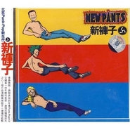

新裤子 同名专辑New Pants
============================

|  |  |
| :--: | :-- |
| [ 新裤子 同名专辑New Pants](https://emumo.xiami.com/album/15702) | **艺人**: [新裤子](../index.md) **语种**: 国语 **唱片公司**: 摩登天空 **发行时间**: 1998年11月01日 **专辑类别**: 录音室专辑 **专辑风格**: 朋克 Punk Rock, 流行朋克 Pop Punk **播放数**: 2229828 **收藏数**: 2288 **评论数**: 278  |

## 简介

新裤子乐队成立于1996年，1997年签约于摩登天空。他们是新北京摇滚乐队的代表之一，同时被誉为“中国最佳Punk-pop乐队”。首张同名专辑动用了摩登天空公司的最强阵容。其中所涵的人文精神与入世哲学无疑将对新生代青年的世界观产生深远的影响。

## 曲目

## 评论

|  |  |  |  |
| :-- | :-- | :-- | :-- |
|  [虾米用户](https://emumo.xiami.com/u/170084878)  2021-01-22 15:36 赞(0) 踩(0) | 
出新裤子首张同名专辑首版和（北海怪兽）首版啦啦
 |
|  [虾米用户](https://emumo.xiami.com/u/18799096)  2020-09-08 22:07 赞(0) 踩(0) | 
感觉还行
 |
|  [虾米用户](https://emumo.xiami.com/u/121702052) 超脱 2020-08-12 20:56 赞(0) 踩(0) | 

 |
|  [虾米用户](https://emumo.xiami.com/u/25906551) 我还没想好要写什么... 2020-08-08 00:01 赞(0) 踩(0) | 
我居然听出了王子的少年感
 |
|  [虾米用户](https://emumo.xiami.com/u/338032733) 極 度 理 智 2020-07-29 04:30 赞(0) 踩(0) | 
太经典了！！！
 |
|  [虾米用户](https://emumo.xiami.com/u/441027433)  2020-03-27 14:43 赞(0) 踩(0) | 
第一张专辑这么经典为啥听不了啊，可比肩黑豹的第一张专辑啊
 |
|  [虾米用户](https://emumo.xiami.com/u/487179) 未爱丕 2020-02-14 22:11 赞(0) 踩(0) | 
心目中的神砖啊
 |
|  [虾米用户](https://emumo.xiami.com/u/91032728) 花有重开日 人无再少年 2020-02-08 00:19 赞(0) 踩(0) | 
版权都没有可怜的虾米音乐
 |
|  [虾米用户](https://emumo.xiami.com/u/48812102) I am your fa... 2020-01-25 02:49 赞(0) 踩(0) | 
原版磁带的路过一下
 |
|  [虾米用户](https://emumo.xiami.com/u/96296322)  2019-08-12 16:50 赞(0) 踩(0) | 
.
 |
|  [虾米用户](https://emumo.xiami.com/u/344208863)  2019-08-10 20:56 赞(0) 踩(0) | 
朋克并不戳我，但这张流行朋克挺悦耳，98年彭导不过20出头，歌里满满的都是朝气
 |
|  [虾米用户](https://emumo.xiami.com/u/45881128) 来找我玩 在虾米解散前 2019-06-25 17:21 赞(0) 踩(0) | 
雷蒙斯裤子
 |
|  [虾米用户](https://emumo.xiami.com/u/310073912)  2018-06-25 16:58 赞(0) 踩(0) | 
版权啊版权
 |
|  [虾米用户](https://emumo.xiami.com/u/282121196) 我还没想好要写什么... 2018-05-08 21:13 赞(0) 踩(0) | 
初中一年级听的
 |
|  [虾米用户](https://emumo.xiami.com/u/7814389) 我还没想好要写什么... 2018-03-14 22:03 赞(0) 踩(0) | 
沃日啦 尼玛 版权呢
 |
|  [虾米用户](https://emumo.xiami.com/u/30694588) 我还没想好要写什么... 2018-02-03 23:46 赞(0) 踩(0) | 
为什么下架了呀
 |
|  [虾米用户](https://emumo.xiami.com/u/7101064)  2017-06-14 09:23 赞(0) 踩(0) | 
收藏！
 |
|  [虾米用户](https://emumo.xiami.com/u/69307508) 雀跃的人在河边骑脚踏车，... 2017-04-13 18:50 赞(0) 踩(0) | 
98...
 |
|  [虾米用户](https://emumo.xiami.com/u/332689)  2017-03-24 21:23 赞(0) 踩(0) | 
当年，这张专辑，我买了两张，自己收藏一张，送给最要好的哥们一张。难得好专辑，虽然我只听金属，虽然这是朋克。
 |
|  [虾米用户](https://emumo.xiami.com/u/7101064)  2016-11-02 02:27 赞(0) 踩(0) | 
最爱
 |
|  [虾米用户](https://emumo.xiami.com/u/3137428)  2016-09-26 14:15 赞(4) 踩(0) | 
国内第一支流行复古朋克，当时没什么人能懂，很多只听流行乐的人觉得土气，听了点摇滚乐的人又觉得他们技术太糙，来回几个和弦，但是他们真正的树立了自己的旗帜和特点，引领着一股潮流。反正一直一直的喜欢他们。
 |
|  [虾米用户](https://emumo.xiami.com/u/80997892)  Life’s a bi... 2016-09-15 11:04 赞(2) 踩(0) | 
绝对的经典，在九十年代后期开始，中国摇滚已过了巅峰，但新裤子的首张专辑是其中为数不多的经典，整张专辑散发着一种世界大同的气息，让人觉得我们即将进入的新千年真的是一个美好的无忧无虑的时代，没有烦恼只有欢乐，虽然这只是年轻人的梦想吧。
 |
|  [虾米用户](https://emumo.xiami.com/u/7101064)  2016-09-10 13:18 赞(0) 踩(0) | 
超级喜欢！
 |
|  [虾米用户](https://emumo.xiami.com/u/5732142) 。 2016-08-01 04:22 赞(0) 踩(0) | 
那个看报纸为主的年代，流行歌曲盛行还出歌谱，身着难看的化纤的肥大的校服，没有玩的时间还要周末上数学学校，埋头于各科竞赛题，没什么可以讲究的，买买打口碟，或听听崔健，也就这样了，多年后的今天才发现当年还有这样的乐队。
 |
|  [虾米用户](https://emumo.xiami.com/u/515867) Life Continu... 2016-07-18 19:17 赞(0) 踩(0) | 
那时候 在车站和过街天桥邂逅尚笑和刘葆 看Live时纸飞机直接戳中彭磊 Orz
 |
|  [虾米用户](https://emumo.xiami.com/u/9988026) 虾米，圣诞节快乐。 2016-06-23 16:07 赞(1) 踩(0) | 
新裤子，旧裤子，比不上当年的喇叭裤子
 |
|  [虾米用户](https://emumo.xiami.com/u/39569391)  2016-05-18 14:14 赞(1) 踩(0) | 
[FLAC，无损]<a href="http://www.162wp.com/yinle/2016-05-18/26405.html" target="_blank" rel="nofollow noreferrer noopener">http://www.162wp.com/yinle/2016-05-18/26405.html</a>
 |
| ⇒ |  [虾米用户](https://emumo.xiami.com/u/279174105)  2017-10-16 17:36 赞(0) 踩(0) | 
谢谢共享
 |
|  [虾米用户](https://emumo.xiami.com/u/15510454) 日常生活让人挺胸抬头不盯... 2016-05-13 22:51 赞(0) 踩(0) | 
像是喝嗨了的即兴创作，这个时候他们肯定讲求的是吼的开心就好
 |
|  [虾米用户](https://emumo.xiami.com/u/244089) 好好学习 2016-05-08 00:45 赞(0) 踩(0) | 
haishinamehaoting
 |
|  [虾米用户](https://emumo.xiami.com/u/244089) 好好学习 2016-05-08 00:45 赞(0) 踩(0) | 
haishinamehaoting
 |
|  [虾米用户](https://emumo.xiami.com/u/244089) 好好学习 2016-05-08 00:45 赞(0) 踩(0) | 
haishinamehaoting
 |
|  [虾米用户](https://emumo.xiami.com/u/12237151) 禾几生，禾几长 2016-05-07 11:39 赞(0) 踩(0) | 
太多太多
 |
|  [虾米用户](https://emumo.xiami.com/u/21470494)  2016-05-05 01:48 赞(1) 踩(0) | 
我上小学5年级第一次听到朋克，摇滚一发不可收拾  岁月如梭我已经刚满30周岁 
 |
|  [虾米用户](https://emumo.xiami.com/u/8094301) Bye bye wx n... 2016-04-05 17:35 赞(1) 踩(0) | 
98年啊那可是
 |
| ⇒ |  [虾米用户](https://emumo.xiami.com/u/3066) 人为容器，手传心意 2019-08-01 12:53 赞(0) 踩(0) | 
哈哈哈
 |
|  [虾米用户](https://emumo.xiami.com/u/7101064)  2016-04-01 01:09 赞(0) 踩(0) | 
中国最时髦的朋克
 |
|  [虾米用户](https://emumo.xiami.com/u/30800139) 我在低俗与高雅间活的很尴... 2016-03-28 03:57 赞(0) 踩(0) | 
。
 |
|  [虾米用户](https://emumo.xiami.com/u/50008695) 淋了那么多雨水，你的心里... 2016-03-16 12:07 赞(0) 踩(0) | 
卧槽好怀念那个时候的自己
 |
|  [虾米用户](https://emumo.xiami.com/u/4706723) 网易云jiihan 签名... 2016-01-20 15:04 赞(1) 踩(0) | 
刚收了这张全新首版CD 卧槽太高兴了！！
 |
|  [虾米用户](https://emumo.xiami.com/u/39394031) 他是个饶舌歌手 2016-01-12 23:52 赞(4) 踩(0) | 
新裤子才是小众乐队的鼻祖，只是为人太低调，要不也可以大红大紫！每个人追求的不一样吧，摩登天空的鼻祖，后海大鲨鱼都要靠边站
 |
|  [虾米用户](https://emumo.xiami.com/u/39654594)  2015-08-20 09:51 赞(0) 踩(0) | 
新裤子只听这一张，一起听一起颓的80后
 |
|  [虾米用户](https://emumo.xiami.com/u/5700043) 嗯 2015-07-28 00:18 赞(0) 踩(0) | 
这张其实不咋地
 |
|  [虾米用户](https://emumo.xiami.com/u/793888) 我还没想好要写什么... 2015-06-19 13:15 赞(0) 踩(0) | 
少年荷尔蒙
 |
|  [虾米用户](https://emumo.xiami.com/u/49399621)  2015-05-20 10:01 赞(0) 踩(0) | 
自由随性，有共鸣！难道我就是屌丝心态？
 |
|  [虾米用户](https://emumo.xiami.com/u/22715366) 存在，聆听 2015-05-16 02:23 赞(0) 踩(0) | 
正宗的朋克（只限首张）
 |
|  [虾米用户](https://emumo.xiami.com/u/6522601) 聆听世界中每一种味道 2015-04-29 12:58 赞(0) 踩(0) | 
这张cd不时都会翻来听听，还是满满的回忆
 |
|  [虾米用户](https://emumo.xiami.com/u/4323378)  2015-04-28 18:10 赞(0) 踩(0) | 
这张的磁带 一直保存至今。
 |
|  [虾米用户](https://emumo.xiami.com/u/6015418) 如今，听什么广播，都不痛... 2015-04-27 19:15 赞(0) 踩(0) | 
我确信，深信，新裤子的真爱粉都是屌丝，当然囊括我，不然你们又要弱我了。
 |
|  [虾米用户](https://emumo.xiami.com/u/223722) ♫ ♬ ♪♩♭♪ ♫ 2015-04-22 00:22 赞(0) 踩(0) | 
高二的催尿蛋
 |
|  [虾米用户](https://emumo.xiami.com/u/44241313)  2015-04-18 11:56 赞(1) 踩(0) | 
新裤子的第一张专辑确实经典
 |
|  [虾米用户](https://emumo.xiami.com/u/543400)  2015-03-13 14:35 赞(2) 踩(0) | 
听了16年了啊，这张一出我就买了，我对自己的眼光表示震惊
 |
|  [虾米用户](https://emumo.xiami.com/u/13028574) 捅死那个傻逼流行歌手 2015-01-26 21:20 赞(2) 踩(0) | 
一听就一股Ramones味儿
 |
|  [虾米用户](https://emumo.xiami.com/u/11563246) 阿里真是行业灾星，注资一... 2015-01-15 08:51 赞(0) 踩(0) | 
我操，我就喜欢这种口齿不清的感觉，就跟性手枪操的腐国腔听不懂在唱啥才叫朋克……
 |
|  [虾米用户](https://emumo.xiami.com/u/43271885)  2014-12-28 20:51 赞(0) 踩(0) | 
听了想哭，青春的记忆全在里面了！
 |
|  [虾米用户](https://emumo.xiami.com/u/3980205)  2014-12-20 11:32 赞(0) 踩(0) | 
我的高二那。朋克没那么惹人讨厌的高二！
 |
|  [虾米用户](https://emumo.xiami.com/u/5580765) 暂无签名~ 2014-12-15 10:37 赞(0) 踩(0) | 
中国流行朋克的鼻祖
 |
|  [虾米用户](https://emumo.xiami.com/u/43886116)  2014-12-05 17:29 赞(0) 踩(0) | 
爱死这张专辑了，百听不厌，那个年龄的回忆都在旋律中了。
 |
|  [虾米用户](https://emumo.xiami.com/u/38911837) 选择性障碍 2014-12-01 10:02 赞(0) 踩(0) | 
精神病患的内心世界观
 |
|  [虾米用户](https://emumo.xiami.com/u/34859071) 你惆怅你彷徨你不入戏 2014-10-30 16:58 赞(0) 踩(0) | 
我不想失去你
 |
|  [虾米用户](https://emumo.xiami.com/u/5925734)  2014-10-24 09:45 赞(1) 踩(0) | 
家里还有这个磁带
 |
|  [虾米用户](https://emumo.xiami.com/u/8770112) 我生下来就已经死了~ 2014-10-08 23:04 赞(0) 踩(0) | 
棒！
 |
|  [虾米用户](https://emumo.xiami.com/u/22615650)  2014-10-08 12:24 赞(0) 踩(0) | 
简单的三和弦，朗朗上口的旋律，不断重复但又不会腻的节拍，让你情不自禁的跟着摇摆，朋克的旋律总是那么潮，不同于满大街的流行歌曲
 |
|  [虾米用户](https://emumo.xiami.com/u/3593835)  2014-09-26 14:21 赞(1) 踩(0) | 
6年级的时候买的一张专辑，好怀念，第一张借给朋友了弄丢了，又去买了一张。
 |
|  [虾米用户](https://emumo.xiami.com/u/6639742)  2014-09-23 18:10 赞(0) 踩(0) | 
昔日专辑 现在听起来还是有滋有味
 |
|  [虾米用户](https://emumo.xiami.com/u/12986633)   2014-09-21 11:08 赞(0) 踩(0) | 
喇叭裤
 |
|  [虾米用户](https://emumo.xiami.com/u/17130245) 我还没想好要写什么... 2014-09-16 10:45 赞(0) 踩(0) | 
小学时候唯独买过两次同样的磁带
 |
|  [虾米用户](https://emumo.xiami.com/u/137739) 一支乐队 2014-09-14 18:07 赞(0) 踩(0) | 
童年回忆
 |
|  [虾米用户](https://emumo.xiami.com/u/24251121)  2014-09-01 22:07 赞(0) 踩(0) | 
我他妈爱死这张专辑了！
 |
|  [虾米用户](https://emumo.xiami.com/u/6935542)  2014-08-27 21:43 赞(0) 踩(0) | 
初中的回忆
 |
|  [虾米用户](https://emumo.xiami.com/u/3498718)  2014-08-25 15:39 赞(1) 踩(0) | 
就没人喜欢《每一天》和《别对我说失去Baby》么？听磁带落下的毛病，不按顺序听总感觉那不对劲，哈哈哈
 |
| ⇒ |  [虾米用户](https://emumo.xiami.com/u/8960090)  2015-01-16 16:54 赞(0) 踩(0) | 
不是毛病，这样听是整体的，现在听的都是碎片了。但很少有整张高质量的专辑面世了！！！！
 |
|  [虾米用户](https://emumo.xiami.com/u/1142678) 不培养废物了。 2014-07-31 23:48 赞(1) 踩(0) | 
那年我5岁了
 |
|  [虾米用户](https://emumo.xiami.com/u/528175) 在通往牛逼的大道上一路狂... 2014-06-18 23:45 赞(1) 踩(0) | 
就算到今天，它还是尖端的
 |
|  [虾米用户](https://emumo.xiami.com/u/7122276)  2014-05-17 03:34 赞(1) 踩(0) | 
戒烟、戒酒、戒女人。做个不完整的男人。戒戒更健康。
 |
| ⇒ |  [虾米用户](https://emumo.xiami.com/u/10107078) 暂无签名~ 2014-07-17 02:53 赞(0) 踩(0) | 
很怀念那个时代
 |
|  [虾米用户](https://emumo.xiami.com/u/25608506) 最爱杨思雨 2014-05-10 18:24 赞(1) 踩(0) | 
浓浓的性手枪
 |
| ⇒ |  [虾米用户](https://emumo.xiami.com/u/44308040) 回首往事 放眼未来 两手... 2015-05-03 01:36 赞(0) 踩(0) | 
是特么浓浓的ramones 好吗 
 |
|  [虾米用户](https://emumo.xiami.com/u/5463372)  2014-04-10 02:52 赞(1) 踩(0) | 
同名专辑
 |
|  [虾米用户](https://emumo.xiami.com/u/7211158) 我们的世界不能没有音乐！ 2014-03-27 23:36 赞(1) 踩(0) | 
初中时的催泪弹…荷尔蒙升高
 |
|  [虾米用户](https://emumo.xiami.com/u/20904177) 十二个字到底特么说什么好 2014-03-27 14:59 赞(1) 踩(0) | 
倍儿爽！
 |
| ⇒ |  [虾米用户](https://emumo.xiami.com/u/312179) 潜入深蓝，放肆幻听 2014-04-12 22:29 赞(0) 踩(0) | 
天空飘过五个字，那都不是事儿
 |
|  [虾米用户](https://emumo.xiami.com/u/8787746) 4 2014-01-26 15:58 赞(1) 踩(0) | 
一切都过时了
 |
|  [虾米用户](https://emumo.xiami.com/u/25265415)  2014-01-14 20:37 赞(2) 踩(0) | 
庞宽告诉尚雯婕神马叫电子乐
 |
| ⇒ |  [虾米用户](https://emumo.xiami.com/u/6522601) 聆听世界中每一种味道 2014-03-04 14:19 赞(0) 踩(0) | 
哈哈
 |
| ⇒ |  [虾米用户](https://emumo.xiami.com/u/9168456) 我还没想好要写什么... 2014-12-12 23:10 赞(0) 踩(0) | 
这张专辑跟庞宽的关系不大吧 往后从朋克偏向电子庞宽倒是功不可没
 |
|  [虾米用户](https://emumo.xiami.com/u/30920009)  2014-01-13 23:03 赞(0) 踩(0) | 
11
 |
|  [虾米用户](https://emumo.xiami.com/u/6163306)  2014-01-03 00:09 赞(0) 踩(0) | 
再过几年这专辑都20年了，当年听这张带子的我们已近不惑，由小崽儿变成了老B，由热血少年变成颓废的大叔。
 |
|  [虾米用户](https://emumo.xiami.com/u/5543468)  2013-12-26 20:55 赞(0) 踩(0) | 
我听这张专辑的时候似乎是初三吧，知道流行朋克是个啥样子了。现在已经三十了，怀念青春
 |
|  [虾米用户](https://emumo.xiami.com/u/1535414)  2013-12-13 09:30 赞(0) 踩(0) | 
高中躁动歌曲大集合
 |
|  [虾米用户](https://emumo.xiami.com/u/113577) 致所有行走在邊緣的理想主... 2013-12-02 22:32 赞(0) 踩(0) | 
过时一点都不过时，还能再唱十年...
 |
|  [虾米用户](https://emumo.xiami.com/u/403713)  2013-11-14 11:23 赞(0) 踩(0) | 
当年还是玻璃心loli时觉得封面和名字都很诡异，就这么错过了
 |
|  [虾米用户](https://emumo.xiami.com/u/23778903)  2013-10-25 15:09 赞(0) 踩(0) | 
最喜欢《过时》
 |
|  [虾米用户](https://emumo.xiami.com/u/24827071)  2013-10-19 04:57 赞(0) 踩(0) | 
十多年了 你们还好吗  大家都好吗 摇滚还好吗  自由 梦想 她们 都还好吗
 |
|  [虾米用户](https://emumo.xiami.com/u/414225) .......~_~ 2013-10-14 20:59 赞(0) 踩(0) | 
经典中的经典啊！！！！
 |
|  [虾米用户](https://emumo.xiami.com/u/7101064)  2013-09-22 09:32 赞(0) 踩(0) | 
最爱新裤子！
 |
|  [虾米用户](https://emumo.xiami.com/u/11516802) 11 2013-09-16 10:51 赞(0) 踩(0) | 
唔.这封面够爷们儿
 |
|  [虾米用户](https://emumo.xiami.com/u/13330863) 我还没想好要写什么... 2013-09-07 17:06 赞(29) 踩(0) | 
…第一次听这张好像已经是初一的事情了，反正我直到现在也没什么长进。
 |
| ⇒ |  [虾米用户](https://emumo.xiami.com/u/24827071)  2013-10-19 04:59 赞(0) 踩(0) | 
0.0
 |
|  [虾米用户](https://emumo.xiami.com/u/9333420)  2013-09-04 09:20 赞(0) 踩(0) | 
太好听了。真的
 |
|  [虾米用户](https://emumo.xiami.com/u/16456431)  2013-09-03 17:38 赞(0) 踩(0) | 
经典专辑，现在出了再版。
 |
|  [虾米用户](https://emumo.xiami.com/u/16456431)  2013-09-03 17:09 赞(0) 踩(0) | 
值得收藏。
 |
|  [虾米用户](https://emumo.xiami.com/u/543365) 我还没想好要写什么... 2013-08-29 22:27 赞(0) 踩(0) | 
今天把蚊香藏到了桌子下面耶耶耶耶耶
 |
|  [虾米用户](https://emumo.xiami.com/u/6895832)  2013-08-27 16:59 赞(0) 踩(0) | 
发烧听了就精神！
 |
|  [虾米用户](https://emumo.xiami.com/u/18515620) 一人听 2013-08-04 23:37 赞(0) 踩(0) | 
艾玛
 |
|  [虾米用户](https://emumo.xiami.com/u/5553511)   2013-07-26 15:22 赞(0) 踩(0) | 
高中有收过他们的磁带 当时还不懂   也忘记了是什么感觉  总之觉得很特别
 |
|  [虾米用户](https://emumo.xiami.com/u/15483825)  2013-06-03 09:47 赞(0) 踩(0) | 
一切都改变
 |
|  [虾米用户](https://emumo.xiami.com/u/11014)  2013-05-10 15:21 赞(0) 踩(0) | 
好听的摇滚
 |
|  [虾米用户](https://emumo.xiami.com/u/13734659)  2013-05-01 10:36 赞(0) 踩(0) | 
定义：小清新朋克
 |
|  [虾米用户](https://emumo.xiami.com/u/13734659)  2013-05-01 10:24 赞(0) 踩(0) | 
多少人都是中学时代听的啊！
 |
|  [虾米用户](https://emumo.xiami.com/u/11122048)  2013-04-27 01:01 赞(3) 踩(0) | 
这几年渐渐发现口音对于音乐的影响。北京或者是北方是国内摇滚发源地，一直以来，乐队大多数是北方人，唱歌的口音就跟接受采访的口音一样，北方味十足。这就到导致一种中心论，也一直定义着中国摇滚，好像没有那种北方味，就不叫摇滚。这导致表面上是从音乐上批评着别人伪摇，其实是不自察的被口音划分了。（无意挑起地域之争，只是表达下看法。）
 |
| ⇒ |  [虾米用户](https://emumo.xiami.com/u/7350010)  2013-08-27 12:08 赞(0) 踩(0) | 
这个不是根本原因吧，主要还是性格决定的，南北方人性格有差异，表达方式也不一样。北方摇滚比较厉害，南方流行音乐也很好啊。
 |
| ⇒ |  [虾米用户](https://emumo.xiami.com/u/3440087)  2014-01-14 10:49 赞(0) 踩(0) | 
先送你一万个呵呵，然后北方口音怎么着吧！吴越地区的方言可真**好听 男人说出来像女人是吧 呵呵呵你大爷的
 |
| ⇒ |  [虾米用户](https://emumo.xiami.com/u/3440087)  2014-01-14 10:49 赞(0) 踩(0) | 
呵呵
 |
| ⇒ |  [虾米用户](https://emumo.xiami.com/u/11563246) 阿里真是行业灾星，注资一... 2015-01-15 08:52 赞(0) 踩(0) | 
<q><b>2killnoel说：</b></q>
 |
|  [虾米用户](https://emumo.xiami.com/u/11122048)  2013-04-27 00:30 赞(0) 踩(0) | 
北方口音一唱摇滚，就千篇一律大舌头的感觉，那声音拖得注了铅一样，严重下坠。
 |
| ⇒ |  [虾米用户](https://emumo.xiami.com/u/3336332)  2013-07-10 11:21 赞(0) 踩(0) | 
北方人大舌头？你想引起什么事件……
 |
|  [虾米用户](https://emumo.xiami.com/u/1889002) 人分三六九等墨分浓淡五色 2013-04-17 19:42 赞(75) 踩(0) | 
十年前，我被新裤子简单的T恤加喇叭裤风格所迷倒，我穿着各色鲜艳的紧身T恤，宽的可以装三四条腿的喇叭裤。每天哼着来吧来吧。十年后，老婆孩子热炕头，我们已经老的可以听到这些旋律就哭泣了，社会已经改变，父母已经老去，朋友已经消失，不变的是，我们仍然有颗不摇就滚的心！
 |
|  [虾米用户](https://emumo.xiami.com/u/4235261)  2013-04-08 16:57 赞(0) 踩(0) | 
青春回忆
 |
|  [虾米用户](https://emumo.xiami.com/u/12255249)  2013-04-02 20:05 赞(0) 踩(0) | 
豁然开朗！
 |
|  [虾米用户](https://emumo.xiami.com/u/8036823)  2013-04-01 21:45 赞(0) 踩(0) | 
喜歡
 |
|  [虾米用户](https://emumo.xiami.com/u/6922956)  2013-03-31 20:49 赞(0) 踩(0) | 
中学时看不上，嫌肤浅。99年的专辑突然迷得我七荤八素，肤浅变成简单直白，哈，没心没肺的欢乐和俏皮，连无奈都很轻快，朗朗上口到不受控制随口哼出来笑坏自己的地步。
 |
|  [虾米用户](https://emumo.xiami.com/u/8244559)  2013-03-24 20:58 赞(21) 踩(0) | 
******
 |
| ⇒ |  [虾米用户](https://emumo.xiami.com/u/35624667)  2014-11-19 18:30 赞(0) 踩(0) | 
同感 也是朋友那借来的 听到磁带消磁
 |
| ⇒ |  [虾米用户](https://emumo.xiami.com/u/543400)  2015-03-13 14:34 赞(0) 踩(0) | 
原来你这么小啊，小弟弟，一直以为你是大叔
 |
| ⇒ |  [虾米用户](https://emumo.xiami.com/u/5885235)  2015-03-25 00:57 赞(0) 踩(0) | 
请恕我无知小白....难道头像是您本尊？
 |
| ⇒ |  [虾米用户](https://emumo.xiami.com/u/1270456)   2015-04-04 10:59 赞(0) 踩(0) | 
<q><b>183小骨架MSN先森说：</b></q>
 |
|  [虾米用户](https://emumo.xiami.com/u/1536385)  2013-02-26 02:23 赞(0) 踩(0) | 
祭祀青春
 |
|  [虾米用户](https://emumo.xiami.com/u/1002187)  2013-02-21 22:42 赞(0) 踩(0) | 
愚人节发行的啊
 |
|  [虾米用户](https://emumo.xiami.com/u/13115845) 我爱摇 2013-02-18 23:17 赞(0) 踩(0) | 
第一次听他们就感觉不错
 |
|  [虾米用户](https://emumo.xiami.com/u/12289988) 我还没想好要写什么... 2013-02-17 00:51 赞(0) 踩(0) | 
强迫我
 |
|  [虾米用户](https://emumo.xiami.com/u/12281313) 用一生写一首诗 2013-01-06 21:41 赞(0) 踩(0) | 
买不到CD了，遗憾啊
 |
|  [虾米用户](https://emumo.xiami.com/u/3199873)  2012-12-31 05:32 赞(0) 踩(0) | 
one of my favorate albums of all times
 |
|  [虾米用户](https://emumo.xiami.com/u/364391) Moral Peanut 2012-12-26 00:05 赞(0) 踩(0) | 
好怀念那时候听《新裤子》的日子……
 |
|  [虾米用户](https://emumo.xiami.com/u/8377399) modernstone 2012-12-17 23:28 赞(0) 踩(0) | 
过时 经典呀哈哈
 |
|  [虾米用户](https://emumo.xiami.com/u/8377399) modernstone 2012-12-16 00:38 赞(0) 踩(0) | 
新裤子,内陆摇滚,Rock,新裤子 朋克,摇滚,
 |
|  [虾米用户](https://emumo.xiami.com/u/8377399) modernstone 2012-12-15 23:58 赞(0) 踩(0) | 
新裤子new pants
 |
|  [虾米用户](https://emumo.xiami.com/u/4043455) 暂无签名~ 2012-11-28 17:51 赞(0) 踩(0) | 
讓我的心 安靜的沸騰了好久   永遠記得新褲子 記得那年我大三 記得我在小台灣
 |
|  [虾米用户](https://emumo.xiami.com/u/2804005) 　　　NO GODS O... 2012-11-28 07:22 赞(0) 踩(0) | 
I\'m ok
 |
|  [虾米用户](https://emumo.xiami.com/u/5540314)  2012-11-27 19:47 赞(0) 踩(0) | 
初中时的味道
 |
|  [虾米用户](https://emumo.xiami.com/u/10026171)  2012-11-26 00:07 赞(0) 踩(0) | 
xi huang
 |
|  [虾米用户](https://emumo.xiami.com/u/10026171)  2012-11-26 00:07 赞(0) 踩(0) | 
h
 |
|  [虾米用户](https://emumo.xiami.com/u/10357831)  2012-11-21 23:00 赞(0) 踩(0) | 
扒谱子...
 |
|  [虾米用户](https://emumo.xiami.com/u/8610753)  2012-11-12 22:43 赞(0) 踩(0) | 
内陆摇滚
 |
|  [虾米用户](https://emumo.xiami.com/u/6091604)  2012-11-07 04:17 赞(0) 踩(0) | 
没有为什么，就说喜欢
 |
|  [虾米用户](https://emumo.xiami.com/u/6091604)  2012-11-07 04:16 赞(0) 踩(0) | 
初中时的最爱，现在依旧好听！
 |
|  [虾米用户](https://emumo.xiami.com/u/11181005) 7 2012-10-31 14:58 赞(0) 踩(0) | 
永远爱新裤子
 |
|  [虾米用户](https://emumo.xiami.com/u/809612)  2012-10-22 04:19 赞(0) 踩(0) | 
高中时听的音乐，那是喜欢排练他们的歌
 |
|  [虾米用户](https://emumo.xiami.com/u/8315979)  2012-10-18 15:25 赞(0) 踩(0) | 
有兴趣的报名！！！！
 |
|  [虾米用户](https://emumo.xiami.com/u/8315979)  2012-10-18 15:21 赞(0) 踩(0) | 
我建议大家聚个会，畅所欲言，共同追忆我们即将逝去的青春和曾经的激情！一起快乐，一起热泪盈眶！！
 |
|  [虾米用户](https://emumo.xiami.com/u/4051682) 一往无前 2012-10-17 12:41 赞(0) 踩(0) | 
不知道为什么觉得很熟悉
 |
| ⇒ |  [虾米用户](https://emumo.xiami.com/u/4101270)   2012-10-27 23:22 赞(0) 踩(0) | 
是啊，每首歌都很耳熟的感觉
 |
|  [虾米用户](https://emumo.xiami.com/u/2583676)  2012-10-13 12:34 赞(0) 踩(0) | 
你是我的大明星！！！
 |
|  [虾米用户](https://emumo.xiami.com/u/722035) 我还没想好要写什么... 2012-10-02 14:24 赞(0) 踩(0) | 
中学记忆·
 |
|  [虾米用户](https://emumo.xiami.com/u/1061664) 别偷我能量了，我要捐爱心... 2012-09-30 16:40 赞(0) 踩(0) | 
1999年我七岁，操
 |
| ⇒ |  [虾米用户](https://emumo.xiami.com/u/2583676)  2012-10-18 12:47 赞(0) 踩(0) | 
八岁飘过
 |
| ⇒ |  [虾米用户](https://emumo.xiami.com/u/1393019)  2012-10-30 20:24 赞(0) 踩(0) | 
<q><b>没被杀死的石家庄人说：</b></q>
 |
|  [虾米用户](https://emumo.xiami.com/u/2316308)  2012-09-16 14:51 赞(0) 踩(0) | 
必须挺， 必须支持这张最喜欢的专辑！
 |
|  [虾米用户](https://emumo.xiami.com/u/2316308)  2012-09-16 14:51 赞(0) 踩(0) | 
中学时代的回忆
 |
|  [虾米用户](https://emumo.xiami.com/u/6046989)  2012-09-14 23:30 赞(0) 踩(0) | 
这个月最宣的一张砖：））
 |
|  [虾米用户](https://emumo.xiami.com/u/60048)  2012-09-14 21:27 赞(0) 踩(0) | 
那时，这张专辑，我以为大陆的音乐终于和世界接轨了。然后，我发现我过时了。
 |
|  [虾米用户](https://emumo.xiami.com/u/10615609) dove 2012-09-14 21:15 赞(1) 踩(0) | 
典型的高兴怎么唱怎么唱
 |
|  [虾米用户](https://emumo.xiami.com/u/3760998)  2012-09-13 12:38 赞(0) 踩(0) | 
you are the best!
 |
|  [虾米用户](https://emumo.xiami.com/u/10500291) 爱音乐！奋斗！ 2012-09-06 10:38 赞(0) 踩(0) | 
很怀念那时听新裤子的感觉
 |
|  [虾米用户](https://emumo.xiami.com/u/4788608) 世界太小，無處可滾。 2012-08-31 15:59 赞(0) 踩(0) | 
才好了沒幾天的微博，又開始都是音樂分享了。我在考慮是不是把蝦米跟微博斷開算了。
 |
|  [虾米用户](https://emumo.xiami.com/u/6760123)  2012-08-15 12:24 赞(0) 踩(0) | 
大爱！！中学时候最喜欢听的之一！！
 |
|  [虾米用户](https://emumo.xiami.com/u/9243351) 暂无签名~ 2012-08-05 13:51 赞(0) 踩(0) | 
.
 |
|  [虾米用户](https://emumo.xiami.com/u/4401130) 暂无签名~ 2012-08-01 18:07 赞(0) 踩(0) | 
真是沒頭沒腦的簡單粗暴啊
 |
|  [虾米用户](https://emumo.xiami.com/u/4401130) 暂无签名~ 2012-08-01 18:06 赞(0) 踩(0) | 
真是沒頭沒腦的簡單粗暴啊
 |
|  [虾米用户](https://emumo.xiami.com/u/9585658) PINK 2012-07-31 23:42 赞(0) 踩(0) | 
大爱这风格～～wonder！！
 |
|  [虾米用户](https://emumo.xiami.com/u/9979392)  2012-07-27 11:14 赞(0) 踩(0) | 
最早的最爱的、
 |
|  [虾米用户](https://emumo.xiami.com/u/2459978) GirlPatrol;） 2012-07-18 09:31 赞(0) 踩(0) | 
~~~~~~
 |
|  [虾米用户](https://emumo.xiami.com/u/1364501)   2012-06-21 11:31 赞(0) 踩(0) | 
1999年上高二 学校演出 当时就选的新裤子这首过时 呵呵 一眨眼十几年过去了 好怀念啊
 |
|  [虾米用户](https://emumo.xiami.com/u/9097012) 红红的花儿一夜都白头 2012-05-11 10:21 赞(0) 踩(0) | 
精神食粮
 |
|  [虾米用户](https://emumo.xiami.com/u/509924)  2012-04-30 16:58 赞(0) 踩(0) | 
让你找到你自己
 |
|  [虾米用户](https://emumo.xiami.com/u/8455112) 再见，回不去的旧时光 2012-04-29 17:34 赞(0) 踩(0) | 
不是我听到的第一支摇滚乐队，却是第一个也是唯一购买过专辑的乐队
 |
|  [虾米用户](https://emumo.xiami.com/u/5080441)  2012-04-27 20:19 赞(0) 踩(0) | 
今天我没有女朋友，明天我没有女朋友，后天我没有女朋友，以后我女朋友，I'm OK哈哈哈哈哈哈哈哈哈哈哈哈哈哈哈
 |
|  [虾米用户](https://emumo.xiami.com/u/7248225)  2012-04-05 17:04 赞(0) 踩(0) | 
这是回忆啊回忆！！！９９年我们自己的乐队！．．
 |
|  [虾米用户](https://emumo.xiami.com/u/7601068) 音乐就是我每天要吸的新鲜 2012-03-25 15:29 赞(0) 踩(0) | 
喜欢这张专辑！
 |
|  [虾米用户](https://emumo.xiami.com/u/8416439)  2012-03-19 12:20 赞(0) 踩(0) | 
中学时的最爱
 |
|  [虾米用户](https://emumo.xiami.com/u/3498718)  2012-03-19 08:44 赞(0) 踩(0) | 
永远的新裤子
 |
|  [虾米用户](https://emumo.xiami.com/u/4804) 签~啊名~啊~签了个名 2012-03-18 11:36 赞(0) 踩(0) | 
高中，和新裤子一起懂事，嗯。
 |
|  [虾米用户](https://emumo.xiami.com/u/8328872) 音乐就是生活 2012-03-10 19:26 赞(0) 踩(0) | 
80后中学时代的经典，这些年经历和亲见了北京音乐的发展，接触北京最最前卫的团体。今天坐在家里，听着想着，感觉成长过的我们，永远不过时。
 |
|  [虾米用户](https://emumo.xiami.com/u/8328872) 音乐就是生活 2012-03-10 19:19 赞(0) 踩(0) | 
新裤子的确影响了我，那时候我才初中
 |
|  [虾米用户](https://emumo.xiami.com/u/8328872) 音乐就是生活 2012-03-10 19:09 赞(0) 踩(0) | 
看漫画，逃学，打桌球，看录像......上课时候耳朵在听《新裤子》......难道这就是我们的时代？转眼毕业到了新的学校，买电吉他练习他们的东西，后来接触更加广泛的北京地下团体。我们慢慢的进入最前卫的时代，接触中国最顶尖的地下团体，好多牛逼的团体。我想说毕竟，新裤子影响了我。我们亲历了北京音乐的发展......现在听到熟悉的旋律， 怀念北京，怀念各位！
 |
|  [虾米用户](https://emumo.xiami.com/u/7647547) 垂死的岁末 2012-03-04 20:37 赞(0) 踩(0) | 
内心的声音就是这个主唱的调子
 |
|  [虾米用户](https://emumo.xiami.com/u/6642241) never stop 2012-03-01 16:18 赞(0) 踩(0) | 
现在听着也不会觉得过时
 |
|  [虾米用户](https://emumo.xiami.com/u/6309950)  2012-02-19 09:47 赞(0) 踩(0) | 
时间成就经典
 |
|  [虾米用户](https://emumo.xiami.com/u/7626593)  2012-02-10 15:55 赞(0) 踩(0) | 
很经典的！<a href="http://yi.si/1nu" target="_blank" rel="nofollow noreferrer noopener">http://yi.si/1nu</a>
 |
|  [虾米用户](https://emumo.xiami.com/u/2009052) 我还没想好要写什么... 2012-02-09 13:22 赞(0) 踩(0) | 
对我产生了各种深远影响，比如98年就是听了这张我开始学的鼓。哈哈哈
 |
|  [虾米用户](https://emumo.xiami.com/u/5438827)  2012-02-06 14:20 赞(0) 踩(0) | 
好
 |
|  [虾米用户](https://emumo.xiami.com/u/6859183) 一只乌鸦... 2012-02-02 16:52 赞(0) 踩(0) | 
一直都很喜欢
 |
|  [虾米用户](https://emumo.xiami.com/u/7781131)   2012-01-27 22:23 赞(0) 踩(0) | 
青春的感觉，那些爱
 |
|  [虾米用户](https://emumo.xiami.com/u/6359925)  2012-01-24 20:33 赞(0) 踩(0) | 
我高一的时候听的
 |
|  [虾米用户](https://emumo.xiami.com/u/7049446)  2012-01-12 16:22 赞(0) 踩(0) | 
我们的时代~哦也
 |
|  [虾米用户](https://emumo.xiami.com/u/1024746) 灵魂不该屈服 2011-12-27 15:17 赞(0) 踩(0) | 
是个里程碑
 |
|  [虾米用户](https://emumo.xiami.com/u/6952967)  2011-12-18 07:44 赞(0) 踩(0) | 
@商晔369
 |
|  [虾米用户](https://emumo.xiami.com/u/275850)  2011-12-15 00:04 赞(0) 踩(0) | 
我早晚要离开你
 |
|  [虾米用户](https://emumo.xiami.com/u/6705699)  2011-12-13 06:47 赞(0) 踩(0) | 
我不想失去你
 |
|  [虾米用户](https://emumo.xiami.com/u/7145303)  2011-12-08 12:08 赞(0) 踩(0) | 
我的中学时代，用来怀旧，不要随便拿出听。
 |
|  [虾米用户](https://emumo.xiami.com/u/5928146)  2011-12-05 16:47 赞(0) 踩(0) | 
不得不说我更喜欢他们后期作品 因为更电子一些的缘故把 反正着一张的前几首我听着都差不多的感觉
 |
|  [虾米用户](https://emumo.xiami.com/u/3921833)  2011-12-02 18:49 赞(0) 踩(0) | 
玩
 |
|  [虾米用户](https://emumo.xiami.com/u/627917)  2011-12-02 15:26 赞(0) 踩(0) | 
别对我说失去了贝贝～
 |
| ⇒ |  [虾米用户](https://emumo.xiami.com/u/594556)   2012-02-02 20:37 赞(0) 踩(0) | 
你好 我是贝贝 你有什么想说的
 |
|  [虾米用户](https://emumo.xiami.com/u/757738)  2011-12-01 20:25 赞(0) 踩(0) | 
好年轻上进的感觉啊...
 |
|  [虾米用户](https://emumo.xiami.com/u/5895036)  2011-11-23 09:39 赞(0) 踩(0) | 
新生代摇滚力量
 |
|  [虾米用户](https://emumo.xiami.com/u/6763310)  2011-11-13 18:44 赞(0) 踩(0) | 
直白、随意、简单
 |
|  [虾米用户](https://emumo.xiami.com/u/312179) 潜入深蓝，放肆幻听 2011-11-13 14:06 赞(0) 踩(0) | 
噢噢，啦啦 啦啦 啦啦，这是我们的时代！——当时唱着这大舌头的歌很是自信，可现在这还是我们的时代吗？
 |
|  [虾米用户](https://emumo.xiami.com/u/2426775)  2011-11-13 09:20 赞(0) 踩(0) | 
新裤子
 |
|  [虾米用户](https://emumo.xiami.com/u/1568825)  2011-11-11 21:10 赞(0) 踩(0) | 
所有 所有 所有的过去再没有人提起！
 |
|  [虾米用户](https://emumo.xiami.com/u/4019790) 别用你最炫民族风的眼神打... 2011-11-08 22:45 赞(0) 踩(0) | 
卡带已经听坏了 刚听那会儿 还不知道啥叫朋克 就是觉得又短又带劲儿
 |
|  [虾米用户](https://emumo.xiami.com/u/1575210)  2011-11-07 00:03 赞(0) 踩(0) | 
买过这张专辑的卡带。
 |
|  [虾米用户](https://emumo.xiami.com/u/6424648)  2011-11-04 15:13 赞(0) 踩(0) | 
66
 |
|  [虾米用户](https://emumo.xiami.com/u/6361664)  2011-10-27 22:54 赞(0) 踩(0) | 
就是爱听
 |
|  [虾米用户](https://emumo.xiami.com/u/1587214)  2011-10-24 21:52 赞(0) 踩(0) | 
发行时间错了，是1998年，到今天我还记得98年的夏天第一次从广播中听到“嘿!你”，然后满世界的寻找这张专辑，接着整整一个夏天一遍遍的播放着那盘磁带，到最后有些地方都掉了磁！关于新裤子，只爱这一张！
 |
|  [虾米用户](https://emumo.xiami.com/u/6325832)  2011-10-24 20:19 赞(0) 踩(0) | 
haoting
 |
|  [虾米用户](https://emumo.xiami.com/u/1670541)  2011-10-11 13:02 赞(0) 踩(0) | 
喜欢新裤子还需要什么理由啊。。。。。
 |
|  [虾米用户](https://emumo.xiami.com/u/2213542)  2011-10-05 20:53 赞(0) 踩(0) | 
向你们致敬
 |
|  [虾米用户](https://emumo.xiami.com/u/3875524) 双人组 2011-09-29 16:10 赞(0) 踩(0) | 
初中天天晚上听 真是一曲不复返
 |
|  [虾米用户](https://emumo.xiami.com/u/1095806)  2011-09-15 18:03 赞(0) 踩(0) | 
雨一直下个不停灌满这空空的努力也没有人在意 哇唔哇唔哇唔分离没有人哭泣我们怎么能不高兴所有的事都离去 让所有的理想成灰让所有的激情枯萎让所有过时的情绪 ...
 |
|  [虾米用户](https://emumo.xiami.com/u/5579622) 生命不息 摇滚不止 2011-08-30 10:11 赞(0) 踩(0) | 
喜欢朋克就是从新裤子开始的！
 |
|  [虾米用户](https://emumo.xiami.com/u/784270) 请帮我注销谢谢 2011-07-29 10:12 赞(0) 踩(0) | 
很早啊。
 |
|  [虾米用户](https://emumo.xiami.com/u/5048566)  2011-07-28 23:59 赞(0) 踩(0) | 
值得留念
 |
|  [虾米用户](https://emumo.xiami.com/u/4392171) 听自己！做自己！ 2011-07-16 08:53 赞(0) 踩(0) | 
那些90年代的故事，都和他们有关！！
 |
|  [虾米用户](https://emumo.xiami.com/u/3255139)  2011-07-15 22:33 赞(0) 踩(0) | 
感觉
 |
|  [虾米用户](https://emumo.xiami.com/u/4728704)  2011-07-08 19:40 赞(0) 踩(0) | 
跟着新裤子的音乐骑单车年代一去不复返
 |
|  [虾米用户](https://emumo.xiami.com/u/332689)  2011-07-08 12:39 赞(0) 踩(0) | 
第一张很值得收藏～虽然我不喜欢朋克。
 |
|  [虾米用户](https://emumo.xiami.com/u/332689)  2011-07-08 12:36 赞(0) 踩(0) | 
第一张真经典～
 |
|  [虾米用户](https://emumo.xiami.com/u/627917)  2011-07-08 11:33 赞(0) 踩(0) | 
我们的时代 +1~
 |
|  [虾米用户](https://emumo.xiami.com/u/3178840)  2011-07-03 18:30 赞(0) 踩(0) | 
我们的时代
 |
|  [虾米用户](https://emumo.xiami.com/u/1209464)  2011-06-29 14:35 赞(0) 踩(0) | 
这张专辑有着许多的回忆！一直收藏的专辑~可惜最后卡带粘住了。。。
 |
|  [虾米用户](https://emumo.xiami.com/u/1209464)  2011-06-29 14:34 赞(0) 踩(0) | 
这张专辑有着许多的回忆！
 |
|  [虾米用户](https://emumo.xiami.com/u/5950)  2011-06-14 23:15 赞(0) 踩(0) | 
还有比年轻时无所事事时唱《我们的时代》、《嘿！你》和《I‘m OK》这些歌更没心没肺的事儿吗？
 |
|  [虾米用户](https://emumo.xiami.com/u/3699884)  2011-06-12 17:23 赞(0) 踩(0) | 
太NMB喜欢了！
 |
|  [虾米用户](https://emumo.xiami.com/u/263390)  2011-06-06 20:11 赞(0) 踩(0) | 
10多年了，怀念！
 |
|  [虾米用户](https://emumo.xiami.com/u/3758923) 我还没想好要写什么... 2011-05-28 17:58 赞(0) 踩(0) | 
新裤子
 |
|  [虾米用户](https://emumo.xiami.com/u/4013480)  2011-05-22 10:18 赞(0) 踩(0) | 
喜欢这些个 朴素的声音 带有校园民谣味道的  民谣味道的  回到古代......................
 |
|  [虾米用户](https://emumo.xiami.com/u/4016274)  2011-05-21 20:17 赞(0) 踩(0) | 
百听不厌
 |
|  [虾米用户](https://emumo.xiami.com/u/1026323)  2011-05-14 22:28 赞(0) 踩(0) | 
是啊，十年过去了，回忆。。。。。。。。。。。。。。。。。。。。。。。。。。。。
 |
|  [虾米用户](https://emumo.xiami.com/u/3642612)  2011-05-13 20:56 赞(0) 踩(0) | 
一晃十年就过去了 TM想哭 这还是不是我们的时代？~~~~
 |
|  [虾米用户](https://emumo.xiami.com/u/2792443)  2011-05-10 17:09 赞(0) 踩(0) | 
就是爱啊~ 木办法~~~~
 |
|  [虾米用户](https://emumo.xiami.com/u/312179) 潜入深蓝，放肆幻听 2011-05-08 21:04 赞(0) 踩(0) | 
十多年过去了，再听这音乐真感觉自己老了。那时的朋克刚起步。无聊军队的四支乐队加上沉稳的地下婴儿、年轻的花儿、帅气的麦田守望者和新潮的新裤子，算是那个时期国内最好的朋克了吧。现在真是物是人非了。
 |
|  [虾米用户](https://emumo.xiami.com/u/1001127)  2011-05-04 15:06 赞(0) 踩(0) | 
一晃十多年啊。。。。。。。真TM想哭。。。
 |
|  [虾米用户](https://emumo.xiami.com/u/765665) 你拿着手枪 我甩着皮鞭 2011-04-20 00:36 赞(0) 踩(0) | 
啊啊啊啊啊啊啊
 |
|  [虾米用户](https://emumo.xiami.com/u/2492265)  2011-04-05 14:40 赞(0) 踩(0) | 
别对我说失去BABY
 |
|  [虾米用户](https://emumo.xiami.com/u/3418951)   2011-04-03 22:12 赞(0) 踩(0) | 
大爱
 |
|  [虾米用户](https://emumo.xiami.com/u/647248)   2011-03-23 17:08 赞(0) 踩(0) | 
让我想起了初中时的那些哥们。最后一次联欢会两把琴弹唱的照片，还留着，哈哈~~，想你们了~~
 |
|  [虾米用户](https://emumo.xiami.com/u/3146488)  2011-03-10 21:28 赞(0) 踩(0) | 
那时我买的是这盘磁带，很有纪念价值，新声代，耳目一新
 |
|  [虾米用户](https://emumo.xiami.com/u/2517795)  2011-03-04 19:26 赞(0) 踩(0) | 
12年前的回忆。。
 |
|  [虾米用户](https://emumo.xiami.com/u/2014596) 未来中国期神 2011-02-12 11:51 赞(0) 踩(0) | 
有时摇滚也是不需要太深度的
 |
|  [虾米用户](https://emumo.xiami.com/u/2673412)  2011-01-31 13:30 赞(0) 踩(0) | 
高中时代放学回家路必听曲
 |
| ⇒ |  [虾米用户](https://emumo.xiami.com/u/2573823)  2011-02-05 10:33 赞(0) 踩(0) | 
呵呵   诱导社菊花啊
 |
|  [虾米用户](https://emumo.xiami.com/u/2485573)  2011-01-22 15:52 赞(0) 踩(0) | 
喜欢，新裤子的感觉好洒脱，好自由！需要这样的音乐灵魂！
 |
|  [虾米用户](https://emumo.xiami.com/u/2287560)  2010-12-25 15:25 赞(0) 踩(0) | 
初中那会儿，一回家，就听着他们的专辑，到现在已经三四年了。
 |
|  [虾米用户](https://emumo.xiami.com/u/1663201) 来自地球 2010-12-16 12:54 赞(0) 踩(0) | 
还记得那是高三毕业哼着“终于等到这一天”
 |
|  [虾米用户](https://emumo.xiami.com/u/1912742)  2010-12-12 12:10 赞(0) 踩(0) | 
大学时代听的歌~
 |
|  [虾米用户](https://emumo.xiami.com/u/1382522)  2010-11-21 00:06 赞(0) 踩(0) | 
我们的时代 过时 别对我说失去Baby 我不想失去你  I'm OK   嘿!你 ……老经典
 |
|  [虾米用户](https://emumo.xiami.com/u/1378940)  2010-09-02 16:42 赞(0) 踩(0) | 
永远的经典。
 |
|  [虾米用户](https://emumo.xiami.com/u/1263869)  2010-08-04 14:04 赞(0) 踩(0) | 
很开心在2010的时候，我还能在新裤子这里，留个言。哦也~
 |
|  [虾米用户](https://emumo.xiami.com/u/1209464)  2010-07-30 18:23 赞(0) 踩(0) | 
非常喜欢这张专辑！
 |
|  [虾米用户](https://emumo.xiami.com/u/973639)  2010-07-29 15:23 赞(0) 踩(0) | 
新裤子 刚出道的时候 在我家乡 香河演出 反向很不好 当时的人都喜欢听 两只蝴蝶 呵呵
 |
| ⇒ |  [虾米用户](https://emumo.xiami.com/u/894520)  2010-09-03 22:50 赞(0) 踩(0) | 
有点常识？哪怕那么一点点
 |
| ⇒ |  [虾米用户](https://emumo.xiami.com/u/542035)  2010-11-24 20:07 赞(0) 踩(0) | 
新裤子都多少年了，那时候有两只蝴蝶吗。无知
 |
|  [虾米用户](https://emumo.xiami.com/u/1075947)  2010-06-30 22:42 赞(0) 踩(0) | 
我的大学啊！
 |
|  [虾米用户](https://emumo.xiami.com/u/82540)  2010-05-18 18:08 赞(0) 踩(0) | 
灰常稀饭稀饭~~~
 |
|  [虾米用户](https://emumo.xiami.com/u/523327) 我还没想好要写什么... 2009-12-15 13:54 赞(0) 踩(0) | 
磁带，被老师没收了。
 |
|  [虾米用户](https://emumo.xiami.com/u/543138)  2009-11-28 22:49 赞(0) 踩(0) | 
很有味道。。
 |
|  [虾米用户](https://emumo.xiami.com/u/543138)  2009-11-28 22:48 赞(0) 踩(0) | 
很有味道。。
 |
|  [虾米用户](https://emumo.xiami.com/u/389293)  2009-11-19 23:10 赞(0) 踩(0) | 
******
 |
|  [虾米用户](https://emumo.xiami.com/u/516179)  2009-11-17 07:09 赞(0) 踩(0) | 
不错~
 |
|  [虾米用户](https://emumo.xiami.com/u/509825)  2009-11-14 17:32 赞(0) 踩(0) | 
勾起好多回忆的专集。洒脱，那个时候的洒脱。让人羡慕的青春。
 |
|  [虾米用户](https://emumo.xiami.com/u/61745) yy 2009-11-03 13:12 赞(0) 踩(0) | 
越听越好听啊~~
 |
|  [虾米用户](https://emumo.xiami.com/u/451239)  2009-10-20 22:38 赞(0) 踩(0) | 
这是新裤子我最喜欢的一张，听着特欢快美好
 |
|  [虾米用户](https://emumo.xiami.com/u/277175)  2009-08-27 17:02 赞(0) 踩(0) | 
买了这盘磁带的夏天 我才十二岁，因为实在特别 所以很爱听。现在依旧每首都会唱。记得一些哥哥姐姐房间里总有这张专辑。 十年了 他们还算年轻 手指依旧夹着香烟 眼神却不够明亮  飞扬的神情 变成复杂的苦笑。更年轻的一代 听到这个调调 会有什么感想？
 |
| ⇒ |  [虾米用户](https://emumo.xiami.com/u/1378940)  2010-09-02 16:42 赞(0) 踩(0) | 
灰常的好听。
 |
|  [虾米用户](https://emumo.xiami.com/u/50689)  2009-02-18 03:33 赞(0) 踩(0) | 
想起去年摩登天空音乐节新裤子压轴，那个high啊~~
 |
| ⇒ |  [虾米用户](https://emumo.xiami.com/u/1378940)  2010-09-02 16:42 赞(0) 踩(0) | 
嗯，那个小谁往下走时被保安拦住了。。
 |
|  [虾米用户](https://emumo.xiami.com/u/27246)   2009-01-08 13:27 赞(0) 踩(0) | 
熟悉的味道，熟悉的节奏！突然发现自己已经不再年轻......
 |
