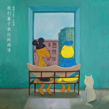

我们羞于表达的感情
============================

|  |  |
| :--: | :-- |
| [ 我们羞于表达的感情](https://emumo.xiami.com/album/2105536321) | **艺人**: [新裤子](../index.md) **语种**: 国语 **唱片公司**: 开心伟业, 摩登天空 **发行时间**: 2019年11月28日 **专辑类别**: EP, 单曲 **专辑风格**:  **播放数**: 9524 **收藏数**: 47 **评论数**: 21  |

## 简介

大张伟与彭磊跨越20年后重聚合作新歌《我们羞于表达的感情》，两个看似都在“嬉闹人生”的孩子，在最纯粹的旋律下，注入的最私人的情感表达。Synth-Pop、New Wave、Disco等等标签全被打破，在认真面对自我这件事儿上，最朴素才是最动人，如同生命的力量。   
  
歌词的每一句都是大张伟和彭磊的真实写照，那些“羞于表达的情感”藏匿在他们“诙谐的话语”和“盛开的喜剧”里，而深处却是“紧张得哑口无言”的“内心花园”。   
  
很少有人有勇气直白的剖出自己的生命之歌，在一切谈笑风生和吊儿郎当之后的沉默无语，是最珍贵和私人的情感。它不仅仅是动人，穿越岁月的浓烟，这首歌凝结了命运的吊诡与得失，已经成为一个时代的透镜。

## 曲目

## 评论

|  |  |  |
| :-- | :-- | :-- |
|  [虾米用户](https://emumo.xiami.com/u/212216702) 怕什么真理无穷，进一寸有... 2020-11-25 23:44 赞(0) 踩(0) | 
虾米但凡好听点都没有
 |
|  [虾米用户](https://emumo.xiami.com/u/302883837)  2020-08-13 15:49 赞(0) 踩(0) | 
虾米快去争取一下版权啊
 |
|  [虾米用户](https://emumo.xiami.com/u/423015063)  2020-06-09 02:45 赞(0) 踩(0) | 
好听
 |
|  [虾米用户](https://emumo.xiami.com/u/251788490)  2020-05-31 16:09 赞(0) 踩(0) | 
虾米多花点钱买版权行不行（卑微~）
 |
|  [虾米用户](https://emumo.xiami.com/u/52249142) 我还没想好要写什么... 2020-05-08 09:50 赞(1) 踩(0) | 
因为88会员，有的虾米会员，每次来是想听啥，啥没版权，一生黑
 |
|  [虾米用户](https://emumo.xiami.com/u/441465017)  2020-04-10 10:59 赞(0) 踩(0) | 
想听  快点的
 |
|  [虾米用户](https://emumo.xiami.com/u/63533816) 我还没想好要写什么... 2020-03-02 10:29 赞(0) 踩(0) | 
不好听哦
 |
|  [虾米用户](https://emumo.xiami.com/u/431201363)  2020-01-10 23:34 赞(0) 踩(0) | 
各种没版权 有会员也百搭
 |
|  [虾米用户](https://emumo.xiami.com/u/280788425) 我还没想好要写什么... 2020-01-05 00:22 赞(0) 踩(0) | 
到底哪里有这首歌版权？？？我纳闷
 |
| ⇒ |  [虾米用户](https://emumo.xiami.com/u/24456317)  2020-01-10 13:09 赞(0) 踩(0) | 
QQ
 |
|  [虾米用户](https://emumo.xiami.com/u/23674351) 我还没想好要写什么... 2020-01-03 23:10 赞(0) 踩(0) | 
没版权有会员也白搭 
 |
|  [虾米用户](https://emumo.xiami.com/u/7402552)  2019-12-30 23:55 赞(2) 踩(0) | 
求虾米多拿点版权吧_(:з」∠)_不然怎么把我从网易吸引过来
 |
|  [虾米用户](https://emumo.xiami.com/u/432769486)  2019-12-19 10:18 赞(15) 踩(0) | 
虽然我在其他平台也买了，但是我还是希望虾米能多拿到些版权啊喂
 |
|  [虾米用户](https://emumo.xiami.com/u/24637749)  2019-12-16 09:01 赞(0) 踩(0) | 
各种没有版权
 |
|  [虾米用户](https://emumo.xiami.com/u/6214480)   2019-12-01 00:45 赞(10) 踩(0) | 
买版权啊！！！！！
 |
|  [虾米用户](https://emumo.xiami.com/u/121958558)  2019-11-30 16:22 赞(2) 踩(0) | 
大裤子居然是真的(
 |
| ⇒ |  [虾米用户](https://emumo.xiami.com/u/41190141) 优秀的饲养员 2019-12-30 16:08 赞(0) 踩(0) | 
亏得新滴裤子是假的
 |
|  [虾米用户](https://emumo.xiami.com/u/38218903)  2019-11-30 16:13 赞(0) 踩(0) | 
哦
 |
