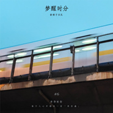

梦醒时分
============================

|  |  |
| :--: | :-- |
| [ 梦醒时分](https://emumo.xiami.com/album/2108339004) | **艺人**: [新裤子](../index.md) **语种**: 国语 **唱片公司**: 制作家 **发行时间**: 2020年03月18日 **专辑类别**: EP, 单曲 **专辑风格**: 新世纪音乐 New Age **播放数**: 334 **收藏数**: 4 **评论数**: 2  |

## 简介

年华有你，不负光阴。  
如何给李宗盛穿上朋克的新裤子？新裤子乐队改编翻唱的李宗盛作品《梦醒时分》独家上线！这首曾被林忆莲、王菲、梁静茹、伍佰、迪克牛仔等竞相翻唱过的歌曾屡创试听奇迹，如今的翻唱名单里又加上了新裤子这样一支摇滚乐队。  
时光流转三十载，这首华语乐坛经典中的经典在新时代下被一条“穿了二十年不过时“的新裤子赋予新声。满载了朋克内核的“都市抒情歌”踏着这个时代翻涌前进的新浪潮，焕发出强劲的另类之音。  
原作温婉哀怨的情致在新裤子的改编下脱胎换骨。彭磊歇斯底里又略带怪诞的唱腔直切要害，似在向深陷情感泥沼的痴男怨女咆哮着，细数他们犯下的种种错误。一副“废话少说”的朋克态度誓要与拖泥带水的“都市抒情”划清界限。  
来吧，那些爱上了不该爱的伤心人儿，穿上朋克新裤子，我们一起来醒醒脑！

## 曲目

## 评论

|  |  |  |  |
| :-- | :-- | :-- | :-- |
|  [虾米用户](https://emumo.xiami.com/u/46854854)  2020-05-28 11:42 赞(0) 踩(0) | 
怎么没人？？？
 |
| ⇒ |  [虾米用户](https://emumo.xiami.com/u/46754546) Funny i can'... 2020-08-01 17:11 赞(0) 踩(0) | 
因为没版权听不了 
 |
