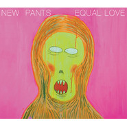

野人也有爱Equal Love
============================

|  |  |
| :--: | :-- |
| [ 野人也有爱Equal Love](https://emumo.xiami.com/album/309469) | **艺人**: [新裤子](../index.md) **语种**: 国语 **唱片公司**: 摩登天空 **发行时间**: 2008年11月14日 **专辑类别**: 录音室专辑 **专辑风格**: 摇滚 Rock & Roll **播放数**: 1122594 **收藏数**: 1291 **评论数**: 100  |

## 简介

在06年的《龙虎人丹》之后的两年时间里，“新裤子”名正言顺地成为了国内最当红、最有态度、最具创造性、最与世界接轨、最有艺术气质……集各种“之最”于一身的乐队。他们热热闹闹的各种晃悠，制造出了一波未平一波又起，外加东边亮西边还亮的各路大小高潮。在2008年这个各种大小翻篇层出不穷的结点上，“新裤子”也正经地翻开了他们的又一页，推出了乐队的第5张全新专辑《野人也有爱》。  
  
与两年前的《龙虎人丹》相比，现在的“新裤子”在生活和心态的变化让他们更为成熟，也更具明确的艺术创作态度，由此促成了这张绝对新的新裤子新专辑。对传统朋克以及80年代Disco渐渐失去兴趣的“新裤子”，赋予了第5张专辑更多内在的、精神层面的内容，“艺术化”和“内敛”成为了这张专辑的关键词。听觉感受上，少了些许快乐和欢腾，取而代之的是带有灰暗色彩的内在冲突；少了些许电子质感而加重了乐队化的成份，也让这张专辑更显沉稳。  
对于专辑的平面设计，“新裤子”向来不会放过这样一个传达的途径。此次专辑封面和海报更是大胆，明显的区别于以往的流行艺术范畴，而更趋向于一个纯艺术的传达。专辑封面采用了彭磊创作的“野人系列”油画作品，简单直接，概念十足。而专辑的海报设计借鉴了70年代英国新浪潮代表乐队Japan的1981年经典专辑《Tin Drum》，在向Japan乐队致敬的同时，又被巧妙的转化为了独有的“新裤子美学”。抛开于音乐的联系，这幅海报设计则更像一个独立的艺术品。  
  
今天的“新裤子”，无论是主唱彭磊越发得到各界关注和认可的绘画创作和电影，还是乐队应邀参加国内外艺术领域的大型活动，他们以一个多领域的标志性身份真正意义的树立了属于他们的“新裤子审美体系”。而这些艺术方面的多方位建树和在年轻人当中的影响力，也使“新裤子”成为了一支独树一帜、没有任何一支乐队可以与之比较的中国乐队。  
  
而《野人也有爱》专辑又将是一个全新“新裤子效应”的华丽开篇。借由跨国、跨界、跨时代的纯艺术外观形式，从平面、影像、音乐等方面的立体表达，“新裤子”希望通过“野人也有爱”的概念，阐述一个人人平等、人人都有权得到爱与尊重的理念。无疑，这也是“新裤子”成功的完成了——从一支冲劲十足创意无限的北京朋克乐队——向一支冲劲更加十足创意更加无限的中国最具代表性的全能型艺术乐队华丽转身的强有力证明。  
  
01.北海怪兽  
作为新专辑的开篇曲，“北海怪兽”其实并不算是首新歌。这支单曲早在彭磊03年的首部电影《北海怪兽》中便出现过。新裤子式的合成器质感在此开门见山，一览无余。跃动而暖人的合成器旋律，这一切构成了一幅生动的画面：90年代，冬日里北京的清晨，忙碌而祥和，一天就这么开始了。  
  
02.金色偶像  
新裤子主旋律摇滚作品的又一力作。铿锵紧凑的吉他桥段听得人热血沸腾。歌词方面也颇具意味：“它有金色的外壳/可是命运很脆弱……忘了它，所有苦闷向谁说/忘了它，怎么面对爱与错……”  
  
03.两个女朋友  
继上张的“两个男朋友”之后，新裤子在新专辑中再次带来了都市文艺青年亦混乱亦单纯情感生活真实写照系列新作。更为流畅且流行的编曲配以琵琶似的键盘桥段，可谓是煽情得一塌糊涂。  
  
04.大熊猫  
这首歌本身就是专辑中的一大亮点。首先，它有着绝对好听的旋律，可爱，讨喜，又富有中国韵味，但同时却有着绝不流于俗套的新裤子化的编排设计：人声和人声采样交错出现，真器乐和电子音效交织并行，电影画面感和时空穿梭感十足。其次，这首单曲有个绝对大制作的MV，对此彭磊特别介绍：“《大熊猫》由国内非常靠前非常时髦的一个动画公司‘电动画’制作。从筹划到完成有将近10个月的时间，是新裤子现今制作最为细致的一个动画作品。”  
  
05.分裂  
大面积的失真铺底，沉重压抑的中板鼓点，以及天旋地转乌云压顶似的的合成器音色。这是新裤子史上最不新裤子的一支单曲，带着史无前例的灰暗色彩。器乐编排上尤其出彩，跌宕起伏，收张有弛，时时牵动着听者的耳鼓和脉搏。2分35秒之后的四段贝司和吉他的左右跳线设计，异常“分裂”。  
  
06.著名导演  
这是一首新裤子走典型“犯横”路线的作品，弹的和唱的都是横着摔出来的，掷地有声，以“胡子、秃子、肚子、辫子”四句最为响亮，听完全震。  
  
07.Double Happiness  
专辑中的另一首合成器作品。金光灿灿，中西合璧，兼顾土洋的80年代喜庆风貌。  
  
08.伤心招待所  
新裤子在这支单曲中终于圆了创作一首以中国西部文化为背景的歌曲的梦。叙事感和画面感极强，庞宽入戏颇深。风沙，驼铃，铮鸣，神秘而幽怨的气场，就像“猫王”的《伤心旅店》，还有“老鹰”的《Hotel California》等一切“旅馆”题材作品一样，含而不露。  
  
09.Not Too Late  
新裤子的一支有着明显No Wave风格的作品，为此请来了客席人声，“重塑雕像的权利”乐队主唱华东。和惯常意义的No Wave作品不一样的是，它坚持旋律本位，有清晰、动听的旋律主线。在以华东为代表的“重塑”气场加盟下，这支作品所表现出了新裤子种种前所未有的侧面：内躁、分裂、决绝、阴沉……  
  
10.隔离  
糖水似的过渡单曲，只有一句旋律，却丝毫不显单调，典型的新裤子元素一个都不少。  
  
11.我们可以在一起  
作为本张专辑的压轴曲目，这支单曲表现出了惊艳的大气。中版曲速，和缓的长音键盘和电子脉冲Loop撑起一片开阔的音景，紧凑的三大件在其下暗涌。编曲上错落有致，真假器乐各自咬合不分彼此，展开的每一部分都被延伸得足够充分。以电子脉冲音效和鼓点开篇，器乐逐一介入，前奏长达1分20秒。电子音效铺底贯穿始终，亦平滑亦紧凑的键盘牵引着整个螺旋上升的情绪走向。气场可大可小，正是这首作品的迷人之处。08年的新裤子定格在了这样一个意味深长的休止符上。而站在这个结点我们所看到的，却是一个可以走到更远的下一个十年，以及更为未知神秘空间的新生新裤子

## 曲目

## 评论

|  |  |  |  |
| :-- | :-- | :-- | :-- |
|  [虾米用户](https://emumo.xiami.com/u/69159922) Blog：我不是猪头吧 2020-07-10 10:29 赞(0) 踩(0) | 
！
 |
|  [虾米用户](https://emumo.xiami.com/u/96296322)  2019-08-16 05:53 赞(0) 踩(0) | 
.
 |
|  [虾米用户](https://emumo.xiami.com/u/304651565) 我还没想好要写什么... 2019-03-17 10:27 赞(2) 踩(0) | 
日本的床上隆先生
 |
| ⇒ |  [虾米用户](https://emumo.xiami.com/u/387168)  2019-04-06 21:03 赞(0) 踩(0) | 
还有教授
 |
| ⇒ |  [虾米用户](https://emumo.xiami.com/u/304651565) 我还没想好要写什么... 2019-07-29 07:49 赞(0) 踩(0) | 
<q><b>runbeat说：</b></q>
 |
|  [虾米用户](https://emumo.xiami.com/u/351880763) 理想 2018-09-21 10:41 赞(0) 踩(0) | 
快上歌！！！啊啊啊啊
 |
|  [虾米用户](https://emumo.xiami.com/u/7347497) hi there ;) 2017-11-03 18:43 赞(0) 踩(0) | 
球球你们快点上歌
 |
|  [虾米用户](https://emumo.xiami.com/u/9988026) 虾米，圣诞节快乐。 2017-03-19 01:28 赞(4) 踩(0) | 
什么时候下的架。。赶紧线上出售数字专辑啊，我肯定买买买 
 |
|  [虾米用户](https://emumo.xiami.com/u/39569391)  2016-05-18 11:44 赞(0) 踩(0) | 
[野人也有爱][国语][摇滚][FLAC，无损]<a href="http://www.162wp.com/yinle/2016-05-18/26402.html" target="_blank" rel="nofollow noreferrer noopener">http://www.162wp.com/yinle/2016-05-18/26402.html</a>
 |
|  [虾米用户](https://emumo.xiami.com/u/15510454) 日常生活让人挺胸抬头不盯... 2016-05-14 12:37 赞(1) 踩(0) | 
然而这似乎是前五张专辑里我觉得最喜欢的一张……
 |
|  [虾米用户](https://emumo.xiami.com/u/5496714)   2016-03-18 01:04 赞(0) 踩(0) | 
喜欢新裤子是因为她让我听着有恋爱中甜蜜失落痛苦开心的感觉，很容易跟着音乐的情感线走，每隔一段时间都会听听，很怀念
 |
|  [虾米用户](https://emumo.xiami.com/u/5494913) SO DAMN 2016-03-04 16:12 赞(0) 踩(0) | 
新裤子的伤心招待所
 |
|  [虾米用户](https://emumo.xiami.com/u/17719900) 请把我的歌带回你的家 2016-01-27 22:04 赞(1) 踩(0) | 
至少封面很不丢分。
 |
|  [虾米用户](https://emumo.xiami.com/u/39394031) 他是个饶舌歌手 2016-01-13 00:35 赞(0) 踩(0) | 
野人也有爱。。
 |
|  [虾米用户](https://emumo.xiami.com/u/2279444) 爱在左，同情在右。 2015-11-23 03:38 赞(0) 踩(0) | 
谁有完整版电影分享一下哈~
 |
|  [虾米用户](https://emumo.xiami.com/u/12568947) 当年我为少年郎 2015-10-14 09:28 赞(0) 踩(0) | 
古早味
 |
|  [虾米用户](https://emumo.xiami.com/u/1730251)  2015-05-17 00:39 赞(1) 踩(0) | 
第一首         Daft Punk的感觉好重
 |
| ⇒ |  [虾米用户](https://emumo.xiami.com/u/1130904)  2016-04-23 21:16 赞(0) 踩(0) | 
哪里像Daft Punk了，简直八竿子打不着，新裤子又不是house又不funky跟DP有什么关系？
 |
|  [虾米用户](https://emumo.xiami.com/u/13001719) 最难得，是诚意 2015-05-04 16:41 赞(0) 踩(0) | 
可我什么都不要 你还是不要我
 |
|  [虾米用户](https://emumo.xiami.com/u/13001719) 最难得，是诚意 2015-05-04 16:40 赞(0) 踩(0) | 
我们无法在一起 无法分开
 |
|  [虾米用户](https://emumo.xiami.com/u/13001719) 最难得，是诚意 2015-05-04 16:39 赞(0) 踩(0) | 
我会为你和他分手
 |
|  [虾米用户](https://emumo.xiami.com/u/37422296) 精神恍惚 2015-01-23 02:40 赞(0) 踩(0) | 
国外模仿不来的风格！慢慢品味！
 |
| ⇒ |  [虾米用户](https://emumo.xiami.com/u/39394031) 他是个饶舌歌手 2016-01-13 00:21 赞(0) 踩(0) | 
说的有道理
 |
|  [虾米用户](https://emumo.xiami.com/u/3657521) Where is my ... 2015-01-12 20:40 赞(0) 踩(0) | 
我要女演员陪我睡觉
 |
|  [虾米用户](https://emumo.xiami.com/u/41769987)   2014-10-25 13:42 赞(0) 踩(0) | 
两个男朋友 和 两个女朋友 很简单的歌词和旋律 百听不厌
 |
|  [虾米用户](https://emumo.xiami.com/u/140326) 略矫情的文艺女流氓。 2014-08-26 22:54 赞(0) 踩(0) | 
我们可以在一起 不能喜欢更多
 |
|  [虾米用户](https://emumo.xiami.com/u/25125563) 伪文艺真汉子的酒窝君 2014-07-10 01:36 赞(0) 踩(0) | 
爱带我回家好赞！！！！
 |
|  [虾米用户](https://emumo.xiami.com/u/2675947)  2014-05-19 02:10 赞(1) 踩(0) | 
超喜欢《两个女朋友》
 |
|  [虾米用户](https://emumo.xiami.com/u/24667575)   2014-04-20 16:18 赞(1) 踩(0) | 
好稀饭昂
 |
|  [虾米用户](https://emumo.xiami.com/u/25551855) 睡到醒不了 2014-04-18 21:21 赞(0) 踩(0) | 
就是喜欢
 |
|  [虾米用户](https://emumo.xiami.com/u/22215275)  2014-02-24 09:59 赞(0) 踩(0) | 
国内最当红最有态度最具创造性最与世界接轨最有艺术气质
 |
|  [虾米用户](https://emumo.xiami.com/u/32334006) 自己去想 我懒得写了 2014-02-09 11:07 赞(0) 踩(0) | 
著名导演据说好像都被禁过 不过的确很好 yeah yeah yeahs都很看好新裤子
 |
|  [虾米用户](https://emumo.xiami.com/u/2119676) 爱国摇，爱90年代 2014-02-09 01:13 赞(0) 踩(0) | 
说真的，新裤子太牛逼了，坚持喜欢了这么久，不仅是音乐，更因为他们一直有自己的想法个性不随波逐流。最近的专辑有些流行，如果想感受真正的新裤子，还是要听野人这些老点的东西。
 |
|  [虾米用户](https://emumo.xiami.com/u/30920009)  2014-01-13 23:03 赞(0) 踩(0) | 
11
 |
|  [虾米用户](https://emumo.xiami.com/u/4460594) 羞怯而真诚的活着。 2013-11-25 22:14 赞(0) 踩(0) | 
可能没什么人青睐这张吧...可这是我的最爱。
 |
| ⇒ |  [虾米用户](https://emumo.xiami.com/u/3190533) 蜂蜜厚多士 2013-12-19 20:46 赞(0) 踩(0) | 
米兔
 |
| ⇒ |  [虾米用户](https://emumo.xiami.com/u/414225) .......~_~ 2014-01-02 13:57 赞(0) 踩(0) | 
+1
 |
|  [虾米用户](https://emumo.xiami.com/u/7101064)  2013-09-22 09:31 赞(0) 踩(0) | 
最爱新裤子！
 |
|  [虾米用户](https://emumo.xiami.com/u/8147731)  2013-09-16 20:16 赞(1) 踩(0) | 
两个女朋友真是好听真好听
 |
|  [虾米用户](https://emumo.xiami.com/u/10965086)  2013-08-12 20:19 赞(0) 踩(0) | 
充满实验气质的儿歌对的起它8.8分评价。
 |
|  [虾米用户](https://emumo.xiami.com/u/17326367) 爱就是极快速的能量振动 2013-07-29 21:11 赞(0) 踩(0) | 
从现在开始的那几个人只是在赚钱了  他们已经象娱乐圈进军了
 |
|  [虾米用户](https://emumo.xiami.com/u/4788608) 世界太小，無處可滾。 2013-04-24 00:25 赞(0) 踩(0) | 
我不就說了段情話么。被噴的落下淚了。。。好傷感，說起來，全是眼淚。你知道。
 |
|  [虾米用户](https://emumo.xiami.com/u/2670539)  2013-04-16 11:25 赞(0) 踩(0) | 
有意思~
 |
|  [虾米用户](https://emumo.xiami.com/u/11838513)  2013-04-03 09:29 赞(0) 踩(0) | 
个性
 |
|  [虾米用户](https://emumo.xiami.com/u/4897599) 你是那世上的奇女子啊，我... 2013-03-23 17:12 赞(0) 踩(0) | 
摇滚乐队中的奇葩，怪诞范很像舒尔茨的小说。欲望街的伤心招待所，怒赞！
 |
|  [虾米用户](https://emumo.xiami.com/u/12881822)  2013-02-18 21:29 赞(0) 踩(0) | 
96年开始听一直到现在还是不改的支持。。。
 |
|  [虾米用户](https://emumo.xiami.com/u/9240526) 小腿上长满猕猴桃 2013-01-03 23:25 赞(0) 踩(0) | 
萌爆了
 |
|  [虾米用户](https://emumo.xiami.com/u/11181005) 7 2012-10-31 14:57 赞(0) 踩(0) | 
野人也有爱
 |
|  [虾米用户](https://emumo.xiami.com/u/414225) .......~_~ 2012-10-28 22:55 赞(0) 踩(0) | 
经典国货
 |
|  [虾米用户](https://emumo.xiami.com/u/9100364)  2012-10-25 13:18 赞(0) 踩(0) | 
超爱超爱，谁听了心情都会很好的一首歌吧
 |
|  [虾米用户](https://emumo.xiami.com/u/868545) 喵喵喵~ 2012-09-26 18:53 赞(0) 踩(0) | 
Because of  you~
 |
|  [虾米用户](https://emumo.xiami.com/u/3990365)  2012-09-20 09:15 赞(0) 踩(0) | 
xx
 |
|  [虾米用户](https://emumo.xiami.com/u/7456816) 我还没想好要写什么... 2012-08-15 10:00 赞(1) 踩(0) | 
这个世界让我们变成病人，我们是自己的医生~
 |
|  [虾米用户](https://emumo.xiami.com/u/516791) 假酒喝多了 2012-06-16 23:12 赞(0) 踩(0) | 
11年北京的伤心招待所
 |
|  [虾米用户](https://emumo.xiami.com/u/7846757)  2012-05-15 14:06 赞(0) 踩(0) | 
封面是北京猿人吗
 |
| ⇒ |  [虾米用户](https://emumo.xiami.com/u/12881822)  2013-02-22 11:19 赞(0) 踩(0) | 
笨蛋蛋，是梵高的画。。。
 |
| ⇒ |  [虾米用户](https://emumo.xiami.com/u/300304) \\m/可得劲\\m/ 2013-03-11 10:49 赞(0) 踩(0) | 
<q><b>小施主说：</b></q>
 |
|  [虾米用户](https://emumo.xiami.com/u/1016866)  2012-05-13 15:03 赞(0) 踩(0) | 
野人也要爱！最躁动！
 |
|  [虾米用户](https://emumo.xiami.com/u/7903271)  2012-02-04 05:56 赞(0) 踩(0) | 
我是裤子迷
 |
|  [虾米用户](https://emumo.xiami.com/u/7049446)  2012-01-12 16:24 赞(0) 踩(0) | 
我也喜欢两个女朋友！
 |
|  [虾米用户](https://emumo.xiami.com/u/7353434)  2011-12-22 14:02 赞(0) 踩(0) | 
因为喜欢
 |
|  [虾米用户](https://emumo.xiami.com/u/785774)  2011-11-26 01:53 赞(0) 踩(0) | 
nice
 |
|  [虾米用户](https://emumo.xiami.com/u/516654)  2011-11-17 13:50 赞(0) 踩(0) | 
你们别光听专辑多么多么的好，我建议你们音乐节的时候到新裤子的现场看，那才叫震撼！
 |
|  [虾米用户](https://emumo.xiami.com/u/6462407)  2011-11-15 10:03 赞(0) 踩(0) | 
风格
 |
|  [虾米用户](https://emumo.xiami.com/u/3092147) 极致专心 2011-11-09 00:22 赞(0) 踩(0) | 
裤子
 |
|  [虾米用户](https://emumo.xiami.com/u/4788608) 世界太小，無處可滾。 2011-11-07 10:55 赞(0) 踩(0) | 
新褲子，確實可以的。
 |
| ⇒ |  [虾米用户](https://emumo.xiami.com/u/516654)  2011-11-17 13:55 赞(0) 踩(0) | 
<a href="http://v.youku.com/v_playlist/f5228102o1p0.html" target="_blank" rel="nofollow noreferrer noopener">http://v.youku.com/v_playlist/f5228102o1p0.html</a>
 |
|  [虾米用户](https://emumo.xiami.com/u/982986)  2011-10-23 05:46 赞(0) 踩(0) | 
他说他是同性恋 女孩不喜欢男孩吧。。不是因为这句！！！！不是不是不是。。
 |
| ⇒ |  [虾米用户](https://emumo.xiami.com/u/516654)  2011-11-17 13:53 赞(0) 踩(0) | 
<a href="http://v.youku.com/v_playlist/f5228102o1p0.html" target="_blank" rel="nofollow noreferrer noopener">http://v.youku.com/v_playlist/f5228102o1p0.html</a> 我拍的现场
 |
| ⇒ |  [虾米用户](https://emumo.xiami.com/u/1270456)   2012-03-02 00:11 赞(0) 踩(0) | 
<q><b>你就是我的明星说：</b></q>
 |
|  [虾米用户](https://emumo.xiami.com/u/1955601)   2011-10-13 20:47 赞(0) 踩(0) | 
不好意思，我得分享一遍，你们懂得~@抹茶霙_Honlly @@Nana想要英文名
 |
|  [虾米用户](https://emumo.xiami.com/u/5918373) 我有一颗王子球！ 2011-10-01 22:37 赞(0) 踩(0) | 
好喜欢两个女朋友这首歌
 |
| ⇒ |  [虾米用户](https://emumo.xiami.com/u/516654)  2011-11-17 13:51 赞(0) 踩(0) | 
有机会看看音乐节现场
 |
| ⇒ |  [虾米用户](https://emumo.xiami.com/u/5918373) 我有一颗王子球！ 2011-11-17 19:44 赞(0) 踩(0) | 
<q><b>你就是我的明星说：</b></q>
 |
|  [虾米用户](https://emumo.xiami.com/u/933522)  2011-10-01 08:10 赞(0) 踩(0) | 
其实我觉得不错啊~~(╯﹏╰)b
 |
|  [虾米用户](https://emumo.xiami.com/u/1611794)  2011-09-13 23:11 赞(0) 踩(0) | 
我也应该理个时髦的头发
 |
|  [虾米用户](https://emumo.xiami.com/u/3255139)  2011-07-15 22:35 赞(0) 踩(0) | 
感觉
 |
| ⇒ |  [虾米用户](https://emumo.xiami.com/u/516654)  2011-11-17 13:55 赞(0) 踩(0) | 
<a href="http://v.youku.com/v_playlist/f5228102o1p0.html" target="_blank" rel="nofollow noreferrer noopener">http://v.youku.com/v_playlist/f5228102o1p0.html</a>
 |
|  [虾米用户](https://emumo.xiami.com/u/52973)  2011-06-28 23:01 赞(0) 踩(0) | 
好吧！好久没有每日一碟了！这个名字就很有爱于是就分享了！希望大家喜欢！大家了然的！
 |
| ⇒ |  [虾米用户](https://emumo.xiami.com/u/516654)  2011-11-17 13:54 赞(0) 踩(0) | 
10年 摩登天空音乐节 我拍的现场 <a href="http://v.youku.com/v_playlist/f5228102o1p0.html" target="_blank" rel="nofollow noreferrer noopener">http://v.youku.com/v_playlist/f5228102o1p0.html</a>
 |
|  [虾米用户](https://emumo.xiami.com/u/2092701)  2011-06-26 22:08 赞(0) 踩(0) | 
碘鱼131 收藏并分享专辑
 |
|  [虾米用户](https://emumo.xiami.com/u/3758923) 我还没想好要写什么... 2011-05-28 17:58 赞(0) 踩(0) | 
新裤子
 |
|  [虾米用户](https://emumo.xiami.com/u/3995314)  2011-05-21 22:28 赞(0) 踩(0) | 
因为新裤子才穿起海魂衫！！！听新裤子  有一种80年代的时髦味道！！
 |
|  [虾米用户](https://emumo.xiami.com/u/3885121)  2011-05-10 00:29 赞(0) 踩(0) | 
感觉不错
 |
|  [虾米用户](https://emumo.xiami.com/u/3219971)  2011-04-10 09:32 赞(0) 踩(0) | 
喜欢
 |
| ⇒ |  [虾米用户](https://emumo.xiami.com/u/516654)  2011-11-17 13:55 赞(0) 踩(0) | 
<a href="http://v.youku.com/v_playlist/f5228102o1p0.html" target="_blank" rel="nofollow noreferrer noopener">http://v.youku.com/v_playlist/f5228102o1p0.html</a>
 |
|  [虾米用户](https://emumo.xiami.com/u/324649)  2011-01-17 06:57 赞(0) 踩(0) | 
著名導演真是經典中的經典！！！
 |
| ⇒ |  [虾米用户](https://emumo.xiami.com/u/516654)  2011-11-17 13:55 赞(0) 踩(0) | 
<a href="http://v.youku.com/v_playlist/f5228102o1p0.html" target="_blank" rel="nofollow noreferrer noopener">http://v.youku.com/v_playlist/f5228102o1p0.html</a>
 |
|  [虾米用户](https://emumo.xiami.com/u/275850)  2011-01-10 09:42 赞(0) 踩(0) | 
你敢不有爱
 |
| ⇒ |  [虾米用户](https://emumo.xiami.com/u/516654)  2011-11-17 13:56 赞(0) 踩(0) | 
<a href="http://v.youku.com/v_playlist/f5228102o1p0.html" target="_blank" rel="nofollow noreferrer noopener">http://v.youku.com/v_playlist/f5228102o1p0.html</a>
 |
|  [虾米用户](https://emumo.xiami.com/u/82494) 最后一个月啦，十年虾米老... 2010-11-25 14:28 赞(0) 踩(0) | 
彭磊的画也很有趣啊~~~
 |
| ⇒ |  [虾米用户](https://emumo.xiami.com/u/516654)  2011-11-17 13:56 赞(0) 踩(0) | 
<a href="http://v.youku.com/v_playlist/f5228102o1p0.html" target="_blank" rel="nofollow noreferrer noopener">http://v.youku.com/v_playlist/f5228102o1p0.html</a>
 |
|  [虾米用户](https://emumo.xiami.com/u/363669)  2010-10-07 20:43 赞(0) 踩(0) | 
好听呵呵
 |
|  [虾米用户](https://emumo.xiami.com/u/1182212) · 2010-09-29 21:05 赞(0) 踩(0) | 
大熊猫不错，是哈
 |
| ⇒ |  [虾米用户](https://emumo.xiami.com/u/2067999)  2011-04-05 09:57 赞(0) 踩(0) | 
恩！
 |
|  [虾米用户](https://emumo.xiami.com/u/711753)  2010-03-10 12:59 赞(0) 踩(0) | 
蒙克的呐喊+巴斯奎特的涂鸦=封套 够吸引眼球但没有突出乐队的多元混音
 |
|  [虾米用户](https://emumo.xiami.com/u/6004) 生命不息，听歌不止！ 2010-01-02 03:25 赞(0) 踩(0) | 
一张很电子的唱片。
 |
| ⇒ |  [虾米用户](https://emumo.xiami.com/u/516654)  2011-11-17 13:57 赞(0) 踩(0) | 
<a href="http://v.youku.com/v_playlist/f5228102o1p0.html" target="_blank" rel="nofollow noreferrer noopener">http://v.youku.com/v_playlist/f5228102o1p0.html</a>
 |
|  [虾米用户](https://emumo.xiami.com/u/61045) ~ 2009-06-05 12:05 赞(0) 踩(0) | 
猴子？
 |
|  [虾米用户](https://emumo.xiami.com/u/2) 凸 -- 凸 2009-03-12 16:25 赞(0) 踩(0) | 
我高中时有个女同学绰号‘野人’，的确是很有爱的那种
 |
