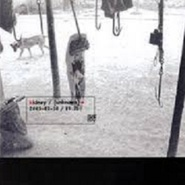

unknown不详
============================

|  |  |
| :--: | :-- |
| [ unknown不详](https://emumo.xiami.com/album/15746) | **艺人**: [腰乐队](../index.md) **语种**: 国语 **唱片公司**: 独立发行 **发行时间**: 2003年06月01日 **专辑类别**: EP, 单曲 **专辑风格**: 摇滚 Rock & Roll **播放数**: 143169 **收藏数**: 764 **评论数**: 53  |

## 简介

啊！已经忘了是那一年第一次听到的腰!手里握着薄薄的一本小册子，封面的骷髅在夜色下显得格外的面目狰狞！是的，一个叫杨波的人让我至今还在怀念！  
  
〈意淫〉是一首怪诞的歌，至今我还一直坚持己见！所以这次也顺便把它发出来！后来因为这首也或许还因为是云南的乐队使我一直关注着他们。再后来03年的一天我一个人在昆明的121大街上闲逛，看着学生们朝气蓬勃的脸感叹自己曾经年轻也朝气蓬勃但现在的日益苍老疲惫！在我常去的那家画着Jimi.Hendrix但我至今也不知道叫什么名字的店里看到了这张限量500张“献给我们所有看到的感受到的被（或正在被）侮辱的人和事和我们自己”的的EP，然后用20块买了下来。我这张的编号是EP-077。  
  
这几年我买了很多的小样！但我想告诉大家的是腰的这张是我买过的为数不多的制作精良的让我觉得物有所值的一张EP！20块不算贵！  
  
更主要的是他们的态度：在用黄色纸张印刷的歌词纸里他们用红色的印章印着“谨向有限的耳朵致以无限的歉意”这样让人备感亲切和对中国摇滚环境无奈的字眼！我一直希望那些制作垃圾小样但照样能厚颜无耻的卖几十块的乐队能把自己的态度做在小样里，作为一个乐迷，我们没有奢望制作能有多好，但起码你们也应该有个认真的态度吧？而腰对这张EP的认真劲让我感动！  
  
据结他手告诉我的，他们刚签了摩登天空的BAD HEAD唱片，首张专辑叫《我们应该面对谁去歌唱》（暂定名）,现在已经制作完毕，将定于8月份上市。  
  
算了！不说了，还是听吧！这是一张听了让人感到不安的EP！  
 

## 曲目

## 评论

