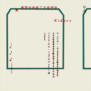

他们说忘了摇滚有问题
============================

|  |  |
| :--: | :-- |
| [ 他们说忘了摇滚有问题](https://emumo.xiami.com/album/167452) | **艺人**: [腰乐队](../index.md) **语种**: 国语 **唱片公司**: 元音唱片 **发行时间**: 2008年01月30日 **专辑类别**: 录音室专辑 **专辑风格**: 摇滚 Rock & Roll **播放数**: 2405548 **收藏数**: 3582 **评论数**: 221  |

## 简介

1月28日，云南昭通‘腰’乐团的第二张专辑《他们说忘了摇滚有问题》全国正式发行。这也是进入2008以来，中国大陆乐队公开出版的第一张专辑。2005年，‘腰’乐团自费录制的第一张专辑《我们究竟应该面对谁去歌唱》曾经获得第六届华语音乐传媒大奖年度最佳新乐队提名。这一次，‘腰’乐团没有继续在摩登天空唱片公司旗下出版，而是以自己‘局部娱乐’制作机构的名义联合广州独立音乐厂牌‘元音唱片’共同发表。这也是‘元音’自《C》之后出版的第二张唱片。  
  
新专辑的全部录制和混音是在昭通完成的，共花费半年时间。去年九月底，‘腰’乐团在拒绝了10月初在云南丽江举行的某大型音乐节的邀请后，主唱刘涛亲自前往广州，与‘元音’共同商讨新专辑的发行工作。元音成员之一白冈冈（他2006年负责了《C》的整体设计）受到1924年孙中山在广州亲笔书写的一封机密电报的启发创作了唱片封套设计。这一次，‘腰’乐团完整的印出了专辑歌词（由于某种原因，他们的第一张专辑没有印歌词）。  
  
据听过这张专辑小样的一些圈内朋友透露，曲风与第一张有着明显的出入。如果不认真的聆听和思考，很多人会以为这是一张优美的抒情专辑。主要歌曲包括《公路之光》、《在这寂静的水坑路》、《K男抒情曲》、《垃圾好比你的脸》、《今夜还吹着风》等。在一首9分44秒的献给六十年代思考者林昭的《海鸥之歌》中，主唱刘涛还亲自演奏了大提琴。这首歌是在4月29日林昭的祭日（林昭逝世39周年）当天录制。在献给1979年某场战争所有阵亡者的《高山下的花环》中，共有4至93岁不等的137个人参与了人声采样。专辑中歌词最长的是《世界呢分钟》，共有537个字。  
  
‘元音’与‘局部娱乐’在经过商议后，决定把这张专辑的发行数量定为1000套，永不再版，每套都由手工编码。80圆的唱片定价也有别于以往的中国摇滚专辑。每个地区销售唱片的编码都在限定范围内。其中华南地区（含港台地区）为0001至0200号，华中地区为0201至0300号，华东地区为0301至0400号，华北地区为0401至0550号，东北地区为0551至0600号，西北地区为0601至0650号，西南地区和西部地区为0651至1000号。乐迷在购买时可以自由选择编码。  
  
唱片的塑封上印着这样几个字“十年恶果/悲喜交集”。这也许是组建十年的‘腰’乐团的一段历史总结。 

## 曲目

## 评论

