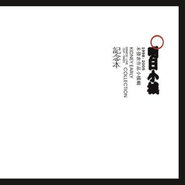

明日小城
============================

|  |  |
| :--: | :-- |
| [ 明日小城](https://emumo.xiami.com/album/357842) | **艺人**: [腰乐队](../index.md) **语种**: 国语 **唱片公司**: 局部娱乐 **发行时间**: 2009年10月10日 **专辑类别**: 录音室专辑 **专辑风格**: 摇滚 Rock & Roll **播放数**: 272397 **收藏数**: 1007 **评论数**: 57  |

## 简介

腰  
1998-2005未发表作品小样辑  
《明日小城》  
是，你好久不见的那段火；  
就是你最初遇见的那个团；  
比不详，更不详；  
比歌唱，更紧张……  
比有问题更，多问题。  
这个事原不值一提；前一回一高兴说了几句好听的，这一张，实际有特点三如下：1 \ 不正式 2 \ 过时 3 \ 很难听。  
与其说成唱片，另不如称玩意更妥当。故拟投放网络供下载为主要收听方式。  
只同时手工制实体盘60个，给自己和多情的亲友们留存。价约四五十，亦只能通过Q或者邮件私下购得；  
by 腰

## 曲目

## 评论

