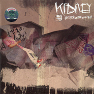

腰乐队
============================

|  |  |
| :--: | :-- |
| [ 腰乐队](https://i.xiami.com/kidney) | **播放数**: 9597201 **粉丝数**: 27818 **评论数**: 896 **地区**: China 中国大陆 **风格**: 摇滚 Rock & Roll  |

## 档案

## 专辑

| 名称 | 语种 | 唱片公司 | 发行时间 | 专辑类别 | 专辑风格 |
| :--: | :-- | :-- | :-- | :-- | :-- |
| [ 相见恨晚](./albums/1893305977.md) | 国语 | 局部娱乐 | 2014年07月24日 | 录音室专辑 |  |
| [ 明日小城](./albums/357842.md) | 国语 | 局部娱乐 | 2009年10月10日 | 录音室专辑 | 摇滚 Rock & Roll |
| [ 他们说忘了摇滚有问题](./albums/167452.md) | 国语 | 元音唱片 | 2008年01月30日 | 录音室专辑 | 摇滚 Rock & Roll |
| [ 我们究竟应该面对谁去歌唱](./albums/15745.md) | 国语 | BadHead | 2005年08月01日 | 录音室专辑 | 摇滚 Rock & Roll |
| [ unknown不详](./albums/15746.md) | 国语 | 独立发行 | 2003年06月01日 | EP, 单曲 | 摇滚 Rock & Roll |

## 评论

|  |  |  |  |
| :-- | :-- | :-- | :-- |
