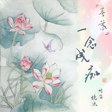

春慕·一念成痴九九八十一（柔版）竹笛改编
============================

|  |  |
| :--: | :-- |
| [ 春慕·一念成痴九九八十一（柔版）竹笛改编](https://emumo.xiami.com/album/2102680518) | **艺人**: [镜决](../index.md) **语种**: 国语 **唱片公司**: 独立发行 **发行时间**: 2017年01月14日 **专辑类别**: EP, 单曲 **专辑风格**: 当代民谣 Contemporary Folk, 器乐独奏 Solo Instrumental, 中国民乐 Chinese Folk Music **播放数**: 18772 **收藏数**: 9 **评论数**: 0  |

## 简介

  竹笛改编作品。
 

竹笛/改编/后期/封面绘画&amp;书法：镜决
 

 
 

 
 

【原曲】：《九九八十一》来自于VOCALOID虚拟歌姬乐正绫的专辑《2016丙申Bilibili拜年祭 》。
 

【柔版】：《九九八十一》来自于西瓜_JUN、泥鳅Niko 、K_K知性的小方块、叶洛洛，演唱的同名曲目。
 

 
 

 
 

【对原曲改编的部分】：
 

我加入了流水和飞鸟的声效，配上梆笛的清脆柔美~ 春心萌动的感觉，此为《春慕 · 一念成痴》曲名来历。
 

 
 

 
 

- 笛子是一口气演奏完的，不是分段录，所以有瑕疵。
 

 
 

- 封面的工笔荷花以及书法都是自己的作品呢。吹这首曲子的时候忽然想到了这张荷花图。
 

 
 

 
 
  

- 便是终将陷入尘埃里，也不忘初春时与你相遇的一刹，明眸善睐，顾盼生辉，一念成痴。 
 
  

 
 
  

春心萌动的感觉就是这样吧，想到这就记录下来了 :D  

 

 
 
 

## 曲目

## 评论

|  |  |  |  |
| :-- | :-- | :-- | :-- |
