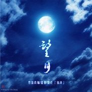

望月·泪朦胧 · 月がわたし竹笛改编
============================

|  |  |
| :--: | :-- |
| [ 望月·泪朦胧 · 月がわたし竹笛改编](https://emumo.xiami.com/album/2103628240) | **艺人**: [镜决](../index.md) **语种**: 日语 **唱片公司**: 独立发行 **发行时间**: 2018年03月21日 **专辑类别**: EP, 单曲 **专辑风格**: 中国民乐 Chinese Folk Music, 日本流行 J-Pop **播放数**: 3806 **收藏数**: 4 **评论数**: 0  |

## 简介

  
 

<strong>竹笛改编作品。</strong>
 

 
 

<strong>竹笛C，竹笛D。</strong>
 

<strong>竹笛改编/封面设计/书法：镜决</strong>
 

 
 

<strong>【原曲使用】来自阿兰·达瓦卓玛的专辑《Voice of EARTH》。</strong>
 

 
 

前些天给朋友听了新发的这些个曲子，
 

反馈说想听舒缓一点的，空灵一点的，
 

于是想到2012年那会儿看源氏物语听《千年の虹》，之后痴迷听alan的歌，
 

其中最喜欢的两首是《月がわたし》和《夢のガーデン》。
 

 
 

旋律流转间，
 

就仿若明月悬于心中，
 

清澈鹅黄，
 

倒映万里之外的路。
 

 
 

这首
 

在演奏上想尽可能表现柔美舒缓一些，
 

特别在每段收尾处更有韵味一些，
 

对比之前的几首，
 

发现其实演奏慢歌中的情感表达更不易。
 

不仅仅是技巧。
 

 
 

 
 

季节が移り変わっていっても 
 

无论时光如何流逝 
 

  

 

月がわたし 涙を染めて 
 

月亮便是我 尽由泪水浸染而成
 

 
 

2018.3.21
 

 

重新修改混音了两个版本。  

 

1. 竹笛 with alan  

 

2. 竹笛  

 

  

 

2018.11.18  
 
 

 

## 曲目

## 评论

