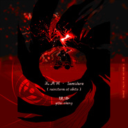

五月雨 · Samidare宇智波带土 | 同人曲 · 竹笛Remix
============================

|  |  |
| :--: | :-- |
| [ 五月雨 · Samidare宇智波带土 | 同人曲 · 竹笛Remix](https://emumo.xiami.com/album/2104384826) | **艺人**: [镜决](../index.md) **语种**: 日语 **唱片公司**:  **发行时间**: 2018年12月16日 **专辑类别**: EP, 单曲 **专辑风格**: 日本动漫游戏 Japanese ACG, 中国民乐 Chinese Folk Music, 陷阱舞曲 Trap **播放数**: 29955 **收藏数**: 14 **评论数**: 3  |

## 简介

 
 

下午录音制作，刚刚上传的新曲子。
 

 
 

☄️ 献给带土 · うちはオビト
 

《五月雨Samidare · 竹笛 Trap Remix (feat. Kayou.)》
 

 
 

竹笛改编/ Intro野原琳念白 /混音 ：镜决Yifei Zheng
 

Trap Remix: Kayou. (www.facebook.com/kayoumusic)
 

 
 

Kayou. 来自德国，是一个非常有个性的音乐人和AMV制作人，目前制作了一系列火影Remix和相关的AMV。私下联系了他后，他同意我的竹笛Remix，以及我使用他的AMV片段制作这首曲子的AMV。
 

 
 

 
 

昨天听到Kayou.对这首宇智波带土人物曲的Trap Remix，觉得完完全全是表达了带土悲凉而壮烈的一生，内心无尽的对这个世界的恨与无奈，想破茧而出，却又不得，这种声嘶力竭的感觉在Kayou的高潮Trap编曲中淋漓尽致的表现出来。
 

 
 

------------------------------------------------------
 

 
 

我现在忽然明白，
 

为什么选高木涉来为带土配音了，
 

那种嘶哑的深沉嗓音，
 

想要大声嘶吼，
 

却被命运一点一点蚕食，
 

直至化为齑粉。
 

 
 

带土，
 

宇智波斑说，
 

是他所遇到的拥有最深切的爱的人，
 

所以一旦摧毁，
 

将会是最深的黑暗。
 

 
 

竹笛，不再是明亮清脆，而想演奏成呜咽苍凉。期间在原曲的基础上，竹笛改编了几段变奏。
 

 
 

另外，录了一段开头Intro的野原琳念白：
 

 
 

- オビト、ずっと大好きだよ。さあ、行こう。  

 

- 带土，一直都很喜欢你。来，我们走吧。
 
  

 
 

2018.12.16
 

 
 

--------------------------------------------------------
 

 
 

【关于AMV】
 

哔哩哔哩：www.bilibili.com/video/av38346362
 

 
 

 
 

New Bamboo Flute Anime Music Video completed this morning 
 

❀ Naruto Shippuden - 五月雨 Samidare (The Rain in May) (feat. Kayou.)
 

----------------------------------
 

CREDITS
 

Bamboo Flute Performance   
<a class="profilelixnk" href="https://www.facebook.com/Yifeizheng1218?__tn__=K-R&amp;eid=ARAGqXw4YEEUzcfUXDeNJCl8IgRY03PwBEbfjsBBXH9BRs_co8wAt1pSbvqYo_GpRyV-82wvEKgbnAYt&amp;fref=mentions&amp;__xts__%5B0%5D=68.ARAhrsul8Qpz0rJq9yDWIEXme8OUHCrMN5W5fs8WsRWtsnTRb0UQnbRqEWuFMRxlW6rNNuVDFM9drOf8Uoust7J0neBq5NKcGZ8d0RraeA7zmnh-IT6LVGDeoDcHg_wjH3K9L_--ZqoON_DSawIIx15Cbl-1tUU31cbLojFHVBje49eVdrxgTxgDX7_1GlMp1vbB1IDQcfhuUSm2dLW6v4pSVfOFEnWIkL7RdVC6m7VJPp91uO_Ic8CdTl9gySkaY7qwf-SpXUzMfuuSmzDS7aJEcQGyVV5sso5lgyMYlq97TVSnqOVG3we2LhnxSTuUkl_lU9onqsRSMJmo0WARBzHWRGjQg7RzPA" data-hovercard="/ajax/hovercard/user.php?id=100008133630446&amp;extragetparams=%7B%22__tn__%22%3A%22%2CdK-R-R%22%2C%22eid%22%3A%22ARAGqXw4YEEUzcfUXDeNJCl8IgRY03PwBEbfjsBBXH9BRs_co8wAt1pSbvqYo_GpRyV-82wvEKgbnAYt%22%2C%22fref%22%3A%22mentions%22%7D" data-hovercard-prefer-more-content-show="1" style="color: rgb(54, 88, 153); text-decoration-line: none; font-family: inherit;">Yifei Zheng</a>  
| Song Mix | AMV | Voice-over of Rin in the Intro
 

Trap Remix | Footage Clip  
<a class="profilelixnk" href="https://www.facebook.com/kayoumusic/?__tn__=K-R&amp;eid=ARCjGv0gCwA0WBaMvESF4dOPLE-88uULPD6rTDCu7DhKu9Xr33HDp903bZPmLUlZKnJQ5ETr6zfQlmQs&amp;fref=mentions&amp;__xts__%5B0%5D=68.ARAhrsul8Qpz0rJq9yDWIEXme8OUHCrMN5W5fs8WsRWtsnTRb0UQnbRqEWuFMRxlW6rNNuVDFM9drOf8Uoust7J0neBq5NKcGZ8d0RraeA7zmnh-IT6LVGDeoDcHg_wjH3K9L_--ZqoON_DSawIIx15Cbl-1tUU31cbLojFHVBje49eVdrxgTxgDX7_1GlMp1vbB1IDQcfhuUSm2dLW6v4pSVfOFEnWIkL7RdVC6m7VJPp91uO_Ic8CdTl9gySkaY7qwf-SpXUzMfuuSmzDS7aJEcQGyVV5sso5lgyMYlq97TVSnqOVG3we2LhnxSTuUkl_lU9onqsRSMJmo0WARBzHWRGjQg7RzPA" data-hovercard="/ajax/hovercard/page.php?id=263897944163599&amp;extragetparams=%7B%22__tn__%22%3A%22%2CdK-R-R%22%2C%22eid%22%3A%22ARCjGv0gCwA0WBaMvESF4dOPLE-88uULPD6rTDCu7DhKu9Xr33HDp903bZPmLUlZKnJQ5ETr6zfQlmQs%22%2C%22fref%22%3A%22mentions%22%7D" data-hovercard-prefer-more-content-show="1" style="color: rgb(54, 88, 153); text-decoration-line: none; font-family: inherit;">Kayou.</a>. (soundcloud)
 

Illustrator  
@- 狄里 - (sina weibo)
 

Composer  
高梨康治 たかなし やすはる
 

 
 

もしも君が  
深い悲しみに出会ったら  
僕にもわけてくれるといいな  
その笑顔の為なら  
何だって出来るだろう
 

僕の大切な宝物  
僕の大切な宝物
 

2018.12.17
 

 
 

 

## 曲目

## 评论

|  |  |  |  |
| :-- | :-- | :-- | :-- |
|  [虾米用户](https://emumo.xiami.com/u/343477032) 音乐，加油 2019-04-05 22:00 赞(0) 踩(0) | 
放心
 |
|  [虾米用户](https://emumo.xiami.com/u/10118592) 中国风元素的竹笛Remi... 2018-12-18 10:09 赞(2) 踩(0) | 
完整高清AMV在这里：<a href="https://www.bilibili.com/video/av38346362" target="_blank" rel="nofollow noreferrer noopener">https://www.bilibili.com/video/av38346362</a>
 |
|  [虾米用户](https://emumo.xiami.com/u/10118592) 中国风元素的竹笛Remi... 2018-12-16 17:43 赞(2) 踩(0) | 
期间在原曲的基础上，竹笛改编了几段变奏。另外，录了一段开头Intro的野原琳念白：” オビト、ずっと大好きだよ。さあ、行こう。“ （带土，一直都很喜欢你。来，我们走吧。）
 |
