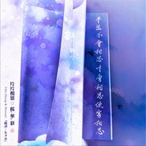

片片相思 ♡ 桜.華.彩（happy new year）竹笛重奏 · 改编
============================

|  |  |
| :--: | :-- |
| [ 片片相思 ♡ 桜.華.彩（happy new year）竹笛重奏 · 改编](https://emumo.xiami.com/album/2104432612) | **艺人**: [镜决](../index.md) **语种**: 国语 **唱片公司**:  **发行时间**: 2018年12月31日 **专辑类别**: EP, 单曲 **专辑风格**: 中国民乐 Chinese Folk Music, 电子舞曲 EDM / Electronic Dance Music, 同人音乐 DouJin **播放数**: 2742 **收藏数**: 4 **评论数**: 9  |

## 简介

 
 

 

<strong>片片相思II♡ 桜.華.彩 </strong>
 

<strong> (镜决Yifei Zheng &amp; himmeltengoku Remix)</strong>
 

 
 

 
 

| 竹笛重奏 · 改编/混音/封面设计/书法：镜决
 

| 原作曲/编曲：himmeltengoku
 

| 原曲：[Remix]桜.華.彩 - himmeltengoku（<a href="https://i.xiami.com/himmel/demo/1773565395" target="_blank" rel="nofollow noreferrer noopener">https://i.xiami.com/himmel/demo/1773565395</a>）
 
  
  
融入旋律：   
上海紅茶館（東方紅魔郷）  @ 01:11  02:50  
明日ハレの日、ケの昨日 (東方風神録)  @ 03:18  
  
融入东方的旋律是自然流露 就加上了  
Himmel的这首曲太美妙了  
  
 元曲 [雙調·蟾宮曲] 《春情》  
  
徐再思  
  
平生不會相思，才會相思，便害相思。身似浮雲，心如飛絮，氣若遊絲。  
空一縷余香在此，盼千金遊子何之？證候來時，正是何時？  
燈半昏時，月半明時。   
  
  
2018.12.31 

## 曲目

## 评论

|  |  |  |
| :-- | :-- | :-- |
|  [虾米用户](https://emumo.xiami.com/u/10118592) 中国风元素的竹笛Remi... 2019-01-04 21:26 赞(0) 踩(0) | 
今晚做好的新MV发布了喔：<a href="https://www.bilibili.com/video/av39912653/" target="_blank" rel="nofollow noreferrer noopener">https://www.bilibili.com/video/av39912653/</a> 【竹笛即兴四重奏| 跨年作 | 中国风电音】片片相思 ♡ 桜.華.彩（happy new year）| 耳机/音响效果MAX
 |
|  [虾米用户](https://emumo.xiami.com/u/410581775) 如是我闻，故国有明… 2019-01-03 05:14 赞(1) 踩(0) | 
夜色如水，故人似鬼，过往流思，佩弦佩韦…
 |
|  [虾米用户](https://emumo.xiami.com/u/10118592) 中国风元素的竹笛Remi... 2019-01-01 17:31 赞(0) 踩(0) | 
封面重新调色~粉紫色渲染 *:ﾟ*｡⋆ฺ * o♪❀ 赋：『片片相思＊桜.華.彩』 恰若冬桃夏雪。 化蓝紫彩梦，寥寥几笔意中人，灼灼几缕烛中月，华灯初上，桜染片页。 曰归曰归，岁亦莫止。  2019.1.1&nbsp;
 |
|  [虾米用户](https://emumo.xiami.com/u/10118592) 中国风元素的竹笛Remi... 2019-01-01 17:31 赞(0) 踩(0) | 
竹笛四重奏。无谱即兴的演奏。电子舞曲electronic dance music ~ 耳机/音响效果MAX ⭐ 跨年夜重修。 Himmel的曲子太美妙了~ 笛子的声音像手心里的小雀一样扑棱扑棱 2019.1.1
 |
|  [虾米用户](https://emumo.xiami.com/u/404023576)  2018-12-31 11:33 赞(1) 踩(0) | 
曲子节奏很像akito的「桜華月」，而且结尾也明显使用了「桜華月」的旋律，有些遗憾，虽然这首融合了几首曲子的调，但总体上节奏还是感觉不如「桜華月」那么畅快淋漓。当然，作者的功夫还是没的说的，我对乐理也一窍不通的，这也只是我个人的看法。
 |
| ⇒ |  [虾米用户](https://emumo.xiami.com/u/10118592) 中国风元素的竹笛Remi... 2018-12-31 11:36 赞(0) 踩(0) | 
您说的节奏不如桜華月是指编曲的节奏感还是笛子的部分？
 |
| ⇒ |  [虾米用户](https://emumo.xiami.com/u/404023576)  2018-12-31 11:51 赞(0) 踩(0) | 
<q><b>镜决说：</b></q>
 |
| ⇒ |  [虾米用户](https://emumo.xiami.com/u/10118592) 中国风元素的竹笛Remi... 2018-12-31 12:33 赞(0) 踩(0) | 
嗯嗯，himmel取名「桜華彩」原来是来自「桜華月」。听了一下Akito的「桜華月」,的确旋律是采用在这里了。但Akito的「桜華月」是电子乐，节奏感强因为是electronic，强化了beat，himmel的「桜華彩」这首更偏向是pop一些，也有电子的元素在里面。我的这首上传选择分类的时候也一直挺犹豫的，folktronica电音民谣，Blend of folk +&amp;lrm; electronica，还在想是不是属于电音民谣多一些，但中国风的元素很明显，中国大鼓以及二胡笛子古筝。
 |
| ⇒ |  [虾米用户](https://emumo.xiami.com/u/10118592) 中国风元素的竹笛Remi... 2018-12-31 12:37 赞(0) 踩(0) | 
<q><b>镜决说：</b></q>
 |
