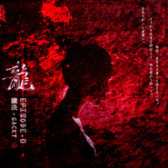

龍 · Episode. 0竹笛改编 | feat. 镜决 & GACKT
============================

|  |  |
| :--: | :-- |
| [ 龍 · Episode. 0竹笛改编 | feat. 镜决 & GACKT](https://emumo.xiami.com/album/2104643807) | **艺人**: [镜决](../index.md) **语种**: 日语 **唱片公司**: 独立发行 **发行时间**: 2019年03月02日 **专辑类别**: EP, 单曲 **专辑风格**: 中国民乐 Chinese Folk Music, 同人音乐 DouJin, 视觉摇滚 Visual Rock **播放数**: 319 **收藏数**: 4 **评论数**: 0  |

## 简介

<strong> 竹笛改编作品</strong>
 

<strong>竹笛bE - E</strong>
 

 
 

<strong>龍 · Episode. 0  
</strong>
 

<strong>竹笛改编 | feat. 镜决 &amp; GACKT</strong>
 

 
 

竹笛/封面设计书法/故事台本/原创对白台词：镜决yifei zheng
 

原唱：GACKT
 

作曲|作词：カニミソP （mathru@kanimiso P）
 

来自专辑：Episode.0 (<a href="https://www.xiami.com/artist/rxe2e73e?spm=a1z1s.6659513.6856585.1.WoaOjv" title="Gackt" data-spm-anchor-id="a1z1s.6659513.6856585.1" style="border: 0px; font-size: 12px; margin: 0px 5px 0px 0px; outline: none; padding: 0px; color: rgb(51, 102, 204); -webkit-tap-highlight-color: rgb(254, 150, 0); font-family: " microsoft="" yahei",="" simsun;"="">GACKT</a>)  
<a href="https://www.xiami.com/album/kq04cb044" target="_blank" rel="nofollow noreferrer noopener">https://www.xiami.com/album/kq04cb044</a>
 

 
 

 
 

<strong>封面设计花了很久的时间。  
</strong>
 

<strong>表达硝烟中鲜血四溅，  
</strong>
 

<strong>还有残存的少女。  
</strong>
 

<strong>唯一美好的存在。</strong>  

 

 
 

<strong>中间这段对白目前还未录制。</strong>
 

<strong>在寻找男声的日配。</strong>  

 

 
 

<strong>原创台词：</strong>
 

<strong>——</strong>
 

<strong> </strong>
 

<strong>男の子：</strong>
 
<strong> 

死亡、
 

自分で选んだ道だからこそ、
 

自分を救うことができる。
 

そう决めたまま、
 

その道をひたすら歩く。
 

  

 

女の子：
 

もし一生に一度だけなら
 

生きてください
 

生きて罪を償う。
 

  

 

孤独を恐れるか、
 

手を伸ばしてください
 

君といっしょに歩きたい
 

私を連れて行って、
 

あなたがいる世界へ。
 

——
 
</strong> 

  

 

<strong>~欢迎~</strong>
 
  

<strong style="color: rgb(204, 0, 0);">自信的男孩子</strong>  

 
  

<strong style="color: rgb(61, 133, 198);">你的声音将一起记录在音乐里哟。</strong>
 

<strong>请在虾米的歌曲页面留言 ⚝</strong>
 

 
 

 
 

<strong>听到GACKT的Episode.0 </strong>
 

<strong>心里浮现的故事背景:</strong>
 

 
 

<strong>这是一个关于在硝烟弥漫的战场上，</strong>
 

<strong>最后残存的战士，</strong>
 

<strong>无比悔恨当初的年少轻狂，</strong>
 

<strong>忽视对母亲的孝义，</strong>
 

<strong>如今在尸首满布的战壑之中，</strong>
 

<strong>残存下来的自己，</strong>
 

<strong>还有什么活下去的意义。</strong>
 

 
 

<strong>迷茫，</strong>
 

<strong>怕是只有死亡，</strong>
 

<strong>只有死亡才能解答，</strong>
 

<strong>这条命的意义。</strong>
 

<strong>看这把残破的刀，</strong>
 

<strong>镌刻着斑驳的龙纹，</strong>
 

<strong>折射血色的刃，</strong>
 

<strong>是在指引我的路吧。</strong>
 

 
 

<strong>死亡，</strong>
 

<strong>正因为是自己选择的道路，</strong>
 

<strong>才能拯救自己。</strong>
 

<strong>决定了那样，</strong>
 

<strong>就一个劲儿地在那条路上走。</strong>
 

 
 

<strong>——</strong>
 

<strong>不。等等。</strong>
 

<strong>这是哪里来的歌声。</strong>
 

 
 

<strong>……</strong>
 

 
 

<strong>如果一生只有一次，</strong>
 

<strong>请活下去，</strong>
 

<strong>活下去赎罪。</strong>
 

<strong>害怕孤单吗，</strong>
 

<strong>请伸出手吧，</strong>
 

<strong>我愿和你一起走，</strong>
 

<strong>走向有你的世界。</strong>
 

 
 

<strong>——</strong>
 

 
 

 
 

2019.3.2
 

 
 

 

## 曲目

## 评论

|  |  |  |  |
| :-- | :-- | :-- | :-- |
