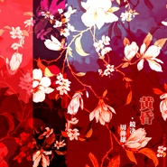

黄昏 · Nightfall
============================

|  |  |
| :--: | :-- |
| [ 黄昏 · Nightfall](https://emumo.xiami.com/album/2104945823) | **艺人**: [镜决](../index.md) **语种**: 国语 **唱片公司**:  **发行时间**: 2019年06月15日 **专辑类别**: EP, 单曲 **专辑风格**: 国语流行 Mandarin Pop **播放数**: 4062 **收藏数**: 1 **评论数**: 8  |

## 简介

歌词很走心&nbsp;旋律很好听&nbsp;还有回忆  
  
封面设计&nbsp;翻唱&nbsp;录音：镜决  
*竹笛：镜决 （待续）  
  
*歌曲是fan-made，non-profit，不享有任何版权。因为喜欢，推广原曲的目的。  
  
  
-&nbsp;黄昏&nbsp;-  
  
作词：陈信荣&nbsp;  
作曲：周传雄  
原唱：周传雄  
出自专辑：《transfer（忘记）》2000年12月28日发行。  
  
——混乱中有种热泪烧伤的错觉  
  
热泪烧伤脸颊  
留下烬痕  
这种痛感  
是多少等级？  
  
——黄昏的地平线  
割断幸福喜悦  
  
日暮下披洒残照的大地&nbsp;  
难道是一把利刃？  
喜悦留给白天  
  
黑夜是...  
  
  
2019.6.15

## 曲目

## 评论

|  |  |  |
| :-- | :-- | :-- |
|  [虾米用户](https://emumo.xiami.com/u/412485686)  2019-06-16 08:07 赞(3) 踩(0) | 
******
 |
| ⇒ |  [虾米用户](https://emumo.xiami.com/u/10118592) 中国风元素的竹笛Remi... 2019-06-16 11:22 赞(0) 踩(0) | 
( ˶‾᷄࿀‾᷅˵ )是的呢
 |
|  [虾米用户](https://emumo.xiami.com/u/356615980) 胜利就是一切 2019-06-16 07:53 赞(1) 踩(0) | 
好温柔
 |
| ⇒ |  [虾米用户](https://emumo.xiami.com/u/10118592) 中国风元素的竹笛Remi... 2019-06-28 06:07 赞(0) 踩(0) | 
(๑˃̵ᴗ˂̵)و
 |
|  [虾米用户](https://emumo.xiami.com/u/379813721) 到达胜利之前，无法回头 2019-06-15 13:34 赞(1) 踩(0) | 
唱的好
 |
| ⇒ |  [虾米用户](https://emumo.xiami.com/u/10118592) 中国风元素的竹笛Remi... 2019-06-15 17:39 赞(0) 踩(0) | 
谢谢(´｡• ᵕ •｡`) ♡
 |
|  [虾米用户](https://emumo.xiami.com/u/318412564)  2019-06-15 11:42 赞(1) 踩(0) | 
抱抱 抱抱 好想抱紧你 孩子
 |
| ⇒ |  [虾米用户](https://emumo.xiami.com/u/10118592) 中国风元素的竹笛Remi... 2019-11-06 19:10 赞(0) 踩(0) | 
\(￣︶￣*\))抱抱
 |
