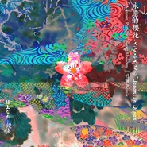
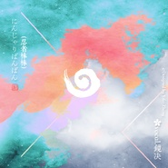
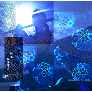
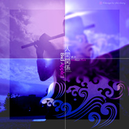
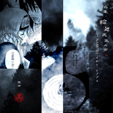
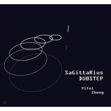
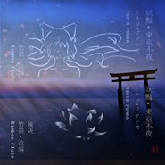

镜决
============================

|  |  |
| :--: | :-- |
| [ 镜决](https://i.xiami.com/mirror-dec) | **播放数**: 2665545 **粉丝数**: 555 **评论数**: 100 **地区**: China 中国大陆 **风格**: 中国民乐 Chinese Folk Music, 同人音乐 DouJin, 中国风 China-Wave, 日本新世纪 Japanese New Age, 日本动漫游戏 Japanese ACG  |

## 档案

2020 ❤ 
三次元的二次元竹笛乐手，新中国风实验音乐 
音乐，视频。配音☆ 摸索中的平面设计音乐人 
Target Audience：能够接受器乐演奏不常见本器乐演奏的音乐（是不是很绕，笑w） 
竹笛改编的歌曲是饭制fanmade, non profit 
请大家购买正版原曲, 侵删 
乐手合作请在虾米或微博留言/私信. 
Bilibili 哔哩哔哩动画 @镜决 
------------------------------------------------------------ 
因为虾米音乐曲库的关系，最近用的比较少了，但几个音乐平台比较看来，虾米以一张张漂亮封面的CD专辑的形式发布歌曲，我还是中意这样的。之后依旧选择在虾米发布歌曲和自己的一些封面设计。 
以下，算是镜决歌单的听歌指南（~） 
说起来，因为2015年第一首《恋风·七彩蝴蝶》认识了很多朋友，没想到当月这首歌被收录到虾米音乐人的精选集里，非常意外。明明是小白的我，似乎获得了一些动力继续摸索笛子和自己喜欢的曲风之间的化学反应。 
2017年，摸索的初期阶段吧，录音质量不是很好，原本是想删去黑历史的，但似乎因为录的演奏是自己喜欢的流行歌曲，居然吸引了很多人，竹笛的《桃源恋歌》《只爱西经》《九九八十一》《If You Do》《Tokio Funka》。杂七杂八的曲风都尝试了一下~ 
2018，前半年最心水的作品是《桜音》《冬之桜》《时之砂》，和风慢节奏，笛子将每首歌的故事娓娓道来，悲戚微婉。2018后半年，试了一下怀旧的韩国90年代电音《와 哇 》以及仁显王后的男人电视剧的主题曲《相同天空下 不同时间里》，为此，做了两个剪辑的MV。2018年末，细细看完了火影忍者第四次忍界大战的全过程，为印象深刻的几个角色录了几首笛子演奏的同人曲，宇智波带土《五月雨·Samidare》，野原琳《哀と悲》，鸣人《Naruto Main Theme》，佐助《雨落·Rainy Day》，佩恩和长门《孤独Loneliness·长门之痛》。 
2019，年初，接触了蒸汽波的经典曲子《Plastic Love》，其中Tara的新混音特别对胃口，笛子说什么也要试试。为此，以日本的都市和夜晚做了一个蒸汽波概念的MV。到除夕夜，《Bad Apple》10年纪念，最喜欢的一版Nardis的Remix，配上练习了差不多10年的bad apple（大雾w）。

## 专辑

| 名称 | 语种 | 唱片公司 | 发行时间 | 专辑类别 | 专辑风格 |
| :--: | :-- | :-- | :-- | :-- | :-- |
| [ 永远的樱花~さくらさくら~Japanize Dream竹笛REMIX](./albums/5022529393.md) | 日语 | 独立发行 | 2021年01月18日 | EP, 单曲 | 同人音乐 DouJin, 电子舞曲 EDM / Electronic Dance Music, 中国民乐 Chinese Folk Music |
| [ 忍者棒棒☆にんじゃりばんばん日翻 | 竹笛改编](./albums/5022282658.md) | 日语 | 独立发行 | 2020年12月22日 | EP, 单曲 | 同人音乐 DouJin, 电子舞曲 EDM / Electronic Dance Music, 电子 Electronic |
| [ 雨鸣·極楽浄土竹笛](./albums/5021304885.md) | 日语 | 独立发行 | 2020年08月17日 | EP, 单曲 | 中国民乐 Chinese Folk Music, 同人音乐 DouJin, 流行舞曲 Dance-Pop |
| [ 帰り道归途 | 竹笛改编](./albums/5021088618.md) | 日语 | 独立发行 | 2020年07月11日 | EP, 单曲 | 日本流行 J-Pop, 中国民乐 Chinese Folk Music |
| [ 素颜❀vocal.镜决](./albums/5020867947.md) | 国语 | 独立发行 | 2020年06月13日 | EP, 单曲 | 国语流行 Mandarin Pop, 轻音乐 Easy Listening |
| [ 夜半之月竹笛改编 · 吉田兄弟三味线「夜半の月」](./albums/5020708211.md) | 日语 | 独立发行 | 2020年05月26日 | EP, 单曲 | 中国民乐 Chinese Folk Music, 日本 | 邦乐 Japanese Traditional Music, 轻音乐 Easy Listening |
| [ 三生三世·繁花♡竹笛改编 | 三生三世十里桃花 | 枕上书 OST](./albums/2108262621.md) | 国语 | 独立发行 | 2020年03月27日 | EP, 单曲 | 中国民乐 Chinese Folk Music, 电视原声 Television Music, 国语流行 Mandarin Pop |
| [ 日本語の録音テープ镜决的日语练习录音带~](./albums/2105751378.md) | 日语 | 独立发行 | 2020年01月17日 | 播客 | 有声书 Audio Book |
| [ 花吹雪·リフレクト竹笛改编 | Last Note. / GUMI (グミ)](./albums/2105471919.md) | 日语 |  | 2019年11月21日 | EP, 单曲 | 中国民乐 Chinese Folk Music, 日本动漫游戏 Japanese ACG, 同人音乐 DouJin |
| [ Sunflower·花の勇気竹笛改编 島谷ひとみ「Destiny -太陽の花」](./albums/2105161016.md) | 日语 |  | 2019年08月19日 | EP, 单曲 | 中国民乐 Chinese Folk Music, 日本流行 J-Pop, 器乐流行 Instrumental Pop |
| [ 为你成全 · All For You竹笛改编 · 大唐荣耀 电视剧原声带](./albums/2104962286.md) | 国语 | 太合音乐 | 2019年06月24日 | EP, 单曲 | 电视原声 Television Music, 中国民乐 Chinese Folk Music, 中国风 China-Wave |
| [ 黄昏 · Nightfall](./albums/2104945823.md) | 国语 |  | 2019年06月15日 | EP, 单曲 | 国语流行 Mandarin Pop |
| [ 有点甜๑](./albums/2104894186.md) | 国语 |  | 2019年05月23日 | EP, 单曲 | 国语流行 Mandarin Pop |
| [ 龍 · Episode. 0竹笛改编 | feat. 镜决 & GACKT](./albums/2104643807.md) | 日语 | 独立发行 | 2019年03月02日 | EP, 单曲 | 中国民乐 Chinese Folk Music, 同人音乐 DouJin, 视觉摇滚 Visual Rock |
| [ 人間関係· Bad Apple!!（新年賀）竹笛改编 ^Nardis Remix](./albums/2104574461.md) | 日语 |  | 2019年02月04日 | EP, 单曲 | 中国民乐 Chinese Folk Music, 电子舞曲 EDM / Electronic Dance Music, 同人音乐 DouJin |
| [ 飾愛·Ｐｌａｓｔｉｃ　Ｌｏｖｅ竹笛 | 竹内まりや · Τ Λ Я Λ · プラスティック・ラブ](./albums/2104509016.md) | 日语 |  | 2019年01月19日 | EP, 单曲 | 都市流行 City Pop, 中国民乐 Chinese Folk Music, 实验音乐 Experimental |
| [ 夏祭り· Flute Metal竹笛 | 金属rock](./albums/2104454539.md) | 日语 |  | 2019年01月06日 | EP, 单曲 | 中国民乐 Chinese Folk Music, 旋律黑金 Melodic Black Metal, 日本摇滚 J-Rock |
| [ 片片相思 ♡ 桜.華.彩（happy new year）竹笛重奏 · 改编](./albums/2104432612.md) | 国语 |  | 2018年12月31日 | EP, 单曲 | 中国民乐 Chinese Folk Music, 电子舞曲 EDM / Electronic Dance Music, 同人音乐 DouJin |
| [ 孤独Loneliness · 長門之痛Nagato's Pain竹笛改编 | 火影忍者疾风传 - 高梨康治「孤独」](./albums/2104404815.md) | 日语 |  | 2018年12月22日 | EP, 单曲 | 日本动漫游戏 Japanese ACG, 中国民乐 Chinese Folk Music, 同人音乐 DouJin |
| [ 雨落 · Rainy Day竹笛 · 火影忍者 Naruto Shippuden Road To Ninja](./albums/2104389928.md) | 日语 |  | 2018年12月18日 | EP, 单曲 | 中国民乐 Chinese Folk Music, 陷阱舞曲 Trap, 同人音乐 DouJin |
| [ 五月雨 · Samidare宇智波带土 | 同人曲 · 竹笛Remix](./albums/2104384826.md) | 日语 |  | 2018年12月16日 | EP, 单曲 | 日本动漫游戏 Japanese ACG, 中国民乐 Chinese Folk Music, 陷阱舞曲 Trap |
| [ 風遁 · 螺旋手裏剣竹笛改编 · 火影 NARUTO Main Theme](./albums/2104364002.md) | 日语 |  | 2018年12月11日 | EP, 单曲 | 日本动漫游戏 Japanese ACG, 中国民乐 Chinese Folk Music, 同人音乐 DouJin |
| [ 外道·輪廻天生の術火影忍者·笛「 NARUTO -ナルト- シノブエ](./albums/2104315425.md) | 日语 |  | 2018年12月02日 | EP, 单曲 | 日本动漫游戏 Japanese ACG, 中国民乐 Chinese Folk Music, 器乐独奏 Solo Instrumental |
| [ 恋音と雨空 ❀ 镜决の唄うAAA | Love & Rainy Sky](./albums/2104125534.md) | 日语 | 独立发行 | 2018年10月21日 | EP, 单曲 | 日本流行 J-Pop |
| [ 와  哇 - 李贞贤 (竹笛Remix)와- 이정현](./albums/2104079975.md) | 韩语 | 独立发行 | 2018年10月04日 | EP, 单曲 | 中国民乐 Chinese Folk Music, 韩国流行 K-Pop, 电子舞曲 EDM / Electronic Dance Music |
| [ 仁显王后的男人같은 하늘 다른 시간에](./albums/2104077320.md) | 韩语 | 独立发行 | 2018年10月03日 | EP, 单曲 | 电视原声 Television Music, 中国民乐 Chinese Folk Music, 韩国流行 K-Pop |
| [ 我的将军啊 ❀ 镜决原曲：Watch The Pacific    作词：半阳](./albums/2104066375.md) | 国语 | 独立发行 | 2018年09月30日 | EP, 单曲 | 古风 GuFeng Music, 国语流行 Mandarin Pop, 中国风 China-Wave |
| [ 王朝竹笛改编](./albums/2104051946.md) | 国语 | 独立发行 | 2018年09月25日 | EP, 单曲 | 中国民乐 Chinese Folk Music, 器乐流行 Instrumental Pop |
| [ 稲田姫 - ピアノ& 笛竹笛改编：稲田姫様に叱られるから - 東方風神録](./albums/2104051271.md) | 日语 | 独立发行 | 2018年09月24日 | EP, 单曲 | 中国民乐 Chinese Folk Music, 同人音乐 DouJin, 轻音乐 Easy Listening |
| [ Bad Apple!! ❀ 镜决の詠う原曲：东方幻想乡/BadApple!!](./albums/2103996379.md) | 日语 | 独立发行 | 2018年09月07日 | EP, 单曲 | 日本动漫游戏 Japanese ACG, 同人音乐 DouJin, 无伴奏合唱 A cappella |
| [ 搞笑❀Hide Behind Smile翻唱/改编/竹笛：镜决 | 原唱：罗志祥](./albums/2103974151.md) | 国语 | 独立发行 | 2018年09月03日 | EP, 单曲 | 中国民乐 Chinese Folk Music, 国语流行 Mandarin Pop |
| [ 二零一四2014·镜决竹笛选集/旧曲重制](./albums/2103902051.md) | 国语 | 独立发行 | 2018年08月07日 | EP, 单曲 | 电视原声 Television Music, 中国民乐 Chinese Folk Music, 同人音乐 DouJin |
| [ 五月雨恋歌竹笛改编 DeZI:R 《五月雨恋歌》](./albums/2103896722.md) | 日语 | 独立发行 | 2018年08月02日 | EP, 单曲 | 同人音乐 DouJin, 日本流行 J-Pop, 中国民乐 Chinese Folk Music |
| [ 爛漫·夏眠之梦竹笛改编《春爛漫》源氏物语千年纪](./albums/2103866971.md) | 日语 | 独立发行 | 2018年07月28日 | EP, 单曲 | 日本新世纪 Japanese New Age, 轻音乐 Easy Listening, 中国民乐 Chinese Folk Music |
| [ 懸命·時之砂竹笛改编 《砂漠の子守唄（和楽器バンド）》](./albums/2103698298.md) | 日语 | 独立发行 | 2018年04月27日 | EP, 单曲 | 中国民乐 Chinese Folk Music, 日本新世纪 Japanese New Age |
| [ 凛风·绽放之花竹笛改编 『凛として咲く花の如く～ひなビタ♪ edition～』](./albums/2103694007.md) | 日语 | 独立发行 | 2018年04月23日 | EP, 单曲 | 中国民乐 Chinese Folk Music, 日本动漫游戏 Japanese ACG, 同人音乐 DouJin |
| [ 桜音·Sakurane银魂ED4 | 竹笛改编 『Sakurane -ballad-』](./albums/2103655567.md) | 日语 | 独立发行 | 2018年03月31日 | EP, 单曲 | 中国民乐 Chinese Folk Music, 器乐流行 Instrumental Pop, 日本动漫游戏 Japanese ACG |
| [ 悲恋·冬之桜竹笛改编《冬の桜》 | 吉田兄弟三味线](./albums/2103644331.md) | 日语 | 独立发行 | 2018年03月26日 | EP, 单曲 | 中国民乐 Chinese Folk Music, 日本 | 邦乐 Japanese Traditional Music, 日本流行 J-Pop |
| [ 六兆年·一夜物语 （待续）竹笛+钢琴改编《六兆年と一夜物語》](./albums/2103638276.md) | 日语 | 独立发行 | 2018年03月24日 | EP, 单曲 | 中国民乐 Chinese Folk Music, 日本动漫游戏 Japanese ACG, 器乐流行 Instrumental Pop |
| [ 盛世·梦绕紫禁竹笛改编《盛世霓裳》](./albums/2103635380.md) | 国语 | 独立发行 | 2018年03月23日 | EP, 单曲 | 国语流行 Mandarin Pop, 中国民乐 Chinese Folk Music, 中国风 China-Wave |
| [ 望月·泪朦胧 · 月がわたし竹笛改编](./albums/2103628240.md) | 日语 | 独立发行 | 2018年03月21日 | EP, 单曲 | 中国民乐 Chinese Folk Music, 日本流行 J-Pop |
| [ 泣诉·镇魂曲竹笛改编《鎮命歌 -しずめうた》](./albums/2103624834.md) | 日语 | 独立发行 | 2018年03月20日 | EP, 单曲 | 中国民乐 Chinese Folk Music, 日本动漫游戏 Japanese ACG, 轻音乐 Easy Listening |
| [ 恋歌·紅葉愛唄竹笛(镜决) , 三味线 (神井大治)](./albums/2103614810.md) | 日语 | 独立发行 | 2018年03月17日 | EP, 单曲 | 中国民乐 Chinese Folk Music, 中国风 China-Wave, 日本流行 J-Pop |
| [ 幸魂·Sakitama竹笛改编](./albums/2103608462.md) | 日语 | 独立发行 | 2018年03月15日 | EP, 单曲 | 中国民乐 Chinese Folk Music, 日本 | 邦乐 Japanese Traditional Music |
| [ 慕情·犬夜叉竹笛改编](./albums/2103601571.md) | 日语 | 独立发行 | 2018年03月11日 | EP, 单曲 | 中国民乐 Chinese Folk Music, 同人音乐 DouJin, 轻音乐 Easy Listening |
| [ 幻梦·Fantasy](./albums/2103498052.md) | 其他 | 独立发行 | 2018年01月23日 | EP, 单曲 | 氛围音乐 Ambient |
| [ 来自人马星的回响贝司Sagittarius Dubstep ​即兴自由的Dubstep尝试](./albums/2102973755.md) | 英语 | 独立发行 | 2017年12月13日 | EP, 单曲 | 回响贝斯 Dubstep |
| [ 桃源恋歌Love in Peach Blossoms (竹笛·三味線·改编)](./albums/2102818994.md) | 日语 | 独立发行 | 2017年08月23日 | EP, 单曲 | 中国民乐 Chinese Folk Music, 日本 | 邦乐 Japanese Traditional Music, 电音流行 Electropop |
| [ 是时候·说再见了竹笛改编（さよならさよなら）](./albums/2102744129.md) | 日语 | 独立发行 | 2017年05月07日 | EP, 单曲 | 日本流行 J-Pop, 嘻哈 Hip-Hop, 中国民乐 Chinese Folk Music |
| [ 奈何情浅·If You Do竹笛改编(나가하면)](./albums/2102726192.md) | 韩语 | 独立发行 | 2017年03月31日 | EP, 单曲 | 韩国流行 K-Pop, 流行说唱 Pop Rap, 中国民乐 Chinese Folk Music |
| [ 妖豔·東京不夜（トキヲ・ファンカ - Tokio Funka）](./albums/2102684643.md) | 日语 | 独立发行 | 2017年01月23日 | EP, 单曲 | 同人音乐 DouJin, 中国民乐 Chinese Folk Music, 回响贝斯 Dubstep |
| [ 春慕·一念成痴九九八十一（柔版）竹笛改编](./albums/2102680518.md) | 国语 | 独立发行 | 2017年01月14日 | EP, 单曲 | 当代民谣 Contemporary Folk, 器乐独奏 Solo Instrumental, 中国民乐 Chinese Folk Music |
| [ 空空·只爱西经只爱西经(竹笛改编)](./albums/2102679572.md) | 粤语 | 独立发行 | 2017年01月12日 | EP, 单曲 | 粤语流行 Cantopop, 电视原声 Television Music, 中国民乐 Chinese Folk Music |
| [ 入梦·烟花易冷烟花易冷（竹笛改编）](./albums/2102662705.md) | 国语 | 独立发行 | 2016年12月11日 | EP, 单曲 | 国语流行 Mandarin Pop, 中国民乐 Chinese Folk Music |
| [ 浮游·迷离·安释](./albums/428845460.md) | 其他 | 独立发行 | 2015年04月12日 | EP, 单曲 | 实验音乐 Experimental, 自由即兴 Free Improvisation, 电音流行 Electropop |
| [ 恋风·七彩蝴蝶改编：虹色蝶々 - 黒うさP](./albums/21515479.md) | 日语 | 独立发行 | 2015年01月18日 | EP, 单曲 | 中国民乐 Chinese Folk Music, 中国风 China-Wave |
| [ 初心·遥远旅途](./albums/121232252.md) | 日语 | 独立发行 | 2014年01月03日 | EP, 单曲 | 中国民乐 Chinese Folk Music, 日本新世纪 Japanese New Age |

## 评论

|  |  |  |  |
| :-- | :-- | :-- | :-- |
|  [虾米用户](https://emumo.xiami.com/u/319490173) 武汉大学，完美，撒花！！... 2021-01-31 19:52 赞(1) 踩(0) | 
镜决姐姐的笛子超好听的！这次到虾米道别啦！镜决姐姐要越来越美丽喔！
 |
|  [虾米用户](https://emumo.xiami.com/u/10118592) 中国风元素的竹笛Remi... 2021-01-11 19:06 赞(2) 踩(0) | 
创建了这个镜决粉团小群, qq群号： 830278878，之后有作品和一些想法活动也会分享在群里面，或者大家有什么想对我说的话，想和我一起合作的乐器也可以在群里说哟，期待与大家见面♡
 |
|  [虾米用户](https://emumo.xiami.com/u/358104299) 悲观的唯心存在现实解构虚... 2021-01-08 11:57 赞(0) 踩(0) | 
45965
 |
|  [虾米用户](https://emumo.xiami.com/u/124872702) 谢谢收听 2020-06-24 09:50 赞(1) 踩(0) | 
爱
 |
|  [虾米用户](https://emumo.xiami.com/u/331630393) 我还没想好要写什么... 2020-06-16 22:41 赞(1) 踩(0) | 
你的心镜让人敬仰
 |
| ⇒ |  [虾米用户](https://emumo.xiami.com/u/10118592) 中国风元素的竹笛Remi... 2020-06-17 23:46 赞(0) 踩(0) | 
谢谢( &amp;acute;͈ ⌵ `͈ )&amp;sigma;ண♡
 |
|  [虾米用户](https://emumo.xiami.com/u/188744817) hi，我很好，不用你挂念... 2020-06-04 08:45 赞(1) 踩(0) | 
嫉妒小姐姐的才华，有机会一定要拜小姐姐为师学习。
 |
| ⇒ |  [虾米用户](https://emumo.xiami.com/u/10118592) 中国风元素的竹笛Remi... 2020-06-04 13:47 赞(0) 踩(0) | 
(・&amp;omega;&amp;lt; )★ 好啊 欢迎来～
 |
|  [虾米用户](https://emumo.xiami.com/u/326879773) 荳将發芽，夢想成真。(荳... 2020-04-11 23:23 赞(0) 踩(0) | 
能把星月神话这首歌用笛子的方式吹奏出来上传到虾米吗？
 |
|  [虾米用户](https://emumo.xiami.com/u/8904877) 没有星星的夜里 何必去要 2020-03-25 16:03 赞(1) 踩(0) | 
好听
 |
| ⇒ |  [虾米用户](https://emumo.xiami.com/u/10118592) 中国风元素的竹笛Remi... 2020-04-22 19:29 赞(0) 踩(0) | 
(#^.^#)
 |
|  [虾米用户](https://emumo.xiami.com/u/326879773) 荳将發芽，夢想成真。(荳... 2020-03-10 23:06 赞(0) 踩(0) | 
能把星月神话这首歌用笛子的方式吹奏出来上传到虾米吗？
 |
| ⇒ |  [虾米用户](https://emumo.xiami.com/u/10118592) 中国风元素的竹笛Remi... 2020-03-11 16:08 赞(0) 踩(0) | 
嗯~ 记下了
 |
|  [虾米用户](https://emumo.xiami.com/u/247313043) 肉与音乐(๑•̀ㅂ•́)... 2020-03-03 18:02 赞(1) 踩(0) | 
嗷嗷！可以让人内心平静的声音(｀ω´ )
 |
| ⇒ |  [虾米用户](https://emumo.xiami.com/u/10118592) 中国风元素的竹笛Remi... 2020-04-22 19:30 赞(0) 踩(0) | 
en(๑╹ヮ╹๑)ﾉ
 |
|  [虾米用户](https://emumo.xiami.com/u/257023113)  2020-01-13 20:20 赞(1) 踩(0) | 
喜欢，好听支持你
 |
| ⇒ |  [虾米用户](https://emumo.xiami.com/u/10118592) 中国风元素的竹笛Remi... 2020-01-15 09:20 赞(0) 踩(0) | 
谢谢«٩(*´ ꒳ `*)۶»
 |
|  [虾米用户](https://emumo.xiami.com/u/325205625)  2019-11-01 11:08 赞(1) 踩(0) | 
，
 |
|  [虾米用户](https://emumo.xiami.com/u/328657369) 风格随心而变、 2019-08-13 23:41 赞(3) 踩(0) | 
加油(ง •̀_•́)ง
 |
|  [虾米用户](https://emumo.xiami.com/u/426548595) 我还没想好要写什么... 2019-07-08 11:36 赞(4) 踩(0) | 
我又来听你的声音啦～
 |
|  [虾米用户](https://emumo.xiami.com/u/27482995) 喜欢老猫、V系、遥久、各... 2019-06-22 21:55 赞(3) 踩(0) | 
超棒啊！支持支持！期待后续作品
 |
| ⇒ |  [虾米用户](https://emumo.xiami.com/u/10118592) 中国风元素的竹笛Remi... 2020-03-28 15:38 赞(0) 踩(0) | 
\(^o^)/~~谢谢
 |
|  [虾米用户](https://emumo.xiami.com/u/314712835)  2019-05-30 23:30 赞(3) 踩(0) | 
我觉得竹笛三味线版的红叶爱呗才能比得上极乐净土与桃源恋歌。
 |
| ⇒ |  [虾米用户](https://emumo.xiami.com/u/10118592) 中国风元素的竹笛Remi... 2019-07-09 20:04 赞(0) 踩(0) | 
哈哈~ 谢谢~ 民族乐器的魅力呀
 |
|  [虾米用户](https://emumo.xiami.com/u/32209027) 。。。 2019-05-14 17:49 赞(3) 踩(0) | 
好棒！
 |
|  [虾米用户](https://emumo.xiami.com/u/244258387)  2019-05-12 19:14 赞(3) 踩(0) | 
支持姐姐！！！姐姐加油~
 |
| ⇒ |  [虾米用户](https://emumo.xiami.com/u/10118592) 中国风元素的竹笛Remi... 2019-07-09 20:04 赞(0) 踩(0) | 
谢谢♡
 |
|  [虾米用户](https://emumo.xiami.com/u/379813721) 到达胜利之前，无法回头 2019-05-06 21:58 赞(3) 踩(0) | 
期待新作品多时啦，才女，加油！
 |
| ⇒ |  [虾米用户](https://emumo.xiami.com/u/10118592) 中国风元素的竹笛Remi... 2019-07-09 20:05 赞(0) 踩(0) | 
谢谢一直以来的支持和耐心(๑‾ ꇴ ‾๑)
 |
|  [虾米用户](https://emumo.xiami.com/u/352745917) 好人有好报 2019-02-13 05:48 赞(3) 踩(0) | 
好听好听
 |
|  [虾米用户](https://emumo.xiami.com/u/51610072) f@ck 5 cents... 2019-01-19 18:35 赞(4) 踩(0) | 
很少听笛子演奏这不错 好听 收藏了
 |
|  [虾米用户](https://emumo.xiami.com/u/46534105) 暂无签名~ 2018-12-20 16:27 赞(3) 踩(0) | 
大好き!可以出几个风格的合集专吗切来切去有点麻烦 小姐姐很棒!
 |
| ⇒ |  [虾米用户](https://emumo.xiami.com/u/10118592) 中国风元素的竹笛Remi... 2018-12-20 18:09 赞(0) 踩(0) | 
试试放进个人的精选集 搞定~ 
 |
|  [虾米用户](https://emumo.xiami.com/u/35735395)   2018-12-19 16:02 赞(4) 踩(0) | 
若能时常听到这样感人的笛声，人生也会少些遗憾。
 |
| ⇒ |  [虾米用户](https://emumo.xiami.com/u/10118592) 中国风元素的竹笛Remi... 2018-12-20 01:00 赞(0) 踩(0) | 
❀ 谢谢鼓励 随时欢迎来这里坐坐
 |
|  [虾米用户](https://emumo.xiami.com/u/379813721) 到达胜利之前，无法回头 2018-12-19 02:51 赞(3) 踩(0) | 
加油，才女一直关注你
 |
| ⇒ |  [虾米用户](https://emumo.xiami.com/u/10118592) 中国风元素的竹笛Remi... 2018-12-19 11:55 赞(0) 踩(0) | 
:)
 |
|  [虾米用户](https://emumo.xiami.com/u/358802300) 这个家伙有点小懒。。。 2018-12-18 03:48 赞(3) 踩(0) | 
Happy birthday ^^
 |
|  [虾米用户](https://emumo.xiami.com/u/37087360) thecutestcut... 2018-12-14 07:17 赞(1) 踩(0) | 
m
 |
|  [虾米用户](https://emumo.xiami.com/u/50618496)  2018-09-25 00:34 赞(3) 踩(0) | 
好久没来听你的笛声了 想念
 |
| ⇒ |  [虾米用户](https://emumo.xiami.com/u/10118592) 中国风元素的竹笛Remi... 2018-09-28 22:06 赞(0) 踩(0) | 
＜（＾－＾）＞
 |
|  [虾米用户](https://emumo.xiami.com/u/19196446) 与其彷徨，不若徜徉。 2018-08-07 23:09 赞(2) 踩(0) | 
竹笛一向喜欢，超喜欢，清丽忧怅的音色，令人神迷。表白表白！顺便我一定要说，超喜欢镜子自己制作的专辑封面。新的五月雨那张十分合心！！❤️❤️
 |
| ⇒ |  [虾米用户](https://emumo.xiami.com/u/10118592) 中国风元素的竹笛Remi... 2018-08-08 01:05 赞(0) 踩(0) | 
比心❤️！~~
 |
|  [虾米用户](https://emumo.xiami.com/u/32056965) stay gold. 2018-08-07 17:15 赞(2) 踩(0) | 
你也是～
 |
| ⇒ |  [虾米用户](https://emumo.xiami.com/u/10118592) 中国风元素的竹笛Remi... 2018-08-07 17:26 赞(0) 踩(0) | 
握手~~~
 |
|  [虾米用户](https://emumo.xiami.com/u/194362430) 你熬夜你也会 2018-08-06 12:14 赞(2) 踩(0) | 
加油哦
 |
| ⇒ |  [虾米用户](https://emumo.xiami.com/u/10118592) 中国风元素的竹笛Remi... 2018-08-06 13:13 赞(0) 踩(0) | 

 |
|  [虾米用户](https://emumo.xiami.com/u/299925330)  2018-08-03 16:23 赞(2) 踩(0) | 
好听
 |
| ⇒ |  [虾米用户](https://emumo.xiami.com/u/10118592) 中国风元素的竹笛Remi... 2018-08-06 02:07 赞(0) 踩(0) | 
❤
 |
|  [虾米用户](https://emumo.xiami.com/u/58281496)  2018-05-31 14:40 赞(3) 踩(0) | 
很美，让我浮想联翩，和我心中的笛声很贴合
 |
| ⇒ |  [虾米用户](https://emumo.xiami.com/u/10118592) 中国风元素的竹笛Remi... 2018-05-31 16:52 赞(0) 踩(0) | 
谢谢 能触及你的心 我很开心~
 |
|  [虾米用户](https://emumo.xiami.com/u/358802300) 这个家伙有点小懒。。。 2018-04-18 05:12 赞(2) 踩(0) | 
姑娘的曲子真好听
 |
|  [虾米用户](https://emumo.xiami.com/u/39757686)  2018-04-18 03:35 赞(1) 踩(0) | 
点赞点赞炒鸡好听
 |
| ⇒ |  [虾米用户](https://emumo.xiami.com/u/10118592) 中国风元素的竹笛Remi... 2018-04-18 13:41 赞(0) 踩(0) | 
诶嘿诶嘿 (￣&amp;omega;￣〃)ゝ
 |
| ⇒ |  [虾米用户](https://emumo.xiami.com/u/374477004)  2018-06-18 19:56 赞(0) 踩(0) | 
博軒無敵
 |
|  [虾米用户](https://emumo.xiami.com/u/269293612)  2018-03-31 23:28 赞(3) 踩(0) | 
你吹的曲子好多是我特别喜欢的，竹笛版的也很好听
 |
| ⇒ |  [虾米用户](https://emumo.xiami.com/u/10118592) 中国风元素的竹笛Remi... 2018-04-01 11:46 赞(0) 踩(0) | 
谢谢(●'◡'●)ﾉ❤
 |
|  [虾米用户](https://emumo.xiami.com/u/318412564)  2018-03-11 23:32 赞(3) 踩(0) | 
又听到你的笛声啦 同一曲不同时间 心随笛声波动
 |
| ⇒ |  [虾米用户](https://emumo.xiami.com/u/10118592) 中国风元素的竹笛Remi... 2018-06-06 07:22 赞(0) 踩(0) | 
~
 |
|  [虾米用户](https://emumo.xiami.com/u/328308583)  2017-10-05 05:58 赞(4) 踩(0) | 
Entrancing melodies &amp;amp;amp; beautiful use of Chinese intrumental influence
 |
| ⇒ |  [虾米用户](https://emumo.xiami.com/u/10118592) 中国风元素的竹笛Remi... 2017-10-05 15:59 赞(0) 踩(0) | 
Thank you James! :D
 |
|  [虾米用户](https://emumo.xiami.com/u/12980078) 山珍海味 2017-08-01 20:21 赞(3) 踩(0) | 
棒棒
 |
| ⇒ |  [虾米用户](https://emumo.xiami.com/u/10118592) 中国风元素的竹笛Remi... 2017-09-07 04:11 赞(0) 踩(0) | 
^_^
 |
|  [虾米用户](https://emumo.xiami.com/u/8424657) 海岸线 2017-01-21 19:22 赞(2) 踩(0) | 

 |
|  [虾米用户](https://emumo.xiami.com/u/34419076)   2017-01-14 12:09 赞(2) 踩(0) | 
加油，好喜欢
 |
| ⇒ |  [虾米用户](https://emumo.xiami.com/u/10118592) 中国风元素的竹笛Remi... 2017-01-14 16:16 赞(0) 踩(0) | 
(●&amp;#039;◡&amp;#039;●)~
 |
|  [虾米用户](https://emumo.xiami.com/u/261411026)  2017-01-12 21:12 赞(2) 踩(0) | 
我是你的脑残粉欸，好喜欢你哦
 |
|  [虾米用户](https://emumo.xiami.com/u/106139276)  2016-02-01 23:29 赞(2) 踩(0) | 
遥远的旅途 戳到心痛
 |
| ⇒ |  [虾米用户](https://emumo.xiami.com/u/10118592) 中国风元素的竹笛Remi... 2019-09-01 21:08 赞(0) 踩(0) | 
嗯 五年前录的时候也很悲怆和心痛，音符带着感情进去了吧
 |
|  [虾米用户](https://emumo.xiami.com/u/11804051) 生而思舞 2016-01-08 23:50 赞(2) 踩(0) | 
NICE! 很赞！
 |
| ⇒ |  [虾米用户](https://emumo.xiami.com/u/10118592) 中国风元素的竹笛Remi... 2016-02-03 01:36 赞(0) 踩(0) | 
O(∩_∩)O谢谢~~
 |
|  [虾米用户](https://emumo.xiami.com/u/231797) 活着真好 好好活着 2015-12-21 00:44 赞(2) 踩(0) | 
留名先
 |
| ⇒ |  [虾米用户](https://emumo.xiami.com/u/10118592) 中国风元素的竹笛Remi... 2016-01-01 01:30 赞(0) 踩(0) | 
欢迎欢迎❤~
 |
|  [虾米用户](https://emumo.xiami.com/u/2435200) 暂无签名~ 2015-12-10 08:36 赞(2) 踩(0) | 
好美的笛声啊(&amp;gt;ω&amp;lt;*)
 |
| ⇒ |  [虾米用户](https://emumo.xiami.com/u/10118592) 中国风元素的竹笛Remi... 2016-01-01 01:30 赞(0) 踩(0) | 
谢谢ww
 |
| ⇒ |  [虾米用户](https://emumo.xiami.com/u/2435200) 暂无签名~ 2016-01-02 01:00 赞(0) 踩(0) | 
<q><b>镜决说：</b></q>
 |
|  [虾米用户](https://emumo.xiami.com/u/11640829) ._. 2015-05-28 17:58 赞(2) 踩(0) | 
期待个这样的Dubstep\(≧▽≦)/<a href="http://www.xiami.com/song/1772443843" target="_blank" rel="nofollow noreferrer noopener">http://www.xiami.com/song/1772443843</a>其实人也不必要太多, 以免出现无脑的评论
 |
| ⇒ |  [虾米用户](https://emumo.xiami.com/u/10118592) 中国风元素的竹笛Remi... 2015-05-30 00:31 赞(0) 踩(0) | 
好赞！会尝试这种带民族风元素的Dubstep。谢谢推荐~
 |
|  [虾米用户](https://emumo.xiami.com/u/7989378) -Inst- 2015-05-07 11:41 赞(2) 踩(0) | 
支持！！
 |
| ⇒ |  [虾米用户](https://emumo.xiami.com/u/10118592) 中国风元素的竹笛Remi... 2015-05-30 00:37 赞(0) 踩(0) | 
(*^__^*) ~
 |
|  [虾米用户](https://emumo.xiami.com/u/8545530)  2015-03-12 16:40 赞(2) 踩(0) | 
非常好听哟~期待更多作品~
 |
| ⇒ |  [虾米用户](https://emumo.xiami.com/u/10118592) 中国风元素的竹笛Remi... 2015-05-30 00:37 赞(0) 踩(0) | 
O(∩_∩)O谢谢~~
 |
|  [虾米用户](https://emumo.xiami.com/u/17146981)   2015-02-28 20:01 赞(2) 踩(0) | 
高三的过来了~
 |
| ⇒ |  [虾米用户](https://emumo.xiami.com/u/10118592) 中国风元素的竹笛Remi... 2015-05-30 00:33 赞(0) 踩(0) | 
握爪握爪~~~
 |
|  [虾米用户](https://emumo.xiami.com/u/6640419)  2015-02-17 00:37 赞(2) 踩(0) | 
我也喜欢民乐 很支持你 期待你竹笛版的kyara
 |
| ⇒ |  [虾米用户](https://emumo.xiami.com/u/10118592) 中国风元素的竹笛Remi... 2015-05-30 00:32 赞(0) 踩(0) | 
谢谢支持~~ kyara是什么？曲子么？或许可以尝试一下。
 |
| ⇒ |  [虾米用户](https://emumo.xiami.com/u/6640419)  2015-07-12 13:28 赞(0) 踩(0) | 
<q><b>镜决说：</b></q>
 |
| ⇒ |  [虾米用户](https://emumo.xiami.com/u/120270026)  2016-05-15 20:40 赞(0) 踩(0) | 
<q><b>snowone说：</b></q>
 |
| ⇒ |  [虾米用户](https://emumo.xiami.com/u/6640419)  2016-05-21 09:51 赞(0) 踩(0) | 
<q><b>rat7788_2008说：</b></q>
 |
|  [虾米用户](https://emumo.xiami.com/u/6562951) 佛系发歌 2015-02-04 12:16 赞(2) 踩(0) | 
好棒！
 |
| ⇒ |  [虾米用户](https://emumo.xiami.com/u/10118592) 中国风元素的竹笛Remi... 2015-02-06 00:09 赞(0) 踩(0) | 
O(∩_∩)O谢谢~
 |
|  [虾米用户](https://emumo.xiami.com/u/21455832) この不器用な僕でも、君の... 2015-01-18 17:21 赞(2) 踩(0) | 
你的作品真的很好听~
 |
| ⇒ |  [虾米用户](https://emumo.xiami.com/u/10118592) 中国风元素的竹笛Remi... 2015-01-18 21:34 赞(0) 踩(0) | 
谢谢谢谢（づ￣3￣）づ╭❤～ 么么哒~
 |
|  [虾米用户](https://emumo.xiami.com/u/3643353) 虾米要关闭了，难说再见！... 2015-01-14 22:04 赞(2) 踩(0) | 
支持！
 |
| ⇒ |  [虾米用户](https://emumo.xiami.com/u/10118592) 中国风元素的竹笛Remi... 2015-01-15 02:20 赞(0) 踩(0) | 
谢谢^_^
 |
|  [虾米用户](https://emumo.xiami.com/u/10118592) 中国风元素的竹笛Remi... 2015-01-14 18:10 赞(1) 踩(0) | 
很惊喜！很开心！我刚入驻了虾米音乐人，欢迎大家来我的个人主页，收听我的最新音乐
 |
|  [虾米用户](https://emumo.xiami.com/u/18566621) 我是无肉不欢的素食主义者 2013-12-10 13:41 赞(2) 踩(0) | 
道友貌似很喜欢东方曲子啊
 |
| ⇒ |  [虾米用户](https://emumo.xiami.com/u/10118592) 中国风元素的竹笛Remi... 2014-01-23 00:13 赞(0) 踩(0) | 
嗯~ 东方的旋律好配笛子~
 |
|  [虾米用户](https://emumo.xiami.com/u/18566621) 我是无肉不欢的素食主义者 2013-12-08 12:35 赞(1) 踩(0) | 
妹子么么哒~
 |
| ⇒ |  [虾米用户](https://emumo.xiami.com/u/10118592) 中国风元素的竹笛Remi... 2014-01-23 00:13 赞(0) 踩(0) | 
这么晚才看到。。 么么哒~
 |
