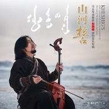
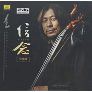
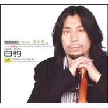
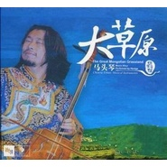
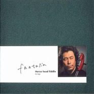

贺西格
============================

|  |  |
| :--: | :-- |
| [ 贺西格](https://i.xiami.com/hxgmtq) | **播放数**: 9748054 **粉丝数**: 7131 **评论数**: 218 **地区**: China 中国大陆 **风格**: 中国民乐 Chinese Folk Music, 新世纪音乐 New Age  |

## 档案

贺西格，蒙古族马头琴演奏家。

## 专辑

| 名称 | 语种 | 唱片公司 | 发行时间 | 专辑类别 | 专辑风格 |
| :--: | :-- | :-- | :-- | :-- | :-- |
| [ 山河誓贺西格马头琴](./albums/2104879385.md) | 纯音乐 | 太平洋影音 | 2019年05月20日 | 录音室专辑 | 新世纪音乐 New Age, 蒙古 | 呼麦 Throat Singing |
| [ 信念马头琴音乐专辑](./albums/346158.md) | 其他 | 中唱深圳 | 2016年09月17日 | 录音室专辑 | 新世纪音乐 New Age, 中国民乐 Chinese Folk Music, 器乐独奏 Solo Instrumental |
| [ 永恒的马头琴](./albums/65994288.md) | 其他 | 时代天韵 | 2012年12月29日 | 录音室专辑 | 中国民乐 Chinese Folk Music |
| [ 白驹马头琴](./albums/340648.md) | 其他 | 中唱深圳 | 2009年07月01日 | 录音室专辑 | 中国民乐 Chinese Folk Music |
| [ 大草原](./albums/404142.md) | 其他 | 千思唱片 | 2005年06月01日 | 录音室专辑 |  |
| [ 归来的马](./albums/1480.md) | 其他 | 中国唱片 | 2005年01月01日 | 录音室专辑 | 中国民乐 Chinese Folk Music |

## 评论

|  |  |  |  |
| :-- | :-- | :-- | :-- |
|  [虾米用户](https://emumo.xiami.com/u/414467875)  2020-08-23 16:44 赞(0) 踩(0) | 
简直听出耳油
 |
|  [虾米用户](https://emumo.xiami.com/u/145560328) 音乐，她是灵魂的交集、心... 2020-08-14 23:03 赞(0) 踩(0) | 
真的确实可以！传统音乐要大力推广、发扬光大！ 音乐是心灵的奔放与人生的沉淀。     
 |
|  [虾米用户](https://emumo.xiami.com/u/410304984)  2020-05-30 19:34 赞(0) 踩(0) | 
❤️❤️
 |
|  [虾米用户](https://emumo.xiami.com/u/270513741)  2020-05-15 21:10 赞(0) 踩(0) | 
一直陶醉在大师的马头琴音乐的旋律里！美醉了！谢谢！
 |
|  [虾米用户](https://emumo.xiami.com/u/410304984)  2020-04-20 22:48 赞(2) 踩(0) | 
非常喜欢马头琴。正在学习中。
 |
|  [虾米用户](https://emumo.xiami.com/u/66823378)  2020-03-29 01:41 赞(0) 踩(0) | 

 |
|  [虾米用户](https://emumo.xiami.com/u/73740960)  2020-02-29 12:31 赞(0) 踩(0) | 

 |
|  [虾米用户](https://emumo.xiami.com/u/317709756) 其实我有好多话想说，可是... 2020-01-28 00:24 赞(0) 踩(0) | 
谁能帮我找到贺西格老师的阿萨拉额吉的曲谱啊……谢谢啊
 |
|  [虾米用户](https://emumo.xiami.com/u/5877617)  2019-11-11 20:00 赞(1) 踩(0) | 
沉迷于马头琴
 |
|  [虾米用户](https://emumo.xiami.com/u/49884432) 那是前世的我 2019-09-06 01:48 赞(2) 踩(0) | 
突然发现一个宝藏大叔，百度了一下，居然我们赤峰人！！！
 |
|  [虾米用户](https://emumo.xiami.com/u/50748121)  尽人事  听天命 2019-07-22 17:18 赞(1) 踩(0) | 
闻到了雨后的草香，看到了天边的彩虹，听到了哈琳遥远的歌声
 |
|  [虾米用户](https://emumo.xiami.com/u/346165752)  2019-05-05 19:52 赞(1) 踩(0) | 

 |
|  [虾米用户](https://emumo.xiami.com/u/50173456)  2019-04-30 00:43 赞(2) 踩(0) | 
贺西格先生正在用时光打磨新作吗？
 |
|  [虾米用户](https://emumo.xiami.com/u/140557702)  2019-04-29 00:20 赞(1) 踩(0) | 
每次听到马头琴的声音我的心都会为之一振，特别喜欢马头琴，好想有一把音质好点的马头琴跟一位指导老师…我也想像你一样能拉出这么悠扬美妙的曲子 
 |
|  [虾米用户](https://emumo.xiami.com/u/339160179)  2019-04-02 18:51 赞(4) 踩(0) | 
2个月的宝宝超级喜欢听，听的时候还会发出一些呼应的声音 
 |
|  [虾米用户](https://emumo.xiami.com/u/1202686)  2019-03-20 00:25 赞(2) 踩(0) | 
好的音乐，无需言语，不会过时。
 |
|  [虾米用户](https://emumo.xiami.com/u/330388792) 在意歌词都是因为心情 2019-03-10 20:43 赞(3) 踩(0) | 
天上来的声音！
 |
|  [虾米用户](https://emumo.xiami.com/u/50173456)  2019-02-23 01:15 赞(2) 踩(0) | 
何时出新作？
 |
|  [虾米用户](https://emumo.xiami.com/u/412435368)  2019-02-02 00:28 赞(1) 踩(0) | 
-久久不能忘怀
 |
|  [虾米用户](https://emumo.xiami.com/u/404345604)  2018-12-17 22:01 赞(2) 踩(0) | 
马头琴本来只是一种乐器，自从有了贺西格，齐.宝力高等等这些艺术家，马头琴就有了魂了！
 |
|  [虾米用户](https://emumo.xiami.com/u/410304984)  2018-12-11 09:40 赞(2) 踩(0) | 
太好了 终于找到可以听很多民间马头琴曲子的渠道了！
 |
|  [虾米用户](https://emumo.xiami.com/u/2367065)  2018-12-06 14:07 赞(1) 踩(0) | 
喜欢你的乐曲！
 |
|  [虾米用户](https://emumo.xiami.com/u/330900828) 高舉一面五星紅旗在蝦米！ 2018-11-16 10:11 赞(2) 踩(0) | 
龙飞凤舞  
 |
|  [虾米用户](https://emumo.xiami.com/u/17584208)  2018-11-04 09:37 赞(3) 踩(0) | 
心的诉说
 |
|  [虾米用户](https://emumo.xiami.com/u/2491956) 我还没想好要写什么... 2018-10-23 16:57 赞(1) 踩(0) | 
贺西格:感谢你收藏我的作品《风中的苏鲁德》，我在虾米音乐人期待你的关注。——贺老师太客气了，您的音乐非常牛逼
 |
|  [虾米用户](https://emumo.xiami.com/u/254720160)  2018-09-08 22:16 赞(1) 踩(0) | 
很好优秀的艺术家！支持！音乐是最好的灵魂！！  
 |
|  [虾米用户](https://emumo.xiami.com/u/354939751) 留住青春的美好献给美好的... 2018-09-04 06:19 赞(0) 踩(0) | 
纯老乡，都是红山文化孕育的美好！在异国他乡想家就望着繁星明月听贺西格拉响的马头琴声
 |
|  [虾米用户](https://emumo.xiami.com/u/346087991) 医路漫漫 音乐为伴 2018-08-27 22:01 赞(0) 踩(0) | 
为什么你的琴声这么抓人？
 |
| ⇒ |  [虾米用户](https://emumo.xiami.com/u/277583981) 顺境时照顾别人，逆境时照... 2018-11-28 11:06 赞(0) 踩(0) | 
叙事太强
 |
|  [虾米用户](https://emumo.xiami.com/u/341086760)  2018-06-23 12:15 赞(1) 踩(0) | 
这个声音听着让人莫名的感动
 |
|  [虾米用户](https://emumo.xiami.com/u/50173456)  2018-05-29 22:05 赞(1) 踩(0) | 
贺西格，又快两年了，何时出新作？
 |
|  [虾米用户](https://emumo.xiami.com/u/5555764) 阿Ken 2018-05-19 22:21 赞(4) 踩(0) | 
不得不说贺大师让我对马头琴的认识又上一高度
 |
|  [虾米用户](https://emumo.xiami.com/u/10738333)  2018-05-16 14:50 赞(0) 踩(0) | 
俺是您的忠实粉丝
 |
|  [虾米用户](https://emumo.xiami.com/u/220915462)  2018-04-25 08:04 赞(0) 踩(0) | 
找到了
 |
|  [虾米用户](https://emumo.xiami.com/u/9952743) yoyo 2018-04-13 21:17 赞(0) 踩(0) | 
确实大师风范
 |
|  [虾米用户](https://emumo.xiami.com/u/337908156)  2018-03-14 19:00 赞(0) 踩(0) | 
《传奇》《乡愁》最好听。
 |
|  [虾米用户](https://emumo.xiami.com/u/337908156)  2018-02-22 20:51 赞(1) 踩(0) | 
最爱你的《传奇》，百听不厌。
 |
|  [虾米用户](https://emumo.xiami.com/u/333814027) 逆流而上的清流 2017-12-19 18:11 赞(0) 踩(0) | 
赞赞赞
 |
|  [虾米用户](https://emumo.xiami.com/u/8472460)  2017-12-19 10:23 赞(0) 踩(0) | 
  
 |
|  [虾米用户](https://emumo.xiami.com/u/276944698) 不要自我设限..... 2017-11-27 21:11 赞(0) 踩(0) | 

 |
|  [虾米用户](https://emumo.xiami.com/u/326541329)  2017-10-01 21:08 赞(0) 踩(0) | 
音乐神
 |
|  [虾米用户](https://emumo.xiami.com/u/197985627) 什么都不要，只要自由 2017-08-04 23:35 赞(4) 踩(0) | 
自由不是唱出来的，不是写出来的，是心散发出来的
 |
|  [虾米用户](https://emumo.xiami.com/u/9177558)  2017-07-13 01:45 赞(1) 踩(0) | 
Chinese Folk Music,  Mongolian Traditional Music
 |
|  [虾米用户](https://emumo.xiami.com/u/253882584) 上进心！ 2017-06-20 07:16 赞(18) 踩(0) | 
身在内蒙古长大的汉人，那蒙汉就是一家人！蒙古族人好！
 |
|  [虾米用户](https://emumo.xiami.com/u/9080939) 不为无益之事，何遣有涯之... 2017-06-19 22:04 赞(2) 踩(0) | 
贺西格，摇篮曲
 |
| ⇒ |  [虾米用户](https://emumo.xiami.com/u/9080939) 不为无益之事，何遣有涯之... 2018-02-05 22:03 赞(0) 踩(0) | 
森吉德玛
 |
|  [虾米用户](https://emumo.xiami.com/u/258992467)  2017-06-15 18:12 赞(0) 踩(0) | 
好听
 |
|  [虾米用户](https://emumo.xiami.com/u/83811112) 无处不离痕 2017-05-19 17:18 赞(2) 踩(0) | 
贺西格的音乐已经具有代表性有了自己的符号，可能提起马头琴第一个想到的就是他
 |
|  [虾米用户](https://emumo.xiami.com/u/263950776)  2017-05-01 12:32 赞(0) 踩(0) | 
心声悠然&amp;hellip;&amp;hellip;
 |
|  [虾米用户](https://emumo.xiami.com/u/291380695)   2017-04-27 22:33 赞(0) 踩(0) | 
好好听   
 |
|  [虾米用户](https://emumo.xiami.com/u/288716996)  2017-04-15 16:06 赞(3) 踩(0) | 
第一次从老师手机听到他的乡愁我就喜欢上了 我准备用他的歌来跳组合 然后高考 加油 
 |
|  [虾米用户](https://emumo.xiami.com/u/175838220)  2017-03-13 23:52 赞(0) 踩(0) | 
《乡愁》入坑~（之前打错了）
 |
|  [虾米用户](https://emumo.xiami.com/u/50173456)  2017-03-07 12:11 赞(3) 踩(0) | 
何时可以现场聆听贺西格
 |
|  [虾米用户](https://emumo.xiami.com/u/745924) 放开自己~自由飞翔~ 2017-02-20 15:06 赞(0) 踩(0) | 
很好听的马头琴！
 |
|  [虾米用户](https://emumo.xiami.com/u/261059400)  2017-01-11 19:32 赞(0) 踩(0) | 
rll0
 |
|  [虾米用户](https://emumo.xiami.com/u/261059400)  2017-01-11 19:30 赞(0) 踩(0) | 
rll0
 |
|  [虾米用户](https://emumo.xiami.com/u/261059400)  2017-01-11 19:30 赞(0) 踩(0) | 
rll0
 |
|  [虾米用户](https://emumo.xiami.com/u/72666568)  2017-01-04 12:05 赞(0) 踩(0) | 
琴
 |
|  [虾米用户](https://emumo.xiami.com/u/257156933) veniaminkrem 2017-01-01 22:27 赞(0) 踩(0) | 
rll0
 |
|  [虾米用户](https://emumo.xiami.com/u/257156933) veniaminkrem 2017-01-01 22:27 赞(0) 踩(0) | 
rll0
 |
|  [虾米用户](https://emumo.xiami.com/u/257156933) veniaminkrem 2017-01-01 22:24 赞(0) 踩(0) | 
rll0
 |
|  [虾米用户](https://emumo.xiami.com/u/257156933) veniaminkrem 2017-01-01 22:22 赞(0) 踩(0) | 
rll00
 |
|  [虾米用户](https://emumo.xiami.com/u/257156933) veniaminkrem 2017-01-01 22:22 赞(0) 踩(0) | 
rll00
 |
|  [虾米用户](https://emumo.xiami.com/u/52413592) 也许有一天我们会意外的相... 2016-12-15 23:57 赞(0) 踩(0) | 
久违的声音能让我悲伤平静
 |
|  [虾米用户](https://emumo.xiami.com/u/213626376) 在校/科尔沁人 2016-12-14 17:38 赞(0) 踩(0) | 
之所以加很多其他乐器是为了受众更广
 |
|  [虾米用户](https://emumo.xiami.com/u/7167993)  2016-10-21 10:39 赞(0) 踩(0) | 
喜欢悠长
 |
|  [虾米用户](https://emumo.xiami.com/u/10117715)  2016-08-14 01:58 赞(0) 踩(0) | 
纯粹动心的音韵
 |
|  [虾米用户](https://emumo.xiami.com/u/128592656)  2016-07-07 22:25 赞(0) 踩(0) | 
摇篮曲第一次听，在脑海久久不能忘怀，然后就成了我的手机铃声
 |
|  [虾米用户](https://emumo.xiami.com/u/38801880)   2016-06-23 06:54 赞(0) 踩(0) | 
O(∩_∩)O
 |
|  [虾米用户](https://emumo.xiami.com/u/2526606)  2016-04-25 09:51 赞(0) 踩(0) | 
~~
 |
|  [虾米用户](https://emumo.xiami.com/u/50173456)  2015-11-03 21:28 赞(3) 踩(0) | 
蒙古族为何驰骋了一个多世纪'听听蒙族的音乐似乎明白了许多'作为现代音乐家'结合很多元素在民族音乐里'这种现代与古典相结合的东西'贺西格先生是做的比较好的'琴声响起时'心无杂念'悠扬的琴声带着耳朵飞回那朝思暮想的地方
 |
|  [虾米用户](https://emumo.xiami.com/u/36081194) 酷狗音乐，一个有老歌的地... 2015-11-02 01:30 赞(3) 踩(0) | 
喜欢
 |
|  [虾米用户](https://emumo.xiami.com/u/12983562)  2015-08-25 14:05 赞(0) 踩(0) | 
悠扬的乐曲  喜欢
 |
|  [虾米用户](https://emumo.xiami.com/u/13180134) 敲丫挺的 2015-07-15 13:20 赞(0) 踩(0) | 
要哭啦T^T
 |
|  [虾米用户](https://emumo.xiami.com/u/12876004) ` 2015-06-07 09:05 赞(0) 踩(0) | 
~~
 |
|  [虾米用户](https://emumo.xiami.com/u/36047819) 但从相见便相知，相见何如... 2015-05-20 18:16 赞(2) 踩(0) | 
醉了，优美美妙的天籁之音，仿佛使人融化在了碧蓝蓝的天空里…
 |
|  [虾米用户](https://emumo.xiami.com/u/8308693) 或许某一天一把琴两亩地 2015-05-13 13:37 赞(1) 踩(0) | 
他的琴声很让人走心，一听就迷上了。
 |
|  [虾米用户](https://emumo.xiami.com/u/3149830)  2015-05-12 19:56 赞(2) 踩(0) | 
听了好多年，贺西格
 |
|  [虾米用户](https://emumo.xiami.com/u/17762090)  2015-01-25 23:26 赞(0) 踩(0) | 
1
 |
|  [虾米用户](https://emumo.xiami.com/u/2106005)  2015-01-05 22:01 赞(0) 踩(0) | 
.
 |
|  [虾米用户](https://emumo.xiami.com/u/5657731) 在音乐面前语言很苍白 2015-01-02 11:54 赞(15) 踩(0) | 
语言已经多余
 |
|  [虾米用户](https://emumo.xiami.com/u/37980879)  2014-12-27 09:56 赞(0) 踩(0) | 
1
 |
|  [虾米用户](https://emumo.xiami.com/u/10850905) 音乐是为了更好的活着！ 2014-12-09 10:49 赞(0) 踩(0) | 
好听！
 |
|  [虾米用户](https://emumo.xiami.com/u/8138687) 我还没想好要写什么... 2014-12-03 20:41 赞(0) 踩(0) | 
非常的喜欢01摇篮曲
 |
|  [虾米用户](https://emumo.xiami.com/u/323335) 成年人&年轻人 2014-10-17 23:53 赞(2) 踩(0) | 
加东西太多！！！！！！
 |
|  [虾米用户](https://emumo.xiami.com/u/13552)  2014-10-08 10:38 赞(1) 踩(0) | 
摇篮曲、黑小伙、万丽姑娘、归来的马
 |
|  [虾米用户](https://emumo.xiami.com/u/1477810) 阿伏加德罗常数 2014-08-06 11:18 赞(3) 踩(0) | 
配乐太复杂了。就要纯纯的琴声。
 |
|  [虾米用户](https://emumo.xiami.com/u/7865222)  2014-07-06 10:03 赞(0) 踩(0) | 
我要拜师学拉马头琴
 |
|  [虾米用户](https://emumo.xiami.com/u/5649507)  2014-06-12 11:23 赞(0) 踩(0) | 
爱他这琴丝中淡淡的忧伤
 |
|  [虾米用户](https://emumo.xiami.com/u/10623296) jintheupset 2014-06-02 04:27 赞(1) 踩(0) | 
曲是好曲，加了太多多余的东西
 |
|  [虾米用户](https://emumo.xiami.com/u/10484379) 一花一世界 2014-04-23 14:28 赞(0) 踩(0) | 
太享受了 简直
 |
|  [虾米用户](https://emumo.xiami.com/u/4264517) 人生短短几十载，做有趣的... 2014-04-19 23:33 赞(0) 踩(0) | 
捏人心魄
 |
|  [虾米用户](https://emumo.xiami.com/u/3352513)  2014-03-31 10:20 赞(0) 踩(0) | 
好听!
 |
|  [虾米用户](https://emumo.xiami.com/u/18915444) 暂无签名~ 2014-03-23 21:10 赞(0) 踩(0) | 
nice
 |
|  [虾米用户](https://emumo.xiami.com/u/779540)  2014-03-21 23:50 赞(0) 踩(0) | 
哎。。。这首摇篮曲太好听，听了我好多好多好多遍
 |
|  [虾米用户](https://emumo.xiami.com/u/8080327) 有什么比叹息更畅怀 2014-02-26 22:52 赞(0) 踩(0) | 
genius
 |
|  [虾米用户](https://emumo.xiami.com/u/310309) 我观我自在 2014-02-19 09:37 赞(0) 踩(0) | 
马头琴
 |
|  [虾米用户](https://emumo.xiami.com/u/11153588) 暂无签名~ 2014-02-13 10:05 赞(0) 踩(0) | 
收藏一下
 |
|  [虾米用户](https://emumo.xiami.com/u/3467580)  2014-01-22 10:18 赞(0) 踩(0) | 
太棒了    赤峰人的骄傲    支持
 |
|  [虾米用户](https://emumo.xiami.com/u/138540)  2014-01-14 20:18 赞(0) 踩(0) | 
多年前听过，回头再听依然感慨怎会如此美妙。
 |
|  [虾米用户](https://emumo.xiami.com/u/10223494) 再见了。 2014-01-02 19:48 赞(3) 踩(0) | 
太特么好听了！一脸泪水！！
 |
|  [虾米用户](https://emumo.xiami.com/u/9730064) 纯音党 2013-12-28 22:50 赞(0) 踩(0) | 
不错！来 赞一个！
 |
|  [虾米用户](https://emumo.xiami.com/u/18773012) 卫道东升 2013-12-13 20:18 赞(0) 踩(0) | 
非常喜欢
 |
|  [虾米用户](https://emumo.xiami.com/u/9138832)  2013-12-13 14:21 赞(0) 踩(0) | 
ok
 |
|  [虾米用户](https://emumo.xiami.com/u/5604569)  2013-10-13 22:03 赞(0) 踩(0) | 
ooo
 |
|  [虾米用户](https://emumo.xiami.com/u/15474157) 你是人间四月天~ 2013-10-01 10:13 赞(0) 踩(0) | 
悠扬，豪放
 |
|  [虾米用户](https://emumo.xiami.com/u/5790217)  2013-09-19 11:16 赞(1) 踩(0) | 
术业有专人自学成才的,对爱好有执着感的 专家
 |
|  [虾米用户](https://emumo.xiami.com/u/7511264)  2013-09-04 18:01 赞(1) 踩(0) | 
天边的旋律最为悠扬......
 |
|  [虾米用户](https://emumo.xiami.com/u/1178281)  2013-08-31 11:10 赞(0) 踩(0) | 
民族音乐
 |
|  [虾米用户](https://emumo.xiami.com/u/18422326)  2013-08-02 23:22 赞(0) 踩(0) | 
喜欢
 |
|  [虾米用户](https://emumo.xiami.com/u/16465133)  2013-06-27 20:29 赞(0) 踩(0) | 
马头琴
 |
|  [虾米用户](https://emumo.xiami.com/u/6975121) 音乐无极限 2013-06-02 22:41 赞(0) 踩(0) | 
蒙古马头琴
 |
|  [虾米用户](https://emumo.xiami.com/u/8065936)  2013-05-23 23:56 赞(0) 踩(0) | 
草原情结
 |
|  [虾米用户](https://emumo.xiami.com/u/13922326)  2013-04-11 22:34 赞(0) 踩(0) | 
收了！
 |
|  [虾米用户](https://emumo.xiami.com/u/13690867)  2013-04-04 13:32 赞(19) 踩(0) | 
如诉如泣的马头琴声，让我在辽阔无边的草原上流连忘返。
 |
|  [虾米用户](https://emumo.xiami.com/u/6220657)  2013-03-16 15:18 赞(0) 踩(0) | 
喜欢蒙古音乐, 蒙古族民歌.
 |
|  [虾米用户](https://emumo.xiami.com/u/8028706)  2013-02-19 11:48 赞(0) 踩(0) | 
因为喜欢蒙古音尔，所以收藏
 |
|  [虾米用户](https://emumo.xiami.com/u/13007271)  2013-02-17 21:37 赞(0) 踩(0) | 
血液里的声音
 |
|  [虾米用户](https://emumo.xiami.com/u/1724079) 我是个疯子，快乐的疯子 2013-02-16 11:09 赞(0) 踩(0) | 
收了。大爱马头琴&amp;gt;n&amp;lt;
 |
|  [虾米用户](https://emumo.xiami.com/u/10208525) 音乐是一味良药 2013-02-03 17:05 赞(0) 踩(0) | 
我终于找到了mother和乡愁  音乐就是要打动人心
 |
|  [虾米用户](https://emumo.xiami.com/u/8667582)   2013-01-25 13:12 赞(0) 踩(0) | 
没有理由的喜欢
 |
|  [虾米用户](https://emumo.xiami.com/u/12115933) 捆驴 2013-01-15 19:27 赞(0) 踩(0) | 
奔跑
 |
|  [虾米用户](https://emumo.xiami.com/u/478527) 好想跟衣服在洗衣机里滚 2012-12-25 22:50 赞(0) 踩(0) | 
最新的专辑12月29号发售，<a href="http://blog.sina.com.cn/baohexige" target="_blank" rel="nofollow noreferrer noopener">http://blog.sina.com.cn/baohexige</a>
 |
|  [虾米用户](https://emumo.xiami.com/u/2589737)  2012-12-25 18:05 赞(0) 踩(0) | 
好听
 |
|  [虾米用户](https://emumo.xiami.com/u/6586012) {只有启程，才能到达} 2012-12-23 12:49 赞(1) 踩(0) | 
纯净 极致 毫无杂质
 |
|  [虾米用户](https://emumo.xiami.com/u/11891522)  2012-12-14 01:19 赞(0) 踩(0) | 
喜欢没有原因
 |
|  [虾米用户](https://emumo.xiami.com/u/334569)  2012-12-05 14:46 赞(0) 踩(0) | 
··
 |
|  [虾米用户](https://emumo.xiami.com/u/334569)  2012-12-05 14:34 赞(0) 踩(0) | 
他是我的偶像！！！！！
 |
| ⇒ |  [虾米用户](https://emumo.xiami.com/u/254677977) 我还没想好要写什么... 2017-05-13 14:01 赞(0) 踩(0) | 
同
 |
|  [虾米用户](https://emumo.xiami.com/u/11786738)  2012-12-04 18:14 赞(0) 踩(0) | 
001
 |
|  [虾米用户](https://emumo.xiami.com/u/894689)  2012-12-04 14:11 赞(0) 踩(0) | 
有点不一样。
 |
|  [虾米用户](https://emumo.xiami.com/u/9634469) 哦，虾米 2012-11-25 18:14 赞(1) 踩(0) | 
悠远空阔又婉转，只有静下来慢慢的品，才能尝出味道
 |
|  [虾米用户](https://emumo.xiami.com/u/11611686)  2012-11-23 18:29 赞(1) 踩(0) | 
真诚的音乐，可以打动每个人，你可以不是蒙古族，你可以没来自草原，但...那种莫名的感动是来自热爱音乐的大师所带给我们的。
 |
|  [虾米用户](https://emumo.xiami.com/u/10472936)  2012-11-18 21:18 赞(0) 踩(0) | 
太美妙~~
 |
|  [虾米用户](https://emumo.xiami.com/u/10435106) 听靓歌 2012-11-08 21:34 赞(0) 踩(0) | 
喜欢。
 |
|  [虾米用户](https://emumo.xiami.com/u/5939577) 我还没想好要写什么... 2012-11-01 12:51 赞(0) 踩(0) | 
非常喜欢黑小伙~~~足够的，足够的以最温柔的声音宣泄浮躁的内心
 |
|  [虾米用户](https://emumo.xiami.com/u/8112199)  2012-10-28 23:21 赞(0) 踩(0) | 
马头琴悠扬
 |
|  [虾米用户](https://emumo.xiami.com/u/8112199)  2012-10-28 23:20 赞(0) 踩(0) | 
马头琴悠扬
 |
|  [虾米用户](https://emumo.xiami.com/u/11096332)  2012-10-20 13:21 赞(0) 踩(0) | 
我想起了呼伦贝尔大草原，想起了与蒙古族小伙畅饮，想起了草原上飞奔的骏马，想起了，想起了。。。。。
 |
|  [虾米用户](https://emumo.xiami.com/u/9856339) kyr 2012-10-18 09:02 赞(0) 踩(0) | 
优秀的乐曲，一听就能抓住人的心。
 |
|  [虾米用户](https://emumo.xiami.com/u/6114899)  2012-10-16 14:46 赞(0) 踩(0) | 
马头琴~~
 |
|  [虾米用户](https://emumo.xiami.com/u/630760) 感谢11年来的陪伴，我爱... 2012-09-25 12:27 赞(0) 踩(0) | 
千言万语都在琴声里，好喜欢
 |
|  [虾米用户](https://emumo.xiami.com/u/6744967) 音乐无国界，你爱我也爱。 2012-09-24 01:05 赞(0) 踩(0) | 
喜欢 谢谢
 |
|  [虾米用户](https://emumo.xiami.com/u/10235103) ~音乐有种魔力。 2012-09-11 10:10 赞(0) 踩(0) | 
：）
 |
|  [虾米用户](https://emumo.xiami.com/u/10444780) 娜 2012-09-07 00:37 赞(0) 踩(0) | 
喜欢
 |
|  [虾米用户](https://emumo.xiami.com/u/10461402)  2012-09-02 20:28 赞(0) 踩(0) | 
gdfgfg
 |
|  [虾米用户](https://emumo.xiami.com/u/645218) 任性逍遥于有欲无欲之间 2012-08-22 12:03 赞(0) 踩(0) | 
喜欢这个调调
 |
|  [虾米用户](https://emumo.xiami.com/u/1045922)  2012-08-18 23:47 赞(0) 踩(0) | 
民族的魂  怎么听 都会觉的这就是家！！！
 |
|  [虾米用户](https://emumo.xiami.com/u/10146451)  2012-08-12 17:01 赞(0) 踩(0) | 
收藏
 |
|  [虾米用户](https://emumo.xiami.com/u/3510038) 海天之恋 2012-07-23 11:52 赞(0) 踩(0) | 
马头琴好美啊  蒙古人民雄起啊
 |
|  [虾米用户](https://emumo.xiami.com/u/9482636)  2012-07-06 23:04 赞(0) 踩(0) | 
草原天籁。
 |
|  [虾米用户](https://emumo.xiami.com/u/8046895)  2012-06-24 23:03 赞(1) 踩(0) | 
我能看见曲中的荒凉的沙漠 冰封的草原 遥远的天边
 |
|  [虾米用户](https://emumo.xiami.com/u/1179673)  2012-06-19 20:18 赞(0) 踩(0) | 
草原情
 |
|  [虾米用户](https://emumo.xiami.com/u/1188585)  2012-06-04 18:44 赞(0) 踩(0) | 
马头琴
 |
|  [虾米用户](https://emumo.xiami.com/u/4909747)  2012-05-13 15:53 赞(0) 踩(0) | 
喜欢的音乐演奏家
 |
|  [虾米用户](https://emumo.xiami.com/u/8018643)  2012-05-04 18:06 赞(0) 踩(0) | 
べ_べ
 |
|  [虾米用户](https://emumo.xiami.com/u/3330714) nono 2012-05-03 18:55 赞(0) 踩(0) | 
从朋友那里听来的。以杨柳最好。
 |
|  [虾米用户](https://emumo.xiami.com/u/4306998)  2012-05-01 00:49 赞(36) 踩(0) | 
很多年了，因为浮躁没有真正的听贺西格，所以一直只喜欢他的《摇篮曲》。直到现在才发现原来他不仅仅只有《摇篮曲》。
 |
| ⇒ |  [虾米用户](https://emumo.xiami.com/u/2280317) 地中有山，永远 2012-09-10 23:11 赞(0) 踩(0) | 
摇篮曲真是太美了！马头琴一想起，便觉得荡气回肠，胸腔共鸣，心怀大草原。。。
 |
| ⇒ |  [虾米用户](https://emumo.xiami.com/u/4306998)  2012-09-11 17:58 赞(0) 踩(0) | 
<q><b>Applee说：</b></q>
 |
| ⇒ |  [虾米用户](https://emumo.xiami.com/u/2280317) 地中有山，永远 2012-09-12 15:56 赞(0) 踩(0) | 
<q><b>勥氼说：</b></q>
 |
| ⇒ |  [虾米用户](https://emumo.xiami.com/u/2280317) 地中有山，永远 2012-09-12 19:18 赞(0) 踩(0) | 
<q><b>勥氼说：</b></q>
 |
| ⇒ |  [虾米用户](https://emumo.xiami.com/u/4306998)  2012-09-13 11:14 赞(0) 踩(0) | 
<q><b>Applee说：</b></q>
 |
| ⇒ |  [虾米用户](https://emumo.xiami.com/u/37718689)  2017-08-30 23:03 赞(0) 踩(0) | 
心里震颤
 |
| ⇒ |  [虾米用户](https://emumo.xiami.com/u/311426919)  2017-10-19 10:54 赞(0) 踩(0) | 
我一大早听到现在，以前对草原音乐不痛不痒，直到今天早上
 |
| ⇒ |  [虾米用户](https://emumo.xiami.com/u/311426919)  2017-10-19 10:57 赞(0) 踩(0) | 
我差不多也是喜新厌旧很快，浮躁，但真正打动的还是会驻足很久呢……
 |
|  [虾米用户](https://emumo.xiami.com/u/8761419) shengCn 2012-04-19 18:02 赞(0) 踩(0) | 
4-19/12 no Voice ?
 |
|  [虾米用户](https://emumo.xiami.com/u/283897)  2012-04-18 22:00 赞(1) 踩(0) | 
我的琴声呜咽 泪水全无。。。。。
 |
|  [虾米用户](https://emumo.xiami.com/u/8811726)  2012-04-10 10:32 赞(0) 踩(0) | 
好听
 |
|  [虾米用户](https://emumo.xiami.com/u/3504841) 好吃懒做，听听音乐懒散的 2012-04-05 13:07 赞(0) 踩(0) | 
蒙古的悠扬~
 |
|  [虾米用户](https://emumo.xiami.com/u/1309136)  2012-04-03 16:34 赞(0) 踩(0) | 
不错啊
 |
|  [虾米用户](https://emumo.xiami.com/u/8267666)  2012-04-01 22:36 赞(0) 踩(0) | 
马头琴的歌声  魂
 |
|  [虾米用户](https://emumo.xiami.com/u/8671674)  2012-03-31 11:32 赞(0) 踩(0) | 
天籁之音
 |
|  [虾米用户](https://emumo.xiami.com/u/6159640)  2012-03-27 04:45 赞(0) 踩(0) | 
好听。
 |
|  [虾米用户](https://emumo.xiami.com/u/8092851)  2012-03-26 12:46 赞(0) 踩(0) | 
有天籁之感
 |
|  [虾米用户](https://emumo.xiami.com/u/8554108)  2012-03-23 16:16 赞(0) 踩(0) | 
好听的马头琴
 |
|  [虾米用户](https://emumo.xiami.com/u/3665237)  2012-03-16 19:47 赞(0) 踩(0) | 
收藏贺西格
 |
|  [虾米用户](https://emumo.xiami.com/u/5097750) 没有什么要说 2012-03-14 10:58 赞(0) 踩(0) | 
马头琴
 |
|  [虾米用户](https://emumo.xiami.com/u/7594389)  2012-03-10 22:04 赞(0) 踩(0) | 
梦中的呼伦贝尔啊~~
 |
|  [虾米用户](https://emumo.xiami.com/u/164459)  2012-03-08 04:18 赞(1) 踩(0) | 
悠扬的马头琴，带我回到那片辽阔的草地，蔚蓝的天空
 |
|  [虾米用户](https://emumo.xiami.com/u/1639508)  2012-02-29 17:56 赞(0) 踩(0) | 
唉..马头琴
 |
|  [虾米用户](https://emumo.xiami.com/u/8063712)  2012-02-16 17:45 赞(0) 踩(0) | 
太喜欢他的音乐了。
 |
|  [虾米用户](https://emumo.xiami.com/u/4043410) 唯夜色浪漫 2012-02-04 11:59 赞(0) 踩(0) | 
马头琴其独特的音色，历年来都是本人的喜爱。
 |
|  [虾米用户](https://emumo.xiami.com/u/2760270)  2012-01-14 20:19 赞(0) 踩(0) | 
悠远 空灵 自由
 |
|  [虾米用户](https://emumo.xiami.com/u/3915525)  2012-01-14 16:54 赞(0) 踩(0) | 
马头琴在他手中的极致演绎
 |
|  [虾米用户](https://emumo.xiami.com/u/7199526) 暂无签名~ 2011-12-12 15:15 赞(0) 踩(0) | 
老师！
 |
|  [虾米用户](https://emumo.xiami.com/u/6712592)  2011-12-09 16:41 赞(0) 踩(0) | 
special
 |
|  [虾米用户](https://emumo.xiami.com/u/2538829)  2011-12-05 01:14 赞(0) 踩(0) | 
很美~    听多了不会让你脑袋疼~~
 |
|  [虾米用户](https://emumo.xiami.com/u/5837976)   2011-11-03 12:53 赞(0) 踩(0) | 
老师
 |
|  [虾米用户](https://emumo.xiami.com/u/3312058)  2011-11-03 12:02 赞(0) 踩(0) | 
最爱
 |
|  [虾米用户](https://emumo.xiami.com/u/6456742)  2011-10-27 13:32 赞(0) 踩(0) | 
喜欢他的音乐
 |
|  [虾米用户](https://emumo.xiami.com/u/6447116)  2011-10-26 20:30 赞(0) 踩(0) | 
下载烦死了。
 |
| ⇒ |  [虾米用户](https://emumo.xiami.com/u/1938054) 明月在苏州 2011-12-23 23:46 赞(0) 踩(0) | 
哈哈
 |
|  [虾米用户](https://emumo.xiami.com/u/5746160)   2011-10-20 13:14 赞(0) 踩(0) | 
陶醉
 |
|  [虾米用户](https://emumo.xiami.com/u/4713221)  2011-10-15 18:42 赞(0) 踩(0) | 
美！美！美！！！
 |
|  [虾米用户](https://emumo.xiami.com/u/1549599) 天地与我共生，万物与我为 2011-10-12 00:11 赞(0) 踩(0) | 
醉了
 |
|  [虾米用户](https://emumo.xiami.com/u/6034341)  2011-10-08 23:47 赞(0) 踩(0) | 
经典的《归来的马》专辑
 |
|  [虾米用户](https://emumo.xiami.com/u/6061268) 青丝柳黛流光舞，玉人如画... 2011-10-08 20:23 赞(0) 踩(0) | 
那支永远深情的马头琴。。。
 |
|  [虾米用户](https://emumo.xiami.com/u/5739973)  2011-09-08 13:06 赞(0) 踩(0) | 
悠扬，传唱·~
 |
|  [虾米用户](https://emumo.xiami.com/u/5737072)  2011-09-07 14:45 赞(0) 踩(0) | 
最棒的乐曲
 |
|  [虾米用户](https://emumo.xiami.com/u/2101199)  2011-08-04 22:35 赞(0) 踩(0) | 
ok
 |
|  [虾米用户](https://emumo.xiami.com/u/5023929) 喵呜~ 2011-08-02 21:24 赞(0) 踩(0) | 
草原
 |
|  [虾米用户](https://emumo.xiami.com/u/3818865)  2011-07-04 00:44 赞(0) 踩(0) | 
极品马头琴，醉爱
 |
|  [虾米用户](https://emumo.xiami.com/u/1457616) 合法公民！ 2011-06-25 11:00 赞(0) 踩(0) | 
HRG   HERGE
 |
|  [虾米用户](https://emumo.xiami.com/u/467313)  2011-06-12 08:21 赞(0) 踩(0) | 
大力支持的国产
 |
|  [虾米用户](https://emumo.xiami.com/u/1540126)  2011-03-20 12:47 赞(0) 踩(0) | 
好听的歌
 |
|  [虾米用户](https://emumo.xiami.com/u/3114627)  2011-03-13 15:04 赞(1) 踩(0) | 
很有民族风格的纯音乐，悠扬低沉的马头琴琴声，或激昂或婉转的向你倾诉一段段的往事，向你描绘一幅幅画面，很是耐听！相比齐·宝力高先生，我更喜欢贺西格，特别是《归来的马》这张专辑，几乎每首都是经典，仅此推荐给大家！
 |
|  [虾米用户](https://emumo.xiami.com/u/979453)  2011-03-08 22:24 赞(0) 踩(0) | 
深情啊。。。
 |
|  [虾米用户](https://emumo.xiami.com/u/61297)  2011-03-08 10:51 赞(0) 踩(0) | 
如果你喜欢蒙古族音乐，请不要错过他……
 |
|  [虾米用户](https://emumo.xiami.com/u/2825001) 自得其乐 2011-02-13 13:09 赞(0) 踩(0) | 
喜欢这个调调！
 |
|  [虾米用户](https://emumo.xiami.com/u/1342581)  2011-02-01 10:37 赞(0) 踩(0) | 
贺西格
 |
|  [虾米用户](https://emumo.xiami.com/u/859934)  2011-01-24 20:42 赞(2) 踩(0) | 
枕着马头琴入睡
 |
|  [虾米用户](https://emumo.xiami.com/u/1540499)  2010-11-07 21:57 赞(0) 踩(0) | 
触动内心灵魂的感觉 很空旷 美好啊~
 |
|  [虾米用户](https://emumo.xiami.com/u/11047)  2010-10-30 11:24 赞(0) 踩(0) | 
实在感动。
 |
|  [虾米用户](https://emumo.xiami.com/u/534333)  2010-08-30 16:31 赞(0) 踩(0) | 
特别感动。
 |
|  [虾米用户](https://emumo.xiami.com/u/1052461) @blinK4sy- 2010-07-14 22:56 赞(0) 踩(0) | 
再次感动。
 |
|  [虾米用户](https://emumo.xiami.com/u/285096)  2010-04-29 13:06 赞(0) 踩(0) | 
非常感动
 |
|  [虾米用户](https://emumo.xiami.com/u/7370) Léon 2010-02-24 23:39 赞(1) 踩(0) | 
感动
 |
