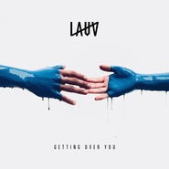

Getting Over You
============================

|  |  |
| :--: | :-- |
| [ Getting Over You](https://emumo.xiami.com/album/2103528276) | **艺人**: [Lauv](../index.md) **语种**: 英语 **唱片公司**: Self-Released **发行时间**: 2018年02月14日 **专辑类别**: EP, 单曲 **专辑风格**:  **播放数**: 14568 **收藏数**: 80 **评论数**: 20  |

## 简介

## 曲目

## 评论

|  |  |  |
| :-- | :-- | :-- |
|  [虾米用户](https://emumo.xiami.com/u/21164070) 一沙一世界 一花一天堂 ... 2018-08-09 18:48 赞(0) 踩(0) | 
.
 |
|  [虾米用户](https://emumo.xiami.com/u/30333403) 我还没想好要写什么... 2018-04-22 07:49 赞(1) 踩(0) | 
情人节发布的 现在还没有版权吗 
 |
|  [虾米用户](https://emumo.xiami.com/u/333991135) 把妳甜頭留給我 我也會給... 2018-04-05 15:36 赞(0) 踩(0) | 
听不了？！
 |
|  [虾米用户](https://emumo.xiami.com/u/11787355) 我还没想好要写什么... 2018-03-31 06:23 赞(0) 踩(0) | 
超爱lauv
 |
|  [虾米用户](https://emumo.xiami.com/u/20177386) 感谢一切美好的遇见❤️ 2018-03-29 13:46 赞(0) 踩(0) | 

 |
|  [虾米用户](https://emumo.xiami.com/u/80948492)  2018-03-13 01:06 赞(2) 踩(0) | 
诺基亚？
 |
|  [虾米用户](https://emumo.xiami.com/u/28900461) 就讓無常 如常 2018-03-04 16:24 赞(1) 踩(0) | 
又听不了了？
 |
|  [虾米用户](https://emumo.xiami.com/u/42725114) ThistheshitI... 2018-02-17 01:27 赞(0) 踩(0) | 

 |
|  [虾米用户](https://emumo.xiami.com/u/187620260)  2018-02-16 14:45 赞(0) 踩(0) | 
爱你！
 |
|  [虾米用户](https://emumo.xiami.com/u/52602105)  2018-02-16 08:59 赞(0) 踩(0) | 
nice
 |
|  [虾米用户](https://emumo.xiami.com/u/274570479) 夜间飞行 2018-02-16 01:18 赞(0) 踩(0) | 
有点以前lauv的感觉了 
 |
|  [虾米用户](https://emumo.xiami.com/u/259919071)  2018-02-15 22:28 赞(0) 踩(0) | 
QQ音乐连版权都没有
 |
|  [虾米用户](https://emumo.xiami.com/u/212154854) 学生    00后 2018-02-15 12:01 赞(0) 踩(0) | 
真的很喜欢
 |
|  [虾米用户](https://emumo.xiami.com/u/212154854) 学生    00后 2018-02-14 14:05 赞(0) 踩(0) | 
等着&amp;hellip;
 |
|  [虾米用户](https://emumo.xiami.com/u/348546289)  2018-02-14 13:51 赞(0) 踩(0) | 
不是发了吗!?
 |
|  [虾米用户](https://emumo.xiami.com/u/350102287)  2018-02-14 09:24 赞(3) 踩(0) | 
网易都发了
 |
|  [虾米用户](https://emumo.xiami.com/u/51707135) 我知道你一定很可爱 2018-02-14 09:21 赞(0) 踩(0) | 
虾米是不是人越来越少了
 |
| ⇒ |  [虾米用户](https://emumo.xiami.com/u/32405675) 在美丽和怪诞的边缘 2018-02-14 10:56 赞(0) 踩(0) | 
还是习惯在 清静
 |
| ⇒ |  [虾米用户](https://emumo.xiami.com/u/51707135) 我知道你一定很可爱 2018-02-14 11:22 赞(0) 踩(0) | 
<q><b>ChicBrouteKu说：</b></q>
 |
| ⇒ |  [虾米用户](https://emumo.xiami.com/u/32405675) 在美丽和怪诞的边缘 2018-02-16 12:14 赞(0) 踩(0) | 
<q><b>I need a doc说：</b></q>
 |
