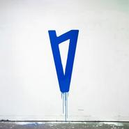

I met you when I was 18.
============================

|  |  |
| :--: | :-- |
| [ I met you when I was 18.](https://emumo.xiami.com/album/2106070207) | **艺人**: [Lauv](../index.md) **语种**: 英语 **唱片公司**: Lauv **发行时间**: 2018年05月31日 **专辑类别**: EP, 单曲 **专辑风格**: 欧美流行 Western Pop **播放数**: 5097 **收藏数**: 5 **评论数**: 2  |

## 简介

## 曲目

## 评论

|  |  |  |
| :-- | :-- | :-- |
|  [虾米用户](https://emumo.xiami.com/u/49443018) like attract... 2020-03-06 11:03 赞(0) 踩(0) | 

 |
|  [虾米用户](https://emumo.xiami.com/u/231685438) 安守本分地盖一个烂尾楼  2020-02-25 12:40 赞(0) 踩(0) | 
这张专辑的版权都回来啦！爱死啦！给我多搞点谢谢！
 |
