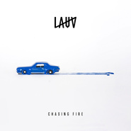

Lauv
============================

|  |  |
| :--: | :-- |
| [ Lauv](https://i.xiami.com/lauv) | **地区**: United States of America 美国 **风格**: 独立流行 Indie Pop, 流行 Pop, 欧美流行 Western Pop, 独立流行 Indie Pop, 根源唱作人 Singer-Songwriter **播放数**: 19828805 **粉丝数**: 19060 **评论数**: 591  |

## 档案

Lauv，真实姓名为Ari Leff。1994年8月8日出生于美国纽约，现居住在洛杉矶。今年刚刚毕业于纽约大学音乐技术(music technology)专业。 
Lauv在中学时代就开始了音乐创作。曾是乐队Somersault Sunday的主唱。现在作为一名独立音乐人，包揽自己音乐作品的词曲，同时也为他人创作。 
Lauv，这位对音乐既认真、又执着，还些许耿直的boy，在16岁的时候就发表了”I HATE SCHOOL”的言论： 
I have NO TIME for anything except homework these days! How do i build a successful life if i’m busy waisting my time on shit that i literally will NEVER FUCKING USE! 
Music is my Life ! 
Lauv的音乐基于R&B与电子音乐，迷幻却又清新不腻。 
虽然就twitter或ins的关注人数来说Lauv的名气还不算大，但音乐却首首都是精品，既有才又有颜。 
毕业之后，Lauv参加的音乐活动也越来愈多，曝光度也各种增加，社交账号更新的频率也令乐迷们倍感欣喜。相信Lauv在不久的将来一定有机会让更多的人听到他的音乐，喜欢，爱上他的音乐，让自己生而为音乐的生命更加绚烂多彩。

## 专辑

| 名称 | 语种 | 唱片公司 | 发行时间 | 专辑类别 | 专辑风格 |
| :--: | :-- | :-- | :-- | :-- | :-- |
| [ 2021](./albums/5022322520.md) | 英语 | Lauv, AWAL | 2020年12月31日 | EP, 单曲 | 陷阱舞曲 Trap, 欧美流行 Western Pop, 电音流行 Electropop |
| [ Fake](./albums/5021669684.md) | 英语 | Self-Released | 2020年10月12日 | EP, 单曲 | 欧美流行 Western Pop |
| [ Slow Grenade (Syn Cole Remix)](./albums/5021647354.md) | 英语 | Polydor Records | 2020年10月09日 | EP, 单曲 | 流行 Pop |
| [ Without You](./albums/5020958644.md) | 英语 | Lauv | 2020年06月24日 | EP, 单曲 | 欧美流行 Western Pop |
| [ ~WORK OUT W LAUV~](./albums/5020867056.md) | 英语 | Lauv | 2020年06月11日 | 录音室专辑 | 流行 Pop |
| [ ~I MISS YOU~](./albums/5020850191.md) | 英语 | Lauv | 2020年06月09日 | 录音室专辑 | 流行 Pop |
| [ ~PARTY VIBES~](./albums/5020820602.md) | 英语 | Lauv | 2020年06月04日 | 录音室专辑 | 独立流行 Indie Pop, 当代唱作人 Contemporary Singer-Songwriter |
| [ ~DRIVING VIBES~](./albums/5020808131.md) | 英语 | Lauv | 2020年06月03日 | 录音室专辑 | 独立流行 Indie Pop, 当代唱作人 Contemporary Singer-Songwriter |
| [ ~NIGHT VIBES~](./albums/5020752741.md) | 英语 | Lauv | 2020年05月29日 | 录音室专辑 | 流行 Pop |
| [ ~LONELY~](./albums/5020755242.md) | 英语 | Lauv | 2020年05月29日 | 录音室专辑 | 流行 Pop |
| [ ~how i'm feeling~](./albums/2420423153.md) | 英语 | Lauv | 2020年03月06日 | 录音室专辑 | 欧美流行 Western Pop, 独立流行 Indie Pop |
| [ ~how i'm feeling~ (Explicit)](./albums/5020682691.md) | 英语 | Lauv | 2020年03月06日 | 录音室专辑 | 流行 Pop |
| [ Modern Loneliness](./albums/2106074730.md) | 英语 | Lauv | 2020年02月20日 | EP, 单曲 | 欧美流行 Western Pop |
| [ Tattoos Together](./albums/2105742192.md) | 英语 | Lauv | 2020年01月16日 | EP, 单曲 | 欧美流行 Western Pop |
| [ Changes](./albums/2105668803.md) | 英语 | Lauv | 2020年01月02日 | EP, 单曲 | 欧美流行 Western Pop |
| [ ~how i'm feeling~ (the extras)](./albums/2108153582.md) | 英语 | Lauv | 2019年12月20日 | 录音室专辑 | 欧美流行 Western Pop |
| [ Mean It](./albums/2105438496.md) | 英语 | Lauv | 2019年11月14日 | EP, 单曲 |  |
| [ Sims](./albums/2105696574.md) | 英语 | Lauv | 2019年10月03日 | EP, 单曲 | 欧美流行 Western Pop |
| [ Feelings](./albums/2105269892.md) | 英语 | Self-Released | 2019年09月19日 | EP, 单曲 |  |
| [ f**k, i'm lonely美剧《十三个原因 第三季》插曲](./albums/2105150458.md) | 英语 | Lauv | 2019年08月02日 | EP, 单曲 |  |
| [ Sad Forever](./albums/2104917441.md) | 英语 | Lauv | 2019年05月31日 | EP, 单曲 |  |
| [ Drugs & The Internet](./albums/2105687159.md) | 英语 | Lauv | 2019年05月17日 | EP, 单曲 | 欧美流行 Western Pop |
| [ i'm so tired...](./albums/2104548676.md) | 英语 | Lauv | 2019年01月24日 | EP, 单曲 | 独立流行 Indie Pop |
| [ There's No Way](./albums/2104288737.md) | 英语 | Self-Released | 2018年09月27日 | EP, 单曲 |  |
| [ Superhero](./albums/2105672840.md) | 英语 | Lauv | 2018年08月30日 | EP, 单曲 | 欧美流行 Western Pop |
| [ I met you when I was 18. (the playlist)](./albums/2103748688.md) | 英语 | Self-Released | 2018年05月31日 | 录音室专辑 |  |
| [ I met you when I was 18.](./albums/2106070207.md) | 英语 | Lauv | 2018年05月31日 | EP, 单曲 | 欧美流行 Western Pop |
| [ Bracelet](./albums/2103722195.md) | 英语 | Self-Released | 2018年05月24日 | EP, 单曲 |  |
| [ Paranoid](./albums/2103722198.md) | 英语 | Self-Released | 2018年05月24日 | EP, 单曲 |  |
| [ Chasing Fire (Stripped)](./albums/2103722196.md) | 英语 | Self-Released | 2018年05月24日 | EP, 单曲 |  |
| [ Chasing Fire (Robin Schulz Remix)](./albums/2103689384.md) | 英语 | Self-Released | 2018年04月18日 | EP, 单曲 |  |
| [ Chasing Fire](./albums/2103649572.md) | 英语 | Self-Released | 2018年03月29日 | EP, 单曲 | 合成器流行 Synthpop |
| [ Getting Over You (R3hab Remix)](./albums/2103574397.md) | 英语 | Self-Released | 2018年03月02日 | EP, 单曲 |  |
| [ Getting Over You](./albums/2103528276.md) | 英语 | Self-Released | 2018年02月14日 | EP, 单曲 |  |
| [ Paris in the Rain](./albums/2102936366.md) | 英语 | Self-Released | 2017年11月17日 | EP, 单曲 | 另类节奏布鲁斯 Alternative R&B, 独立电子乐 Indietronica |
| [ I Like Me Better (Jhoony Jhoony Remix)](./albums/2102885451.md) | 英语 | Self-Released | 2017年10月27日 | EP, 单曲 |  |
| [ Easy Love (Dipha Barus Remix)](./albums/2102885446.md) | 英语 | Self-Released | 2017年10月27日 | EP, 单曲 |  |
| [ Easy Love](./albums/2102868034.md) | 英语 | Self-Released | 2017年10月06日 | EP, 单曲 |  |
| [ I Like Me Better (Remixes)](./albums/2102798088.md) | 英语 | Lauv Music | 2017年09月08日 | EP, 单曲 |  |
| [ I Like Me Better](./albums/2102750395.md) | 英语 | Self-Released | 2017年05月19日 | EP, 单曲 |  |
| [ The Other (Stripped)](./albums/2102730457.md) | 英语 | Self-Released | 2017年03月30日 | EP, 单曲 |  |
| [ The Other (Remixes)](./albums/2102714265.md) | 英语 | Lauv Music | 2017年03月17日 | EP, 单曲 |  |
| [ The Story Never Ends](./albums/2102674358.md) | 英语 | Self-Released | 2016年10月20日 | EP, 单曲 |  |
| [ The Story Never Ends (Piano Version)](./albums/2103722507.md) | 英语 | Self-Released | 2016年10月20日 | EP, 单曲 |  |
| [ Breathe](./albums/2102404539.md) | 英语 | Lauv | 2016年10月07日 | EP, 单曲 |  |
| [ Question](./albums/2100353312.md) | 英语 | Self-Released | 2016年06月10日 | EP, 单曲 |  |
| [ Reforget (Milk N Cooks Remix) [feat. Milk N Cooks]](./albums/2102674362.md) | 英语 | Self-Released | 2016年01月13日 | EP, 单曲 |  |
| [ Lost in the Light](./albums/2100207412.md) | 英语 | Lauv | 2015年09月25日 | EP, 单曲 | 流行 Pop |
| [ Reforget](./albums/1337589329.md) | 英语 | Self-Released | 2015年07月16日 | EP, 单曲 | 流行 Pop |
| [ The Other](./albums/1727789979.md) | 英语 | Self-Released | 2015年03月12日 | EP, 单曲 | 流行 Pop |

## 评论

|  |  |  |
| :-- | :-- | :-- |
|  [虾米用户](https://emumo.xiami.com/u/352371292)  2021-01-13 04:27 赞(0) 踩(0) | 
哇，他的歌都能听，没有限制版权&amp;copy;️太好了
 |
|  [虾米用户](https://emumo.xiami.com/u/379162683) 我想要记住你们，我想要你... 2020-12-31 17:30 赞(0) 踩(0) | 
✧*｡
 |
|  [虾米用户](https://emumo.xiami.com/u/309263667) 善始善终 2020-10-01 08:49 赞(1) 踩(0) | 
火钳刘明
 |
|  [虾米用户](https://emumo.xiami.com/u/4254532) (｡-_-｡) 2020-09-21 12:37 赞(1) 踩(0) | 
这么有才的Lauv希望更多人能听到他的歌！
 |
|  [虾米用户](https://emumo.xiami.com/u/338218339) 哥哥，我希望这一生过后我... 2020-08-05 20:09 赞(1) 踩(0) | 
真的很有才
 |
|  [虾米用户](https://emumo.xiami.com/u/291967325)  2020-08-04 22:26 赞(0) 踩(0) | 
牛逼
 |
|  [虾米用户](https://emumo.xiami.com/u/291967325)  2020-08-04 22:26 赞(0) 踩(0) | 
牛逼
 |
|  [虾米用户](https://emumo.xiami.com/u/405080878)  2020-06-28 14:26 赞(0) 踩(0) | 
好可爱 六公主
 |
|  [虾米用户](https://emumo.xiami.com/u/614216) diggin' | in... 2020-06-27 12:04 赞(0) 踩(0) | 
你真不是阿姆吗
 |
| ⇒ |  [虾米用户](https://emumo.xiami.com/u/291967325)  2020-08-04 22:24 赞(0) 踩(0) | 
太像痞子姆了 
 |
|  [虾米用户](https://emumo.xiami.com/u/443094630) 虾米，再见 2020-06-25 07:17 赞(0) 踩(0) | 
Thank you so much 
 |
|  [虾米用户](https://emumo.xiami.com/u/2796166) 最爱莫文蔚..... 2020-06-25 00:24 赞(1) 踩(0) | 
加油&amp;middot;~~~~~
 |
|  [虾米用户](https://emumo.xiami.com/u/443312276)  2020-06-22 08:38 赞(2) 踩(0) | 
      
 |
|  [虾米用户](https://emumo.xiami.com/u/325850949) ℯℴ ℯ 2020-06-18 17:45 赞(2) 踩(0) | 
三年前我刚刚遇到他的时候还是几千粉丝哈哈哈哈
 |
|  [虾米用户](https://emumo.xiami.com/u/428440200)  2020-06-09 20:26 赞(1) 踩(0) | 
头像好帅
 |
|  [虾米用户](https://emumo.xiami.com/u/313521095) sorry I didn... 2020-05-31 15:47 赞(3) 踩(0) | 
啥，六公主是虾米音乐人？震撼我全家！
 |
|  [虾米用户](https://emumo.xiami.com/u/407923357) 明天很不好 2020-05-16 22:33 赞(2) 踩(0) | 
这MV实在是看得我难受，难道这就是五毛钱MV吗
 |
|  [虾米用户](https://emumo.xiami.com/u/349339882) 后荣迷。努力学习中。 2020-05-08 22:42 赞(0) 踩(0) | 
(*&amp;acute;&amp;forall;｀)
 |
|  [虾米用户](https://emumo.xiami.com/u/421578063) fox god 2020-04-26 18:34 赞(0) 踩(0) | 
(T ^ T)
 |
|  [虾米用户](https://emumo.xiami.com/u/31446157)  2020-04-20 12:41 赞(0) 踩(0) | 
很好听，氛围感很足 
 |
|  [虾米用户](https://emumo.xiami.com/u/219847384) 很荣幸遇见你. 2020-04-13 23:39 赞(1) 踩(0) | 
哪位老粉丝来告诉我为什么他昵称是六公主呢？
 |
| ⇒ |  [虾米用户](https://emumo.xiami.com/u/159926012)  2020-06-20 17:03 赞(0) 踩(0) | 
谐音加性格
 |
|  [虾米用户](https://emumo.xiami.com/u/219847384) 很荣幸遇见你. 2020-04-13 23:39 赞(0) 踩(0) | 
哪位老粉丝来告诉我为什么他昵称是六公主哇？
 |
|  [虾米用户](https://emumo.xiami.com/u/2743883)  2020-04-13 15:01 赞(0) 踩(0) | 
发现一个宝藏歌手，每一首都好听！
 |
|  [虾米用户](https://emumo.xiami.com/u/355930139) shh… 2020-04-03 20:39 赞(0) 踩(0) | 
六公主是怎么来的呢？
 |
|  [虾米用户](https://emumo.xiami.com/u/441495109)  2020-03-27 15:54 赞(0) 踩(0) | 
My dear lauv,I'm your fans, I will love you and follow you forever.I hope you can become more and more better.
 |
| ⇒ |  [虾米用户](https://emumo.xiami.com/u/343928903) Text me with... 2020-04-02 13:17 赞(0) 踩(0) | 
呃。。。
 |
| ⇒ |  [虾米用户](https://emumo.xiami.com/u/343928903) Text me with... 2020-04-02 13:17 赞(0) 踩(0) | 
Tom Holland 发来贺电
 |
|  [虾米用户](https://emumo.xiami.com/u/441495109)  2020-03-27 15:52 赞(0) 踩(0) | 
老六加油鸭！冲冲冲！
 |
|  [虾米用户](https://emumo.xiami.com/u/411133757) k . 2020-03-26 14:08 赞(0) 踩(0) | 
宝藏男孩六公主(｡･&amp;omega;･｡)ﾉ♡我爱你❤️
 |
|  [虾米用户](https://emumo.xiami.com/u/440997167)  2020-03-23 09:54 赞(1) 踩(0) | 
我感觉Lauv每一首歌曲都很不错。值得你们欣赏收藏
 |
|  [虾米用户](https://emumo.xiami.com/u/440997167)  2020-03-23 09:54 赞(1) 踩(0) | 
我感觉Lauv每一首歌曲都很不错。值得你们欣赏收藏
 |
|  [虾米用户](https://emumo.xiami.com/u/434373844)  2020-03-16 22:59 赞(0) 踩(0) | 
完美 
 |
|  [虾米用户](https://emumo.xiami.com/u/322070130)  2020-03-15 22:28 赞(1) 踩(0) | 
宝藏男孩六公主
 |
|  [虾米用户](https://emumo.xiami.com/u/400660439) Every color ... 2020-03-14 19:04 赞(0) 踩(0) | 
.
 |
|  [虾米用户](https://emumo.xiami.com/u/42405531) 再见虾米 2020-03-13 22:05 赞(0) 踩(0) | 
有点6
 |
|  [虾米用户](https://emumo.xiami.com/u/253100822) 要做哥哥们的御用舞者 E... 2020-03-12 14:50 赞(1) 踩(0) | 
喔喔爱你
 |
|  [虾米用户](https://emumo.xiami.com/u/353004603) 勿念 2020-03-12 14:50 赞(3) 踩(0) | 
每首歌都好听啊，Lauv真的用心做音乐
 |
|  [虾米用户](https://emumo.xiami.com/u/419875163) 流浪 2020-03-11 12:59 赞(0) 踩(0) | 
喜欢六公主很久了 喜欢我们能一直被治愈
 |
|  [虾米用户](https://emumo.xiami.com/u/87736430)  2020-03-10 19:54 赞(0) 踩(0) | 
新头像好美
 |
|  [虾米用户](https://emumo.xiami.com/u/42405531) 再见虾米 2020-03-08 00:22 赞(1) 踩(0) | 
什么？他才出第一张专辑？
 |
|  [虾米用户](https://emumo.xiami.com/u/440406999)  2020-03-06 19:16 赞(0) 踩(0) | 
thank you！
 |
|  [虾米用户](https://emumo.xiami.com/u/358104299) 悲观的唯心存在现实解构虚... 2020-03-06 10:04 赞(1) 踩(0) | 
16346
 |
|  [虾米用户](https://emumo.xiami.com/u/434071958)  2020-02-21 20:46 赞(0) 踩(0) | 

 |
|  [虾米用户](https://emumo.xiami.com/u/8226204) ≡ 2020-02-21 12:23 赞(1) 踩(0) | 
新专辑一共21首歌喔
 |
|  [虾米用户](https://emumo.xiami.com/u/332498160)  You'll Love... 2020-01-15 11:31 赞(0) 踩(0) | 
愛了愛了又回來了
 |
|  [虾米用户](https://emumo.xiami.com/u/84571136) 唯有音乐不离不弃 2020-01-03 04:27 赞(0) 踩(0) | 
~how i'm feeling~ Genre: Pop Released: 2020-03-06T08:00:00Z ℗ 2020 Lauv under exclusive license to AWAL Recordings America, Inc.
 |
|  [虾米用户](https://emumo.xiami.com/u/84571136) 唯有音乐不离不弃 2020-01-03 04:26 赞(0) 踩(0) | 
Lauv – Changes
 |
|  [虾米用户](https://emumo.xiami.com/u/49828336)   2019-12-09 22:19 赞(3) 踩(0) | 
他喜欢女生。
 |
|  [虾米用户](https://emumo.xiami.com/u/42963872) 我还没想好要写什么... 2019-11-18 12:40 赞(4) 踩(0) | 
2020.06.21 北京 北展剧场 2020.06.23 上海 ModerSky Lab
 |
|  [虾米用户](https://emumo.xiami.com/u/251829155)  2019-10-10 20:43 赞(0) 踩(0) | 
为什么没有Superhero
 |
|  [虾米用户](https://emumo.xiami.com/u/42963872) 我还没想好要写什么... 2019-09-20 11:58 赞(0) 踩(0) | 
-
 |
|  [虾米用户](https://emumo.xiami.com/u/356763773) 我还没想好要写什么... 2019-09-18 23:45 赞(0) 踩(0) | 
。
 |
|  [虾米用户](https://emumo.xiami.com/u/84571136) 唯有音乐不离不弃 2019-09-13 19:23 赞(0) 踩(0) | 
Lauv &amp;ndash; fuck, i&amp;rsquo;m lonely (feat. Anne-Marie) [stripped]
 |
|  [虾米用户](https://emumo.xiami.com/u/401929744) 我还没想好要写什么... 2019-09-10 22:20 赞(0) 踩(0) | 
他是我外甥
 |
|  [虾米用户](https://emumo.xiami.com/u/327468673) 真诚换真诚 2019-08-21 10:49 赞(0) 踩(0) | 
六公主
 |
|  [虾米用户](https://emumo.xiami.com/u/342295613) 长风. 2019-08-10 21:49 赞(0) 踩(0) | 
我不管，我就是要给他赞
 |
|  [虾米用户](https://emumo.xiami.com/u/84571136) 唯有音乐不离不弃 2019-08-01 23:47 赞(0) 踩(0) | 
Lauv &amp;ndash; f**k, i&amp;rsquo;m lonely (feat. Anne-Marie) [From &amp;ldquo;13 Reasons Why: Season 3&amp;rdquo;]
 |
|  [虾米用户](https://emumo.xiami.com/u/427876256) ☁   ☁☀☁    ☁... 2019-07-28 19:18 赞(1) 踩(0) | 
希望你不会火，挣的钱刚刚够用， 偶尔有曝光，永远因为音乐快乐 ✨✨✨✨✨
 |
|  [虾米用户](https://emumo.xiami.com/u/318104586)  再见再见了再见 2019-07-18 19:47 赞(1) 踩(0) | 
粉丝涨得也太快了点吧，无法接受哼╯^╰
 |
|  [虾米用户](https://emumo.xiami.com/u/215379991) 簽名不重要重要的是你聽什... 2019-07-02 00:46 赞(0) 踩(0) | 
ﻌﻌﻌ❤︎
 |
|  [虾米用户](https://emumo.xiami.com/u/4131849) 网易云：非人類兔子Agy... 2019-07-01 23:20 赞(0) 踩(0) | 
啥子情況，都下架了，是惱什麼鬼？？？？？？ the otherk可是我入股另類r b的啟蒙！
 |
|  [虾米用户](https://emumo.xiami.com/u/358104299) 悲观的唯心存在现实解构虚... 2019-05-29 09:50 赞(0) 踩(0) | 
11166
 |
|  [虾米用户](https://emumo.xiami.com/u/84571136) 唯有音乐不离不弃 2019-05-18 22:32 赞(0) 踩(0) | 
Lauv – Drugs &amp; The Internet (CHVRCHES Remix)&nbsp;
 |
|  [虾米用户](https://emumo.xiami.com/u/8070377) 爱雾瑞性维欧腐漏 2019-05-18 21:42 赞(0) 踩(0) | 
©不在xiami吧
 |
|  [虾米用户](https://emumo.xiami.com/u/10970617) 补补艺人资料 听听小众独... 2019-05-11 10:59 赞(0) 踩(0) | 
Drugs &amp; The Internet 好听啊啊啊啊
 |
|  [虾米用户](https://emumo.xiami.com/u/356476862) 做人呢最重要的就是开心 2019-04-30 12:38 赞(0) 踩(0) | 

 |
|  [虾米用户](https://emumo.xiami.com/u/256697010) Walk into yo... 2019-04-27 20:22 赞(4) 踩(0) | 
希望早日拿到我们六公主的版权
 |
|  [虾米用户](https://emumo.xiami.com/u/375673309)  2019-04-22 09:24 赞(0) 踩(0) | 
cade 拉粑粑额.   bbn.     0031 00932222
 |
|  [虾米用户](https://emumo.xiami.com/u/52056952) 人生即是到來、相遇、陪伴... 2019-04-13 02:07 赞(0) 踩(0) | 
(๑・ω-)～♥”
 |
|  [虾米用户](https://emumo.xiami.com/u/336228277)  2019-04-11 20:29 赞(0) 踩(0) | 
期待版权come back
 |
|  [虾米用户](https://emumo.xiami.com/u/34634596) 本质逼裂波(1108，啪... 2019-04-05 01:44 赞(0) 踩(0) | 
还虾米音乐人呢
 |
|  [虾米用户](https://emumo.xiami.com/u/411948729) study study ... 2019-02-21 22:36 赞(1) 踩(0) | 
我的lauv呀
 |
|  [虾米用户](https://emumo.xiami.com/u/330760196) 云深处. 2019-02-21 12:19 赞(1) 踩(0) | 
又帅又有才，让我怎么活
 |
|  [虾米用户](https://emumo.xiami.com/u/98393806)   2019-02-21 11:25 赞(4) 踩(0) | 
现在所有个人版权被某云独占
 |
|  [虾米用户](https://emumo.xiami.com/u/34012310) V: Jsong108 ... 2019-02-12 20:53 赞(3) 踩(0) | 
喜欢他的时候 还是the other的时候 就一首歌 听不腻，那会儿戳都还没火
 |
|  [虾米用户](https://emumo.xiami.com/u/307958283)  2019-01-31 17:19 赞(1) 踩(0) | 
爱这位小哥
 |
|  [虾米用户](https://emumo.xiami.com/u/8288058) 卑劣的情感共鸣 2019-01-31 15:03 赞(1) 踩(0) | 
开始发光发热的宝藏辣舞❤️
 |
|  [虾米用户](https://emumo.xiami.com/u/373705999) 玩笑。 2019-01-31 14:48 赞(2) 踩(0) | 
和戳爷的合作可谓神仙组合，粉他
 |
|  [虾米用户](https://emumo.xiami.com/u/10970617) 补补艺人资料 听听小众独... 2019-01-26 06:22 赞(3) 踩(0) | 
i'm so tired…
 |
|  [虾米用户](https://emumo.xiami.com/u/96999544)   2019-01-25 23:29 赞(1) 踩(0) | 
说好的虾米音乐人结果版权都没有，有些标着独家的唱片版权也没有，阿里是不是放弃虾米破罐破摔了？
 |
|  [虾米用户](https://emumo.xiami.com/u/276729440)  2019-01-25 14:05 赞(3) 踩(0) | 
早就开始喜欢他了 听声音好成熟 嗯 是个小鲜肉（无贬义）和戳爷合作的新单嘞 虾米加把劲啊 戳爷也是明显的受脸攻音 你们两个合作会擦出怎样的火花呢 期待ying…… 
 |
|  [虾米用户](https://emumo.xiami.com/u/318486001) suck it 2019-01-25 11:07 赞(1) 踩(0) | 
独家就很恶心
 |
|  [虾米用户](https://emumo.xiami.com/u/405377324) 等考上sgj就去看老霉！ 2019-01-15 20:23 赞(0) 踩(0) | 
lauv和Troye是好友吗？
 |
| ⇒ |  [虾米用户](https://emumo.xiami.com/u/277632068)  2019-01-31 16:00 赞(0) 踩(0) | 
他们俩好了
 |
| ⇒ |  [虾米用户](https://emumo.xiami.com/u/405377324) 等考上sgj就去看老霉！ 2019-01-31 16:01 赞(0) 踩(0) | 
<q><b>MS_梅杉说：</b></q>
 |
| ⇒ |  [虾米用户](https://emumo.xiami.com/u/277632068)  2019-01-31 16:01 赞(0) 踩(0) | 
<q><b>我站Tea&amp;Tok鸭说：</b></q>
 |
|  [虾米用户](https://emumo.xiami.com/u/405377324) 等考上sgj就去看老霉！ 2019-01-15 20:12 赞(1) 踩(0) | 
六公主要和我戳合作了，希望到时虾米能有版权
 |
|  [虾米用户](https://emumo.xiami.com/u/25235768) 我还没想好要写什么... 2019-01-12 12:54 赞(3) 踩(0) | 
麻烦买下版权好吗~这是让我去投奔网易吗？
 |
|  [虾米用户](https://emumo.xiami.com/u/84571136) 唯有音乐不离不弃 2018-12-16 19:51 赞(0) 踩(0) | 
Lauv – There’s No Way (feat. Julia Michaels) [Live from Box Fresh, London, 2018]
 |
|  [虾米用户](https://emumo.xiami.com/u/343855807)  2018-12-08 10:26 赞(0) 踩(0) | 
六公主真好
 |
|  [虾米用户](https://emumo.xiami.com/u/6082125) Standing and... 2018-12-07 12:58 赞(1) 踩(0) | 
Confidence is enough; Tune is not.
 |
|  [虾米用户](https://emumo.xiami.com/u/10970617) 补补艺人资料 听听小众独... 2018-11-27 01:21 赞(0) 踩(0) | 
想听 Superhero
 |
|  [虾米用户](https://emumo.xiami.com/u/137547926) 好看的封面可以吸引我|ω... 2018-11-21 18:48 赞(0) 踩(0) | 
这位小哥的歌都挺好听的 
 |
|  [虾米用户](https://emumo.xiami.com/u/331315618) “音乐无国界”  只要是... 2018-11-21 16:22 赞(0) 踩(0) | 
非常喜欢这位小哥哥的声音，而且歌曲首首好听 
 |
|  [虾米用户](https://emumo.xiami.com/u/6082125) Standing and... 2018-11-16 16:41 赞(0) 踩(0) | 
说的对
 |
|  [虾米用户](https://emumo.xiami.com/u/404487857)  2018-11-16 01:45 赞(0) 踩(0) | 
年轻有为 ！为你加油！
 |
|  [虾米用户](https://emumo.xiami.com/u/225254345) 捡了个宝啊，——啊？ 2018-11-06 10:54 赞(1) 踩(0) | 
爱你(ɔˆ ³(ˆ⌣ˆc)，
 |
|  [虾米用户](https://emumo.xiami.com/u/257812637) 想要避世的时候可以躲进歌... 2018-10-28 02:12 赞(3) 踩(0) | 
真的太喜欢 lauv了他的歌没有一首失望过，只有惊喜，每张砖评分都超高。听他的歌情绪都能被旋律带动，节奏感，韵律，伤感，喜悦.....喜欢他小清新的风格，他的嗓音，他的长相，他对音乐的态度，以及所有Remix。我也好不希望他火，但是他不火没道理  相信你一定会更好的，这辈子梦想之一就是去一次你的演唱会，你对粉丝都超好的哇，演唱会前都会准备一个信箱让粉丝投信在里面，从而也得到创作的灵感，可以说的是超贴心可爱了 希望以后会有更多人知道你 lauv  我们的六公主 （虾米的版权要给点力啊，能听得歌都还不多...）
 |
|  [虾米用户](https://emumo.xiami.com/u/70666552) 我还没想好要写什么... 2018-10-12 22:23 赞(0) 踩(0) | 
没有版权了吗 呜呜呜都是mv
 |
|  [虾米用户](https://emumo.xiami.com/u/277954749)  2018-10-06 21:10 赞(0) 踩(0) | 
网易云有他的好多版权
 |
|  [虾米用户](https://emumo.xiami.com/u/303919180) 我还没想好要写什么... 2018-10-02 23:30 赞(0) 踩(0) | 
喜欢   
 |
|  [虾米用户](https://emumo.xiami.com/u/15749767) 我还没想好要写什么... 2018-09-28 18:44 赞(3) 踩(0) | 
麻烦虾米多争取点版权啊   
 |
|  [虾米用户](https://emumo.xiami.com/u/84571136) 唯有音乐不离不弃 2018-09-27 22:09 赞(3) 踩(0) | 
Lauv &amp;ndash; There&amp;rsquo;s No Way (feat. Julia Michaels)
 |
|  [虾米用户](https://emumo.xiami.com/u/262280019)  2018-09-27 21:36 赞(0) 踩(0) | 
蝦米越來越差了 
 |
|  [虾米用户](https://emumo.xiami.com/u/9467594) 我还没想好要写什么... 2018-09-24 12:33 赞(0) 踩(0) | 
没版权了吗
 |
|  [虾米用户](https://emumo.xiami.com/u/11749606) E l’alba ver... 2018-09-23 15:47 赞(3) 踩(0) | 
作品不多，首首經典！
 |
|  [虾米用户](https://emumo.xiami.com/u/75764070) もう助手席で甘えてるだけ... 2018-09-18 16:21 赞(4) 踩(0) | 
在油管看断眉。。顺便发现了lauv，真是宝藏发现之旅
 |
|  [虾米用户](https://emumo.xiami.com/u/293945025) just live 2018-09-10 07:00 赞(0) 踩(0) | 
這次去巴黎聽他現場唱歌 出售一張vip票  德國 法蘭克福 站 有誰要去嗎 ？
 |
| ⇒ |  [虾米用户](https://emumo.xiami.com/u/11749606) E l’alba ver... 2018-09-23 15:48 赞(0) 踩(0) | 
有機會我也想看他的live
 |
| ⇒ |  [虾米用户](https://emumo.xiami.com/u/293945025) just live 2018-09-25 23:56 赞(0) 踩(0) | 
<q><b>ellie.ec说：</b></q>
 |
| ⇒ |  [虾米用户](https://emumo.xiami.com/u/257812637) 想要避世的时候可以躲进歌... 2018-10-28 02:13 赞(0) 踩(0) | 
啊票还在么,我还有机会么.....
 |
| ⇒ |  [虾米用户](https://emumo.xiami.com/u/293945025) just live 2018-11-04 07:45 赞(0) 踩(0) | 
<q><b>丧气波说：</b></q>
 |
|  [虾米用户](https://emumo.xiami.com/u/84571136) 唯有音乐不离不弃 2018-08-31 20:21 赞(0) 踩(0) | 
Lauv - Superhero
 |
|  [虾米用户](https://emumo.xiami.com/u/348792218)  2018-08-31 10:43 赞(0) 踩(0) | 
长得像派大星
 |
|  [虾米用户](https://emumo.xiami.com/u/149817500) U Only Live ... 2018-08-30 12:29 赞(1) 踩(0) | 
I met a superhero I lost her I want her back.
 |
|  [虾米用户](https://emumo.xiami.com/u/4131849) 网易云：非人類兔子Agy... 2018-08-04 23:52 赞(0) 踩(0) | 
是这样的，比我还小，嗯，年轻有为
 |
|  [虾米用户](https://emumo.xiami.com/u/364161710)  2018-07-25 17:36 赞(0) 踩(0) | 
就很喜欢了 脸 名字 头发 声音 很迷人了
 |
|  [虾米用户](https://emumo.xiami.com/u/379508746)   2018-07-23 21:57 赞(0) 踩(0) | 
非常喜欢你
 |
|  [虾米用户](https://emumo.xiami.com/u/327400941) Let we do so... 2018-07-22 10:32 赞(1) 踩(0) | 
❤
 |
|  [虾米用户](https://emumo.xiami.com/u/214412021)  2018-07-21 19:55 赞(0) 踩(0) | 
我坚信Leff会火起来的!!
 |
|  [虾米用户](https://emumo.xiami.com/u/258377220)  2018-07-06 21:15 赞(3) 踩(0) | 
为啥六公主好多的歌的版权都没有啊？
 |
| ⇒ |  [虾米用户](https://emumo.xiami.com/u/235293010)  2018-08-08 16:18 赞(0) 踩(0) | 
手机版上的有版权
 |
| ⇒ |  [虾米用户](https://emumo.xiami.com/u/283405643) 朝若晨曦，老如沧海 2018-10-08 15:49 赞(0) 踩(0) | 
暑假之前他的歌还可以下载，现在...哎
 |
|  [虾米用户](https://emumo.xiami.com/u/283549200) 。 2018-07-06 19:44 赞(0) 踩(0) | 
我喜欢你的所有音乐 你值得所有人的喜欢
 |
|  [虾米用户](https://emumo.xiami.com/u/283549200) 。 2018-07-06 19:44 赞(0) 踩(0) | 
我喜欢你所有音乐 你值得所有人喜欢
 |
|  [虾米用户](https://emumo.xiami.com/u/334329768) 一个固执独行于偌大宇宙的... 2018-06-27 12:21 赞(1) 踩(0) | 
宝藏男孩啊！
 |
|  [虾米用户](https://emumo.xiami.com/u/334329768) 一个固执独行于偌大宇宙的... 2018-06-27 12:18 赞(1) 踩(0) | 
小哥哥超级喜欢啊啊！声音好听又撩人，要继续保持下去！ 
 |
|  [虾米用户](https://emumo.xiami.com/u/271842257)  2018-06-13 22:59 赞(0) 踩(0) | 
谁有the story never ends 的封面啊   
 |
|  [虾米用户](https://emumo.xiami.com/u/349899767)  2018-06-08 14:33 赞(0) 踩(0) | 
新歌啊啊啊啊啊啊？!
 |
|  [虾米用户](https://emumo.xiami.com/u/1390683) Shall we? 2018-06-07 21:59 赞(0) 踩(0) | 
怎么突然这么火了！！！
 |
|  [虾米用户](https://emumo.xiami.com/u/250198682)   2018-06-02 11:32 赞(0) 踩(0) | 
怎么还没有
 |
|  [虾米用户](https://emumo.xiami.com/u/262280019)  2018-05-31 21:13 赞(2) 踩(0) | 
剛才youtube上傳了 never not, enemies 的音源了 ps&amp;rdquo; 怎麼甚麼都還沒有啊paranoid 還有 bracelet 啊都已經上個星期在youtube聽到了 
 |
|  [虾米用户](https://emumo.xiami.com/u/303919180) 我还没想好要写什么... 2018-05-28 00:20 赞(1) 踩(0) | 

 |
|  [虾米用户](https://emumo.xiami.com/u/48404891) 我还没想好要写什么... 2018-05-24 23:34 赞(1) 踩(0) | 
从ins看到说有新歌静候新歌 ，就来等了  
 |
|  [虾米用户](https://emumo.xiami.com/u/3335757)   2018-05-24 21:54 赞(0) 踩(0) | 
等新歌 我爱他一辈子
 |
|  [虾米用户](https://emumo.xiami.com/u/262280019)  2018-05-24 21:11 赞(1) 踩(0) | 
bracelet, paranoid
 |
|  [虾米用户](https://emumo.xiami.com/u/84571136) 唯有音乐不离不弃 2018-05-21 22:10 赞(0) 踩(0) | 
Lauv &amp;ndash; Chasing Fire (Stripped &amp;ndash; Live in London)
 |
|  [虾米用户](https://emumo.xiami.com/u/295235233) 听个歌要什么签名﹌O﹌ 2018-05-19 00:38 赞(0) 踩(0) | 
啊哈又有新mv
 |
|  [虾米用户](https://emumo.xiami.com/u/356476862) 做人呢最重要的就是开心 2018-05-18 20:34 赞(0) 踩(0) | 
诶  该死的版权啊 只有一个虾米也不行啊
 |
|  [虾米用户](https://emumo.xiami.com/u/356476862) 做人呢最重要的就是开心 2018-05-18 20:31 赞(0) 踩(0) | 
the story never ends
 |
|  [虾米用户](https://emumo.xiami.com/u/54574426) 爱猹、萌德、戳、灰儿子 2018-05-18 17:09 赞(0) 踩(0) | 
帅 
 |
|  [虾米用户](https://emumo.xiami.com/u/63532712) 希望你陪我走向更远更美好... 2018-05-14 15:28 赞(1) 踩(0) | 
这可是我寄几发现的！！！骄傲
 |
|  [虾米用户](https://emumo.xiami.com/u/339191478)   2018-05-11 23:49 赞(0) 踩(0) | 
:-)
 |
|  [虾米用户](https://emumo.xiami.com/u/267185602) 高高拎起 輕輕放低 2018-05-11 16:07 赞(1) 踩(0) | 
求你快上架了求求求求你了
 |
|  [虾米用户](https://emumo.xiami.com/u/302314891) 我已经想好要写什么了……... 2018-04-30 09:47 赞(1) 踩(0) | 
我六公主的歌赶紧回来！ 
 |
|  [虾米用户](https://emumo.xiami.com/u/333077272)  2018-04-30 08:56 赞(1) 踩(0) | 
小哥哥会火的  
 |
|  [虾米用户](https://emumo.xiami.com/u/318007419) 呦呦呦 2018-04-28 14:21 赞(1) 踩(0) | 
为什么下架  
 |
|  [虾米用户](https://emumo.xiami.com/u/325875722) 我昨天不太可爱，今天一定... 2018-04-24 17:54 赞(2) 踩(0) | 
这世间怎么会有我六公主这么撩人的天使
 |
|  [虾米用户](https://emumo.xiami.com/u/30333403) 我还没想好要写什么... 2018-04-23 00:39 赞(1) 踩(0) | 
felt in lauv with you
 |
|  [虾米用户](https://emumo.xiami.com/u/260757342)  2018-04-22 08:36 赞(2) 踩(0) | 
一开始用虾米就听你的歌，好听
 |
|  [虾米用户](https://emumo.xiami.com/u/347563136)  2018-04-21 10:59 赞(3) 踩(0) | 
为什么一大堆歌都没有版权，想听啊T^T
 |
|  [虾米用户](https://emumo.xiami.com/u/128906370) 做一个明亮的人。 2018-04-19 21:52 赞(1) 踩(0) | 
小哥真是给人初恋的感觉
 |
|  [虾米用户](https://emumo.xiami.com/u/78496260) 这个人很帅什么也没留下 2018-04-19 19:50 赞(1) 踩(0) | 
看见被推荐的音乐人里面有六公主然后就点进来 翻翻评论看见说有些歌曲没版权的 幸好之前就下载了    
 |
|  [虾米用户](https://emumo.xiami.com/u/349899767)  2018-04-15 19:11 赞(2) 踩(0) | 
啥？虾米音乐人？
 |
|  [虾米用户](https://emumo.xiami.com/u/358191415)  2018-04-14 19:26 赞(0) 踩(0) | 

 |
|  [虾米用户](https://emumo.xiami.com/u/208055876) Muiscalsavem... 2018-04-14 19:15 赞(1) 踩(0) | 
我们六六最棒惹
 |
|  [虾米用户](https://emumo.xiami.com/u/168065948) Pure Sure Tu... 2018-04-12 09:09 赞(1) 踩(0) | 
你的歌都舍不得给别人听，私心
 |
|  [虾米用户](https://emumo.xiami.com/u/335570768)  2018-04-12 00:47 赞(1) 踩(0) | 
为啥还不红
 |
|  [虾米用户](https://emumo.xiami.com/u/45535233)   2018-04-07 19:00 赞(1) 踩(0) | 
Comfortable版权啊！为什么没有！
 |
|  [虾米用户](https://emumo.xiami.com/u/110021118)   2018-04-06 20:21 赞(2) 踩(0) | 
版权？the other！
 |
|  [虾米用户](https://emumo.xiami.com/u/293945025) just live 2018-04-05 20:28 赞(0) 踩(0) | 
出一張科隆演唱會門票  有人要嗎？
 |
|  [虾米用户](https://emumo.xiami.com/u/356919108)  2018-04-05 09:18 赞(0) 踩(0) | 
版权全都没有，怎么活？？？比版权超渣的网易云还渣？？？我的六公主啊！！
 |
|  [虾米用户](https://emumo.xiami.com/u/202777829)  2018-04-04 22:59 赞(2) 踩(0) | 
为什么突然又没版权了   
 |
|  [虾米用户](https://emumo.xiami.com/u/44925253) Four_0522 2018-04-04 00:34 赞(0) 踩(0) | 

 |
|  [虾米用户](https://emumo.xiami.com/u/303692779) 少年不知愁 2018-04-03 13:18 赞(1) 踩(0) | 
所有的歌都好听，第一次发现这样的歌者
 |
|  [虾米用户](https://emumo.xiami.com/u/2566093)  2018-04-01 22:19 赞(1) 踩(0) | 
求求你出个砖，这些歌我都想要 
 |
|  [虾米用户](https://emumo.xiami.com/u/351236746) Fall in LAUV... 2018-03-31 18:57 赞(3) 踩(0) | 
真是了，每首歌都好像以前喜欢过很久了一样，第一遍听着平淡，听几次就有种在哪听过的感觉
 |
|  [虾米用户](https://emumo.xiami.com/u/159989494) 床前无明灯 2018-03-30 15:31 赞(1) 踩(0) | 
一开嗓就沦陷了啊啊啊啊
 |
|  [虾米用户](https://emumo.xiami.com/u/293945025) just live 2018-03-30 01:53 赞(1) 踩(0) | 
很快就可以現場聽你唱歌了 
 |
|  [虾米用户](https://emumo.xiami.com/u/235293010)  2018-03-29 22:20 赞(0) 踩(0) | 
啊啊啊啊啊啊，喜欢他的声音啊
 |
|  [虾米用户](https://emumo.xiami.com/u/70998312) musicproduct... 2018-03-29 20:27 赞(0) 踩(0) | 

 |
|  [虾米用户](https://emumo.xiami.com/u/121910914) 我想好好睡个觉 2018-03-29 14:53 赞(0) 踩(0) | 
bye
 |
|  [虾米用户](https://emumo.xiami.com/u/98901196) 我是坠屌的 2018-03-27 19:56 赞(1) 踩(0) | 
先留下名 小哥哥火了的时候把我顶上来好么 顺便祝我中考顺利
 |
|  [虾米用户](https://emumo.xiami.com/u/348012200) 诉说灾祸很快就使人们腻烦... 2018-03-20 23:19 赞(2) 踩(0) | 
好喜欢！
 |
|  [虾米用户](https://emumo.xiami.com/u/33301069) 生命是一袭华美的袍 2018-03-15 21:44 赞(4) 踩(0) | 
刚去听过小哥哥的巡演！！全程星星眼 录了超多小视频
 |
| ⇒ |  [虾米用户](https://emumo.xiami.com/u/223811854)  2018-04-09 13:23 赞(0) 踩(0) | 
海外党？羡慕
 |
|  [虾米用户](https://emumo.xiami.com/u/59109096) ♡ 2018-03-14 16:40 赞(0) 踩(0) | 
♡
 |
|  [虾米用户](https://emumo.xiami.com/u/341535423)  2018-03-14 10:19 赞(4) 踩(0) | 
会火吧这个哥哥，虽然今天才第一次听他的歌。
 |
|  [虾米用户](https://emumo.xiami.com/u/341535423)  2018-03-14 10:19 赞(1) 踩(0) | 
这个声音很有惊喜诶
 |
|  [虾米用户](https://emumo.xiami.com/u/308933091) 2.23开始吧 2018-03-09 18:31 赞(0) 踩(0) | 

 |
|  [虾米用户](https://emumo.xiami.com/u/339797897) 我爱纳兰容若. 2018-03-03 12:03 赞(1) 踩(0) | 
2017  2018以后每一年我都在    表白小哥哥
 |
|  [虾米用户](https://emumo.xiami.com/u/339797897) 我爱纳兰容若. 2018-03-03 12:03 赞(0) 踩(0) | 

 |
|  [虾米用户](https://emumo.xiami.com/u/339797897) 我爱纳兰容若. 2018-03-03 12:03 赞(0) 踩(0) | 
我还在
 |
|  [虾米用户](https://emumo.xiami.com/u/339797897) 我爱纳兰容若. 2018-03-03 12:02 赞(0) 踩(0) | 
两年了
 |
|  [虾米用户](https://emumo.xiami.com/u/331031034)   2018-03-02 22:14 赞(0) 踩(0) | 
他的名字到底怎么读 
 |
| ⇒ |  [虾米用户](https://emumo.xiami.com/u/339797897) 我爱纳兰容若. 2018-03-03 12:01 赞(0) 踩(0) | 
我也想知道
 |
|  [虾米用户](https://emumo.xiami.com/u/219847384) 很荣幸遇见你. 2018-02-27 18:01 赞(0) 踩(0) | 
看到他火起来还是有点不高兴的。
 |
|  [虾米用户](https://emumo.xiami.com/u/3583995) 一個人的戰爭 2018-02-26 23:23 赞(0) 踩(0) | 
.
 |
|  [虾米用户](https://emumo.xiami.com/u/351236746) Fall in LAUV... 2018-02-25 23:00 赞(0) 踩(0) | 
完了我被这个小帅哥迷住了，趁不火赶紧把歌全下下来，每首都好听啊
 |
|  [虾米用户](https://emumo.xiami.com/u/351236746) Fall in LAUV... 2018-02-25 22:34 赞(2) 踩(0) | 
每首都好听的可怕，太厉害了吧
 |
|  [虾米用户](https://emumo.xiami.com/u/206029922) 一笑泯恩仇 2018-02-21 17:11 赞(0) 踩(0) | 
烟嗓
 |
|  [虾米用户](https://emumo.xiami.com/u/350944856) 持续性混吃等死   间歇... 2018-02-17 11:48 赞(2) 踩(0) | 
一直以来没有找到陈奕迅的小伙伴   一直听你的歌却不了解你    昨天晚上心血来潮了解了你  然后你就成为了我吹的小伙伴    要知道   陈奕迅可是那个我会爱一辈子的男人啊    现在可能又多了一个你   要和陈奕迅争宠了    我喜欢过那么多的歌手演员   唯独你和陈奕迅想让我永远的永远的永远的陪你们走下去   ❤
 |
|  [虾米用户](https://emumo.xiami.com/u/39558039) 一切都是最好的安排 2018-02-14 21:08 赞(0) 踩(0) | 
和我同年，然鹅我才刚毕业做着一份低工资的工作，人家却已经这么厉害了
 |
|  [虾米用户](https://emumo.xiami.com/u/212154854) 学生    00后 2018-02-14 14:05 赞(1) 踩(0) | 
刚才看了他的直播哈哈哈哈哈哈哈贼有趣他人
 |
|  [虾米用户](https://emumo.xiami.com/u/347487790)  2018-02-11 21:55 赞(0) 踩(0) | 
喜欢
 |
|  [虾米用户](https://emumo.xiami.com/u/313759698)  2018-02-09 02:24 赞(1) 踩(0) | 
噢！一开口就被撩走了！
 |
|  [虾米用户](https://emumo.xiami.com/u/59444454)   ᐕ)ง 2018-02-08 23:01 赞(0) 踩(0) | 
good 
 |
|  [虾米用户](https://emumo.xiami.com/u/255285644) 因为个性所以没有签名 2018-01-30 19:42 赞(2) 踩(0) | 
hi！boy！ I Love You！
 |
|  [虾米用户](https://emumo.xiami.com/u/276894410)  2018-01-27 21:26 赞(2) 踩(0) | 
每首歌都炒鸡棒啊，发现你的小确幸
 |
|  [虾米用户](https://emumo.xiami.com/u/25049276) 暂无签名~ 2018-01-27 17:38 赞(2) 踩(0) | 
好聽
 |
|  [虾米用户](https://emumo.xiami.com/u/178251048)  2018-01-27 14:14 赞(1) 踩(0) | 
火前留名 
 |
|  [虾米用户](https://emumo.xiami.com/u/327737808) 听喜欢的音乐，成为自己所... 2018-01-26 19:15 赞(2) 踩(0) | 
會紅的
 |
|  [虾米用户](https://emumo.xiami.com/u/13555511) 听蛙 2018-01-26 16:32 赞(1) 踩(0) | 
A Different Way
 |
|  [虾米用户](https://emumo.xiami.com/u/31059130) V: wx_fred_k... 2018-01-23 13:04 赞(0) 踩(0) | 
我们可能会有40%的相似度
 |
|  [虾米用户](https://emumo.xiami.com/u/4131849) 网易云：非人類兔子Agy... 2018-01-23 00:58 赞(2) 踩(0) | 
小哥颜值越来越高了
 |
|  [虾米用户](https://emumo.xiami.com/u/174925300) you only liv... 2018-01-20 23:01 赞(1) 踩(0) | 
看看人家的24岁
 |
| ⇒ |  [虾米用户](https://emumo.xiami.com/u/31059130) V: wx_fred_k... 2018-01-23 22:01 赞(0) 踩(0) | 
别人的孩子
 |
|  [虾米用户](https://emumo.xiami.com/u/100660422) 你好呀。(¦3[▓▓]虾... 2018-01-07 00:20 赞(0) 踩(0) | 
帅
 |
|  [虾米用户](https://emumo.xiami.com/u/389287) 喜欢大雨深夜的旋律与歌声 2018-01-04 23:08 赞(1) 踩(0) | 
好吧  第一感觉和戳爷感觉有点像。but 期待更好的制作和个人风格!
 |
|  [虾米用户](https://emumo.xiami.com/u/319367839)  2017-12-28 15:10 赞(2) 踩(0) | 
咋办！陷进你的歌声了！！
 |
|  [虾米用户](https://emumo.xiami.com/u/313122567) 每天最享受听歌的时光 2017-12-25 12:54 赞(0) 踩(0) | 
始于颜值，爱上歌曲
 |
|  [虾米用户](https://emumo.xiami.com/u/255592770) 听过的越多，没听过的也就... 2017-12-21 08:56 赞(4) 踩(0) | 
是金子总会发光的
 |
|  [虾米用户](https://emumo.xiami.com/u/15956541)  2017-12-19 06:44 赞(4) 踩(0) | 
除了周杰伦 lauv是第二个我觉得每首都经典的人
 |
|  [虾米用户](https://emumo.xiami.com/u/335111856)  2017-12-17 22:59 赞(0) 踩(0) | 
不管你是男的女的，给我听着：他是我老公，谢谢
 |
|  [虾米用户](https://emumo.xiami.com/u/331970732)  2017-12-16 09:01 赞(1) 踩(0) | 
六公主！加油！
 |
| ⇒ |  [虾米用户](https://emumo.xiami.com/u/1091833)  2017-12-25 20:10 赞(0) 踩(0) | 
為什麼叫六公主？
 |
|  [虾米用户](https://emumo.xiami.com/u/339797897) 我爱纳兰容若. 2017-12-13 19:29 赞(0) 踩(0) | 
老公
 |
|  [虾米用户](https://emumo.xiami.com/u/332398107)  2017-12-08 01:12 赞(2) 踩(0) | 
lauv 已红节奏
 |
|  [虾米用户](https://emumo.xiami.com/u/311443095)  2017-12-07 21:13 赞(0) 踩(0) | 
真的希望他能红 又怕他太红丢了小众的情调 
 |
|  [虾米用户](https://emumo.xiami.com/u/276143081) 这家伙很聪明什么也没留下... 2017-12-07 10:51 赞(0) 踩(0) | 
怎么你还不发新歌
 |
|  [虾米用户](https://emumo.xiami.com/u/288015439) Fvckme 2017-12-02 11:37 赞(0) 踩(0) | 
nice
 |
|  [虾米用户](https://emumo.xiami.com/u/244940857) 嘿嘿嘿 2017-11-21 21:06 赞(1) 踩(0) | 
这哥们长的真帅
 |
|  [虾米用户](https://emumo.xiami.com/u/240570052)  2017-11-21 19:44 赞(0) 踩(0) | 
为你的声音心动(๑&amp;acute;ㅂ`๑)
 |
|  [虾米用户](https://emumo.xiami.com/u/40474579)   2017-11-21 16:57 赞(2) 踩(0) | 
是幸运吗？在最近疯狂迷恋上梁博后，有人听到了这么干净的声音  
 |
|  [虾米用户](https://emumo.xiami.com/u/304726033) 我只是后悔，真的。 2017-11-17 16:03 赞(0) 踩(0) | 
优秀
 |
|  [虾米用户](https://emumo.xiami.com/u/293945025) just live 2017-11-17 06:19 赞(1) 踩(0) | 
新歌 paris in the rain 什麼時候有呢
 |
| ⇒ |  [虾米用户](https://emumo.xiami.com/u/117527814) 没有更多内容了。 2017-11-17 22:15 赞(0) 踩(0) | 
有了
 |
|  [虾米用户](https://emumo.xiami.com/u/244940857) 嘿嘿嘿 2017-11-16 22:09 赞(0) 踩(0) | 
好帅啊
 |
|  [虾米用户](https://emumo.xiami.com/u/277546808) 凡是无法杀死我的，必使我... 2017-11-13 22:45 赞(2) 踩(0) | 
唯一一个每一首歌我都喜欢的歌手，一定要坚持下去啊！ 
 |
|  [虾米用户](https://emumo.xiami.com/u/244155073) 亲吻你的鹅头~ 2017-11-12 19:52 赞(2) 踩(0) | 
歌这么棒，长得又完全是我的style。啊，又是一个老公
 |
|  [虾米用户](https://emumo.xiami.com/u/36002298) 遥远的远，不存在的存在。 2017-11-08 16:36 赞(0) 踩(0) | 
1994...fine.
 |
|  [虾米用户](https://emumo.xiami.com/u/93937284) 我还没想好要写什么... 2017-11-06 19:39 赞(0) 踩(0) | 
很特别，我很喜欢
 |
|  [虾米用户](https://emumo.xiami.com/u/200581957) 一夜飞渡镜湖月 2017-11-05 13:12 赞(0) 踩(0) | 
the other好听到飞起 
 |
|  [虾米用户](https://emumo.xiami.com/u/270815092) 刻命学习 2017-11-05 08:35 赞(0) 踩(0) | 
哎哟喂这个人的声音真是太好听了这个人真是太好看了
 |
|  [虾米用户](https://emumo.xiami.com/u/286044199) 大概得了怕俗病和旅行病 2017-11-04 21:44 赞(0) 踩(0) | 
小哥哥最近在油管上看起來更多人關注了 
 |
|  [虾米用户](https://emumo.xiami.com/u/293945025) just live 2017-11-04 07:26 赞(0) 踩(0) | 
明年演唱會見
 |
|  [虾米用户](https://emumo.xiami.com/u/254200563) 总是想太多 所以才落魄 2017-10-30 12:48 赞(2) 踩(0) | 
你真是我超喜欢的啦 今天在这里留言 几年以后再来翻翻会不会让你超级多的粉丝羡慕呢 期待着 
 |
|  [虾米用户](https://emumo.xiami.com/u/8288058) 卑劣的情感共鸣 2017-10-18 02:20 赞(0) 踩(0) | 
疯狂打call 为你疯为你狂→_→
 |
|  [虾米用户](https://emumo.xiami.com/u/270815092) 刻命学习 2017-10-10 19:16 赞(2) 踩(0) | 
这声音真是迷死了音控
 |
|  [虾米用户](https://emumo.xiami.com/u/17146554) weibo：@L1RRO... 2017-10-10 11:54 赞(0) 踩(0) | 
现在是火了吗？
 |
|  [虾米用户](https://emumo.xiami.com/u/188124756)   2017-10-09 16:02 赞(4) 踩(0) | 
继贾斯丁比伯之后第二个被深深吸引住的声音
 |
| ⇒ |  [虾米用户](https://emumo.xiami.com/u/303692779) 少年不知愁 2017-10-29 11:50 赞(0) 踩(0) | 
握手
 |
|  [虾米用户](https://emumo.xiami.com/u/25639638)  2017-10-08 12:50 赞(1) 踩(0) | 
咦？？？？？？？？？此人会火
 |
|  [虾米用户](https://emumo.xiami.com/u/78124118) 不可以荒废自己 2017-10-08 12:46 赞(0) 踩(0) | 
偶像派？
 |
|  [虾米用户](https://emumo.xiami.com/u/153344050) 毕竟人生苦短，时间太过匆... 2017-10-07 13:23 赞(0) 踩(0) | 
声音很熟悉
 |
|  [虾米用户](https://emumo.xiami.com/u/221643289)   2017-10-06 21:58 赞(0) 踩(0) | 
喜欢你
 |
|  [虾米用户](https://emumo.xiami.com/u/228504830) 多情也会寡义，阴暗也会善... 2017-10-06 07:42 赞(0) 踩(0) | 
不咸不淡的走进了心里，却是没法拔除。
 |
|  [虾米用户](https://emumo.xiami.com/u/327444554)  2017-10-04 16:56 赞(0) 踩(0) | 
你要好好加油，不然对不起我们的习惯
 |
|  [虾米用户](https://emumo.xiami.com/u/319753478) 与生活讲和 2017-10-02 13:04 赞(0) 踩(0) | 
啊啊啊啊啊啊看颜就疯了 听声音简直陷进去 so cool！
 |
|  [虾米用户](https://emumo.xiami.com/u/2739505) Doppelgänger... 2017-09-24 03:53 赞(0) 踩(0) | 
&amp;middot;
 |
|  [虾米用户](https://emumo.xiami.com/u/188734117)   2017-09-23 23:11 赞(3) 踩(0) | 
等他红到一塌糊涂的那天
 |
|  [虾米用户](https://emumo.xiami.com/u/7746107) 我还没想好要写什么... 2017-09-23 20:33 赞(0) 踩(0) | 
火钳刘明啊
 |
|  [虾米用户](https://emumo.xiami.com/u/55552179) 没有电影和音乐的话该怎么... 2017-09-22 14:15 赞(1) 踩(0) | 
超赞，
 |
|  [虾米用户](https://emumo.xiami.com/u/48913279)  2017-09-21 04:27 赞(1) 踩(0) | 
喜欢他的声音   
 |
|  [虾米用户](https://emumo.xiami.com/u/367600) 生命是束纯净的火焰·我们... 2017-09-19 10:04 赞(2) 踩(0) | 
Who wrote the book on goodbye 谁写了离别之书
 |
|  [虾米用户](https://emumo.xiami.com/u/20276873)   2017-09-18 21:25 赞(103) 踩(0) | 
他是我生物老师leff的儿子，你们信么
 |
| ⇒ |  [虾米用户](https://emumo.xiami.com/u/261355330)  2017-09-29 07:27 赞(0) 踩(0) | 
哇你在哪个学校啊好想知道
 |
| ⇒ |  [虾米用户](https://emumo.xiami.com/u/20276873)   2017-10-22 18:53 赞(0) 踩(0) | 
southlands  christian
 |
| ⇒ |  [虾米用户](https://emumo.xiami.com/u/335259488)  2017-11-20 23:22 赞(0) 踩(0) | 
刚刚看到有人说他是她好朋友的同班同学，如果我都信我会不会被人笑我好傻好天真 
 |
| ⇒ |  [虾米用户](https://emumo.xiami.com/u/54706654)  2018-01-23 16:22 赞(0) 踩(0) | 
咦咦咦咦？？？？？
 |
| ⇒ |  [虾米用户](https://emumo.xiami.com/u/264743809)  2018-02-13 09:11 赞(0) 踩(0) | 
哦草 好羡慕!!!
 |
| ⇒ |  [虾米用户](https://emumo.xiami.com/u/350102287)  2018-02-14 09:25 赞(0) 踩(0) | 
哈哈
 |
| ⇒ |  [虾米用户](https://emumo.xiami.com/u/322030100)  2018-04-20 21:30 赞(0) 踩(0) | 
看到有个版本说爸爸是化学教授 
 |
| ⇒ |  [虾米用户](https://emumo.xiami.com/u/225254345) 捡了个宝啊，——啊？ 2018-11-06 10:55 赞(0) 踩(0) | 
不信 
 |
| ⇒ |  [虾米用户](https://emumo.xiami.com/u/202229340) yep.头像本人 2019-03-15 02:40 赞(0) 踩(0) | 
看lauv直播他说自己父母都是scientific领域的什么的..
 |
| ⇒ |  [虾米用户](https://emumo.xiami.com/u/310068209) 戳爷霉霉〔碧丽〕(新晋女... 2019-05-02 22:14 赞(0) 踩(0) | 
真的假的！！！他在戳化的道路上渐行渐远
 |
| ⇒ |  [虾米用户](https://emumo.xiami.com/u/119099694) 关门，关灯，打开虾米，这... 2019-06-06 22:11 赞(0) 踩(0) | 
他是我音乐老师James的朋友
 |
|  [虾米用户](https://emumo.xiami.com/u/212884439) Baek 2017-09-17 13:57 赞(0) 踩(0) | 
兩年
 |
|  [虾米用户](https://emumo.xiami.com/u/50522300) 唯有奔跑，不失自我（欢迎... 2017-09-11 00:52 赞(4) 踩(0) | 
我告诉你们，这男的不火没天理
 |
|  [虾米用户](https://emumo.xiami.com/u/188734117)   2017-09-06 21:39 赞(283) 踩(0) | 
不想你红的一塌糊涂 可你不红又对不起自己
 |
|  [虾米用户](https://emumo.xiami.com/u/279457598) who am l 2017-09-05 18:23 赞(2) 踩(0) | 
我的菜
 |
|  [虾米用户](https://emumo.xiami.com/u/3335757)   2017-09-04 02:17 赞(4) 踩(0) | 
lauv，marc e bassy, Daniel Caesar, Berhana, Moses Sumney. 我就看看我五个老公哪个最先大火。我压一块钱lauv，五毛钱caesar和marc e bassy。
 |
| ⇒ |  [虾米用户](https://emumo.xiami.com/u/187665983)   2017-11-11 16:37 赞(0) 踩(0) | 
同押六公主和丹尼尔
 |
|  [虾米用户](https://emumo.xiami.com/u/48541718) Keep it simp... 2017-08-31 14:54 赞(36) 踩(0) | 
每首歌都喜欢的再加个戳爷
 |
| ⇒ |  [虾米用户](https://emumo.xiami.com/u/42405531) 再见虾米 2018-11-28 09:57 赞(0) 踩(0) | 
……
 |
| ⇒ |  [虾米用户](https://emumo.xiami.com/u/405377324) 等考上sgj就去看老霉！ 2019-01-15 20:21 赞(0) 踩(0) | 
戳爷要和六公主合作了！
 |
| ⇒ |  [虾米用户](https://emumo.xiami.com/u/322681838)  2019-01-25 02:43 赞(0) 踩(0) | 
今天合作单曲 
 |
|  [虾米用户](https://emumo.xiami.com/u/45485152) Wubba lubba ... 2017-08-28 04:16 赞(1) 踩(0) | 
翻着歌手照片 再看看不小心打开相机自拍模式的自己 咦～～～～～
 |
|  [虾米用户](https://emumo.xiami.com/u/34255118) 围脖：ArtistDIA... 2017-08-26 18:31 赞(2) 踩(0) | 
刚看完《极盗车神》（《Baby Driver》）[带墨镜笑]男主94年的Lauv也94年的我也94年的[带墨镜笑]好喜欢那个男主好喜欢这个歌手 Lauv音色又纯又青涩还透着小性感 我真的太喜欢了我太喜欢这些小帅哥儿了哈哈哈哈哈哈哈哈    
 |
|  [虾米用户](https://emumo.xiami.com/u/43875708)  遣词造句 穿山过水 他... 2017-08-26 16:54 赞(3) 踩(0) | 
社交关注上还没有那么火 不过这声线足以秒杀许多人了 一首the other 在我耳机里两年都不腻
 |
|  [虾米用户](https://emumo.xiami.com/u/258869176) Sometimes  2017-08-23 10:12 赞(1) 踩(0) | 
声音太性感 
 |
|  [虾米用户](https://emumo.xiami.com/u/221695408) 我还没想好要写什么... 2017-08-21 02:56 赞(0) 踩(0) | 
♪
 |
|  [虾米用户](https://emumo.xiami.com/u/48191426) 听见你的声音 2017-08-19 09:35 赞(0) 踩(0) | 
难得每一首我都喜欢的歌手
 |
|  [虾米用户](https://emumo.xiami.com/u/54537050) 我还没想好要写什么... 2017-08-18 17:06 赞(0) 踩(0) | 
☁
 |
|  [虾米用户](https://emumo.xiami.com/u/36537308) 重的都留在這 2017-08-17 10:56 赞(0) 踩(0) | 
Seek
 |
|  [虾米用户](https://emumo.xiami.com/u/261355330)  2017-08-15 18:09 赞(1) 踩(0) | 
最爱创作型
 |
|  [虾米用户](https://emumo.xiami.com/u/193634561) . 2017-08-14 21:13 赞(1) 踩(0) | 
不明白怎么还火不起来 歌声又有深度又是创作型歌手 歌词写得很深刻希望更多人能看见他 
 |
|  [虾米用户](https://emumo.xiami.com/u/8288058) 卑劣的情感共鸣 2017-08-11 01:16 赞(0) 踩(0) | 
希望你红出更多的单曲啊
 |
|  [虾米用户](https://emumo.xiami.com/u/34012310) V: Jsong108 ... 2017-08-10 23:18 赞(0) 踩(0) | 
哈哈 为何总觉得小哥是犹太人呢
 |
|  [虾米用户](https://emumo.xiami.com/u/285376666) 有多扎心. 2017-08-10 19:07 赞(1) 踩(0) | 
每首歌都很棒呀
 |
|  [虾米用户](https://emumo.xiami.com/u/285376666) 有多扎心. 2017-08-10 19:07 赞(1) 踩(0) | 
我老公
 |
|  [虾米用户](https://emumo.xiami.com/u/241543003) 他举止彬彬有礼但显冷淡 2017-08-09 17:30 赞(1) 踩(0) | 
妈妈呀长得帅声音还这么好听！！感觉是个故事多的孩子但是看这里那么多照片更像个傻儿子
 |
|  [虾米用户](https://emumo.xiami.com/u/139554894) 一个不怕自己世界太自由的... 2017-08-09 15:37 赞(0) 踩(0) | 
他的歌真的太好听了
 |
|  [虾米用户](https://emumo.xiami.com/u/44004225) vx:blueeeeol... 2017-08-06 15:51 赞(0) 踩(0) | 
我得放在这里
 |
|  [虾米用户](https://emumo.xiami.com/u/306083256) 今天也要热爱生活 2017-08-02 17:37 赞(0) 踩(0) | 
单纯觉得他的歌很合口味 声音也很棒
 |
|  [虾米用户](https://emumo.xiami.com/u/145497338)   2017-08-02 14:48 赞(1) 踩(0) | 
这小忧郁的眼神真是让人受不了，可耻地硬了&amp;hellip;&amp;hellip; 
 |
|  [虾米用户](https://emumo.xiami.com/u/55238954) 总比与你一起谈谈理想好吧 2017-07-25 21:19 赞(0) 踩(0) | 
会火啦
 |
|  [虾米用户](https://emumo.xiami.com/u/312833697)  2017-07-25 17:18 赞(0) 踩(0) | 
加油，肯定火 
 |
|  [虾米用户](https://emumo.xiami.com/u/268919486) Stay alive. 2017-07-12 22:19 赞(189) 踩(0) | 
我觉得Lauv就是一个让我觉得每首歌都好听的人。 这样的人不多。 喜欢他的歌，喜欢他的声音，喜欢他的颜owo 这么厉害的小哥哥不会永远小众的吧，我始终这么觉得，所以一直把他推荐给身旁的人 一起见证吧,总有一天他会火起来的 Lauv 
 |
| ⇒ |  [虾米用户](https://emumo.xiami.com/u/283581753) 键盘侠，无处不在 2018-01-03 18:54 赞(0) 踩(0) | 
嗯，+1
 |
| ⇒ |  [虾米用户](https://emumo.xiami.com/u/375397127)  2018-09-24 11:59 赞(0) 踩(0) | 
一od
 |
|  [虾米用户](https://emumo.xiami.com/u/68577338) 思君如思乡 2017-07-10 18:39 赞(0) 踩(0) | 
嘻嘻
 |
|  [虾米用户](https://emumo.xiami.com/u/124080188) 是万物忽然有灵了吗 2017-07-09 23:25 赞(0) 踩(0) | 
可爱！
 |
|  [虾米用户](https://emumo.xiami.com/u/242404430)  乘雲慾至蓬萊境  客自... 2017-07-07 15:20 赞(0) 踩(0) | 
帅呆了，好喜欢啊 ~
 |
|  [虾米用户](https://emumo.xiami.com/u/212154854) 学生    00后 2017-07-02 17:43 赞(0) 踩(0) | 
唱得好听又帅~
 |
|  [虾米用户](https://emumo.xiami.com/u/240347609) 做着high mover... 2017-07-02 17:03 赞(3) 踩(0) | 
唯一一个每首歌都喜欢的欧美小哥
 |
|  [虾米用户](https://emumo.xiami.com/u/124883806) 只不过是庸人自扰的自导自... 2017-07-02 11:28 赞(1) 踩(0) | 
听你的第一首歌时，才发现喜欢的你的歌都已经很久了，但现在才发现你。 
 |
|  [虾米用户](https://emumo.xiami.com/u/293989616) 一个人怕孤独 两个人怕辜... 2017-06-29 06:35 赞(0) 踩(0) | 
加油
 |
|  [虾米用户](https://emumo.xiami.com/u/293989616) 一个人怕孤独 两个人怕辜... 2017-06-29 06:34 赞(2) 踩(0) | 
一个长得又帅唱歌还好听的小哥哥
 |
|  [虾米用户](https://emumo.xiami.com/u/49748006) Fly me to th... 2017-06-24 00:40 赞(0) 踩(0) | 
：)
 |
|  [虾米用户](https://emumo.xiami.com/u/273605553)  2017-06-22 08:26 赞(2) 踩(0) | 
他一定会火的
 |
|  [虾米用户](https://emumo.xiami.com/u/217143133)  2017-06-21 23:29 赞(3) 踩(0) | 
超喜欢这种风格 慵懒 性冷淡  厌世
 |
|  [虾米用户](https://emumo.xiami.com/u/2418238) weibo: @尤米口 2017-06-19 05:52 赞(0) 踩(0) | 
/
 |
|  [虾米用户](https://emumo.xiami.com/u/100378774) 希望音乐能永远慰藉每一个... 2017-06-14 18:20 赞(0) 踩(0) | 
每首歌都这么屌的歌手&amp;hellip;
 |
|  [虾米用户](https://emumo.xiami.com/u/72152168)   2017-06-14 14:21 赞(0) 踩(0) | 
喜欢 ❤️
 |
|  [虾米用户](https://emumo.xiami.com/u/268377096)  2017-06-12 20:44 赞(0) 踩(0) | 
粉丝怎么不多！
 |
|  [虾米用户](https://emumo.xiami.com/u/268377096)  2017-06-12 20:44 赞(0) 踩(0) | 
哇
 |
|  [虾米用户](https://emumo.xiami.com/u/10272819) 吧啦吧啦 2017-06-11 15:25 赞(0) 踩(0) | 
好看的
 |
|  [虾米用户](https://emumo.xiami.com/u/59907804) 等，一个人 2017-06-10 12:40 赞(0) 踩(0) | 
加油可以赶上sam smith
 |
|  [虾米用户](https://emumo.xiami.com/u/82881490) Übung macht ... 2017-06-10 01:26 赞(1) 踩(0) | 
之前听了一两首很惊艳，万万没想到每首都好听！我要清内存了
 |
|  [虾米用户](https://emumo.xiami.com/u/17720845)   2017-06-07 11:11 赞(0) 踩(0) | 
酷
 |
|  [虾米用户](https://emumo.xiami.com/u/168043490)  2017-06-06 20:38 赞(3) 踩(0) | 
如果在中国可能6岁就i hate school
 |
|  [虾米用户](https://emumo.xiami.com/u/195671110) 我不爱你了… 2017-06-04 23:34 赞(0) 踩(0) | 
比我大八岁 
 |
|  [虾米用户](https://emumo.xiami.com/u/195671110) 我不爱你了… 2017-06-04 23:31 赞(1) 踩(0) | 
太喜欢这个风格了 入坑 2017 6.4 night
 |
|  [虾米用户](https://emumo.xiami.com/u/269792393)  2017-06-01 22:18 赞(0) 踩(0) | 
好听好听！好希望大火！这样我算不算元老级的哈哈
 |
|  [虾米用户](https://emumo.xiami.com/u/200323377)  ǝɯ ɹǝqɯǝɯǝɹ... 2017-05-27 20:42 赞(0) 踩(0) | 

 |
|  [虾米用户](https://emumo.xiami.com/u/204829086) lighting me 2017-05-20 23:02 赞(0) 踩(0) | 
曲风真好听喔
 |
|  [虾米用户](https://emumo.xiami.com/u/275786621) Let's jam! 2017-05-20 11:31 赞(0) 踩(0) | 
慢慢爱
 |
|  [虾米用户](https://emumo.xiami.com/u/9028760) 豆瓣见 spotify ... 2017-05-19 10:34 赞(0) 踩(0) | 
◡̈
 |
|  [虾米用户](https://emumo.xiami.com/u/84571136) 唯有音乐不离不弃 2017-05-19 07:05 赞(1) 踩(0) | 
Lauv &amp;ndash; I Like Me Better
 |
|  [虾米用户](https://emumo.xiami.com/u/266081202)  2017-05-14 23:05 赞(0) 踩(0) | 
最近超爱他
 |
|  [虾米用户](https://emumo.xiami.com/u/49089666) 随便听听 2017-05-03 14:01 赞(0) 踩(0) | 
   [带墨镜笑]
 |
|  [虾米用户](https://emumo.xiami.com/u/70666552) 我还没想好要写什么... 2017-04-30 10:14 赞(0) 踩(0) | 
终于有介绍了
 |
|  [虾米用户](https://emumo.xiami.com/u/203713715)  2017-04-29 11:25 赞(0) 踩(0) | 
跟戳爷曲风很像啊，两个都超级喜欢  
 |
|  [虾米用户](https://emumo.xiami.com/u/274655688) 生似静湖 2017-04-25 22:35 赞(0) 踩(0) | 
助攻
 |
|  [虾米用户](https://emumo.xiami.com/u/104287342) 怎么说，毕竟是百年难得 2017-04-23 11:35 赞(0) 踩(0) | 
喜欢喜欢
 |
|  [虾米用户](https://emumo.xiami.com/u/257059438) Just happy  2017-04-23 08:09 赞(0) 踩(0) | 
爱你
 |
|  [虾米用户](https://emumo.xiami.com/u/28300043)   2017-04-21 11:55 赞(0) 踩(0) | 
无可自拔
 |
|  [虾米用户](https://emumo.xiami.com/u/1768834) *´w`) 2017-04-19 10:23 赞(0) 踩(0) | 
有点苏哦小伙儿
 |
|  [虾米用户](https://emumo.xiami.com/u/6299800) 我还没想好要写什么... 2017-04-18 10:25 赞(0) 踩(0) | 
真棒
 |
|  [虾米用户](https://emumo.xiami.com/u/4131849) 网易云：非人類兔子Agy... 2017-04-13 00:17 赞(0) 踩(0) | 
帅哥
 |
|  [虾米用户](https://emumo.xiami.com/u/49459421) 保持在微醺和断片之间。 2017-04-12 10:31 赞(0) 踩(0) | 
暴击
 |
|  [虾米用户](https://emumo.xiami.com/u/49265597) 我还没想好要写什么... 2017-04-11 20:01 赞(0) 踩(0) | 

 |
|  [虾米用户](https://emumo.xiami.com/u/46352589) One another ... 2017-04-09 19:50 赞(0) 踩(0) | 
潜力股
 |
|  [虾米用户](https://emumo.xiami.com/u/228162211)  2017-04-08 02:20 赞(0) 踩(0) | 
入坑时间长，已无法自拔。如果火了妥妥的老铁粉
 |
|  [虾米用户](https://emumo.xiami.com/u/12413383) 音乐，更多的音乐 2017-04-02 22:22 赞(2) 踩(0) | 
从刚开始第一首单曲同时零资料到现在，真是感慨万分，这个世界需要更多音乐。
 |
|  [虾米用户](https://emumo.xiami.com/u/43538461) 礼貌而是证明修养 冷漠才... 2017-03-30 19:11 赞(0) 踩(0) | 
❤
 |
|  [虾米用户](https://emumo.xiami.com/u/17146554) weibo：@L1RRO... 2017-03-26 16:08 赞(0) 踩(0) | 
ᴚ
 |
|  [虾米用户](https://emumo.xiami.com/u/7709271) 音乐是我的生命 2017-03-24 23:47 赞(1) 踩(0) | 
所有封面都喜欢！
 |
|  [虾米用户](https://emumo.xiami.com/u/22065400) ╮(╯▽╰)╭ 2017-03-22 11:24 赞(1) 踩(0) | 
声音好听歌写的好长得帅如果还是直男，我勒个去 
 |
|  [虾米用户](https://emumo.xiami.com/u/203108350) 永远做个少女，永远眼中带... 2017-03-19 19:32 赞(0) 踩(0) | 
长得好看声音和歌都好听 
 |
|  [虾米用户](https://emumo.xiami.com/u/212884439) Baek 2017-03-19 17:33 赞(0) 踩(0) | 
一年前就喜欢你了
 |
|  [虾米用户](https://emumo.xiami.com/u/279659256)  2017-03-11 23:49 赞(0) 踩(0) | 
大爱大爱 
 |
|  [虾米用户](https://emumo.xiami.com/u/34255118) 围脖：ArtistDIA... 2017-03-10 19:22 赞(0) 踩(0) | 
这声音真的有魅力啊啊啊
 |
|  [虾米用户](https://emumo.xiami.com/u/82688830) 我还没想好要写什么... 2017-03-09 11:43 赞(0) 踩(0) | 
歌好听又有颜 棒
 |
|  [虾米用户](https://emumo.xiami.com/u/202762133) 伊甸园 2017-03-07 23:32 赞(1) 踩(0) | 
难道不该给他配个男友吗
 |
|  [虾米用户](https://emumo.xiami.com/u/258751187)  偷得浮生半日闲 2017-03-06 19:38 赞(0) 踩(0) | 
好听
 |
|  [虾米用户](https://emumo.xiami.com/u/202762133) 伊甸园 2017-03-05 08:56 赞(0) 踩(0) | 
  
 |
|  [虾米用户](https://emumo.xiami.com/u/181992952)  2017-02-27 12:47 赞(0) 踩(0) | 
好听~猝不及防地入坑
 |
|  [虾米用户](https://emumo.xiami.com/u/31567857)   2017-02-27 11:46 赞(0) 踩(0) | 
跟我一年的也
 |
|  [虾米用户](https://emumo.xiami.com/u/141495476) 努力！奋斗！ 2017-02-21 13:01 赞(0) 踩(0) | 
会火的
 |
|  [虾米用户](https://emumo.xiami.com/u/156056836) 我还没想好要写什么... 2017-02-21 09:08 赞(0) 踩(0) | 
back
 |
|  [虾米用户](https://emumo.xiami.com/u/182488740) best wishes ... 2017-02-17 16:30 赞(0) 踩(0) | 
他火了我就是老粉
 |
|  [虾米用户](https://emumo.xiami.com/u/5148733)   2017-02-13 10:17 赞(0) 踩(0) | 
希望小哥快点火起来~~
 |
|  [虾米用户](https://emumo.xiami.com/u/257639784) 我还没想好要写什么... 2017-02-06 12:50 赞(3) 踩(0) | 
去年夏天入的坑  
 |
|  [虾米用户](https://emumo.xiami.com/u/48404891) 我还没想好要写什么... 2017-02-02 21:27 赞(0) 踩(0) | 
无悔入坑   
 |
|  [虾米用户](https://emumo.xiami.com/u/54686131) 要听更多喜欢的歌~~~ 2017-02-02 21:08 赞(0) 踩(0) | 
~~~
 |
|  [虾米用户](https://emumo.xiami.com/u/14434561)          - 爵... 2017-02-01 00:22 赞(1) 踩(0) | 
长得又帅。。。  哈哈
 |
|  [虾米用户](https://emumo.xiami.com/u/41993241) 不玩了。ins：rile... 2017-01-24 14:22 赞(0) 踩(0) | 
小哥缺女朋友吗
 |
|  [虾米用户](https://emumo.xiami.com/u/48621150) 暂无签名~ 2017-01-17 22:06 赞(2) 踩(0) | 
2015到2017
 |
|  [虾米用户](https://emumo.xiami.com/u/68323370) 有趣一点 2017-01-15 22:49 赞(117) 踩(0) | 
唯一一个每首音乐都喜欢的外国歌手
 |
|  [虾米用户](https://emumo.xiami.com/u/250652367)  2017-01-11 22:18 赞(2) 踩(0) | 
好帅好坏
 |
|  [虾米用户](https://emumo.xiami.com/u/33552517) 偏好、 2017-01-09 14:57 赞(0) 踩(0) | 
11月前 
 |
|  [虾米用户](https://emumo.xiami.com/u/39188510) - 2017-01-07 02:26 赞(0) 踩(0) | 
此页热门看了我只想说：关乐评保智商：）
 |
|  [虾米用户](https://emumo.xiami.com/u/256872484)  2016-12-31 22:46 赞(0) 踩(0) | 
让人想恋爱的声音，超磁性！
 |
|  [虾米用户](https://emumo.xiami.com/u/11917054) 『常年卧底医院并乔装成医... 2016-12-31 12:32 赞(0) 踩(0) | 
『get√U』
 |
|  [虾米用户](https://emumo.xiami.com/u/1171396) 以前办不到的事情，未来也... 2016-12-30 22:08 赞(0) 踩(0) | 
0,0
 |
|  [虾米用户](https://emumo.xiami.com/u/46583488)  2016-12-30 17:17 赞(0) 踩(0) | 

 |
|  [虾米用户](https://emumo.xiami.com/u/92610324) I'll be wait... 2016-12-22 02:07 赞(0) 踩(0) | 
他的每一首歌我都喜欢
 |
|  [虾米用户](https://emumo.xiami.com/u/47134782) 我还没想好要写什么... 2016-12-21 22:41 赞(0) 踩(0) | 
❤️。
 |
|  [虾米用户](https://emumo.xiami.com/u/196959287) ME wanted to... 2016-12-07 18:47 赞(3) 踩(0) | 
这个坑我算是入了
 |
|  [虾米用户](https://emumo.xiami.com/u/187620260)  2016-12-03 23:40 赞(0) 踩(0) | 
我爱他
 |
|  [虾米用户](https://emumo.xiami.com/u/13217869) 咯吱咯吱 2016-12-03 06:14 赞(1) 踩(0) | 
Reforget
 |
|  [虾米用户](https://emumo.xiami.com/u/187913765) 小贤即是正义'ㅅ' 2016-11-25 22:57 赞(0) 踩(0) | 
喜欢TT TT
 |
|  [虾米用户](https://emumo.xiami.com/u/187938357) 冲冲冲 2016-11-17 13:47 赞(0) 踩(0) | 
入坑！~
 |
|  [虾米用户](https://emumo.xiami.com/u/5586779) be nice,be c... 2016-11-15 11:59 赞(2) 踩(0) | 
决定永远入坑
 |
|  [虾米用户](https://emumo.xiami.com/u/34012310) V: Jsong108 ... 2016-11-10 22:51 赞(0) 踩(0) | 
小哥毕业啦
 |
|  [虾米用户](https://emumo.xiami.com/u/76992466) all done！ 2016-11-04 15:14 赞(0) 踩(0) | 
句句入耳 首首入心 
 |
|  [虾米用户](https://emumo.xiami.com/u/9028760) 豆瓣见 spotify ... 2016-10-30 10:45 赞(0) 踩(0) | 
☹️
 |
|  [虾米用户](https://emumo.xiami.com/u/10627501)  2016-10-24 21:48 赞(1) 踩(0) | 
the story never ends 没有啊，grey&amp;#039;s anatomy S13E05里很抓耳
 |
|  [虾米用户](https://emumo.xiami.com/u/31151140) ONE 2016-10-09 11:49 赞(0) 踩(0) | 
这声音听得真要怀孕了 
 |
|  [虾米用户](https://emumo.xiami.com/u/44771731) ophelia_gu 2016-10-04 13:03 赞(0) 踩(0) | 

 |
|  [虾米用户](https://emumo.xiami.com/u/49636679) 就要 2016-10-02 11:03 赞(2) 踩(0) | 
听他的歌 迷的昏  想沉到昏  一直下坠  喜欢死
 |
|  [虾米用户](https://emumo.xiami.com/u/187458575)  2016-09-15 15:49 赞(0) 踩(0) | 
200 
 |
|  [虾米用户](https://emumo.xiami.com/u/85148548)  2016-09-14 17:16 赞(0) 踩(0) | 
居然没关注
 |
|  [虾米用户](https://emumo.xiami.com/u/187458575)  2016-09-11 21:33 赞(1) 踩(0) | 
声线简直了 好苏    
 |
|  [虾米用户](https://emumo.xiami.com/u/2566093)  2016-09-10 10:48 赞(1) 踩(0) | 
虾米算法不得了 
 |
|  [虾米用户](https://emumo.xiami.com/u/33967167) 我还没想好要写什么... 2016-09-03 20:11 赞(0) 踩(0) | 
看了评论，就会知道这个歌手的歌或者这首歌听没听过
 |
|  [虾米用户](https://emumo.xiami.com/u/39978495) ❌ 2016-09-02 00:41 赞(0) 踩(0) | 
帅帅帅    
 |
|  [虾米用户](https://emumo.xiami.com/u/16376264)   2016-08-31 13:06 赞(0) 踩(0) | 
ari leff
 |
|  [虾米用户](https://emumo.xiami.com/u/5586779) be nice,be c... 2016-08-29 14:03 赞(0) 踩(0) | 
不看颜 声音就足以吸引我
 |
|  [虾米用户](https://emumo.xiami.com/u/43547593) ♡ 2016-08-10 16:37 赞(0) 踩(0) | 
⅋
 |
|  [虾米用户](https://emumo.xiami.com/u/47114438)  2016-08-07 09:15 赞(1) 踩(0) | 
头像神似厄齐尔
 |
|  [虾米用户](https://emumo.xiami.com/u/39635055) 下一秒会发生什么 2016-07-31 23:39 赞(0) 踩(0) | 
小伙子要火了?
 |
|  [虾米用户](https://emumo.xiami.com/u/13463801)  2016-07-27 13:58 赞(0) 踩(0) | 
我的新老公摸摸
 |
|  [虾米用户](https://emumo.xiami.com/u/42695089) vb：吴浣甜甜 2016-07-26 01:58 赞(0) 踩(0) | 
。
 |
|  [虾米用户](https://emumo.xiami.com/u/46758368)   2016-07-25 11:07 赞(0) 踩(0) | 
黑眼圈好深
 |
|  [虾米用户](https://emumo.xiami.com/u/65314680) 摇落一棵桂花树，就像摇落... 2016-07-15 01:28 赞(0) 踩(0) | 
这嗓音好好听
 |
|  [虾米用户](https://emumo.xiami.com/u/65314680) 摇落一棵桂花树，就像摇落... 2016-07-15 01:28 赞(0) 踩(0) | 
这嗓音好好听
 |
|  [虾米用户](https://emumo.xiami.com/u/9028760) 豆瓣见 spotify ... 2016-07-12 10:03 赞(1) 踩(0) | 
⚗新头像rio好看
 |
|  [虾米用户](https://emumo.xiami.com/u/33793810) 口 2016-07-11 16:57 赞(0) 踩(0) | 
66
 |
|  [虾米用户](https://emumo.xiami.com/u/39581840) Oh 2016-07-09 17:23 赞(0) 踩(0) | 
嗯这是我的新男朋友
 |
|  [虾米用户](https://emumo.xiami.com/u/7951384) 我还没想好要写什么... 2016-07-01 13:12 赞(0) 踩(0) | 

 |
|  [虾米用户](https://emumo.xiami.com/u/9098000)   2016-06-29 21:11 赞(0) 踩(0) | 
Comfortable Reforget  The Other太好听了！
 |
|  [虾米用户](https://emumo.xiami.com/u/72666568)  2016-06-28 15:21 赞(0) 踩(0) | 
纠结
 |
|  [虾米用户](https://emumo.xiami.com/u/8070377) 爱雾瑞性维欧腐漏 2016-06-25 18:09 赞(1) 踩(0) | 
呃还是头像这张最好看一点
 |
|  [虾米用户](https://emumo.xiami.com/u/8070377) 爱雾瑞性维欧腐漏 2016-06-25 18:08 赞(1) 踩(0) | 
[直升机]     (不 热2 你落下一个发表情的
 |
|  [虾米用户](https://emumo.xiami.com/u/51678203)   2016-06-20 21:38 赞(0) 踩(0) | 
爱上这个小伙子了
 |
|  [虾米用户](https://emumo.xiami.com/u/117527814) 没有更多内容了。 2016-06-20 00:11 赞(1) 踩(0) | 
什么时候有的照片？
 |
|  [虾米用户](https://emumo.xiami.com/u/42100089) 能安静听个歌就很好 2016-06-19 23:41 赞(0) 踩(0) | 
听别人说他的声音和troye像我就来了……我咋觉得不像？
 |
|  [虾米用户](https://emumo.xiami.com/u/2297284) 还可以叫我peko 2016-06-17 09:56 赞(0) 踩(0) | 
sam smith的弟弟？
 |
|  [虾米用户](https://emumo.xiami.com/u/54365449)  2016-06-13 12:47 赞(0) 踩(0) | 
老公你太性感了。 
 |
|  [虾米用户](https://emumo.xiami.com/u/100845204) 荒唐 2016-06-13 12:08 赞(0) 踩(0) | 
表白 
 |
|  [虾米用户](https://emumo.xiami.com/u/10469261) Hey  Xiami ;... 2016-06-13 11:11 赞(0) 踩(0) | 

 |
|  [虾米用户](https://emumo.xiami.com/u/188512158)  2016-06-12 13:44 赞(3) 踩(0) | 
跟戳爷声音挺像的！ 
 |
|  [虾米用户](https://emumo.xiami.com/u/84571136) 唯有音乐不离不弃 2016-06-11 07:18 赞(0) 踩(0) | 
<a href="https://itunes.apple.com/es/album/close-to-wire-feat.-leo-stannard/id1116598828?app=itunes&amp;amp;ign-mpt=uo%3D10" target="_blank" rel="nofollow noreferrer noopener">https://itunes.apple.com/es/album/close-to-wire-feat.-leo-stannard/id1116598828?app=itunes&amp;amp;ign-mpt=uo%3D10</a>
 |
|  [虾米用户](https://emumo.xiami.com/u/84571136) 唯有音乐不离不弃 2016-06-11 07:16 赞(0) 踩(0) | 
<a href="https://itunes.apple.com/es/album/mon-amour-single/id1119637000?app=itunes&amp;amp;ign-mpt=uo%3D10" target="_blank" rel="nofollow noreferrer noopener">https://itunes.apple.com/es/album/mon-amour-single/id1119637000?app=itunes&amp;amp;ign-mpt=uo%3D10</a>
 |
|  [虾米用户](https://emumo.xiami.com/u/84571136) 唯有音乐不离不弃 2016-06-11 07:14 赞(0) 踩(0) | 
<a href="https://itunes.apple.com/es/album/hold-it-back-single/id1120006735?app=itunes&amp;amp;ign-mpt=uo%3D10" target="_blank" rel="nofollow noreferrer noopener">https://itunes.apple.com/es/album/hold-it-back-single/id1120006735?app=itunes&amp;amp;ign-mpt=uo%3D10</a>
 |
|  [虾米用户](https://emumo.xiami.com/u/84571136) 唯有音乐不离不弃 2016-06-11 07:13 赞(0) 踩(0) | 
<a href="https://itunes.apple.com/es/album/question-feat.-travis-mills/id1119419431?app=itunes&amp;amp;ign-mpt=uo%3D10" target="_blank" rel="nofollow noreferrer noopener">https://itunes.apple.com/es/album/question-feat.-travis-mills/id1119419431?app=itunes&amp;amp;ign-mpt=uo%3D10</a>
 |
|  [虾米用户](https://emumo.xiami.com/u/84571136) 唯有音乐不离不弃 2016-06-11 07:13 赞(0) 踩(0) | 
Lauv - Question (featuring Travis Mills)
 |
|  [虾米用户](https://emumo.xiami.com/u/39968630) Harder,bette... 2016-06-06 17:20 赞(0) 踩(0) | 
你老公你老公
 |
|  [虾米用户](https://emumo.xiami.com/u/119382432)  2016-06-06 15:28 赞(0) 踩(0) | 
全收 
 |
|  [虾米用户](https://emumo.xiami.com/u/45621221) 卸载状态。 2016-06-05 16:01 赞(0) 踩(0) | 
=
 |
|  [虾米用户](https://emumo.xiami.com/u/29682762) 网易云：滑滑的_ 2016-05-26 07:49 赞(0) 踩(0) | 
小基佬
 |
|  [虾米用户](https://emumo.xiami.com/u/14920595)  2016-05-21 21:20 赞(1) 踩(0) | 
find u！
 |
|  [虾米用户](https://emumo.xiami.com/u/8589369) 我还没想好要写什么... 2016-05-20 14:51 赞(0) 踩(0) | 

 |
|  [虾米用户](https://emumo.xiami.com/u/42100089) 能安静听个歌就很好 2016-05-16 22:20 赞(0) 踩(0) | 
哦
 |
|  [虾米用户](https://emumo.xiami.com/u/42269609) 但行好事 莫问前程 2016-05-05 15:27 赞(0) 踩(0) | 
哎呦 老公有点帅啊
 |
|  [虾米用户](https://emumo.xiami.com/u/1113477) 你来啦，一起听歌啊 2016-05-04 21:05 赞(0) 踩(0) | 
谁能告诉我这名字咋念……我书读得少……
 |
| ⇒ |  [虾米用户](https://emumo.xiami.com/u/535568) 我还没想好要写什么... 2016-05-05 13:33 赞(0) 踩(0) | 
劳
 |
| ⇒ |  [虾米用户](https://emumo.xiami.com/u/8589369) 我还没想好要写什么... 2016-05-20 14:52 赞(0) 踩(0) | 
LOVE?嗯哼？
 |
|  [虾米用户](https://emumo.xiami.com/u/73857918) 在黎明之前 2016-04-30 12:13 赞(0) 踩(0) | 
Reforget的热评 
 |
|  [虾米用户](https://emumo.xiami.com/u/61293708)  2016-04-29 07:48 赞(0) 踩(0) | 
看到照片，果断关注之，没理由。
 |
|  [虾米用户](https://emumo.xiami.com/u/42704537) Decay or com... 2016-04-26 23:34 赞(0) 踩(0) | 
就是没简介，就是帅，哎！你拿我没办法
 |
|  [虾米用户](https://emumo.xiami.com/u/28345978) Currently ba... 2016-04-20 00:17 赞(0) 踩(0) | 
名字跟我的姓氏很像呐，看来我们是一家人~
 |
|  [虾米用户](https://emumo.xiami.com/u/5969972) 要走啦，感谢虾米SINA... 2016-04-17 05:14 赞(0) 踩(0) | 
评论区一群在抢老公的
 |
|  [虾米用户](https://emumo.xiami.com/u/35580409) 对你不感兴趣 2016-04-16 14:59 赞(0) 踩(0) | 
缺女朋友吗 长得不咋地这种
 |
|  [虾米用户](https://emumo.xiami.com/u/49778097) SINA：嗎啡緩釋片 2016-04-16 08:29 赞(0) 踩(0) | 
像JT
 |
|  [虾米用户](https://emumo.xiami.com/u/12215599) Synthwave 2016-04-15 09:20 赞(0) 踩(0) | 

 |
|  [虾米用户](https://emumo.xiami.com/u/37326976) 只要音药 2016-04-15 00:33 赞(0) 踩(0) | 
我回来了
 |
|  [虾米用户](https://emumo.xiami.com/u/39595676) ⬜️ 2016-04-14 11:18 赞(0) 踩(0) | 
漂亮
 |
|  [虾米用户](https://emumo.xiami.com/u/949469) 我还没想好要写什么... 2016-04-13 10:15 赞(0) 踩(0) | 
帅
 |
|  [虾米用户](https://emumo.xiami.com/u/96620858)  2016-04-12 21:11 赞(0) 踩(0) | 
棒
 |
|  [虾米用户](https://emumo.xiami.com/u/137766168)  2016-04-10 20:11 赞(0) 踩(0) | 
帅 
 |
|  [虾米用户](https://emumo.xiami.com/u/22881143) ㅤㅤㅤㅤ 2016-04-09 00:59 赞(0) 踩(0) | 
。
 |
|  [虾米用户](https://emumo.xiami.com/u/45298985) Wechat:dqx19... 2016-04-04 22:03 赞(0) 踩(0) | 
+
 |
|  [虾米用户](https://emumo.xiami.com/u/7382610) 谁的等待 恰逢花开 2016-04-04 10:42 赞(0) 踩(0) | 
哎呀呀 舔屏完 去看书
 |
|  [虾米用户](https://emumo.xiami.com/u/7382610) 谁的等待 恰逢花开 2016-04-04 10:40 赞(0) 踩(0) | 
哎呀呀 这颜值
 |
|  [虾米用户](https://emumo.xiami.com/u/34920505) . 2016-04-04 08:02 赞(0) 踩(0) | 
哇这小伙子好清爽
 |
|  [虾米用户](https://emumo.xiami.com/u/8424657) 海岸线 2016-04-03 21:12 赞(0) 踩(0) | 

 |
|  [虾米用户](https://emumo.xiami.com/u/3536504)  2016-04-03 14:17 赞(0) 踩(0) | 
耳朵怀孕
 |
|  [虾米用户](https://emumo.xiami.com/u/49851238) 小姐为何太痴缠 2016-04-02 16:32 赞(0) 踩(0) | 
132
 |
|  [虾米用户](https://emumo.xiami.com/u/3091841) 收集封面 2016-03-31 11:40 赞(0) 踩(0) | 
Reforget
 |
|  [虾米用户](https://emumo.xiami.com/u/12248605) 浴乎沂 风乎舞雩 咏而归 2016-03-31 11:27 赞(0) 踩(0) | 
啊之前看封面还是砖封，传了图之后很久也没变，没想到现在已经改啦~〖但是修改的艺人信息还是一直没通过…
 |
|  [虾米用户](https://emumo.xiami.com/u/98784970)             ... 2016-03-30 07:53 赞(0) 踩(0) | 
原来长这么帅啊
 |
|  [虾米用户](https://emumo.xiami.com/u/46758368)   2016-03-29 19:34 赞(0) 踩(0) | 

 |
|  [虾米用户](https://emumo.xiami.com/u/32097520) 【】 2016-03-29 16:22 赞(86) 踩(0) | 
内容已删除
 |
| ⇒ |  [虾米用户](https://emumo.xiami.com/u/253441063) Everything w... 2017-04-01 17:19 赞(0) 踩(0) | 
这很强势
 |
|  [虾米用户](https://emumo.xiami.com/u/49854315)   2016-03-28 08:08 赞(0) 踩(0) | 
好帅
 |
|  [虾米用户](https://emumo.xiami.com/u/18102778) KEEP THE SEC... 2016-03-27 13:52 赞(0) 踩(0) | 
从'The other'过来的，我可能又要换老公了
 |
|  [虾米用户](https://emumo.xiami.com/u/10574944) - 2016-03-26 13:39 赞(0) 踩(0) | 
-
 |
|  [虾米用户](https://emumo.xiami.com/u/44922412)   2016-03-24 19:09 赞(0) 踩(0) | 
因为你所以今天准备多背一点单词
 |
|  [虾米用户](https://emumo.xiami.com/u/63532712) 希望你陪我走向更远更美好... 2016-03-22 22:10 赞(0) 踩(0) | 
不错不错！！！
 |
|  [虾米用户](https://emumo.xiami.com/u/10469261) Hey  Xiami ;... 2016-03-19 13:14 赞(0) 踩(0) | 
 美
 |
|  [虾米用户](https://emumo.xiami.com/u/100845204) 荒唐 2016-03-18 07:59 赞(1) 踩(0) | 
好好听，这么棒的歌手居然让我发现了
 |
|  [虾米用户](https://emumo.xiami.com/u/54743688) 我还没想好要写什么... 2016-03-15 19:13 赞(0) 踩(0) | 
好白净呀哈哈哈哈
 |
|  [虾米用户](https://emumo.xiami.com/u/9513422) 虾米歌单迁徙到网易☁️:... 2016-03-15 11:59 赞(0) 踩(0) | 
❤️
 |
|  [虾米用户](https://emumo.xiami.com/u/15611508) 暂无签名~ 2016-03-10 17:46 赞(0) 踩(0) | 
告诉我 准备啥时候火 
 |
|  [虾米用户](https://emumo.xiami.com/u/5087129)   2016-03-08 13:13 赞(2) 踩(0) | 
从the other点进来，意外地很简洁，无论是人物封面，简介还是歌名。很喜欢这种感觉
 |
|  [虾米用户](https://emumo.xiami.com/u/50033816) 谢谢各位虾米的朋友，我的... 2016-03-02 20:22 赞(0) 踩(0) | 
hi
 |
|  [虾米用户](https://emumo.xiami.com/u/14174487) 及时行乐。 2016-03-02 09:51 赞(0) 踩(0) | 
帅
 |
|  [虾米用户](https://emumo.xiami.com/u/1604131) :- 2016-02-29 16:49 赞(1) 踩(0) | 
为什么又特么是个可以靠脸吃饭的 
 |
|  [虾米用户](https://emumo.xiami.com/u/6111337) 我还没想好要写什么... 2016-02-27 16:56 赞(0) 踩(0) | 
听歌就知道是个和我一样温柔的人！
 |
|  [虾米用户](https://emumo.xiami.com/u/44858319) 永远是我最爱的虾米 2016-02-26 23:20 赞(0) 踩(0) | 
帅得眩晕
 |
|  [虾米用户](https://emumo.xiami.com/u/7255921)  2016-02-21 23:26 赞(0) 踩(0) | 
哎，帅哥
 |
|  [虾米用户](https://emumo.xiami.com/u/6636542) 我还没想好要写什么... 2016-02-20 20:38 赞(0) 踩(0) | 
你！！！最！！！帅！！！
 |
|  [虾米用户](https://emumo.xiami.com/u/50834283) 这一定是地狱 2016-02-20 11:10 赞(0) 踩(0) | 
你是什么颜色
 |
|  [虾米用户](https://emumo.xiami.com/u/22065400) ╮(╯▽╰)╭ 2016-02-13 15:13 赞(0) 踩(0) | 
迟早要火
 |
|  [虾米用户](https://emumo.xiami.com/u/27929421) FOREVER KOBE... 2016-02-10 16:59 赞(0) 踩(0) | 
『.★.▲ˇ☆！Sunday !△.◆■·□ 』
 |
|  [虾米用户](https://emumo.xiami.com/u/48274031) 慎獨 2016-02-08 15:54 赞(0) 踩(0) | 
-
 |
|  [虾米用户](https://emumo.xiami.com/u/3442087) Dust To Dust 2016-02-06 20:57 赞(0) 踩(0) | 
m
 |
|  [虾米用户](https://emumo.xiami.com/u/9028760) 豆瓣见 spotify ... 2016-02-04 16:30 赞(0) 踩(0) | 
等新歌
 |
|  [虾米用户](https://emumo.xiami.com/u/33552517) 偏好、 2016-02-04 10:12 赞(0) 踩(0) | 
哎呀呀✨✨
 |
|  [虾米用户](https://emumo.xiami.com/u/66950896) 嗝 2016-02-01 23:45 赞(0) 踩(0) | 
*
 |
|  [虾米用户](https://emumo.xiami.com/u/55399399) 讨厌和性有关的事情 2016-02-01 22:33 赞(1) 踩(0) | 
欢迎加入Lauv Fans！，群号码：524101508
 |
| ⇒ |  [虾米用户](https://emumo.xiami.com/u/24393322)  2016-02-01 23:50 赞(0) 踩(0) | 
已加
 |
|  [虾米用户](https://emumo.xiami.com/u/52536056) (◉ω◉υ)⁼³₌₃悄咪... 2016-01-24 13:31 赞(0) 踩(0) | 
吸吸∠( ᐛ 」∠)＿
 |
|  [虾米用户](https://emumo.xiami.com/u/52403063)   2016-01-22 16:56 赞(0) 踩(0) | 
  
 |
|  [虾米用户](https://emumo.xiami.com/u/84571136) 唯有音乐不离不弃 2016-01-18 20:02 赞(1) 踩(0) | 
Lauv – Reforget (Milk N Cooks Remix)
 |
|  [虾米用户](https://emumo.xiami.com/u/28946659)   2016-01-18 18:34 赞(0) 踩(0) | 
卧槽帅逼啊！
 |
|  [虾米用户](https://emumo.xiami.com/u/41762646) 我还没想好要写什么... 2016-01-18 18:11 赞(0) 踩(0) | 

 |
|  [虾米用户](https://emumo.xiami.com/u/44261599) 想好了 也不写 2016-01-14 01:40 赞(0) 踩(0) | 

 |
|  [虾米用户](https://emumo.xiami.com/u/32134959)  2016-01-11 16:58 赞(0) 踩(0) | 
男神 每首歌都好听到爆  
 |
|  [虾米用户](https://emumo.xiami.com/u/43967838) 说不出你爱我的原因 2016-01-10 11:20 赞(1) 踩(0) | 
主唱再锻炼即可获得白肤毛须筋肉称号
 |
|  [虾米用户](https://emumo.xiami.com/u/36884781) Ishnu'alah 2016-01-06 08:37 赞(0) 踩(0) | 
老公 
 |
|  [虾米用户](https://emumo.xiami.com/u/50765184) 闲云野鹤 2016-01-03 20:55 赞(0) 踩(0) | 
前奏收 
 |
|  [虾米用户](https://emumo.xiami.com/u/25498885) Just Relax. 2016-01-03 16:36 赞(0) 踩(0) | 
长的不像会唱歌的人  以为会是James Blake那挂的忧郁
 |
|  [虾米用户](https://emumo.xiami.com/u/773916) Better a mys... 2016-01-03 10:42 赞(0) 踩(0) | 
一群。。
 |
|  [虾米用户](https://emumo.xiami.com/u/45888620) Wanna hook u... 2016-01-02 15:20 赞(0) 踩(0) | 
老公
 |
|  [虾米用户](https://emumo.xiami.com/u/50204355) 微博：诱甜- 2016-01-01 11:49 赞(0) 踩(0) | 
爱人
 |
|  [虾米用户](https://emumo.xiami.com/u/8399973) THE ONLY REC... 2015-12-30 17:09 赞(0) 踩(0) | 
舔你胸毛
 |
|  [虾米用户](https://emumo.xiami.com/u/5482499) 太空。 2015-12-29 23:30 赞(0) 踩(0) | 
听说你签公司啦
 |
|  [虾米用户](https://emumo.xiami.com/u/38737343) When I met g... 2015-12-28 01:41 赞(0) 踩(0) | 
喜欢他
 |
|  [虾米用户](https://emumo.xiami.com/u/35714790)  2015-12-27 20:48 赞(0) 踩(0) | 
⁽⁽ƪ(ᵕ᷄≀ ̠˘᷅ )ʃ⁾⁾ 让我做一个安静如画的美男子
 |
|  [虾米用户](https://emumo.xiami.com/u/35714790)  2015-12-27 20:42 赞(0) 踩(0) | 
隔壁老王  ✲ﾟ｡.(✿╹◡╹)ﾉ☆.｡₀:*ﾟ✲ﾟ*:₀｡
 |
|  [虾米用户](https://emumo.xiami.com/u/47061566)  2015-12-24 16:01 赞(0) 踩(0) | 
老公我来看你啦！
 |
|  [虾米用户](https://emumo.xiami.com/u/49695311) 凡事有度 2015-12-22 14:31 赞(1) 踩(0) | 
我靠明明可以靠脸吃饭！！！！ 声音酥死啊
 |
|  [虾米用户](https://emumo.xiami.com/u/36514939) 她留着超酷的短发 网易云... 2015-12-22 09:14 赞(0) 踩(0) | 
我发誓你的每首歌我都爱
 |
|  [虾米用户](https://emumo.xiami.com/u/41529668) Ультрамарино... 2015-12-20 00:56 赞(0) 踩(0) | 
卧槽好帅
 |
|  [虾米用户](https://emumo.xiami.com/u/59300592) 我还没想好要写什么... 2015-12-19 22:32 赞(0) 踩(0) | 
声音好好听！
 |
|  [虾米用户](https://emumo.xiami.com/u/27687612) ! 2015-12-19 12:27 赞(71) 踩(0) | 
终于找到我老公了
 |
| ⇒ |  [虾米用户](https://emumo.xiami.com/u/319181604)  2017-08-24 09:22 赞(0) 踩(0) | 
我就说咋没见我老公了，原来在这里～
 |
|  [虾米用户](https://emumo.xiami.com/u/29197411) 我还没想好要写什么... 2015-12-15 23:01 赞(0) 踩(0) | 
颜值！！
 |
|  [虾米用户](https://emumo.xiami.com/u/47079481) 投喂我吧  2015-12-13 03:14 赞(0) 踩(0) | 
我男朋友！！
 |
|  [虾米用户](https://emumo.xiami.com/u/10624368) the Sweetest... 2015-12-12 12:43 赞(0) 踩(0) | 
帅我一脸
 |
|  [虾米用户](https://emumo.xiami.com/u/15477519) 爱  是生命的和弦，而不... 2015-12-08 11:36 赞(0) 踩(0) | 
被声音吸引了…
 |
|  [虾米用户](https://emumo.xiami.com/u/72216160)   2015-12-06 17:26 赞(0) 踩(0) | 
怎能没简介！让我填！网红！
 |
|  [虾米用户](https://emumo.xiami.com/u/44595564) 选择一首歌像选择一种没有... 2015-12-06 08:43 赞(0) 踩(0) | 
fuckboy脸……
 |
|  [虾米用户](https://emumo.xiami.com/u/4131849) 网易云：非人類兔子Agy... 2015-12-05 17:40 赞(0) 踩(0) | 
长得嫩模一样 
 |
|  [虾米用户](https://emumo.xiami.com/u/46743164)   2015-12-04 15:12 赞(0) 踩(0) | 
一张gay脸
 |
|  [虾米用户](https://emumo.xiami.com/u/9028760) 豆瓣见 spotify ... 2015-11-26 12:08 赞(0) 踩(0) | 
声音也很suài
 |
|  [虾米用户](https://emumo.xiami.com/u/12764426) 我还没想好要写什么... 2015-11-25 16:23 赞(0) 踩(0) | 
综合颜值我给 
 |
|  [虾米用户](https://emumo.xiami.com/u/10039350)   2015-11-25 13:58 赞(0) 踩(0) | 
尊的是 到现在都没通过
 |
|  [虾米用户](https://emumo.xiami.com/u/5688245) 这不会是一条光辉的路 2015-11-22 10:22 赞(0) 踩(0) | 
新欢
 |
|  [虾米用户](https://emumo.xiami.com/u/35580409) 对你不感兴趣 2015-11-21 21:07 赞(1) 踩(0) | 
冲你的颜 我宣布现在开始你是我的男人了
 |
|  [虾米用户](https://emumo.xiami.com/u/33181013) 慢 2015-11-15 08:07 赞(0) 踩(0) | 
没想到还长这么帅！
 |
|  [虾米用户](https://emumo.xiami.com/u/44858319) 永远是我最爱的虾米 2015-11-11 09:42 赞(0) 踩(0) | 
。
 |
|  [虾米用户](https://emumo.xiami.com/u/46704933) H E L L O  T... 2015-10-26 00:59 赞(0) 踩(0) | 
太好听啦啦啦！！！
 |
|  [虾米用户](https://emumo.xiami.com/u/6548494) shhhhhh 2015-10-14 17:38 赞(1) 踩(0) | 
好听
 |
|  [虾米用户](https://emumo.xiami.com/u/341810) 闷声听歌 2015-10-14 13:03 赞(1) 踩(0) | 
基佬属性认定！
 |
|  [虾米用户](https://emumo.xiami.com/u/28640266) 听你听我听精钢化掉的声音 2015-10-14 10:48 赞(0) 踩(0) | 
首首棒！
 |
|  [虾米用户](https://emumo.xiami.com/u/66116342)   2015-10-13 18:22 赞(0) 踩(0) | 
为什么不火……
 |
|  [虾米用户](https://emumo.xiami.com/u/45519970)  2015-10-11 10:59 赞(1) 踩(0) | 
太爱了！
 |
|  [虾米用户](https://emumo.xiami.com/u/45519970)  2015-10-11 10:57 赞(0) 踩(0) | 

 |
|  [虾米用户](https://emumo.xiami.com/u/36437513)  2015-10-10 15:28 赞(0) 踩(0) | 
收收收！！！！
 |
|  [虾米用户](https://emumo.xiami.com/u/33071402) I do not car... 2015-10-10 08:58 赞(0) 踩(0) | 
。
 |
|  [虾米用户](https://emumo.xiami.com/u/48621783) 微信联系 Sacred-... 2015-10-07 15:08 赞(0) 踩(0) | 
√
 |
|  [虾米用户](https://emumo.xiami.com/u/40046181) 黑抒情 白摇滚 2015-10-06 00:17 赞(0) 踩(0) | 

 |
|  [虾米用户](https://emumo.xiami.com/u/49592338)  2015-10-02 00:26 赞(0) 踩(0) | 

 |
|  [虾米用户](https://emumo.xiami.com/u/69872686)   2015-09-30 21:31 赞(0) 踩(0) | 
♡
 |
|  [虾米用户](https://emumo.xiami.com/u/25498885) Just Relax. 2015-09-29 23:17 赞(1) 踩(0) | 
I Lauv U.
 |
|  [虾米用户](https://emumo.xiami.com/u/39639441)  2015-09-29 01:35 赞(1) 踩(0) | 
好听死了！新专五首到位
 |
|  [虾米用户](https://emumo.xiami.com/u/50377287) fucking brok... 2015-09-26 23:47 赞(0) 踩(0) | 
恩
 |
|  [虾米用户](https://emumo.xiami.com/u/48725225)   2015-09-26 12:52 赞(0) 踩(0) | 
ㅁㅊㄷㅁㅊㅇ
 |
|  [虾米用户](https://emumo.xiami.com/u/12248605) 浴乎沂 风乎舞雩 咏而归 2015-09-25 11:01 赞(0) 踩(0) | 
修改的艺人信息这么久了还没通过…
 |
|  [虾米用户](https://emumo.xiami.com/u/41884640)  2015-09-24 19:36 赞(0) 踩(0) | 
喜
 |
|  [虾米用户](https://emumo.xiami.com/u/4778467) 我还没想好要写什么... 2015-09-24 14:04 赞(58) 踩(0) | 
嗯人和声音有点儿对不上。。。
 |
| ⇒ |  [虾米用户](https://emumo.xiami.com/u/32405675) 在美丽和怪诞的边缘 2015-09-25 23:19 赞(0) 踩(0) | 
感觉应该是气质边缘的骚货的 小伙谁知蛮阳光
 |
| ⇒ |  [虾米用户](https://emumo.xiami.com/u/241543003) 他举止彬彬有礼但显冷淡 2017-08-09 21:13 赞(0) 踩(0) | 
<q><b>ChicBrouteKu说：</b></q>
 |
|  [虾米用户](https://emumo.xiami.com/u/7807195) 现在好像啥都听了 2015-09-20 10:26 赞(1) 踩(0) | 
感觉有点像杰森斯坦森 
 |
|  [虾米用户](https://emumo.xiami.com/u/20141933) 吃 油 条 儿 - 2015-09-18 15:52 赞(0) 踩(0) | 
不赖
 |
|  [虾米用户](https://emumo.xiami.com/u/22456876) 失眠是因为睡前戴上了耳机 2015-09-17 16:59 赞(0) 踩(0) | 
维持 2
 |
|  [虾米用户](https://emumo.xiami.com/u/66116342)   2015-09-16 16:53 赞(1) 踩(0) | 
他就出过两首歌 但是非常非常好听！！爱上这声音了    
 |
|  [虾米用户](https://emumo.xiami.com/u/16396509)  2015-09-12 01:19 赞(0) 踩(0) | 
哦
 |
|  [虾米用户](https://emumo.xiami.com/u/12248605) 浴乎沂 风乎舞雩 咏而归 2015-09-05 13:25 赞(0) 踩(0) | 
封面好像这个名字在生气哈哈 
 |
|  [虾米用户](https://emumo.xiami.com/u/42725114) ThistheshitI... 2015-08-26 17:13 赞(0) 踩(0) | 

 |
|  [虾米用户](https://emumo.xiami.com/u/12455739)  2015-08-23 23:12 赞(0) 踩(0) | 
关注一下
 |
|  [虾米用户](https://emumo.xiami.com/u/48725225)   2015-08-22 20:42 赞(0) 踩(0) | 
헐 쩐다. ㄷ ㄷ ㄷ 넘좋다
 |
|  [虾米用户](https://emumo.xiami.com/u/44784434) 变得和我一样库 2015-08-18 10:38 赞(0) 踩(0) | 
就两首？
 |
|  [虾米用户](https://emumo.xiami.com/u/50702694) 后颈滚烫 2015-08-13 10:55 赞(0) 踩(0) | 
等你
 |
|  [虾米用户](https://emumo.xiami.com/u/1320669) ツ 2015-08-11 00:01 赞(1) 踩(0) | 
0.0
 |
|  [虾米用户](https://emumo.xiami.com/u/18475475)   2015-08-05 06:54 赞(0) 踩(0) | 

 |
|  [虾米用户](https://emumo.xiami.com/u/6500137)  2015-08-04 21:27 赞(0) 踩(0) | 
~
 |
|  [虾米用户](https://emumo.xiami.com/u/12268045)  2015-08-02 21:10 赞(0) 踩(0) | 
嘿呦好听
 |
|  [虾米用户](https://emumo.xiami.com/u/9806134)  2015-07-31 19:03 赞(0) 踩(0) | 
，
 |
|  [虾米用户](https://emumo.xiami.com/u/8731379)  2015-07-26 00:59 赞(0) 踩(0) | 
。
 |
|  [虾米用户](https://emumo.xiami.com/u/12260543) Without Musi... 2015-07-25 19:29 赞(0) 踩(0) | 
3
 |
|  [虾米用户](https://emumo.xiami.com/u/44463652) nothing arou... 2015-07-24 13:40 赞(0) 踩(0) | 
喜欢
 |
|  [虾米用户](https://emumo.xiami.com/u/42879874) born to lost 2015-07-22 18:05 赞(0) 踩(0) | 
✘
 |
|  [虾米用户](https://emumo.xiami.com/u/45573752)   2015-07-18 18:47 赞(0) 踩(0) | 
◽️
 |
|  [虾米用户](https://emumo.xiami.com/u/10417095) 听客 2015-07-17 21:24 赞(0) 踩(0) | 
Reforget
 |
|  [虾米用户](https://emumo.xiami.com/u/6592758)  2015-07-16 14:07 赞(1) 踩(0) | 
******
 |
|  [虾米用户](https://emumo.xiami.com/u/38640339) 我想好写什么了…… 2015-07-01 07:58 赞(0) 踩(0) | 

 |
|  [虾米用户](https://emumo.xiami.com/u/36208991)   2015-06-18 17:58 赞(0) 踩(0) | 
❤️
 |
|  [虾米用户](https://emumo.xiami.com/u/37781993) 听一听 2015-05-20 23:04 赞(0) 踩(0) | 
好听
 |
|  [虾米用户](https://emumo.xiami.com/u/10223816) ㅤ  2015-05-19 21:23 赞(0) 踩(0) | 
❌
 |
|  [虾米用户](https://emumo.xiami.com/u/1828555) Omnivore 2015-05-08 23:53 赞(0) 踩(0) | 
Lauv
 |
|  [虾米用户](https://emumo.xiami.com/u/7322777) ∮ 2015-04-22 01:46 赞(1) 踩(0) | 
...A...
 |
|  [虾米用户](https://emumo.xiami.com/u/9123454)   2015-04-13 18:12 赞(0) 踩(0) | 
！
 |
|  [虾米用户](https://emumo.xiami.com/u/10970617) 补补艺人资料 听听小众独... 2015-04-08 22:20 赞(0) 踩(0) | 
,
 |
|  [虾米用户](https://emumo.xiami.com/u/32405675) 在美丽和怪诞的边缘 2015-04-02 18:06 赞(0) 踩(0) | 
怼
 |
