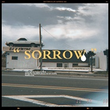

SORROW
============================

|  |  |
| :--: | :-- |
| [ SORROW](https://emumo.xiami.com/album/2104308986) | **艺人**: [凯瑟喵](../index.md) **语种**: 国语 **唱片公司**:  **发行时间**: 2018年12月01日 **专辑类别**: EP, 单曲 **专辑风格**: 梦幻流行 Dream Pop **播放数**: 28140 **收藏数**: 20 **评论数**: 4  |

## 简介

难过也没关系  
  
悲伤的时候就哭出来吧。

## 曲目

## 评论

|  |  |  |  |
| :-- | :-- | :-- | :-- |
|  [虾米用户](https://emumo.xiami.com/u/354663000)  2019-10-13 18:57 赞(0) 踩(0) | 
awsl
 |
|  [虾米用户](https://emumo.xiami.com/u/31531934) 恋の道に近道はない 2018-12-01 20:40 赞(0) 踩(0) | 
get✔
 |
|  [虾米用户](https://emumo.xiami.com/u/254979702)  2018-12-01 13:26 赞(0) 踩(0) | 
boom
 |
|  [虾米用户](https://emumo.xiami.com/u/38847730) 我还没想好要写什么... 2018-12-01 13:08 赞(0) 踩(0) | 
done
 |
