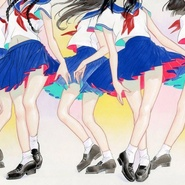
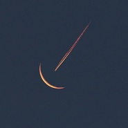
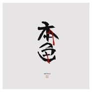
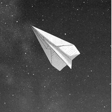
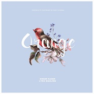

凯瑟喵
============================

|  |  |
| :--: | :-- |
| [ 凯瑟喵](https://i.xiami.com/kaisersama) | **播放数**: 12671629 **粉丝数**: 8272 **评论数**: 173 **地区**: China 中国大陆 **风格**: 另类唱作人 Alternative Singer-Songwriter  |

## 档案

微博：@凯瑟喵

## 专辑

| 名称 | 语种 | 唱片公司 | 发行时间 | 专辑类别 | 专辑风格 |
| :--: | :-- | :-- | :-- | :-- | :-- |
| [ 2019](./albums/2104399899.md) | 纯音乐 |  | 2018年12月31日 | EP, 单曲 | 电子 Electronic |
| [ SORROW](./albums/2104308986.md) | 国语 |  | 2018年12月01日 | EP, 单曲 | 梦幻流行 Dream Pop |
| [ 夜间飞行](./albums/2104131764.md) | 国语 | 独立发行 | 2018年10月21日 | EP, 单曲 | 独立电子乐 Indietronica |
| [ 蜜糖与砒霜](./albums/2104089210.md) | 国语 | 独立发行 | 2018年10月10日 | EP, 单曲 | 梦幻流行 Dream Pop |
| [ 芳心纵火犯](./albums/2103932743.md) | 国语 | 独立发行 | 2018年08月17日 | EP, 单曲 | 流行 Pop |
| [ Midnight](./albums/2103692665.md) | 国语 | 独立发行 | 2018年04月22日 | EP, 单曲 | 国语流行 Mandarin Pop, 流行 Pop |
| [ 宇宙](./albums/2103577533.md) | 国语 | 独立发行 | 2018年03月02日 | EP, 单曲 | 氛围流行 Ambient Pop |
| [ 请用一支玫瑰纪念我](./albums/2103513660.md) | 国语 | 独立发行 | 2018年02月03日 | EP, 单曲 | 流行 Pop |
| [ 爱如探汤](./albums/2103495296.md) | 国语 | 独立发行 | 2018年01月19日 | EP, 单曲 | 流行 Pop |
| [ 本色](./albums/2103472880.md) | 国语 | 独立发行 | 2018年01月09日 | EP, 单曲 | 国语流行 Mandarin Pop |
| [ 2018](./albums/2103472877.md) | 国语 | 独立发行 | 2018年01月09日 | EP, 单曲 | 电子 Electronic |
| [ 虎视眈眈（guitar.ver)](./albums/2102960681.md) | 国语 | 独立发行 | 2017年11月25日 | EP, 单曲 | 流行 Pop |
| [ 谎](./albums/2102953535.md) | 国语 | 独立发行 | 2017年11月21日 | EP, 单曲 | 梦幻流行 Dream Pop |
| [ 关于](./albums/2102906094.md) | 国语 | 独立发行 | 2017年11月06日 | EP, 单曲 | 电音流行 Electropop |
| [ 无名之歌（中文填词）](./albums/2102857835.md) | 国语 | 独立发行 | 2017年09月16日 | EP, 单曲 | 日本流行 J-Pop |
| [ Fallin'](./albums/2102736640.md) | 国语 | 独立发行 | 2017年04月22日 | EP, 单曲 | 电子 Electronic |
| [ 2017](./albums/2102686253.md) | 国语 | 独立发行 | 2017年01月27日 | EP, 单曲 |  |
| [ Solitude](./albums/2102662227.md) | 国语 | 独立发行 | 2016年12月10日 | 录音室专辑 | 致幻流行 Hypnagogic Pop |
| [ 花开](./albums/2102662096.md) | 国语 | 独立发行 | 2016年12月10日 | 录音室专辑 |  |
| [ 写给我第一个喜欢的女孩的歌](./albums/2102662090.md) | 国语 | 独立发行 | 2016年12月09日 | 录音室专辑 | 浩室舞曲 House |
| [ ORANGEオレンジ](./albums/2108399053.md) | 国语 | 独立发行 | 2016年02月27日 | EP, 单曲 | 流行摇滚 Pop Rock |
| [ 越人歌](./albums/2027856518.md) | 国语 | 独立发行 | 2015年03月31日 | EP, 单曲 | 浩室舞曲 House |

## 评论

|  |  |  |  |
| :-- | :-- | :-- | :-- |
|  [虾米用户](https://emumo.xiami.com/u/72860342) 我还没想好要写什么... 2020-10-07 16:26 赞(1) 踩(0) | 
撒野为什么没有了啊   
 |
|  [虾米用户](https://emumo.xiami.com/u/251554833)  2020-08-10 21:43 赞(0) 踩(0) | 
想听撒野，特别喜欢
 |
|  [虾米用户](https://emumo.xiami.com/u/171844044)   2020-08-06 11:12 赞(0) 踩(0) | 
为什么撒野听不了了呀(&amp;acute;Д` )
 |
|  [虾米用户](https://emumo.xiami.com/u/290033622) 自由自私 自私高尚 2020-06-22 10:57 赞(0) 踩(0) | 
#
 |
|  [虾米用户](https://emumo.xiami.com/u/401059801) 朝暮与年岁并往，与你们同... 2020-04-04 17:09 赞(4) 踩(0) | 
想听撒野！！！为啥听不了啊
 |
|  [虾米用户](https://emumo.xiami.com/u/268578434) 最可爱的我，喜欢听歌 2020-03-29 22:28 赞(3) 踩(0) | 
撒野听不到了为什么
 |
|  [虾米用户](https://emumo.xiami.com/u/441666714) 诸事皆宜富贵吉利 2020-03-25 15:53 赞(3) 踩(0) | 
想要要要要要要要撒野！！！！！！！！！！！！！！！！！！！！！
 |
|  [虾米用户](https://emumo.xiami.com/u/440875145) 再见虾米，哪天相见啊 2020-02-26 14:29 赞(2) 踩(0) | 
好想拉起你的手啊
 |
|  [虾米用户](https://emumo.xiami.com/u/503596) 害怕失去，便不再拥有 2020-02-16 22:21 赞(0) 踩(0) | 
宝藏女孩 
 |
|  [虾米用户](https://emumo.xiami.com/u/243179201) 做自己想做的事 听自己喜... 2020-02-06 23:37 赞(0) 踩(0) | 
小姐姐喜欢EXO哎！
 |
|  [虾米用户](https://emumo.xiami.com/u/301218417)  2020-02-04 11:07 赞(0) 踩(0) | 
好想念酥莓的日子啊啊啊啊
 |
|  [虾米用户](https://emumo.xiami.com/u/5892464) 一点浩然气 千里快哉风 2019-12-20 23:27 赞(0) 踩(0) | 
这首歌曲有2011年的感觉
 |
|  [虾米用户](https://emumo.xiami.com/u/308277130) 喵了个咪 2019-09-04 22:57 赞(0) 踩(0) | 
搜撒野发现了你呀
 |
|  [虾米用户](https://emumo.xiami.com/u/428258122) 沉默 2019-09-04 00:24 赞(1) 踩(0) | 
好聽
 |
|  [虾米用户](https://emumo.xiami.com/u/252128097)  2019-07-31 13:50 赞(1) 踩(0) | 
无意间听到了你唱的《越人歌》，声音那么纯净而有张力，喜欢！请继续加油！
 |
|  [虾米用户](https://emumo.xiami.com/u/328657369) 风格随心而变、 2019-07-04 01:55 赞(1) 踩(0) | 

 |
|  [虾米用户](https://emumo.xiami.com/u/289816245) 我还没想好要写什么... 2019-07-02 15:33 赞(1) 踩(0) | 

 |
|  [虾米用户](https://emumo.xiami.com/u/261281334)  随心所欲地听歌  喜欢... 2019-06-30 08:30 赞(1) 踩(0) | 
很早在微博上关注了凯瑟喵，因为你喜欢灿烈，今天找歌时偶然听到了你的歌，大大唱歌好好听
 |
|  [虾米用户](https://emumo.xiami.com/u/45381359) 全世界只剩下風和我 2019-05-10 14:39 赞(2) 踩(0) | 
美宣女孩报道
 |
|  [虾米用户](https://emumo.xiami.com/u/197481148) 代马望北  狐死首丘 2019-04-23 19:47 赞(0) 踩(0) | 
呜呜呜凯瑟今天我们学校放你的歌啦我好开心啊
 |
|  [虾米用户](https://emumo.xiami.com/u/188902054) born in 2002 2019-03-22 21:40 赞(1) 踩(0) | 
以前因为公众号对凯瑟有一点偏见后来慢慢发现喵喵真是一个特别热爱音乐非常优秀的女孩子每首歌我都有仔细听 加油啊 喵喵谢谢你唱歌给我听
 |
|  [虾米用户](https://emumo.xiami.com/u/4487129)  2019-03-16 11:59 赞(0) 踩(0) | 
！！！
 |
|  [虾米用户](https://emumo.xiami.com/u/404798455) 我的维尼 你的皮杰 2019-03-09 21:52 赞(0) 踩(0) | 
一个眼神 到老
 |
|  [虾米用户](https://emumo.xiami.com/u/120324840) 得之 我幸. 2019-03-09 13:30 赞(1) 踩(0) | 
感动
 |
|  [虾米用户](https://emumo.xiami.com/u/188196406) 喜歡獨單 2018-11-17 21:40 赞(0) 踩(0) | 
嗯
 |
|  [虾米用户](https://emumo.xiami.com/u/256198638) 听过的歌，认识的人，见到... 2018-11-17 10:02 赞(0) 踩(0) | 
真的好听
 |
|  [虾米用户](https://emumo.xiami.com/u/313429327) 对未来的慷慨就是投入到现... 2018-11-03 07:02 赞(0) 踩(0) | 

 |
|  [虾米用户](https://emumo.xiami.com/u/32577526)  2018-10-22 18:17 赞(1) 踩(0) | 
撒野入坑 好厉害
 |
|  [虾米用户](https://emumo.xiami.com/u/406016144)  2018-10-14 10:55 赞(4) 踩(0) | 
小姐姐是灿白饭吗？？？是EXO饭吗？
 |
|  [虾米用户](https://emumo.xiami.com/u/356463555)  2018-10-09 03:35 赞(0) 踩(0) | 
失重，光荣，出逃日都没有 
 |
|  [虾米用户](https://emumo.xiami.com/u/354247091) 妾问君心君不语，谁人掠足... 2018-10-02 11:17 赞(9) 踩(0) | 
因为灿白认识，结果在班上推荐歌时，EXO推荐不出去，把你推荐出去了！ 
 |
|  [虾米用户](https://emumo.xiami.com/u/290910470) 再见了，以后加油啊~ 2018-09-29 22:09 赞(0) 踩(0) | 
小姐姐声音好好听 
 |
|  [虾米用户](https://emumo.xiami.com/u/375568256)  2018-09-06 11:08 赞(0) 踩(0) | 
一又二分之一也没有版权啊
 |
|  [虾米用户](https://emumo.xiami.com/u/378376584) 除了你，我是什么都不想要... 2018-08-22 16:20 赞(0) 踩(0) | 
很有辨识度的声音
 |
|  [虾米用户](https://emumo.xiami.com/u/120300852)  2018-07-11 11:32 赞(3) 踩(0) | 
没有白夜....
 |
|  [虾米用户](https://emumo.xiami.com/u/373545776)  2018-07-04 18:00 赞(0) 踩(0) | 
听了一秒就沦陷了 
 |
|  [虾米用户](https://emumo.xiami.com/u/309215562)  2018-06-24 11:26 赞(2) 踩(0) | 
加油啊
 |
|  [虾米用户](https://emumo.xiami.com/u/320467847) 逐渐成长 2018-06-17 23:17 赞(3) 踩(0) | 
想问一下凯瑟喵大大是灿白饭吗她好像唱了好多灿白文的ost
 |
| ⇒ |  [虾米用户](https://emumo.xiami.com/u/196447122) bbh kyr 2018-09-17 13:26 赞(0) 踩(0) | 
是的
 |
|  [虾米用户](https://emumo.xiami.com/u/363647956)  2018-05-25 16:41 赞(0) 踩(0) | 
稳
 |
|  [虾米用户](https://emumo.xiami.com/u/288661012)  2018-05-14 10:36 赞(3) 踩(0) | 
灿白
 |
|  [虾米用户](https://emumo.xiami.com/u/973400) 我还没想好要写什么... 2018-05-05 19:04 赞(0) 踩(0) | 
棒棒糖
 |
|  [虾米用户](https://emumo.xiami.com/u/358598015) 是不是对生活不太满意 2018-04-24 22:15 赞(4) 踩(0) | 
撒野 
 |
|  [虾米用户](https://emumo.xiami.com/u/358235624)  2018-04-14 21:33 赞(3) 踩(0) | 
越人歌听了一年多了，一直搜不到歌手，今天终于找到了，为什么没有照片呢？
 |
| ⇒ |  [虾米用户](https://emumo.xiami.com/u/314677785)  2018-08-08 21:02 赞(0) 踩(0) | 
這位歌手微博有照片
 |
|  [虾米用户](https://emumo.xiami.com/u/188845333)  2018-04-14 19:50 赞(31) 踩(0) | 
因为灿白撒野被你吸引  
 |
|  [虾米用户](https://emumo.xiami.com/u/332409794)  2018-04-11 14:30 赞(0) 踩(0) | 
喵星人
 |
|  [虾米用户](https://emumo.xiami.com/u/356416880) 可孤僻并非生来就有。 2018-04-04 16:55 赞(3) 踩(0) | 
从网易云过来   我还是喜欢喵的声音
 |
|  [虾米用户](https://emumo.xiami.com/u/307231615) 底线边伯贤&EXO 2018-03-29 22:37 赞(0) 踩(0) | 
为什么因为灿白喜欢？有什么关联吗
 |
| ⇒ |  [虾米用户](https://emumo.xiami.com/u/333212040)  2018-04-16 20:54 赞(0) 踩(0) | 
她是EXO粉丝，唱过灿白很多同人文的ost，还有翻唱moster，很好听
 |
| ⇒ |  [虾米用户](https://emumo.xiami.com/u/375568256)  2018-06-17 16:57 赞(0) 踩(0) | 
小姐姐貌似是灿白粉写歌大大
 |
|  [虾米用户](https://emumo.xiami.com/u/329091721) 忘记名字吧，我给你一个家 2018-03-22 23:27 赞(1) 踩(0) | 
喜欢你的撒野 
 |
|  [虾米用户](https://emumo.xiami.com/u/338176615) 小时候叫小可爱，长大了叫... 2018-03-20 21:52 赞(0) 踩(0) | 
喜欢你 加油哦
 |
|  [虾米用户](https://emumo.xiami.com/u/326367656)  2018-03-10 16:26 赞(0) 踩(0) | 
欢迎加入冷涩涩粉丝团，群聊号码：728770924
 |
|  [虾米用户](https://emumo.xiami.com/u/51878514) 我还没想好要写什么... 2018-03-05 23:20 赞(0) 踩(0) | 
喜欢你的声音！
 |
|  [虾米用户](https://emumo.xiami.com/u/309215562)  2018-02-26 18:51 赞(0) 踩(0) | 
加油 
 |
|  [虾米用户](https://emumo.xiami.com/u/267109094)  2018-02-21 21:28 赞(0) 踩(0) | 
好好听 
 |
|  [虾米用户](https://emumo.xiami.com/u/293726248) 엑소&ChanBaek 2018-02-21 18:34 赞(0) 踩(0) | 
灿白同胞报道
 |
|  [虾米用户](https://emumo.xiami.com/u/258284695) 他结婚的时候 新郎会不会... 2018-02-08 15:19 赞(102) 踩(0) | 
因为灿白认识你 但是你的声音真的超级好听。
 |
| ⇒ |  [虾米用户](https://emumo.xiami.com/u/221121579) 故事还长 你先别慌 2018-05-27 22:54 赞(0) 踩(0) | 
SL❤
 |
|  [虾米用户](https://emumo.xiami.com/u/15749767) 我还没想好要写什么... 2018-02-04 04:55 赞(4) 踩(0) | 
声音超级好听
 |
| ⇒ |  [虾米用户](https://emumo.xiami.com/u/256005842)  2018-08-12 16:03 赞(0) 踩(0) | 
你的88VIP好厉害的样子
 |
| ⇒ |  [虾米用户](https://emumo.xiami.com/u/356539580)  2018-09-23 06:48 赞(0) 踩(0) | 
<q><b>唐太宗说：</b></q>
 |
|  [虾米用户](https://emumo.xiami.com/u/251636530) 人间惊鸿客 2018-01-20 08:56 赞(0) 踩(0) | 
好
 |
|  [虾米用户](https://emumo.xiami.com/u/334705573)  2018-01-14 17:09 赞(0) 踩(0) | 
一百零一，给魔力音打call～
 |
|  [虾米用户](https://emumo.xiami.com/u/14813915)  2018-01-04 22:29 赞(0) 踩(0) | 
厉害了虾米！！
 |
|  [虾米用户](https://emumo.xiami.com/u/279517935) 毒爱九锥 2017-12-25 22:52 赞(0) 踩(0) | 
吼吼听！
 |
|  [虾米用户](https://emumo.xiami.com/u/2604553) 抠脚大魔王 2017-12-15 22:00 赞(0) 踩(0) | 
怎么改名了  
 |
|  [虾米用户](https://emumo.xiami.com/u/338996419)  2017-12-09 22:53 赞(1) 踩(0) | 
我想一个眼神就到老~表白狗蛋儿
 |
|  [虾米用户](https://emumo.xiami.com/u/47591664)   2017-12-05 09:46 赞(0) 踩(0) | 
有种Aimer的感觉 似曾相识的deja vu 超级喜欢这种嗓音和&amp;ldquo;谎&amp;rdquo;beat的配合 请再多上传歌曲啦等不及了
 |
|  [虾米用户](https://emumo.xiami.com/u/297061438) 热泪盈眶 长生不老 2017-12-04 20:00 赞(35) 踩(0) | 
好喜欢你啊 你是灿白党吗？ 
 |
|  [虾米用户](https://emumo.xiami.com/u/115257870) 别再塌房子了 2017-11-19 11:14 赞(0) 踩(0) | 
(⋈◍＞◡＜◍)。✧♡
 |
|  [虾米用户](https://emumo.xiami.com/u/9385254) FireBugs 火灾现... 2017-11-18 12:01 赞(0) 踩(0) | 
想听《谎》
 |
|  [虾米用户](https://emumo.xiami.com/u/333671157)  2017-11-07 01:01 赞(4) 踩(0) | 
声音很美，有磁性，一开口就感觉像是夕阳下恋人之间拥抱。暖暖的
 |
|  [虾米用户](https://emumo.xiami.com/u/32560600)   2017-11-04 23:21 赞(1) 踩(0) | 
好听啊歌。喜欢的调调
 |
|  [虾米用户](https://emumo.xiami.com/u/223545212)  2017-10-30 17:03 赞(4) 踩(0) | 
谢谢你的越人歌 
 |
|  [虾米用户](https://emumo.xiami.com/u/3076544)  2017-10-15 12:13 赞(2) 踩(0) | 
想听 谎 ，可惜没有
 |
| ⇒ |  [虾米用户](https://emumo.xiami.com/u/236602734) I LOVE SUMME... 2017-10-15 15:40 赞(0) 踩(0) | 
对对对，我找了半天可惜找不到
 |
| ⇒ |  [虾米用户](https://emumo.xiami.com/u/326506489) Time to tell... 2017-11-17 00:00 赞(0) 踩(0) | 
网易云有
 |
|  [虾米用户](https://emumo.xiami.com/u/318647390)  2017-10-14 13:31 赞(1) 踩(0) | 
女神歌都好听
 |
|  [虾米用户](https://emumo.xiami.com/u/304148328)  2017-10-09 21:28 赞(0) 踩(0) | 
被声音吸引来了
 |
|  [虾米用户](https://emumo.xiami.com/u/254723349) 我姑酌彼兕觥，唯以不永伤... 2017-10-08 02:47 赞(1) 踩(0) | 
啊来表白，，，每首歌都能循环好久！！！
 |
|  [虾米用户](https://emumo.xiami.com/u/296158046) 我以后也会很喜欢很喜欢你... 2017-10-01 18:16 赞(0) 踩(0) | 
谢谢你唱花花的歌
 |
|  [虾米用户](https://emumo.xiami.com/u/187704557) 用一生去爱九个少年，这是... 2017-09-26 05:55 赞(0) 踩(0) | 
想听极乐啊，可惜这首歌不让下载
 |
|  [虾米用户](https://emumo.xiami.com/u/188254701) It's my turn... 2017-09-24 10:35 赞(1) 踩(0) | 
女神  
 |
|  [虾米用户](https://emumo.xiami.com/u/325153509)  2017-09-21 20:40 赞(0) 踩(0) | 
   
 |
|  [虾米用户](https://emumo.xiami.com/u/178801538) 啦啦啦啦啦啦，啦啦啦啦啦... 2017-09-17 10:09 赞(0) 踩(0) | 
最爱kaiser大大
 |
|  [虾米用户](https://emumo.xiami.com/u/195222456) 员力 2017-08-15 11:08 赞(0) 踩(0) | 
特别的喜欢，给特别的凯瑟 
 |
|  [虾米用户](https://emumo.xiami.com/u/6981760) Less is more... 2017-07-19 11:13 赞(2) 踩(0) | 
原创，干净的声音。
 |
|  [虾米用户](https://emumo.xiami.com/u/290033622) 自由自私 自私高尚 2017-07-19 10:14 赞(0) 踩(0) | 
非常喜欢了
 |
|  [虾米用户](https://emumo.xiami.com/u/227498040)   2017-07-13 16:16 赞(2) 踩(0) | 
没有无名之歌和orange 吗？！这两首我最喜欢的歌啊&amp;hellip;&amp;hellip;不过瑟瑟还是很棒啊！加油～
 |
|  [虾米用户](https://emumo.xiami.com/u/5429478) 唯有音乐和亲情不可遗落！ 2017-07-11 09:57 赞(0) 踩(0) | 
真的很棒
 |
| ⇒ |  [虾米用户](https://emumo.xiami.com/u/256005842)  2018-08-12 16:05 赞(0) 踩(0) | 
您也是。加油！
 |
|  [虾米用户](https://emumo.xiami.com/u/304527028)  2017-07-07 13:03 赞(2) 踩(0) | 
我们家的凯瑟啊，是最最棒的小公主了  
 |
|  [虾米用户](https://emumo.xiami.com/u/187381289) 这个人太帅了，什么也没有... 2017-07-02 13:50 赞(57) 踩(0) | 
为什么没有出逃日的ost光荣呢，超喜欢这首啊TT
 |
|  [虾米用户](https://emumo.xiami.com/u/255937555)  2017-06-29 01:18 赞(1) 踩(0) | 
最爱凯瑟 
 |
|  [虾米用户](https://emumo.xiami.com/u/279841066)  2017-06-24 10:43 赞(1) 踩(0) | 
瑟瑟我来了
 |
|  [虾米用户](https://emumo.xiami.com/u/25072965)   2017-06-23 20:03 赞(1) 踩(0) | 
我瑟 
 |
|  [虾米用户](https://emumo.xiami.com/u/304565017)  2017-06-15 13:11 赞(1) 踩(0) | 
瑟瑟!!
 |
|  [虾米用户](https://emumo.xiami.com/u/2418238) weibo: @尤米口 2017-06-15 03:13 赞(0) 踩(0) | 
ʚ&amp;hearts;ɞ
 |
|  [虾米用户](https://emumo.xiami.com/u/206191577) 大风吹丑鬼 山海等烂泥 2017-06-09 22:44 赞(0) 踩(0) | 
  
 |
|  [虾米用户](https://emumo.xiami.com/u/214001711)  2017-05-14 15:52 赞(4) 踩(0) | 
竟然发现了凯瑟大大的虾米号
 |
|  [虾米用户](https://emumo.xiami.com/u/241543003) 他举止彬彬有礼但显冷淡 2017-04-23 20:09 赞(2) 踩(0) | 
好听诶word天，以为就是个普通的翻唱歌手没想到这么棒！！！
 |
|  [虾米用户](https://emumo.xiami.com/u/35808729)  2017-04-11 22:37 赞(0) 踩(0) | 
好听 
 |
|  [虾米用户](https://emumo.xiami.com/u/250614025) 没关系，你也不用给我机会... 2017-03-27 15:29 赞(1) 踩(0) | 
喜欢，大爱你的歌曲。
 |
|  [虾米用户](https://emumo.xiami.com/u/256065430)  2017-02-14 21:18 赞(0) 踩(0) | 
表白～单曲循环中❤fighting！超好听！
 |
|  [虾米用户](https://emumo.xiami.com/u/269969374)  2017-02-02 21:33 赞(0) 踩(0) | 
喜欢嗓音 
 |
|  [虾米用户](https://emumo.xiami.com/u/249895254) 努力会说谎，但努力不会白... 2017-02-02 13:57 赞(0) 踩(0) | 
微博是粉红甘乐酱是什么鬼 
 |
| ⇒ |  [虾米用户](https://emumo.xiami.com/u/227424404)   2017-06-14 21:49 赞(0) 踩(0) | 
瑟瑟应该有两个微博
 |
| ⇒ |  [虾米用户](https://emumo.xiami.com/u/237318117) #CB forever 2017-07-15 18:39 赞(0) 踩(0) | 
不是的，瑟瑟的微博ID是凯瑟喵，B站ID是粉红甘乐酱。
 |
|  [虾米用户](https://emumo.xiami.com/u/18940951) 上个月说的话这个月看了就... 2017-01-08 19:25 赞(0) 踩(0) | 
凯瑟？？？？！
 |
|  [虾米用户](https://emumo.xiami.com/u/179575220) 不甘平凡就要努力才是 2017-01-08 16:33 赞(0) 踩(0) | 
这不是凯瑟吧
 |
| ⇒ |  [虾米用户](https://emumo.xiami.com/u/197653408) 诶？ 2017-01-23 18:48 赞(0) 踩(0) | 
这个是凯瑟～
 |
|  [虾米用户](https://emumo.xiami.com/u/258910595)  2017-01-05 12:50 赞(0) 踩(0) | 
好听。fighting 加油哦。继续支持你哦[带墨镜笑]  
 |
|  [虾米用户](https://emumo.xiami.com/u/200437164) 念湫 2017-01-03 01:32 赞(0) 踩(0) | 
Kaiser改名了？
 |
|  [虾米用户](https://emumo.xiami.com/u/168637406) ... 2017-01-02 18:21 赞(0) 踩(0) | 
女神我来啦
 |
|  [虾米用户](https://emumo.xiami.com/u/215290920) 'ㅅ' 2016-12-20 19:01 赞(0) 踩(0) | 
声音太好听了 有才华还漂亮
 |
|  [虾米用户](https://emumo.xiami.com/u/168043128)  2016-12-12 01:31 赞(0) 踩(0) | 
哇我居然自动关注了诶 嘿嘿好爱你啊瑟瑟    
 |
|  [虾米用户](https://emumo.xiami.com/u/187438081) 不可知论/在远涯辊鸣 2016-12-11 13:52 赞(0) 踩(0) | 
瑟瑟 
 |
|  [虾米用户](https://emumo.xiami.com/u/187438091) 【半闭关】♡陪吴世勋走花... 2016-12-11 01:14 赞(0) 踩(0) | 
我凯瑟
 |
|  [虾米用户](https://emumo.xiami.com/u/124532006)  2016-12-10 23:44 赞(0) 踩(0) | 
你在哪我就在哪
 |
|  [虾米用户](https://emumo.xiami.com/u/206971759) 我们曾走过的路，日光同人... 2016-12-10 09:46 赞(0) 踩(0) | 
瑟瑟，快多放點歌吧，
 |
|  [虾米用户](https://emumo.xiami.com/u/187267435) 夜越黑，星越亮―면면 2016-12-10 09:21 赞(0) 踩(0) | 
瑟瑟！我来爱你了！
 |
|  [虾米用户](https://emumo.xiami.com/u/188693645) 我有你不懂的坚持。 2016-12-10 08:23 赞(0) 踩(0) | 
   
 |
|  [虾米用户](https://emumo.xiami.com/u/206971759) 我们曾走过的路，日光同人... 2016-12-10 07:54 赞(0) 踩(0) | 
瑟瑟，早安啦
 |
|  [虾米用户](https://emumo.xiami.com/u/214495867)  2016-12-10 06:52 赞(0) 踩(0) | 
早安啊瑟瑟
 |
|  [虾米用户](https://emumo.xiami.com/u/53773255) 我还没想好要写什么... 2016-12-10 00:44 赞(0) 踩(0) | 
太好听了，鼓掌
 |
|  [虾米用户](https://emumo.xiami.com/u/92597330) /能饮一杯无 2016-12-10 00:32 赞(0) 踩(0) | 
瑟瑟！
 |
|  [虾米用户](https://emumo.xiami.com/u/207837849)   2016-12-10 00:29 赞(0) 踩(0) | 
凯瑟终于等到你了❤❤❤❤❤❤❤
 |
|  [虾米用户](https://emumo.xiami.com/u/199479752) 团魂。 2016-12-10 00:27 赞(1) 踩(0) | 
5娘网易虾米2333wuli凯瑟儿啊让更多人听到你的歌吧！ 
 |
|  [虾米用户](https://emumo.xiami.com/u/174435076) all for baek... 2016-12-09 23:57 赞(0) 踩(0) | 
表白
 |
|  [虾米用户](https://emumo.xiami.com/u/214476161) Suaviter in ... 2016-12-09 23:01 赞(1) 踩(0) | 
 从5sing到网易云再到虾米   爱您
 |
|  [虾米用户](https://emumo.xiami.com/u/187420288)   2016-12-09 23:01 赞(1) 踩(0) | 
表白瑟瑟！！！！！ 
 |
|  [虾米用户](https://emumo.xiami.com/u/214476161) Suaviter in ... 2016-12-09 23:01 赞(1) 踩(0) | 
    
 |
|  [虾米用户](https://emumo.xiami.com/u/37005542) 嘘。 2016-12-09 22:58 赞(273) 踩(0) | 
我刚入驻了虾米音乐人，欢迎大家来我的个人主页，收听我的最新音乐
 |
| ⇒ |  [虾米用户](https://emumo.xiami.com/u/51561608) 虾米音乐音质非常好，都是... 2017-04-16 01:45 赞(0) 踩(0) | 
恩德 
 |
| ⇒ |  [虾米用户](https://emumo.xiami.com/u/12132063)  2017-09-05 21:46 赞(0) 踩(0) | 
你的声音醇而脆，有烟熏妆的美。 被你撒野感动到了。
 |
| ⇒ |  [虾米用户](https://emumo.xiami.com/u/244940857) 嘿嘿嘿 2017-12-02 13:48 赞(0) 踩(0) | 
加油↖(^&amp;omega;^)↗
 |
| ⇒ |  [虾米用户](https://emumo.xiami.com/u/334705573)  2018-01-14 17:07 赞(0) 踩(0) | 
好听，好听，好听
 |
| ⇒ |  [虾米用户](https://emumo.xiami.com/u/303161449)  2018-01-24 15:25 赞(0) 踩(0) | 
喜欢你
 |
| ⇒ |  [虾米用户](https://emumo.xiami.com/u/12848371) 我还没想好要写什么... 2018-01-25 08:56 赞(0) 踩(0) | 
由撒野入坑，可好听了呢。
 |
| ⇒ |  [虾米用户](https://emumo.xiami.com/u/303408688) 无聊中人 2018-02-09 19:06 赞(0) 踩(0) | 
好的
 |
| ⇒ |  [虾米用户](https://emumo.xiami.com/u/245949504)   2018-02-13 22:10 赞(0) 踩(0) | 
谢谢你的声音  谢谢你的才华
 |
| ⇒ |  [虾米用户](https://emumo.xiami.com/u/252045698) 我v8哦，好卑微一小破团... 2018-08-16 17:33 赞(0) 踩(0) | 
每首歌注明一下出处，尊重版权尊重原唱
 |
| ⇒ |  [虾米用户](https://emumo.xiami.com/u/243179201) 做自己想做的事 听自己喜... 2020-02-06 23:31 赞(0) 踩(0) | 
刚发现的宝藏女孩
 |
|  [虾米用户](https://emumo.xiami.com/u/187157896) BH Family  2016-12-09 22:54 赞(0) 踩(0) | 
哈哈哈哈哈哈哈哈幸好还没卸虾米，可以听越人歌啦
 |
|  [虾米用户](https://emumo.xiami.com/u/85121418) 山有木兮木有枝 2016-12-09 22:54 赞(0) 踩(0) | 
瑟瑟好(´ﾟωﾟ｀)
 |
|  [虾米用户](https://emumo.xiami.com/u/186011242) 我还没想好要写什么... 2016-12-09 22:52 赞(0) 踩(0) | 
瑟瑟我来了！！
 |
|  [虾米用户](https://emumo.xiami.com/u/3455678)  2016-12-08 20:20 赞(1) 踩(0) | 
嗨，凯瑟女神
 |
|  [虾米用户](https://emumo.xiami.com/u/187310614)  2016-11-10 20:11 赞(0) 踩(0) | 
啊为什么没有春鬼OSTQAQ
 |
| ⇒ |  [虾米用户](https://emumo.xiami.com/u/124765030) 喜欢贤 2016-12-12 21:02 赞(0) 踩(0) | 
春鬼ost不是瑟瑟唱的哦 是酥莓里另一个成员 神丁(˶‾᷄ ⁻̫ ‾᷅˵)
 |
|  [虾米用户](https://emumo.xiami.com/u/187562050) i'm not huma... 2016-07-31 11:19 赞(0) 踩(0) | 
啊啊啊啊我凯攻啊声音美哭辣
 |
|  [虾米用户](https://emumo.xiami.com/u/185840169) 生而在世，我很抱歉. 2016-07-26 23:54 赞(65) 踩(0) | 
内容已删除
 |
| ⇒ |  [虾米用户](https://emumo.xiami.com/u/208171994) 【努力才是生存之道】我想... 2016-09-01 23:07 赞(0) 踩(0) | 
没记错的话，词是河唐本人写的(•ө•)♡
 |
| ⇒ |  [虾米用户](https://emumo.xiami.com/u/268249716) 我不是你认为的那个人 2017-07-27 10:06 赞(0) 踩(0) | 
<q><b>德夭说：</b></q>
 |
| ⇒ |  [虾米用户](https://emumo.xiami.com/u/187722410)  2018-02-08 18:47 赞(0) 踩(0) | 
<q><b>德夭说：</b></q>
 |
|  [虾米用户](https://emumo.xiami.com/u/187219840) 一鹿前进，不忘初兴 2016-07-20 21:39 赞(0) 踩(0) | 
超爱凯瑟女神  
 |
|  [虾米用户](https://emumo.xiami.com/u/35897352)  2016-06-16 23:08 赞(0) 踩(0) | 
这首歌真是太好听了！！！
 |
|  [虾米用户](https://emumo.xiami.com/u/98828230) 山有木兮木有枝 心悦君兮... 2016-06-15 21:38 赞(0) 踩(0) | 
刚才看了一遍越人歌 然后似乎不满足 便来一曲越人歌 山有木兮木有枝，心悦君兮君不知。无奈结局并非所想 但已是最好的结局了吧❤
 |
| ⇒ |  [虾米用户](https://emumo.xiami.com/u/35897352)  2016-06-16 23:08 赞(0) 踩(0) | 
可是我听不懂其中之意
 |
| ⇒ |  [虾米用户](https://emumo.xiami.com/u/98828230) 山有木兮木有枝 心悦君兮... 2016-06-16 23:22 赞(0) 踩(0) | 
<q><b>xsmbee说：</b></q>
 |
|  [虾米用户](https://emumo.xiami.com/u/98828230) 山有木兮木有枝 心悦君兮... 2016-06-15 21:34 赞(0) 踩(0) | 
凯瑟凯瑟
 |
|  [虾米用户](https://emumo.xiami.com/u/85179042)  2016-04-19 23:26 赞(0) 踩(0) | 
要哭
 |
|  [虾米用户](https://emumo.xiami.com/u/115340898) 엘 2016-02-19 10:21 赞(0) 踩(0) | 
女神
 |
|  [虾米用户](https://emumo.xiami.com/u/6866315)  2015-10-31 00:11 赞(0) 踩(0) | 
还有她别的歌吗？
 |
| ⇒ |  [虾米用户](https://emumo.xiami.com/u/125204682) ❤ 2016-03-20 16:18 赞(0) 踩(0) | 
5sing，或者网易云音乐凯瑟喵
 |
| ⇒ |  [虾米用户](https://emumo.xiami.com/u/35897352)  2016-06-17 10:22 赞(0) 踩(0) | 
<q><b>秋收冬藏说：</b></q>
 |
| ⇒ |  [虾米用户](https://emumo.xiami.com/u/219098413)  2016-08-27 17:56 赞(0) 踩(0) | 
<q><b>xsmbee说：</b></q>
 |
| ⇒ |  [虾米用户](https://emumo.xiami.com/u/219098413)  2016-08-27 17:57 赞(0) 踩(0) | 
<q><b>xsmbee说：</b></q>
 |
|  [虾米用户](https://emumo.xiami.com/u/52261865) only chanbae... 2015-08-27 19:33 赞(0) 踩(0) | 
凯瑟女神啊啊啊啊啊啊啊
 |
|  [虾米用户](https://emumo.xiami.com/u/50611011)  2015-06-06 17:35 赞(0) 踩(0) | 
我凯瑟女神 
 |
|  [虾米用户](https://emumo.xiami.com/u/45286826)   2015-04-18 21:36 赞(0) 踩(0) | 
好好听.....如果能下就好了
 |
| ⇒ |  [虾米用户](https://emumo.xiami.com/u/50611011)  2015-06-06 17:35 赞(0) 踩(0) | 
可以去5sing下载
 |
|  [虾米用户](https://emumo.xiami.com/u/13704947) 豆瓣见：无悲渊。 2015-04-05 16:38 赞(0) 踩(0) | 
词太美，用得一点也不生涩。
 |
