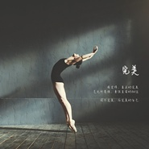

况皓月
============================

|  |  |
| :--: | :-- |
| [ 况皓月](https://i.xiami.com/baekuang) | **播放数**: 5176012 **粉丝数**: 538 **评论数**: 31 **地区**: China 中国大陆 **风格**: 根源唱作人 Singer-Songwriter  |

## 档案

大家好，我是皓月，我是一个独立唱作人兼影视配乐人，去年刚拿到注册音乐治疗师的身份，目前也在做一些相关的工作。 
我出生长大在中国，去美国学音乐之后开始在洛杉矶工作和生活，从事配乐，演出和音乐制作方面的工作，至今大约10年。2017年为了学习音乐治疗搬去了澳洲，期间比较忙碌，就暂停了自己的一些工作，现在总算又开始找到时间，回来做自己喜欢的事。 
我创作的背景配乐大家在很多熟悉的美剧和电影中都可以听到，不时地也会做一些独立音乐人的作品发布。我喜欢的音乐风格包括流行，爵士，R&B，电子以及世界音乐，今年也开始尝试更多的把自己喜欢的音乐风格加入到自己的作品中来。 
个人网站： haoyuemusic.com 
公众号：haoyuemusic 
Instagram:   https://www.instagram.com/haoyuemusic 
Facebook:   https://www.facebook.com/haoyuemusic

## 专辑

| 名称 | 语种 | 唱片公司 | 发行时间 | 专辑类别 | 专辑风格 |
| :--: | :-- | :-- | :-- | :-- | :-- |
| [ 有时候](./albums/5022085067.md) | 国语 | 独立发行 | 2020年12月01日 | EP, 单曲 | 国语流行 Mandarin Pop, 当代节奏布鲁斯 Contemporary R&B, 华语唱作人 Chinese Singer-Songwriter |
| [ 月牙湾](./albums/5021625309.md) | 国语 | 独立发行 | 2020年10月02日 | EP, 单曲 | 国语流行 Mandarin Pop, 流行 Pop, 华语唱作人 Chinese Singer-Songwriter |
| [ 一个人旅行](./albums/5020884723.md) | 国语 | 独立发行 | 2020年06月12日 | EP, 单曲 | 巴萨诺瓦 Bossa Nova, 华语唱作人 Chinese Singer-Songwriter, 国语流行 Mandarin Pop |
| [ 我想念你了，大笨蛋](./albums/5020792927.md) | 国语 | 独立发行 | 2020年06月03日 | EP, 单曲 | 当代唱作人 Contemporary Singer-Songwriter, 华语唱作人 Chinese Singer-Songwriter, 国语流行 Mandarin Pop |
| [ 月狼](./albums/5020639063.md) | 国语 | 独立发行 | 2020年05月12日 | EP, 单曲 | 古风 GuFeng Music, 中国风 China-Wave, 华语唱作人 Chinese Singer-Songwriter |
| [ 完美](./albums/2103749344.md) | 国语 | 独立发行 | 2018年06月14日 | EP, 单曲 | 国语流行 Mandarin Pop, 根源唱作人 Singer-Songwriter, 流行 Pop |
| [ 海岸天际](./albums/2103699072.md) | 国语 | 独立发行 | 2018年04月30日 | EP, 单曲 | 国语流行 Mandarin Pop, 根源唱作人 Singer-Songwriter, 流行 Pop |
| [ Let Me](./albums/2103645536.md) | 英语 | 独立发行 | 2018年03月27日 | EP, 单曲 | 根源唱作人 Singer-Songwriter, 流行 Pop |
| [ 你还记得吗](./albums/1833915419.md) | 国语 | Bae Kuang Music | 2015年06月10日 | EP, 单曲 | 国语流行 Mandarin Pop |
| [ 他和她](./albums/31511516.md) | 国语 | Bae Kuang Music | 2015年05月13日 | EP, 单曲 | 国语流行 Mandarin Pop, 华语唱作人 Chinese Singer-Songwriter |
| [ These Darling Wings](./albums/1731506119.md) | 英语 | Bae Kuang Music | 2014年05月02日 | EP, 单曲 | 爵士流行 Jazz Pop, 当代节奏布鲁斯 Contemporary R&B, 根源唱作人 Singer-Songwriter |
| [ Outsider](./albums/1033213450.md) | 英语 | Bae Kuang Music | 2012年06月20日 | EP, 单曲 | 当代节奏布鲁斯 Contemporary R&B, 根源唱作人 Singer-Songwriter, 成人时代 Adult Contemporary |

## 评论

|  |  |  |  |
| :-- | :-- | :-- | :-- |
|  [虾米用户](https://emumo.xiami.com/u/444736508)  2020-10-03 23:26 赞(0) 踩(0) | 
喜欢
 |
|  [虾米用户](https://emumo.xiami.com/u/194640175) 我想要的，都會有的。 2020-09-11 08:53 赞(1) 踩(0) | 
一叶知秋的日子里单曲循环你唱的（如果是你）这是我一年中最喜欢的季节
 |
|  [虾米用户](https://emumo.xiami.com/u/339083278) 空空如也 2020-07-08 19:34 赞(1) 踩(0) | 
虾米推荐，声音好温暖，好好听
 |
|  [虾米用户](https://emumo.xiami.com/u/21551674)  2020-03-12 01:35 赞(0) 踩(0) | 
开口脆 
 |
|  [虾米用户](https://emumo.xiami.com/u/358104299) 悲观的唯心存在现实解构虚... 2020-02-11 22:13 赞(1) 踩(0) | 
14685
 |
|  [虾米用户](https://emumo.xiami.com/u/5579988)  2020-02-09 02:47 赞(0) 踩(0) | 
爱了
 |
|  [虾米用户](https://emumo.xiami.com/u/436337120) 每一天都是美好的感谢主的... 2020-01-17 09:01 赞(1) 踩(0) | 
真好听啊，希望多听到你的歌！
 |
|  [虾米用户](https://emumo.xiami.com/u/44290058) 希望你的未来像音乐一样缤... 2019-09-10 21:53 赞(1) 踩(0) | 
性感的声音不得不爱
 |
|  [虾米用户](https://emumo.xiami.com/u/293692544) 你敢给我说话吗？我咬你 2019-03-03 07:41 赞(3) 踩(0) | 
好听
 |
|  [虾米用户](https://emumo.xiami.com/u/285413156)  2019-02-28 17:50 赞(2) 踩(0) | 
第一声就抓住耳朵了
 |
|  [虾米用户](https://emumo.xiami.com/u/293692544) 你敢给我说话吗？我咬你 2019-02-07 11:42 赞(1) 踩(0) | 
好听
 |
|  [虾米用户](https://emumo.xiami.com/u/5515891) Ricky_chan 2018-11-09 22:59 赞(1) 踩(0) | 
好听   
 |
|  [虾米用户](https://emumo.xiami.com/u/45489703)  2018-08-27 16:02 赞(1) 踩(0) | 
喜欢你的歌！～偶然听到就迷住了～❤️
 |
|  [虾米用户](https://emumo.xiami.com/u/77463354)  2018-08-22 23:53 赞(1) 踩(0) | 
很棒的声音，希望能多出歌曲
 |
|  [虾米用户](https://emumo.xiami.com/u/302881898) 爱音乐的善良小孩 2018-07-13 19:27 赞(2) 踩(0) | 
声音好棒！！！
 |
|  [虾米用户](https://emumo.xiami.com/u/302979455)  2018-07-09 10:25 赞(3) 踩(0) | 
哇，终于发现学姐了，我在上外合唱团时候你是领唱啊   
 |
|  [虾米用户](https://emumo.xiami.com/u/374537341)  2018-06-03 17:18 赞(1) 踩(0) | 
学姐加油！   
 |
|  [虾米用户](https://emumo.xiami.com/u/9761219) 我还没想好要写什么... 2018-04-10 19:13 赞(3) 踩(0) | 
虾米给我推送了他和她 觉得歌手名字非常熟 回想起来是在昆明偶然看见过你 弹琴教一群小朋友唱歌 非常有爱 声音很赞歌很赞 加油啊！
 |
| ⇒ |  [虾米用户](https://emumo.xiami.com/u/49833419) 自己开心就好 2018-04-30 08:12 赞(0) 踩(0) | 
谢谢 :D
 |
|  [虾米用户](https://emumo.xiami.com/u/706664)   2018-02-13 16:03 赞(2) 踩(0) | 
棒!
 |
|  [虾米用户](https://emumo.xiami.com/u/3147425) 日过中天骄未散 2017-10-28 00:26 赞(4) 踩(0) | 
大学时期在人人网上特别关注的学姐！陪我度过了很多艰难的时候 没想到在虾米可以看到你！感动激动暗涌 皓月加油！
 |
| ⇒ |  [虾米用户](https://emumo.xiami.com/u/49833419) 自己开心就好 2018-03-23 12:55 赞(0) 踩(0) | 
谢谢亲爱的，看到你的留言让我很开心，对不起这么晚才回复你，我之前很长时间都没有更新虾米。希望你的生活也棒棒的，有你想要的一切。
 |
| ⇒ |  [虾米用户](https://emumo.xiami.com/u/3147425) 日过中天骄未散 2018-03-23 14:11 赞(0) 踩(0) | 
<q><b>况皓月说：</b></q>
 |
| ⇒ |  [虾米用户](https://emumo.xiami.com/u/49833419) 自己开心就好 2018-03-27 07:21 赞(0) 踩(0) | 
<q><b>小红莓sol说：</b></q>
 |
|  [虾米用户](https://emumo.xiami.com/u/278428058) 用歌诉说心事⋯⋯ 2017-03-30 03:47 赞(1) 踩(0) | 
好听
 |
|  [虾米用户](https://emumo.xiami.com/u/28214911)  2015-11-03 16:14 赞(1) 踩(0) | 
总有一个声音悸动你，她正如是，与我
 |
|  [虾米用户](https://emumo.xiami.com/u/25658350)  2015-10-31 23:29 赞(2) 踩(0) | 
不错
 |
|  [虾米用户](https://emumo.xiami.com/u/304539) 蘑菇有毒，小心點採。 2015-10-20 12:03 赞(2) 踩(0) | 
第一声就喜欢了
 |
|  [虾米用户](https://emumo.xiami.com/u/1366353)  2015-09-05 23:46 赞(3) 踩(0) | 
好温柔的声音，晚安好梦。
 |
|  [虾米用户](https://emumo.xiami.com/u/44632521) 独立音乐人合辑项目。 2015-06-08 10:02 赞(7) 踩(0) | 
皓月
 |
| ⇒ |  [虾米用户](https://emumo.xiami.com/u/49833419) 自己开心就好 2020-07-14 09:50 赞(0) 踩(0) | 
....5年后终于看到。。。。。。。。回复之慢，实在抱歉……
 |
