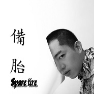
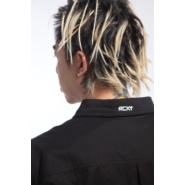

张抽抽
============================

|  |  |
| :--: | :-- |
| [ 张抽抽](https://i.xiami.com/jangyulin) | **播放数**: 2065912 **粉丝数**: 1149 **评论数**: 29 **地区**: China 中国大陆 **风格**: 浩室舞曲 House, 出神舞曲 Trance, 放克电子 Electro (Electro-Funk), 灵魂布鲁斯 Soul Blues, 极简潮 Minimal Wave  |

## 档案

有偿的编曲、后期混音服务、专辑购买、合作邀约等，请私信以或发送电子邮件。  DJNolyn(张抽抽),来自中国重庆的电子音乐人,GES独立音乐厂牌旗下歌手/录音师/混音师.

## 专辑

| 名称 | 语种 | 唱片公司 | 发行时间 | 专辑类别 | 专辑风格 |
| :--: | :-- | :-- | :-- | :-- | :-- |
| [ 备胎](./albums/5021386278.md) | 国语 | 独立发行 | 2020年08月31日 | EP, 单曲 | 未来贝斯 Future Bass |
| [ 够爱2020](./albums/5021341416.md) | 国语 | 独立发行 | 2020年08月25日 | EP, 单曲 | 流行 Pop |
| [ Muma](./albums/2108156602.md) | 国语 | 独立发行 | 2020年03月12日 | EP, 单曲 | 流行摇滚 Pop Rock |
| [ F..k Yeah](./albums/2103889571.md) | 英语 |  | 2017年06月08日 | EP, 单曲 |  |
| [ Time](./albums/2103915072.md) | 英语 |  | 2016年07月11日 | EP, 单曲 |  |
| [ Miss DJ](./albums/2100195454.md) | 国语 | 独立发行 | 2015年09月09日 | EP, 单曲 | 放克电子 Electro (Electro-Funk) |
| [ 海绵宝宝Spongebob(Original Mix)](./albums/2100178457.md) | 其他 | 独立发行 | 2015年08月14日 | EP, 单曲 | 浩室舞曲 House, 放克电子 Electro (Electro-Funk), 智能舞曲 IDM |
| [ 小黄人Minions(Original Mix)](./albums/1637619652.md) | 其他 | 独立发行 | 2015年07月22日 | EP, 单曲 | 放克电子 Electro (Electro-Funk), 独立电子乐 Indietronica |
| [ 西厢 Remix](./albums/2104795195.md) | 国语 |  | 不详 | EP, 单曲 | 未来贝斯 Future Bass |

## 评论

|  |  |  |  |
| :-- | :-- | :-- | :-- |
|  [虾米用户](https://emumo.xiami.com/u/418567356) 事不要做的太过  人不要... 2019-03-30 22:00 赞(1) 踩(0) | 
中国有这些人真好！人才优秀
 |
|  [虾米用户](https://emumo.xiami.com/u/400822237)  2018-12-31 20:38 赞(0) 踩(0) | 
******
 |
| ⇒ |  [虾米用户](https://emumo.xiami.com/u/49710737) 我还没想好要写什么... 2018-12-31 20:38 赞(0) 踩(0) | 
私信
 |
| ⇒ |  [虾米用户](https://emumo.xiami.com/u/400822237)  2018-12-31 20:38 赞(0) 踩(0) | 
******
 |
| ⇒ |  [虾米用户](https://emumo.xiami.com/u/400822237)  2018-12-31 20:39 赞(0) 踩(0) | 
******
 |
|  [虾米用户](https://emumo.xiami.com/u/325374787)  2018-12-31 00:34 赞(1) 踩(0) | 
   
 |
| ⇒ |  [虾米用户](https://emumo.xiami.com/u/49710737) 我还没想好要写什么... 2018-12-31 01:31 赞(0) 踩(0) | 
额
 |
|  [虾米用户](https://emumo.xiami.com/u/280901939) 奮鬥，拼搏 2018-01-09 22:50 赞(0) 踩(0) | 
牛逼啊！
 |
|  [虾米用户](https://emumo.xiami.com/u/260603510) 我还没想好要写什么... 2017-07-16 06:04 赞(1) 踩(0) | 
广东话，狂 
 |
|  [虾米用户](https://emumo.xiami.com/u/291145162) 我就是我，没有吐槽的力量 2017-05-24 18:31 赞(0) 踩(0) | 
厉害了word哥
 |
|  [虾米用户](https://emumo.xiami.com/u/39911427) Live for dis... 2017-02-20 11:35 赞(0) 踩(0) | 
  
 |
|  [虾米用户](https://emumo.xiami.com/u/182387804) 歌单进了小黑屋 2017-02-11 15:49 赞(0) 踩(0) | 
众口难调，我个人是比较欣赏的[文字up]
 |
|  [虾米用户](https://emumo.xiami.com/u/189979223)  2016-06-15 16:43 赞(0) 踩(0) | 
棒棒 
 |
|  [虾米用户](https://emumo.xiami.com/u/99211278)  2016-05-30 12:03 赞(0) 踩(0) | 
A神那首扒得好
 |
|  [虾米用户](https://emumo.xiami.com/u/99211278)  2016-05-30 12:02 赞(0) 踩(0) | 
看到国内电音的希望
 |
|  [虾米用户](https://emumo.xiami.com/u/99211278)  2016-05-30 12:02 赞(0) 踩(0) | 
不错不错
 |
|  [虾米用户](https://emumo.xiami.com/u/104195790)   2016-05-29 14:42 赞(0) 踩(0) | 
好好
 |
|  [虾米用户](https://emumo.xiami.com/u/136685532)  2016-04-07 22:53 赞(0) 踩(0) | 
帅哥
 |
|  [虾米用户](https://emumo.xiami.com/u/53001265)  2016-02-20 18:14 赞(0) 踩(0) | 
很不错  
 |
|  [虾米用户](https://emumo.xiami.com/u/85252076)  2016-01-31 11:54 赞(0) 踩(0) | 
国内有你这艺人真心不错，真有百大的味儿  
 |
| ⇒ |  [虾米用户](https://emumo.xiami.com/u/49710737) 我还没想好要写什么... 2016-02-01 18:06 赞(0) 踩(0) | 
谢谢
 |
| ⇒ |  [虾米用户](https://emumo.xiami.com/u/49710737) 我还没想好要写什么... 2016-02-01 18:08 赞(0) 踩(0) | 
谢谢
 |
|  [虾米用户](https://emumo.xiami.com/u/68245850)  2016-01-22 19:00 赞(0) 踩(0) | 
推荐EDM电音主页：http://<a href="http://i.xiami.com/ivanmix" target="_blank" rel="nofollow noreferrer noopener">http://i.xiami.com/ivanmix</a>
 |
|  [虾米用户](https://emumo.xiami.com/u/50749096)  2015-10-01 22:26 赞(0) 踩(0) | 
ice棒棒
 |
|  [虾米用户](https://emumo.xiami.com/u/37098145) 这个家伙太蠢了不会留下什... 2015-08-26 14:58 赞(0) 踩(0) | 
wk
 |
|  [虾米用户](https://emumo.xiami.com/u/57109558)  2015-08-23 20:56 赞(0) 踩(0) | 
bi站随小黄人而来
 |
|  [虾米用户](https://emumo.xiami.com/u/54353402)  2015-08-03 09:40 赞(0) 踩(0) | 

 |
|  [虾米用户](https://emumo.xiami.com/u/20862728) 柯男 2015-07-31 20:23 赞(1) 踩(0) | 
小黄人！
 |
|  [虾米用户](https://emumo.xiami.com/u/31658125) DJ 2015-06-09 21:50 赞(1) 踩(0) | 
来了
 |
