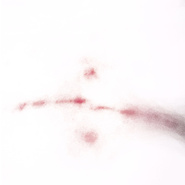
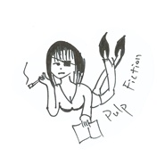

Choitree
============================

|  |  |
| :--: | :-- |
| [ Choitree](https://i.xiami.com/cuiheng) | **地区**: China 中国大陆 **风格**: 独立流行 Indie Pop, 根源唱作人 Singer-Songwriter, 氛围流行 Ambient Pop **播放数**: 2474976 **粉丝数**: 2124 **评论数**: 213  |

## 档案

checkme weibo@Choitree崔恒

## 专辑

| 名称 | 语种 | 唱片公司 | 发行时间 | 专辑类别 | 专辑风格 |
| :--: | :-- | :-- | :-- | :-- | :-- |
| [ Beauty她](./albums/2104327078.md) | 国语 | 独立发行 | 2018年12月05日 | EP, 单曲 | 流行 Pop, 独立流行 Indie Pop, 另类唱作人 Alternative Singer-Songwriter |
| [ FUCK THE MONKFUCK THE MONK](./albums/2103467579.md) | 国语 | 独立发行 | 2018年01月04日 | 录音室专辑 | 独立流行 Indie Pop, 迷幻流行 Psychedelic Pop, 另类唱作人 Alternative Singer-Songwriter |
| [ THE MOON SONGCOVER](./albums/2102858274.md) | 英语 | 独立发行 | 2017年09月16日 | EP, 单曲 | 独立民谣 Indie Folk, 另类唱作人 Alternative Singer-Songwriter |
| [ 秋明海Tyumen](./albums/2102858268.md) | 其他 | 独立发行 | 2017年09月16日 | EP, 单曲 | 后摇 Post-Rock, 器乐流行 Instrumental Pop, 自然采样 Field Recordings |
| [ LONESOME TOWNLONESOME TOWN（Cover：Rick Nelson）](./albums/2102781071.md) | 英语 | 独立发行 | 2017年07月11日 | EP, 单曲 | 独立流行 Indie Pop |
| [ 巴比妥Barbiturate](./albums/2102779697.md) | 国语 | 独立发行 | 2017年07月09日 | EP, 单曲 | 后摇 Post-Rock, 自然采样 Field Recordings, 轻音乐 Easy Listening |
| [ Gondry in Cold NovemberGondry&Cold November（Cover hyukoh／Neo Retros）](./albums/2102744692.md) | 英语 | 独立发行 | 2017年05月08日 | EP, 单曲 | 独立流行 Indie Pop, 另类唱作人 Alternative Singer-Songwriter |
| [ Choitree's soundnotepieces](./albums/2102726451.md) | 国语 | 独立发行 | 2017年04月01日 | 合集, 杂锦 | 自然采样 Field Recordings, 轻音乐 Easy Listening |
| [ HushHush.（Cover：Lasse Lindh）](./albums/2102694205.md) | 英语 | 独立发行 | 2017年02月15日 | EP, 单曲 | 韩国流行 K-Pop, 根源唱作人 Singer-Songwriter, 流行 Pop |

## 评论

|  |  |  |
| :-- | :-- | :-- |
|  [虾米用户](https://emumo.xiami.com/u/48276337) 22世纪不道德 2021-01-21 11:15 赞(0) 踩(0) | 
 
 |
|  [虾米用户](https://emumo.xiami.com/u/354073970) 我还没想好要写什么... 2021-01-13 00:33 赞(0) 踩(0) | 
睡觉了
 |
|  [虾米用户](https://emumo.xiami.com/u/102133446) 音乐不是消耗品 2021-01-08 17:04 赞(0) 踩(0) | 
他可能已经不做音乐了吧
 |
|  [虾米用户](https://emumo.xiami.com/u/181099406) Free. 2021-01-06 12:52 赞(2) 踩(0) | 
虾米快没了 终究没等到专场
 |
|  [虾米用户](https://emumo.xiami.com/u/8704410) 我还没想好要写什么... 2020-11-13 21:42 赞(0) 踩(0) | 
等你live
 |
|  [虾米用户](https://emumo.xiami.com/u/201510440) 我还没想好要写什么... 2020-09-26 22:11 赞(0) 踩(0) | 
等你专场
 |
|  [虾米用户](https://emumo.xiami.com/u/47945470)   2020-09-08 00:22 赞(0) 踩(0) | 
你是我发现的宝藏
 |
|  [虾米用户](https://emumo.xiami.com/u/8993717)   2020-08-27 21:05 赞(0) 踩(0) | 
好温暖
 |
|  [虾米用户](https://emumo.xiami.com/u/344407854) 我还没想好要写什么... 2020-07-30 12:38 赞(0) 踩(0) | 
很棒的声音，很棒的作品
 |
|  [虾米用户](https://emumo.xiami.com/u/34182751) 再见了朋友们 我们网易云... 2020-06-28 00:20 赞(0) 踩(0) | 
？
 |
|  [虾米用户](https://emumo.xiami.com/u/410944984) 像个小女孩努力踮起脚尖想... 2020-06-26 10:48 赞(1) 踩(0) | 
一定要站在你所热爱的世界里闪闪发光
 |
|  [虾米用户](https://emumo.xiami.com/u/410944984) 像个小女孩努力踮起脚尖想... 2020-06-26 10:48 赞(0) 踩(0) | 
好棒
 |
|  [虾米用户](https://emumo.xiami.com/u/73740960)  2020-06-12 10:22 赞(0) 踩(0) | 
。
 |
|  [虾米用户](https://emumo.xiami.com/u/363953074) 我还没想好要写什么... 2020-06-01 10:30 赞(0) 踩(0) | 
真的好好听呀，希望可以一直做音乐
 |
|  [虾米用户](https://emumo.xiami.com/u/432129884) 感谢遇见，无憾再见 2020-05-31 18:45 赞(0) 踩(0) | 
他好温柔，我最爱温柔的人
 |
|  [虾米用户](https://emumo.xiami.com/u/267336239) 来当我的过客 2020-05-14 12:04 赞(1) 踩(0) | 
你开专场了吗
 |
|  [虾米用户](https://emumo.xiami.com/u/427384237) 我还没想好要写什么... 2020-05-10 14:31 赞(0) 踩(0) | 
➕
 |
|  [虾米用户](https://emumo.xiami.com/u/349339882) 后荣迷。努力学习中。 2020-05-06 21:58 赞(0) 踩(0) | 
(*&amp;acute;&amp;forall;｀)
 |
|  [虾米用户](https://emumo.xiami.com/u/25982603)   2020-05-03 21:55 赞(0) 踩(0) | 
先叫一声老公为敬
 |
|  [虾米用户](https://emumo.xiami.com/u/423010257) 互为人间，不如自成宇宙 2020-04-30 15:57 赞(1) 踩(0) | 
又转回来了
 |
|  [虾米用户](https://emumo.xiami.com/u/31480729) 新的开始 . =) 2020-04-17 22:11 赞(0) 踩(0) | 
挖到宝藏了 感谢虾米
 |
|  [虾米用户](https://emumo.xiami.com/u/421578063) fox god 2020-04-12 08:57 赞(0) 踩(0) | 
喜欢哥哥
 |
|  [虾米用户](https://emumo.xiami.com/u/4701540) 我和我爸用一个号，显得我... 2020-04-01 09:08 赞(0) 踩(0) | 
喜欢 
 |
|  [虾米用户](https://emumo.xiami.com/u/1622684) 暂无签名~ 2020-03-29 02:02 赞(0) 踩(0) | 
超喜欢这个声线 听到唱中文歌的时候震惊了，原来是中国哥哥，如获至宝！
 |
|  [虾米用户](https://emumo.xiami.com/u/2447946) 需要阳光音乐 2020-03-08 21:34 赞(0) 踩(0) | 
1710，等午夜专场
 |
|  [虾米用户](https://emumo.xiami.com/u/10890911) 我还没想好要写什么... 2020-03-04 17:15 赞(0) 踩(0) | 

 |
|  [虾米用户](https://emumo.xiami.com/u/13174611) 我还没想好要写什么... 2020-02-18 16:21 赞(0) 踩(0) | 

 |
|  [虾米用户](https://emumo.xiami.com/u/266837)  2020-02-17 19:36 赞(0) 踩(0) | 
好听的
 |
|  [虾米用户](https://emumo.xiami.com/u/9919344) 眼里一片海，我却不肯蓝。 2020-02-12 12:53 赞(0) 踩(0) | 
:)
 |
|  [虾米用户](https://emumo.xiami.com/u/356763773) 我还没想好要写什么... 2020-02-02 20:04 赞(0) 踩(0) | 
~
 |
|  [虾米用户](https://emumo.xiami.com/u/56910580) As You Were ... 2020-01-31 11:42 赞(0) 踩(0) | 
好音乐
 |
|  [虾米用户](https://emumo.xiami.com/u/3439412) 我还没想好要写什么... 2020-01-18 03:44 赞(1) 踩(0) | 
都2020了 还没等来人
 |
|  [虾米用户](https://emumo.xiami.com/u/90850964)  2020-01-13 16:16 赞(0) 踩(0) | 
啊，很巧合地在每日推荐里听到了你的歌，感觉很可爱。麻烦要加油喔！
 |
|  [虾米用户](https://emumo.xiami.com/u/333929301) 我还没想好要写什么... 2019-12-30 14:19 赞(0) 踩(0) | 
爱了
 |
|  [虾米用户](https://emumo.xiami.com/u/188638792) 水乡彩虹 2019-12-12 21:06 赞(2) 踩(0) | 
加油
 |
|  [虾米用户](https://emumo.xiami.com/u/301208116) 垃圾 2019-12-07 20:50 赞(0) 踩(0) | 
郑州，来了的话，要见你
 |
|  [虾米用户](https://emumo.xiami.com/u/255032220) Loving and l... 2019-11-15 01:05 赞(3) 踩(0) | 
不得了，爱上了怎么办
 |
|  [虾米用户](https://emumo.xiami.com/u/37255096) Bye. 2019-10-31 23:37 赞(1) 踩(0) | 
请到广州来
 |
|  [虾米用户](https://emumo.xiami.com/u/1106811) 生而为人 我很抱歉 2019-10-31 14:40 赞(1) 踩(0) | 
我竟然关注了作者在听歌/今天之前
 |
|  [虾米用户](https://emumo.xiami.com/u/226361) 举杯邀明月 2019-10-28 00:37 赞(0) 踩(0) | 
加油哦 我是第1392个
 |
|  [虾米用户](https://emumo.xiami.com/u/49824113) 未登记失踪瑞口 2019-10-25 00:31 赞(0) 踩(0) | 
妈呀发现个宝藏！
 |
|  [虾米用户](https://emumo.xiami.com/u/48837804) 我有想好写什么，但我就是... 2019-10-21 23:44 赞(0) 踩(0) | 
名字怎么念呀！！！
 |
|  [虾米用户](https://emumo.xiami.com/u/4012985) 这家伙一无所有 2019-10-15 08:08 赞(0) 踩(0) | 
专场！专场！专场！
 |
|  [虾米用户](https://emumo.xiami.com/u/34868089)   2019-09-23 21:20 赞(0) 踩(0) | 
等专场呀
 |
|  [虾米用户](https://emumo.xiami.com/u/38747018)   2019-09-13 16:09 赞(1) 踩(0) | 
刚刚突然听到 点进主页一看有个千人之约啊 哈哈哈 我是第1292个 说话算话吗哈哈哈
 |
|  [虾米用户](https://emumo.xiami.com/u/102133446) 音乐不是消耗品 2019-09-11 21:40 赞(0) 踩(0) | 
说好的专场有消息了吗？
 |
|  [虾米用户](https://emumo.xiami.com/u/276944698) 不要自我设限..... 2019-09-11 00:12 赞(1) 踩(0) | 

 |
|  [虾米用户](https://emumo.xiami.com/u/42810132) Aprés l'amou... 2019-09-09 00:20 赞(0) 踩(0) | 
开了啥专场
 |
|  [虾米用户](https://emumo.xiami.com/u/44015836)  2019-08-26 23:23 赞(2) 踩(0) | 
你真是个天才
 |
|  [虾米用户](https://emumo.xiami.com/u/4720330) 值得期待的只有前方 2019-08-24 15:45 赞(1) 踩(0) | 
好听的 加油
 |
|  [虾米用户](https://emumo.xiami.com/u/8523168) Brit Forever 2019-08-11 18:11 赞(2) 踩(0) | 
声音和咬字有一点点像Jack Johnson
 |
|  [虾米用户](https://emumo.xiami.com/u/4732260) 。 2019-08-01 02:24 赞(4) 踩(0) | 
这个骗子 是不是跑了？
 |
|  [虾米用户](https://emumo.xiami.com/u/13111079) 有缘再见 2019-07-27 19:52 赞(0) 踩(0) | 
✔︎
 |
|  [虾米用户](https://emumo.xiami.com/u/187617264) 不要试图接近我 2019-07-27 00:06 赞(2) 踩(0) | 
好喜欢呀
 |
|  [虾米用户](https://emumo.xiami.com/u/26094204) 别把我关在门外 2019-07-24 21:07 赞(1) 踩(0) | 
加油你是最棒的！
 |
|  [虾米用户](https://emumo.xiami.com/u/42963872) 我还没想好要写什么... 2019-07-22 21:44 赞(0) 踩(0) | 
-
 |
|  [虾米用户](https://emumo.xiami.com/u/321080996) No other man... 2019-07-06 22:03 赞(0) 踩(0) | 
厦门专场 我等着啊啊啊啊啊啊啊啊
 |
|  [虾米用户](https://emumo.xiami.com/u/43185067) 浮萍 2019-07-05 21:46 赞(0) 踩(0) | 
北京有专场么
 |
|  [虾米用户](https://emumo.xiami.com/u/332184978) 我还没想好要写什么... 2019-07-05 01:28 赞(0) 踩(0) | 
我是1111，哈哈哈哈，关注以后我就成万年老光棍了
 |
|  [虾米用户](https://emumo.xiami.com/u/15294499) 暂无签名~ 2019-06-29 12:02 赞(0) 踩(0) | 
wow！
 |
|  [虾米用户](https://emumo.xiami.com/u/2165528)   2019-06-27 16:49 赞(0) 踩(0) | 
你太可爱了
 |
|  [虾米用户](https://emumo.xiami.com/u/2410552)  2019-06-27 11:43 赞(1) 踩(0) | 
怎么可以这么好听
 |
|  [虾米用户](https://emumo.xiami.com/u/40975819) 嗯，完犊子了。 2019-06-21 11:18 赞(0) 踩(0) | 
992
 |
|  [虾米用户](https://emumo.xiami.com/u/402206683)  2019-06-18 21:50 赞(1) 踩(0) | 
喜欢你的歌，安静又不失力量，独立又不觉孤单……坚定饱满……继续加油
 |
|  [虾米用户](https://emumo.xiami.com/u/201391232) 最快的方法是先抱抱 2019-06-18 04:18 赞(0) 踩(0) | 
彡
 |
|  [虾米用户](https://emumo.xiami.com/u/336404156)  2019-06-15 00:09 赞(0) 踩(0) | 
坚持下去！！！
 |
|  [虾米用户](https://emumo.xiami.com/u/228843687) 懒惰统治人间 2019-06-13 15:09 赞(0) 踩(0) | 

 |
|  [虾米用户](https://emumo.xiami.com/u/6403695) I am what I ... 2019-06-12 13:23 赞(0) 踩(0) | 
请来南京！谢谢！
 |
|  [虾米用户](https://emumo.xiami.com/u/5798584)   2019-06-03 15:57 赞(0) 踩(0) | 
太棒啦！！！有专场啦！
 |
|  [虾米用户](https://emumo.xiami.com/u/102133446) 音乐不是消耗品 2019-06-02 19:55 赞(0) 踩(0) | 
何时专场
 |
|  [虾米用户](https://emumo.xiami.com/u/181099406) Free. 2019-06-02 00:41 赞(1) 踩(0) | 
西安也想拥有姓名
 |
|  [虾米用户](https://emumo.xiami.com/u/17691156) あなたに出会えて よかっ... 2019-06-01 12:48 赞(2) 踩(0) | 
亲眼看着200+粉丝到1k 所以，专场有广州吗
 |
| ⇒ |  [虾米用户](https://emumo.xiami.com/u/44909921)  2019-06-02 20:47 赞(0) 踩(0) | 
广州＋1
 |
|  [虾米用户](https://emumo.xiami.com/u/9882024) 直到你发现  我 （再也... 2019-05-31 17:19 赞(0) 踩(0) | 
给你时间  一切如初 
 |
|  [虾米用户](https://emumo.xiami.com/u/255766962) 我的大脑去哪了？ 2019-05-29 16:01 赞(0) 踩(0) | 
求广州
 |
|  [虾米用户](https://emumo.xiami.com/u/53745958) 我还没想好要写什么... 2019-05-29 05:01 赞(1) 踩(0) | 
1002啦！！
 |
|  [虾米用户](https://emumo.xiami.com/u/181099406) Free. 2019-05-29 01:40 赞(1) 踩(0) | 
开专场！！
 |
|  [虾米用户](https://emumo.xiami.com/u/45686435) 一壺飛鳧 尋山夢鶴   ... 2019-05-29 01:31 赞(1) 踩(0) | 
现场见！！！
 |
|  [虾米用户](https://emumo.xiami.com/u/13968695) @cho1tree 2019-05-29 01:25 赞(67) 踩(0) | 
---------- 从15年我有了第一个虾米的账号，到19年的今天，过去了四年多的时间。我很庆幸我至今仍保留着少年时对音乐的无限热忱以及创作的初心，更庆幸的是你们喜欢这样的我和这些作品。当初无心的承诺，本以为不会实现。我其实从来没想过真的会有这么一天，更没想过该如何迎接这一天的到来。给我点时间，一切如初！ 感谢你的陪伴，一千分之一！ 见字如面 @Choitree 2019年5月19日于京。 ----------
 |
| ⇒ |  [虾米用户](https://emumo.xiami.com/u/192082440) 我还没想好要写什么... 2019-06-12 00:56 赞(0) 踩(0) | 
會一直等你！
 |
| ⇒ |  [虾米用户](https://emumo.xiami.com/u/12878826) 谢谢陪伴 再见哦！ 2019-08-04 08:35 赞(0) 踩(0) | 
你的声音很温暖
 |
| ⇒ |  [虾米用户](https://emumo.xiami.com/u/281313030) 在这里漂流了很久，后会有... 2020-12-27 09:15 赞(0) 踩(0) | 
加油
 |
|  [虾米用户](https://emumo.xiami.com/u/45686435) 一壺飛鳧 尋山夢鶴   ... 2019-05-28 09:49 赞(0) 踩(0) | 
还有三个！！ 期待 ！！
 |
|  [虾米用户](https://emumo.xiami.com/u/192082440) 我还没想好要写什么... 2019-05-28 00:31 赞(0) 踩(0) | 
我真的要見你了嗎！！！！！哭了！！！我等了好久好久 
 |
|  [虾米用户](https://emumo.xiami.com/u/49030024) Heureux de v... 2019-05-27 17:29 赞(0) 踩(0) | 
No.996
 |
|  [虾米用户](https://emumo.xiami.com/u/8200350) Sparkling wi... 2019-05-24 14:31 赞(0) 踩(0) | 
为你的专场出一份关注
 |
|  [虾米用户](https://emumo.xiami.com/u/321080996) No other man... 2019-05-21 10:29 赞(0) 踩(0) | 
还差38人 ！！！ 厦门！厦门！厦门！厦门！啊啊啊 
 |
|  [虾米用户](https://emumo.xiami.com/u/5149336)  2019-05-20 00:24 赞(0) 踩(0) | 
哈哈哈 来成都吗
 |
|  [虾米用户](https://emumo.xiami.com/u/13465367) RANDOMSIDE 2019-05-18 23:28 赞(0) 踩(0) | 
期待一个北京的专场
 |
|  [虾米用户](https://emumo.xiami.com/u/419844543) BAD GUY !!! 2019-05-17 19:52 赞(0) 踩(0) | 
专场来广州！！！
 |
|  [虾米用户](https://emumo.xiami.com/u/312820569) Pshyq 2019-05-16 15:59 赞(0) 踩(0) | 
️
 |
|  [虾米用户](https://emumo.xiami.com/u/1333187) 这家伙很聪明什么也没留下 2019-05-15 21:03 赞(0) 踩(0) | 
很棒耶 来广州开专场叭hhhh
 |
|  [虾米用户](https://emumo.xiami.com/u/411058641) 取之不尽 用之不竭 2019-05-14 16:34 赞(0) 踩(0) | 
哈哈哈红红火火恍恍惚惚当时才五十多 真的快到一千了 加油！答应的事别忘记！
 |
|  [虾米用户](https://emumo.xiami.com/u/249928328) rock your so... 2019-05-13 23:38 赞(0) 踩(0) | 
哈哈哈 路人支持下你，歌也太好听了吧
 |
|  [虾米用户](https://emumo.xiami.com/u/121910914) 我想好好睡个觉 2019-05-10 02:41 赞(0) 踩(0) | 
❤️
 |
|  [虾米用户](https://emumo.xiami.com/u/9115216) 我还没想好要写什么... 2019-05-09 18:04 赞(0) 踩(0) | 
等深圳  
 |
|  [虾米用户](https://emumo.xiami.com/u/102133446) 音乐不是消耗品 2019-05-09 17:01 赞(0) 踩(0) | 
专场我们不见不散
 |
|  [虾米用户](https://emumo.xiami.com/u/344018512) 我还没想好要写什么... 2019-05-09 09:24 赞(0) 踩(0) | 
哈哈，专场
 |
|  [虾米用户](https://emumo.xiami.com/u/17622943) 我还没想好要写什么... 2019-05-09 04:51 赞(0) 踩(0) | 
专场专场专场！
 |
|  [虾米用户](https://emumo.xiami.com/u/48895134) 直内方外 2019-05-09 01:53 赞(0) 踩(0) | 
哈哈哈哈 专场来杭州吧，有时间就去捧场
 |
|  [虾米用户](https://emumo.xiami.com/u/26094204) 别把我关在门外 2019-05-09 00:31 赞(1) 踩(0) | 
朝鲜！！请一定要安排上！
 |
|  [虾米用户](https://emumo.xiami.com/u/96775922) 天真有邪 2019-05-09 00:25 赞(1) 踩(0) | 
那来武汉吧！
 |
|  [虾米用户](https://emumo.xiami.com/u/336176537)  2019-05-08 23:48 赞(1) 踩(0) | 
等你哦
 |
|  [虾米用户](https://emumo.xiami.com/u/45686435) 一壺飛鳧 尋山夢鶴   ... 2019-05-08 23:44 赞(1) 踩(0) | 
长沙长沙长沙！！ ball ball u！！！
 |
|  [虾米用户](https://emumo.xiami.com/u/9882024) 直到你发现  我 （再也... 2019-05-08 23:43 赞(1) 踩(0) | 
加油  希望可以去看你的专场
 |
|  [虾米用户](https://emumo.xiami.com/u/85848010) 不知何时又会再忆起 2019-05-08 23:42 赞(1) 踩(0) | 
上海杭州！
 |
|  [虾米用户](https://emumo.xiami.com/u/338032733) 極 度 理 智 2019-05-08 23:39 赞(1) 踩(0) | 
開心！坐等專場啊！hhhhhhh
 |
|  [虾米用户](https://emumo.xiami.com/u/32695431) 你他娘的就是一只狗 2019-05-08 23:37 赞(2) 踩(0) | 
武漢場預定！！
 |
|  [虾米用户](https://emumo.xiami.com/u/50093825) 。 2019-05-08 03:10 赞(0) 踩(0) | 
: )
 |
|  [虾米用户](https://emumo.xiami.com/u/53745958) 我还没想好要写什么... 2019-05-05 01:09 赞(0) 踩(0) | 
哭哭 太温柔了叭
 |
|  [虾米用户](https://emumo.xiami.com/u/14265718) wx:osakarock... 2019-05-02 15:55 赞(0) 踩(0) | 
好听
 |
|  [虾米用户](https://emumo.xiami.com/u/321080996) No other man... 2019-04-28 00:12 赞(1) 踩(0) | 
等你专场 希望在厦门 
 |
|  [虾米用户](https://emumo.xiami.com/u/9569859) 行吧 2019-04-24 21:21 赞(0) 踩(0) | 
好好听！
 |
|  [虾米用户](https://emumo.xiami.com/u/1154949) 我想在虾米找个男朋友啊 2019-04-24 07:47 赞(0) 踩(0) | 
我靠，声音这么好听的
 |
|  [虾米用户](https://emumo.xiami.com/u/4732260) 。 2019-04-24 02:37 赞(0) 踩(0) | 
等你开专场
 |
|  [虾米用户](https://emumo.xiami.com/u/322523580) 夜空 总有更大密度的蓝色 2019-04-23 22:23 赞(1) 踩(0) | 
这声音 对于现在的我 再适合不过了 现在连用钢琴曲缓解悲伤都似乎有抗药性了 我害怕 迟早有一天 对所有东西都产生抗药性 痛苦至死
 |
|  [虾米用户](https://emumo.xiami.com/u/48895134) 直内方外 2019-04-22 20:31 赞(0) 踩(0) | 
日推，可还行，助力专场，哈哈哈哈哈哈
 |
|  [虾米用户](https://emumo.xiami.com/u/4487129)  2019-04-20 08:55 赞(0) 踩(0) | 
！！！
 |
|  [虾米用户](https://emumo.xiami.com/u/4486462) 不和听垃圾的人做朋友。 2019-04-18 16:16 赞(0) 踩(0) | 
中文英文两种感觉耶。
 |
|  [虾米用户](https://emumo.xiami.com/u/344018512) 我还没想好要写什么... 2019-04-17 00:23 赞(0) 踩(0) | 

 |
|  [虾米用户](https://emumo.xiami.com/u/6280906)   2019-04-10 20:54 赞(0) 踩(0) | 
好好听 好喜欢你的声音 希望能听到更多的作品呦 加油
 |
|  [虾米用户](https://emumo.xiami.com/u/34577430)   2019-04-10 04:59 赞(0) 踩(0) | 
声音真好听鸭！喜欢！
 |
|  [虾米用户](https://emumo.xiami.com/u/49772249) 咕yin 2019-04-02 16:13 赞(0) 踩(0) | 
啊啊啊啊
 |
|  [虾米用户](https://emumo.xiami.com/u/531610)   2019-04-01 17:20 赞(2) 踩(0) | 
声音骚骚的，被推了，以为发现一首好听的外国歌手，结果被惊喜，自己人，更要捧了。回去翻这首lonesome town好听
 |
|  [虾米用户](https://emumo.xiami.com/u/102133446) 音乐不是消耗品 2019-04-01 11:37 赞(1) 踩(0) | 
大家快关注他啊
 |
|  [虾米用户](https://emumo.xiami.com/u/330038409)  2019-04-01 08:10 赞(2) 踩(0) | 
无意中听到的声音，很惊艳很撩人
 |
|  [虾米用户](https://emumo.xiami.com/u/9597157) ， 2019-03-31 23:41 赞(1) 踩(0) | 
助力 等你的专场
 |
|  [虾米用户](https://emumo.xiami.com/u/37003070) 我还没想好要写什么... 2019-03-29 09:21 赞(1) 踩(0) | 
喜欢你的声音
 |
|  [虾米用户](https://emumo.xiami.com/u/234521833) (〃ﾉωﾉ) 2019-03-28 15:29 赞(1) 踩(0) | 
好好听！！等你一千关注的专场哈哈哈
 |
|  [虾米用户](https://emumo.xiami.com/u/192082440) 我还没想好要写什么... 2019-03-27 00:38 赞(2) 踩(0) | 
每天都來看一次 什麼時候才有一千關注 
 |
|  [虾米用户](https://emumo.xiami.com/u/296697622)   2019-03-26 14:22 赞(1) 踩(0) | 
有点棒有点棒
 |
|  [虾米用户](https://emumo.xiami.com/u/96775922) 天真有邪 2019-03-26 01:24 赞(2) 踩(0) | 
第一次听我还以为会是个日本的乐队，风格很赞
 |
|  [虾米用户](https://emumo.xiami.com/u/91367708)  2019-03-25 22:03 赞(1) 踩(0) | 
你的微博找不到了
 |
|  [虾米用户](https://emumo.xiami.com/u/411058641) 取之不尽 用之不竭 2019-03-25 13:03 赞(2) 踩(0) | 
hhhh
 |
|  [虾米用户](https://emumo.xiami.com/u/192082440) 我还没想好要写什么... 2019-03-24 00:59 赞(1) 踩(0) | 
太喜歡你了！！
 |
|  [虾米用户](https://emumo.xiami.com/u/226602568) 拥有快乐 2019-03-23 16:26 赞(1) 踩(0) | 
Omg，现在才发现，声音也太温柔了吧！
 |
|  [虾米用户](https://emumo.xiami.com/u/352367666)  2019-03-22 21:50 赞(1) 踩(0) | 
开始等专场*٩(๑´∀`๑)ง*。
 |
|  [虾米用户](https://emumo.xiami.com/u/248747748)   2019-03-21 03:42 赞(1) 踩(0) | 
超好听！
 |
|  [虾米用户](https://emumo.xiami.com/u/122916982)  2019-03-20 13:37 赞(1) 踩(0) | 
循环了两天了，喜欢，喜欢的感觉让人欣喜，想哭想笑，让人深刻
 |
|  [虾米用户](https://emumo.xiami.com/u/39463329) 品味没用，要创造 2019-03-20 00:42 赞(1) 踩(0) | 
爱了
 |
|  [虾米用户](https://emumo.xiami.com/u/31892749) 他很懒，他什么都没写。 2019-03-18 10:17 赞(1) 踩(0) | 
1k阻力
 |
|  [虾米用户](https://emumo.xiami.com/u/255766962) 我的大脑去哪了？ 2019-03-16 17:29 赞(1) 踩(0) | 
为1k助力
 |
|  [虾米用户](https://emumo.xiami.com/u/52399377) 其他歌不再有耐心听 2019-03-16 13:18 赞(1) 踩(0) | 
这么撩人的嘛
 |
|  [虾米用户](https://emumo.xiami.com/u/7007110) 我爱过那位像我的人。 2019-03-15 16:21 赞(1) 踩(0) | 
加油早到1K
 |
|  [虾米用户](https://emumo.xiami.com/u/5149336)  2019-03-15 14:42 赞(1) 踩(0) | 
加快专场进度 
 |
|  [虾米用户](https://emumo.xiami.com/u/34971965) 如果说一朵花很美/那么我... 2019-03-14 20:25 赞(1) 踩(0) | 
等你的专场
 |
|  [虾米用户](https://emumo.xiami.com/u/292484097)   2019-03-11 01:04 赞(1) 踩(0) | 
离专场还有一半！加油！
 |
|  [虾米用户](https://emumo.xiami.com/u/113931210) 这家伙很懒什么也没留下.... 2019-03-09 23:40 赞(1) 踩(0) | 
日推入坑的
 |
|  [虾米用户](https://emumo.xiami.com/u/7036044) 温净岁月，冷暖自知。 2019-03-09 16:15 赞(2) 踩(0) | 
日推今日听到的音乐人 再而因为这个名字多看了两眼，然后就记得了
 |
|  [虾米用户](https://emumo.xiami.com/u/14466905) Sound to nev... 2019-03-08 21:43 赞(1) 踩(0) | 
三八节
 |
|  [虾米用户](https://emumo.xiami.com/u/9902531) 浪漫指南 2019-03-08 02:47 赞(2) 踩(0) | 

 |
|  [虾米用户](https://emumo.xiami.com/u/70864)  2019-03-07 23:51 赞(1) 踩(0) | 
很好听的声音呀，很好的发音，也是自己弹的吉他么？虾米日推愈发精准呢
 |
|  [虾米用户](https://emumo.xiami.com/u/39242960) 未来有更好的自己在等待 2019-03-05 18:57 赞(0) 踩(0) | 
冲冲冲
 |
|  [虾米用户](https://emumo.xiami.com/u/3358490) 我只关注和我共同爱好超3... 2019-03-02 15:52 赞(0) 踩(0) | 
希望你早日粉丝达到1000惹
 |
|  [虾米用户](https://emumo.xiami.com/u/336782559)  2019-02-19 20:37 赞(0) 踩(0) | 
夸！
 |
|  [虾米用户](https://emumo.xiami.com/u/375335072) ☹ 2019-02-14 06:25 赞(0) 踩(0) | 
♡
 |
|  [虾米用户](https://emumo.xiami.com/u/8894766) 瞎听。 2019-02-12 11:44 赞(0) 踩(0) | 

 |
|  [虾米用户](https://emumo.xiami.com/u/281223628)  2019-02-12 00:25 赞(0) 踩(0) | 
好听
 |
|  [虾米用户](https://emumo.xiami.com/u/9028760) 豆瓣见 spotify ... 2019-02-06 18:18 赞(0) 踩(0) | 
(._.)
 |
|  [虾米用户](https://emumo.xiami.com/u/33250133)  无。 2019-02-04 14:47 赞(0) 踩(0) | 
好的
 |
|  [虾米用户](https://emumo.xiami.com/u/356048642) lay sj kv da... 2019-01-27 01:39 赞(1) 踩(0) | 
加油 your voice is awesome
 |
|  [虾米用户](https://emumo.xiami.com/u/45686435) 一壺飛鳧 尋山夢鶴   ... 2019-01-26 03:44 赞(0) 踩(0) | 
哇哦
 |
|  [虾米用户](https://emumo.xiami.com/u/55398933) till&still  2019-01-12 12:37 赞(0) 踩(0) | 
you are great
 |
|  [虾米用户](https://emumo.xiami.com/u/9882024) 直到你发现  我 （再也... 2019-01-03 23:28 赞(0) 踩(0) | 
新年快乐
 |
|  [虾米用户](https://emumo.xiami.com/u/47030198) 浪漫无处消磨 无聊伴着生... 2019-01-03 16:23 赞(0) 踩(0) | 
微博上choi树叔叔 搜不到了 换账号了吗？
 |
|  [虾米用户](https://emumo.xiami.com/u/52415194) ♬♩♫♪♡ 2018-12-31 05:41 赞(0) 踩(0) | 
～
 |
|  [虾米用户](https://emumo.xiami.com/u/4097) 微博/公众号请搜「泼墨斯... 2018-12-29 16:40 赞(0) 踩(0) | 
你好 不知道你愿不愿意在我做的公众号上分享自己的作品 说说你的想法 如果希望 可以发消息给我 谢了。
 |
|  [虾米用户](https://emumo.xiami.com/u/1850627) Unisex 2018-12-24 15:39 赞(0) 踩(0) | 
嗯 几好 加油
 |
|  [虾米用户](https://emumo.xiami.com/u/45272775) Naked all th... 2018-12-05 17:31 赞(0) 踩(0) | 
等新歌……
 |
|  [虾米用户](https://emumo.xiami.com/u/17691156) あなたに出会えて よかっ... 2018-12-03 15:07 赞(1) 踩(0) | 
不是今天发新歌吗hhhh
 |
| ⇒ |  [虾米用户](https://emumo.xiami.com/u/13968695) @cho1tree 2018-12-03 16:43 赞(0) 踩(0) | 
封面还没做好哈哈哈哈哈哈哈
 |
|  [虾米用户](https://emumo.xiami.com/u/4258378) 我还没想好要写什么... 2018-10-31 22:16 赞(1) 踩(0) | 
棒
 |
|  [虾米用户](https://emumo.xiami.com/u/980307)   2018-10-25 08:36 赞(3) 踩(0) | 
为1k助力 
 |
|  [虾米用户](https://emumo.xiami.com/u/17691156) あなたに出会えて よかっ... 2018-10-10 10:38 赞(2) 踩(0) | 
hhhhhh 如果没有女票的话想去应聘！
 |
|  [虾米用户](https://emumo.xiami.com/u/47815565)  2018-08-06 01:51 赞(0) 踩(0) | 
理想中的男友声音  
 |
|  [虾米用户](https://emumo.xiami.com/u/9882024) 直到你发现  我 （再也... 2018-03-16 23:24 赞(1) 踩(0) | 
等你的五六首歌  等你
 |
|  [虾米用户](https://emumo.xiami.com/u/46960248) Cor cordium. 2018-03-03 22:57 赞(1) 踩(0) | 
哇塞！
 |
|  [虾米用户](https://emumo.xiami.com/u/6176688) 你比巴甜少一甜 2018-02-27 21:20 赞(2) 踩(0) | 
1/1000助力專場
 |
|  [虾米用户](https://emumo.xiami.com/u/331974707) 我还没想好要写什么... 2017-12-23 15:15 赞(1) 踩(0) | 
好听
 |
|  [虾米用户](https://emumo.xiami.com/u/337468260)  2017-12-21 20:36 赞(2) 踩(0) | 
惊闻仙声
 |
|  [虾米用户](https://emumo.xiami.com/u/281266721) 记仇 善良 可恶 幼稚 ... 2017-11-28 16:01 赞(1) 踩(0) | 
1k分之一
 |
|  [虾米用户](https://emumo.xiami.com/u/286081824) 我还没想好要写什么... 2017-11-23 21:40 赞(2) 踩(0) | 
耳朵醉了&amp;hellip;&amp;hellip;
 |
|  [虾米用户](https://emumo.xiami.com/u/198935612) 我很喜欢韩国呢 2017-11-22 22:34 赞(1) 踩(0) | 
谢谢你救了我。 幸好我遇见了你。
 |
|  [虾米用户](https://emumo.xiami.com/u/36229899) 违章动物 2017-11-19 01:00 赞(1) 踩(0) | 
-
 |
|  [虾米用户](https://emumo.xiami.com/u/9882024) 直到你发现  我 （再也... 2017-11-16 11:45 赞(1) 踩(0) | 
被迷住了 
 |
|  [虾米用户](https://emumo.xiami.com/u/9882024) 直到你发现  我 （再也... 2017-11-16 11:29 赞(0) 踩(0) | 
还好让我听到你   
 |
|  [虾米用户](https://emumo.xiami.com/u/7944656)  2017-11-06 10:41 赞(0) 踩(0) | 
喜欢
 |
|  [虾米用户](https://emumo.xiami.com/u/20849831) zZz 2017-07-05 00:21 赞(0) 踩(0) | 
好听 好听 加油
 |
|  [虾米用户](https://emumo.xiami.com/u/54570261) Common avers... 2017-07-02 20:00 赞(0) 踩(0) | 
可以算是第一批粉丝吗棒棒哒
 |
|  [虾米用户](https://emumo.xiami.com/u/215458574)  2017-06-11 14:49 赞(0) 踩(0) | 
喜欢你的声音
 |
|  [虾米用户](https://emumo.xiami.com/u/52299637)  2017-04-06 10:33 赞(0) 踩(0) | 
好听，棒   
 |
|  [虾米用户](https://emumo.xiami.com/u/224990409)   2017-02-19 19:35 赞(0) 踩(0) | 
已献上膝盖   
 |
|  [虾米用户](https://emumo.xiami.com/u/4400366) 再也不见 2015-07-31 21:34 赞(33) 踩(0) | 
我来了，我听了，我不走了
 |
| ⇒ |  [虾米用户](https://emumo.xiami.com/u/13968695) @cho1tree 2015-08-15 18:28 赞(0) 踩(0) | 
hao！HAO!
 |
|  [虾米用户](https://emumo.xiami.com/u/54105890)  2015-07-31 21:19 赞(0) 踩(0) | 
唱腔酷
 |
|  [虾米用户](https://emumo.xiami.com/u/54072051)  2015-07-31 16:03 赞(0) 踩(0) | 
间奏好听！
 |
|  [虾米用户](https://emumo.xiami.com/u/54072637)  2015-07-31 16:01 赞(0) 踩(0) | 
喜欢!
 |
|  [虾米用户](https://emumo.xiami.com/u/52615992)  2015-07-31 02:29 赞(1) 踩(0) | 
好听！！！！
 |
|  [虾米用户](https://emumo.xiami.com/u/50221512) 我是美丽的一老师~ 2015-07-31 02:09 赞(1) 踩(0) | 
酷
 |
|  [虾米用户](https://emumo.xiami.com/u/46486014)   2015-07-28 10:13 赞(1) 踩(0) | 
赞赞赞啊 
 |
| ⇒ |  [虾米用户](https://emumo.xiami.com/u/13968695) @cho1tree 2015-08-15 18:29 赞(0) 踩(0) | 
肖老师你好！
 |
|  [虾米用户](https://emumo.xiami.com/u/52860284)  2015-07-23 00:06 赞(5) 踩(0) | 
赞！！
 |
| ⇒ |  [虾米用户](https://emumo.xiami.com/u/13968695) @cho1tree 2015-08-15 18:28 赞(0) 踩(0) | 
帅逼来了！
 |
|  [虾米用户](https://emumo.xiami.com/u/36170004) 暂无签名~ 2015-07-22 20:27 赞(4) 踩(0) | 
好听！！！！
 |
|  [虾米用户](https://emumo.xiami.com/u/36170004) 暂无签名~ 2015-07-22 20:27 赞(3) 踩(0) | 
好听！！！！
 |
|  [虾米用户](https://emumo.xiami.com/u/13968695) @cho1tree 2015-07-22 15:42 赞(48) 踩(0) | 
我刚入驻了阿里音乐人，欢迎大家来我的个人主页，收听我的最新音乐
 |
| ⇒ |  [虾米用户](https://emumo.xiami.com/u/27979894)  2015-07-22 20:57 赞(0) 踩(0) | 
6666好听！！
 |
| ⇒ |  [虾米用户](https://emumo.xiami.com/u/241359049) + 2019-01-03 17:56 赞(0) 踩(0) | 
您真的太棒了！！！  
 |
| ⇒ |  [虾米用户](https://emumo.xiami.com/u/194309589)  2019-02-17 23:05 赞(0) 踩(0) | 
刚刚来  迟到了  但是不走了
 |
| ⇒ |  [虾米用户](https://emumo.xiami.com/u/316421) 我还没想好要写什么... 2019-03-06 19:06 赞(0) 踩(0) | 
超爱你的声音了 耳朵已怀孕 请负责
 |
| ⇒ |  [虾米用户](https://emumo.xiami.com/u/44909921)  2019-04-27 11:55 赞(0) 踩(0) | 
老公 
 |
| ⇒ |  [虾米用户](https://emumo.xiami.com/u/3439412) 我还没想好要写什么... 2019-05-29 17:46 赞(0) 踩(0) | 
几时？何处？怎么说？
 |
| ⇒ |  [虾米用户](https://emumo.xiami.com/u/43185067) 浮萍 2019-07-05 21:45 赞(0) 踩(0) | 
喜欢
 |
