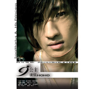

9公主
============================

|  |  |
| :--: | :-- |
| [ 9公主](https://emumo.xiami.com/album/1542) | **艺人**: [后弦](../index.md) **语种**: 国语 **唱片公司**: 博轩音乐 **发行时间**: 2006年09月29日 **专辑类别**: EP, 单曲 **专辑风格**: 节奏布鲁斯 R&B, 国语流行 Mandarin Pop, 华语唱作人 Chinese Singer-Songwriter **播放数**: 13015595 **收藏数**: 654 **评论数**: 83  |

## 简介

华语乐坛“R&amp;C”第一人新创“R&amp;C”流行曲风----全创“走神”三部曲国内首张超现实主义“光学”唱片——后弦《九公主》内地最具才华全创音乐人幻想主义元素，缔造浪漫与现实相结合的美丽童话继《古玩》“宫调R&amp;B”流行风后，全创“R&amp;C” 流行曲风。  
  
这是一张具有完整故事情节的全新专辑，三首单曲《九公主》《昆明湖》《单车恋人》组成“走神三部曲”，描述了学生时代课外时间的三种状态：遐想，恋爱，生活；这是一张定位给学生的特别专辑，是全创音乐小天才后弦为所有学生特别奉上的。全新的曲风和幻想气息，必将给你多彩的生活增添一抹强有力的色彩！  
&nbsp;

## 曲目

- [九公主](./1542/ck8Kf1a642.md)
- [昆明湖](./1542/ck8Kgfdaff.md)
- [单车恋人MV](./1542/ODP080ab0.md)
- [九公主 (伴奏)](./1542/ODPy7adb1.md)
- [昆明湖 (伴奏)MV](./1542/ODPz930dc.md)
- [单车恋人 (伴奏)](./1542/ODPx5c50b.md)

## 评论

|  |  |  |  |
| :-- | :-- | :-- | :-- |
|  [虾米用户](https://emumo.xiami.com/u/44042071)  2019-05-01 16:32 赞(0) 踩(0) | 
曾经，继周杰伦之后只听后弦的歌，真的是美词美曲，个人感觉比杰伦的歌更抓我的耳，可惜继古玩和九公主之后，逐渐流行口水风了
 |
|  [虾米用户](https://emumo.xiami.com/u/250924689) 怎么那一天的我们，都默默... 2018-10-20 12:52 赞(0) 踩(0) | 
可能有情怀加成吧
 |
|  [虾米用户](https://emumo.xiami.com/u/119445148)  2018-06-21 07:21 赞(0) 踩(0) | 
很想念那时的我们
 |
|  [虾米用户](https://emumo.xiami.com/u/4192335) 听银河 2018-04-14 17:50 赞(0) 踩(0) | 
3神曲
 |
|  [虾米用户](https://emumo.xiami.com/u/336067502)  2018-04-04 19:40 赞(0) 踩(0) | 
必须收藏
 |
|  [虾米用户](https://emumo.xiami.com/u/257947709) 我是個沈默不語的靠著車窗... 2018-01-23 00:23 赞(0) 踩(0) | 
旋律是真的好聽，歌詞也是天馬行空，可是，終究有賣弄之嫌，沒有了類似橋段的感動，會膩的。
 |
|  [虾米用户](https://emumo.xiami.com/u/34909236) 今天哭 明天笑 不求有人... 2017-11-19 18:37 赞(0) 踩(0) | 
为灵气逼人的昆明湖打满分
 |
|  [虾米用户](https://emumo.xiami.com/u/5577839) ☯☯☯ 2017-11-10 06:47 赞(0) 踩(0) | 
跟你合过影呢！！
 |
|  [虾米用户](https://emumo.xiami.com/u/52541886)   2017-10-10 18:12 赞(2) 踩(0) | 
单车恋人我初中非主流时期的最爱惹
 |
|  [虾米用户](https://emumo.xiami.com/u/13094898)  2017-09-03 11:11 赞(0) 踩(0) | 
《昆明湖》-从前单曲重复一天的，因为这首歌才知道《九公主》这张专辑，今天偶然点开来听，转眼已五年
 |
|  [虾米用户](https://emumo.xiami.com/u/3341245)  2017-08-12 10:51 赞(0) 踩(0) | 
爱。
 |
|  [虾米用户](https://emumo.xiami.com/u/257947709) 我是個沈默不語的靠著車窗... 2017-05-16 07:45 赞(0) 踩(0) | 
第二張個人專輯，一首單車戀人重新認識了後弦這個大男孩。
 |
|  [虾米用户](https://emumo.xiami.com/u/282344321)  2017-03-22 06:57 赞(0) 踩(0) | 
10多年了，从初中一直听到高中，最喜欢的一首。想来时间过得真快。
 |
|  [虾米用户](https://emumo.xiami.com/u/1096947)  2017-01-28 10:30 赞(0) 踩(0) | 
太好听吧
 |
|  [虾米用户](https://emumo.xiami.com/u/103256240)  2017-01-13 15:32 赞(1) 踩(0) | 
买的第一张正版磁带，不是周杰伦，不是五月天，而是后弦。当年的宫调R&amp;amp;B很惊艳啊，古风得很特别。只是一转眼，已经10年了……
 |
|  [虾米用户](https://emumo.xiami.com/u/254102597)  2016-12-13 17:12 赞(3) 踩(0) | 
生不逢时啊，前有周杰伦再有许嵩，光芒被淹没了。
 |
|  [虾米用户](https://emumo.xiami.com/u/21868364)   2016-10-11 05:16 赞(0) 踩(0) | 
昆明湖  太好听
 |
|  [虾米用户](https://emumo.xiami.com/u/35892657) 斜月沉沉藏海雾 2016-10-05 22:51 赞(0) 踩(0) | 
留名∑(￣□￣)
 |
|  [虾米用户](https://emumo.xiami.com/u/10948233) Seize the da... 2016-07-16 15:55 赞(0) 踩(0) | 
这张专辑是初一的时候买磁带听的，不停地循环。后来初二就换成用MP3听音乐了……真是一晃好多年了呀！
 |
|  [虾米用户](https://emumo.xiami.com/u/15367235)  2016-05-16 09:21 赞(1) 踩(0) | 
曾经单曲循环N多次的歌，尝试一边听一边写歌词，现在看看，之前记下来的歌词实在费解。
 |
|  [虾米用户](https://emumo.xiami.com/u/10363618) 歌 书 电影 心情 不易... 2016-03-27 22:55 赞(2) 踩(0) | 
听这张的时候是小学六年级 那时候因为同桌喜欢然后自己也开始听 一晃这么多年过去了 这些歌的歌词还是全部都清楚的记得 我都大学了啊
 |
|  [虾米用户](https://emumo.xiami.com/u/34439734) 日本电音是个好东西。提神... 2015-10-31 20:59 赞(11) 踩(0) | 
本来我听歌是不看词的。但是他的歌的歌词不由得我不去看。
 |
|  [虾米用户](https://emumo.xiami.com/u/8643123) 我还没想好要写什么... 2015-10-27 11:15 赞(0) 踩(0) | 
因为后弦，所以喜欢
 |
|  [虾米用户](https://emumo.xiami.com/u/40124694)  2015-08-19 15:01 赞(0) 踩(0) | 
APE无损资源已更新：<a href="http://www.162wp.com/yinle/2015-08-19/24784.html" target="_blank" rel="nofollow noreferrer noopener">http://www.162wp.com/yinle/2015-08-19/24784.html</a>
 |
|  [虾米用户](https://emumo.xiami.com/u/32052730) 虾米虾米？ 2015-08-11 14:26 赞(0) 踩(0) | 
最爱昆明湖~~哟西
 |
|  [虾米用户](https://emumo.xiami.com/u/4911501)  2015-05-07 19:10 赞(0) 踩(0) | 
昆明湖是我最爱的后弦！ 
 |
|  [虾米用户](https://emumo.xiami.com/u/43796950) 暂无签名~ 2015-04-20 21:30 赞(0) 踩(0) | 
十年前的后弦
 |
|  [虾米用户](https://emumo.xiami.com/u/5773137)  2015-03-01 21:26 赞(0) 踩(0) | 
回来找青春 才发现原来后弦还一直有出歌 记忆里还是单车恋人
 |
|  [虾米用户](https://emumo.xiami.com/u/3245704) 哎咿呀咿呀哟~~嚯嚯~~ 2015-02-04 22:58 赞(0) 踩(0) | 
当年真的是为了这张专辑跑去了另一座城市。
 |
| ⇒ |  [虾米用户](https://emumo.xiami.com/u/3245704) 哎咿呀咿呀哟~~嚯嚯~~ 2016-01-29 16:15 赞(0) 踩(0) | 
<q><b>kidb123说：</b></q>
 |
| ⇒ |  [虾米用户](https://emumo.xiami.com/u/9726899)  2017-10-28 00:01 赞(0) 踩(0) | 
去颐和园了竟然？从哪里？
 |
|  [虾米用户](https://emumo.xiami.com/u/2928117) 你好 2015-02-03 20:58 赞(0) 踩(0) | 
最喜欢 昆明湖和过桥
 |
| ⇒ |  [虾米用户](https://emumo.xiami.com/u/12524953)  2015-03-08 06:06 赞(0) 踩(0) | 
同。
 |
|  [虾米用户](https://emumo.xiami.com/u/2928117) 你好 2015-02-03 20:57 赞(1) 踩(0) | 
8年前在电台听到昆明湖 妈呀 怎么这么好听……现在的专辑 不好听
 |
|  [虾米用户](https://emumo.xiami.com/u/44054380)  2014-11-26 11:12 赞(1) 踩(0) | 
后弦，昆明湖再也找不到了比这更好听更有回忆的歌了
 |
|  [虾米用户](https://emumo.xiami.com/u/11954778) 啥都听 2014-10-28 12:52 赞(0) 踩(0) | 
昆明湖那时候很红啊
 |
|  [虾米用户](https://emumo.xiami.com/u/33673188) 你若盛开清风自来。 2014-09-30 10:57 赞(1) 踩(0) | 
喜欢喜欢。。当年各种抄歌词啊
 |
|  [虾米用户](https://emumo.xiami.com/u/13252690)   2014-06-21 16:14 赞(0) 踩(0) | 
现在回头听听后弦。有点low。不过。听这歌时时代的气味却一直没散去。
 |
| ⇒ |  [虾米用户](https://emumo.xiami.com/u/15456091)  2014-08-25 20:40 赞(0) 踩(0) | 
现在听的都是回忆啊！
 |
|  [虾米用户](https://emumo.xiami.com/u/8469936)   2014-05-03 18:27 赞(1) 踩(0) | 
昆明湖后再无后弦
 |
| ⇒ |  [虾米用户](https://emumo.xiami.com/u/25614709) 苍白故事集。 2014-05-04 22:38 赞(0) 踩(0) | 
应该是东方不败后再无后弦
 |
| ⇒ |  [虾米用户](https://emumo.xiami.com/u/8469936)   2014-05-04 23:42 赞(0) 踩(0) | 
<q><b>天边的人说：</b></q>
 |
|  [虾米用户](https://emumo.xiami.com/u/9073501) dying。。 2014-04-23 13:39 赞(12) 踩(0) | 
还记得初中时在宿舍里听电台听到《昆明湖》时的惊艳，这么多年过去了没有听到比这首更好的
 |
| ⇒ |  [虾米用户](https://emumo.xiami.com/u/25246892)  2014-12-02 18:47 赞(0) 踩(0) | 
我也是在电台听到了昆明湖
 |
|  [虾米用户](https://emumo.xiami.com/u/6631704)   2014-01-02 23:36 赞(0) 踩(0) | 
这三首=初中三年
 |
|  [虾米用户](https://emumo.xiami.com/u/9545284) 我还没想好要写什么... 2013-12-15 22:47 赞(0) 踩(0) | 
唯一听过的首首都比较喜欢的后弦的专辑....
 |
|  [虾米用户](https://emumo.xiami.com/u/6075142)  2013-12-11 12:30 赞(0) 踩(0) | 
华语乐坛R&amp;amp;B第一人。。好幽默
 |
|  [虾米用户](https://emumo.xiami.com/u/10635417) 明慎 2013-11-27 19:11 赞(0) 踩(0) | 
犹记得，听着单车恋人等来了十七岁。
 |
|  [虾米用户](https://emumo.xiami.com/u/2844835)  2013-11-25 19:19 赞(0) 踩(0) | 
这张EP本来我是最喜欢9公主的看到试听数整个人都笑尿了HHHHHH（。听到一半突然想起来发行那段时间刚好在看异人傲世录总觉得离初中好像已经过去好久了啊 ._.
 |
|  [虾米用户](https://emumo.xiami.com/u/3258019)  2013-11-22 19:18 赞(0) 踩(0) | 
很喜欢后弦的调调~
 |
|  [虾米用户](https://emumo.xiami.com/u/1854156) Ditto  2013-02-18 13:31 赞(1) 踩(0) | 
后弦就是商演少了點，不然應該會大火起來。。
 |
|  [虾米用户](https://emumo.xiami.com/u/7452398) 树欲静而风不止 2012-10-07 20:09 赞(0) 踩(0) | 
唯美的说唱
 |
|  [虾米用户](https://emumo.xiami.com/u/8803843) 阿..哈 2012-09-08 17:07 赞(0) 踩(0) | 
有境
 |
|  [虾米用户](https://emumo.xiami.com/u/8421930)  2012-04-05 00:32 赞(0) 踩(0) | 
清晰、节奏。
 |
|  [虾米用户](https://emumo.xiami.com/u/7877930)  2012-02-01 21:40 赞(0) 踩(0) | 
超爱后弦的，声音纯正》》
 |
|  [虾米用户](https://emumo.xiami.com/u/1696494) 这一天天~~~ 2012-01-04 21:07 赞(32) 踩(0) | 
昆明湖时的后弦是那个样子的，人都是会变，再也不会回来了，包括我的记忆~
 |
|  [虾米用户](https://emumo.xiami.com/u/7362824)  2011-12-24 11:16 赞(0) 踩(0) | 
yaa
 |
|  [虾米用户](https://emumo.xiami.com/u/6072590) 年轻人，不要怕。 2011-10-02 13:21 赞(0) 踩(0) | 
回转身，一个浅笑。
 |
|  [虾米用户](https://emumo.xiami.com/u/5797139)  2011-09-13 14:08 赞(0) 踩(0) | 
good
 |
|  [虾米用户](https://emumo.xiami.com/u/5761443)  2011-09-09 16:35 赞(1) 踩(0) | 
全创“走神”三部曲，国内首张超现实主义“光学”唱片——后弦《九公主》，内地最具才华全创音乐人，幻想主义元素，缔造浪漫与现实相结合的美丽童话
 |
|  [虾米用户](https://emumo.xiami.com/u/671928)  2011-08-24 18:42 赞(0) 踩(0) | 
喜欢！
 |
|  [虾米用户](https://emumo.xiami.com/u/4276863)  2011-06-13 15:44 赞(0) 踩(0) | 
后弦第二张个人专辑，很干净很纯的歌曲，值得收藏。
 |
|  [虾米用户](https://emumo.xiami.com/u/2598893)  2011-05-11 01:24 赞(0) 踩(0) | 
R&amp;amp;B 中國風
 |
|  [虾米用户](https://emumo.xiami.com/u/3524353)  2011-04-16 23:18 赞(0) 踩(0) | 
喜欢后弦…总感觉特别
 |
|  [虾米用户](https://emumo.xiami.com/u/3452217)  2011-04-05 12:37 赞(0) 踩(0) | 
^ ^
 |
|  [虾米用户](https://emumo.xiami.com/u/3411831) 烟火熏染，岁月静好 2011-03-31 23:13 赞(0) 踩(0) | 
好听
 |
|  [虾米用户](https://emumo.xiami.com/u/3300066)  2011-03-24 18:30 赞(0) 踩(0) | 
狠单纯的爱恋
 |
|  [虾米用户](https://emumo.xiami.com/u/3271732)  2011-03-19 20:23 赞(0) 踩(0) | 
喜欢后弦 没理由 就是喜欢
 |
|  [虾米用户](https://emumo.xiami.com/u/3097810)  2011-03-06 14:25 赞(0) 踩(0) | 
PL
 |
|  [虾米用户](https://emumo.xiami.com/u/2789703)  2011-02-10 12:40 赞(0) 踩(0) | 
很悠闲呐
 |
|  [虾米用户](https://emumo.xiami.com/u/2585506)  2011-01-23 11:52 赞(0) 踩(0) | 
好玩儿~
 |
|  [虾米用户](https://emumo.xiami.com/u/1781628) 飘渺宇宙，天使梭行。 2011-01-22 12:38 赞(0) 踩(0) | 
终于杀出一片自由了  昆明湖
 |
|  [虾米用户](https://emumo.xiami.com/u/1773823)  2010-11-02 22:16 赞(0) 踩(0) | 
伴奏也很好听 cool
 |
|  [虾米用户](https://emumo.xiami.com/u/1015859)  2010-09-06 17:05 赞(0) 踩(0) | 
后弦啊新生代 内地音乐的希望啊
 |
|  [虾米用户](https://emumo.xiami.com/u/1388271)  2010-08-27 00:58 赞(1) 踩(0) | 
昆明湖简直就是神作！！！
 |
|  [虾米用户](https://emumo.xiami.com/u/73655) 我还没想好要写什么... 2010-05-28 11:24 赞(0) 踩(0) | 
周董的调调
 |
|  [虾米用户](https://emumo.xiami.com/u/689068)  2010-03-01 12:51 赞(0) 踩(0) | 
神迹的调调
 |
|  [虾米用户](https://emumo.xiami.com/u/689068)  2010-03-01 12:51 赞(0) 踩(0) | 
神迹的调调
 |
|  [虾米用户](https://emumo.xiami.com/u/182242) Crazy child!... 2009-06-22 02:03 赞(0) 踩(0) | 
宫调R&amp;amp;C的绝唱啊~~~
 |
|  [虾米用户](https://emumo.xiami.com/u/6985)  2009-03-29 20:14 赞(0) 踩(0) | 
只有后弦才能写出来的走神三部曲~
 |
|  [虾米用户](https://emumo.xiami.com/u/7370) Léon 2009-02-27 14:58 赞(0) 踩(0) | 
同楼下。
 |
|  [虾米用户](https://emumo.xiami.com/u/5782) 在我的心靈深處，依然有個... 2008-11-18 15:12 赞(0) 踩(0) | 
这调调...
 |
|  [虾米用户](https://emumo.xiami.com/u/5782) 在我的心靈深處，依然有個... 2008-11-18 15:12 赞(0) 踩(0) | 
就是这个调调..
 |
