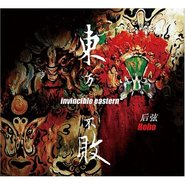

后弦
============================

|  |  |
| :--: | :-- |
| [ 后弦](https://i.xiami.com/hoho) | **播放数**: 105699005 **粉丝数**: 107667 **评论数**: 1472 **地区**: China 中国大陆 **风格**: 国语流行 Mandarin Pop, 中国风 China-Wave  |

## 档案

后弦  广西柳州     后弦（Hoho），出生于广西柳州，内地中国风代表人物、唱作歌手，全创音乐人。  2005年，发行个人首张全创作专辑《古玩》，首两个月专辑销量突破十万张，主打歌《西厢》成为内地第一首中国风流行歌曲 。2006年，推出第二张全创作专辑《九公主》EP，并获得第十四届东方风云榜新人奖。2008年，推出第三张全创作专辑《东方不败》2010年初推出第四张专辑《娃娃脸》，凭借单曲《你还欠我一个拥抱》获得QQ音乐年度盘点华语音乐年度十大金曲和百度沸点最热门内地十大金曲 。2012年，推出第五张全创作专辑《很有爱》。2014年，发行第六张创作专辑《情书不包邮》。2015年，发行单曲《鞋跟》。 2016年6月，发行单曲《画风》 。2016年10月发行专辑《下完这场雨》 。2017年2月，受邀参加中国音乐联播榜年度盛典并获“电台推荐年度金曲”奖。  2017年6月发行首本冒险悬疑小说《死后任务》，2018年8月发行全新主打《瓜很甜》，获亚洲音乐盛典年度原创音乐人大奖。     明星关系：  柳岩 金莎 （搭档）     中文名：后弦  职业：歌手、音乐人  英文名：HOHO  毕业院校：广西大学  别名：后后、HOHO、堂主  经纪公司：后弦工作室  民族：汉族  代表作品：《西厢》《娃娃脸》《单车恋人》《你还欠我一个拥抱》《下完这场雨》《瓜很甜》  星座：射手座  身高：173CM  体重：55KG  出生地：广西柳州  生日：12月14日    主要成就：      第十四届东方风云榜新人奖       中国原创歌曲总榜最佳唱作奖      第六届音乐先锋榜年度最佳作词作曲人      中国音乐联播榜年度“电台推荐年度金曲”奖      2018亚洲音乐盛典年度原创音乐人         早年经历：      就读广西大学，求学时开始接触原创音乐，成立短路乐队。连续三年获广西大学校园十大歌手称号。后开始接触MIDI编曲，创作原创歌曲。个人原创单曲《桥段》，从而被唱片公司发掘，签约成为职业歌手。            演艺经历：      2005年9月，发行首张全创作专辑《古玩》，两个月专辑销量即突破十万张荣获专辑销量“双白金”大奖。并凭此专辑获得《亚太音乐榜》“最具人气新人奖”。       2006年10月推出第二张全创作专辑《九公主》EP。       2008年11月，推出第三张全创作专辑《东方不败》，第四次获得《音乐先锋榜》最佳先锋创作歌手奖。      2009年4月，在北京星光现场音乐厅举办第一场个人mini演唱会。7月发行DVD《谢谢你的爱2009.后弦417北京演唱会》。12月10日首波主打单曲《娃娃脸》。12月25日，推出单曲《你还欠我一个拥抱》，与SARA合唱。      2010年1月，发行第四张全创作专辑《娃娃脸》EP，推出新歌“幻想系三部曲”之《花甲》     。2月，参加十大快乐家庭颁奖礼和雪碧原创音乐榜颁奖。，发布单曲《白色恋习曲》；8月，百度首发中国风《苏州城外的微笑》。9月，参加BTV北京中秋节晚会。10月，百度首发都市对唱《下一站吻别》，与米娜合唱。11月，中国风单曲《柑香亭》发布。       2011年1月，电音舞曲《把它甩掉》发布并受邀参加央视网络春晚演出。4月新专辑首波哥特风主打《信条》首发。7月，田园雷鬼风同名主打《很有爱》首发。12月，第三波主打歌《没有这首歌》发布。      2012年2月，推出第五张全创作专辑《很有爱》。8月，发布单曲《你懂的》，与金莎合唱。9月，发布单曲《杜老师》。12月，发布单曲《天然呆》     。      2013年1月，参加音乐先锋榜2012年度颁奖典礼，现场演唱《杜老师》。3月，发布单曲《我知道你也很想念》。4月，《我知道你也很想念》MV首发。9月，单曲《素贞》在酷狗首发。12月，单曲《黑板情书》发行。      2014年2月，发布单曲《有你就很幸福》。4月，单曲《情书不包邮》发布，《情书不包邮》MV同月在优酷首发。8月，中国风单曲《爱妃》发布。9月，为樊玲量身打造的中国风单曲《主公莫慌》发布。12月，单曲《杯比》发行     。      2015年5月，发行单曲《鞋跟》。8月27日，与UC联合发行单曲《给的再多，不如懂我》     。9月18日，发行单曲《卢沟晓月》     。      2016年1月20日，发行单曲《小周末》。 6月22日，发行由唐代诗人杜牧《山行》一诗有感而发的中国风单曲《画风》。     10月10日，发行专辑《下完这场雨》。       2017年后弦《下完这场雨》全国巡回签唱会成功举办20场。8月2日为刘惜君创作的游戏主题曲《永恒》发行     。8月23日为孙露创作的中国风歌曲《烟雨年代》发行     。10月发行首本冒险悬疑小说《死后任务》      2018年2月2日参与合唱贺岁歌曲《送福星》。     2月23日，为电视剧《越活越来劲》演唱的片尾曲《只要在一起》发布。8月28日发行首播主打歌《瓜很甜》，2018年在全国顺利举办粉丝见面签名会20场。      2019年7月26日，参与节目《集合，准备开吃》录制。9月5日，由共青团中央新媒体中心与新华社全媒编辑中心联合出品发行单曲《香江边上》，2019年在全国顺利举办粉丝见面签名会40场。      2020年7月1日，参与中央广播电视台总台央广节目，献唱《珊瑚颂》。7月16日，发行单曲《你笑了》。

## 专辑

| 名称 | 语种 | 唱片公司 | 发行时间 | 专辑类别 | 专辑风格 |
| :--: | :-- | :-- | :-- | :-- | :-- |
| [ 铠甲之下](./albums/5022453458.md) | 国语 |  | 2021年01月12日 | EP, 单曲 |  |
| [ 英雄帖](./albums/5022269852.md) | 国语 | 雨后麦禾 | 2020年12月24日 | EP, 单曲 | 国语流行 Mandarin Pop, 中国风 China-Wave |
| [ 撒盐](./albums/5021932000.md) | 国语 | 雨后麦禾 | 2020年11月17日 | EP, 单曲 | 国语流行 Mandarin Pop |
| [ 同学你好](./albums/5021666578.md) | 国语 | 韶愔音乐 | 2020年10月10日 | EP, 单曲 |  |
| [ 你笑了](./albums/5021083490.md) | 国语 | 雨后麦禾 | 2020年07月16日 | EP, 单曲 | 国语流行 Mandarin Pop |
| [ 香江边上](./albums/2105212554.md) | 国语 | 博轩音乐 | 2019年09月05日 | EP, 单曲 | 国语流行 Mandarin Pop |
| [ 绝句写过的爱情](./albums/2104808576.md) | 国语 | 代亚文化 | 2019年04月25日 | EP, 单曲 | 国语流行 Mandarin Pop |
| [ 瓜很甜](./albums/2103948642.md) | 国语 | 博轩音乐 | 2018年08月28日 | EP, 单曲 | 国语流行 Mandarin Pop |
| [ 下完这场雨](./albums/2102405318.md) | 国语 | 代亚文化 | 2017年01月13日 | 录音室专辑 | 国语流行 Mandarin Pop, 华语唱作人 Chinese Singer-Songwriter, 中国风 China-Wave |
| [ 爱妃](./albums/1407771983.md) | 国语 | 天浩盛世 | 2014年08月11日 | EP, 单曲 | 国语流行 Mandarin Pop |
| [ 情书不包邮](./albums/797792215.md) | 国语 | 天浩盛世 | 2014年04月17日 | EP, 单曲 | 国语流行 Mandarin Pop |
| [ 有你就很幸福](./albums/1493903294.md) | 国语 | 天浩盛世 | 2014年03月03日 | EP, 单曲 | 国语流行 Mandarin Pop, 中国风 China-Wave |
| [ 黑板情书](./albums/386588287.md) | 国语 | 天浩盛世 | 2013年12月10日 | EP, 单曲 | 国语流行 Mandarin Pop, 中国风 China-Wave |
| [ 素贞](./albums/1179053328.md) | 国语 | 天浩盛世 | 2013年09月11日 | EP, 单曲 | 国语流行 Mandarin Pop, 中国风 China-Wave |
| [ 我知道你也很想念](./albums/1963053505.md) | 国语 | 天浩盛世 | 2013年03月12日 | EP, 单曲 | 国语流行 Mandarin Pop, 中国风 China-Wave |
| [ 天然呆](./albums/567886.md) | 国语 | 天浩盛世 | 2012年12月31日 | EP, 单曲 | 国语流行 Mandarin Pop, 中国风 China-Wave |
| [ 杜老师](./albums/541327.md) | 国语 | 天浩盛世 | 2012年09月10日 | EP, 单曲 | 国语流行 Mandarin Pop, 中国风 China-Wave |
| [ 很有爱Love You So](./albums/492331.md) | 国语 | 天浩盛世 | 2012年02月09日 | 录音室专辑 | 国语流行 Mandarin Pop, 华语唱作人 Chinese Singer-Songwriter, 节奏布鲁斯 R&B |
| [ 娃娃脸](./albums/366448.md) | 国语 | 天浩盛世 | 2010年01月25日 | EP, 单曲 | 国语流行 Mandarin Pop, 中国风 China-Wave |
| [ 东方不败Invincible Eastern](./albums/306729.md) | 国语 | 博轩音乐 | 2008年10月28日 | 录音室专辑 | 国语流行 Mandarin Pop, 中国风 China-Wave, 华语唱作人 Chinese Singer-Songwriter |
| [ 9公主](./albums/1542.md) | 国语 | 博轩音乐 | 2006年09月29日 | EP, 单曲 | 节奏布鲁斯 R&B, 国语流行 Mandarin Pop, 华语唱作人 Chinese Singer-Songwriter |
| [ 古·玩](./albums/1543.md) | 国语 | 博轩音乐 | 2005年09月16日 | 录音室专辑 | 国语流行 Mandarin Pop, 中国风 China-Wave, 华语唱作人 Chinese Singer-Songwriter |

## 评论

|  |  |  |  |
| :-- | :-- | :-- | :-- |
|  [虾米用户](https://emumo.xiami.com/u/400712736)  2021-01-12 03:21 赞(0) 踩(0) | 
今天因你而特别
 |
|  [虾米用户](https://emumo.xiami.com/u/231792942)  2020-12-14 23:53 赞(0) 踩(0) | 
开开心心每一天，快快乐乐做音乐
 |
|  [虾米用户](https://emumo.xiami.com/u/4202603) 艳若红莲，不忘初心。 2020-12-14 20:32 赞(0) 踩(0) | 
生日快乐呀！
 |
|  [虾米用户](https://emumo.xiami.com/u/223952525)  2020-12-14 11:22 赞(0) 踩(0) | 
生日快乐
 |
|  [虾米用户](https://emumo.xiami.com/u/4768224)  2020-12-14 11:10 赞(0) 踩(0) | 
生日快乐！
 |
|  [虾米用户](https://emumo.xiami.com/u/430626979)  2020-12-14 10:30 赞(0) 踩(0) | 
祝后弦生日快乐
 |
|  [虾米用户](https://emumo.xiami.com/u/213736543) 随遇而安 2020-12-14 10:13 赞(0) 踩(0) | 
生日快乐！一直喜欢下去
 |
|  [虾米用户](https://emumo.xiami.com/u/266334421)  2020-12-14 10:08 赞(1) 踩(0) | 
我们一直在，祝您生日快乐，心想事成。
 |
|  [虾米用户](https://emumo.xiami.com/u/2118711)  2020-12-14 10:05 赞(1) 踩(0) | 
生日快乐后后，我第一张买的正版专辑就是东方不败，离现在十二年了，希望你能继续做自己喜欢的事 
 |
|  [虾米用户](https://emumo.xiami.com/u/43737245)  2020-08-24 17:23 赞(1) 踩(0) | 
突然刷到了西厢，再次听，很有感触，当年用mp3单曲循环的歌。。。
 |
|  [虾米用户](https://emumo.xiami.com/u/374946483) 我还没想好要写什么... 2020-08-06 10:45 赞(0) 踩(0) | 
借用一句话说，后弦=周杰伦+方文山 
 |
|  [虾米用户](https://emumo.xiami.com/u/444149586) 願得此身長報國，何須生入... 2020-07-17 18:32 赞(1) 踩(0) | 
最喜欢的歌者，没有之一
 |
|  [虾米用户](https://emumo.xiami.com/u/2796166) 最爱莫文蔚..... 2020-07-17 00:29 赞(0) 踩(0) | 
加油~~加油~~
 |
|  [虾米用户](https://emumo.xiami.com/u/2306645)  2020-07-16 23:01 赞(0) 踩(0) | 
校友，加油啊(ง &amp;bull;̀_&amp;bull;́)ง。
 |
|  [虾米用户](https://emumo.xiami.com/u/311424374) 我还没想好要写什么... 2020-07-16 12:48 赞(2) 踩(0) | 
好喜欢这个安静的默默做自己音乐的男孩子❤️2005-2010每次听到你的歌心里都暖暖甜甜的 
 |
|  [虾米用户](https://emumo.xiami.com/u/299045214)  2020-07-04 12:24 赞(0) 踩(0) | 
国语几乎只听后弦和周杰伦 
 |
|  [虾米用户](https://emumo.xiami.com/u/236474462)   2020-06-18 00:11 赞(3) 踩(0) | 
没别的，就是来点亮&amp;hearts;️的，欠你的
 |
|  [虾米用户](https://emumo.xiami.com/u/27084348) 自强不息，厚德载物… 2020-05-27 23:45 赞(2) 踩(0) | 
虾米挺走心的，五月天，后弦都挺喜欢的。
 |
|  [虾米用户](https://emumo.xiami.com/u/311675001)  2020-04-20 11:49 赞(1) 踩(0) | 
高中就喜欢的后弦啊！
 |
|  [虾米用户](https://emumo.xiami.com/u/372188531)  2020-04-08 22:12 赞(2) 踩(0) | 
最新评论居然是七年前
 |
| ⇒ |  [虾米用户](https://emumo.xiami.com/u/43737245)  2020-08-24 17:21 赞(0) 踩(0) | 
那是精选。。。没你想的那么落寞。。。
 |
|  [虾米用户](https://emumo.xiami.com/u/288795200) 我还没想好要写什么... 2020-03-30 19:33 赞(4) 踩(0) | 
每次听到后弦就觉得自己永远十八岁 
 |
|  [虾米用户](https://emumo.xiami.com/u/3491810) There is ART... 2020-03-12 22:33 赞(2) 踩(0) | 
这么有才华 词曲编唱全才 为什么没有大火
 |
|  [虾米用户](https://emumo.xiami.com/u/431842977) 生生灯火，明暗无辄。 2020-02-23 19:22 赞(12) 踩(0) | 
从你的《单车恋人》开始认识你去了好几次的《海口》再到《昆明湖》逛了好几圈一度想着《你还欠我一个拥抱》后来懂得欣赏你的《九公主》风格但不想和你《下一站吻别》最喜欢你的《娃娃脸》还有你的《苏州城外的微笑》还有你的《天然呆》你的《哥德巴赫猜》你的《白色恋习曲》你的《画风》真的《很有爱》你的《小周末》的《瓜很甜》《香江边上》的你在《过桥》喜欢你写的《黑板情书》想念你的《公主抱》不过我还是要好好学《唐宋元明清》不然怕是会被《杜老师》《笔墨伺候》如果我是《小白》《十有八九》会是《逃学书童》但《我要的不是再见》等《下完这场雨》之后你记得准备好新歌新专辑哈 
 |
|  [虾米用户](https://emumo.xiami.com/u/288059283)  2019-12-14 16:25 赞(3) 踩(0) | 
得知今天是你的生日，首先祝你生日快乐。非常感谢你的歌曲陪伴我度过美好时光。非常期待你以后有更好的作品。最后，再次祝你生日快乐
 |
|  [虾米用户](https://emumo.xiami.com/u/85821104) 点击编辑 2019-12-14 10:37 赞(0) 踩(0) | 
听hoho的歌时光总是快乐的，所以要听着hoho的歌送上生日祝福：生日快乐！上次听hoho的歌是什么时候？不记得了，七秒记忆没法让我记得更久之前的事情；尽管那可能是几个星期之前的事情了，偶尔还会听听。毕竟美好的时光总会让人想记住，记性差的我；把时光刻录到音乐里去了…我会永久保存。
 |
|  [虾米用户](https://emumo.xiami.com/u/328224941) 这个人很美，什么也没留下... 2019-12-10 12:37 赞(0) 踩(0) | 
唔占据了我整个小学回忆杀的bgmer，即使十几年过去了还是一如既往的好听
 |
|  [虾米用户](https://emumo.xiami.com/u/406940260)  2019-11-29 01:23 赞(0) 踩(0) | 
高中的时候开始知道后弦，那时候就觉得他和许嵩，周杰伦是一挂的，。很喜欢他的歌曲，听了好多，听了好久，现在听还是觉得好听。感觉他的歌的曲调有种婉约派的感觉。
 |
|  [虾米用户](https://emumo.xiami.com/u/97668246) Holger 2019-09-23 22:20 赞(3) 踩(0) | 
红与不红我都不关心，我只知道有一个名为后弦的歌手，他和我的梦一直还在继续着。有一群喜爱他的听众就足矣。
 |
| ⇒ |  [虾米用户](https://emumo.xiami.com/u/288795200) 我还没想好要写什么... 2020-03-30 19:34 赞(0) 踩(0) | 
是的，有一个名为后弦的歌手，他和我们的梦一直还在继续着，永远有一群喜爱他的听众。
 |
|  [虾米用户](https://emumo.xiami.com/u/344483636) 我还没想好要写什么... 2019-09-06 21:36 赞(3) 踩(0) | 
支持后弦，不管说是模仿也好，昔日的感动没有了也好。可是《香江边上》这样的歌，这样的曲调，这样的赤子之心，现在又有谁，那么含蓄又感动，那么不遮拦的唱着？不流于俗，不忘初心，依旧感动。
 |
|  [虾米用户](https://emumo.xiami.com/u/334632312)   2019-08-18 20:25 赞(1) 踩(0) | 
加油弦哥，再见了我的青春
 |
|  [虾米用户](https://emumo.xiami.com/u/193233005)  2019-08-07 21:05 赞(2) 踩(0) | 
↓滚谢谢
 |
|  [虾米用户](https://emumo.xiami.com/u/122670826) 我还没想好要写什么... 2019-07-07 00:57 赞(1) 踩(0) | 
模仿大师的后果只有死路一条
 |
|  [虾米用户](https://emumo.xiami.com/u/326384075)  2019-07-06 18:31 赞(0) 踩(0) | 
支持弦歌
 |
|  [虾米用户](https://emumo.xiami.com/u/91813166)  2019-07-06 09:15 赞(0) 踩(0) | 
竟然是70后 
 |
|  [虾米用户](https://emumo.xiami.com/u/337431120)  2019-06-17 21:51 赞(0) 踩(0) | 
2013年初中
 |
|  [虾米用户](https://emumo.xiami.com/u/338744450) 看的见我的未来 2019-06-15 16:07 赞(1) 踩(0) | 
爱你❤
 |
|  [虾米用户](https://emumo.xiami.com/u/380102008)  2019-06-12 10:16 赞(0) 踩(0) | 
总感觉后弦一直在模仿周杰伦，从曲风到唱腔
 |
|  [虾米用户](https://emumo.xiami.com/u/338702218)  2019-05-04 12:07 赞(0) 踩(0) | 
加油
 |
|  [虾米用户](https://emumo.xiami.com/u/325374787)  2019-04-22 09:48 赞(0) 踩(0) | 
好
 |
|  [虾米用户](https://emumo.xiami.com/u/16656516)  2019-03-01 02:00 赞(2) 踩(0) | 
太过文艺的东西往往会变得小众，电影如此，音乐如此。在今天这个拼速度，讲流量的时代，能坚持自己的风格实属不易。
 |
|  [虾米用户](https://emumo.xiami.com/u/453451) 我还没想好要写什么... 2019-01-30 17:06 赞(1) 踩(0) | 
全是回忆呀！从2015年粉到现在！！！
 |
|  [虾米用户](https://emumo.xiami.com/u/325146602)  2019-01-13 17:18 赞(5) 踩(0) | 
想起那时候在大学操场上跑着步，带着MP3听着这首歌，原来是十年前了。
 |
|  [虾米用户](https://emumo.xiami.com/u/350864553) 睡飽彳     彳飽睡 ... 2018-12-21 13:15 赞(1) 踩(0) | 
✨12/21
 |
|  [虾米用户](https://emumo.xiami.com/u/278393692) 回不去了 2018-12-15 05:03 赞(2) 踩(0) | 
想念难想见
 |
|  [虾米用户](https://emumo.xiami.com/u/376217155)  2018-12-14 21:53 赞(0) 踩(0) | 
生日快乐!(^O^)y
 |
|  [虾米用户](https://emumo.xiami.com/u/310068209) 戳爷霉霉〔碧丽〕(新晋女... 2018-12-14 11:53 赞(2) 踩(0) | 
生日快乐啊啊啊，因为【下完这场雨】而认识你，第一次听，特别惊艳，戏腔，不似女声般缠绵但不失优雅，特别奇怪，淡雅幽怨但又向往的美好刻意去找的东西，往往是找不到的。天下万物的来和去，都有他的时间。——三毛 ​​​
 |
|  [虾米用户](https://emumo.xiami.com/u/268350718) 音乐就像喜怒哀乐 2018-12-14 10:45 赞(1) 踩(0) | 
生日快乐
 |
|  [虾米用户](https://emumo.xiami.com/u/268350718) 音乐就像喜怒哀乐 2018-12-14 10:44 赞(8) 踩(0) | 
你是我们广西的骄傲，加油。
 |
|  [虾米用户](https://emumo.xiami.com/u/93092514) 不求闻达于诸侯 2018-12-14 10:08 赞(0) 踩(0) | 
生日快乐啊
 |
|  [虾米用户](https://emumo.xiami.com/u/324860457) 我还没想好要写什么... 2018-12-14 10:02 赞(1) 踩(0) | 
同日生 生快
 |
|  [虾米用户](https://emumo.xiami.com/u/161534788) 你好甜 2018-12-14 10:01 赞(2) 踩(0) | 
生日快乐呀后后
 |
|  [虾米用户](https://emumo.xiami.com/u/409108638)  2018-12-11 22:02 赞(3) 踩(0) | 
后天要是能火，我买他演唱票。（我一向很抠，但是为了我心爱的歌手。我能做到。）
 |
|  [虾米用户](https://emumo.xiami.com/u/378946858)  2018-12-09 07:21 赞(0) 踩(0) | 
后弦好帅×3
 |
|  [虾米用户](https://emumo.xiami.com/u/356580607)  2018-12-08 17:18 赞(3) 踩(0) | 
不知道为什么你一直不温不火，你的中国风我非常喜欢，这么多年听你的歌过来了，感谢你的陪伴，感谢你给我们带来这么多优秀的作品
 |
|  [虾米用户](https://emumo.xiami.com/u/121672188)  2018-12-04 21:00 赞(3) 踩(0) | 
唯一一个不忘初心的歌手。
 |
|  [虾米用户](https://emumo.xiami.com/u/11763865)  2018-11-26 21:23 赞(0) 踩(0) | 

 |
|  [虾米用户](https://emumo.xiami.com/u/409147231)  2018-11-21 21:00 赞(0) 踩(0) | 
很喜欢后弦的歌，完美的抒情，唱出了我的思念
 |
|  [虾米用户](https://emumo.xiami.com/u/204727520)  2018-11-03 19:52 赞(0) 踩(0) | 
对我来说 能够治愈我的就是好歌手 就是好音乐
 |
|  [虾米用户](https://emumo.xiami.com/u/307819562)  2018-10-13 09:16 赞(0) 踩(0) | 
一晃十多年了，声音还是这么好听
 |
|  [虾米用户](https://emumo.xiami.com/u/177822678) 我还没想好要写什么... 2018-10-12 18:16 赞(5) 踩(0) | 
后弦，你很优秀，所以，跟着自己的心做音乐，生活如意，万事顺心 
 |
|  [虾米用户](https://emumo.xiami.com/u/50659098)  2018-10-11 11:34 赞(1) 踩(0) | 
看到还有那么多人喜欢后弦  很开心 
 |
|  [虾米用户](https://emumo.xiami.com/u/405085943)  2018-10-05 13:10 赞(5) 踩(0) | 
我们广西的骄傲
 |
|  [虾米用户](https://emumo.xiami.com/u/25895511) 262727529 2018-09-29 10:30 赞(1) 踩(0) | 
天啊 后弦的歌都是怎么写出来的啊 我怀疑灵感来源于歌曲倒放 各种乱拐不按牌理出牌 很像那种倒放鬼畜剪辑 然而却好听得一批♡&amp;hearts;︎
 |
|  [虾米用户](https://emumo.xiami.com/u/343269226)  2018-09-28 09:44 赞(0) 踩(0) | 
桂林人为你加油
 |
|  [虾米用户](https://emumo.xiami.com/u/129050470) hala madrid! 2018-09-22 17:07 赞(1) 踩(0) | 
后弦就是那种我行我素的，自己开心就好的类型 ，一点也不关心自己红不红，开心就写首歌，不开心就消失很久 
 |
|  [虾米用户](https://emumo.xiami.com/u/404318375)  2018-09-22 12:14 赞(0) 踩(0) | 
我也是广西的
 |
|  [虾米用户](https://emumo.xiami.com/u/121672188)  2018-09-19 22:01 赞(0) 踩(0) | 
一直在听。。。不用多火。我依然听着。
 |
|  [虾米用户](https://emumo.xiami.com/u/342378362)  2018-09-19 19:47 赞(0) 踩(0) | 
好听
 |
|  [虾米用户](https://emumo.xiami.com/u/344097936)  2018-08-27 19:02 赞(0) 踩(0) | 
什么时候能见你一面呢，后后
 |
|  [虾米用户](https://emumo.xiami.com/u/351991433)  2018-08-25 11:22 赞(0) 踩(0) | 
初中聽的 
 |
|  [虾米用户](https://emumo.xiami.com/u/330324850)  2018-08-11 17:54 赞(0) 踩(0) | 
小时候很喜欢听他的歌，现在满满的回忆，继续支持。
 |
|  [虾米用户](https://emumo.xiami.com/u/123209246)  2018-08-09 18:10 赞(0) 踩(0) | 
虾米的版权啊
 |
|  [虾米用户](https://emumo.xiami.com/u/212154854) 学生    00后 2018-07-29 12:00 赞(0) 踩(0) | 
柳城人耶
 |
|  [虾米用户](https://emumo.xiami.com/u/374400890) 签名在这里 2018-07-29 11:59 赞(0) 踩(0) | 
最早是听《苏州城外的微笑》认识的，那时才十一二岁 ，到现在都是我最喜欢的华语歌，几乎没有之一&amp;hellip;&amp;hellip;（要说之二就是下完这场雨了hh）真的是我最喜欢的华语歌手了，没有之一，期待听着你更棒的作品走过下一个十年  
 |
|  [虾米用户](https://emumo.xiami.com/u/331233949)  2018-07-27 20:46 赞(0) 踩(0) | 
歌词太美了
 |
|  [虾米用户](https://emumo.xiami.com/u/8339314) 你说我在乎么 2018-07-25 07:07 赞(0) 踩(0) | 
谢谢您的音乐这么多年来的陪伴 
 |
|  [虾米用户](https://emumo.xiami.com/u/202952636)  2018-07-19 19:21 赞(0) 踩(0) | 
都开始生活去了吧
 |
|  [虾米用户](https://emumo.xiami.com/u/335985218)  2018-07-16 20:44 赞(0) 踩(0) | 
广西老表~
 |
|  [虾米用户](https://emumo.xiami.com/u/350689350)  2018-07-07 13:57 赞(1) 踩(0) | 
为什么虾米的版权这么少？好烦呀
 |
|  [虾米用户](https://emumo.xiami.com/u/323388842) 若大世界你没有早一步也没... 2018-07-05 20:05 赞(1) 踩(0) | 
我老乡耶 争光了 
 |
|  [虾米用户](https://emumo.xiami.com/u/331534075)  2018-07-03 13:54 赞(0) 踩(0) | 
谢谢
 |
|  [虾米用户](https://emumo.xiami.com/u/376217155)  2018-06-20 20:41 赞(1) 踩(0) | 
喜欢你的第十年
 |
|  [虾米用户](https://emumo.xiami.com/u/211891939)  2018-06-16 07:22 赞(2) 踩(0) | 
这是我见过最不爱洗头的男歌手
 |
|  [虾米用户](https://emumo.xiami.com/u/298172194) 你还年轻，不要太着急看透... 2018-06-16 00:57 赞(1) 踩(0) | 
后弦同学加油
 |
|  [虾米用户](https://emumo.xiami.com/u/87843396) 漫漫人生路 2018-06-04 21:06 赞(4) 踩(0) | 
在桥段的地方走了一次次
 |
|  [虾米用户](https://emumo.xiami.com/u/2426204)  2018-06-04 08:25 赞(1) 踩(0) | 
我广西歌手，支持一下 
 |
|  [虾米用户](https://emumo.xiami.com/u/35226118)  2018-06-02 06:31 赞(1) 踩(0) | 
还是最喜欢后弦的歌
 |
|  [虾米用户](https://emumo.xiami.com/u/282134106) 养鸡  种树  听歌  ... 2018-05-17 17:48 赞(2) 踩(0) | 
咋还不出新歌
 |
|  [虾米用户](https://emumo.xiami.com/u/307220906)  2018-05-15 16:20 赞(30) 踩(0) | 
后弦，才子嘛，谁不爱。
 |
|  [虾米用户](https://emumo.xiami.com/u/357674040)  2018-05-09 07:02 赞(0) 踩(0) | 

 |
|  [虾米用户](https://emumo.xiami.com/u/131986908) 如果你眼神能够为我片刻的... 2018-04-22 00:49 赞(2) 踩(0) | 
多出点歌哈哈哈哈
 |
|  [虾米用户](https://emumo.xiami.com/u/286448531) BIGBANG IS V... 2018-04-02 21:19 赞(9) 踩(0) | 
单曲循环把下完这场雨画风设置成手机铃声闹钟
 |
|  [虾米用户](https://emumo.xiami.com/u/2960029) 如果世界太危险 只有音乐... 2018-03-27 15:55 赞(2) 踩(0) | 
好久不见啦 
 |
|  [虾米用户](https://emumo.xiami.com/u/254037046)  2018-03-23 22:05 赞(1) 踩(0) | 
你这种评论是怎么上去的？
 |
|  [虾米用户](https://emumo.xiami.com/u/290825722)  2018-03-22 20:47 赞(0) 踩(0) | 
喜欢后弦
 |
|  [虾米用户](https://emumo.xiami.com/u/282134106) 养鸡  种树  听歌  ... 2018-03-20 22:01 赞(0) 踩(0) | 
咋还不出歌
 |
|  [虾米用户](https://emumo.xiami.com/u/274874037)  2018-03-12 14:15 赞(0) 踩(0) | 
我在昆明听后弦
 |
|  [虾米用户](https://emumo.xiami.com/u/41654231)   2018-02-15 11:17 赞(18) 踩(0) | 
十年了，听起来还是那么喜欢，节奏、旋律和歌词都不落伍。
 |
|  [虾米用户](https://emumo.xiami.com/u/350554921)   2018-02-15 07:37 赞(13) 踩(0) | 
我听西厢的时候，大润发还叫大福源...放学去大福源一边看聊斋，一边听西厢...
 |
| ⇒ |  [虾米用户](https://emumo.xiami.com/u/2830724) 我們終將不會相遇 都湮滅... 2018-07-05 20:10 赞(0) 踩(0) | 
大福源你好
 |
|  [虾米用户](https://emumo.xiami.com/u/267868759)  2018-02-10 18:49 赞(2) 踩(0) | 
依旧是我喜欢的少年的歌 
 |
|  [虾米用户](https://emumo.xiami.com/u/347749169)  2018-02-05 08:31 赞(1) 踩(0) | 
好听!
 |
|  [虾米用户](https://emumo.xiami.com/u/347749169)  2018-02-05 08:30 赞(1) 踩(0) | 
？？？
 |
|  [虾米用户](https://emumo.xiami.com/u/247664191)  2018-02-04 20:46 赞(2) 踩(0) | 
啊！啊！啊！好骄傲啊！想不到后弦跟我是一个省的，好幸福！  
 |
| ⇒ |  [虾米用户](https://emumo.xiami.com/u/344053406) .... 2018-02-20 10:08 赞(0) 踩(0) | 

 |
| ⇒ |  [虾米用户](https://emumo.xiami.com/u/357138534)  2018-05-19 18:35 赞(0) 踩(0) | 
他和我在同一个星球
 |
|  [虾米用户](https://emumo.xiami.com/u/347124646)  2018-02-01 17:47 赞(0) 踩(0) | 
加油！
 |
|  [虾米用户](https://emumo.xiami.com/u/26843482) 我还没想好要写什么... 2018-01-30 14:19 赞(0) 踩(0) | 
这么多年了 再听桥段 嗯 高中的时候真的好喜欢过你
 |
|  [虾米用户](https://emumo.xiami.com/u/345766978)  2018-01-29 08:38 赞(0) 踩(0) | 
路过
 |
|  [虾米用户](https://emumo.xiami.com/u/346185391)  2018-01-27 15:02 赞(0) 踩(0) | 
每当听到这首歌时，都仿佛听到了生活
 |
|  [虾米用户](https://emumo.xiami.com/u/314796246) 我喜欢你，像风走了八千里... 2018-01-13 09:53 赞(0) 踩(0) | 
单车恋人是初一每天放学都听的，现在初二了，学校还在，人却都走了，更别提这首歌。其实在学校并不知道这首歌的名字，只觉得青春。回忆的沙漏早以漏完。。。
 |
|  [虾米用户](https://emumo.xiami.com/u/313761948)   2017-12-23 00:44 赞(1) 踩(0) | 
校友啊！
 |
|  [虾米用户](https://emumo.xiami.com/u/252582995)  2017-12-21 19:52 赞(14) 踩(0) | 
古玩那年，玩古风就一个杰伦和后弦好嘛，一些人觉得江郎才尽只是这些年你接触得多了，也就平平无奇
 |
|  [虾米用户](https://emumo.xiami.com/u/340702916)  2017-12-20 12:43 赞(0) 踩(0) | 
好听
 |
|  [虾米用户](https://emumo.xiami.com/u/40348515)   2017-12-18 12:59 赞(0) 踩(0) | 
这么多年还是喜欢古玩和九公主。现在真的是江郎才尽了吗？这种风格真的不适合而且一搜一大堆，热度过了也就被遗忘了。原来的古风真的是棒呆了好嘛
 |
|  [虾米用户](https://emumo.xiami.com/u/35275661)  2017-12-10 14:55 赞(7) 踩(0) | 
也是出道即巅峰的代表人物之一
 |
|  [虾米用户](https://emumo.xiami.com/u/334510536)  2017-12-10 00:59 赞(1) 踩(0) | 
后弦加油！我也是
 |
|  [虾米用户](https://emumo.xiami.com/u/334510536)  2017-12-10 00:53 赞(4) 踩(0) | 
后弦更是我学习上的。。我初中听的会很陶醉，说明他突出了一个很历害的特点，也许是孤独的自我陶醉，就像月色下的二泉映月
 |
|  [虾米用户](https://emumo.xiami.com/u/266334208) 我还没想好要写什么... 2017-12-05 19:26 赞(1) 踩(0) | 
莫名觉得长得像请回答1994里的七封
 |
|  [虾米用户](https://emumo.xiami.com/u/307855548)  2017-11-21 00:29 赞(0) 踩(0) | 
最爱后弦
 |
|  [虾米用户](https://emumo.xiami.com/u/281212854) 我要我想要的 2017-11-20 07:30 赞(0) 踩(0) | 
好喜欢
 |
|  [虾米用户](https://emumo.xiami.com/u/321093709) 你这是要干嘛？挑战我的记... 2017-11-19 20:02 赞(3) 踩(0) | 
在刷一波，超级喜欢你的娃娃脸，苏州城外的微笑，我知道你也很想念！！！也超级喜欢你，不管你红不红，这样的你就很好，加油   
 |
|  [虾米用户](https://emumo.xiami.com/u/97721968) 想像樱花都还在 2017-11-19 17:48 赞(7) 踩(0) | 
西厢那年的惊艳，后来怎么就跑偏了呢，不过后弦开心就好，就像他歌中不拘一格的调调
 |
|  [虾米用户](https://emumo.xiami.com/u/192933307)  2017-11-11 17:37 赞(1) 踩(0) | 
东莞理工打call
 |
|  [虾米用户](https://emumo.xiami.com/u/5577839) ☯☯☯ 2017-11-10 06:41 赞(1) 踩(0) | 
好喜欢你的昆明湖 喜欢好多年 什么时候听都心旷神怡
 |
|  [虾米用户](https://emumo.xiami.com/u/203312169)  2017-11-02 00:26 赞(2) 踩(0) | 
哇哇哇～之前小学只知道单车恋人～原来他中国风这么好听～～已中毒！！
 |
|  [虾米用户](https://emumo.xiami.com/u/331831707) 交个朋友吗 2017-10-30 18:59 赞(0) 踩(0) | 
有QQ？
 |
|  [虾米用户](https://emumo.xiami.com/u/203824346)  2017-10-30 09:49 赞(8) 踩(0) | 
虽然是最近才发现后弦这个歌手的，但是超喜欢她的歌！٩(๑^o^๑)۶后弦加油，虽然我不太了解你，但听了你的歌，感觉满身动劲呐！！！！！！！！！！！！！！！喜欢这种旋律，加油加油！  
 |
| ⇒ |  [虾米用户](https://emumo.xiami.com/u/311979821) 顺其自然不会是竭尽全力后... 2017-11-01 19:33 赞(0) 踩(0) | 
她？ 
 |
| ⇒ |  [虾米用户](https://emumo.xiami.com/u/25246892)  2017-12-06 20:56 赞(0) 踩(0) | 
听这话，果然是00后
 |
|  [虾米用户](https://emumo.xiami.com/u/284548113)  2017-10-28 00:36 赞(4) 踩(0) | 
咬字一定要清晰，最恶心就是好多歌手学周杰伦风格来唱歌
 |
|  [虾米用户](https://emumo.xiami.com/u/7892448)  2017-10-28 00:32 赞(1) 踩(0) | 
生日快乐啊~ 同为射手座，哈哈~
 |
| ⇒ |  [虾米用户](https://emumo.xiami.com/u/374400890) 签名在这里 2018-07-29 12:00 赞(0) 踩(0) | 
啊我也是射手！
 |
|  [虾米用户](https://emumo.xiami.com/u/29421831)  2017-10-28 00:32 赞(1) 踩(0) | 
亲爱的，支持你——谨此怀念擦去的昨天，很喜欢这句
 |
|  [虾米用户](https://emumo.xiami.com/u/38879961) 我就是我，不一样的烟火！ 2017-10-28 00:25 赞(1) 踩(0) | 
古玩，成为了一辈子一听心就痛的唯一一张专辑！
 |
| ⇒ |  [虾米用户](https://emumo.xiami.com/u/199874171)  2017-10-29 19:45 赞(0) 踩(0) | 
为什么呀
 |
|  [虾米用户](https://emumo.xiami.com/u/221528)  2017-10-28 00:20 赞(0) 踩(0) | 
高中时候超级喜欢，逃学书童，这首~感觉最近的曲风变了呢……还是以前的好听呢
 |
|  [虾米用户](https://emumo.xiami.com/u/4318853) 欲辨已忘言 2017-10-28 00:17 赞(0) 踩(0) | 
说实话，这比现在烂大街的那些好多了。其实当年还是挺喜欢的。
 |
|  [虾米用户](https://emumo.xiami.com/u/50126403) 肄业后进西线游曳，急切的... 2017-10-27 23:41 赞(1) 踩(0) | 
他的音乐是来自周杰伦，但是风格区别还是挺大的，后弦的音乐制作能力十分强大，每张专辑概念清晰，这两点比周杰伦好
 |
|  [虾米用户](https://emumo.xiami.com/u/331795541) 谁的秀发如烟 晕染了那一... 2017-10-26 14:35 赞(2) 踩(0) | 
男神，老大   
 |
|  [虾米用户](https://emumo.xiami.com/u/51812371)  2017-10-26 02:22 赞(0) 踩(0) | 
买过他的第一张专辑，16岁。
 |
|  [虾米用户](https://emumo.xiami.com/u/273612346)  2017-10-25 20:30 赞(0) 踩(0) | 
罗大佑的歌都没有播放破四百万的，下完这场雨这么小众的歌是怎么拿到这么高的播放量的？
 |
| ⇒ |  [虾米用户](https://emumo.xiami.com/u/321093709) 你这是要干嘛？挑战我的记... 2017-11-19 20:00 赞(0) 踩(0) | 
因为好听，好听就听
 |
| ⇒ |  [虾米用户](https://emumo.xiami.com/u/31501278)  2018-08-03 13:14 赞(0) 踩(0) | 
有一晚上我循环了一夜，还不算平时听的
 |
|  [虾米用户](https://emumo.xiami.com/u/273612346)  2017-10-25 20:26 赞(0) 踩(0) | 
虽然我觉得下完这场雨确实挺好听，但一千六百万的播放有点过分了吧？Taylor的歌播放量最大的love story才一千一百万，哥哥的倩女幽魂也不过一千六百万，我不认为后弦已经有如此高的名气。
 |
| ⇒ |  [虾米用户](https://emumo.xiami.com/u/337188282) 我在等你 2017-11-27 14:34 赞(0) 踩(0) | 
不认为就不认为吧
 |
| ⇒ |  [虾米用户](https://emumo.xiami.com/u/225058768)  2017-12-04 12:39 赞(0) 踩(0) | 
他虽然不算红，但不代表别人不喜欢他的歌，后弦住进了很多人的青春
 |
| ⇒ |  [虾米用户](https://emumo.xiami.com/u/231533263) Rua 2017-12-07 01:44 赞(0) 踩(0) | 
不是每个人都像你这样
 |
|  [虾米用户](https://emumo.xiami.com/u/301833904)  2017-10-20 23:46 赞(2) 踩(0) | 
后弦的歌听起来永远那么年轻，人在我心里也是不老男神
 |
|  [虾米用户](https://emumo.xiami.com/u/4268650) 我还没想好要写什么... 2017-10-19 00:48 赞(0) 踩(0) | 
请帮阿兰·达瓦卓玛写一首好歌吧！
 |
|  [虾米用户](https://emumo.xiami.com/u/323839380)  2017-10-17 22:51 赞(0) 踩(0) | 
我一直以为他是台湾 
 |
| ⇒ |  [虾米用户](https://emumo.xiami.com/u/310031874)  2017-10-19 13:43 赞(0) 踩(0) | 
广西的，大爱
 |
|  [虾米用户](https://emumo.xiami.com/u/328235153) 一生一世一双人 2017-10-14 19:22 赞(0) 踩(0) | 
后弦，棒 
 |
|  [虾米用户](https://emumo.xiami.com/u/7565120)   2017-10-12 20:04 赞(1) 踩(0) | 
的确最开始的歌最经典好听   十有八九 西厢  花甲  唐宋元明清…… 后弦的歌带我入的古风   满满的回忆啊
 |
|  [虾米用户](https://emumo.xiami.com/u/82588866) 如果没有如果，也许再也没... 2017-10-04 07:10 赞(1) 踩(0) | 
后弦的歌很有邻居大男孩的，暖暖的感觉。
 |
|  [虾米用户](https://emumo.xiami.com/u/28460123) 爱你所爱 2017-09-30 09:29 赞(3) 踩(0) | 
他是文化人。
 |
|  [虾米用户](https://emumo.xiami.com/u/44743196) 听虾米记得收藏～ 2017-09-27 02:36 赞(0) 踩(0) | 
仙鹤报到
 |
|  [虾米用户](https://emumo.xiami.com/u/323524927)  2017-09-13 13:42 赞(2) 踩(0) | 
许嵩和后弦再加上周杰伦就更完美了
 |
|  [虾米用户](https://emumo.xiami.com/u/314816921)  2017-09-09 14:11 赞(2) 踩(0) | 
挺喜欢后弦的歌的因为他的歌词和曲风，他就是一个诗人啊，现代和过去的结合体
 |
|  [虾米用户](https://emumo.xiami.com/u/12856314)   2017-09-05 17:27 赞(1) 踩(0) | 
满满的回忆啊
 |
|  [虾米用户](https://emumo.xiami.com/u/12491431) 地平线 2017-09-05 08:33 赞(0) 踩(0) | 
垃圾
 |
| ⇒ |  [虾米用户](https://emumo.xiami.com/u/323524927)  2017-09-13 13:42 赞(0) 踩(0) | 
不喜欢不要说不好听的
 |
| ⇒ |  [虾米用户](https://emumo.xiami.com/u/301833904)  2017-10-02 17:02 赞(0) 踩(0) | 
你才垃圾吧，你有多牛啊，你创作一首歌看看啊，这种人就是欠揍
 |
| ⇒ |  [虾米用户](https://emumo.xiami.com/u/12491431) 地平线 2017-10-02 18:13 赞(0) 踩(0) | 
<q><b>好好生活说：</b></q>
 |
|  [虾米用户](https://emumo.xiami.com/u/302532884)  2017-09-03 21:02 赞(3) 踩(0) | 
最爱后弦
 |
|  [虾米用户](https://emumo.xiami.com/u/319676358)  2017-09-02 12:46 赞(1) 踩(0) | 
唱的很好。
 |
|  [虾米用户](https://emumo.xiami.com/u/322346753)  2017-08-30 01:31 赞(1) 踩(0) | 
666
 |
|  [虾米用户](https://emumo.xiami.com/u/271904404)  2017-08-23 10:29 赞(2) 踩(0) | 
后弦是最棒的
 |
|  [虾米用户](https://emumo.xiami.com/u/319503531)  2017-08-15 15:43 赞(0) 踩(0) | 
 
 |
|  [虾米用户](https://emumo.xiami.com/u/254588241)  2017-08-13 11:31 赞(3) 踩(0) | 
怎么就是不红啊，哎
 |
|  [虾米用户](https://emumo.xiami.com/u/7046344)  2017-08-03 20:04 赞(12) 踩(0) | 
想想当年听到昆明湖的惊艳，现在都记忆犹新啊！古玩、9公主、东方不败首首经典
 |
|  [虾米用户](https://emumo.xiami.com/u/316250080) 你还要我怎样 2017-08-02 00:20 赞(0) 踩(0) | 
这首歌不错！下完这场雨！中国风好浓！谁要是还有好听的中国风曲子忘留言谢谢！ 
 |
| ⇒ |  [虾米用户](https://emumo.xiami.com/u/317961253)  2017-11-16 15:50 赞(0) 踩(0) | 
推荐李炜的&amp;ldquo;剑魂&amp;rdquo;
 |
|  [虾米用户](https://emumo.xiami.com/u/254281619)  2017-08-01 16:44 赞(0) 踩(0) | 
这么好。收藏了你的歌还给俺回复呀  
 |
|  [虾米用户](https://emumo.xiami.com/u/291881753)  2017-08-01 11:16 赞(2) 踩(0) | 
后弦♡♡
 |
|  [虾米用户](https://emumo.xiami.com/u/226527209)  2017-07-25 10:18 赞(19) 踩(0) | 
他不年轻了，但他的歌却还是那么年轻
 |
|  [虾米用户](https://emumo.xiami.com/u/266150914)  2017-07-24 01:46 赞(17) 踩(0) | 
写的词，作的曲，他靠自己完成的，很值得学习呢  
 |
|  [虾米用户](https://emumo.xiami.com/u/266150914)  2017-07-24 01:43 赞(8) 踩(0) | 
我听的他的歌全是他作的曲，弄的调
 |
|  [虾米用户](https://emumo.xiami.com/u/309577039)  2017-07-22 12:06 赞(0) 踩(0) | 
好听
 |
|  [虾米用户](https://emumo.xiami.com/u/306454995)  2017-07-22 11:17 赞(0) 踩(0) | 
喜欢不需要理由
 |
|  [虾米用户](https://emumo.xiami.com/u/226470454) 橙子柑子柚子杏子李子桃子... 2017-07-21 21:19 赞(1) 踩(0) | 
后弦 
 |
|  [虾米用户](https://emumo.xiami.com/u/309477773) 想拥有的很多得到的很少 2017-07-17 23:21 赞(8) 踩(0) | 
我一直以为后弦只有二十几岁来着&amp;hellip;&amp;hellip;
 |
| ⇒ |  [虾米用户](https://emumo.xiami.com/u/262247968)  2017-07-31 07:12 赞(0) 踩(0) | 
在我  12岁知道他的时候  他就已经30的认了 现在我都20多了
 |
| ⇒ |  [虾米用户](https://emumo.xiami.com/u/309477773) 想拥有的很多得到的很少 2017-07-31 11:01 赞(0) 踩(0) | 
<q><b>那谁，给的光说：</b></q>
 |
| ⇒ |  [虾米用户](https://emumo.xiami.com/u/262247968)  2017-08-04 19:05 赞(0) 踩(0) | 
<q><b>不吃可爱多的大可爱说：</b></q>
 |
| ⇒ |  [虾米用户](https://emumo.xiami.com/u/309477773) 想拥有的很多得到的很少 2017-08-06 15:34 赞(0) 踩(0) | 
<q><b>那谁，给的光说：</b></q>
 |
|  [虾米用户](https://emumo.xiami.com/u/311804323)   2017-07-13 11:40 赞(1) 踩(0) | 
喜欢你的歌，喜欢你的声弦。
 |
|  [虾米用户](https://emumo.xiami.com/u/296221013) 始于初见，不负年华。。。 2017-07-11 22:07 赞(1) 踩(0) | 
虽然我不大董音乐，但听后弦的歌还超好听的。加油。顶力友持。。
 |
|  [虾米用户](https://emumo.xiami.com/u/300917084)  2017-07-11 21:53 赞(2) 踩(0) | 
后弦，只有你值得我喜欢、自从喜欢上你眼里装不下别人，也听不进别人给的歌
 |
|  [虾米用户](https://emumo.xiami.com/u/24888715)  2017-07-11 19:24 赞(4) 踩(0) | 
很难得的原创歌手，吊打现在大红大紫的99%民谣歌手
 |
|  [虾米用户](https://emumo.xiami.com/u/308960861)  2017-07-10 20:38 赞(1) 踩(0) | 
现在不咋看见后弦唱歌
 |
|  [虾米用户](https://emumo.xiami.com/u/296221013) 始于初见，不负年华。。。 2017-07-09 16:15 赞(1) 踩(0) | 
听了后弦的歌蛮好的。
 |
|  [虾米用户](https://emumo.xiami.com/u/294173980)  2017-07-02 22:37 赞(0) 踩(0) | 
我是02年的，后弦只比我麻麻小一岁，但是我真的真的超喜欢他还有他的歌，二年级开始的，最近又重温了一遍，二次上瘾了，如果他能经常出歌就好了
 |
| ⇒ |  [虾米用户](https://emumo.xiami.com/u/1257719)  2017-07-14 17:02 赞(0) 踩(0) | 
作业做完没？
 |
|  [虾米用户](https://emumo.xiami.com/u/28665751)   2017-06-29 01:35 赞(1) 踩(0) | 
mv里面他等到了，我却没有
 |
|  [虾米用户](https://emumo.xiami.com/u/128112532)  2017-06-28 17:09 赞(0) 踩(0) | 
一直都很喜欢你的歌
 |
|  [虾米用户](https://emumo.xiami.com/u/265411607)  2017-06-25 11:14 赞(2) 踩(0) | 
十来年了 后弦还是那个后弦 一样的味道 没变过。中国风加清新调R&amp;amp;amp;B小品 我喜欢！从小学听到工作
 |
|  [虾米用户](https://emumo.xiami.com/u/307230675) 爱会来的，在对的时候。。... 2017-06-25 03:52 赞(2) 踩(0) | 
后弦！！！
 |
|  [虾米用户](https://emumo.xiami.com/u/255660621) 虾米混进垃圾人，这种人不... 2017-06-16 16:33 赞(2) 踩(0) | 
辛亏没火，火了就不会有这么好听的歌了
 |
|  [虾米用户](https://emumo.xiami.com/u/263815899)  2017-06-16 11:17 赞(8) 踩(0) | 
我从不追星，但一直在心里喜欢着后弦！是不同于别的明星的喜欢，也许这就是偶像吧！加油 
 |
|  [虾米用户](https://emumo.xiami.com/u/304670963)  2017-06-15 13:47 赞(1) 踩(0) | 
君子一言后弦一曲
 |
|  [虾米用户](https://emumo.xiami.com/u/46901429) 去吃一只盐焗鸡。 2017-06-10 14:39 赞(4) 踩(0) | 
后弦就比我部门领导小2岁&amp;hellip;&amp;hellip;啊&amp;hellip;&amp;hellip;
 |
|  [虾米用户](https://emumo.xiami.com/u/302041409)  2017-06-09 21:51 赞(2) 踩(0) | 
后玄参加过大地飞歌吧！是不是那个后玄啊！
 |
| ⇒ |  [虾米用户](https://emumo.xiami.com/u/15615711) 听音乐，爱生活。 2017-07-25 00:10 赞(0) 踩(0) | 
是的，他是广西人。
 |
|  [虾米用户](https://emumo.xiami.com/u/207227349) 我还没想好要写什么... 2017-06-06 11:30 赞(3) 踩(0) | 
真的很喜欢你啊！你一定会红的，时间会证明一切
 |
|  [虾米用户](https://emumo.xiami.com/u/41220336)  2017-06-05 10:58 赞(1) 踩(0) | 
从听到后弦的第一首歌之后就爱上了他的声音，歌曲欢快，古风。
 |
|  [虾米用户](https://emumo.xiami.com/u/300917084)  2017-06-01 06:56 赞(2) 踩(0) | 
后弦，只有你值得我喜欢。
 |
|  [虾米用户](https://emumo.xiami.com/u/299793950)  2017-05-28 11:40 赞(2) 踩(0) | 
画风很好听，加油
 |
|  [虾米用户](https://emumo.xiami.com/u/96721262)   2017-05-26 06:06 赞(2) 踩(0) | 
下完这场雨 好听！
 |
|  [虾米用户](https://emumo.xiami.com/u/1361243) @藤井树花猫诗 2017-05-20 22:36 赞(5) 踩(0) | 
看到被范冰冰喜欢过，今日一见果然长得有似于 李治廷。。。没想到还是为才子。
 |
|  [虾米用户](https://emumo.xiami.com/u/10336139) 愿生命灿烂如夏花 2017-05-20 21:17 赞(2) 踩(0) | 
现在怎么评论这么麻烦
 |
|  [虾米用户](https://emumo.xiami.com/u/171318572)  2017-05-19 21:01 赞(4) 踩(0) | 
后弦的歌下完这场雨在我的排名是弟一 
 |
|  [虾米用户](https://emumo.xiami.com/u/297543978)  2017-05-19 18:51 赞(3) 踩(0) | 
喜欢
 |
|  [虾米用户](https://emumo.xiami.com/u/296348115)  2017-05-17 23:13 赞(134) 踩(0) | 
后弦和许嵩组合肯定拿下BigBang
 |
| ⇒ |  [虾米用户](https://emumo.xiami.com/u/304213027)  2017-09-11 19:42 赞(0) 踩(0) | 
而且是用中国风打败众人追捧的韩范
 |
| ⇒ |  [虾米用户](https://emumo.xiami.com/u/321093709) 你这是要干嘛？挑战我的记... 2017-09-21 20:34 赞(0) 踩(0) | 
能不能别把后后和许嵩放在一起说
 |
| ⇒ |  [虾米用户](https://emumo.xiami.com/u/327334549) 我还没想好要写什么... 2017-10-27 08:15 赞(0) 踩(0) | 
能不能别把嵩嵩和后弦放在一起的说
 |
| ⇒ |  [虾米用户](https://emumo.xiami.com/u/38264577)  2017-11-08 12:52 赞(0) 踩(0) | 
<q><b>林深时见鹿说：</b></q>
 |
| ⇒ |  [虾米用户](https://emumo.xiami.com/u/334896162)  2017-11-20 23:02 赞(0) 踩(0) | 
后弦挺有才怎么就没大火
 |
| ⇒ |  [虾米用户](https://emumo.xiami.com/u/265994569)  2018-08-07 12:10 赞(0) 踩(0) | 
想想就好啦，你永远不知道，喜欢韩国那帮娘炮的女生有多少。
 |
| ⇒ |  [虾米用户](https://emumo.xiami.com/u/360174638) 何以解忧，唯有音乐 2018-09-10 11:11 赞(0) 踩(0) | 
就喜欢看你在这个评论，高中就很喜欢了，一个是李白式的浪漫风格，一个是杜甫式的现实风格
 |
| ⇒ |  [虾米用户](https://emumo.xiami.com/u/401130997)  2019-09-06 18:05 赞(0) 踩(0) | 
<q><b>吃吃吃吃说：</b></q>
 |
|  [虾米用户](https://emumo.xiami.com/u/296690126) 自信胜过一切！勿忘初心。 2017-05-17 11:02 赞(2) 踩(0) | 
支持，支持，还是支持  
 |
|  [虾米用户](https://emumo.xiami.com/u/296729487)  2017-05-16 09:22 赞(3) 踩(0) | 
一个被埋没的才子
 |
|  [虾米用户](https://emumo.xiami.com/u/277203876)  2017-05-15 13:22 赞(2) 踩(0) | 
&amp;lsquo;支持，希望多出新歌
 |
|  [虾米用户](https://emumo.xiami.com/u/111096472) 好不好 2017-05-14 19:00 赞(102) 踩(0) | 
后弦不红，天理难容啊 
 |
| ⇒ |  [虾米用户](https://emumo.xiami.com/u/332646489)  2017-11-01 09:51 赞(0) 踩(0) | 
嗯
 |
|  [虾米用户](https://emumo.xiami.com/u/229997190) 向来缘浅，奈何情深 2017-05-13 21:47 赞(2) 踩(0) | 
最开始听的和最喜欢的都是爱妃   听了以后就忘不掉
 |
|  [虾米用户](https://emumo.xiami.com/u/29198809) 조마조마하다  2017-05-12 22:47 赞(1) 踩(0) | 
雨天夜晚突然想起高中那么喜欢的那些歌
 |
|  [虾米用户](https://emumo.xiami.com/u/289158798)  2017-05-12 11:57 赞(3) 踩(0) | 
举杯敬我这些年，为爱狂奔的跑鞋。
 |
|  [虾米用户](https://emumo.xiami.com/u/294501167) 。。 2017-05-07 19:11 赞(3) 踩(0) | 
66
 |
|  [虾米用户](https://emumo.xiami.com/u/36947941)  2017-05-06 19:38 赞(2) 踩(0) | 
很可惜明明就很有才华的歌手却一直没有火起来
 |
|  [虾米用户](https://emumo.xiami.com/u/41210191) 我还没想好要写什么... 2017-05-04 18:02 赞(1) 踩(0) | 
有多少次把这声音认错成周杰伦
 |
|  [虾米用户](https://emumo.xiami.com/u/259675299)  2017-05-02 20:00 赞(0) 踩(0) | 
1111111111111111111111
 |
|  [虾米用户](https://emumo.xiami.com/u/278766525)  2017-04-24 06:53 赞(0) 踩(0) | 
清清耳朵
 |
|  [虾米用户](https://emumo.xiami.com/u/50302658)  2017-04-23 16:27 赞(1) 踩(0) | 
喜欢静静地听！
 |
|  [虾米用户](https://emumo.xiami.com/u/290784007)  2017-04-23 13:10 赞(2) 踩(0) | 
今天我开始喜欢上了你的歌，好好听，这是一种我喜欢的声音
 |
|  [虾米用户](https://emumo.xiami.com/u/277556850)  2017-04-22 20:52 赞(1) 踩(0) | 
后弦加油
 |
|  [虾米用户](https://emumo.xiami.com/u/290570031) 人是会变的 时间久了 甜... 2017-04-22 15:12 赞(1) 踩(0) | 
喜欢
 |
|  [虾米用户](https://emumo.xiami.com/u/284938712) 天青色，我等你 2017-04-20 11:05 赞(1) 踩(0) | 
喜欢这样的
 |
|  [虾米用户](https://emumo.xiami.com/u/288481345) 我还没想好要写什么... 2017-04-18 01:32 赞(1) 踩(0) | 
喜欢耶
 |
|  [虾米用户](https://emumo.xiami.com/u/284949332)  2017-04-16 23:08 赞(1) 踩(0) | 
后弦是我们柳州仔啵 
 |
|  [虾米用户](https://emumo.xiami.com/u/218313592)  2017-04-16 20:27 赞(4) 踩(0) | 
后弦 我离你家不到100米喔
 |
| ⇒ |  [虾米用户](https://emumo.xiami.com/u/40283091)      2017-05-17 21:00 赞(0) 踩(0) | 
真的假的
 |
| ⇒ |  [虾米用户](https://emumo.xiami.com/u/224439460)  2017-09-25 00:25 赞(0) 踩(0) | 
哪条路啊，我是土生土长的柳州仔啵
 |
|  [虾米用户](https://emumo.xiami.com/u/279344841)  2017-04-15 23:44 赞(1) 踩(0) | 
喜欢后玄
 |
|  [虾米用户](https://emumo.xiami.com/u/276473091)   2017-04-15 19:11 赞(1) 踩(0) | 
喜欢
 |
|  [虾米用户](https://emumo.xiami.com/u/282949749)  2017-04-15 17:47 赞(1) 踩(0) | 
☺☺大爱
 |
|  [虾米用户](https://emumo.xiami.com/u/257662993)  2017-04-15 00:09 赞(1) 踩(0) | 
怀旧 好听
 |
|  [虾米用户](https://emumo.xiami.com/u/259208663)  2017-04-14 18:31 赞(2) 踩(0) | 
后生所爱，弦音不绝
 |
|  [虾米用户](https://emumo.xiami.com/u/288071386)  2017-04-14 13:16 赞(0) 踩(0) | 
好听
 |
|  [虾米用户](https://emumo.xiami.com/u/286624349)  2017-04-14 00:04 赞(1) 踩(0) | 
前段时间好激动，去看了《下完这场雨》的签售会
 |
|  [虾米用户](https://emumo.xiami.com/u/288358078)  2017-04-13 23:24 赞(1) 踩(0) | 
一下把我的思绪带回了当年
 |
|  [虾米用户](https://emumo.xiami.com/u/11396035)  2017-04-13 22:14 赞(1) 踩(0) | 
这么多年，还是这个风格，习惯
 |
|  [虾米用户](https://emumo.xiami.com/u/176176600)  2017-04-13 18:26 赞(10) 踩(0) | 
他住我家旁边，他比我大6岁，他让我叫他弦哥哥
 |
|  [虾米用户](https://emumo.xiami.com/u/287967713)  2017-04-12 20:59 赞(1) 踩(0) | 
好喜欢他的歌啊!!!好有古诗的味道 听了融入我的心!! 
 |
|  [虾米用户](https://emumo.xiami.com/u/288177935)  2017-04-12 17:10 赞(2) 踩(0) | 
很温柔，舒坦的歌
 |
|  [虾米用户](https://emumo.xiami.com/u/288155470)  2017-04-12 14:58 赞(1) 踩(0) | 
q啊
 |
|  [虾米用户](https://emumo.xiami.com/u/287989500)  2017-04-12 08:34 赞(1) 踩(0) | 
好听到飞起
 |
|  [虾米用户](https://emumo.xiami.com/u/53788843) ？ 2017-04-11 23:03 赞(1) 踩(0) | 
像回到正懵懂那一年
 |
|  [虾米用户](https://emumo.xiami.com/u/258262458)   2017-04-11 23:01 赞(0) 踩(0) | 
好听
 |
|  [虾米用户](https://emumo.xiami.com/u/118796160)  2017-04-10 23:27 赞(3) 踩(0) | 
如果可以，别下完这场雨
 |
|  [虾米用户](https://emumo.xiami.com/u/287708324)  2017-04-10 18:09 赞(0) 踩(0) | 
好听
 |
|  [虾米用户](https://emumo.xiami.com/u/287223681)  2017-04-10 13:43 赞(0) 踩(0) | 
很好听
 |
|  [虾米用户](https://emumo.xiami.com/u/286360150)  2017-04-10 10:29 赞(0) 踩(0) | 

 |
|  [虾米用户](https://emumo.xiami.com/u/7888098) 吃 2017-04-10 02:36 赞(2) 踩(0) | 
他就住我同学家后面&amp;hellip;&amp;hellip;&amp;hellip;
 |
|  [虾米用户](https://emumo.xiami.com/u/287570589) ！！ 2017-04-09 22:58 赞(0) 踩(0) | 
 
 |
|  [虾米用户](https://emumo.xiami.com/u/242262411) 有酒有诗有远方 2017-04-09 22:56 赞(2) 踩(0) | 
调子总是清新舒畅，不错
 |
|  [虾米用户](https://emumo.xiami.com/u/248897740)  2017-04-09 21:12 赞(0) 踩(0) | 
听着还不错
 |
|  [虾米用户](https://emumo.xiami.com/u/286476925)  2017-04-09 18:10 赞(0) 踩(0) | 
好
 |
|  [虾米用户](https://emumo.xiami.com/u/287221805)  2017-04-09 10:54 赞(3) 踩(0) | 
嗯，很惭愧我现在才关注到他，他的歌真的很舒服。
 |
|  [虾米用户](https://emumo.xiami.com/u/267124779)  2017-04-09 10:48 赞(1) 踩(0) | 
弦，我永远支持你，永远爱你.加油↖(^&amp;omega;^)↗
 |
|  [虾米用户](https://emumo.xiami.com/u/287345230)  2017-04-09 10:00 赞(0) 踩(0) | 
不错
 |
|  [虾米用户](https://emumo.xiami.com/u/281605158)  2017-04-08 23:07 赞(0) 踩(0) | 
好听
 |
|  [虾米用户](https://emumo.xiami.com/u/287022202)   2017-04-08 03:49 赞(0) 踩(0) | 
好好听
 |
|  [虾米用户](https://emumo.xiami.com/u/278095677) 世人唯我无二 2017-04-08 00:43 赞(0) 踩(0) | 
哈哈，我老乡 
 |
|  [虾米用户](https://emumo.xiami.com/u/261341526) 曾经发生过的事情不会忘记... 2017-04-07 19:50 赞(0) 踩(0) | 
喜欢听
 |
|  [虾米用户](https://emumo.xiami.com/u/64402358) keyi 2017-04-07 18:57 赞(2) 踩(0) | 
初中的时候听了后弦的歌，在网上搜了很多后弦的粉丝qq群加进去，都是那种超级群，觉得自己很了不起。哈哈哈哈哈哈哈哈哈哈哈哈哈哈哈哈哈哈哈哈好再也不会这么傻咯～
 |
|  [虾米用户](https://emumo.xiami.com/u/286648017)  2017-04-07 11:14 赞(0) 踩(0) | 
爱你
 |
|  [虾米用户](https://emumo.xiami.com/u/11704065) 讲不出再见 2017-04-07 00:32 赞(3) 踩(0) | 
娱乐圈少有的长得很娘却不会表现出来的。
 |
|  [虾米用户](https://emumo.xiami.com/u/286661517)  2017-04-06 18:21 赞(0) 踩(0) | 

 |
|  [虾米用户](https://emumo.xiami.com/u/284245944) 人生如戏，戏如人生。 2017-04-06 01:19 赞(0) 踩(0) | 
好听
 |
|  [虾米用户](https://emumo.xiami.com/u/274874037)  2017-04-05 16:52 赞(0) 踩(0) | 
我在昆明，评论后弦
 |
|  [虾米用户](https://emumo.xiami.com/u/286228062)  2017-04-05 13:06 赞(0) 踩(0) | 

 |
|  [虾米用户](https://emumo.xiami.com/u/284167768)  2017-04-05 12:30 赞(0) 踩(0) | 

 |
|  [虾米用户](https://emumo.xiami.com/u/161304502) 有感动就是好音乐 2017-04-04 20:03 赞(1) 踩(0) | 
由于腾讯买断华研唱片旗下所有的版权，所以现在华研艺人的音乐暂时为QQ音乐独家，虾米从法律角度按要求下架了所有涉及到相关版权的唱片。我是不听国语，只是来告诉你们一下是怎么回事。不过数字音乐版权其实也很难做到长久独家，一些法律上的东西谈妥了之后还是会恢复的。[我又一次成功预言!2015年3月,虾米正式购汇华研独家版权.是对当初点弱的人智商水平低下的最好证明]
 |
|  [虾米用户](https://emumo.xiami.com/u/285930842)  2017-04-04 11:41 赞(0) 踩(0) | 
希望多多看到后弦发歌 
 |
|  [虾米用户](https://emumo.xiami.com/u/279669609)  2017-04-03 23:16 赞(1) 踩(0) | 
喜欢这个歌声，可以把我带到歌词的故事里，听着有幸福感    
 |
|  [虾米用户](https://emumo.xiami.com/u/10791043)  2017-04-03 18:53 赞(0) 踩(0) | 
听着好舒服的感觉
 |
|  [虾米用户](https://emumo.xiami.com/u/282340472)  2017-04-03 09:33 赞(0) 踩(0) | 
支持
 |
|  [虾米用户](https://emumo.xiami.com/u/115033586) 此歌交于谁 谁于此处歌 2017-04-02 23:47 赞(1) 踩(0) | 
一直以为后弦是个组合 
 |
|  [虾米用户](https://emumo.xiami.com/u/277828347)  2017-04-02 15:39 赞(3) 踩(0) | 
我是听了《下完这场雨》才喜欢后弦的，他唱的歌感觉很有故事感，我的伙伴们听了都在学他的歌。所以，支持后弦 
 |
|  [虾米用户](https://emumo.xiami.com/u/285137591)  2017-04-01 21:20 赞(0) 踩(0) | 
还可以
 |
|  [虾米用户](https://emumo.xiami.com/u/262795639)  2017-03-31 13:24 赞(0) 踩(0) | 
很喜欢他的歌
 |
|  [虾米用户](https://emumo.xiami.com/u/284756624)  2017-03-31 11:35 赞(0) 踩(0) | 
特别喜欢这首歌，单曲循环中
 |
|  [虾米用户](https://emumo.xiami.com/u/284688955) 呵 2017-03-31 00:22 赞(0) 踩(0) | 
好久不见
 |
|  [虾米用户](https://emumo.xiami.com/u/284401741)  2017-03-29 23:36 赞(0) 踩(0) | 
继续加油
 |
|  [虾米用户](https://emumo.xiami.com/u/49720316)   2017-03-29 21:42 赞(8) 踩(0) | 
后弦的声音很暖，我现在还记得当年听娃娃脸时的感觉，何其有幸青春岁月有你。
 |
|  [虾米用户](https://emumo.xiami.com/u/49720316)   2017-03-29 21:33 赞(0) 踩(0) | 
真好，你还在这里。
 |
|  [虾米用户](https://emumo.xiami.com/u/18238385)   2017-03-28 15:39 赞(0) 踩(0) | 
因为《画风》开始真正爱上后弦！！我大秦时！
 |
| ⇒ |  [虾米用户](https://emumo.xiami.com/u/277277527)  2017-04-02 09:03 赞(0) 踩(0) | 
我也是秦迷
 |
| ⇒ |  [虾米用户](https://emumo.xiami.com/u/355123083)  2018-06-10 00:22 赞(0) 踩(0) | 
秦迷！看天行而来了
 |
|  [虾米用户](https://emumo.xiami.com/u/284046399)  2017-03-28 15:25 赞(1) 踩(0) | 
老了
 |
|  [虾米用户](https://emumo.xiami.com/u/284026686)  2017-03-28 13:41 赞(1) 踩(0) | 
唱歌好好听   一永远支持
 |
|  [虾米用户](https://emumo.xiami.com/u/36105496) nothing to s... 2017-03-28 01:57 赞(0) 踩(0) | 
周杰伦会创新，他，不会
 |
| ⇒ |  [虾米用户](https://emumo.xiami.com/u/321093709) 你这是要干嘛？挑战我的记... 2017-11-19 20:05 赞(0) 踩(0) | 
滚
 |
|  [虾米用户](https://emumo.xiami.com/u/243166712) 我还没想好要写什么... 2017-03-26 23:45 赞(2) 踩(0) | 
才发现后弦38了  
 |
|  [虾米用户](https://emumo.xiami.com/u/283267007)  2017-03-26 09:06 赞(1) 踩(0) | 
永远支持你
 |
|  [虾米用户](https://emumo.xiami.com/u/283415985)  2017-03-26 04:07 赞(1) 踩(0) | 
许嵩已经变味了
 |
|  [虾米用户](https://emumo.xiami.com/u/264261872)  2017-03-25 21:07 赞(4) 踩(0) | 
原来后弦叫邓文彬呐
 |
|  [虾米用户](https://emumo.xiami.com/u/283161978)  2017-03-25 10:41 赞(1) 踩(0) | 
好听
 |
|  [虾米用户](https://emumo.xiami.com/u/103535162)  2017-03-24 20:22 赞(1) 踩(0) | 
好听
 |
|  [虾米用户](https://emumo.xiami.com/u/254945884)  2017-03-24 12:14 赞(1) 踩(0) | 
家乡人 
 |
|  [虾米用户](https://emumo.xiami.com/u/282635078)   2017-03-24 11:13 赞(1) 踩(0) | 
很喜欢这首歌今天下大雨了
 |
|  [虾米用户](https://emumo.xiami.com/u/278486129)   2017-03-23 16:14 赞(4) 踩(0) | 
不懂为什么黑许嵩的可以拿最多的赞，从初中开始就觉得这两个人唱歌都很好听。何苦用这个踩那个。
 |
|  [虾米用户](https://emumo.xiami.com/u/282358576)  2017-03-22 23:37 赞(1) 踩(0) | 
好听
 |
|  [虾米用户](https://emumo.xiami.com/u/281166266)  2017-03-22 20:30 赞(0) 踩(0) | 
感觉回到了许多年前的某天，分手的季节，毕业时的场景历历在目，永远难忘
 |
|  [虾米用户](https://emumo.xiami.com/u/282478918)  2017-03-22 19:15 赞(0) 踩(0) | 
很不错
 |
|  [虾米用户](https://emumo.xiami.com/u/282469239)  2017-03-22 18:07 赞(0) 踩(0) | 
就喜欢你的歌，多出点
 |
|  [虾米用户](https://emumo.xiami.com/u/280230031)  2017-03-22 16:18 赞(0) 踩(0) | 
超喜欢
 |
|  [虾米用户](https://emumo.xiami.com/u/39945740)  2017-03-22 16:03 赞(0) 踩(0) | 
不错
 |
|  [虾米用户](https://emumo.xiami.com/u/282362983)  2017-03-22 09:28 赞(0) 踩(0) | 
很少听师哥你的哥.今!听了这歌很棒！加油
 |
|  [虾米用户](https://emumo.xiami.com/u/280364599)  2017-03-21 23:55 赞(0) 踩(0) | 
不错
 |
|  [虾米用户](https://emumo.xiami.com/u/281677979)  2017-03-21 19:18 赞(0) 踩(0) | 
好听
 |
|  [虾米用户](https://emumo.xiami.com/u/275375349)   2017-03-21 14:39 赞(0) 踩(0) | 
歌好听声音舒服，加油！
 |
| ⇒ |  [虾米用户](https://emumo.xiami.com/u/270901544) 青春  需要一次任性的成... 2017-04-02 20:36 赞(0) 踩(0) | 
同意
 |
|  [虾米用户](https://emumo.xiami.com/u/282154695)   2017-03-21 12:56 赞(0) 踩(0) | 

 |
|  [虾米用户](https://emumo.xiami.com/u/280779727)  2017-03-21 09:16 赞(0) 踩(0) | 
不错
 |
|  [虾米用户](https://emumo.xiami.com/u/244962889)  2017-03-20 13:50 赞(0) 踩(0) | 
加油，做你喜欢的就好
 |
|  [虾米用户](https://emumo.xiami.com/u/121585788)  2017-03-19 20:23 赞(0) 踩(0) | 
开心就好
 |
|  [虾米用户](https://emumo.xiami.com/u/276994537)  2017-03-19 15:44 赞(2) 踩(0) | 
加油广西小骄傲
 |
|  [虾米用户](https://emumo.xiami.com/u/265569180)  2017-03-19 09:59 赞(0) 踩(0) | 
一直支持你
 |
|  [虾米用户](https://emumo.xiami.com/u/281506739)  2017-03-19 00:18 赞(0) 踩(0) | 
好听
 |
|  [虾米用户](https://emumo.xiami.com/u/281375823)  2017-03-18 17:48 赞(0) 踩(0) | 
我虽不知什么样才是最好的，但我觉得后弦的歌good 
 |
|  [虾米用户](https://emumo.xiami.com/u/275874485) 流璃月 2017-03-18 16:49 赞(0) 踩(0) | 
我是从小听你的歌长大的 谢谢你陪伴了我这么久！ 永远爱你 
 |
|  [虾米用户](https://emumo.xiami.com/u/261495866) 我们爱过吗？只是睡过吧！ 2017-03-18 16:33 赞(1) 踩(0) | 
加油↖(^&amp;omega;^)↗
 |
|  [虾米用户](https://emumo.xiami.com/u/274874037)  2017-03-18 15:21 赞(1) 踩(0) | 
后起之秀，弦声夺人，我在昆明，等你
 |
|  [虾米用户](https://emumo.xiami.com/u/254766804) 啦啦啦 2017-03-17 23:15 赞(2) 踩(0) | 
后弦的歌感情深入
 |
|  [虾米用户](https://emumo.xiami.com/u/247786997)  2017-03-17 21:58 赞(0) 踩(0) | 
后弦的一直这么好听
 |
|  [虾米用户](https://emumo.xiami.com/u/280908271)  2017-03-16 23:20 赞(0) 踩(0) | 
！！
 |
|  [虾米用户](https://emumo.xiami.com/u/24799534)  2017-03-16 10:45 赞(0) 踩(0) | 
动下手就能领30天虾米VIP，带你享受最极致的音乐体验！ <a href="http://tb.cn/f2nfWxw" target="_blank" rel="nofollow noreferrer noopener">http://tb.cn/f2nfWxw</a>
 |
|  [虾米用户](https://emumo.xiami.com/u/63866342)  2017-03-16 10:23 赞(0) 踩(0) | 
后弦换公司了
 |
|  [虾米用户](https://emumo.xiami.com/u/259447140) 据说音乐可以和灵魂产生共... 2017-03-14 17:00 赞(0) 踩(0) | 
喜欢后弦这样的唱风
 |
|  [虾米用户](https://emumo.xiami.com/u/197611381)  2017-03-12 12:37 赞(1) 踩(0) | 
意外发现后弦是广西人 
 |
| ⇒ |  [虾米用户](https://emumo.xiami.com/u/160318172)  2017-10-28 00:27 赞(0) 踩(0) | 
广西大学的，我一个朋友也是广西大学的，在学校还和后弦打过篮球 
 |
|  [虾米用户](https://emumo.xiami.com/u/270384247)  2017-03-11 19:28 赞(0) 踩(0) | 
一直喜欢听
 |
|  [虾米用户](https://emumo.xiami.com/u/189535031) 一期一会。 2017-03-10 17:01 赞(0) 踩(0) | 
这么多年一直没变 声音依旧
 |
|  [虾米用户](https://emumo.xiami.com/u/278323014) 只要你唱的好听，我都会听 2017-03-08 20:19 赞(1) 踩(0) | 
加＋油
 |
|  [虾米用户](https://emumo.xiami.com/u/278323014) 只要你唱的好听，我都会听 2017-03-08 20:18 赞(0) 踩(0) | 
好好听  
 |
| ⇒ |  [虾米用户](https://emumo.xiami.com/u/284562565)  2017-03-30 16:36 赞(0) 踩(0) | 
称呼很好啊.
 |
|  [虾米用户](https://emumo.xiami.com/u/278351034)  2017-03-06 20:30 赞(0) 踩(0) | 
后后加油
 |
|  [虾米用户](https://emumo.xiami.com/u/275276457)  2017-03-05 20:28 赞(0) 踩(0) | 
加油
 |
|  [虾米用户](https://emumo.xiami.com/u/264342832) 留下你气息 2017-03-04 21:28 赞(0) 踩(0) | 
喜欢你的声音，喜欢这种风格，喜欢某个人 
 |
|  [虾米用户](https://emumo.xiami.com/u/13927906) 路漫漫其修远吾将上下而其... 2017-02-28 11:25 赞(0) 踩(0) | 
为啥歌不全...
 |
|  [虾米用户](https://emumo.xiami.com/u/275667033)  2017-02-27 03:04 赞(4) 踩(0) | 
******
 |
|  [虾米用户](https://emumo.xiami.com/u/274340048)  2017-02-26 21:49 赞(0) 踩(0) | 
喜欢纯粹又干净的声音，在这里，寻到了，那一弘，暖阳下清泉的惬意
 |
|  [虾米用户](https://emumo.xiami.com/u/261112143)  2017-02-25 20:13 赞(1) 踩(0) | 
: 好听
 |
|  [虾米用户](https://emumo.xiami.com/u/253445794)   2017-02-24 19:21 赞(1) 踩(0) | 
嘴巴干净点
 |
|  [虾米用户](https://emumo.xiami.com/u/245114680)  2017-02-24 17:17 赞(1) 踩(0) | 
挺有才华的
 |
|  [虾米用户](https://emumo.xiami.com/u/275536256)  2017-02-23 15:57 赞(4) 踩(0) | 
******
 |
| ⇒ |  [虾米用户](https://emumo.xiami.com/u/36500992) 好不过相拥到半熟时 2017-02-23 16:50 赞(0) 踩(0) | 
sb
 |
|  [虾米用户](https://emumo.xiami.com/u/275536256)  2017-02-23 15:57 赞(1) 踩(0) | 
******
 |
|  [虾米用户](https://emumo.xiami.com/u/189178172)  2017-02-19 21:20 赞(1) 踩(0) | 
下完这场雨
 |
|  [虾米用户](https://emumo.xiami.com/u/271971400)  2017-02-19 11:28 赞(1) 踩(0) | 
大爱小白 
 |
|  [虾米用户](https://emumo.xiami.com/u/270697323)  2017-02-18 15:54 赞(0) 踩(0) | 
666666
 |
|  [虾米用户](https://emumo.xiami.com/u/273659738)  2017-02-15 17:48 赞(2) 踩(0) | 
好喜欢后弦，好纯粹的声音。
 |
|  [虾米用户](https://emumo.xiami.com/u/16490335)   2017-02-14 23:30 赞(1) 踩(0) | 
长得好帅，歌也好听，为什么没那么火？真的好喜欢
 |
|  [虾米用户](https://emumo.xiami.com/u/265334823)  2017-02-06 13:57 赞(1) 踩(0) | 
风格很特别
 |
|  [虾米用户](https://emumo.xiami.com/u/270785250)  2017-02-04 21:12 赞(2) 踩(0) | 
喜欢这种曲风！不粉谁，只因好听
 |
|  [虾米用户](https://emumo.xiami.com/u/69272968) （aaui te ame... 2017-02-03 17:10 赞(0) 踩(0) | 

 |
|  [虾米用户](https://emumo.xiami.com/u/178731450) 收听浓烟下的诗歌电台 2017-02-01 19:47 赞(49) 踩(0) | 
内容已删除
 |
| ⇒ |  [虾米用户](https://emumo.xiami.com/u/271656843)  2017-02-07 22:01 赞(0) 踩(0) | 
说的好！ 
 |
| ⇒ |  [虾米用户](https://emumo.xiami.com/u/270697323)  2017-02-18 15:54 赞(0) 踩(0) | 
   
 |
| ⇒ |  [虾米用户](https://emumo.xiami.com/u/10448227) 不拒绝任何风格的音乐，音... 2017-02-21 08:46 赞(0) 踩(0) | 
那句话是钱钟书说的→_→
 |
| ⇒ |  [虾米用户](https://emumo.xiami.com/u/248690533) I told u I a... 2017-06-17 21:42 赞(0) 踩(0) | 
那是钱钟书说的，扯什么玩意儿。。。不过你这个道理说得倒是挺赞同的！
 |
|  [虾米用户](https://emumo.xiami.com/u/267782520)  2017-01-31 08:42 赞(0) 踩(0) | 
彬彬哥做个朋友
 |
|  [虾米用户](https://emumo.xiami.com/u/266905992)  2017-01-23 23:41 赞(2) 踩(0) | 
好听，支持他
 |
|  [虾米用户](https://emumo.xiami.com/u/42029926)  2017-01-22 23:41 赞(1) 踩(0) | 
好听
 |
|  [虾米用户](https://emumo.xiami.com/u/261781872)  2017-01-20 23:43 赞(0) 踩(0) | 
帅气
 |
|  [虾米用户](https://emumo.xiami.com/u/72666568)  2017-01-18 22:54 赞(0) 踩(0) | 
这么多年了
 |
|  [虾米用户](https://emumo.xiami.com/u/49726641)  2017-01-18 14:59 赞(0) 踩(0) | 
我一直支持你  只要歌中还有中国风
 |
|  [虾米用户](https://emumo.xiami.com/u/262473300)  2017-01-16 22:11 赞(0) 踩(0) | 
如果没人懂得音乐，世界哪还有因音乐而成名的人
 |
|  [虾米用户](https://emumo.xiami.com/u/261704550) 要开心 2017-01-16 12:01 赞(0) 踩(0) | 
呵呵呵
 |
|  [虾米用户](https://emumo.xiami.com/u/249937070) 人生若无悔放下过去归零 2017-01-14 07:51 赞(1) 踩(0) | 
一辈子其实很短，请你认真地奢侈地爱着
 |
|  [虾米用户](https://emumo.xiami.com/u/3607742) 云村：@尘桐 作家 猎头... 2017-01-14 01:09 赞(8) 踩(0) | 
半夜突然又开始狂听后弦 妈蛋到底什么时候才能重回《东方不败》之前的状态……请停止表演三十岁还恶意卖萌的腊鸡流行曲给我好好钻研china-pop啊喂（甩教鞭）
 |
|  [虾米用户](https://emumo.xiami.com/u/261433813)  2017-01-12 22:15 赞(2) 踩(0) | 
东方不败之后就再也没有那种感觉了，好可惜(T＿T)，初中的回忆啊
 |
|  [虾米用户](https://emumo.xiami.com/u/250532510)  2016-12-27 15:47 赞(0) 踩(0) | 
喜欢喜欢
 |
|  [虾米用户](https://emumo.xiami.com/u/200034268) you can you ... 2016-12-21 16:47 赞(0) 踩(0) | 
fighting初中很喜欢要一直加油
 |
|  [虾米用户](https://emumo.xiami.com/u/43531001) 傲娇呆萌边村长 2016-12-17 13:33 赞(8) 踩(0) | 
后弦，谢谢你的歌声一直陪在我左右！
 |
|  [虾米用户](https://emumo.xiami.com/u/28532415)  2016-12-14 23:38 赞(2) 踩(0) | 
喜欢后弦的歌里流露出的那份青涩校园的感情！每一首都听，会一直支持！
 |
|  [虾米用户](https://emumo.xiami.com/u/247372250)  2016-12-05 15:56 赞(0) 踩(0) | 
喜欢
 |
|  [虾米用户](https://emumo.xiami.com/u/232940747) 我很好你也保重。 2016-12-04 23:36 赞(3) 踩(0) | 
广西人的骄傲 
 |
| ⇒ |  [虾米用户](https://emumo.xiami.com/u/212772596)  2016-12-24 16:52 赞(0) 踩(0) | 
是啊
 |
| ⇒ |  [虾米用户](https://emumo.xiami.com/u/15744774)  2017-01-02 22:00 赞(0) 踩(0) | 
是啊，现在才知道，居然是我们大广西的 
 |
|  [虾米用户](https://emumo.xiami.com/u/206657085)  2016-11-15 19:24 赞(4) 踩(0) | 
又是一首完美的歌，超喜欢后弦的歌，可惜歌出的太少了，但是每首都是那么经典。后弦 ，我在等你 等下完这场雨。 
 |
|  [虾米用户](https://emumo.xiami.com/u/240116376) 我还没想好要写什么... 2016-11-13 22:08 赞(2) 踩(0) | 
青春里的歌，就像经历了一场青春是抹不掉的 现在听来依然好听  Jay之外还欣赏南拳和后弦的音乐～满满爱
 |
|  [虾米用户](https://emumo.xiami.com/u/122222886)  2016-11-13 13:21 赞(2) 踩(0) | 
才华洋溢的歌手！喜欢你很多年！听你的歌总是听上千上万遍都不厌！高兴的时候想听，悲伤的时候更想听！耳朵旁盘旋的只有你的声音！希望你一直做自己喜欢的音乐！你的努力，我们一直关注着！永远支持你！
 |
|  [虾米用户](https://emumo.xiami.com/u/245438791)  2016-11-13 12:26 赞(4) 踩(0) | 
居然是老乡！！！居然一直不知道是我大广西的歌手
 |
| ⇒ |  [虾米用户](https://emumo.xiami.com/u/15744774)  2017-01-02 22:01 赞(0) 踩(0) | 
同样啊！！！
 |
|  [虾米用户](https://emumo.xiami.com/u/243884823)  2016-11-08 10:26 赞(0) 踩(0) | 
mmI LOVE YOU.........
 |
|  [虾米用户](https://emumo.xiami.com/u/16137995)  2016-11-07 23:13 赞(1) 踩(0) | 
10年最爱后弦
 |
|  [虾米用户](https://emumo.xiami.com/u/8226467)  2016-11-02 17:49 赞(0) 踩(0) | 
如果有一个专门模仿周杰伦的比赛,后弦绝对一等奖,可惜并没有这种比赛.后弦的早期的词比周更讲究一些,不过一般人听到这个风格还是会先想到周杰伦.
 |
| ⇒ |  [虾米用户](https://emumo.xiami.com/u/16137995)  2016-11-07 23:14 赞(0) 踩(0) | 
怎么可能╭(╯ε╰)╮完全不是一个风格
 |
| ⇒ |  [虾米用户](https://emumo.xiami.com/u/189727179)  2016-12-04 13:22 赞(0) 踩(0) | 
瞎扯
 |
| ⇒ |  [虾米用户](https://emumo.xiami.com/u/228549670) 麻烦不要杠我 浪费时间 ... 2017-01-01 02:56 赞(0) 踩(0) | 
青取之于蓝 而青于蓝 冰 水为之 而寒于水 周杰伦一开始也是模仿古人啊 浓厚的中国风 西厢和青花瓷 这两个最经典的 曲风一样 本质也是不一样的只能说 走了一样的路线怎么能说是模仿脑子里没东西的走不了 何况后弦当时的年龄在那啊 没实力的话谁还捧他啊后来后弦就总是日韩 口水歌 迅速就陨落了周杰伦是我心里的top1 他也的确是成功极了我听蔡依林现在的歌还迅速想到Ariana呢……公平吗 只不过一种风格 就被差些的 模仿 好些的了?
 |
|  [虾米用户](https://emumo.xiami.com/u/10363618) 歌 书 电影 心情 不易... 2016-11-01 11:09 赞(0) 踩(0) | 
小学的同桌带着我一起喜欢他 还打印了歌词 他早期的歌都挺好听的 现在都大学了还能背出来 但是后期真的爱不起来啊
 |
|  [虾米用户](https://emumo.xiami.com/u/77427792) 这个人很懒，什么都没写～... 2016-10-31 23:51 赞(2) 踩(0) | 
为什么一直不火啊 
 |
|  [虾米用户](https://emumo.xiami.com/u/13957409) 不允许雕塑偶像 2016-10-27 01:28 赞(3) 踩(0) | 
翻了翻后弦的一些歌 真是厉害的 词棒歌也棒
 |
|  [虾米用户](https://emumo.xiami.com/u/55498869)  2016-10-25 17:36 赞(0) 踩(0) | 
青春回忆
 |
|  [虾米用户](https://emumo.xiami.com/u/49075538) 爱笑 简单 清澈 温暖而... 2016-10-21 11:55 赞(0) 踩(0) | 
~
 |
|  [虾米用户](https://emumo.xiami.com/u/6923363)  2016-10-09 22:39 赞(2) 踩(0) | 
想当年我还是个小屁孩的时候偶然在广西台看到这个人听到他的歌我当时就被震惊了觉得他必须是会火的呀！！！！！！！！！！！
 |
|  [虾米用户](https://emumo.xiami.com/u/99963564)  2016-10-05 17:34 赞(2) 踩(0) | 
苏州城外的微笑，找不到更美的歌词
 |
|  [虾米用户](https://emumo.xiami.com/u/228144217)  2016-09-19 22:55 赞(1) 踩(0) | 
支持后弦 ，狂支持，他应该比其他明星火，
 |
|  [虾米用户](https://emumo.xiami.com/u/122688364) 生在愤坑，长在赤圈；挣脱 2016-08-19 23:12 赞(0) 踩(0) | 
2698
 |
|  [虾米用户](https://emumo.xiami.com/u/43980967)  2016-08-18 16:25 赞(0) 踩(0) | 
下一站吻别
 |
|  [虾米用户](https://emumo.xiami.com/u/203824346)  2016-08-15 22:55 赞(1) 踩(0) | 
后弦！爱你      ！
 |
|  [虾米用户](https://emumo.xiami.com/u/203824346)  2016-08-15 22:52 赞(4) 踩(0) | 
第二次听就把你的歌下载完了，真的很喜欢！！！✧*。٩(ˊωˋ*)و✧*。后弦加油啊！！！！！！要努力让世界都听到你的声音！赞成哒，，，，要把我的顶到第一让后弦看到呕！！！！       
 |
|  [虾米用户](https://emumo.xiami.com/u/209566996) 我是基督徒 2016-08-11 14:46 赞(8) 踩(0) | 
2005年广播里听到逃学书童，就喜欢了
 |
|  [虾米用户](https://emumo.xiami.com/u/177967538)   2016-08-08 17:27 赞(0) 踩(0) | 
可惜虾米听不到完整专辑的音乐 
 |
|  [虾米用户](https://emumo.xiami.com/u/40029564) 努力成为一个更好的人。 2016-08-03 12:07 赞(4) 踩(0) | 
我的偶像，真的整个年少时光都是他的歌曲陪着我度过的
 |
|  [虾米用户](https://emumo.xiami.com/u/207626520)  2016-08-02 21:58 赞(0) 踩(0) | 
一直喜欢老大
 |
|  [虾米用户](https://emumo.xiami.com/u/44604863) 每天都睡不着 2016-08-01 02:42 赞(0) 踩(0) | 
太棒了
 |
|  [虾米用户](https://emumo.xiami.com/u/69595366)  2016-07-29 19:44 赞(0) 踩(0) | 
一直都会支持后弦的啊啊啊啊
 |
|  [虾米用户](https://emumo.xiami.com/u/200034268) you can you ... 2016-07-21 20:39 赞(0) 踩(0) | 
支持
 |
|  [虾米用户](https://emumo.xiami.com/u/33713799) 微整形的宇宙 2016-07-17 02:37 赞(1) 踩(0) | 
希望能再出现在大家视线里 以打歌歌手的身份
 |
|  [虾米用户](https://emumo.xiami.com/u/199874171)  2016-07-11 23:12 赞(1) 踩(0) | 
一直一直喜欢的歌手
 |
|  [虾米用户](https://emumo.xiami.com/u/179547220)  2016-06-29 22:52 赞(1) 踩(0) | 
我一直以为他是网络歌手 原来是唱片公司太次不给宣传 可惜一位才华的音乐人
 |
|  [虾米用户](https://emumo.xiami.com/u/12143889) 我还没想好要写什么... 2016-06-21 11:13 赞(2) 踩(0) | 
后弦怎么不见了
 |
|  [虾米用户](https://emumo.xiami.com/u/36897494)  2016-06-19 14:11 赞(1) 踩(0) | 
还行
 |
|  [虾米用户](https://emumo.xiami.com/u/6820570) 这是语言的变调，承接醒来... 2016-06-14 19:51 赞(1) 踩(0) | 
等。。等一下！后弦这么帅！？！！
 |
|  [虾米用户](https://emumo.xiami.com/u/74639208) Music is per... 2016-06-11 16:58 赞(0) 踩(0) | 
一直以为他是马来西亚人……
 |
|  [虾米用户](https://emumo.xiami.com/u/185705160)  2016-06-04 16:35 赞(0) 踩(0) | 
弦加油!在出新歌。
 |
|  [虾米用户](https://emumo.xiami.com/u/185705160)  2016-06-04 16:34 赞(1) 踩(0) | 
后弦的歌太好听了
 |
|  [虾米用户](https://emumo.xiami.com/u/46114182)  2016-05-30 21:33 赞(1) 踩(0) | 
爱妃为什么下架了，虾米？
 |
|  [虾米用户](https://emumo.xiami.com/u/175218262) 生活的世界 2016-05-22 18:22 赞(2) 踩(0) | 
后弦的歌好好听,如果有—或二个人一起就是完美的了
 |
|  [虾米用户](https://emumo.xiami.com/u/72666568)  2016-05-21 14:30 赞(0) 踩(0) | 
初中的记忆哈
 |
|  [虾米用户](https://emumo.xiami.com/u/74639208) Music is per... 2016-05-07 07:33 赞(0) 踩(0) | 
你很努力哦
 |
|  [虾米用户](https://emumo.xiami.com/u/159268070) Just fight. 2016-05-02 19:34 赞(0) 踩(0) | 
老乡噻，中国风很好听
 |
|  [虾米用户](https://emumo.xiami.com/u/1469589)  2016-04-14 16:30 赞(0) 踩(0) | 
哽叽复哽叽 娘们又唧唧
 |
|  [虾米用户](https://emumo.xiami.com/u/45313037) Stay alive 2016-04-05 14:23 赞(0) 踩(0) | 
四五年了，怀念
 |
|  [虾米用户](https://emumo.xiami.com/u/54888603)   2016-04-05 12:13 赞(1) 踩(0) | 
十年了 还是棒棒哒 哈哈 致我们逝去的青春  
 |
|  [虾米用户](https://emumo.xiami.com/u/4218901) The best is ... 2016-03-30 21:58 赞(1) 踩(0) | 
啊啊啊啊我初中的偶像之一！！
 |
|  [虾米用户](https://emumo.xiami.com/u/30965265) 有完没完！我觉得很反感！... 2016-03-30 10:21 赞(0) 踩(0) | 
很多时候包装真的好重要，看见他这几年的的封面设计和人物修图，简直就是败笔！
 |
|  [虾米用户](https://emumo.xiami.com/u/10363618) 歌 书 电影 心情 不易... 2016-03-27 22:56 赞(2) 踩(0) | 
听这张的时候是小学六年级 那时候因为同桌喜欢然后自己也开始听 一晃这么多年过去了 这些歌的歌词还是全部都清楚的记得 我都大学了啊 2008年之前的三张专辑是最棒的 后面就………
 |
|  [虾米用户](https://emumo.xiami.com/u/21979369) 想得太多懒得写了… 2016-03-23 16:10 赞(1) 踩(0) | 
明明当年是那么的油菜花啊~倒是当年油菜花的歌手都转型了....
 |
|  [虾米用户](https://emumo.xiami.com/u/121499040)   2016-03-10 15:16 赞(1) 踩(0) | 
现在的时代是音乐的坏时代
 |
|  [虾米用户](https://emumo.xiami.com/u/13041417) nameless 2016-02-26 00:16 赞(1) 踩(0) | 
怎么说呢，后弦是我初中时很喜欢的一位歌手，当年最喜欢的就是他的九公主。已经过了这么多年，他没能继续出新的歌实在是可惜了
 |
|  [虾米用户](https://emumo.xiami.com/u/112967442) 示人以明澈。 2016-02-21 16:30 赞(1) 踩(0) | 
很多很多年了。真的一转眼。我说，有一点点想念。你会听到的吧。
 |
|  [虾米用户](https://emumo.xiami.com/u/36897148) 私信➕v请备注 2016-02-15 16:45 赞(0) 踩(0) | 
他受周杰伦影响应该很大吧
 |
|  [虾米用户](https://emumo.xiami.com/u/23535893)  2016-01-30 23:44 赞(1) 踩(0) | 
为什么现在出的歌一听就让人想到路边的站街女和骑着酷炫电瓶车的杀马特
 |
|  [虾米用户](https://emumo.xiami.com/u/34343878)   2016-01-26 10:07 赞(0) 踩(0) | 
哎呀
 |
|  [虾米用户](https://emumo.xiami.com/u/3336291) 假装不是龙猫的身材 2016-01-25 21:07 赞(1) 踩(0) | 
一个学物理的把词写的这么好！！ 
 |
|  [虾米用户](https://emumo.xiami.com/u/34439734) 日本电音是个好东西。提神... 2016-01-21 18:16 赞(0) 踩(0) | 
新歌出来了，才能还是在的
 |
|  [虾米用户](https://emumo.xiami.com/u/15789704)  2016-01-15 23:18 赞(3) 踩(0) | 
现在果然还是向市场低头了，少了像以前那种时而略带叛逆充满个性，时而含蓄委婉感人至深，时而又让人斗志昂扬的感觉。初期的歌曲真是越听越爱，没办法人还是要生活的，只是可惜了后弦，是个才子，可是一直没有大红大紫。
 |
|  [虾米用户](https://emumo.xiami.com/u/15789704)  2016-01-15 23:04 赞(1) 踩(0) | 
唯一喜欢的歌手，一直一直都那么喜欢。还是以前的歌经典啊，百听不厌
 |
|  [虾米用户](https://emumo.xiami.com/u/34343878)   2016-01-09 13:27 赞(0) 踩(0) | 
最近这两年是瞎了 不过我还是老鹤 
 |
|  [虾米用户](https://emumo.xiami.com/u/9537473) Replay. 2016-01-08 04:45 赞(1) 踩(0) | 
后弦就是后弦自己。一直觉得他的歌他的声音会给人独一无二的感觉，具有可识别性。大概也是因为我掺杂了高中当时听他歌的场景和回忆在里面吧。
 |
|  [虾米用户](https://emumo.xiami.com/u/95081108)   2016-01-04 23:20 赞(0) 踩(0) | 
两年前…
 |
|  [虾米用户](https://emumo.xiami.com/u/88480958)  2016-01-04 16:08 赞(2) 踩(0) | 
我听他的歌，完全是被古风的韵味感动的一塌糊涂。我觉得他就是个天才，无论何时何地，他给我的感动与陶醉让我痴迷。一首歌就是一首词，每一首歌完全可以作为诗词对待。我永远追随他，终生！
 |
|  [虾米用户](https://emumo.xiami.com/u/34887221) 我还没想好要写什么... 2016-01-02 17:23 赞(0) 踩(0) | 
回味初一
 |
|  [虾米用户](https://emumo.xiami.com/u/12178206) 你可曾听得见我心底的委婉 2015-12-27 21:17 赞(0) 踩(0) | 
好喜欢他声音
 |
|  [虾米用户](https://emumo.xiami.com/u/11763865)  2015-12-08 15:54 赞(0) 踩(0) | 

 |
|  [虾米用户](https://emumo.xiami.com/u/13183117)   2015-12-06 09:35 赞(1) 踩(0) | 
我的天啊 初中的回忆！以前都不知道后弦长什么样，现在看觉得很像神话里面的李珉宇啊
 |
|  [虾米用户](https://emumo.xiami.com/u/48276337) 22世纪不道德 2015-12-04 21:56 赞(1) 踩(0) | 
后弦，要加油哇！现在都不怎么发歌了。
 |
|  [虾米用户](https://emumo.xiami.com/u/13327916)   2015-11-22 15:22 赞(1) 踩(0) | 
好早听的首专了，rnb还不错，现在出的都是什么垃圾
 |
|  [虾米用户](https://emumo.xiami.com/u/43372424) 自由是以为自己真的有方向 2015-11-11 01:27 赞(2) 踩(0) | 
初高中时代最爱的歌手
 |
|  [虾米用户](https://emumo.xiami.com/u/34439734) 日本电音是个好东西。提神... 2015-11-04 19:34 赞(30) 踩(0) | 
他的这种才华。真的不应该被埋没。他的才华和他现在所获得的成就不成正比。灵感只不会眷顾人一辈子。以后创作都只靠经验。听听周董现在的作品和以前的歌相比较各位感觉如何呢？后弦还未开始大发力就已经准备落幕？
 |
| ⇒ |  [虾米用户](https://emumo.xiami.com/u/86250944)  2015-12-01 20:17 赞(0) 踩(0) | 
说的好，我很喜欢周董以前的歌，也很喜欢后弦的曲风，然而他发歌太慢，也有点少
 |
| ⇒ |  [虾米用户](https://emumo.xiami.com/u/9878283) 歌单很乱 将就听吧 新歌... 2018-06-24 14:07 赞(0) 踩(0) | 
<q><b>我曾是少年说：</b></q>
 |
|  [虾米用户](https://emumo.xiami.com/u/10052412) 暂无签名~ 2015-10-29 11:50 赞(0) 踩(0) | 
青春啊哈哈哈哈哈哈
 |
|  [虾米用户](https://emumo.xiami.com/u/200119)  2015-10-18 14:55 赞(1) 踩(0) | 
说句难听的话，后来出的都是些什么JB玩意儿。。。
 |
|  [虾米用户](https://emumo.xiami.com/u/32297083) 一个独立品味的音乐爱好者... 2015-10-17 22:19 赞(2) 踩(0) | 
流行乐坛中国风就他和许嵩做的比较牛逼，。
 |
| ⇒ |  [虾米用户](https://emumo.xiami.com/u/101542920)  2016-01-27 01:15 赞(0) 踩(0) | 
许嵩就算了，那三脚猫功夫糊弄一般人还可以，遇上懂点东西的人就啥都不是
 |
| ⇒ |  [虾米用户](https://emumo.xiami.com/u/89851686)  2016-02-04 18:09 赞(0) 踩(0) | 
是的 后弦和许嵩都很棒
 |
|  [虾米用户](https://emumo.xiami.com/u/53726826)  2015-10-15 21:49 赞(0) 踩(0) | 
娃娃脸
 |
|  [虾米用户](https://emumo.xiami.com/u/72985454)  2015-10-10 18:11 赞(1) 踩(0) | 
爱妃一夜死了心。
 |
|  [虾米用户](https://emumo.xiami.com/u/51844922)  2015-10-10 16:55 赞(3) 踩(0) | 
不合理，为什么这么少人听后弦的歌
 |
|  [虾米用户](https://emumo.xiami.com/u/47056367)  2015-10-07 16:45 赞(0) 踩(0) | 
十年了啊！都快忘了这个人了，说真的后弦什么情况，娃娃脸开始就不喜欢了
 |
|  [虾米用户](https://emumo.xiami.com/u/26166944) 游走在社会边缘的神秘者 2015-10-05 02:38 赞(0) 踩(0) | 
孩子们别以为听那个什么周杰棍，汪俗聋，许三高无病呻吟也叫rap，去哥哥的试听记录列表听听什么叫说唱音乐
 |
| ⇒ |  [虾米用户](https://emumo.xiami.com/u/43088692) 你是萤火虫，你应该飞在前... 2015-10-14 22:58 赞(0) 踩(0) | 
人他妈的可以脑残到你这种程度
 |
| ⇒ |  [虾米用户](https://emumo.xiami.com/u/26166944) 游走在社会边缘的神秘者 2015-10-14 23:38 赞(0) 踩(0) | 
<q><b>身披龙袍去种田说：</b></q>
 |
| ⇒ |  [虾米用户](https://emumo.xiami.com/u/34439734) 日本电音是个好东西。提神... 2015-10-24 16:54 赞(0) 踩(0) | 
可惜你竟不配给周杰伦提鞋。
 |
| ⇒ |  [虾米用户](https://emumo.xiami.com/u/26166944) 游走在社会边缘的神秘者 2015-10-24 22:20 赞(0) 踩(0) | 
<q><b>未知生物说：</b></q>
 |
| ⇒ |  [虾米用户](https://emumo.xiami.com/u/34439734) 日本电音是个好东西。提神... 2015-10-25 21:49 赞(0) 踩(0) | 
<q><b>MingFlag说：</b></q>
 |
| ⇒ |  [虾米用户](https://emumo.xiami.com/u/34439734) 日本电音是个好东西。提神... 2015-10-25 21:49 赞(0) 踩(0) | 
<q><b>MingFlag说：</b></q>
 |
| ⇒ |  [虾米用户](https://emumo.xiami.com/u/26166944) 游走在社会边缘的神秘者 2015-10-25 23:25 赞(0) 踩(0) | 
<q><b>未知生物说：</b></q>
 |
| ⇒ |  [虾米用户](https://emumo.xiami.com/u/13327916)   2015-11-22 15:20 赞(0) 踩(0) | 
<q><b>MingFlag说：</b></q>
 |
| ⇒ |  [虾米用户](https://emumo.xiami.com/u/26166944) 游走在社会边缘的神秘者 2015-11-22 17:35 赞(0) 踩(0) | 
<q><b>MINGER说：</b></q>
 |
| ⇒ |  [虾米用户](https://emumo.xiami.com/u/34439734) 日本电音是个好东西。提神... 2016-02-05 11:16 赞(0) 踩(0) | 
<q><b>说：</b></q>
 |
| ⇒ |  [虾米用户](https://emumo.xiami.com/u/89851686)  2016-02-05 11:58 赞(0) 踩(0) | 
<q><b>未知生物说：</b></q>
 |
| ⇒ |  [虾米用户](https://emumo.xiami.com/u/34439734) 日本电音是个好东西。提神... 2016-02-07 07:45 赞(0) 踩(0) | 
<q><b>与傻叉对撕说：</b></q>
 |
| ⇒ |  [虾米用户](https://emumo.xiami.com/u/89851686)  2016-02-07 11:38 赞(0) 踩(0) | 
<q><b>未知生物说：</b></q>
 |
| ⇒ |  [虾米用户](https://emumo.xiami.com/u/34439734) 日本电音是个好东西。提神... 2016-02-20 09:11 赞(0) 踩(0) | 
<q><b>与傻叉对撕说：</b></q>
 |
| ⇒ |  [虾米用户](https://emumo.xiami.com/u/89851686)  2016-02-20 11:37 赞(0) 踩(0) | 
<q><b>说：</b></q>
 |
| ⇒ |  [虾米用户](https://emumo.xiami.com/u/89851686)  2016-02-20 11:41 赞(0) 踩(0) | 
<q><b>说：</b></q>
 |
| ⇒ |  [虾米用户](https://emumo.xiami.com/u/89851686)  2016-02-20 11:42 赞(0) 踩(0) | 
<q><b>说：</b></q>
 |
| ⇒ |  [虾米用户](https://emumo.xiami.com/u/89851686)  2016-02-20 11:44 赞(0) 踩(0) | 
<q><b>说：</b></q>
 |
| ⇒ |  [虾米用户](https://emumo.xiami.com/u/89851686)  2016-02-20 12:04 赞(0) 踩(0) | 
<q><b>说：</b></q>
 |
| ⇒ |  [虾米用户](https://emumo.xiami.com/u/89851686)  2016-02-20 12:08 赞(0) 踩(0) | 
<q><b>说：</b></q>
 |
| ⇒ |  [虾米用户](https://emumo.xiami.com/u/34439734) 日本电音是个好东西。提神... 2016-02-21 08:15 赞(0) 踩(0) | 
<q><b>说：</b></q>
 |
| ⇒ |  [虾米用户](https://emumo.xiami.com/u/89851686)  2016-02-21 12:35 赞(0) 踩(0) | 
<q><b>说：</b></q>
 |
| ⇒ |  [虾米用户](https://emumo.xiami.com/u/34439734) 日本电音是个好东西。提神... 2016-02-21 13:11 赞(0) 踩(0) | 
<q><b>说：</b></q>
 |
| ⇒ |  [虾米用户](https://emumo.xiami.com/u/89851686)  2016-02-21 13:14 赞(0) 踩(0) | 
<q><b>未知生物说：</b></q>
 |
| ⇒ |  [虾米用户](https://emumo.xiami.com/u/34439734) 日本电音是个好东西。提神... 2016-02-21 13:15 赞(0) 踩(0) | 
<q><b>说：</b></q>
 |
| ⇒ |  [虾米用户](https://emumo.xiami.com/u/89851686)  2016-02-21 13:16 赞(0) 踩(0) | 
<q><b>未知生物说：</b></q>
 |
| ⇒ |  [虾米用户](https://emumo.xiami.com/u/34439734) 日本电音是个好东西。提神... 2016-02-21 13:16 赞(0) 踩(0) | 
<q><b>与傻叉对撕说：</b></q>
 |
| ⇒ |  [虾米用户](https://emumo.xiami.com/u/34439734) 日本电音是个好东西。提神... 2016-02-21 13:23 赞(0) 踩(0) | 
<q><b>与傻叉对撕说：</b></q>
 |
| ⇒ |  [虾米用户](https://emumo.xiami.com/u/89851686)  2016-02-21 13:28 赞(0) 踩(0) | 
<q><b>未知生物说：</b></q>
 |
| ⇒ |  [虾米用户](https://emumo.xiami.com/u/89851686)  2016-02-21 13:30 赞(0) 踩(0) | 
<q><b>未知生物说：</b></q>
 |
| ⇒ |  [虾米用户](https://emumo.xiami.com/u/34439734) 日本电音是个好东西。提神... 2016-02-21 13:32 赞(0) 踩(0) | 
<q><b>与傻叉对撕说：</b></q>
 |
| ⇒ |  [虾米用户](https://emumo.xiami.com/u/34439734) 日本电音是个好东西。提神... 2016-02-21 13:33 赞(0) 踩(0) | 
<q><b>与傻叉对撕说：</b></q>
 |
| ⇒ |  [虾米用户](https://emumo.xiami.com/u/89851686)  2016-02-21 13:35 赞(0) 踩(0) | 
<q><b>未知生物说：</b></q>
 |
| ⇒ |  [虾米用户](https://emumo.xiami.com/u/89851686)  2016-02-21 13:35 赞(0) 踩(0) | 
<q><b>未知生物说：</b></q>
 |
| ⇒ |  [虾米用户](https://emumo.xiami.com/u/89851686)  2016-02-21 13:35 赞(0) 踩(0) | 
<q><b>未知生物说：</b></q>
 |
| ⇒ |  [虾米用户](https://emumo.xiami.com/u/89851686)  2016-02-21 13:36 赞(0) 踩(0) | 
<q><b>未知生物说：</b></q>
 |
| ⇒ |  [虾米用户](https://emumo.xiami.com/u/89851686)  2016-02-21 13:36 赞(0) 踩(0) | 
<q><b>未知生物说：</b></q>
 |
| ⇒ |  [虾米用户](https://emumo.xiami.com/u/89851686)  2016-02-21 13:37 赞(0) 踩(0) | 
<q><b>未知生物说：</b></q>
 |
| ⇒ |  [虾米用户](https://emumo.xiami.com/u/34439734) 日本电音是个好东西。提神... 2016-02-21 13:37 赞(0) 踩(0) | 
<q><b>与傻叉对撕说：</b></q>
 |
| ⇒ |  [虾米用户](https://emumo.xiami.com/u/89851686)  2016-02-21 13:38 赞(0) 踩(0) | 
<q><b>未知生物说：</b></q>
 |
| ⇒ |  [虾米用户](https://emumo.xiami.com/u/89851686)  2016-02-21 13:39 赞(0) 踩(0) | 
<q><b>未知生物说：</b></q>
 |
| ⇒ |  [虾米用户](https://emumo.xiami.com/u/34439734) 日本电音是个好东西。提神... 2016-02-21 13:40 赞(0) 踩(0) | 
<q><b>与傻叉对撕说：</b></q>
 |
| ⇒ |  [虾米用户](https://emumo.xiami.com/u/34439734) 日本电音是个好东西。提神... 2016-02-21 13:41 赞(0) 踩(0) | 
<q><b>与傻叉对撕说：</b></q>
 |
| ⇒ |  [虾米用户](https://emumo.xiami.com/u/34439734) 日本电音是个好东西。提神... 2016-02-21 13:41 赞(0) 踩(0) | 
<q><b>与傻叉对撕说：</b></q>
 |
| ⇒ |  [虾米用户](https://emumo.xiami.com/u/89851686)  2016-02-21 13:42 赞(0) 踩(0) | 
<q><b>说：</b></q>
 |
| ⇒ |  [虾米用户](https://emumo.xiami.com/u/34439734) 日本电音是个好东西。提神... 2016-02-21 13:42 赞(0) 踩(0) | 
<q><b>与傻叉对撕说：</b></q>
 |
| ⇒ |  [虾米用户](https://emumo.xiami.com/u/34439734) 日本电音是个好东西。提神... 2016-02-21 13:43 赞(0) 踩(0) | 
<q><b>与傻叉对撕说：</b></q>
 |
| ⇒ |  [虾米用户](https://emumo.xiami.com/u/89851686)  2016-02-21 13:44 赞(0) 踩(0) | 
<q><b>说：</b></q>
 |
| ⇒ |  [虾米用户](https://emumo.xiami.com/u/89851686)  2016-02-21 13:45 赞(0) 踩(0) | 
<q><b>说：</b></q>
 |
| ⇒ |  [虾米用户](https://emumo.xiami.com/u/34439734) 日本电音是个好东西。提神... 2016-02-21 13:45 赞(0) 踩(0) | 
<q><b>说：</b></q>
 |
| ⇒ |  [虾米用户](https://emumo.xiami.com/u/89851686)  2016-02-21 13:45 赞(0) 踩(0) | 
<q><b>说：</b></q>
 |
| ⇒ |  [虾米用户](https://emumo.xiami.com/u/89851686)  2016-02-21 13:47 赞(0) 踩(0) | 
<q><b>说：</b></q>
 |
| ⇒ |  [虾米用户](https://emumo.xiami.com/u/34439734) 日本电音是个好东西。提神... 2016-02-21 13:48 赞(0) 踩(0) | 
<q><b>说：</b></q>
 |
| ⇒ |  [虾米用户](https://emumo.xiami.com/u/89851686)  2016-02-21 13:48 赞(0) 踩(0) | 
<q><b>说：</b></q>
 |
| ⇒ |  [虾米用户](https://emumo.xiami.com/u/89851686)  2017-10-27 23:43 赞(0) 踩(0) | 
<q><b>说：</b></q>
 |
| ⇒ |  [虾米用户](https://emumo.xiami.com/u/89851686)  2017-10-27 23:43 赞(0) 踩(0) | 
<q><b>说：</b></q>
 |
| ⇒ |  [虾米用户](https://emumo.xiami.com/u/89851686)  2017-10-27 23:43 赞(0) 踩(0) | 
<q><b>说：</b></q>
 |
| ⇒ |  [虾米用户](https://emumo.xiami.com/u/89851686)  2017-10-27 23:43 赞(0) 踩(0) | 
<q><b>说：</b></q>
 |
| ⇒ |  [虾米用户](https://emumo.xiami.com/u/89851686)  2017-10-27 23:43 赞(0) 踩(0) | 
<q><b>未知生物说：</b></q>
 |
| ⇒ |  [虾米用户](https://emumo.xiami.com/u/89851686)  2017-10-27 23:43 赞(0) 踩(0) | 
<q><b>未知生物说：</b></q>
 |
| ⇒ |  [虾米用户](https://emumo.xiami.com/u/89851686)  2017-10-27 23:43 赞(0) 踩(0) | 
<q><b>说：</b></q>
 |
| ⇒ |  [虾米用户](https://emumo.xiami.com/u/89851686)  2017-10-27 23:43 赞(0) 踩(0) | 
<q><b>说：</b></q>
 |
| ⇒ |  [虾米用户](https://emumo.xiami.com/u/89851686)  2017-10-27 23:43 赞(0) 踩(0) | 
<q><b>说：</b></q>
 |
| ⇒ |  [虾米用户](https://emumo.xiami.com/u/34439734) 日本电音是个好东西。提神... 2017-10-27 23:43 赞(0) 踩(0) | 
<q><b>与傻叉对撕说：</b></q>
 |
| ⇒ |  [虾米用户](https://emumo.xiami.com/u/89851686)  2017-12-20 09:52 赞(0) 踩(0) | 
<q><b>说：</b></q>
 |
|  [虾米用户](https://emumo.xiami.com/u/26166944) 游走在社会边缘的神秘者 2015-10-05 02:20 赞(1) 踩(0) | 
gay式小清新无病呻吟风格
 |
|  [虾米用户](https://emumo.xiami.com/u/55376211)  2015-10-04 15:26 赞(0) 踩(0) | 

 |
|  [虾米用户](https://emumo.xiami.com/u/45915925) sm家族饭的妹纸一枚 2015-10-04 10:39 赞(0) 踩(0) | 
超喜欢
 |
|  [虾米用户](https://emumo.xiami.com/u/7945508)  2015-09-30 10:46 赞(0) 踩(0) | 
真的很有周杰伦的风格.继续努力吧,少年
 |
|  [虾米用户](https://emumo.xiami.com/u/48084758) 写歌的人格分裂   公众... 2015-09-27 00:11 赞(0) 踩(0) | 
怎么没有夏天的味道啊？
 |
|  [虾米用户](https://emumo.xiami.com/u/12178206) 你可曾听得见我心底的委婉 2015-09-22 22:06 赞(0) 踩(0) | 
对他声音好无抵抗力，爱到不行
 |
|  [虾米用户](https://emumo.xiami.com/u/46554216)  2015-09-17 19:12 赞(0) 踩(0) | 
等后弦的卢沟晓月！ 
 |
|  [虾米用户](https://emumo.xiami.com/u/11737392) 音乐是一种生活方式 2015-09-17 09:19 赞(0) 踩(0) | 
就不能再好好出张专辑吗？！
 |
|  [虾米用户](https://emumo.xiami.com/u/4994309) 我还没想好要写什么... 2015-09-11 01:07 赞(0) 踩(0) | 
初中一年级
 |
|  [虾米用户](https://emumo.xiami.com/u/4257490) 高山仰止，景行行止 2015-09-10 21:27 赞(0) 踩(0) | 
高中的味道！
 |
|  [虾米用户](https://emumo.xiami.com/u/55296139)  2015-09-07 20:09 赞(0) 踩(0) | 
是啊 
 |
|  [虾米用户](https://emumo.xiami.com/u/55296139)  2015-09-07 20:09 赞(0) 踩(0) | 
呵呵
 |
|  [虾米用户](https://emumo.xiami.com/u/31377299)  2015-09-06 02:13 赞(0) 踩(0) | 
后弦和周杰伦是两个音色好不？
 |
|  [虾米用户](https://emumo.xiami.com/u/44262572)  2015-08-31 20:01 赞(3) 踩(0) | 
写出了自己的风格，不一昧古风，难能可贵
 |
|  [虾米用户](https://emumo.xiami.com/u/50126403) 肄业后进西线游曳，急切的... 2015-08-31 15:10 赞(2) 踩(0) | 
他的音乐是来自周杰伦，但是风格区别还是挺大的，后弦的音乐制作能力十分强大，每张专辑概念清晰，这两点比周杰伦好
 |
|  [虾米用户](https://emumo.xiami.com/u/40250429)  2015-08-22 17:08 赞(0) 踩(0) | 
感觉声音辨识度不高。。。
 |
|  [虾米用户](https://emumo.xiami.com/u/40250429)  2015-08-22 17:08 赞(0) 踩(0) | 
感觉声音辨识度不高。。。
 |
|  [虾米用户](https://emumo.xiami.com/u/51767090)  2015-08-19 17:32 赞(0) 踩(0) | 
红不红,没关系，只要好听，
 |
|  [虾米用户](https://emumo.xiami.com/u/51767090)  2015-08-19 17:32 赞(0) 踩(0) | 
红不红,没关系，只要好听，
 |
|  [虾米用户](https://emumo.xiami.com/u/50833849) 譬如昨日死 2015-08-18 23:24 赞(2) 踩(0) | 
很奇怪为什么很多人说他是周杰伦的盗版  在我看来这两个人声音辨识度都够高  毫无相似之处
 |
| ⇒ |  [虾米用户](https://emumo.xiami.com/u/2197243) 啥都听一听 2015-08-27 20:59 赞(0) 踩(0) | 
因为好多人跟我一样都是从周杰伦的盗版磁带里听到的后弦23333
 |
|  [虾米用户](https://emumo.xiami.com/u/9141597)  2015-08-18 20:53 赞(0) 踩(0) | 
多久没有写过RAP了？
 |
|  [虾米用户](https://emumo.xiami.com/u/40934152)  2015-08-15 00:13 赞(0) 踩(0) | 
我觉得后弦的古风唱的比其他类型好多了…
 |
|  [虾米用户](https://emumo.xiami.com/u/52155973) NOTHING NEW 2015-08-10 22:26 赞(1) 踩(0) | 
才华无需多言！ 
 |
|  [虾米用户](https://emumo.xiami.com/u/52490940)  2015-08-02 20:01 赞(1) 踩(0) | 
为什么感觉网络男歌手都娘娘腔！   不过~~我喜欢 
 |
| ⇒ |  [虾米用户](https://emumo.xiami.com/u/24167977) 没有秘密啦！ 2015-09-18 21:57 赞(0) 踩(0) | 
这是网络男歌手？
 |
| ⇒ |  [虾米用户](https://emumo.xiami.com/u/24167977) 没有秘密啦！ 2015-09-18 21:57 赞(0) 踩(0) | 
这是网络男歌手？
 |
|  [虾米用户](https://emumo.xiami.com/u/52490940)  2015-08-02 20:01 赞(0) 踩(0) | 
为什么感觉网络男歌手都娘娘腔！   不过~~我喜欢 
 |
|  [虾米用户](https://emumo.xiami.com/u/13356200) 为什么我拒绝前行？ 2015-07-26 22:37 赞(3) 踩(0) | 
昆明湖入坑的 
 |
|  [虾米用户](https://emumo.xiami.com/u/50216250) 你就是你  是百花齐放中... 2015-07-26 17:11 赞(0) 踩(0) | 
我也来支持咯
 |
|  [虾米用户](https://emumo.xiami.com/u/8041024) 我在等一个人。 2015-07-21 19:49 赞(1) 踩(0) | 
红不红都关系的啊~
 |
|  [虾米用户](https://emumo.xiami.com/u/13030698) 暂无签名~ 2015-07-03 22:12 赞(0) 踩(0) | 
童年的记忆？
 |
|  [虾米用户](https://emumo.xiami.com/u/51734399)  2015-07-02 15:42 赞(0) 踩(0) | 
好听
 |
|  [虾米用户](https://emumo.xiami.com/u/3708232) live half at... 2015-06-19 21:52 赞(1) 踩(0) | 
很怀念，我变了，而他依旧
 |
|  [虾米用户](https://emumo.xiami.com/u/39788841)  . 2015-06-19 11:15 赞(0) 踩(0) | 
lium
 |
|  [虾米用户](https://emumo.xiami.com/u/50467989) 00后摩羯座 2015-06-10 14:14 赞(0) 踩(0) | 
最爱昆明湖。
 |
|  [虾米用户](https://emumo.xiami.com/u/3300536) 喜欢睡觉因为梦里什么都有 2015-06-10 12:57 赞(0) 踩(0) | 
后弦在我看来和许嵩差别不大
 |
| ⇒ |  [虾米用户](https://emumo.xiami.com/u/11221608) 最爱民谣！ 2015-07-28 23:12 赞(0) 踩(0) | 
不，许嵩是歌非人看着不非，但后弦歌一点都不非造型却整得很非。
 |
| ⇒ |  [虾米用户](https://emumo.xiami.com/u/11221608) 最爱民谣！ 2015-07-28 23:23 赞(0) 踩(0) | 
哦对不起我更正一下因为之前我只看过许嵩的一张照片刚刚特意多找了几张看发现他是人与歌均非。其实两个人中后弦的歌更好一点，许嵩的歌不耐听过时也会很快，但后弦的歌节奏很特别重音和习惯是反的听着很有味道
 |
| ⇒ |  [虾米用户](https://emumo.xiami.com/u/45333322) 暂无签名~ 2015-09-28 10:07 赞(0) 踩(0) | 
所以你也就这样了  
 |
|  [虾米用户](https://emumo.xiami.com/u/31374146) 顺其自然 2015-05-30 08:21 赞(0) 踩(0) | 
如果他能坚持自己，那该有多红啊，初中多么喜欢他
 |
|  [虾米用户](https://emumo.xiami.com/u/31374146) 顺其自然 2015-05-30 08:21 赞(0) 踩(0) | 
如果他能坚持自己，那该有多红啊，初中多么喜欢他
 |
|  [虾米用户](https://emumo.xiami.com/u/11046503)   2015-05-07 19:27 赞(3) 踩(0) | 
好可怜啊05年刚出道不很久的时候后弦有来过汕头，那时候我读小学，哥哥也才初中，他老是载着我去音像店问有没有后弦的新专辑，说一定得去买他的专辑因为他是新人得买专辑支持他，现在都10年过去了他还是这样半红不紫的 
 |
| ⇒ |  [虾米用户](https://emumo.xiami.com/u/34082845) 粤东布衣 2015-06-24 18:25 赞(0) 踩(0) | 
我记得好像是06年左右来的
 |
|  [虾米用户](https://emumo.xiami.com/u/4412959) fresh steame... 2015-05-07 09:51 赞(3) 踩(0) | 
“大家好，我是HOHO后弦” 我听得挺醉的... “后后后弦”... 什么时候五星街偶遇?!
 |
|  [虾米用户](https://emumo.xiami.com/u/7978992) 天空已蔚蓝 我会抬头看 2015-05-06 22:46 赞(1) 踩(0) | 
今天看见他出新歌了 听了一下 一如既往的“娃娃脸”曲风 十几年前的那个才子后弦再也不见了 现在只是屈服于市场的东施效颦
 |
| ⇒ |  [虾米用户](https://emumo.xiami.com/u/11046503)   2015-05-07 19:21 赞(0) 踩(0) | 
太夸张了10几年前，古玩都是05年出的
 |
|  [虾米用户](https://emumo.xiami.com/u/47310048) 搓圆又打bia, 打bi... 2015-05-05 20:57 赞(0) 踩(0) | 
没有这首歌 很好听啊 
 |
|  [虾米用户](https://emumo.xiami.com/u/47483323) 因为爱所以爱 2015-05-03 14:55 赞(0) 踩(0) | 
最爱听他的黑板情书。~_~
 |
|  [虾米用户](https://emumo.xiami.com/u/673777) . 2015-04-22 23:53 赞(2) 踩(0) | 
很有才的一名歌手
 |
|  [虾米用户](https://emumo.xiami.com/u/49385295)  2015-04-19 19:52 赞(1) 踩(0) | 
歌声很好听
 |
|  [虾米用户](https://emumo.xiami.com/u/6515092) 经常胡说，偶尔放歌。公众... 2015-04-17 17:22 赞(1) 踩(0) | 
娶大学初恋！
 |
|  [虾米用户](https://emumo.xiami.com/u/3877240)  2015-04-17 04:29 赞(0) 踩(0) | 
很輕鬆舒服
 |
|  [虾米用户](https://emumo.xiami.com/u/831786) 人已老，歌不老 2015-04-07 13:30 赞(1) 踩(0) | 
怎么还没写歌呢
 |
|  [虾米用户](https://emumo.xiami.com/u/45020500)  2015-04-05 09:42 赞(2) 踩(0) | 
没有谁比谁更好，喜欢就只是单纯的喜欢…后弦也好杰伦许嵩也好，他们都有各自的好，我们喜欢他们就只单纯的喜欢便好
 |
|  [虾米用户](https://emumo.xiami.com/u/19236824)  2015-04-04 22:47 赞(0) 踩(0) | 
1111
 |
|  [虾米用户](https://emumo.xiami.com/u/10937472) 吉他版 2015-04-01 08:13 赞(0) 踩(0) | 
不错
 |
|  [虾米用户](https://emumo.xiami.com/u/48321328) 带上耳机，和世界说声再见... 2015-03-21 20:25 赞(0) 踩(0) | 
还是喜欢爱妃！
 |
|  [虾米用户](https://emumo.xiami.com/u/34343878)   2015-03-07 20:19 赞(9) 踩(0) | 
后弦你这两年都出了些啥玩意
 |
|  [虾米用户](https://emumo.xiami.com/u/32238784)   2015-01-25 22:30 赞(3) 踩(0) | 
话说后弦出身地广西柳城是哪里，柳州么【在广西活了十把年还不知道这个地方(￢∀￢)
 |
| ⇒ |  [虾米用户](https://emumo.xiami.com/u/6901515) 回来了，哈哈哈 2015-01-30 15:24 赞(0) 踩(0) | 
拉堡镇╭( ･ㅂ･)و ̑̑不用谢
 |
| ⇒ |  [虾米用户](https://emumo.xiami.com/u/32810701) 映月无邪，把酒倾言！ 2015-08-14 12:13 赞(0) 踩(0) | 
就是柳州啊
 |
|  [虾米用户](https://emumo.xiami.com/u/45810700) 暂无签名~ 2015-01-13 21:53 赞(0) 踩(0) | 
充满美好的歌。
 |
|  [虾米用户](https://emumo.xiami.com/u/43420095)   2015-01-07 22:52 赞(1) 踩(0) | 
直到看到他晒的妻子跟女儿照片，才知道为什么他可以写出小白，有你很幸福，花甲等这样的歌了
 |
|  [虾米用户](https://emumo.xiami.com/u/12524953)  2015-01-02 07:23 赞(1) 踩(0) | 
最爱昆明湖和过桥。
 |
|  [虾米用户](https://emumo.xiami.com/u/43503542) 暂无签名~ 2015-01-01 15:42 赞(1) 踩(0) | 
强烈要求上架后弦的歌曲
 |
|  [虾米用户](https://emumo.xiami.com/u/1411262)   2014-12-29 13:33 赞(0) 踩(0) | 
后弦出道的时候好像正是周杰伦如日中天的时候，中国风的编曲和歌词在当时都可以算独树一帜。初中的时候第一次听，虽然觉得听完一首就觉得油油腻腻，但总觉得他在大陆流行音乐中很有特色，应该会火。没想到就这么没落了。
 |
|  [虾米用户](https://emumo.xiami.com/u/11737392) 音乐是一种生活方式 2014-12-29 12:45 赞(0) 踩(0) | 
什么时候出专辑啊！！！
 |
|  [虾米用户](https://emumo.xiami.com/u/14504077)  2014-12-25 19:58 赞(3) 踩(0) | 
中国风的篇章里怎能少了后弦！
 |
|  [虾米用户](https://emumo.xiami.com/u/8833102) 伟❤️375882267 2014-12-25 01:17 赞(1) 踩(0) | 
这里的歌真好听圣诞快乐  ！！！
 |
|  [虾米用户](https://emumo.xiami.com/u/24993218)  2014-12-22 14:31 赞(0) 踩(0) | 
这几天我只喜欢听你以前的歌！为什么流行的那些浮躁激情的音乐我现在反而没这么喜欢。
 |
|  [虾米用户](https://emumo.xiami.com/u/12178206) 你可曾听得见我心底的委婉 2014-12-17 19:03 赞(0) 踩(0) | 
越听越喜欢
 |
|  [虾米用户](https://emumo.xiami.com/u/6327074) 翻白眼 2014-12-16 20:08 赞(0) 踩(0) | 
市场太现实了
 |
|  [虾米用户](https://emumo.xiami.com/u/18412518) 我只想着一件事了，我在想... 2014-12-14 23:17 赞(0) 踩(0) | 
词写得不错
 |
|  [虾米用户](https://emumo.xiami.com/u/11326871) 山里人 2014-12-12 17:00 赞(0) 踩(0) | 
刚看到消息有新歌，怎么又删了
 |
|  [虾米用户](https://emumo.xiami.com/u/24993218)  2014-12-11 06:19 赞(1) 踩(0) | 
谢谢后弦带给我美好的回忆
 |
|  [虾米用户](https://emumo.xiami.com/u/44026620)   2014-12-10 16:46 赞(0) 踩(0) | 
后弦哥哥加油！
 |
|  [虾米用户](https://emumo.xiami.com/u/44134742) 没钱呀 2014-12-10 09:08 赞(0) 踩(0) | 
还可以
 |
|  [虾米用户](https://emumo.xiami.com/u/41665981)  2014-12-06 11:04 赞(1) 踩(0) | 
后弦才华挺棒的词写的不亚于方文山啊
 |
|  [虾米用户](https://emumo.xiami.com/u/42893985) 硪似一条闲鱼 2014-12-03 16:41 赞(0) 踩(0) | 
唱的什么东西
 |
|  [虾米用户](https://emumo.xiami.com/u/43498672)  2014-11-25 13:42 赞(0) 踩(0) | 
不要拿后弦许嵩比＠(￣-￣)＠他们是两种感觉明明就不像，欢乐恋爱的时候听后弦伤心失恋听许嵩~两个我都爱
 |
|  [虾米用户](https://emumo.xiami.com/u/43498672)  2014-11-25 13:34 赞(0) 踩(0) | 
后弦是我初中最爱~也许现在没有以前做仙鹤的那种疯狂但还是很喜欢很喜欢很喜欢！╭(╯ε╰)╮
 |
|  [虾米用户](https://emumo.xiami.com/u/1540603)   2014-11-20 10:56 赞(0) 踩(0) | 
就是喜欢的调调
 |
|  [虾米用户](https://emumo.xiami.com/u/43299909) 人不帥嘴不甜長的危險又沒... 2014-11-17 19:02 赞(0) 踩(0) | 
唉    声音太美妙了
 |
|  [虾米用户](https://emumo.xiami.com/u/8542141) 我还没想好要写什么... 2014-11-02 15:43 赞(1) 踩(0) | 
个人觉得后弦声色要比许嵩好太多！并且弦哥写歌绝不逊色于许嵩！
 |
|  [虾米用户](https://emumo.xiami.com/u/2523557) Shush please... 2014-10-27 17:46 赞(0) 踩(0) | 
我记得初二的时候听他的歌
 |
| ⇒ |  [虾米用户](https://emumo.xiami.com/u/44055910)  2014-11-24 15:06 赞(0) 踩(0) | 
我也是初二开始听他歌，现在高三
 |
| ⇒ |  [虾米用户](https://emumo.xiami.com/u/2523557) Shush please... 2014-11-24 17:12 赞(0) 踩(0) | 
<q><b>陳，说：</b></q>
 |
| ⇒ |  [虾米用户](https://emumo.xiami.com/u/44055910)  2014-11-24 21:55 赞(0) 踩(0) | 
<q><b>既然可以改说：</b></q>
 |
| ⇒ |  [虾米用户](https://emumo.xiami.com/u/16119370) 腹中少食口中少言 2014-12-02 17:33 赞(0) 踩(0) | 
<q><b>陳，说：</b></q>
 |
| ⇒ |  [虾米用户](https://emumo.xiami.com/u/330496375)  2017-10-17 00:10 赞(0) 踩(0) | 
我也是初二的时候听的，现在大三
 |
|  [虾米用户](https://emumo.xiami.com/u/43014684) Krystal fan 2014-10-27 12:54 赞(0) 踩(0) | 
喜欢
 |
|  [虾米用户](https://emumo.xiami.com/u/42710617) 始终有颗童真的心。小清新... 2014-10-18 19:55 赞(0) 踩(0) | 
一直都喜欢塞上耳塞一个人静静地听后后的歌~
 |
|  [虾米用户](https://emumo.xiami.com/u/11388493)  2014-10-13 14:01 赞(0) 踩(0) | 
你father娃娃臉！！降落在身邊！！
 |
| ⇒ |  [虾米用户](https://emumo.xiami.com/u/2353478) 泡一杯提拉米苏放一点蒜泥 2014-12-09 11:36 赞(0) 踩(0) | 
哈哈哈
 |
|  [虾米用户](https://emumo.xiami.com/u/33905805)  2014-10-11 15:20 赞(3) 踩(0) | 
跪求别再出这种恋爱风的小调调了，还是怀念花儿常在人难留的西厢。
 |
|  [虾米用户](https://emumo.xiami.com/u/39141781)  2014-10-10 19:45 赞(0) 踩(0) | 
爱音乐，爱后弦
 |
|  [虾米用户](https://emumo.xiami.com/u/31374146) 顺其自然 2014-10-06 23:11 赞(0) 踩(0) | 
就是喜欢他，没什么理由，一个有才华的男子
 |
|  [虾米用户](https://emumo.xiami.com/u/31627975) 真想一觉醒来，我还在小学 2014-10-03 17:23 赞(2) 踩(0) | 
后弦应该是国内新生代最有实力的歌手，可惜刻意模仿周杰伦的痕迹太多了。
 |
| ⇒ |  [虾米用户](https://emumo.xiami.com/u/39141781)  2014-10-05 23:27 赞(0) 踩(0) | 
没有刻意模仿周杰伦好吗？！！！！
 |
| ⇒ |  [虾米用户](https://emumo.xiami.com/u/2353478) 泡一杯提拉米苏放一点蒜泥 2014-12-09 11:31 赞(0) 踩(0) | 
淫胸所见略同
 |
|  [虾米用户](https://emumo.xiami.com/u/41908986) 暂无签名~ 2014-10-02 10:16 赞(0) 踩(0) | 
歌好听，可惜有些歌搜不到，苦。
 |
| ⇒ |  [虾米用户](https://emumo.xiami.com/u/39141781)  2014-10-05 23:28 赞(0) 踩(0) | 
怎么可能搜不到…
 |
|  [虾米用户](https://emumo.xiami.com/u/4244381)  2014-09-27 17:39 赞(0) 踩(0) | 
本来可以更好的发展 可惜内地没有好的营销方法 死在了《娃娃脸》  之前的三张都是有点内容在的
 |
|  [虾米用户](https://emumo.xiami.com/u/7349064)  2014-09-22 19:06 赞(0) 踩(0) | 
中国风
 |
|  [虾米用户](https://emumo.xiami.com/u/6066908) 光芒与希望 *JazzH... 2014-09-19 14:12 赞(0) 踩(0) | 
后弦再多出点新歌吧！！！
 |
|  [虾米用户](https://emumo.xiami.com/u/39997519)   2014-09-09 20:46 赞(0) 踩(0) | 
很好听
 |
|  [虾米用户](https://emumo.xiami.com/u/9697597) 他人即地獄 2014-09-08 14:43 赞(0) 踩(0) | 
在贴吧看到后弦的名字 突然想起这个人 好像是初中还是小学的音乐了 特意回来听听 好熟悉的感觉
 |
| ⇒ |  [虾米用户](https://emumo.xiami.com/u/39141781)  2014-10-05 23:29 赞(0) 踩(0) | 
你才是小学生的音乐…
 |
|  [虾米用户](https://emumo.xiami.com/u/16346031)  2014-09-07 14:31 赞(0) 踩(0) | 
歌唱的很好听
 |
|  [虾米用户](https://emumo.xiami.com/u/10015664) 我还没想好要写什么... 2014-09-07 00:04 赞(0) 踩(0) | 
真的有味道啊
 |
|  [虾米用户](https://emumo.xiami.com/u/9300628)  2014-09-03 10:03 赞(1) 踩(0) | 
中学的时候一直觉得中国大陆乐坛的未来就在后弦和许嵩这两人身上，当时更看好后弦的，因为许嵩唱法太恶俗。却没想到时过境迁，后弦急转直下，变得比许嵩更恶俗……真的再也写不出 西厢、桥段、十有八九、踢馆、逃学书童、东爱 这些水平的歌了吗？其实听到少林寺、笔墨伺候、唐宋元明清的时候，还对小产量的后弦抱有希望，但后来听到一首又一首恶俗的非主流单曲之后，真的快要放弃了……
 |
| ⇒ |  [虾米用户](https://emumo.xiami.com/u/39141781)  2014-10-05 23:31 赞(0) 踩(0) | 
后弦只是尝试多种曲风，年年都会坚持出中国风的歌手还多吗？？？！！！
 |
|  [虾米用户](https://emumo.xiami.com/u/40562095)  2014-08-29 10:14 赞(0) 踩(0) | 
喜欢后弦的声音，喜欢他对音乐的态度。最近超级迷恋《素贞》和《爱妃》，越听越有味道！
 |
|  [虾米用户](https://emumo.xiami.com/u/13552)  2014-08-18 08:47 赞(0) 踩(0) | 
***
 |
|  [虾米用户](https://emumo.xiami.com/u/10868357)  2014-08-14 12:51 赞(0) 踩(0) | 
喜欢第一张专辑
 |
|  [虾米用户](https://emumo.xiami.com/u/336297)  2014-08-13 23:46 赞(0) 踩(0) | 
很久没听他的歌了，今天系统提醒我有更新，来听一下。还是喜欢他头三张专辑，成名作呀。记得当年化工实习去柳州，就是一直听着他的哥。。不过，刚刚看了他的相册，怎么一个乡村非主流的发型和衣着呀。。
 |
| ⇒ |  [虾米用户](https://emumo.xiami.com/u/39141781)  2014-10-05 23:38 赞(0) 踩(0) | 
你才乡村非主流！HOHO只是转变一下形象而已
 |
|  [虾米用户](https://emumo.xiami.com/u/1192620)  2014-08-12 10:18 赞(1) 踩(0) | 
中学时期的最爱。曾特地为了见他一面，半夜一个人跑去他唱歌的酒吧。可是除了古玩之后，竟再也没有打动我的歌了。看到新歌爱妃出来了，又跑来听了下，感觉是为了c&amp;amp;b而c&amp;amp;b，特别不走心。可能是因为我年纪大了，已经过了听后弦的时期吧。有点伤心。
 |
|  [虾米用户](https://emumo.xiami.com/u/28152069) 暂无签名~ 2014-08-10 22:29 赞(0) 踩(0) | 
回忆哟～
 |
|  [虾米用户](https://emumo.xiami.com/u/34379207) 暂无签名~ 2014-08-09 23:37 赞(0) 踩(0) | 
回忆
 |
|  [虾米用户](https://emumo.xiami.com/u/11844716)   2014-08-02 20:58 赞(1) 踩(0) | 
满满都是回忆。
 |
|  [虾米用户](https://emumo.xiami.com/u/13582652) 暂无签名~ 2014-07-25 20:14 赞(0) 踩(0) | 
hnokuu%i&amp;amp;nh&amp;amp;tjuhhu$uhhihhyh
 |
|  [虾米用户](https://emumo.xiami.com/u/39046355) MM懂得 2014-07-17 10:56 赞(0) 踩(0) | 
希望你再出歌
 |
|  [虾米用户](https://emumo.xiami.com/u/38871308)  2014-07-15 11:45 赞(0) 踩(0) | 
hoho的后宫肿么还不出呀呀呀
 |
|  [虾米用户](https://emumo.xiami.com/u/34845952)  2014-07-07 21:24 赞(0) 踩(0) | 
太多回忆咯
 |
|  [虾米用户](https://emumo.xiami.com/u/5807468) 随意听听。。。 2014-07-07 10:47 赞(0) 踩(0) | 
其实很有才华~就是没红而已~
 |
|  [虾米用户](https://emumo.xiami.com/u/13691875) 谁的感叹 偶然合拍 2014-07-06 23:56 赞(2) 踩(0) | 
从娃娃脸那一类的歌出来以后就感觉不会再爱了～后弦，可不可以回到十有八九，东爱，九公主那里啊～
 |
| ⇒ |  [虾米用户](https://emumo.xiami.com/u/39473086) not yet. 2014-07-30 23:47 赞(0) 踩(0) | 
同感
 |
|  [虾米用户](https://emumo.xiami.com/u/254833) 虾爪好萌啊！ 2014-06-29 16:54 赞(0) 踩(0) | 
作为流行歌手，就要有终有一天被听腻的觉悟，有些人不断改变自己以求更长的艺人生涯，有的人保持独特的原创风格，我更欣赏后者。
 |
| ⇒ |  [虾米用户](https://emumo.xiami.com/u/40382038)  2014-08-25 08:23 赞(0) 踩(0) | 
就像朴树。
 |
| ⇒ |  [虾米用户](https://emumo.xiami.com/u/39141781)  2014-10-05 23:50 赞(0) 踩(0) | 
巨大的转变也需要巨大的勇气的！
 |
|  [虾米用户](https://emumo.xiami.com/u/37643129) 暂无签名~ 2014-06-26 20:44 赞(0) 踩(0) | 
越来越不给力了啊！   肿么了这是?都快没感觉了   快点回复一下
 |
|  [虾米用户](https://emumo.xiami.com/u/7892448)  2014-06-24 20:30 赞(0) 踩(0) | 
高中，特么的满是回忆。
 |
|  [虾米用户](https://emumo.xiami.com/u/4792314) 爱音乐到底… 2014-06-18 21:31 赞(0) 踩(0) | 
很好听～
 |
|  [虾米用户](https://emumo.xiami.com/u/26485674)  2014-06-15 09:55 赞(0) 踩(0) | 
很多不错的作品。都很好听
 |
|  [虾米用户](https://emumo.xiami.com/u/6627082) 朝闻乐,夕死可矣 2014-06-14 02:00 赞(0) 踩(0) | 
不。。。。为什么后弦的品味一路下降成口水歌了，回到唐宋元明清的状态好么！
 |
|  [虾米用户](https://emumo.xiami.com/u/26204674) 。 2014-06-11 22:57 赞(0) 踩(0) | 
你老爸郭德纲看你唱成这样很不高兴
 |
|  [虾米用户](https://emumo.xiami.com/u/37130982) Electronicer 2014-06-07 02:55 赞(1) 踩(0) | 
相信在你有生之年，你的音乐风格都会保持不变。其实您的曲风和编曲真的已经落后了，这样真的不好，加油！
 |
|  [虾米用户](https://emumo.xiami.com/u/22380904)  2014-06-04 21:33 赞(1) 踩(0) | 
想起初中一边看书听唐宋元明清和西厢的日子
 |
|  [虾米用户](https://emumo.xiami.com/u/30623230) LOVING WHO I... 2014-06-03 10:48 赞(1) 踩(0) | 
♥女朋友很喜欢后弦呢
 |
|  [虾米用户](https://emumo.xiami.com/u/28699792)  2014-05-29 19:18 赞(0) 踩(0) | 
❤
 |
|  [虾米用户](https://emumo.xiami.com/u/36925858)  2014-05-26 05:19 赞(0) 踩(0) | 
喜欢初中时代听的后后  为什么不唱从前的曲风了?
 |
|  [虾米用户](https://emumo.xiami.com/u/11520148)  2014-05-24 23:02 赞(0) 踩(0) | 
最爱的原创小众歌手
 |
| ⇒ |  [虾米用户](https://emumo.xiami.com/u/39141781)  2014-10-05 23:52 赞(0) 踩(0) | 
小众去掉行吗？
 |
| ⇒ |  [虾米用户](https://emumo.xiami.com/u/33511498)   2014-11-01 13:39 赞(0) 踩(0) | 
<q><b>肯terry说：</b></q>
 |
|  [虾米用户](https://emumo.xiami.com/u/13261597) 一个人要像一支队伍 2014-05-24 15:26 赞(0) 踩(0) | 
我还喜欢海口～初三时听的
 |
|  [虾米用户](https://emumo.xiami.com/u/16721031) 姑娘姑娘，你漂亮漂亮 2014-05-24 12:01 赞(0) 踩(0) | 
┏┛┻━━━┛┻┓┃　　　　　　　┃┃　　　━　　　┃┃　┳┛　┗┳　┃┃　　　　　　　┃┃　　　┻　　　┃┃　　　　　　　┃┗━┓　　　┏━┛┃　　　┃┃　　　┃┃　　　┗━━━┓┃　　　　　　　┣┓┃　　　　　　　┏┛┗┓┓┏━┳┓┏┛
 |
|  [虾米用户](https://emumo.xiami.com/u/9523997) 天地为炉 2014-05-20 11:33 赞(0) 踩(0) | 
繁花祭苏城。
 |
|  [虾米用户](https://emumo.xiami.com/u/31022747)  2014-05-11 11:57 赞(0) 踩(0) | 
音乐很棒！
 |
|  [虾米用户](https://emumo.xiami.com/u/640362)  2014-05-08 12:43 赞(1) 踩(0) | 
很有才的……《西厢》能自己作出曲填出词。。多年前听着这歌虽然喜欢可是悄悄压制因为想要对周杰伦忠心的关系，唉，今才发现这小子是个才子啊～
 |
|  [虾米用户](https://emumo.xiami.com/u/10298668) 暂无签名~ 2014-05-07 19:42 赞(0) 踩(0) | 
音色跟周董还有点像 很轻松 有中国风的特色 ~
 |
|  [虾米用户](https://emumo.xiami.com/u/21167930) 求好听的歌，不限语种 2014-04-29 05:32 赞(0) 踩(0) | 
好听
 |
|  [虾米用户](https://emumo.xiami.com/u/7713020)  2014-04-26 14:35 赞(0) 踩(0) | 
喜欢
 |
|  [虾米用户](https://emumo.xiami.com/u/10280071)  2014-04-25 21:25 赞(2) 踩(0) | 
比娘炮三人组好得多，应该说娘炮的都没得比！
 |
|  [虾米用户](https://emumo.xiami.com/u/8928244) 荒草丛生，不必过问。 2014-04-22 16:59 赞(0) 踩(0) | 
中国风
 |
|  [虾米用户](https://emumo.xiami.com/u/1196468)  2014-04-18 13:04 赞(2) 踩(0) | 
后弦你缺爱吗？情书情书情书的==都失去当初爱你的初心了。当年的【古玩】多好啊==
 |
|  [虾米用户](https://emumo.xiami.com/u/11786384) 虾米丶说不出的再见 2014-04-18 00:14 赞(0) 踩(0) | 
童年!~
 |
|  [虾米用户](https://emumo.xiami.com/u/23196946)  2014-04-16 20:20 赞(0) 踩(0) | 
无他，喜欢而已
 |
|  [虾米用户](https://emumo.xiami.com/u/35460241)  2014-04-16 17:39 赞(0) 踩(0) | 
喜欢后后带来的感觉，也有太多回忆了
 |
|  [虾米用户](https://emumo.xiami.com/u/35223161)  2014-04-13 19:59 赞(0) 踩(0) | 
好
 |
|  [虾米用户](https://emumo.xiami.com/u/35223161)  2014-04-13 19:52 赞(0) 踩(0) | 
好
 |
|  [虾米用户](https://emumo.xiami.com/u/1544628)  2014-04-02 17:12 赞(1) 踩(0) | 
怀念8年前的高中，后弦才子。 这么多年听着依然没过时，想了一下恍然大悟。 中国风＋强悍的作词，不，是作诗
 |
|  [虾米用户](https://emumo.xiami.com/u/9141597)  2014-03-16 10:23 赞(1) 踩(0) | 
很喜欢他的作词，不落俗套却又主题鲜明。
 |
|  [虾米用户](https://emumo.xiami.com/u/33783980)  2014-03-09 03:51 赞(0) 踩(0) | 
中国风,
 |
|  [虾米用户](https://emumo.xiami.com/u/2753937) 单细胞 对我好 2014-03-05 00:59 赞(0) 踩(0) | 
已经快6年没有出新专啦！
 |
| ⇒ |  [虾米用户](https://emumo.xiami.com/u/9537473) Replay. 2014-03-10 19:54 赞(0) 踩(0) | 
T T等得好辛苦
 |
| ⇒ |  [虾米用户](https://emumo.xiami.com/u/2753937) 单细胞 对我好 2014-03-11 05:26 赞(0) 踩(0) | 
<q><b>神经大条的红豆说：</b></q>
 |
|  [虾米用户](https://emumo.xiami.com/u/23557942)  2014-03-04 10:44 赞(0) 踩(0) | 
ingxin
 |
|  [虾米用户](https://emumo.xiami.com/u/1534024)  2014-03-02 23:01 赞(0) 踩(0) | 
挺好
 |
|  [虾米用户](https://emumo.xiami.com/u/12591238)  2014-03-02 11:02 赞(0) 踩(0) | 
i have feel
 |
|  [虾米用户](https://emumo.xiami.com/u/12254045)  2014-03-01 12:48 赞(0) 踩(0) | 
我一开始以为西厢是周杰伦的
 |
|  [虾米用户](https://emumo.xiami.com/u/2488556)  2014-02-27 14:56 赞(0) 踩(0) | 
喜欢中国风
 |
|  [虾米用户](https://emumo.xiami.com/u/6638261) 已下架。。。。20200... 2014-02-18 01:44 赞(1) 踩(0) | 
初中回忆~
 |
|  [虾米用户](https://emumo.xiami.com/u/11856009) 偏爱迷幻电子和柔顺爵士 2014-02-11 21:26 赞(1) 踩(0) | 
最喜欢后弦早期的古风了~
 |
|  [虾米用户](https://emumo.xiami.com/u/4491164) 多远 .... 2014-02-10 11:41 赞(0) 踩(0) | 
才知道 后弦入住 才知道 他喜欢雅尼
 |
|  [虾米用户](https://emumo.xiami.com/u/2712214)  2014-02-03 22:44 赞(0) 踩(0) | 
像周杰伦
 |
|  [虾米用户](https://emumo.xiami.com/u/32013213) Ho 2014-01-24 09:36 赞(0) 踩(0) | 
希望后弦尽快发2014他的第六张专辑，带着他上快乐大本营！！！
 |
|  [虾米用户](https://emumo.xiami.com/u/5691092) 爱生活 爱音乐 爱影视 2014-01-14 19:27 赞(0) 踩(0) | 
还不错的。
 |
|  [虾米用户](https://emumo.xiami.com/u/13869285) 转瞬即逝的奢华，不要也罢 2014-01-08 09:58 赞(1) 踩(0) | 
这首歌真熟悉，仿佛回到四年前
 |
|  [虾米用户](https://emumo.xiami.com/u/10525039)  2014-01-07 12:21 赞(0) 踩(0) | 
....
 |
|  [虾米用户](https://emumo.xiami.com/u/24935408) 以锋 2013-12-31 18:14 赞(0) 踩(0) | 
0.0
 |
|  [虾米用户](https://emumo.xiami.com/u/13847510) lilkrn 2013-12-28 23:41 赞(1) 踩(0) | 
十有八九居然要点开更多...这首歌和东爱是我小时候觉得最好听的。。。
 |
|  [虾米用户](https://emumo.xiami.com/u/16296734)  2013-12-22 13:20 赞(0) 踩(0) | 
古风
 |
|  [虾米用户](https://emumo.xiami.com/u/30125162)  2013-12-19 22:42 赞(0) 踩(0) | 
后后
 |
|  [虾米用户](https://emumo.xiami.com/u/2065068) 装B模式已启动。 2013-12-17 23:35 赞(0) 踩(0) | 
祝众酬成功
 |
|  [虾米用户](https://emumo.xiami.com/u/6515475)  2013-12-17 21:56 赞(0) 踩(0) | 
破壳日，快乐哟!
 |
|  [虾米用户](https://emumo.xiami.com/u/526851) 听听音乐，好好生活。 2013-12-17 20:16 赞(3) 踩(0) | 
记得好多年前，我还在小升初的题海中，抬起头，发发呆，听到昆明湖的美好旋律，用我参加区赛获得的MP4将其录起来。在那个上网还要喵拨号的日子里，我小心听着这比周董吐字清晰旋律清爽的干净音符，百度到后弦的名字。那是因为昆明湖昆明二字，我还幻想大学考到云南大学呢。而今，我在广州大学城，十一月路过昆明，去了云南大学。看着满满一地金黄的银杏叶，沉淀下下来的回忆，化作时光飞逝，无比感慨。
 |
|  [虾米用户](https://emumo.xiami.com/u/13507924)  2013-12-15 20:04 赞(1) 踩(0) | 
超喜欢他的歌  尤其是过桥
 |
|  [虾米用户](https://emumo.xiami.com/u/4027713)  2013-12-14 23:55 赞(1) 踩(0) | 
生日快乐啊~ 同为射手座，哈哈~
 |
|  [虾米用户](https://emumo.xiami.com/u/2065068) 装B模式已启动。 2013-12-14 23:32 赞(0) 踩(0) | 
生快！
 |
|  [虾米用户](https://emumo.xiami.com/u/9388489) 5月生人 2013-12-14 14:04 赞(1) 踩(0) | 
生日快乐！
 |
|  [虾米用户](https://emumo.xiami.com/u/764962) 留残荷听雨。 2013-12-14 10:02 赞(0) 踩(0) | 
生日快乐。
 |
|  [虾米用户](https://emumo.xiami.com/u/3807650) 我是街上的游魂你是闻到我... 2013-12-14 08:56 赞(0) 踩(0) | 
咱俩都是今天生日哇，生日快乐哇！
 |
|  [虾米用户](https://emumo.xiami.com/u/24415332) 爱音乐 2013-12-13 09:52 赞(0) 踩(0) | 
双层
 |
|  [虾米用户](https://emumo.xiami.com/u/329837) 一加一等于几 2013-12-12 21:12 赞(2) 踩(0) | 
这么多年了，好像后弦从来都没有变过，还是那样的声音，那样的旋律，我却一天天长大，心境变得越发沧桑，面容也苍老了
 |
|  [虾米用户](https://emumo.xiami.com/u/721749)   2013-12-12 20:11 赞(0) 踩(0) | 
黑板情书 还不错 甜甜的感觉
 |
|  [虾米用户](https://emumo.xiami.com/u/1343193) 我还没想好要写什么... 2013-12-12 11:38 赞(1) 踩(0) | 
后弦如果在古代一定是个诗人，歌词写得都太牛逼了❤才人。
 |
|  [虾米用户](https://emumo.xiami.com/u/2715826)  2013-12-12 08:57 赞(0) 踩(0) | 
As always
 |
|  [虾米用户](https://emumo.xiami.com/u/29461146) 活出自己的一片天 2013-12-11 21:46 赞(0) 踩(0) | 
我很喜欢你的声音和你的第一张专辑，加油努力。超过许嵩。我好喜欢写词
 |
|  [虾米用户](https://emumo.xiami.com/u/12068445) · 2013-12-11 19:48 赞(0) 踩(0) | 
我看你是没给马化腾塞点狗粮么....现在好了，中国的山寨音乐市场都给某肾虚三人组给抢了，不过感觉你长得很像房祖名
 |
|  [虾米用户](https://emumo.xiami.com/u/9934794)   2013-12-11 14:45 赞(0) 踩(0) | 
温柔可爱，美丽大方，菊香口滑，和尚试过
 |
|  [虾米用户](https://emumo.xiami.com/u/28490349)  2013-12-11 10:48 赞(0) 踩(0) | 
我喜欢西厢的这首歌啦！
 |
|  [虾米用户](https://emumo.xiami.com/u/14060405) 大煞笔 2013-12-11 10:47 赞(0) 踩(0) | 
怀念
 |
|  [虾米用户](https://emumo.xiami.com/u/27986544)  2013-12-10 16:05 赞(219) 踩(0) | 
我刚入驻了虾米音乐人，欢迎大家来我的个人主页，收听我的最新音乐
 |
| ⇒ |  [虾米用户](https://emumo.xiami.com/u/6769833)  2013-12-10 17:07 赞(0) 踩(0) | 
哇~~刚虾米猜跳出一首后弦的歌，再一看居然有虾米音乐人的标记！点进来一看就看到本尊了呢~~
 |
| ⇒ |  [虾米用户](https://emumo.xiami.com/u/4358279) 大家好啊 2013-12-10 21:57 赞(0) 踩(0) | 
。。。
 |
| ⇒ |  [虾米用户](https://emumo.xiami.com/u/375558371)  2018-06-13 23:36 赞(0) 踩(0) | 
可以给我签个名吗？？后弦！！！谢谢！！！
 |
| ⇒ |  [虾米用户](https://emumo.xiami.com/u/375558371)  2018-06-14 12:05 赞(0) 踩(0) | 
连个签名都不给！！难怪你不红
 |
| ⇒ |  [虾米用户](https://emumo.xiami.com/u/9878283) 歌单很乱 将就听吧 新歌... 2018-06-24 14:06 赞(0) 踩(0) | 
大家好，这是一个很佛系的歌手 ，对，就是歌手，不是什么大明星，但是我很喜欢他 
 |
| ⇒ |  [虾米用户](https://emumo.xiami.com/u/354297964)  2018-07-10 14:12 赞(0) 踩(0) | 
高三毕业就听你的桥段 现在孩子她妈  
 |
| ⇒ |  [虾米用户](https://emumo.xiami.com/u/337510414)  2018-07-16 12:40 赞(0) 踩(0) | 
初中就听你的歌，买的MP3上课和同桌偷偷听，满满的回忆，现在大学了，回来再听还是单曲循环，希望大大可以做自己喜欢做的歌，唱自己喜欢唱的歌!
 |
| ⇒ |  [虾米用户](https://emumo.xiami.com/u/374514407)  2018-07-29 13:41 赞(0) 踩(0) | 
加油！爱你！支持你！
 |
| ⇒ |  [虾米用户](https://emumo.xiami.com/u/98863260)   2018-09-23 06:46 赞(0) 踩(0) | 
永远支持你 大佬
 |
| ⇒ |  [虾米用户](https://emumo.xiami.com/u/38964687) 我还没想好要写什么... 2018-09-26 06:26 赞(0) 踩(0) | 
好棒啊，你还有出歌呢
 |
| ⇒ |  [虾米用户](https://emumo.xiami.com/u/375491741)  2018-09-30 15:20 赞(0) 踩(0) | 
支持
 |
| ⇒ |  [虾米用户](https://emumo.xiami.com/u/326388043) ❤️ 2018-11-27 16:41 赞(0) 踩(0) | 
<q><b>大力的煎饼说：</b></q>
 |
| ⇒ |  [虾米用户](https://emumo.xiami.com/u/442121232)  2020-05-03 12:43 赞(0) 踩(0) | 
唉:-(，已经六年了
 |
| ⇒ |  [虾米用户](https://emumo.xiami.com/u/443546021)  2020-10-22 18:18 赞(0) 踩(0) | 
老大，我是你的小迷弟，我91年，老大冲冲冲
 |
| ⇒ |  [虾米用户](https://emumo.xiami.com/u/443546021)  2020-10-22 18:19 赞(0) 踩(0) | 
邓子，無玉髓兄。
 |
| ⇒ |  [虾米用户](https://emumo.xiami.com/u/431748196) 我还没想好要写什么... 2020-11-20 19:02 赞(0) 踩(0) | 
加油
 |
|  [虾米用户](https://emumo.xiami.com/u/11913415)  2013-12-10 13:15 赞(0) 踩(0) | 
跟在别人后边只能吃屁~~~~可怜虫~~~~~~
 |
|  [虾米用户](https://emumo.xiami.com/u/7054060) 我愿一年不洗头，为你下场... 2013-12-10 08:42 赞(0) 踩(0) | 
中国风~
 |
|  [虾米用户](https://emumo.xiami.com/u/605182) 人人都是精神病 2013-12-06 15:11 赞(0) 踩(0) | 
加油！ 美好的中学时期！ 好想再听到更多你的歌
 |
|  [虾米用户](https://emumo.xiami.com/u/20984970)  2013-12-02 17:18 赞(0) 踩(0) | 
啊啊啊啊啊啊啊啊
 |
|  [虾米用户](https://emumo.xiami.com/u/10280071)  2013-11-29 22:03 赞(1) 踩(0) | 
个人觉得比肾亏三人组好亿万倍
 |
|  [虾米用户](https://emumo.xiami.com/u/5390139) 我还没想好要写什么... 2013-11-22 00:42 赞(0) 踩(0) | 
来挺一下
 |
|  [虾米用户](https://emumo.xiami.com/u/2065068) 装B模式已启动。 2013-11-21 23:24 赞(0) 踩(0) | 
撒花
 |
|  [虾米用户](https://emumo.xiami.com/u/4314742) 暂无签名~ 2013-11-21 16:16 赞(0) 踩(0) | 
前十没有九公主不科学啊~欢迎入驻~~
 |
|  [虾米用户](https://emumo.xiami.com/u/2949889) 我还没想好要写什么... 2013-11-21 14:00 赞(0) 踩(0) | 
欢迎入驻~撒花~
 |
|  [虾米用户](https://emumo.xiami.com/u/1700002) V5_ORZZZZZ 2013-11-21 13:33 赞(0) 踩(0) | 
后弦入驻 给力
 |
|  [虾米用户](https://emumo.xiami.com/u/1812115)   2013-11-21 13:31 赞(0) 踩(0) | 
哇，入驻了，欢迎~
 |
|  [虾米用户](https://emumo.xiami.com/u/10280071)  2013-11-21 13:00 赞(1) 踩(0) | 
非常高兴看到后弦入驻虾米音乐人
 |
|  [虾米用户](https://emumo.xiami.com/u/4855774) 笑嘻嘻 2013-11-21 12:44 赞(0) 踩(0) | 
（*@ο@*） ～西厢好听
 |
|  [虾米用户](https://emumo.xiami.com/u/8564790) 宁愿疼痛也不要遗憾 2013-11-21 12:28 赞(0) 踩(0) | 
欢迎~~~入驻捏
 |
|  [虾米用户](https://emumo.xiami.com/u/4312008) O(∩_∩)O 2013-11-21 12:27 赞(1) 踩(0) | 
居然入驻了！欢迎！！！
 |
|  [虾米用户](https://emumo.xiami.com/u/27043015)  2013-11-15 22:10 赞(0) 踩(0) | 
娃娃脸很好听
 |
|  [虾米用户](https://emumo.xiami.com/u/26696634)  2013-11-12 04:37 赞(0) 踩(0) | 
后弦创作太辛苦，把头发愁白了？
 |
|  [虾米用户](https://emumo.xiami.com/u/26161781) 沭 2013-11-07 12:10 赞(0) 踩(0) | 
小清新
 |
|  [虾米用户](https://emumo.xiami.com/u/12716065)  2013-11-03 14:13 赞(0) 踩(0) | 
后弦（邓文斌）
 |
|  [虾米用户](https://emumo.xiami.com/u/25915434)  2013-11-02 13:37 赞(0) 踩(0) | 
帅
 |
|  [虾米用户](https://emumo.xiami.com/u/12737148) 乐 2013-10-24 14:13 赞(2) 踩(0) | 
后弦你现在的专辑能超越前三张专辑吗？
 |
|  [虾米用户](https://emumo.xiami.com/u/8960293)  2013-10-20 20:31 赞(0) 踩(0) | 
不一样的柑橘
 |
|  [虾米用户](https://emumo.xiami.com/u/3475541)  2013-10-12 15:22 赞(1) 踩(0) | 
最喜欢古玩····
 |
|  [虾米用户](https://emumo.xiami.com/u/23010016) 事与愿违 2013-10-04 21:46 赞(0) 踩(0) | 
呵呵，小学时候听的他的歌，现在还在听 多少年了 今天才知道他的生日和我是同一天。后弦 就为这个 我永远支持你。
 |
|  [虾米用户](https://emumo.xiami.com/u/23325106) 卖掉那些不爱我的少年 2013-09-29 20:20 赞(0) 踩(0) | 
我所拥有的，是你得不到的；我所期盼的，是你不屑一顾的
 |
|  [虾米用户](https://emumo.xiami.com/u/94099)  2013-09-25 15:46 赞(0) 踩(0) | 
随意~慵懒
 |
|  [虾米用户](https://emumo.xiami.com/u/1182761) 松任谷由实的迷弟 2013-09-25 10:59 赞(0) 踩(0) | 
什么什么什么，他也是射手座 囧 ···············
 |
|  [虾米用户](https://emumo.xiami.com/u/22780478) [ 因为没人会哄你,所以 2013-09-23 15:29 赞(0) 踩(0) | 
额
 |
|  [虾米用户](https://emumo.xiami.com/u/11360601) 拉格朗日点。 2013-09-12 08:31 赞(0) 踩(0) | 
声音是干净爽朗的少年音，可古朴可清新，结果看封面照片以为是某棒子明星。唉，包装。
 |
| ⇒ |  [虾米用户](https://emumo.xiami.com/u/261633)  2013-09-26 23:21 赞(0) 踩(0) | 
从一开始看到他的样子就一直怨念为什么是这么个风格，结果后来头发色彩缤纷得越来越有风格了TUT
 |
|  [虾米用户](https://emumo.xiami.com/u/17755526) disappear 2013-09-11 19:07 赞(0) 踩(0) | 
因为他是古风的。。。。。
 |
|  [虾米用户](https://emumo.xiami.com/u/652321)  2013-09-11 15:49 赞(0) 踩(0) | 
真正的小清新..
 |
|  [虾米用户](https://emumo.xiami.com/u/21222924)  2013-09-06 22:51 赞(0) 踩(0) | 
123
 |
|  [虾米用户](https://emumo.xiami.com/u/20638403)  2013-08-30 02:00 赞(0) 踩(0) | 
他和胡夏是广西人。
 |
|  [虾米用户](https://emumo.xiami.com/u/20461810) 忘忧草.会让我.忘了你吗 2013-08-28 00:44 赞(0) 踩(0) | 
.....
 |
|  [虾米用户](https://emumo.xiami.com/u/3005002) 一个庸俗的人 2013-08-27 01:22 赞(0) 踩(0) | 
实在是太怀念古·玩的惊艳
 |
|  [虾米用户](https://emumo.xiami.com/u/5982830)  2013-08-21 10:18 赞(1) 踩(0) | 
高中时候的大爱，《古玩》专辑，首首经典，听起来有种穿越时空的感觉，那时他的名气还不大。但现在看看他这造型，再听听现在的歌，有一种发展叫做退步。
 |
| ⇒ |  [虾米用户](https://emumo.xiami.com/u/261633)  2013-09-26 23:22 赞(0) 踩(0) | 
同感哎.....高中那会儿真好
 |
|  [虾米用户](https://emumo.xiami.com/u/19663193)  2013-08-19 01:47 赞(0) 踩(0) | 
就是喜欢后弦这声音、
 |
|  [虾米用户](https://emumo.xiami.com/u/9197304)  2013-08-18 21:55 赞(0) 踩(0) | 
自己写词作曲的大才子
 |
|  [虾米用户](https://emumo.xiami.com/u/8739385)   2013-08-17 16:35 赞(0) 踩(0) | 
他参加某非著名卫视的比赛，被批“老是R &amp;amp; B  ”，看得人好伤心！
 |
|  [虾米用户](https://emumo.xiami.com/u/613558) 迷失的人迷失了，相逢的。... 2013-08-01 23:59 赞(0) 踩(0) | 
我又从西厢过〜
 |
|  [虾米用户](https://emumo.xiami.com/u/5612599) 时不我待。 2013-07-28 23:28 赞(1) 踩(0) | 
高三的时候最喜欢后弦和VAE两个，如今vae却不怎么听了。因为虽然VAE总是在出专辑，但感觉越做质量越差，而后弦虽然一直是出单曲，但至少质量不错。
 |
|  [虾米用户](https://emumo.xiami.com/u/6448507)  2013-07-28 17:26 赞(0) 踩(0) | 
喜欢这个风格
 |
|  [虾米用户](https://emumo.xiami.com/u/8950545)  2013-07-25 17:56 赞(0) 踩(0) | 
R&amp;amp;B小王子
 |
|  [虾米用户](https://emumo.xiami.com/u/4209667)  2013-07-21 15:57 赞(1) 踩(0) | 
我对人妖一直很感兴趣
 |
|  [虾米用户](https://emumo.xiami.com/u/7286609) 为你，负了天下又何妨？ 2013-07-19 22:01 赞(0) 踩(0) | 
听着越来越觉得是一种怀念……
 |
|  [虾米用户](https://emumo.xiami.com/u/2753937) 单细胞 对我好 2013-07-19 07:38 赞(0) 踩(0) | 
想哭的时候再回来听后弦。在所以被你遗忘的时光里，我很想念你。
 |
|  [虾米用户](https://emumo.xiami.com/u/10077131) 666 2013-06-30 13:13 赞(0) 踩(0) | 
爱曲风
 |
|  [虾米用户](https://emumo.xiami.com/u/2781286)  2013-06-29 21:47 赞(0) 踩(0) | 
^^
 |
|  [虾米用户](https://emumo.xiami.com/u/16043010)  2013-06-22 16:57 赞(0) 踩(0) | 
希望出多点新歌，而已是出中国风的～美美爱爱
 |
|  [虾米用户](https://emumo.xiami.com/u/16014610)  2013-06-13 23:24 赞(0) 踩(0) | 
NOREASON
 |
|  [虾米用户](https://emumo.xiami.com/u/9301821) 专注花心20年 2013-06-02 20:40 赞(1) 踩(0) | 
前十没有九公主，不过还好有首昆明湖。
 |
| ⇒ |  [虾米用户](https://emumo.xiami.com/u/789097) 时不时地想想我吧 2013-06-09 16:20 赞(0) 踩(0) | 
昆明湖 实在是神曲！！！
 |
| ⇒ |  [虾米用户](https://emumo.xiami.com/u/4314742) 暂无签名~ 2013-06-30 12:27 赞(0) 踩(0) | 
不科学，怎么能没有九公主
 |
| ⇒ |  [虾米用户](https://emumo.xiami.com/u/9301821) 专注花心20年 2013-06-30 14:05 赞(0) 踩(0) | 
<q><b>居人说：</b></q>
 |
|  [虾米用户](https://emumo.xiami.com/u/15439414) 在音乐里重新发现生活 2013-05-26 14:02 赞(0) 踩(0) | 
中国风~
 |
|  [虾米用户](https://emumo.xiami.com/u/11162135)  2013-05-24 20:37 赞(0) 踩(0) | 
偶然很喜欢之。。
 |
|  [虾米用户](https://emumo.xiami.com/u/6919517)  2013-05-06 14:25 赞(0) 踩(0) | 
很喜欢他的作品，他的曲风。
 |
|  [虾米用户](https://emumo.xiami.com/u/2309515) 戒定慧 2013-05-02 09:03 赞(0) 踩(0) | 
西厢
 |
|  [虾米用户](https://emumo.xiami.com/u/4979130)  2013-04-26 10:26 赞(0) 踩(0) | 
小清新
 |
|  [虾米用户](https://emumo.xiami.com/u/6733741)  2013-04-23 23:05 赞(0) 踩(0) | 
是我喜欢的中国风，很有味道
 |
|  [虾米用户](https://emumo.xiami.com/u/2321488)  2013-04-12 13:27 赞(0) 踩(0) | 
奏是喜欢
 |
|  [虾米用户](https://emumo.xiami.com/u/6465769) 音悦人生。 2013-04-11 14:54 赞(0) 踩(0) | 
从小听着长大的 [虾米用户](https://emumo.xiami.com/u/2019078) 想念你 2013-04-10 13:23 赞(194) 踩(0) | 
一直保持者邻家男孩的感觉，像夏天的微风，好舒服！
 |
| ⇒ |  [虾米用户](https://emumo.xiami.com/u/96917374)  2016-06-08 07:44 赞(0) 踩(0) | 
对极
 |
| ⇒ |  [虾米用户](https://emumo.xiami.com/u/243283833)  2016-11-05 22:05 赞(0) 踩(0) | 
呵呵
 |
| ⇒ |  [虾米用户](https://emumo.xiami.com/u/338701046)  2018-02-27 01:14 赞(0) 踩(0) | 
说的没毛病。。
 |
|  [虾米用户](https://emumo.xiami.com/u/13901689) 哦哦吼······ 2013-04-09 22:27 赞(0) 踩(0) | 
的王企鹅的
 |
|  [虾米用户](https://emumo.xiami.com/u/13581510) Cindy-Law 2013-04-09 17:22 赞(0) 踩(0) | 
古风
 |
|  [虾米用户](https://emumo.xiami.com/u/1813911)  2013-04-07 17:22 赞(0) 踩(0) | 
比较喜欢他的歌
 |
|  [虾米用户](https://emumo.xiami.com/u/2753937) 单细胞 对我好 2013-04-02 08:15 赞(414) 踩(0) | 
不知道为什么后弦这些年的出的歌这么少……如果后弦和周杰伦一般勤奋出专辑出单曲的话，应该会很红的……总比许三高之类好多了！
 |
| ⇒ |  [虾米用户](https://emumo.xiami.com/u/10737421)  2015-01-10 10:37 赞(0) 踩(0) | 
前期的歌还挺有风格，后面的就不怎样。不能跟许嵩比，更别提周杰伦。差远了
 |
| ⇒ |  [虾米用户](https://emumo.xiami.com/u/2753937) 单细胞 对我好 2015-01-10 23:34 赞(0) 踩(0) | 
<q><b>M.nature说：</b></q>
 |
| ⇒ |  [虾米用户](https://emumo.xiami.com/u/12178206) 你可曾听得见我心底的委婉 2015-01-23 14:14 赞(0) 踩(0) | 
<q><b>M.nature说：</b></q>
 |
| ⇒ |  [虾米用户](https://emumo.xiami.com/u/11436881)  2015-06-25 09:13 赞(0) 踩(0) | 
不可能的，出名只是机遇问题而已
 |
| ⇒ |  [虾米用户](https://emumo.xiami.com/u/101542920)  2016-01-27 01:12 赞(0) 踩(0) | 
后弦实力比许嵩强太多，后者被吹捧得厉害。
 |
| ⇒ |  [虾米用户](https://emumo.xiami.com/u/89851686)  2016-02-04 18:06 赞(0) 踩(0) | 
呵呵哒
 |
| ⇒ |  [虾米用户](https://emumo.xiami.com/u/2753937) 单细胞 对我好 2016-06-14 03:53 赞(0) 踩(0) | 
<q><b>落笔宣白全是你说：</b></q>
 |
| ⇒ |  [虾米用户](https://emumo.xiami.com/u/179547220)  2016-06-29 22:51 赞(0) 踩(0) | 
<q><b>一杯咖啡两份糖说：</b></q>
 |
| ⇒ |  [虾米用户](https://emumo.xiami.com/u/55411626)  2016-08-02 23:39 赞(0) 踩(0) | 
都是被他的公司坑了，本来中国风走的好好的，非把他往杀马特的道路上赶，唉……
 |
| ⇒ |  [虾米用户](https://emumo.xiami.com/u/16137995)  2016-11-07 23:13 赞(0) 踩(0) | 
对
 |
| ⇒ |  [虾米用户](https://emumo.xiami.com/u/205116850)   2017-01-04 19:05 赞(0) 踩(0) | 
慢工出细活！
 |
| ⇒ |  [虾米用户](https://emumo.xiami.com/u/12736325)  2017-02-28 15:58 赞(0) 踩(0) | 
为啥要黑我嵩哥，  嵩哥好得和后弦一样，引领过网络歌坛。
 |
| ⇒ |  [虾米用户](https://emumo.xiami.com/u/283706946)  2017-03-27 02:24 赞(0) 踩(0) | 
是滴 
 |
| ⇒ |  [虾米用户](https://emumo.xiami.com/u/94282988)  2017-04-05 21:26 赞(0) 踩(0) | 
是呀，才华横溢
 |
| ⇒ |  [虾米用户](https://emumo.xiami.com/u/292036427) 电音/欧美/中国风 2017-07-15 21:25 赞(0) 踩(0) | 
后弦和许嵩的中国风我都爱听。你这种捧一踩一也是够了。
 |
| ⇒ |  [虾米用户](https://emumo.xiami.com/u/319574537)  2017-10-03 23:54 赞(0) 踩(0) | 
就是太低调了
 |
| ⇒ |  [虾米用户](https://emumo.xiami.com/u/93294160)  2017-11-06 17:47 赞(0) 踩(0) | 
呵呵
 |
| ⇒ |  [虾米用户](https://emumo.xiami.com/u/334277407)  2017-11-10 18:17 赞(0) 踩(0) | 
后弦是全创作，慢工出细活。
 |
| ⇒ |  [虾米用户](https://emumo.xiami.com/u/331800818) 挥挥手就当万语千言，可这... 2017-11-15 14:35 赞(0) 踩(0) | 
呵呵。为何要黑许嵩？本来码了好多字，但想想和你这种人说多无益。
 |
| ⇒ |  [虾米用户](https://emumo.xiami.com/u/191352330)  2017-11-24 10:33 赞(0) 踩(0) | 
何必黑别人呢
 |
| ⇒ |  [虾米用户](https://emumo.xiami.com/u/334510536)  2017-12-10 00:47 赞(0) 踩(0) | 
14年有首笔墨伺候很好听，还上了学习报纸
 |
| ⇒ |  [虾米用户](https://emumo.xiami.com/u/177812804) 起风了，也要努力生存 2017-12-10 23:28 赞(0) 踩(0) | 
鼻子好漫画风，哈哈哈，没有黑的意思，莫名像(ಡ&amp;omega;ಡ)
 |
| ⇒ |  [虾米用户](https://emumo.xiami.com/u/263231445)  2018-01-25 12:42 赞(0) 踩(0) | 
有些歌手一辈子就那么几首，但每首却都是经典，呵！有些歌手确实高产,能怎样呢，让人记住的又有几首呢？
 |
| ⇒ |  [虾米用户](https://emumo.xiami.com/u/317950209)  2018-01-31 19:35 赞(0) 踩(0) | 
喜欢后弦何必要诋毁许嵩呢，应该说你用心听他们的歌，他们还是算同一类的人
 |
| ⇒ |  [虾米用户](https://emumo.xiami.com/u/324905810)  2018-02-17 11:39 赞(0) 踩(0) | 
许嵩也不错的，都是不可多得的才子，后弦偏古风跟情歌，许嵩偏古风跟苦歌
 |
| ⇒ |  [虾米用户](https://emumo.xiami.com/u/286810964) Love Music 2018-02-20 16:22 赞(0) 踩(0) | 
别踩一个捧一个，自己喜欢就行了，这样给自己喜欢的人会带来不必要的困扰
 |
| ⇒ |  [虾米用户](https://emumo.xiami.com/u/272203995) 岂能尽如人意，但求无愧我... 2018-06-07 12:34 赞(0) 踩(0) | 
都很牛好么，还踩一捧一，你莫不是脑子坏了，许嵩的哪首歌你能写出来？放屁
 |
| ⇒ |  [虾米用户](https://emumo.xiami.com/u/344263061)  2018-06-22 19:10 赞(0) 踩(0) | 
呵呵哒 
 |
| ⇒ |  [虾米用户](https://emumo.xiami.com/u/344263061)  2018-06-22 19:11 赞(0) 踩(0) | 
<q><b>♚Mo   From.说：</b></q>
 |
| ⇒ |  [虾米用户](https://emumo.xiami.com/u/9878283) 歌单很乱 将就听吧 新歌... 2018-06-24 14:05 赞(0) 踩(0) | 
因为我哥他狠佛系   
 |
| ⇒ |  [虾米用户](https://emumo.xiami.com/u/401159271)  2018-09-29 20:05 赞(0) 踩(0) | 
<q><b>单人旁说：</b></q>
 |
| ⇒ |  [虾米用户](https://emumo.xiami.com/u/401159271)  2018-09-29 20:06 赞(0) 踩(0) | 
<q><b>落笔宣白全是你说：</b></q>
 |
| ⇒ |  [虾米用户](https://emumo.xiami.com/u/305995561)   2018-12-09 11:51 赞(0) 踩(0) | 
夸后弦就夸   贬低许嵩干嘛   很多人两个都喜欢的好不   真的是脑残粉
 |
| ⇒ |  [虾米用户](https://emumo.xiami.com/u/251993689) 花开两地，碧落黄泉， 2019-04-07 16:11 赞(0) 踩(0) | 
我也喜欢后弦，也喜欢许嵩，请别侮辱人家名字，那个字念song第一声！
 |
| ⇒ |  [虾米用户](https://emumo.xiami.com/u/333573857) 是的，我还没想好要写什么... 2019-05-11 16:26 赞(0) 踩(0) | 
可能江郎才尽了吧，也可以现在写歌已经不挣钱了。现在很多歌手都很少出歌了。也可能他们累了吧。许嵩他们现在也很少出歌了。
 |
| ⇒ |  [虾米用户](https://emumo.xiami.com/u/104395674) 我还没想好要写什么... 2019-09-19 15:27 赞(0) 踩(0) | 
我觉得他俩风格和声线差不多啊
 |
| ⇒ |  [虾米用户](https://emumo.xiami.com/u/267862281) 不告诉你 2019-11-23 10:53 赞(0) 踩(0) | 
<q><b>大白说：</b></q>
 |
| ⇒ |  [虾米用户](https://emumo.xiami.com/u/39776288) 我还没想好要写什么... 2020-10-13 16:53 赞(0) 踩(0) | 
夸后弦就夸 贬低许嵩干嘛 很多人两个都喜欢的好不 真的是脑残粉
 |
|  [虾米用户](https://emumo.xiami.com/u/7313134)  2013-03-31 11:14 赞(0) 踩(0) | 
0.0
 |
|  [虾米用户](https://emumo.xiami.com/u/9589900) 爱珊一生 2013-03-27 09:03 赞(0) 踩(0) | 
R&amp;amp;B
 |
|  [虾米用户](https://emumo.xiami.com/u/13414935) Angel 2013-03-26 12:45 赞(0) 踩(0) | 
good
 |
|  [虾米用户](https://emumo.xiami.com/u/5886724)  2013-03-25 18:57 赞(0) 踩(0) | 
清新，美好的回忆！
 |
|  [虾米用户](https://emumo.xiami.com/u/2429264) 朝闻游子唱离歌,昨夜微霜... 2013-03-24 02:07 赞(0) 踩(0) | 
弦外之音。。。。。。。
 |
|  [虾米用户](https://emumo.xiami.com/u/1700002) V5_ORZZZZZ 2013-03-15 14:21 赞(0) 踩(0) | 
回味古玩
 |
|  [虾米用户](https://emumo.xiami.com/u/6784610) 慢性腐蚀心灵的旋律性控 2013-03-07 22:25 赞(0) 踩(0) | 
幻想
 |
|  [虾米用户](https://emumo.xiami.com/u/3890140) 不要知道得太多，会难过。 2013-02-21 19:18 赞(0) 踩(0) | 
轻轻哼哼
 |
|  [虾米用户](https://emumo.xiami.com/u/10547530) 生于白昼，隐与黑夜。 2013-02-20 23:23 赞(216) 踩(0) | 
这么多年，同学们的青春都告一段落了。你的音乐却还没有。说不清是喜是悲，只是当年那些触动真是没了。
 |
| ⇒ |  [虾米用户](https://emumo.xiami.com/u/1966805)  2013-04-08 02:46 赞(0) 踩(0) | 
bull shit
 |
| ⇒ |  [虾米用户](https://emumo.xiami.com/u/201254366)   2016-07-23 07:10 赞(0) 踩(0) | 
gn！在dn呢dwkh6v
 |
| ⇒ |  [虾米用户](https://emumo.xiami.com/u/346185391)  2018-01-27 15:03 赞(0) 踩(0) | 
对
 |
| ⇒ |  [虾米用户](https://emumo.xiami.com/u/288795200) 我还没想好要写什么... 2020-03-30 19:35 赞(0) 踩(0) | 
当年那些触动依然在
 |
|  [虾米用户](https://emumo.xiami.com/u/10633648) 对你的思念化作歌声， 2013-02-19 00:31 赞(0) 踩(0) | 
就是这首，
 |
|  [虾米用户](https://emumo.xiami.com/u/8965581) 孩子说如果爱，就请深深爱... 2013-02-16 21:56 赞(0) 踩(0) | 
好听
 |
|  [虾米用户](https://emumo.xiami.com/u/12364496) 开始捱一些苦栽种绝处的花 2013-02-09 12:56 赞(0) 踩(0) | 
喜欢他的风格
 |
|  [虾米用户](https://emumo.xiami.com/u/2804005) 　　　NO GODS O... 2013-01-25 06:25 赞(0) 踩(0) | 
那时候一直以为西厢是杰伦唱的。。。
 |
|  [虾米用户](https://emumo.xiami.com/u/12538820) 喜欢音乐 2013-01-20 20:48 赞(0) 踩(0) | 
喜欢他的音乐风格
 |
|  [虾米用户](https://emumo.xiami.com/u/1309888)  2013-01-14 22:30 赞(1) 踩(0) | 
初中的回忆。。。
 |
|  [虾米用户](https://emumo.xiami.com/u/10946686)  2013-01-13 22:56 赞(0) 踩(0) | 
中国风
 |
|  [虾米用户](https://emumo.xiami.com/u/7967081)  2013-01-06 23:44 赞(0) 踩(0) | 
喜欢中国风
 |
|  [虾米用户](https://emumo.xiami.com/u/12208158) ~~ 2013-01-03 11:00 赞(0) 踩(0) | 
很喜欢这种风格~~
 |
|  [虾米用户](https://emumo.xiami.com/u/12197841)  2012-12-31 19:37 赞(0) 踩(0) | 
风格很奇特
 |
|  [虾米用户](https://emumo.xiami.com/u/11993131) 南冥幽火 2012-12-25 20:38 赞(0) 踩(0) | 
后弦
 |
|  [虾米用户](https://emumo.xiami.com/u/11720020)   2012-12-23 18:36 赞(0) 踩(0) | 
怎么当他粉丝。。。
 |
|  [虾米用户](https://emumo.xiami.com/u/9307711)  2012-12-22 17:24 赞(0) 踩(0) | 
心中所爱的2个歌手之一。
 |
|  [虾米用户](https://emumo.xiami.com/u/608853)  2012-12-18 17:42 赞(0) 踩(0) | 
声音好听！！
 |
|  [虾米用户](https://emumo.xiami.com/u/1700002) V5_ORZZZZZ 2012-12-16 23:54 赞(0) 踩(0) | 
最喜欢第一张专辑古玩
 |
|  [虾米用户](https://emumo.xiami.com/u/1700002) V5_ORZZZZZ 2012-12-16 23:53 赞(0) 踩(0) | 
迟来的生日祝福~~
 |
|  [虾米用户](https://emumo.xiami.com/u/9520394) 雅俗共赏 2012-12-14 22:45 赞(0) 踩(0) | 
堂主过生日了~
 |
|  [虾米用户](https://emumo.xiami.com/u/10574538) 浅蓝 2012-12-14 15:47 赞(0) 踩(0) | 
生日快乐(^_^)
 |
|  [虾米用户](https://emumo.xiami.com/u/11924551)  2012-12-14 15:35 赞(0) 踩(0) | 
生日快乐
 |
|  [虾米用户](https://emumo.xiami.com/u/2016769)  2012-12-14 12:05 赞(0) 踩(0) | 
生日快乐
 |
|  [虾米用户](https://emumo.xiami.com/u/3691647) 躲不过此间少年 2012-12-14 10:37 赞(0) 踩(0) | 
生日快乐O(∩_∩)O~
 |
|  [虾米用户](https://emumo.xiami.com/u/6134530) 神马是签名档~ 2012-12-14 10:29 赞(0) 踩(0) | 
生日快乐
 |
|  [虾米用户](https://emumo.xiami.com/u/9722367)  2012-12-14 09:30 赞(0) 踩(0) | 
生日快乐
 |
|  [虾米用户](https://emumo.xiami.com/u/1544628)  2012-12-11 22:07 赞(0) 踩(0) | 
昆明湖  小时候的记忆
 |
|  [虾米用户](https://emumo.xiami.com/u/11506726) 寻找时间的脚步！ 2012-11-30 23:02 赞(0) 踩(0) | 
本人觉得他的歌很有味道。。。
 |
|  [虾米用户](https://emumo.xiami.com/u/10805768)  2012-11-29 20:10 赞(0) 踩(0) | 
就是喜欢
 |
|  [虾米用户](https://emumo.xiami.com/u/3873847)  2012-11-25 16:58 赞(0) 踩(0) | 
喜欢古典的味道
 |
|  [虾米用户](https://emumo.xiami.com/u/1575530)  2012-11-25 09:51 赞(0) 踩(0) | 
中国风
 |
|  [虾米用户](https://emumo.xiami.com/u/884177)  2012-11-21 14:19 赞(0) 踩(0) | 
多年前就觉得他很有意思，唱腔很像周杰伦，也很多结合中国元素的音乐，现在还是坚持这样的风格，算是小时候的回忆吧哈哈
 |
|  [虾米用户](https://emumo.xiami.com/u/1495255) 时间是炸弹 2012-11-17 23:01 赞(0) 踩(0) | 
这么多年过去了，还是那副如画的声音
 |
|  [虾米用户](https://emumo.xiami.com/u/11469547)   2012-11-14 11:56 赞(0) 踩(0) | 
喜欢
 |
|  [虾米用户](https://emumo.xiami.com/u/3606998)   2012-11-07 13:45 赞(0) 踩(0) | 
好听~~
 |
|  [虾米用户](https://emumo.xiami.com/u/11352011)  2012-11-04 18:55 赞(0) 踩(0) | 
中国风
 |
|  [虾米用户](https://emumo.xiami.com/u/489729) 因为在乎所以执着 2012-10-31 21:11 赞(1) 踩(0) | 
高中时阿妹介绍的小白
 |
|  [虾米用户](https://emumo.xiami.com/u/6461581)  2012-10-26 20:29 赞(0) 踩(0) | 
很温暖的曲风
 |
|  [虾米用户](https://emumo.xiami.com/u/3159497)  2012-10-22 15:01 赞(0) 踩(0) | 
好歌可遇不可求，后弦这样子不错了。
 |
|  [虾米用户](https://emumo.xiami.com/u/2829623) 野蛮生长，不忘初心 2012-10-21 00:22 赞(1) 踩(0) | 
感觉告诉我，不好听
 |
|  [虾米用户](https://emumo.xiami.com/u/11132023)  2012-10-20 19:30 赞(0) 踩(0) | 
习惯
 |
|  [虾米用户](https://emumo.xiami.com/u/10988914) 一步一步 2012-10-12 23:05 赞(0) 踩(0) | 
喜欢就是喜欢！
 |
|  [虾米用户](https://emumo.xiami.com/u/2863100) 前尘湮灭,化作乌有. 2012-10-12 11:08 赞(0) 踩(0) | 
轻松。
 |
|  [虾米用户](https://emumo.xiami.com/u/9486311)  2012-10-09 16:34 赞(0) 踩(0) | 
一直喜欢
 |
|  [虾米用户](https://emumo.xiami.com/u/10941853) Do Myself 2012-10-07 21:54 赞(0) 踩(0) | 
中国风歌曲一直很喜欢！
 |
|  [虾米用户](https://emumo.xiami.com/u/4446332) 写论文中…… 2012-10-03 19:30 赞(0) 踩(0) | 
all love
 |
|  [虾米用户](https://emumo.xiami.com/u/3086205)  2012-10-03 14:20 赞(0) 踩(0) | 
因为ta
 |
|  [虾米用户](https://emumo.xiami.com/u/3494308) 戴上耳机听好听的歌。 2012-10-01 07:14 赞(0) 踩(0) | 
中国风
 |
|  [虾米用户](https://emumo.xiami.com/u/10435106) 听靓歌 2012-10-01 01:06 赞(0) 踩(0) | 
不错，喜欢。
 |
|  [虾米用户](https://emumo.xiami.com/u/5388880)  2012-09-26 08:33 赞(0) 踩(0) | 
很有才的 歌手！
 |
|  [虾米用户](https://emumo.xiami.com/u/3791618)  2012-09-24 16:55 赞(0) 踩(0) | 
中国风很好听
 |
|  [虾米用户](https://emumo.xiami.com/u/10724990)  2012-09-22 10:05 赞(0) 踩(0) | 
早就在那听他的歌，今天才知道他长啥样。我晕啊
 |
|  [虾米用户](https://emumo.xiami.com/u/10569418)  2012-09-11 10:53 赞(0) 踩(0) | 
十有八九。
 |
|  [虾米用户](https://emumo.xiami.com/u/7845347)  2012-09-07 21:37 赞(0) 踩(0) | 
只是喜欢
 |
|  [虾米用户](https://emumo.xiami.com/u/10445362) 在音乐中寻找宁静 2012-08-31 18:21 赞(0) 踩(0) | 
很独特的音色
 |
|  [虾米用户](https://emumo.xiami.com/u/487705) 我还没想好要写什么... 2012-08-28 04:41 赞(0) 踩(0) | 
他大学专业学的是————————物理？！
 |
|  [虾米用户](https://emumo.xiami.com/u/5198746)  2012-08-23 14:40 赞(0) 踩(0) | 
l
 |
|  [虾米用户](https://emumo.xiami.com/u/3452348)  2012-08-22 09:11 赞(0) 踩(0) | 
好听！
 |
|  [虾米用户](https://emumo.xiami.com/u/10259721)  2012-08-18 00:43 赞(0) 踩(0) | 
就是喜欢
 |
|  [虾米用户](https://emumo.xiami.com/u/10090334)  2012-08-04 19:55 赞(0) 踩(0) | 
小清新
 |
|  [虾米用户](https://emumo.xiami.com/u/9935811) 开心最重要，笑容最好看。 2012-08-02 19:34 赞(0) 踩(0) | 
中国风
 |
|  [虾米用户](https://emumo.xiami.com/u/3948998) i love u 2012-07-28 21:40 赞(0) 踩(0) | 
我居然没收藏后弦？！！
 |
|  [虾米用户](https://emumo.xiami.com/u/9295503)  2012-07-27 16:23 赞(0) 踩(0) | 
喜欢就是喜欢
 |
|  [虾米用户](https://emumo.xiami.com/u/9876274)  2012-07-21 09:46 赞(0) 踩(0) | 
原创中国风
 |
|  [虾米用户](https://emumo.xiami.com/u/5973053) 我要的只是简单而真实的存... 2012-07-21 00:46 赞(0) 踩(0) | 
大陆果然还是只喜欢他
 |
|  [虾米用户](https://emumo.xiami.com/u/9477293)  2012-07-19 13:27 赞(0) 踩(0) | 
很古典，能唤起我的共鸣
 |
|  [虾米用户](https://emumo.xiami.com/u/9848492)  2012-07-19 09:53 赞(0) 踩(0) | 
中国风  舒服
 |
|  [虾米用户](https://emumo.xiami.com/u/9248474)  2012-07-18 14:38 赞(0) 踩(0) | 
有雨的声音
 |
|  [虾米用户](https://emumo.xiami.com/u/5597408)  2012-07-16 12:39 赞(0) 踩(0) | 
蛮好听的还有新歌吗？
 |
|  [虾米用户](https://emumo.xiami.com/u/8791985)  2012-07-16 10:03 赞(0) 踩(0) | 
古典的风格让我心头一暖，爱那独特的中国风
 |
|  [虾米用户](https://emumo.xiami.com/u/9758775)  2012-07-10 16:28 赞(0) 踩(0) | 
想个远古顽皮的小孩一样的乐风
 |
|  [虾米用户](https://emumo.xiami.com/u/9698040)  2012-07-08 12:36 赞(0) 踩(0) | 
很青春、很喜欢
 |
|  [虾米用户](https://emumo.xiami.com/u/2502046)  2012-06-29 17:22 赞(0) 踩(0) | 
西厢~
 |
|  [虾米用户](https://emumo.xiami.com/u/9569337) 开心因为有朋友和音乐 2012-06-26 12:26 赞(0) 踩(0) | 
旋律好
 |
|  [虾米用户](https://emumo.xiami.com/u/8944035)  2012-06-25 14:00 赞(0) 踩(0) | 
喜欢他的曲风！
 |
|  [虾米用户](https://emumo.xiami.com/u/5751393)  2012-06-24 10:26 赞(0) 踩(0) | 
好听
 |
|  [虾米用户](https://emumo.xiami.com/u/9436148)  2012-06-23 21:44 赞(0) 踩(0) | 
good singer
 |
|  [虾米用户](https://emumo.xiami.com/u/3083305)  2012-06-21 18:30 赞(0) 踩(0) | 
西厢啊……好多年了我都以为是周杰伦唱的= =
 |
| ⇒ |  [虾米用户](https://emumo.xiami.com/u/9714600)  2012-07-06 20:06 赞(0) 踩(0) | 
我也是啊啊啊~~
 |
|  [虾米用户](https://emumo.xiami.com/u/8125218)  2012-06-17 01:13 赞(0) 踩(0) | 
乌拉乌拉
 |
|  [虾米用户](https://emumo.xiami.com/u/3832442)  2012-06-15 23:43 赞(0) 踩(0) | 
咬字有混血的味道
 |
|  [虾米用户](https://emumo.xiami.com/u/8703732) 就是有点懒 2012-06-15 22:23 赞(0) 踩(0) | 
大爱
 |
|  [虾米用户](https://emumo.xiami.com/u/5482)  2012-06-14 22:02 赞(0) 踩(0) | 
后弦的歌总是百听不厌！@思密达小尹 @犯晕喽 @范家妞
 |
|  [虾米用户](https://emumo.xiami.com/u/1036356)   2012-06-09 00:35 赞(0) 踩(0) | 
很用心的歌手
 |
|  [虾米用户](https://emumo.xiami.com/u/1036356)   2012-06-09 00:33 赞(0) 踩(0) | 
后弦不红  天理不容
 |
| ⇒ |  [虾米用户](https://emumo.xiami.com/u/1120375)   2012-06-22 18:42 赞(0) 踩(0) | 
就没红过..
 |
| ⇒ |  [虾米用户](https://emumo.xiami.com/u/1036356)   2012-06-24 22:31 赞(0) 踩(0) | 
<q><b>BLACK说：</b></q>
 |
| ⇒ |  [虾米用户](https://emumo.xiami.com/u/11517092) 不知道&也许有 2012-12-26 20:56 赞(0) 踩(0) | 
<q><b>周登魁Chris说：</b></q>
 |
|  [虾米用户](https://emumo.xiami.com/u/7427792)  2012-06-02 20:45 赞(0) 踩(0) | 
我错了。。。原来多加了2009.。。
 |
|  [虾米用户](https://emumo.xiami.com/u/7427792)  2012-06-02 20:44 赞(0) 踩(0) | 
为什么找不到《谢谢你你的爱2009》呢
 |
|  [虾米用户](https://emumo.xiami.com/u/9092482)  2012-06-01 18:42 赞(0) 踩(0) | 
最爱
 |
|  [虾米用户](https://emumo.xiami.com/u/1444570) Less is more 2012-05-22 22:59 赞(1) 踩(0) | 
初一的时候每天都听的歌曲，尤其是第一张专辑，感谢有你的陪伴……
 |
|  [虾米用户](https://emumo.xiami.com/u/6880245)  2012-05-22 16:15 赞(0) 踩(0) | 
喜欢
 |
|  [虾米用户](https://emumo.xiami.com/u/6041720)  2012-05-19 18:37 赞(0) 踩(0) | 
喜欢他的歌曲，很好听呢
 |
|  [虾米用户](https://emumo.xiami.com/u/2153664)  2012-05-17 20:31 赞(0) 踩(0) | 
宫调R&amp;amp;B
 |
|  [虾米用户](https://emumo.xiami.com/u/9191448)  2012-05-16 22:35 赞(0) 踩(0) | 
10ve
 |
|  [虾米用户](https://emumo.xiami.com/u/9176233) 此处省略一千字 。 2012-05-15 14:15 赞(0) 踩(0) | 
喜欢他的可爱声音
 |
|  [虾米用户](https://emumo.xiami.com/u/4879153)  2012-05-12 15:09 赞(0) 踩(0) | 
不解释
 |
|  [虾米用户](https://emumo.xiami.com/u/7840686) 大家好，我是要命写歌词的... 2012-05-11 20:25 赞(0) 踩(0) | 
在六年级时买的第一张CD......当初真的好小啊.
 |
|  [虾米用户](https://emumo.xiami.com/u/6276791)  2012-05-09 09:35 赞(0) 踩(0) | 
hen lang man
 |
|  [虾米用户](https://emumo.xiami.com/u/451700) ㊙️ 2012-05-09 00:19 赞(0) 踩(0) | 
高一二很爱听的
 |
|  [虾米用户](https://emumo.xiami.com/u/1737268) 我还没想好要写什么... 2012-05-05 10:13 赞(0) 踩(0) | 
选择一个窗口，就有一片风景。选择一段旋律，就有一篇剧情。选择遗忘。选择怀念。选择青春。选择爱情。选择远方。选择错过，选择等待，选择重新开始。选择美妙生活，选择慢灵魂。选择勇敢爱，还是选择顺其自然。 选不选择，有没有理由，有没有答案。爱上爱的音乐，不需要理由。
 |
|  [虾米用户](https://emumo.xiami.com/u/7651331)  2012-04-29 17:57 赞(0) 踩(0) | 
就是喜欢，喜欢昆明湖
 |
|  [虾米用户](https://emumo.xiami.com/u/7217675)  2012-04-27 15:34 赞(0) 踩(0) | 
小清新
 |
|  [虾米用户](https://emumo.xiami.com/u/8633401) 甲乙丙丁戊 莫匆匆结束 2012-04-26 13:52 赞(0) 踩(0) | 
喜欢不知所云的感觉
 |
|  [虾米用户](https://emumo.xiami.com/u/8965840)  2012-04-23 17:08 赞(0) 踩(0) | 
h0uxuan
 |
|  [虾米用户](https://emumo.xiami.com/u/8952025) 陌生的城市，熟悉的角落。 2012-04-22 15:02 赞(0) 踩(0) | 
他應該算是我喜歡的第1個中國風歌手唄歌聲很好聽阿
 |
|  [虾米用户](https://emumo.xiami.com/u/5070152)  2012-04-20 17:37 赞(0) 踩(0) | 
呵呵呵~~是我喜欢的风格，很单纯的说。。。。
 |
|  [虾米用户](https://emumo.xiami.com/u/3042869)  2012-04-18 00:07 赞(0) 踩(0) | 
好听
 |
|  [虾米用户](https://emumo.xiami.com/u/1313606)  2012-04-16 07:04 赞(0) 踩(0) | 
喜欢后弦···
 |
|  [虾米用户](https://emumo.xiami.com/u/8860548)  2012-04-14 15:50 赞(0) 踩(0) | 
大爱
 |
|  [虾米用户](https://emumo.xiami.com/u/8852119)  2012-04-14 09:14 赞(0) 踩(0) | 
喜欢他的调调
 |
|  [虾米用户](https://emumo.xiami.com/u/8482929)  2012-04-12 16:14 赞(0) 踩(0) | 
感觉很快乐
 |
|  [虾米用户](https://emumo.xiami.com/u/8312143) let it be 2012-04-12 12:12 赞(0) 踩(0) | 
收藏不了？
 |
|  [虾米用户](https://emumo.xiami.com/u/6513356)  2012-04-11 17:26 赞(0) 踩(0) | 
歌好聽
 |
|  [虾米用户](https://emumo.xiami.com/u/8809074)  2012-04-11 11:09 赞(0) 踩(0) | 
喜欢古风
 |
|  [虾米用户](https://emumo.xiami.com/u/7016684) 爱久见人心 2012-04-09 23:32 赞(0) 踩(0) | 
从《西厢》《昆明湖》开始记忆、
 |
|  [虾米用户](https://emumo.xiami.com/u/6771559)  2012-04-09 11:32 赞(0) 踩(0) | 
古朴的Rap
 |
|  [虾米用户](https://emumo.xiami.com/u/2492511)   2012-04-07 18:05 赞(0) 踩(0) | 
。。。
 |
|  [虾米用户](https://emumo.xiami.com/u/8725953) 做自己最真 2012-04-04 10:25 赞(0) 踩(0) | 
声音好听歌美
 |
|  [虾米用户](https://emumo.xiami.com/u/6104401)  2012-04-01 17:53 赞(0) 踩(0) | 
哈哈
 |
|  [虾米用户](https://emumo.xiami.com/u/8517967)  2012-03-29 12:54 赞(0) 踩(0) | 
由《花甲》而起~
 |
|  [虾米用户](https://emumo.xiami.com/u/8591484)  2012-03-25 16:23 赞(0) 踩(0) | 
喜欢，无关乎爱情……
 |
|  [虾米用户](https://emumo.xiami.com/u/5856913) 一切安好如伊始 2012-03-24 15:26 赞(0) 踩(0) | 
后弦啊~~好像是高中的，一曲昆明湖开始认识的，后来还有一首九公主~嗯嗯~也是memory里头的一位。
 |
|  [虾米用户](https://emumo.xiami.com/u/1313606)  2012-03-24 08:53 赞(0) 踩(0) | 
微笑
 |
|  [虾米用户](https://emumo.xiami.com/u/2752909) 风吹雨成花，时间追不上白... 2012-03-17 23:41 赞(0) 踩(0) | 
清澈的声音
 |
|  [虾米用户](https://emumo.xiami.com/u/6778568)  2012-03-13 13:47 赞(0) 踩(0) | 
古风，写意
 |
|  [虾米用户](https://emumo.xiami.com/u/3811511) 我还没想好要写什么... 2012-03-12 18:24 赞(0) 踩(0) | 
声音和曲都很好，后弦这么灰煮牛啊 惊愕~
 |
|  [虾米用户](https://emumo.xiami.com/u/5120396)  2012-03-12 10:20 赞(0) 踩(0) | 
高中同学的最爱，好久没听了
 |
|  [虾米用户](https://emumo.xiami.com/u/8118231)  2012-03-11 17:30 赞(0) 踩(0) | 
天天的儿歌
 |
|  [虾米用户](https://emumo.xiami.com/u/5540394) 永远年轻 永远热泪盈眶 2012-03-11 11:47 赞(0) 踩(0) | 
很有FEEL
 |
|  [虾米用户](https://emumo.xiami.com/u/8349755)  2012-03-08 21:31 赞(0) 踩(0) | 
很有FEEL
 |
|  [虾米用户](https://emumo.xiami.com/u/7433278)  2012-03-04 18:54 赞(0) 踩(0) | 
很多歌的旋律感觉朗朗上口，旋律的续写往往很容易让每一个听的人满足，仿佛整首歌的感觉就像是后弦会变魔术一样，和每一个听众心电感应。
 |
|  [虾米用户](https://emumo.xiami.com/u/5934620)  2012-03-03 18:34 赞(0) 踩(0) | 
很喜欢后弦的各种中国风呢  小白西厢都很好听呢
 |
|  [虾米用户](https://emumo.xiami.com/u/2654762)  2012-03-03 00:33 赞(0) 踩(0) | 
弦声夺人
 |
|  [虾米用户](https://emumo.xiami.com/u/8147796)  2012-02-22 23:34 赞(0) 踩(0) | 
他的曲風
 |
|  [虾米用户](https://emumo.xiami.com/u/6818385)  2012-02-18 14:07 赞(0) 踩(0) | 
听说
 |
|  [虾米用户](https://emumo.xiami.com/u/8090783)  2012-02-18 09:56 赞(0) 踩(0) | 
轻轻的哼唱、很有爱、、
 |
|  [虾米用户](https://emumo.xiami.com/u/8079035)  2012-02-17 12:31 赞(0) 踩(0) | 
太有才了，喜欢他的低声吟唱，词也写的很赞
 |
|  [虾米用户](https://emumo.xiami.com/u/8041774)  2012-02-14 14:00 赞(0) 踩(0) | 
听着感到很轻松喔
 |
|  [虾米用户](https://emumo.xiami.com/u/7884122)  2012-02-11 20:26 赞(0) 踩(0) | 
不错！
 |
|  [虾米用户](https://emumo.xiami.com/u/7736991)  2012-02-11 14:31 赞(0) 踩(0) | 
才气
 |
|  [虾米用户](https://emumo.xiami.com/u/594365)  2012-02-10 23:36 赞(0) 踩(0) | 
让人听了心情愉悦的歌声。
 |
|  [虾米用户](https://emumo.xiami.com/u/7991973)  2012-02-10 21:44 赞(0) 踩(0) | 
声音纯纯的哦
 |
|  [虾米用户](https://emumo.xiami.com/u/6760164)  2012-02-10 15:51 赞(0) 踩(0) | 
很好听
 |
|  [虾米用户](https://emumo.xiami.com/u/721443)  2012-02-09 13:16 赞(0) 踩(0) | 
一聽就覺得是射手座 果然是  =  =
 |
|  [虾米用户](https://emumo.xiami.com/u/6262238)  2012-02-08 11:30 赞(0) 踩(0) | 
xx
 |
|  [虾米用户](https://emumo.xiami.com/u/7925654) 努力的普通人。 2012-02-05 21:44 赞(0) 踩(0) | 
尽管HOHO从中国风转了另一种风格，我总是能听出让人愉快的声调，支持.希望HOHO还能做出更好的音乐来.
 |
|  [虾米用户](https://emumo.xiami.com/u/7925654) 努力的普通人。 2012-02-05 21:43 赞(0) 踩(0) | 
尽管后弦从古风转了另一种风格，我总是能听出让人愉快的声调，支持.希望HOHO还能做出更好的音乐来.
 |
|  [虾米用户](https://emumo.xiami.com/u/7909819)  2012-02-04 21:46 赞(0) 踩(0) | 
曾经的记忆
 |
|  [虾米用户](https://emumo.xiami.com/u/6061068)  2012-02-04 17:46 赞(0) 踩(0) | 
有几首歌特别喜欢
 |
|  [虾米用户](https://emumo.xiami.com/u/6926961)  2012-02-04 00:44 赞(0) 踩(0) | 
喜欢中国风的歌
 |
|  [虾米用户](https://emumo.xiami.com/u/7769002)  2012-02-03 13:42 赞(0) 踩(0) | 
一直都很喜欢
 |
|  [虾米用户](https://emumo.xiami.com/u/7836819)  2012-02-01 22:20 赞(0) 踩(0) | 
声音轻柔快捷，也是个有才的人
 |
|  [虾米用户](https://emumo.xiami.com/u/4782406)  2012-01-29 00:44 赞(0) 踩(0) | 
后弦已经堕落了....
 |
|  [虾米用户](https://emumo.xiami.com/u/6296990) 一只唱歌的汤包 2012-01-26 22:37 赞(0) 踩(0) | 
原创
 |
|  [虾米用户](https://emumo.xiami.com/u/7783057)  2012-01-25 16:13 赞(0) 踩(0) | 
真心爱他的声音，不过还是白头发好看。
 |
|  [虾米用户](https://emumo.xiami.com/u/31321)  2012-01-21 08:52 赞(0) 踩(0) | 
温柔的男声……
 |
|  [虾米用户](https://emumo.xiami.com/u/4160046) 把时间花在对的人！ 2012-01-13 10:22 赞(0) 踩(0) | 
他的歌还算不错
 |
|  [虾米用户](https://emumo.xiami.com/u/7616728)  2012-01-10 20:52 赞(0) 踩(0) | 
喜欢就喜欢。不解释。
 |
|  [虾米用户](https://emumo.xiami.com/u/2880510)  2012-01-10 12:23 赞(0) 踩(0) | 
NIce
 |
|  [虾米用户](https://emumo.xiami.com/u/7562476) WAKASAGI☆ 2012-01-09 13:59 赞(0) 踩(0) | 
从2007-现在，已经4年快5年了呢。从古·玩到很有爱。
 |
|  [虾米用户](https://emumo.xiami.com/u/7515606)  2012-01-02 19:33 赞(0) 踩(0) | 
歌很好停
 |
|  [虾米用户](https://emumo.xiami.com/u/1536353)  2011-12-31 14:25 赞(0) 踩(0) | 
一个只出单曲的歌手。。。
 |
|  [虾米用户](https://emumo.xiami.com/u/4737643)  2011-12-31 13:34 赞(0) 踩(0) | 
干净，清爽
 |
|  [虾米用户](https://emumo.xiami.com/u/4821002)  2011-12-31 12:23 赞(0) 踩(0) | 
随意 旋律好
 |
|  [虾米用户](https://emumo.xiami.com/u/2408525) 音乐是寂寞的耳朵 2011-12-31 12:04 赞(0) 踩(0) | 
1
 |
|  [虾米用户](https://emumo.xiami.com/u/6960800)  2011-12-31 11:05 赞(0) 踩(0) | 
很喜欢他的独特风格和才华
 |
|  [虾米用户](https://emumo.xiami.com/u/2198458) 被吃了 2011-12-30 17:39 赞(0) 踩(0) | 
以前迷恋的.
 |
| ⇒ |  [虾米用户](https://emumo.xiami.com/u/330496375)  2017-10-17 00:22 赞(0) 踩(0) | 
我也是
 |
|  [虾米用户](https://emumo.xiami.com/u/7125205)  2011-12-25 19:52 赞(0) 踩(0) | 
h
 |
|  [虾米用户](https://emumo.xiami.com/u/7355794)  2011-12-23 13:52 赞(0) 踩(0) | 
为什么都要为什么呢，喜欢就是喜欢。
 |
|  [虾米用户](https://emumo.xiami.com/u/3475541)  2011-12-23 13:47 赞(0) 踩(0) | 
最近的新歌都好像婚礼般，呵呵~
 |
|  [虾米用户](https://emumo.xiami.com/u/7336698)  2011-12-22 18:56 赞(0) 踩(0) | 
******
 |
|  [虾米用户](https://emumo.xiami.com/u/5069127)  2011-12-22 08:33 赞(0) 踩(0) | 
好听
 |
|  [虾米用户](https://emumo.xiami.com/u/7096118) 一条小鱼 2011-12-21 19:35 赞(0) 踩(0) | 
古色古香
 |
|  [虾米用户](https://emumo.xiami.com/u/1057274)  2011-12-20 15:24 赞(0) 踩(0) | 
很有风格的歌手
 |
|  [虾米用户](https://emumo.xiami.com/u/3375165)  2011-12-20 14:07 赞(0) 踩(0) | 
。。。。。。。。
 |
|  [虾米用户](https://emumo.xiami.com/u/7243781)  2011-12-19 18:17 赞(0) 踩(0) | 
也算是一段时光。
 |
|  [虾米用户](https://emumo.xiami.com/u/6451351)  2011-12-13 14:28 赞(0) 踩(0) | 
很久前喜欢的歌手
 |
|  [虾米用户](https://emumo.xiami.com/u/6973993)  2011-12-09 22:34 赞(0) 踩(0) | 
最爱那首西厢。很有意境、
 |
|  [虾米用户](https://emumo.xiami.com/u/7043458) 听，那是什么？是……音乐 2011-12-08 14:17 赞(0) 踩(0) | 
好听
 |
|  [虾米用户](https://emumo.xiami.com/u/7115364)  2011-12-05 21:17 赞(0) 踩(0) | 
喜欢他没道理
 |
|  [虾米用户](https://emumo.xiami.com/u/7099614)  2011-12-04 19:46 赞(0) 踩(0) | 
中国风啊，很好听啊~~~~
 |
|  [虾米用户](https://emumo.xiami.com/u/7068288)  2011-12-02 21:24 赞(0) 踩(0) | 
嘿嘿。
 |
|  [虾米用户](https://emumo.xiami.com/u/4088703) Never Stop T... 2011-11-25 20:23 赞(0) 踩(0) | 
喜欢他的歌
 |
|  [虾米用户](https://emumo.xiami.com/u/6729335)  2011-11-24 16:49 赞(0) 踩(0) | 
还行
 |
|  [虾米用户](https://emumo.xiami.com/u/6868799)  2011-11-20 00:13 赞(0) 踩(0) | 
我的最爱!他的歌像给我一个人唱的.听了心里很温暖
 |
|  [虾米用户](https://emumo.xiami.com/u/6826030)  2011-11-17 19:51 赞(0) 踩(0) | 
大爱呢！~~あいしでる~~！
 |
|  [虾米用户](https://emumo.xiami.com/u/6412415)  2011-11-15 16:51 赞(0) 踩(0) | 
喜欢
 |
|  [虾米用户](https://emumo.xiami.com/u/6779605)  2011-11-14 22:18 赞(0) 踩(0) | 
才子啊！！！
 |
|  [虾米用户](https://emumo.xiami.com/u/2705723)  2011-11-14 14:23 赞(0) 踩(0) | 
为什么 感觉他以前是古风 现在有点韩国风了呢
 |
|  [虾米用户](https://emumo.xiami.com/u/2307526) 连接比特与像素的造梦师！ 2011-11-12 01:05 赞(0) 踩(0) | 
宫调R&amp;amp;C……
 |
|  [虾米用户](https://emumo.xiami.com/u/6731019)  2011-11-11 20:19 赞(0) 踩(0) | 
uyty
 |
|  [虾米用户](https://emumo.xiami.com/u/6311193)  2011-11-11 15:40 赞(0) 踩(0) | 
古风什么的好
 |
|  [虾米用户](https://emumo.xiami.com/u/6636545)  2011-11-05 23:13 赞(0) 踩(0) | 
老乡
 |
|  [虾米用户](https://emumo.xiami.com/u/6584748)  2011-11-03 12:47 赞(0) 踩(0) | 
houhou
 |
|  [虾米用户](https://emumo.xiami.com/u/5570215)  2011-10-29 15:55 赞(0) 踩(0) | 
原创歌手，很有风格。
 |
|  [虾米用户](https://emumo.xiami.com/u/6472768)  2011-10-28 13:26 赞(0) 踩(0) | 
有意思， 有旋律！
 |
|  [虾米用户](https://emumo.xiami.com/u/1957213) Who knows? 2011-10-25 23:38 赞(0) 踩(0) | 
欢迎爱音乐的你来收听我的虾米电台，都是一年来收藏的歌曲，清新、朋克风格不等。欢迎收听、分享、提建议啊！
 |
|  [虾米用户](https://emumo.xiami.com/u/6273132)  2011-10-22 17:43 赞(0) 踩(0) | 
中国风
 |
|  [虾米用户](https://emumo.xiami.com/u/6195147) 你当温柔，却有力量 2011-10-21 23:23 赞(0) 踩(0) | 
庸懒的，随意的男声
 |
|  [虾米用户](https://emumo.xiami.com/u/1995511)  2011-10-21 20:58 赞(0) 踩(0) | 
很有实力
 |
|  [虾米用户](https://emumo.xiami.com/u/5636998)  2011-10-16 15:46 赞(0) 踩(0) | 
特别
 |
| ⇒ |  [虾米用户](https://emumo.xiami.com/u/5428317)  2011-10-21 10:27 赞(0) 踩(0) | 
...
 |
|  [虾米用户](https://emumo.xiami.com/u/6192395)  2011-10-16 14:13 赞(0) 踩(0) | 
后弦啊~
 |
|  [虾米用户](https://emumo.xiami.com/u/5812394)  2011-10-16 12:42 赞(0) 踩(0) | 
后弦,后弦,后弦,后弦,后弦,
 |
|  [虾米用户](https://emumo.xiami.com/u/6258725)  2011-10-15 05:19 赞(0) 踩(0) | 
后弦,
 |
|  [虾米用户](https://emumo.xiami.com/u/5120170)  2011-10-13 17:37 赞(0) 踩(0) | 
么么。
 |
|  [虾米用户](https://emumo.xiami.com/u/6225598)  2011-10-12 21:46 赞(0) 踩(0) | 
全勤全能可惜有点商业化。
 |
|  [虾米用户](https://emumo.xiami.com/u/6124333)  2011-10-07 13:34 赞(0) 踩(0) | 
feel
 |
|  [虾米用户](https://emumo.xiami.com/u/6124751)  2011-10-05 22:18 赞(0) 踩(0) | 
gyjgjfggvgvvh
 |
|  [虾米用户](https://emumo.xiami.com/u/4862886)  2011-10-02 13:25 赞(0) 踩(0) | 
后弦啊~~~
 |
|  [虾米用户](https://emumo.xiami.com/u/6072590) 年轻人，不要怕。 2011-10-02 10:54 赞(0) 踩(0) | 
他的古风很妙啊
 |
|  [虾米用户](https://emumo.xiami.com/u/5972861)  2011-09-29 17:09 赞(0) 踩(0) | 
当年很喜欢
 |
|  [虾米用户](https://emumo.xiami.com/u/5979907)  2011-09-25 22:45 赞(0) 踩(0) | 
一样的，因为中国风~~
 |
|  [虾米用户](https://emumo.xiami.com/u/3652031)  2011-09-25 20:45 赞(0) 踩(0) | 
微甜，适合心情好的时候~ ：）
 |
|  [虾米用户](https://emumo.xiami.com/u/5675247)   2011-09-20 17:47 赞(0) 踩(0) | 
他的风格不错，喜欢~
 |
|  [虾米用户](https://emumo.xiami.com/u/4803246)  2011-09-18 12:55 赞(0) 踩(0) | 
曲风轻快，不错
 |
|  [虾米用户](https://emumo.xiami.com/u/4803246)  2011-09-18 12:55 赞(0) 踩(0) | 
歌曲不错，喜欢，
 |
|  [虾米用户](https://emumo.xiami.com/u/2230818)  2011-09-18 11:38 赞(0) 踩(0) | 
仙鹤
 |
|  [虾米用户](https://emumo.xiami.com/u/940781)  2011-09-17 17:01 赞(0) 踩(0) | 
喜欢后弦这种独特的中国风
 |
|  [虾米用户](https://emumo.xiami.com/u/2152776)  2011-09-13 21:55 赞(0) 踩(0) | 
碎碎念的后弦,记得初中时听他第一首歌是&amp;lt;过桥&amp;gt;,开始一度以为是周杰伦的歌,从那时起就很喜欢他了.
 |
|  [虾米用户](https://emumo.xiami.com/u/5790319)  2011-09-11 21:42 赞(0) 踩(0) | 
我是柳州的
 |
|  [虾米用户](https://emumo.xiami.com/u/3973192)  2011-09-10 19:38 赞(0) 踩(0) | 
怎么样才能像后弦一样 一把年纪的还是一副小年青嗓子捏。。。
 |
|  [虾米用户](https://emumo.xiami.com/u/5770759)  2011-09-10 13:03 赞(0) 踩(0) | 
中国风的歌曲搭配调皮的嗓音，令人心情大好！
 |
|  [虾米用户](https://emumo.xiami.com/u/5761443)  2011-09-09 16:46 赞(0) 踩(0) | 
全创作幻想系音乐人
 |
|  [虾米用户](https://emumo.xiami.com/u/1386277) 发乎于情，止乎于情 2011-09-07 12:13 赞(0) 踩(0) | 
华语创作第一人
 |
|  [虾米用户](https://emumo.xiami.com/u/4876323) 文章 2011-09-04 04:30 赞(0) 踩(0) | 
喜欢
 |
|  [虾米用户](https://emumo.xiami.com/u/4876323) 文章 2011-09-04 04:30 赞(0) 踩(0) | 
唐禹哲
 |
|  [虾米用户](https://emumo.xiami.com/u/5687794)  2011-09-03 18:27 赞(0) 踩(0) | 
善用防御性悲观，心上的城堡围墙厚实的令人心凉，那些天天上演的悲欢离合，在你看来是必然的过眼云烟，你相信爱情，却很难相信别人爱你，
 |
|  [虾米用户](https://emumo.xiami.com/u/900725)   2011-09-02 14:58 赞(0) 踩(0) | 
《古玩》和《九公主》那两张专辑多好听啊  可是去了几趟韩国之后 怎么变成这样了 乍一看以为是快男-。-
 |
|  [虾米用户](https://emumo.xiami.com/u/5520650)  2011-08-31 18:48 赞(0) 踩(0) | 
ddd
 |
|  [虾米用户](https://emumo.xiami.com/u/5648561)  2011-08-31 15:03 赞(0) 踩(0) | 
柳州仔
 |
|  [虾米用户](https://emumo.xiami.com/u/5629689)  2011-08-30 01:39 赞(0) 踩(0) | 
西厢大爱
 |
|  [虾米用户](https://emumo.xiami.com/u/5615280)  2011-08-28 22:58 赞(0) 踩(0) | 
喜欢后式中国风
 |
|  [虾米用户](https://emumo.xiami.com/u/5396456)  2011-08-26 18:45 赞(0) 踩(0) | 
\'\'逃學書童\'\'很有感染力的 !
 |
|  [虾米用户](https://emumo.xiami.com/u/5579550)  2011-08-26 11:31 赞(0) 踩(0) | 
我喜欢后弦
 |
|  [虾米用户](https://emumo.xiami.com/u/2480573)  2011-08-26 09:31 赞(0) 踩(0) | 
喜欢中国风
 |
|  [虾米用户](https://emumo.xiami.com/u/5568757)  2011-08-25 16:45 赞(0) 踩(0) | 
喜欢
 |
|  [虾米用户](https://emumo.xiami.com/u/5496501)  2011-08-20 10:43 赞(0) 踩(0) | 
帅
 |
|  [虾米用户](https://emumo.xiami.com/u/3992885)  2011-08-18 17:46 赞(0) 踩(0) | 
喜歡她的歌
 |
|  [虾米用户](https://emumo.xiami.com/u/5448650)  2011-08-18 10:09 赞(0) 踩(0) | 
一直很喜欢他的歌
 |
|  [虾米用户](https://emumo.xiami.com/u/3577)   2011-08-17 20:30 赞(0) 踩(0) | 
后弦的中国风不错
 |
|  [虾米用户](https://emumo.xiami.com/u/5032518)  2011-08-15 18:32 赞(0) 踩(0) | 
校友
 |
|  [虾米用户](https://emumo.xiami.com/u/4953092)  2011-08-15 09:31 赞(0) 踩(0) | 
适合
 |
|  [虾米用户](https://emumo.xiami.com/u/5200024)  2011-08-11 13:50 赞(0) 踩(0) | 
<a href="http://club.games.qq.com/288199" target="_blank" rel="nofollow noreferrer noopener">http://club.games.qq.com/288199</a>
 |
|  [虾米用户](https://emumo.xiami.com/u/5200024)  2011-08-11 13:46 赞(0) 踩(0) | 
<a href="http://club.games.qq.com/288199" target="_blank" rel="nofollow noreferrer noopener">http://club.games.qq.com/288199</a>
 |
|  [虾米用户](https://emumo.xiami.com/u/4273181)  2011-08-11 12:13 赞(0) 踩(0) | 
呵呵 这货就是投错经济公司了，包装的太差劲了！~还不如自己弄个造型。还是很有才华的说！~
 |
|  [虾米用户](https://emumo.xiami.com/u/5200024)  2011-08-09 23:37 赞(0) 踩(0) | 
2011狱血弑造网络潮流神话家族介绍及管理狱血弑家族是以全网络最友好，最可以交集朋友的网络家族.狱血弑现实集结万众瞩目，全体最潮流最视觉儿的帅哥美女时尚达人至潮人
 |
|  [虾米用户](https://emumo.xiami.com/u/5198708)  2011-08-09 20:49 赞(0) 踩(0) | 
命兮。
 |
|  [虾米用户](https://emumo.xiami.com/u/5169992)  2011-08-07 16:11 赞(0) 踩(0) | 
《古·玩》超赞
 |
|  [虾米用户](https://emumo.xiami.com/u/3729691)  2011-08-07 10:47 赞(0) 踩(0) | 
很有爱
 |
|  [虾米用户](https://emumo.xiami.com/u/3691647) 躲不过此间少年 2011-08-07 10:34 赞(0) 踩(0) | 
初恋的味道、古典、清新
 |
|  [虾米用户](https://emumo.xiami.com/u/5161192)  2011-08-06 21:23 赞(0) 踩(0) | 
轻松的
 |
|  [虾米用户](https://emumo.xiami.com/u/2600886)  2011-08-05 16:57 赞(0) 踩(0) | 
快出新专辑啊！
 |
|  [虾米用户](https://emumo.xiami.com/u/5128762) 达者为师 2011-08-04 11:00 赞(0) 踩(0) | 
古典创造风！很难得啊
 |
|  [虾米用户](https://emumo.xiami.com/u/5119580)   2011-08-03 15:56 赞(0) 踩(0) | 
N年前喜欢的。
 |
|  [虾米用户](https://emumo.xiami.com/u/5102968)  2011-08-02 10:18 赞(0) 踩(0) | 
好听
 |
|  [虾米用户](https://emumo.xiami.com/u/5082657)  2011-08-01 21:47 赞(0) 踩(0) | 
不多说了：很有爱 Fighting！！
 |
|  [虾米用户](https://emumo.xiami.com/u/5086199)  2011-08-01 17:53 赞(0) 踩(0) | 
中国风
 |
|  [虾米用户](https://emumo.xiami.com/u/568610) 出发前，梦想始终是梦想。 2011-07-30 14:15 赞(0) 踩(0) | 
原来后弦叫文彬啊，我也是 ，呵呵。
 |
|  [虾米用户](https://emumo.xiami.com/u/5069726)  2011-07-30 13:11 赞(0) 踩(0) | 
啊~好温柔的音~又很干净~
 |
|  [虾米用户](https://emumo.xiami.com/u/5068648)  2011-07-30 13:01 赞(0) 踩(0) | 
因为喜欢，所以喜欢！
 |
|  [虾米用户](https://emumo.xiami.com/u/4722943)  2011-07-30 12:27 赞(0) 踩(0) | 
赞
 |
|  [虾米用户](https://emumo.xiami.com/u/5065358)  2011-07-30 00:11 赞(0) 踩(0) | 
T
 |
|  [虾米用户](https://emumo.xiami.com/u/793869)  2011-07-27 13:29 赞(0) 踩(0) | 
后弦绝对是实力派+偶像派~
 |
|  [虾米用户](https://emumo.xiami.com/u/3570124)  2011-07-26 21:51 赞(0) 踩(0) | 
有杰伦的风格~~
 |
|  [虾米用户](https://emumo.xiami.com/u/4950924)  2011-07-26 14:05 赞(0) 踩(0) | 
就是喜欢
 |
|  [虾米用户](https://emumo.xiami.com/u/1128149) 我还没想好要写什么... 2011-07-26 10:11 赞(0) 踩(0) | 
原来后弦叫邓文彬呐
 |
|  [虾米用户](https://emumo.xiami.com/u/4944697)  2011-07-23 07:15 赞(0) 踩(0) | 
我喜欢他的音乐
 |
|  [虾米用户](https://emumo.xiami.com/u/4326183)  2011-07-20 21:30 赞(0) 踩(0) | 
。。。
 |
|  [虾米用户](https://emumo.xiami.com/u/1015859)  2011-07-20 09:02 赞(0) 踩(0) | 
清新啊
 |
|  [虾米用户](https://emumo.xiami.com/u/4860713)  2011-07-20 00:14 赞(0) 踩(0) | 
很有韵味
 |
|  [虾米用户](https://emumo.xiami.com/u/4861730)  2011-07-19 23:40 赞(0) 踩(0) | 
后起之秀！
 |
|  [虾米用户](https://emumo.xiami.com/u/2813934) 暂无签名~ 2011-07-17 16:14 赞(0) 踩(0) | 
就是喜欢而已，很奇怪为什么一定要有为什么？
 |
|  [虾米用户](https://emumo.xiami.com/u/4836839) love mm~ 2011-07-17 15:36 赞(0) 踩(0) | 
^ ^
 |
|  [虾米用户](https://emumo.xiami.com/u/4847928)  2011-07-15 18:54 赞(0) 踩(0) | 
中国风的音乐，原创歌手实力派啊
 |
|  [虾米用户](https://emumo.xiami.com/u/4822446)  2011-07-15 17:18 赞(0) 踩(0) | 
声音好好听
 |
|  [虾米用户](https://emumo.xiami.com/u/4841894)  2011-07-14 13:07 赞(0) 踩(0) | 
古风。。
 |
|  [虾米用户](https://emumo.xiami.com/u/4800606)  2011-07-13 21:30 赞(0) 踩(0) | 
就是喜欢
 |
|  [虾米用户](https://emumo.xiami.com/u/2117348)  2011-07-13 16:53 赞(0) 踩(0) | 
很清新，中国风。
 |
|  [虾米用户](https://emumo.xiami.com/u/1277437)  2011-07-12 19:43 赞(0) 踩(0) | 
干净
 |
|  [虾米用户](https://emumo.xiami.com/u/4796930)  2011-07-10 13:39 赞(0) 踩(0) | 
喜欢他的风格
 |
|  [虾米用户](https://emumo.xiami.com/u/4764318)  2011-07-07 16:24 赞(0) 踩(0) | 
中国风
 |
|  [虾米用户](https://emumo.xiami.com/u/4752676)  2011-07-06 11:21 赞(0) 踩(0) | 
因为喜欢
 |
|  [虾米用户](https://emumo.xiami.com/u/481257) 阳光的心态 2011-07-05 20:46 赞(0) 踩(0) | 
苏州城外的微笑~
 |
|  [虾米用户](https://emumo.xiami.com/u/4308802)  2011-07-04 20:53 赞(0) 踩(0) | 
just like him
 |
|  [虾米用户](https://emumo.xiami.com/u/4731151)  2011-07-04 10:16 赞(0) 踩(0) | 
中国风
 |
|  [虾米用户](https://emumo.xiami.com/u/2827990)  2011-07-03 21:23 赞(0) 踩(0) | 
听他的歌想起某些事
 |
|  [虾米用户](https://emumo.xiami.com/u/4375861)  2011-07-02 11:03 赞(0) 踩(0) | 
。
 |
|  [虾米用户](https://emumo.xiami.com/u/4375861)  2011-07-02 11:03 赞(0) 踩(0) | 
。
 |
|  [虾米用户](https://emumo.xiami.com/u/2697646) 哈牛柚子露 2011-06-29 12:27 赞(0) 踩(0) | 
原来他叫邓文彬啊~·
 |
|  [虾米用户](https://emumo.xiami.com/u/4464343)  2011-06-27 23:02 赞(0) 踩(0) | 
ggg
 |
|  [虾米用户](https://emumo.xiami.com/u/4410870)  2011-06-25 10:03 赞(0) 踩(0) | 
。。。
 |
|  [虾米用户](https://emumo.xiami.com/u/2438521)   2011-06-24 11:50 赞(0) 踩(0) | 
碎碎念
 |
|  [虾米用户](https://emumo.xiami.com/u/4131529) 23 2011-06-23 12:44 赞(0) 踩(0) | 
喜欢风格，佩服才气
 |
|  [虾米用户](https://emumo.xiami.com/u/4367136)  2011-06-21 16:49 赞(0) 踩(0) | 
喜欢他那种   优美的旋律
 |
|  [虾米用户](https://emumo.xiami.com/u/4367136)  2011-06-21 16:46 赞(0) 踩(0) | 
好听~~~
 |
|  [虾米用户](https://emumo.xiami.com/u/3216653) 音乐玩人.乐队调音师. 2011-06-21 08:55 赞(0) 踩(0) | 
大学时，经常听他的歌。
 |
|  [虾米用户](https://emumo.xiami.com/u/4272180) Hello,music. 2011-06-13 18:55 赞(0) 踩(0) | 
中国风
 |
|  [虾米用户](https://emumo.xiami.com/u/4277734)  2011-06-13 16:38 赞(0) 踩(0) | 
好好
 |
|  [虾米用户](https://emumo.xiami.com/u/4235467)  2011-06-13 14:04 赞(0) 踩(0) | 
中国内地很少见的创新的歌手 很努力 加油
 |
|  [虾米用户](https://emumo.xiami.com/u/4257204)  2011-06-12 11:53 赞(0) 踩(0) | 
单车恋人
 |
|  [虾米用户](https://emumo.xiami.com/u/4251349)  2011-06-11 13:28 赞(0) 踩(0) | 
....
 |
|  [虾米用户](https://emumo.xiami.com/u/2310846)  2011-06-10 20:56 赞(0) 踩(0) | 
喜欢这个歌手
 |
|  [虾米用户](https://emumo.xiami.com/u/3948584)  2011-06-09 10:11 赞(0) 踩(0) | 
一个人介绍给我的。大二的时候每次考试前复习的时候都听，循环循环啊，听的时候看书会很耐心。喜欢这些歌可能是怀念以前的一段有关某人的记忆。
 |
|  [虾米用户](https://emumo.xiami.com/u/3711757)  2011-06-08 19:34 赞(0) 踩(0) | 
en
 |
|  [虾米用户](https://emumo.xiami.com/u/1633514)  2011-06-07 20:28 赞(0) 踩(0) | 
哈哈~幻想系创作达人~
 |
|  [虾米用户](https://emumo.xiami.com/u/3754998)  2011-06-06 20:26 赞(0) 踩(0) | 
hou
 |
|  [虾米用户](https://emumo.xiami.com/u/1454127)  2011-06-05 10:40 赞(0) 踩(0) | 
风格鲜明的创作者
 |
|  [虾米用户](https://emumo.xiami.com/u/2164262)  2011-06-05 07:45 赞(0) 踩(0) | 
风格很柔和，很耐听···词和调都很韵味
 |
|  [虾米用户](https://emumo.xiami.com/u/3788134)  2011-06-04 15:13 赞(0) 踩(0) | 
他的歌很好听
 |
|  [虾米用户](https://emumo.xiami.com/u/1578419)  2011-06-02 19:53 赞(0) 踩(0) | 
唯美中国风
 |
|  [虾米用户](https://emumo.xiami.com/u/1624404)  2011-05-30 15:01 赞(0) 踩(0) | 
有点古风。
 |
|  [虾米用户](https://emumo.xiami.com/u/244683)  2011-05-27 19:22 赞(0) 踩(0) | 
词不错
 |
|  [虾米用户](https://emumo.xiami.com/u/3414016)  2011-05-27 00:30 赞(0) 踩(0) | 
创作才华，独特唱功。。。
 |
|  [虾米用户](https://emumo.xiami.com/u/3730039)  2011-05-26 20:20 赞(0) 踩(0) | 
...........
 |
|  [虾米用户](https://emumo.xiami.com/u/4052853)  2011-05-26 19:48 赞(0) 踩(0) | 
比较清新
 |
|  [虾米用户](https://emumo.xiami.com/u/4050268)  2011-05-26 19:06 赞(0) 踩(0) | 
不错不错哦。。。
 |
|  [虾米用户](https://emumo.xiami.com/u/32348)  2011-05-23 22:39 赞(0) 踩(0) | 
1
 |
|  [虾米用户](https://emumo.xiami.com/u/421034) 墨墨我又肥来了！ 2011-05-23 21:47 赞(0) 踩(0) | 
邻家穿着板鞋T恤蓝色牛仔裤的大男孩，哼着独有的调调，发散着一缕缕细碎的温柔光芒，浅唱着一幕幕青春与成长的旋律。
 |
|  [虾米用户](https://emumo.xiami.com/u/3952275)  2011-05-22 17:40 赞(0) 踩(0) | 
-就是喜欢那。
 |
|  [虾米用户](https://emumo.xiami.com/u/3583197)  2011-05-22 10:55 赞(0) 踩(0) | 
彬彬 后弦
 |
|  [虾米用户](https://emumo.xiami.com/u/4011155)  2011-05-22 00:28 赞(0) 踩(0) | 
干干净净
 |
|  [虾米用户](https://emumo.xiami.com/u/3997265)  2011-05-20 02:52 赞(0) 踩(0) | 
当一个人的歌勾起你最纯真的念想，你会爱上他的。
 |
|  [虾米用户](https://emumo.xiami.com/u/3406234)  2011-05-19 22:14 赞(0) 踩(0) | 
啊
 |
|  [虾米用户](https://emumo.xiami.com/u/2423941)  2011-05-19 18:10 赞(0) 踩(0) | 
哇咔咔。。。
 |
|  [虾米用户](https://emumo.xiami.com/u/3983479)  2011-05-18 22:08 赞(0) 踩(0) | 
hehe
 |
|  [虾米用户](https://emumo.xiami.com/u/2978328)  2011-05-18 21:37 赞(0) 踩(0) | 
很喜欢的风格，一直舍不得把它移除
 |
|  [虾米用户](https://emumo.xiami.com/u/3522659)  2011-05-18 17:48 赞(0) 踩(0) | 
好听。喜欢。
 |
|  [虾米用户](https://emumo.xiami.com/u/3938659)  2011-05-16 15:07 赞(0) 踩(0) | 
后弦，R&amp;amp;C王子
 |
|  [虾米用户](https://emumo.xiami.com/u/3939009)  2011-05-14 18:04 赞(0) 踩(0) | 
喜欢
 |
|  [虾米用户](https://emumo.xiami.com/u/3926599)  2011-05-13 16:33 赞(0) 踩(0) | 
快乐
 |
|  [虾米用户](https://emumo.xiami.com/u/3919407)  2011-05-12 21:09 赞(0) 踩(0) | 
柔和，春风和煦
 |
|  [虾米用户](https://emumo.xiami.com/u/3891683)  2011-05-12 20:57 赞(0) 踩(0) | 
听
 |
|  [虾米用户](https://emumo.xiami.com/u/3886499) 永远充满能量的草帽小子！ 2011-05-11 22:44 赞(0) 踩(0) | 
好听！
 |
|  [虾米用户](https://emumo.xiami.com/u/3820557)  2011-05-11 13:01 赞(0) 踩(0) | 
呵呵
 |
|  [虾米用户](https://emumo.xiami.com/u/1384864) 爱的好累 2011-05-10 10:02 赞(0) 踩(0) | 
问题是谁第一个唱啊
 |
|  [虾米用户](https://emumo.xiami.com/u/3125000) 我还没想好要写什么... 2011-05-09 09:30 赞(0) 踩(0) | 
1
 |
|  [虾米用户](https://emumo.xiami.com/u/2868433)  2011-05-08 13:09 赞(0) 踩(0) | 
xihuan
 |
|  [虾米用户](https://emumo.xiami.com/u/1198826)  2011-05-08 10:17 赞(0) 踩(0) | 
调。调。
 |
|  [虾米用户](https://emumo.xiami.com/u/2683015)  2011-05-06 20:00 赞(0) 踩(0) | 
很有趣的风格
 |
|  [虾米用户](https://emumo.xiami.com/u/3773201)  2011-05-06 08:22 赞(0) 踩(0) | 
大爱后~后~
 |
|  [虾米用户](https://emumo.xiami.com/u/1440119)  2011-05-06 00:56 赞(0) 踩(0) | 
这是中国风不！
 |
|  [虾米用户](https://emumo.xiami.com/u/1969858)  2011-05-05 12:48 赞(0) 踩(0) | 
一直挺喜欢的。。。
 |
|  [虾米用户](https://emumo.xiami.com/u/2657515)  2011-05-02 02:29 赞(0) 踩(0) | 
- -俺一直记得有的、、
 |
|  [虾米用户](https://emumo.xiami.com/u/3481842)  2011-05-01 19:19 赞(0) 踩(0) | 
好听 清新
 |
|  [虾米用户](https://emumo.xiami.com/u/3796093)  2011-05-01 13:17 赞(0) 踩(0) | 
还行
 |
|  [虾米用户](https://emumo.xiami.com/u/3791569)  2011-05-01 07:48 赞(0) 踩(0) | 
真正的中国风,宫调R&amp;B,不是周杰伦能唱的出来的风格.所以他是唯一的,不是什么内地版周杰伦!最讨厌那些人这样,会说他是内地版周杰伦都是听不懂他的音乐.
 |
|  [虾米用户](https://emumo.xiami.com/u/3558328) 我还没想好要写什么... 2011-04-30 18:34 赞(0) 踩(0) | 
不错···
 |
|  [虾米用户](https://emumo.xiami.com/u/3594737)  2011-04-29 19:50 赞(0) 踩(0) | 
中国风
 |
|  [虾米用户](https://emumo.xiami.com/u/3775412)  2011-04-29 15:17 赞(0) 踩(0) | 
最爱
 |
|  [虾米用户](https://emumo.xiami.com/u/3761027)  2011-04-29 13:25 赞(0) 踩(0) | 
喜欢
 |
|  [虾米用户](https://emumo.xiami.com/u/3703329)  2011-04-28 21:56 赞(0) 踩(0) | 
不错的
 |
|  [虾米用户](https://emumo.xiami.com/u/3653201)  2011-04-28 21:30 赞(0) 踩(0) | 
喜喜、
 |
|  [虾米用户](https://emumo.xiami.com/u/3756943)  2011-04-27 17:18 赞(0) 踩(0) | 
\'好听\'
 |
|  [虾米用户](https://emumo.xiami.com/u/1642507)  2011-04-26 16:35 赞(0) 踩(0) | 
从出道伊始就被歌迷们称为大陆的杰伦
 |
|  [虾米用户](https://emumo.xiami.com/u/3675450)  2011-04-26 15:13 赞(0) 踩(0) | 
各种感动
 |
|  [虾米用户](https://emumo.xiami.com/u/3676005)  2011-04-25 18:38 赞(0) 踩(0) | 
喜欢
 |
|  [虾米用户](https://emumo.xiami.com/u/3723953)  2011-04-24 17:39 赞(0) 踩(0) | 
被打动
 |
|  [虾米用户](https://emumo.xiami.com/u/2812223) 我爱你，虽然我只是一枚六 2011-04-24 13:48 赞(0) 踩(0) | 
喜欢桥段~~
 |
|  [虾米用户](https://emumo.xiami.com/u/3594737)  2011-04-21 21:00 赞(0) 踩(0) | 
周杰伦早期版~~~
 |
|  [虾米用户](https://emumo.xiami.com/u/3681869)  2011-04-21 09:22 赞(0) 踩(0) | 
中国风
 |
|  [虾米用户](https://emumo.xiami.com/u/3672354)  2011-04-20 12:28 赞(0) 踩(0) | 
蛮喜欢后弦的
 |
|  [虾米用户](https://emumo.xiami.com/u/3279248)  2011-04-20 11:07 赞(0) 踩(0) | 
古风
 |
|  [虾米用户](https://emumo.xiami.com/u/1137588)  2011-04-20 09:01 赞(0) 踩(0) | 
啊
 |
|  [虾米用户](https://emumo.xiami.com/u/3589874)  2011-04-19 20:14 赞(0) 踩(0) | 
喜欢
 |
|  [虾米用户](https://emumo.xiami.com/u/1582261)  2011-04-19 20:04 赞(0) 踩(0) | 
清澈
 |
|  [虾米用户](https://emumo.xiami.com/u/1991438)  2011-04-19 15:49 赞(0) 踩(0) | 
一罗嗦的男生推荐的有那么点后现代宫廷的感觉,真的浮在空中的浮夸...
 |
|  [虾米用户](https://emumo.xiami.com/u/2567786) 暂无签名~ 2011-04-18 12:41 赞(0) 踩(0) | 
还不错。其实可以更纯粹一点的。
 |
|  [虾米用户](https://emumo.xiami.com/u/3563109)  2011-04-18 10:59 赞(0) 踩(0) | 
很温柔的声音！
 |
|  [虾米用户](https://emumo.xiami.com/u/1039636)  2011-04-17 18:37 赞(0) 踩(0) | 
在 这个喧嚣的城市， 不去看、不去听， 戴上耳机。这是你 一个人的 世界 。
 |
|  [虾米用户](https://emumo.xiami.com/u/3603169)  2011-04-16 15:36 赞(0) 踩(0) | 
我又从西厢过....
 |
|  [虾米用户](https://emumo.xiami.com/u/3507240)  2011-04-16 01:03 赞(0) 踩(0) | 
喜欢这个调调
 |
|  [虾米用户](https://emumo.xiami.com/u/3130067) 最多12个字符。 2011-04-14 18:50 赞(0) 踩(0) | 
hoho、 支持
 |
|  [虾米用户](https://emumo.xiami.com/u/2452835)  2011-04-14 15:18 赞(0) 踩(0) | 
没有原因
 |
|  [虾米用户](https://emumo.xiami.com/u/2628338) 人生是场旅行 2011-04-14 13:42 赞(0) 踩(0) | 
宫调R&amp;amp;B
 |
|  [虾米用户](https://emumo.xiami.com/u/2854635)  2011-04-13 21:40 赞(0) 踩(0) | 
一直都很喜欢他的歌，很轻松
 |
|  [虾米用户](https://emumo.xiami.com/u/3581739)  2011-04-12 16:14 赞(0) 踩(0) | 
喜欢就是喜欢，没什么理由。
 |
|  [虾米用户](https://emumo.xiami.com/u/3548164)  2011-04-10 00:51 赞(0) 踩(0) | 
大爱中国风呀
 |
|  [虾米用户](https://emumo.xiami.com/u/3545503)  2011-04-09 21:37 赞(0) 踩(0) | 
后弦~风格和周杰伦差不多，但也有不一样的地方！总之听后弦的歌曲让我很开心~很温暖！
 |
|  [虾米用户](https://emumo.xiami.com/u/3532750)  2011-04-09 17:45 赞(0) 踩(0) | 
风格
 |
|  [虾米用户](https://emumo.xiami.com/u/3540806)  2011-04-09 17:16 赞(0) 踩(0) | 
很潮的歌手
 |
|  [虾米用户](https://emumo.xiami.com/u/1036356)   2011-04-09 16:13 赞(0) 踩(0) | 
柑香亭非常棒  希望HOHO继续努力 不要辜负了中国风这个标签
 |
|  [虾米用户](https://emumo.xiami.com/u/2038734)  2011-04-09 15:41 赞(0) 踩(0) | 
听起来像是干净温暖的小男生
 |
|  [虾米用户](https://emumo.xiami.com/u/3536669)  2011-04-09 12:56 赞(0) 踩(0) | 
喜欢不需理由
 |
|  [虾米用户](https://emumo.xiami.com/u/3532516)  2011-04-09 01:12 赞(0) 踩(0) | 
好听啊
 |
|  [虾米用户](https://emumo.xiami.com/u/3530655)  2011-04-08 22:59 赞(0) 踩(0) | 
歌不错，歌词我很喜欢，收下了。。。
 |
|  [虾米用户](https://emumo.xiami.com/u/3453266) 大虾，小米什么时候出4啊 2011-04-08 18:52 赞(0) 踩(0) | 
美妙的声音 美妙的旋律
 |
|  [虾米用户](https://emumo.xiami.com/u/3521885)  2011-04-08 12:46 赞(0) 踩(0) | 
..
 |
|  [虾米用户](https://emumo.xiami.com/u/3299659)  2011-04-07 20:15 赞(0) 踩(0) | 
。。
 |
|  [虾米用户](https://emumo.xiami.com/u/2442689)   2011-04-07 15:48 赞(0) 踩(0) | 
后弦
 |
|  [虾米用户](https://emumo.xiami.com/u/3496718) idle space 2011-04-07 12:49 赞(0) 踩(0) | 
飘渺
 |
|  [虾米用户](https://emumo.xiami.com/u/1701525) 相望（忘）于人海。 2011-04-07 11:56 赞(0) 踩(0) | 
09年那个夏天,一直听他的.
 |
|  [虾米用户](https://emumo.xiami.com/u/1337915)  2011-04-07 08:09 赞(0) 踩(0) | 
just like
 |
|  [虾米用户](https://emumo.xiami.com/u/1275639)  2011-04-06 22:46 赞(0) 踩(0) | 
喜欢
 |
|  [虾米用户](https://emumo.xiami.com/u/979110) 三人行 必有吾师 2011-04-06 19:09 赞(0) 踩(0) | 
人如其名，一个清纯的大男孩。
 |
|  [虾米用户](https://emumo.xiami.com/u/1750121)  2011-04-06 18:44 赞(0) 踩(0) | 
蛮有中国风的
 |
|  [虾米用户](https://emumo.xiami.com/u/1431732)  2011-04-05 22:19 赞(0) 踩(0) | 
为什么不愿意出专辑呢~这么多EP了~
 |
|  [虾米用户](https://emumo.xiami.com/u/1207907) 心依旧 2011-04-05 14:37 赞(0) 踩(0) | 
荣耀`支持，，
 |
|  [虾米用户](https://emumo.xiami.com/u/3482396) 有音乐才有生活 2011-04-05 11:25 赞(0) 踩(0) | 
好
 |
|  [虾米用户](https://emumo.xiami.com/u/2795020) 浮憩與遊離 2011-04-05 10:43 赞(0) 踩(0) | 
最舒服的中国风 嗓音也不错
 |
|  [虾米用户](https://emumo.xiami.com/u/3458321) Diorsongonon 2011-04-04 22:20 赞(0) 踩(0) | 
第一个真正将中国风融进流行音乐的歌手~~
 |
|  [虾米用户](https://emumo.xiami.com/u/3467175)  2011-04-04 15:09 赞(0) 踩(0) | 
好好
 |
|  [虾米用户](https://emumo.xiami.com/u/3391117)  2011-04-04 11:49 赞(0) 踩(0) | 
爱他
 |
|  [虾米用户](https://emumo.xiami.com/u/3465161)  2011-04-03 17:29 赞(0) 踩(0) | 
这不需要理由、
 |
|  [虾米用户](https://emumo.xiami.com/u/2228944)  2011-04-03 10:26 赞(0) 踩(0) | 
他的声音很特别,感觉是很难山寨的那种
 |
|  [虾米用户](https://emumo.xiami.com/u/485240)  2011-04-02 19:53 赞(0) 踩(0) | 
轻快中 中国味
 |
|  [虾米用户](https://emumo.xiami.com/u/3449642)  2011-04-02 17:14 赞(0) 踩(0) | 
旋律之美  ····
 |
|  [虾米用户](https://emumo.xiami.com/u/3140920)  2011-03-31 14:31 赞(0) 踩(0) | 
中国风
 |
|  [虾米用户](https://emumo.xiami.com/u/3355887)  2011-03-29 00:33 赞(0) 踩(0) | 
超爱HOHO
 |
|  [虾米用户](https://emumo.xiami.com/u/3359578)  2011-03-27 10:56 赞(0) 踩(0) | 
可以说是内地版杰伦
 |
|  [虾米用户](https://emumo.xiami.com/u/301218) 一瓢江湖~我沉浮 2011-03-26 13:47 赞(0) 踩(0) | 
典型的中国风代表
 |
|  [虾米用户](https://emumo.xiami.com/u/2765048)  2011-03-26 13:08 赞(0) 踩(0) | 
支持中国风！
 |
|  [虾米用户](https://emumo.xiami.com/u/3351054)  2011-03-26 10:57 赞(0) 踩(0) | 
声音甜甜的~
 |
|  [虾米用户](https://emumo.xiami.com/u/2243633)  2011-03-25 21:29 赞(0) 踩(0) | 
中国风
 |
|  [虾米用户](https://emumo.xiami.com/u/2441979)  2011-03-25 14:27 赞(0) 踩(0) | 
好喜欢~~
 |
|  [虾米用户](https://emumo.xiami.com/u/3338386)  2011-03-24 19:52 赞(0) 踩(0) | 
喜欢古风，单纯的想听音乐罢了~
 |
|  [虾米用户](https://emumo.xiami.com/u/3300066)  2011-03-24 18:34 赞(0) 踩(0) | 
歌好听
 |
|  [虾米用户](https://emumo.xiami.com/u/3195937)  2011-03-24 16:31 赞(0) 踩(0) | 
后弦歌曲 好多满给力的
 |
|  [虾米用户](https://emumo.xiami.com/u/3091533)  2011-03-24 12:32 赞(0) 踩(0) | 
好听
 |
|  [虾米用户](https://emumo.xiami.com/u/3247367) 最近迷上了电音 2011-03-23 18:54 赞(0) 踩(0) | 
就是觉得有才气
 |
|  [虾米用户](https://emumo.xiami.com/u/3247367) 最近迷上了电音 2011-03-23 18:46 赞(0) 踩(0) | 
很久就听了，什么时候才能大红大紫。。。
 |
|  [虾米用户](https://emumo.xiami.com/u/3299856)  2011-03-23 15:10 赞(0) 踩(0) | 
很清新，大男孩的中国风
 |
|  [虾米用户](https://emumo.xiami.com/u/1806661)  2011-03-22 17:43 赞(0) 踩(0) | 
有种特别叫后弦~
 |
|  [虾米用户](https://emumo.xiami.com/u/3296154)  2011-03-21 22:02 赞(0) 踩(0) | 
帅帅的
 |
|  [虾米用户](https://emumo.xiami.com/u/3299551)  2011-03-21 19:05 赞(0) 踩(0) | 
呼呼
 |
|  [虾米用户](https://emumo.xiami.com/u/2767401)  2011-03-21 10:41 赞(0) 踩(0) | 
懂的，
 |
|  [虾米用户](https://emumo.xiami.com/u/3258485)  2011-03-20 16:55 赞(0) 踩(0) | 
朗朗上口
 |
|  [虾米用户](https://emumo.xiami.com/u/3162232)  2011-03-19 13:08 赞(0) 踩(0) | 
听着很舒服
 |
|  [虾米用户](https://emumo.xiami.com/u/2555832)  2011-03-19 12:05 赞(0) 踩(0) | 
很美妙的旋律
 |
|  [虾米用户](https://emumo.xiami.com/u/3001135)  2011-03-17 13:43 赞(0) 踩(0) | 
好听
 |
|  [虾米用户](https://emumo.xiami.com/u/1885960)  2011-03-16 17:05 赞(0) 踩(0) | 
校友
 |
|  [虾米用户](https://emumo.xiami.com/u/3228836)  2011-03-16 15:49 赞(0) 踩(0) | 
他的歌很好听
 |
|  [虾米用户](https://emumo.xiami.com/u/1619041)  2011-03-15 10:38 赞(0) 踩(0) | 
gf
 |
|  [虾米用户](https://emumo.xiami.com/u/1810084)  2011-03-13 20:54 赞(0) 踩(0) | 
喜欢欢快的旋律
 |
|  [虾米用户](https://emumo.xiami.com/u/2975273)  2011-03-13 17:04 赞(0) 踩(0) | 
淡淡呢
 |
|  [虾米用户](https://emumo.xiami.com/u/3171078) 只爱一个人安静听歌的深海... 2011-03-13 13:08 赞(0) 踩(0) | 
很俏皮的调调，活泼青春~~
 |
|  [虾米用户](https://emumo.xiami.com/u/2989010)  2011-03-12 20:28 赞(0) 踩(0) | 
\'好听\'
 |
|  [虾米用户](https://emumo.xiami.com/u/2538387)  2011-03-12 14:31 赞(0) 踩(0) | 
偶尔阳光灿烂的下午选择躲在家里听听歌，听听后弦也很不错的哦
 |
|  [虾米用户](https://emumo.xiami.com/u/3174941)  2011-03-12 13:41 赞(0) 踩(0) | 
海口
 |
|  [虾米用户](https://emumo.xiami.com/u/3172969)  2011-03-12 11:01 赞(0) 踩(0) | 
因为是
 |
|  [虾米用户](https://emumo.xiami.com/u/3149765)  2011-03-11 20:26 赞(0) 踩(0) | 
=w=后弦弦堂主
 |
|  [虾米用户](https://emumo.xiami.com/u/2901639)  2011-03-11 20:22 赞(0) 踩(0) | 
喜欢中国风
 |
|  [虾米用户](https://emumo.xiami.com/u/2875583)  2011-03-11 19:27 赞(0) 踩(0) | 
.
 |
|  [虾米用户](https://emumo.xiami.com/u/3159730)  2011-03-11 10:39 赞(0) 踩(0) | 
喜欢那鼻音～～～
 |
|  [虾米用户](https://emumo.xiami.com/u/3153590)  2011-03-10 22:05 赞(0) 踩(0) | 
喜欢旋律
 |
|  [虾米用户](https://emumo.xiami.com/u/3135024)  2011-03-10 15:34 赞(0) 踩(0) | 
古风 我喜欢~
 |
|  [虾米用户](https://emumo.xiami.com/u/3121329)  2011-03-08 22:25 赞(0) 踩(0) | 
感觉，仅此而已
 |
|  [虾米用户](https://emumo.xiami.com/u/3072484)  2011-03-08 18:12 赞(0) 踩(0) | 
很有旋律
 |
|  [虾米用户](https://emumo.xiami.com/u/2958376)  2011-03-08 12:29 赞(0) 踩(0) | 
别人介绍
 |
|  [虾米用户](https://emumo.xiami.com/u/3113849)  2011-03-07 17:49 赞(0) 踩(0) | 
就是喜欢 O(∩_∩)O~
 |
|  [虾米用户](https://emumo.xiami.com/u/2600886)  2011-03-06 15:22 赞(0) 踩(0) | 
伴我度过段那段时光
 |
|  [虾米用户](https://emumo.xiami.com/u/2939147) 我还没想好要写什么... 2011-03-06 15:15 赞(0) 踩(0) | 
不错
 |
|  [虾米用户](https://emumo.xiami.com/u/3028936)  2011-03-05 20:04 赞(0) 踩(0) | 
不错，很久没听后弦的歌了还是那么有韵味苏州城外的微笑你还欠我一个拥抱柑香亭娃娃脸都不错
 |
|  [虾米用户](https://emumo.xiami.com/u/3048154)  2011-03-05 15:35 赞(0) 踩(0) | 
~~
 |
|  [虾米用户](https://emumo.xiami.com/u/44054)  2011-03-04 19:04 赞(0) 踩(0) | 
清淡
 |
|  [虾米用户](https://emumo.xiami.com/u/3050424)  2011-03-04 00:26 赞(0) 踩(0) | 
桥段
 |
|  [虾米用户](https://emumo.xiami.com/u/2887086)  2011-03-03 15:42 赞(0) 踩(0) | 
小伙子越来越有韵味了
 |
|  [虾米用户](https://emumo.xiami.com/u/440955)  2011-03-02 20:51 赞(0) 踩(0) | 
迷过一段时间的。
 |
|  [虾米用户](https://emumo.xiami.com/u/2908700)  2011-03-02 18:57 赞(0) 踩(0) | 
声音甜甜的~
 |
|  [虾米用户](https://emumo.xiami.com/u/3031077)  2011-03-02 16:42 赞(0) 踩(0) | 
干净随意的感觉
 |
|  [虾米用户](https://emumo.xiami.com/u/3037087)  2011-03-01 23:12 赞(0) 踩(0) | 
喜欢
 |
|  [虾米用户](https://emumo.xiami.com/u/3017122)  2011-02-28 17:39 赞(0) 踩(0) | 
有感情啊！
 |
|  [虾米用户](https://emumo.xiami.com/u/2888794)  2011-02-27 16:23 赞(0) 踩(0) | 
喜欢他的词，他的曲，他的调调，他的原创，他的中国风...
 |
|  [虾米用户](https://emumo.xiami.com/u/2988694)  2011-02-26 16:37 赞(0) 踩(0) | 
没有理由
 |
|  [虾米用户](https://emumo.xiami.com/u/1044960)  2011-02-24 22:10 赞(0) 踩(0) | 
很好听
 |
|  [虾米用户](https://emumo.xiami.com/u/1392578)  2011-02-24 12:27 赞(0) 踩(0) | 
就是喜欢
 |
|  [虾米用户](https://emumo.xiami.com/u/2947842)  2011-02-24 11:17 赞(0) 踩(0) | 
很舒服的感觉
 |
|  [虾米用户](https://emumo.xiami.com/u/2956115)  2011-02-24 08:11 赞(0) 踩(0) | 
呵呵，从他的歌开始喜欢喜欢说唱这样的形式了。
 |
|  [虾米用户](https://emumo.xiami.com/u/2947649)  2011-02-23 14:38 赞(0) 踩(0) | 
因为喜欢~~所以
 |
|  [虾米用户](https://emumo.xiami.com/u/2934874)  2011-02-22 14:02 赞(0) 踩(0) | 
1
 |
|  [虾米用户](https://emumo.xiami.com/u/2922949)  2011-02-21 13:39 赞(0) 踩(0) | 
声音不错
 |
|  [虾米用户](https://emumo.xiami.com/u/2887407)  2011-02-21 11:25 赞(0) 踩(0) | 
声音不错
 |
|  [虾米用户](https://emumo.xiami.com/u/2520378)  2011-02-20 21:36 赞(0) 踩(0) | 
古。玩之后就很少听了
 |
|  [虾米用户](https://emumo.xiami.com/u/2915977)  2011-02-20 20:14 赞(0) 踩(0) | 
谢谢
 |
|  [虾米用户](https://emumo.xiami.com/u/2773411)  2011-02-20 15:46 赞(0) 踩(0) | 
这个曲风赞
 |
|  [虾米用户](https://emumo.xiami.com/u/2689041)  2011-02-20 13:15 赞(0) 踩(0) | 
哈哈哈哈哈
 |
|  [虾米用户](https://emumo.xiami.com/u/1509168)  2011-02-19 17:53 赞(0) 踩(0) | 
后弦的标签是创作，而且，是全创作！顾名思义，“全”字是一种才华的力量，能够做到所有发行歌曲的词曲，编曲，后期制作，演唱，甚至文案的写作都由自己一手包揽，并且参与部分MV剧本的创意以及MV拍摄，这样彻头彻尾的全创才子，在当今华语乐坛，后弦还是唯一一个！
 |
|  [虾米用户](https://emumo.xiami.com/u/2901105)  2011-02-19 17:12 赞(0) 踩(0) | 
轻松欢快！
 |
|  [虾米用户](https://emumo.xiami.com/u/2888794)  2011-02-18 16:37 赞(0) 踩(0) | 
很不错的原创歌手，清新的中国风~
 |
|  [虾米用户](https://emumo.xiami.com/u/2882849)  2011-02-18 01:27 赞(0) 踩(0) | 
原创歌手，才华横溢，年轻，帅气！
 |
|  [虾米用户](https://emumo.xiami.com/u/2877476)  2011-02-17 17:29 赞(0) 踩(0) | 
清新，具有中国风
 |
|  [虾米用户](https://emumo.xiami.com/u/2355409)  2011-02-17 04:52 赞(0) 踩(0) | 
中国风
 |
|  [虾米用户](https://emumo.xiami.com/u/2869561)  2011-02-16 23:28 赞(0) 踩(0) | 
喜欢的音乐
 |
|  [虾米用户](https://emumo.xiami.com/u/2003107)  2011-02-16 17:34 赞(0) 踩(0) | 
他的新专辑多久出啊
 |
|  [虾米用户](https://emumo.xiami.com/u/2792902)  2011-02-15 19:06 赞(0) 踩(0) | 
简单的阐述
 |
|  [虾米用户](https://emumo.xiami.com/u/2830724) 我們終將不會相遇 都湮滅... 2011-02-13 20:56 赞(0) 踩(0) | 
最爱后弦
 |
|  [虾米用户](https://emumo.xiami.com/u/2830724) 我們終將不會相遇 都湮滅... 2011-02-13 20:55 赞(0) 踩(0) | 
111
 |
|  [虾米用户](https://emumo.xiami.com/u/2772879)  2011-02-12 18:10 赞(0) 踩(0) | 
不错
 |
|  [虾米用户](https://emumo.xiami.com/u/2547339)  2011-02-12 17:07 赞(0) 踩(0) | 
还记得初中那么疯狂的喜欢他的声音··
 |
|  [虾米用户](https://emumo.xiami.com/u/2795042)  2011-02-10 21:08 赞(0) 踩(0) | 
35435
 |
|  [虾米用户](https://emumo.xiami.com/u/2789335) 虾米尊贵会员 2011-02-10 12:03 赞(0) 踩(0) | 
不算难听
 |
|  [虾米用户](https://emumo.xiami.com/u/1307364)  2011-02-08 17:21 赞(0) 踩(0) | 
还可以~
 |
|  [虾米用户](https://emumo.xiami.com/u/2600278)  2011-02-07 16:53 赞(0) 踩(0) | 
歌词。才华
 |
|  [虾米用户](https://emumo.xiami.com/u/2457688)  2011-02-07 12:56 赞(0) 踩(0) | 
虽然不太喜欢他，但是也可以下载婷婷！
 |
|  [虾米用户](https://emumo.xiami.com/u/2753424)  2011-02-06 21:56 赞(0) 踩(0) | 
他的歌声很可爱
 |
|  [虾米用户](https://emumo.xiami.com/u/2370566)  2011-02-06 19:25 赞(0) 踩(0) | 
很特别的声音
 |
|  [虾米用户](https://emumo.xiami.com/u/1248801)  2011-02-06 19:01 赞(0) 踩(0) | 
每首歌都有那么好听的调调
 |
|  [虾米用户](https://emumo.xiami.com/u/2668597)  2011-02-06 17:40 赞(0) 踩(0) | 
bucuo
 |
|  [虾米用户](https://emumo.xiami.com/u/2739249)  2011-02-06 11:01 赞(0) 踩(0) | 
古风~
 |
|  [虾米用户](https://emumo.xiami.com/u/2716075) 暂无签名~ 2011-02-05 22:02 赞(0) 踩(0) | 
方的
 |
|  [虾米用户](https://emumo.xiami.com/u/2533724)  2011-02-04 16:47 赞(0) 踩(0) | 
清爽
 |
|  [虾米用户](https://emumo.xiami.com/u/1406489)  2011-02-04 11:04 赞(0) 踩(0) | 
喜欢后弦
 |
|  [虾米用户](https://emumo.xiami.com/u/683365)  2011-02-03 17:40 赞(0) 踩(0) | 
。。
 |
|  [虾米用户](https://emumo.xiami.com/u/47462)  2011-02-02 21:53 赞(0) 踩(0) | 
爱后弦，爱生活。
 |
|  [虾米用户](https://emumo.xiami.com/u/47462)  2011-02-02 21:47 赞(0) 踩(0) | 
很好听的歌~~
 |
|  [虾米用户](https://emumo.xiami.com/u/66929)  2011-02-02 12:06 赞(0) 踩(0) | 
每首歌都很好听！
 |
|  [虾米用户](https://emumo.xiami.com/u/2709717)  2011-02-02 00:16 赞(0) 踩(0) | 
大陆为数不多小有才华的歌手
 |
|  [虾米用户](https://emumo.xiami.com/u/2123200)  2011-01-30 20:51 赞(0) 踩(0) | 
高中到现在了
 |
|  [虾米用户](https://emumo.xiami.com/u/989190)  2011-01-29 01:53 赞(0) 踩(0) | 
嗓音独特
 |
|  [虾米用户](https://emumo.xiami.com/u/2565144)  2011-01-28 17:58 赞(0) 踩(0) | 
声音多不错的呢
 |
|  [虾米用户](https://emumo.xiami.com/u/2656060)  2011-01-28 16:51 赞(0) 踩(0) | 
喜欢他的曲风……他的声音……他的努力……
 |
|  [虾米用户](https://emumo.xiami.com/u/2375448)  2011-01-27 21:43 赞(0) 踩(0) | 
街角的十字路口，我该彻底忘记你
 |
|  [虾米用户](https://emumo.xiami.com/u/2629343)  2011-01-26 17:53 赞(0) 踩(0) | 
好
 |
|  [虾米用户](https://emumo.xiami.com/u/2602854)  2011-01-26 17:42 赞(0) 踩(0) | 
歌词不错
 |
|  [虾米用户](https://emumo.xiami.com/u/383487)  2011-01-26 14:37 赞(0) 踩(0) | 
十七岁的单车
 |
|  [虾米用户](https://emumo.xiami.com/u/2244304)  2011-01-26 13:12 赞(0) 踩(0) | 
喜欢的中国风
 |
|  [虾米用户](https://emumo.xiami.com/u/2564983)  2011-01-25 14:49 赞(0) 踩(0) | 
清新！
 |
|  [虾米用户](https://emumo.xiami.com/u/709327)  2011-01-24 14:39 赞(0) 踩(0) | 
中国风
 |
|  [虾米用户](https://emumo.xiami.com/u/1240701) 慵懒的午后、懒懒的听歌 2011-01-24 12:30 赞(0) 踩(0) | 
..
 |
|  [虾米用户](https://emumo.xiami.com/u/2386114)  2011-01-23 17:38 赞(0) 踩(0) | 
我们是广西人，中国风，柔柔的。
 |
|  [虾米用户](https://emumo.xiami.com/u/2321268)  2011-01-23 09:22 赞(0) 踩(0) | 
DASD
 |
|  [虾米用户](https://emumo.xiami.com/u/2277512)  2011-01-22 14:35 赞(0) 踩(0) | 
O.O
 |
|  [虾米用户](https://emumo.xiami.com/u/2277512)  2011-01-22 14:33 赞(0) 踩(0) | 
（*@ο@*） 哇～
 |
|  [虾米用户](https://emumo.xiami.com/u/1587279)  2011-01-22 12:08 赞(0) 踩(0) | 
很好听的声音，有点像jay
 |
|  [虾米用户](https://emumo.xiami.com/u/2325079) 暂无签名~ 2011-01-21 04:04 赞(0) 踩(0) | 
淡淡清新的中国风R&amp;amp;amp;B里面带有一些小忧伤……
 |
|  [虾米用户](https://emumo.xiami.com/u/2184720) Soul 2011-01-20 23:40 赞(0) 踩(0) | 
惬意
 |
|  [虾米用户](https://emumo.xiami.com/u/1806661)  2011-01-20 22:40 赞(0) 踩(0) | 
后弦，只做自己的音乐，只给懂的人听~
 |
|  [虾米用户](https://emumo.xiami.com/u/1160409)  2011-01-19 22:56 赞(0) 踩(0) | 
声音的团队处理.. . . 给力 比杰威尔好点
 |
|  [虾米用户](https://emumo.xiami.com/u/2153512)  2011-01-19 22:35 赞(0) 踩(0) | 
淡淡的，好听~
 |
|  [虾米用户](https://emumo.xiami.com/u/2536935)  2011-01-19 10:51 赞(0) 踩(0) | 
很有才啦~
 |
|  [虾米用户](https://emumo.xiami.com/u/2488456)  2011-01-19 09:23 赞(0) 踩(0) | 
zzzzzzzzz
 |
|  [虾米用户](https://emumo.xiami.com/u/2531925)  2011-01-18 12:27 赞(0) 踩(0) | 
味道
 |
|  [虾米用户](https://emumo.xiami.com/u/976784)  2011-01-17 09:07 赞(0) 踩(0) | 
不错不错~~~~
 |
|  [虾米用户](https://emumo.xiami.com/u/2512602)  2011-01-16 17:18 赞(0) 踩(0) | 
我就喜欢
 |
|  [虾米用户](https://emumo.xiami.com/u/2512602)  2011-01-16 17:13 赞(0) 踩(0) | 
我就喜欢
 |
|  [虾米用户](https://emumo.xiami.com/u/2471061)  2011-01-14 08:58 赞(0) 踩(0) | 
喜欢就喜欢
 |
|  [虾米用户](https://emumo.xiami.com/u/2468531)  2011-01-12 11:19 赞(0) 踩(0) | 
good
 |
|  [虾米用户](https://emumo.xiami.com/u/2402001)  2011-01-12 09:36 赞(0) 踩(0) | 
好听
 |
|  [虾米用户](https://emumo.xiami.com/u/246887) 音乐是一种想象 2011-01-11 11:21 赞(0) 踩(0) | 
他坚持做自己的音乐，而且不俗真不容易
 |
|  [虾米用户](https://emumo.xiami.com/u/2447609)  2011-01-10 10:34 赞(0) 踩(0) | 
怪异
 |
|  [虾米用户](https://emumo.xiami.com/u/2417937)  2011-01-07 22:15 赞(0) 踩(0) | 
全创才子
 |
|  [虾米用户](https://emumo.xiami.com/u/2419140)  2011-01-07 15:31 赞(0) 踩(0) | 
激情飞扬
 |
|  [虾米用户](https://emumo.xiami.com/u/2003107)  2010-12-27 16:36 赞(0) 踩(0) | 
他的每首歌都是经典
 |
|  [虾米用户](https://emumo.xiami.com/u/981659) 我还没想好要写什么... 2010-12-26 19:52 赞(0) 踩(0) | 
很喜欢他写的歌词，俏皮又诗意~
 |
|  [虾米用户](https://emumo.xiami.com/u/1743708)   2010-12-20 16:49 赞(0) 踩(0) | 
喜欢单车恋人这一句 你回来吗 你会爱吗
 |
|  [虾米用户](https://emumo.xiami.com/u/1580083)  2010-12-19 17:12 赞(0) 踩(0) | 
喜欢后弦~~~
 |
|  [虾米用户](https://emumo.xiami.com/u/2057843)  2010-12-02 17:51 赞(0) 踩(0) | 
爱上他的每张专辑，每首歌。
 |
|  [虾米用户](https://emumo.xiami.com/u/1601423)  2010-11-19 18:15 赞(0) 踩(0) | 
换了风格就不是后弦了啊，我就喜欢中国风
 |
|  [虾米用户](https://emumo.xiami.com/u/1919090)  2010-11-14 14:20 赞(0) 踩(0) | 
后弦，顶你哦，你的歌你的词真的好美！你的嗓子真好，真棒！
 |
|  [虾米用户](https://emumo.xiami.com/u/1876660)  2010-11-11 12:24 赞(0) 踩(0) | 
老大 来顶你了~~~！！！！
 |
|  [虾米用户](https://emumo.xiami.com/u/261633)  2010-11-04 18:24 赞(0) 踩(0) | 
小弦要不要偶尔换风格下呐，俺是喜欢，不过有些人会觉得千篇一律并借此攻击的说呃。。。
 |
| ⇒ |  [虾米用户](https://emumo.xiami.com/u/1866731)   2010-12-09 21:58 赞(0) 踩(0) | 
可能听一两首还是不错的，只是听多了真的是有点点重复，很多原创歌手都有一样的问题。但不影响一两首的经典性。
 |
| ⇒ |  [虾米用户](https://emumo.xiami.com/u/700453) 虾米再见 2011-01-04 18:58 赞(0) 踩(0) | 
<q><b>Heimatloser说：</b></q>
 |
| ⇒ |  [虾米用户](https://emumo.xiami.com/u/1866731)   2011-01-05 22:01 赞(0) 踩(0) | 
<q><b>lonegene说：</b></q>
 |
| ⇒ |  [虾米用户](https://emumo.xiami.com/u/700453) 虾米再见 2011-01-09 19:15 赞(0) 踩(0) | 
<q><b>Heimatloser说：</b></q>
 |
| ⇒ |  [虾米用户](https://emumo.xiami.com/u/5428317)  2011-10-21 10:30 赞(0) 踩(0) | 
<q><b>Heimatloser说：</b></q>
 |
| ⇒ |  [虾米用户](https://emumo.xiami.com/u/5428317)  2011-10-21 10:32 赞(0) 踩(0) | 
<q><b>Heimatloser说：</b></q>
 |
|  [虾米用户](https://emumo.xiami.com/u/261633)  2010-11-04 18:23 赞(0) 踩(0) | 
再晃次主页。。
 |
|  [虾米用户](https://emumo.xiami.com/u/367837) 活该倒霉恶心臭屎混 2010-10-11 11:08 赞(0) 踩(0) | 
他比周杰伦更有才华！~~这个气质真他妈的~~少有的人才佳人
 |
|  [虾米用户](https://emumo.xiami.com/u/1223782)  2010-10-08 13:32 赞(0) 踩(0) | 
喜欢。
 |
| ⇒ |  [虾米用户](https://emumo.xiami.com/u/1052461) @blinK4sy- 2010-12-26 19:50 赞(0) 踩(0) | 
:(
 |
| ⇒ |  [虾米用户](https://emumo.xiami.com/u/1223782)  2010-12-26 20:56 赞(0) 踩(0) | 
<q><b>blinK4sy-说：</b></q>
 |
| ⇒ |  [虾米用户](https://emumo.xiami.com/u/1052461) @blinK4sy- 2010-12-26 21:44 赞(0) 踩(0) | 
<q><b>玫瑰说：</b></q>
 |
| ⇒ |  [虾米用户](https://emumo.xiami.com/u/1223782)  2010-12-27 15:21 赞(0) 踩(0) | 
<q><b>blinK4sy-说：</b></q>
 |
| ⇒ |  [虾米用户](https://emumo.xiami.com/u/1052461) @blinK4sy- 2010-12-27 15:44 赞(0) 踩(0) | 
<q><b>玫瑰说：</b></q>
 |
| ⇒ |  [虾米用户](https://emumo.xiami.com/u/1223782)  2010-12-27 15:57 赞(0) 踩(0) | 
<q><b>blinK4sy-说：</b></q>
 |
| ⇒ |  [虾米用户](https://emumo.xiami.com/u/1052461) @blinK4sy- 2010-12-27 16:30 赞(0) 踩(0) | 
<q><b>玫瑰说：</b></q>
 |
| ⇒ |  [虾米用户](https://emumo.xiami.com/u/1223782)  2010-12-27 16:33 赞(0) 踩(0) | 
<q><b>blinK4sy-说：</b></q>
 |
| ⇒ |  [虾米用户](https://emumo.xiami.com/u/1052461) @blinK4sy- 2010-12-27 17:39 赞(0) 踩(0) | 
<q><b>玫瑰说：</b></q>
 |
| ⇒ |  [虾米用户](https://emumo.xiami.com/u/1223782)  2010-12-27 21:55 赞(0) 踩(0) | 
<q><b>blinK4sy-说：</b></q>
 |
| ⇒ |  [虾米用户](https://emumo.xiami.com/u/1052461) @blinK4sy- 2010-12-27 22:51 赞(0) 踩(0) | 
<q><b>玫瑰说：</b></q>
 |
|  [虾米用户](https://emumo.xiami.com/u/718315) 这个人很懒 2010-09-17 12:03 赞(0) 踩(0) | 
后弦我的爱
 |
|  [虾米用户](https://emumo.xiami.com/u/261633)  2010-09-09 20:15 赞(0) 踩(0) | 
啦啦啦啦小弦~~= v =又来看看。。。。。。
 |
|  [虾米用户](https://emumo.xiami.com/u/1338863)  2010-08-24 17:25 赞(0) 踩(0) | 
超级喜欢，古典的与众不同，没想到这是本土歌手，可以与一众明星媲美，港台的不值一提了
 |
|  [虾米用户](https://emumo.xiami.com/u/787752)  2010-08-23 19:39 赞(0) 踩(0) | 
上学时候的感觉，尤其是单车恋人，真的很喜欢，难得的歌曲~~
 |
|  [虾米用户](https://emumo.xiami.com/u/261633)  2010-08-16 21:55 赞(0) 踩(0) | 
全是高中的感觉呐~
 |
|  [虾米用户](https://emumo.xiami.com/u/494080)  2010-08-04 12:22 赞(0) 踩(0) | 
最近又出新歌了，可惜虾歌现在还没有~~
 |
|  [虾米用户](https://emumo.xiami.com/u/696168)  2010-07-31 23:34 赞(0) 踩(0) | 
柳州仔要顶
 |
|  [虾米用户](https://emumo.xiami.com/u/1171682) 浮生一日，又一日。 2010-07-15 02:35 赞(0) 踩(0) | 
恩，要一直坚持下去。
 |
|  [虾米用户](https://emumo.xiami.com/u/540256)  2010-06-02 13:33 赞(0) 踩(0) | 
爱啊！超爱......
 |
|  [虾米用户](https://emumo.xiami.com/u/805218)  2010-04-20 11:36 赞(0) 踩(0) | 
喜歡純純中國風！狠贊
 |
|  [虾米用户](https://emumo.xiami.com/u/413512)  2009-12-18 10:35 赞(0) 踩(0) | 
给我的印象蛮不错的。虽然并不是所有歌都喜欢。
 |
|  [虾米用户](https://emumo.xiami.com/u/28094) 钱列宪要发言 2009-04-29 14:06 赞(0) 踩(0) | 
别有一番味道的音乐
 |
