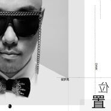
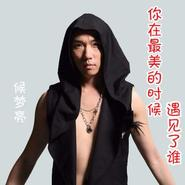
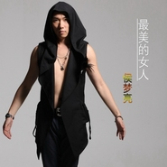

侯梦亮
============================

|  |  |
| :--: | :-- |
| [ 侯梦亮](https://i.xiami.com/houmengliang) | **播放数**: 1359363 **粉丝数**: 27 **评论数**: 4 **地区**: China 中国大陆 **风格**: 流行 Pop, 国语流行 Mandarin Pop  |

## 档案

姓名：侯梦亮 
英文名：DARK 
国籍：中国 
民族：汉族 
出生地：上海 
出生日期：1980年11月15日 
身高:178 
体重: 66kg 
职业：歌手、演员、词曲创作 
爱好: 唱歌、上网、看书. 
喜欢的颜色: 黑色、灰色、紫色. 
职业：歌手、演员、词曲创作 
毕业院校：演艺学院 
经纪公司：北京华数唱片公司 
代表作品：《爱的那么傻》《谷底》 
华数唱片旗下艺人侯梦亮，曾获得1999年东方新人歌唱大赛二等奖 2011年轩尼诗炫音之乐歌手大赛10强 
选手并录制海阔天空mv 2012年酷我音乐唱吧半曲成名10强选手等成绩。 
个人经历 
1996年--1998年参加星河艺校明星班培训 
1998年--1999年参加天韵娱乐公司培训曾师从于杨玉蓉教授、潘乃宪教授和潘胜华教授学习声音技巧著名 
音乐人 海政文工团付林将军学生之一 。 
2007年经营上海海之音文化传播有限公司 
2009年—2011年 中央音乐学院 
2011年加入中国演艺联盟 
曾获得1999年东方新人歌唱大赛二等奖 
曾获得2000年亚洲音乐节歌唱大赛三等奖 
曾获得2002年第十界全国青年歌手大奖赛上海赛区金奖 
曾参加湖北电视台 综艺节目 
曾参加上海电视台 八一放歌,青海放歌, 
曾参加上海电视台 综艺节目 
曾参加第十届上海国际艺术节开幕式闵行合唱节,担任领唱”地球是个美丽的圆” 
曾担任上海闵行区区歌 主唱之一 
曾参加中央电视台心连心艺术团在沈阳的大型演出活动, 
曾参加中央电视台 在上海的演出 
曾参加中央电视台 在上海交大的演出 
曾参加 金茂大型音乐会, 
曾参加第一届全国流行歌曲大赛总决赛。演唱伍思凯歌曲better city better life 
曾参加2011年中央电视台（一起音乐吧）多期节目 
曾录制巍峰营（我在改变）励志音乐短片并担任巍峰营网站形象代言人 
曾获得2011年轩尼诗炫音之乐歌手大赛10强选手并录制海阔天空mv 
曾获得2012年酷我音乐唱吧半曲成名10强选手 
参加赛事 
颠覆50进20比赛时舞台形象的侯梦亮，弄了新造型，还把头发改成花白色。对此谷峰指出：频繁变换造型 
并非好事，声音才是你的本钱。因为心的安定对音乐的发展是很重要的。声音好坏，比赛输赢，大家是否 
记得住你与造型创新变换并无直接关系。关于选手造型，评委谷峰说：&'捯饬'可以，但千万别瞎捯饬。 
&谷峰认为，选手们在外形展示上产生了一些误区：&建议我们的选手不要学欧美已经成名的歌星，他们的 
风格不是说学就能学的。盲目模仿往往产生反作用，找到真实自然的自己最重要，现在谈'变换'造型， 
追求百变风格等为时过早，还是花心思在唱歌和选曲上最重要。

## 专辑

| 名称 | 语种 | 唱片公司 | 发行时间 | 专辑类别 | 专辑风格 |
| :--: | :-- | :-- | :-- | :-- | :-- |
| [ 白色时光](./albums/2104200528.md) | 国语 | 南京歌者盟网络科技有限公司 | 2018年11月12日 | 录音室专辑 | 国语流行 Mandarin Pop |
| [ 素来开心](./albums/2103487110.md) | 粤语 | 南京歌者盟网络科技有限公司 | 2018年01月12日 | EP, 单曲 | 流行 Pop, 粤语流行 Cantopop |
| [ 位置](./albums/2102814829.md) | 国语 | 南京歌者盟网络科技有限公司 | 2016年12月01日 | EP, 单曲 | 流行 Pop, 国语流行 Mandarin Pop |
| [ 你在最美的时候遇见了谁](./albums/5020916267.md) | 国语 | 酷爱音乐 | 2016年09月10日 | EP, 单曲 | 国语流行 Mandarin Pop |
| [ 陌路天涯](./albums/2100359529.md) | 国语 | 酷乐传媒 | 2016年06月25日 | EP, 单曲 |  |
| [ 白子画](./albums/2100266538.md) | 国语 | 酷乐传媒 | 2016年01月26日 | EP, 单曲 |  |
| [ 黄昏渡](./albums/2100266542.md) | 国语 | 酷乐传媒 | 2016年01月26日 | EP, 单曲 |  |
| [ 致爱人](./albums/2100373889.md) | 国语 | 星外星音乐 | 2016年01月01日 | EP, 单曲 |  |
| [ 十指间](./albums/2100187694.md) | 国语 | 华数唱片 | 2015年08月28日 | EP, 单曲 |  |
| [ 谷底](./albums/414461611.md) | 国语 | 华数唱片 | 2015年04月14日 | EP, 单曲 |  |
| [ 最美的女人](./albums/772132244.md) | 国语 | 映帆音乐 | 2013年06月24日 | EP, 单曲 |  |

## 评论

|  |  |  |  |
| :-- | :-- | :-- | :-- |
|  [虾米用户](https://emumo.xiami.com/u/293692544) 你敢给我说话吗？我咬你 2019-05-02 18:39 赞(1) 踩(0) | 
好听
 |
|  [虾米用户](https://emumo.xiami.com/u/410610497)  2019-02-14 06:05 赞(1) 踩(0) | 
含泪听完，感动致深
 |
|  [虾米用户](https://emumo.xiami.com/u/122688364) 生在愤坑，长在赤圈；挣脱 2016-08-19 23:10 赞(1) 踩(0) | 
2695
 |
|  [虾米用户](https://emumo.xiami.com/u/47981117)  2015-03-09 17:33 赞(1) 踩(0) | 
好听
 |
