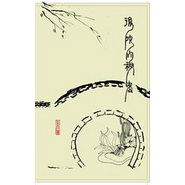

后院的秘密
============================

|  |  |
| :--: | :-- |
| [ 后院的秘密](https://emumo.xiami.com/album/228990) | **艺人**: [秘密后院](../index.md) **语种**: 国语 **唱片公司**:  **发行时间**: 2006年06月01日 **专辑类别**: EP, 单曲 **专辑风格**:  **播放数**: 4479 **收藏数**: 29 **评论数**: 15  |

## 简介

秘密后院乐队成立于2005年,前身是韶关原创音乐领军乐团"风吹耳朵"。  
秘密后院充满了东方的人文主义情怀,他们不追求时尚,摒弃一切浮光掠影的繁华和喧嚣, 从容自如的选择了一条与时俱"退"的音乐路线.主唱小匡酷爱杯中之物,喜欢边喝酒边唱歌,同时在他的作品中也弥散着一股浓烈的酒意，歌如其酒,看似平淡中其实蕴藏着一种巨大的能量,让你随时在等待一场力量的爆发。  
秘密后院擅长用中国古诗词式的语言来创作,听秘密后院的作品,犹如在品尝中国的白酒,喜欢的人自然知道其中之妙,不喜欢的也不妨笑看他们的醉态可掬。  
乐队中还有年青吉他手中的佼佼者，弹拨乐手邹广超；多才多艺擅长各种东西方乐器的吹奏乐手叶宏钢；非常年青而很有潜质的鼓手梵枫；以及小匡的糟糠吹管乐手贩贩。

## 曲目

## 评论

|  |  |  |  |
| :-- | :-- | :-- | :-- |
|  [虾米用户](https://emumo.xiami.com/u/43492923) 行到水穷我才开始害怕，夕... 2018-11-14 15:55 赞(0) 踩(0) | 
▽
 |
|  [虾米用户](https://emumo.xiami.com/u/30800139) 我在低俗与高雅间活的很尴... 2018-03-11 17:55 赞(0) 踩(0) | 
。
 |
|  [虾米用户](https://emumo.xiami.com/u/211002) 丝不如竹，竹不如肉。 2012-06-19 01:11 赞(0) 踩(0) | 
就是小匡有时候呢了不分听得我很蛋疼。。&amp;gt;,&amp;lt;
 |
|  [虾米用户](https://emumo.xiami.com/u/5912099)  2012-06-14 13:48 赞(0) 踩(0) | 
皈依
 |
|  [虾米用户](https://emumo.xiami.com/u/4818152)  2011-10-26 18:20 赞(0) 踩(0) | 
好好好
 |
|  [虾米用户](https://emumo.xiami.com/u/5735067)  2011-09-07 11:03 赞(0) 踩(0) | 
喜欢就是喜欢不废话
 |
|  [虾米用户](https://emumo.xiami.com/u/309451)  2011-06-03 16:26 赞(0) 踩(0) | 
一一道来的感觉 很好
 |
|  [虾米用户](https://emumo.xiami.com/u/1216969)  2011-05-15 02:31 赞(0) 踩(0) | 
心如止水的感觉
 |
|  [虾米用户](https://emumo.xiami.com/u/1356932)  2011-05-05 23:59 赞(0) 踩(0) | 
这个才是真正的中国风
 |
|  [虾米用户](https://emumo.xiami.com/u/2743788)  2011-02-27 19:47 赞(0) 踩(0) | 
很秘密的后院
 |
|  [虾米用户](https://emumo.xiami.com/u/373385)  2011-02-02 00:53 赞(0) 踩(0) | 
心远地自偏，独乐江湖边。真要觉得好听，何须鼓掌，相逢一笑足矣。记秘密后院的音乐
 |
|  [虾米用户](https://emumo.xiami.com/u/2171911)  2011-01-10 19:51 赞(0) 踩(0) | 
就是我的风格
 |
|  [虾米用户](https://emumo.xiami.com/u/927899) 耳际。 2010-12-17 22:23 赞(0) 踩(0) | 
我也来庆幸一下，能遇着他们。
 |
|  [虾米用户](https://emumo.xiami.com/u/2144524)  2010-12-09 12:18 赞(1) 踩(0) | 
不知不觉，听后院已经2年多了
 |
|  [虾米用户](https://emumo.xiami.com/u/535462)   2009-11-25 17:02 赞(0) 踩(0) | 
一直庆幸，遇到这支乐队，离他们这样近。
 |
