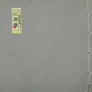

江湖边
============================

|  |  |
| :--: | :-- |
| [ 江湖边](https://emumo.xiami.com/album/332506) | **艺人**: [秘密后院](../index.md) **语种**: 国语 **唱片公司**: 铁黎学校 **发行时间**: 2009年06月06日 **专辑类别**: 录音室专辑 **专辑风格**: 独立民谣 Indie Folk, 中国民乐 Chinese Folk Music **播放数**: 969263 **收藏数**: 1875 **评论数**: 133  |

## 简介

　　钟鼓齐鸣间，截断时间之流；眼前江山，心内世界。  
万缘放下，一念单提，八支歌连缀成了这张关乎生命来去的概念唱片。从序曲小心翼翼的《来》，到尾声轻松写意的《去》，来去之间，经历了“晨钟暮鼓”的意声相和，“叶落归根”的安身立命，“灰飞烟灭”的成住坏空，“醉死梦生”的洒然抖落。  
晨钟暮鼓，惊醒的是“时间”二字。这样的『江湖边』，和常情意义下征战杀伐争名夺利的险恶江湖没有太大关系，和它有关系的是另外一些东西，比如在时间之 流里来去的生命。即使在“从江湖到江湖边”、“从一群人到一个人”这样的歌词里，也在表面一人一物一时一地的来去之后，隐藏着更深沉更无从说起的生命根底 的无奈。

## 曲目

## 评论

|  |  |  |
| :-- | :-- | :-- |
|  [虾米用户](https://emumo.xiami.com/u/215018860) 各自愈合 2018-12-30 22:56 赞(0) 踩(0) | 
暮鼓晨钟
 |
|  [虾米用户](https://emumo.xiami.com/u/43492923) 行到水穷我才开始害怕，夕... 2018-11-14 15:56 赞(0) 踩(0) | 
ˇ
 |
|  [虾米用户](https://emumo.xiami.com/u/4218777) 博学之,审问之,慎思之,... 2018-02-02 20:32 赞(0) 踩(0) | 
还是最喜欢初识这一辑。
 |
|  [虾米用户](https://emumo.xiami.com/u/9585727) 温柔待这世界。 2017-10-28 00:31 赞(3) 踩(0) | 
非常震撼且纯粹的音乐，有南北朝古风，直接打动人心。不像现在很多商业运作下的媚俗的所谓中国风的音乐。
 |
|  [虾米用户](https://emumo.xiami.com/u/4994176)   2017-09-07 13:51 赞(1) 踩(0) | 
翻出来再听 后悔没买CD，还会再版吗？
 |
|  [虾米用户](https://emumo.xiami.com/u/54551529)  2017-06-15 09:38 赞(0) 踩(0) | 
反正就是喜欢
 |
|  [虾米用户](https://emumo.xiami.com/u/11166432)  2017-05-09 15:33 赞(0) 踩(0) | 
太赞
 |
|  [虾米用户](https://emumo.xiami.com/u/8337431) 以乐会友 2017-04-04 14:48 赞(0) 踩(0) | 
129
 |
|  [虾米用户](https://emumo.xiami.com/u/7013434)  2017-03-12 20:42 赞(1) 踩(0) | 
至空
 |
|  [虾米用户](https://emumo.xiami.com/u/4487129)  2016-08-17 21:25 赞(0) 踩(0) | 
！！！
 |
|  [虾米用户](https://emumo.xiami.com/u/5955249)  2016-08-09 13:40 赞(1) 踩(0) | 
最后是有两段反复的太阳当空照 花儿对我笑
 |
|  [虾米用户](https://emumo.xiami.com/u/52913465)  2016-05-02 19:11 赞(3) 踩(0) | 
唱腔配得上词，词配得上曲，曲配得上配乐，满足了我对中国古风曲的想象。
 |
|  [虾米用户](https://emumo.xiami.com/u/773393) GALAXY 2016-04-29 00:35 赞(0) 踩(0) | 
倾听此砖 不觉时间飞逝
 |
|  [虾米用户](https://emumo.xiami.com/u/28134340) 个性签名 2016-04-27 01:55 赞(0) 踩(0) | 
我滴妈。成仙了
 |
|  [虾米用户](https://emumo.xiami.com/u/73) 不想說最後道別那兩個字，... 2016-03-18 20:37 赞(0) 踩(0) | 
放下眼前的苟且，需要停一停，遠方和詩還在心底，離開一段既有的工作和生活，從江湖到江湖邊，重聽《江湖邊》
 |
|  [虾米用户](https://emumo.xiami.com/u/15051145)  2016-03-09 19:32 赞(0) 踩(0) | 
非常好听
 |
|  [虾米用户](https://emumo.xiami.com/u/34971965) 如果说一朵花很美/那么我... 2016-03-09 14:48 赞(0) 踩(0) | 
在公众号 要复古 中看到就过来了
 |
|  [虾米用户](https://emumo.xiami.com/u/13926147)  2016-01-08 16:17 赞(0) 踩(0) | 
很喜欢的一个专辑
 |
|  [虾米用户](https://emumo.xiami.com/u/40023105)  2015-12-09 14:44 赞(0) 踩(0) | 
沉沉悠远
 |
|  [虾米用户](https://emumo.xiami.com/u/496528) 高塔 2015-09-26 12:46 赞(0) 踩(0) | 
叶落不错
 |
|  [虾米用户](https://emumo.xiami.com/u/7144481) 我还没想好要写什么... 2015-09-21 22:04 赞(0) 踩(0) | 
听到《梦生》，我感动...感...都落泪了
 |
|  [虾米用户](https://emumo.xiami.com/u/7769980) horseman, pa... 2015-09-21 17:14 赞(0) 踩(0) | 
好生潇洒~
 |
|  [虾米用户](https://emumo.xiami.com/u/4352051)  2015-09-07 22:17 赞(0) 踩(0) | 
古风悠然 个别曲目节奏感略微有些拖沓
 |
|  [虾米用户](https://emumo.xiami.com/u/43450307)  2015-09-06 10:47 赞(0) 踩(0) | 
晨钟暮鼓生，来去江湖边
 |
|  [虾米用户](https://emumo.xiami.com/u/43450308) 我本是卧龙岗散淡的人 2015-09-06 10:36 赞(0) 踩(0) | 
醉死梦生
 |
|  [虾米用户](https://emumo.xiami.com/u/46572494)  2015-09-05 20:51 赞(0) 踩(0) | 
几时归去，做个闲人，江湖边上寄余生
 |
|  [虾米用户](https://emumo.xiami.com/u/2501563) 云袂风襟。微博：璃夏_K... 2015-08-23 23:32 赞(0) 踩(0) | 
山川河流满眼。这种民谣爱啊
 |
|  [虾米用户](https://emumo.xiami.com/u/540665)  2015-08-14 00:03 赞(2) 踩(0) | 
今晚在电影频道看到一个新生代导演的习作《迷失》，反应父母争吵，家庭暴力对下一代影响的。片尾曲是《梦生》，很好听，演唱者叫“贩贩”，于是来虾米搜索，发现了这张专辑和原唱！
 |
| ⇒ |  [虾米用户](https://emumo.xiami.com/u/35510311)  2015-08-22 18:52 赞(0) 踩(0) | 
那天CCAV6放的，电视一开就听到了，瞬间泪流满面。 接着就是不断地循环播放了。
 |
|  [虾米用户](https://emumo.xiami.com/u/8769764)  2015-05-01 23:19 赞(0) 踩(0) | 
古风
 |
|  [虾米用户](https://emumo.xiami.com/u/134697)  2015-05-01 01:10 赞(0) 踩(0) | 
忘了是哪年现场带回来的这张类似历经了场火灾幸存下来的CD封，静静的躺在角落里封尘，后来这些年更是懒到在音乐节扫回来那些CD，那部分有在线资源听的盘... 连塑封都还没拆！！！ = =!!!
 |
|  [虾米用户](https://emumo.xiami.com/u/134697)  2015-05-01 01:10 赞(0) 踩(0) | 
忘了是哪年现场带回来的这张类似历经了场火灾幸存下来的CD封，静静的躺在角落里封尘，后来这些年更是懒到在音乐节扫回来那些CD，那部分有在线资源听的盘... 连塑封都还没拆！！！ = =!!!
 |
|  [虾米用户](https://emumo.xiami.com/u/135300) 过时的人 2015-04-11 08:23 赞(0) 踩(0) | 
經典中的經典啊。
 |
|  [虾米用户](https://emumo.xiami.com/u/29928958)   2015-02-15 22:34 赞(0) 踩(0) | 
非常非常棒的乐队，我听了好多年，觉得他们很天才，但是这只乐队实在太低调了
 |
| ⇒ |  [虾米用户](https://emumo.xiami.com/u/47382964)  2015-04-27 21:21 赞(0) 踩(0) | 
这就小众音乐的魅力啊 
 |
|  [虾米用户](https://emumo.xiami.com/u/37036780) 暂无签名~ 2015-02-11 12:57 赞(0) 踩(0) | 
好听
 |
|  [虾米用户](https://emumo.xiami.com/u/10786093)  2015-01-04 09:03 赞(0) 踩(0) | 
诗词朗诵添上配乐  有地方戏剧的遗风  民乐皮毛  国产氛围  南蛮休闲佳肴一碟 广式清凉饮品一杯 ，，，
 |
|  [虾米用户](https://emumo.xiami.com/u/14641183)  2014-11-12 19:54 赞(1) 踩(0) | 
无边落叶萧萧下。已旧年华似水生。
 |
|  [虾米用户](https://emumo.xiami.com/u/1945388)  2014-10-28 11:06 赞(0) 踩(0) | 
意境 禅意 很美···········
 |
|  [虾米用户](https://emumo.xiami.com/u/383284)  2014-10-14 21:32 赞(0) 踩(0) | 
vv
 |
|  [虾米用户](https://emumo.xiami.com/u/10819314) 细细打磨耳朵。 2014-09-17 22:21 赞(0) 踩(0) | 
几时归去，做个闲人，对一张琴，一壶酒，一溪云。
 |
|  [虾米用户](https://emumo.xiami.com/u/7795726)  2014-09-15 15:09 赞(0) 踩(0) | 
想起了北方，听人家说只要到过一次北京，不管走多远都会怀念她
 |
| ⇒ |  [虾米用户](https://emumo.xiami.com/u/6310680) 音乐是我的避风港 2014-12-08 01:36 赞(0) 踩(0) | 
没有错 弥漫着让我着迷的味道，那种味道就叫北京。特别是冬天的北京，也是因此喜欢上好妹妹的歌
 |
|  [虾米用户](https://emumo.xiami.com/u/12874252) 做无事人 2014-08-29 09:27 赞(0) 踩(0) | 
意境
 |
|  [虾米用户](https://emumo.xiami.com/u/9720324) 尘埃未落定 花不老 2012-09-04 13:23 赞(0) 踩(0) | 
好听
 |
|  [虾米用户](https://emumo.xiami.com/u/619055)  2012-08-18 19:38 赞(2) 踩(0) | 
别云间 三年羁旅客，今日又南冠。 无限河山泪，谁言天地宽！ 已知泉路近，欲别故乡难。 毅魄归来日，灵旗空际看。
 |
| ⇒ |  [虾米用户](https://emumo.xiami.com/u/4328467)   2015-09-19 08:04 赞(0) 踩(0) | 
小时候学这首并无甚么感受，现在看来真是泪如雨下
 |
|  [虾米用户](https://emumo.xiami.com/u/179841)  2012-08-13 11:37 赞(2) 踩(0) | 
昨晚的《暮鼓》《好了歌》《立秋》，恍然间有遗世独立的感觉
 |
|  [虾米用户](https://emumo.xiami.com/u/516791) 假酒喝多了 2012-08-10 13:53 赞(0) 踩(0) | 
侠客情缘。。。
 |
|  [虾米用户](https://emumo.xiami.com/u/10093082)  2012-08-04 22:53 赞(1) 踩(0) | 
适合明月风高的夜晚，在高山顶大江边独自赏玩，有种沧桑空茫的味道，很有禅意，如果能把人声处理得更小一些，会更苍茫高远，很符合音乐味道
 |
|  [虾米用户](https://emumo.xiami.com/u/9909930)  2012-07-22 11:28 赞(0) 踩(0) | 
似是故人来
 |
|  [虾米用户](https://emumo.xiami.com/u/3235848)  2012-07-18 20:11 赞(0) 踩(0) | 
想去小竹林里煮壶酒
 |
|  [虾米用户](https://emumo.xiami.com/u/2062187)  2012-07-17 19:33 赞(1) 踩(0) | 
和朋友聊天的时候放着豆瓣电台。突然出来这里面一首歌，我们就停下说话听了-这样的音乐就是可以再多听听的吧。
 |
|  [虾米用户](https://emumo.xiami.com/u/9516352)  2012-06-19 15:16 赞(0) 踩(0) | 
不错
 |
|  [虾米用户](https://emumo.xiami.com/u/211002) 丝不如竹，竹不如肉。 2012-06-11 10:42 赞(1) 踩(0) | 
从头听到尾，感觉死而复生了一遍。
 |
|  [虾米用户](https://emumo.xiami.com/u/418832)  2012-05-20 16:26 赞(0) 踩(0) | 
nothing
 |
|  [虾米用户](https://emumo.xiami.com/u/670744)  2012-05-14 14:43 赞(0) 踩(0) | 
江湖边
 |
|  [虾米用户](https://emumo.xiami.com/u/507374)  2012-04-11 22:15 赞(0) 踩(0) | 
下大雨听这不错。
 |
|  [虾米用户](https://emumo.xiami.com/u/3798380)  2012-03-25 17:26 赞(0) 踩(0) | 
吉他作钟鼓声 古琴声 木得区别
 |
|  [虾米用户](https://emumo.xiami.com/u/8556553)  2012-03-23 16:15 赞(0) 踩(0) | 
超喜欢
 |
|  [虾米用户](https://emumo.xiami.com/u/8468219)  2012-03-17 17:03 赞(0) 踩(0) | 
《梦生》 你的梦还是你的 我的梦还是我的 江湖的孩子江湖边飘 江湖的孩子江湖边老
 |
|  [虾米用户](https://emumo.xiami.com/u/3343295)   2012-03-02 07:28 赞(0) 踩(0) | 
峰回路转皆天涯
 |
|  [虾米用户](https://emumo.xiami.com/u/8217961)  2012-02-28 12:15 赞(0) 踩(0) | 
古风悠韵，低吟浅唱
 |
|  [虾米用户](https://emumo.xiami.com/u/7693524)  2012-02-22 14:03 赞(0) 踩(0) | 
很干净的声音。一听就感觉周围空旷安定的起鸡皮疙瘩&amp;gt;3&amp;lt;
 |
|  [虾米用户](https://emumo.xiami.com/u/650491)  2012-02-13 14:06 赞(0) 踩(0) | 
治愈系概念唱片。
 |
|  [虾米用户](https://emumo.xiami.com/u/7897624)  2012-02-03 14:05 赞(0) 踩(0) | 
另类，好像在喧嚣的尘世中突然静了下来，让人回味。
 |
|  [虾米用户](https://emumo.xiami.com/u/798876)  2012-01-22 08:57 赞(0) 踩(0) | 
越听越有味
 |
|  [虾米用户](https://emumo.xiami.com/u/446433)  2012-01-14 23:04 赞(0) 踩(0) | 
江湖路迢迢，归来叶萧萧...
 |
|  [虾米用户](https://emumo.xiami.com/u/3678789)  2012-01-09 00:22 赞(0) 踩(0) | 
来听词/
 |
|  [虾米用户](https://emumo.xiami.com/u/7221080)   2011-12-28 11:51 赞(0) 踩(0) | 
一言难尽的沧桑……
 |
|  [虾米用户](https://emumo.xiami.com/u/7319688)  2011-12-19 22:37 赞(0) 踩(0) | 
古朴
 |
|  [虾米用户](https://emumo.xiami.com/u/47530)  2011-12-03 12:52 赞(1) 踩(0) | 
中华民谣本该如此，我是真弄不明白北京那一批民谣圈的2b们是怎么理解民谣俩字的。
 |
|  [虾米用户](https://emumo.xiami.com/u/3990067)  2011-12-01 22:05 赞(1) 踩(0) | 
筑庐江湖边，向晚弄炊烟。
 |
|  [虾米用户](https://emumo.xiami.com/u/6476207)  2011-11-16 13:52 赞(0) 踩(0) | 
难得 安静
 |
|  [虾米用户](https://emumo.xiami.com/u/332883)  2011-10-22 00:39 赞(0) 踩(0) | 
越听越有味道
 |
|  [虾米用户](https://emumo.xiami.com/u/6208398)  2011-10-11 18:42 赞(0) 踩(0) | 
喜欢这种宁静
 |
|  [虾米用户](https://emumo.xiami.com/u/6177617)  2011-10-09 15:42 赞(0) 踩(0) | 
dd
 |
|  [虾米用户](https://emumo.xiami.com/u/420001)  2011-10-08 19:29 赞(0) 踩(0) | 
沉静
 |
|  [虾米用户](https://emumo.xiami.com/u/5886725)  2011-09-19 17:33 赞(0) 踩(0) | 
此生虽在堪惊
 |
|  [虾米用户](https://emumo.xiami.com/u/2871343)  2011-09-07 14:03 赞(0) 踩(0) | 
我在这里面 听到我的全部人生。。
 |
|  [虾米用户](https://emumo.xiami.com/u/2405077)  2011-09-01 20:09 赞(0) 踩(0) | 
江湖边这个专辑的每首歌的名字从头开始连起来读很好玩  来 晨钟 暮鼓 叶落 归根 灰飞 烟灭 醉生 梦死  去
 |
| ⇒ |  [虾米用户](https://emumo.xiami.com/u/540665)  2015-08-14 00:06 赞(0) 踩(0) | 
是醉死梦生，请看清楚再说
 |
|  [虾米用户](https://emumo.xiami.com/u/1258671)  2011-08-29 23:23 赞(0) 踩(0) | 
一如既往的支持不造作的新中国风
 |
|  [虾米用户](https://emumo.xiami.com/u/5516217)  2011-08-21 21:21 赞(0) 踩(0) | 
抓住我
 |
|  [虾米用户](https://emumo.xiami.com/u/326860) 暂无签名~ 2011-08-08 11:19 赞(0) 踩(0) | 
喜欢,不需要理由
 |
|  [虾米用户](https://emumo.xiami.com/u/4905090)  2011-08-05 12:42 赞(0) 踩(0) | 
好听！
 |
|  [虾米用户](https://emumo.xiami.com/u/3898785)  2011-07-22 10:59 赞(0) 踩(0) | 
这种沧桑感，难得
 |
|  [虾米用户](https://emumo.xiami.com/u/665706) 好久不来，发现好友不在了... 2011-06-28 09:49 赞(0) 踩(0) | 
彼期，江湖，路远……
 |
|  [虾米用户](https://emumo.xiami.com/u/4385232)  2011-06-25 21:00 赞(0) 踩(0) | 
静。
 |
|  [虾米用户](https://emumo.xiami.com/u/1690455)  2011-06-24 18:50 赞(0) 踩(0) | 
干净、平和、中国风
 |
|  [虾米用户](https://emumo.xiami.com/u/881838)  2011-06-24 09:52 赞(1) 踩(0) | 
静默暗哑的嗓音，庄重大气的乐声，以及古朴雅致的情意。
 |
|  [虾米用户](https://emumo.xiami.com/u/3911850)  2011-06-18 18:04 赞(0) 踩(0) | 
不一样的感觉，不一样的民谣。
 |
|  [虾米用户](https://emumo.xiami.com/u/1337914)  2011-06-15 10:45 赞(0) 踩(0) | 
心已远 地自偏
 |
|  [虾米用户](https://emumo.xiami.com/u/3898785)  2011-06-13 13:17 赞(1) 踩(0) | 
现在很少听到这种中国风的专辑了
 |
|  [虾米用户](https://emumo.xiami.com/u/2412709)  2011-05-30 02:00 赞(0) 踩(0) | 
很好
 |
|  [虾米用户](https://emumo.xiami.com/u/2969454)  2011-05-24 18:15 赞(0) 踩(0) | 
如梦
 |
|  [虾米用户](https://emumo.xiami.com/u/446433)  2011-05-12 21:52 赞(0) 踩(0) | 
安静点，平和点，悠远点，，，，
 |
|  [虾米用户](https://emumo.xiami.com/u/1356932)  2011-05-05 23:47 赞(1) 踩(0) | 
好听啊，这张写古韵的专辑真的很棒
 |
|  [虾米用户](https://emumo.xiami.com/u/997893)  2011-03-16 21:20 赞(0) 踩(0) | 
这味道...... 绝！
 |
|  [虾米用户](https://emumo.xiami.com/u/2405077)  2011-02-23 11:44 赞(1) 踩(0) | 
钟鼓齐鸣间，截断时间之流；眼前江山，心内世界。 万缘放下，一念单提，八支歌连缀成了这张关乎生命来去的概念唱片。
 |
|  [虾米用户](https://emumo.xiami.com/u/2941605)  2011-02-23 00:35 赞(0) 踩(0) | 
秘密后院
 |
|  [虾米用户](https://emumo.xiami.com/u/373385)  2011-02-02 00:54 赞(1) 踩(0) | 
心远地自偏，独乐江湖边。真要觉得好听，何须鼓掌，相逢一笑足矣。记秘密后院的音乐
 |
|  [虾米用户](https://emumo.xiami.com/u/2249589)  2010-12-21 17:42 赞(0) 踩(0) | 
路过。。。听听。。。。。。。还8错。。。。
 |
|  [虾米用户](https://emumo.xiami.com/u/927899) 耳际。 2010-12-17 22:48 赞(0) 踩(0) | 
庆幸遇到。楼下的那位实在是破坏气氛。
 |
|  [虾米用户](https://emumo.xiami.com/u/1321383)  2010-12-01 17:18 赞(0) 踩(0) | 
在杂志上看到了关于秘密后院的介绍，很好奇，来听一下，初听有一点窃喜，我想仔细听，会与更多体会吧
 |
|  [虾米用户](https://emumo.xiami.com/u/1597014)  2010-11-28 19:24 赞(0) 踩(0) | 
也许这年头有个词叫做世俗，有个词叫做古韵，但同样有个词叫装逼。
 |
|  [虾米用户](https://emumo.xiami.com/u/1821114)  2010-11-23 12:03 赞(0) 踩(0) | 
我承认这是一张装13的专辑。在这个大部人都装13的世界里，能够装成这样，已经不错了。在某些人看来，在某个下午悠然的躺在沙发上听这张专辑感觉上可能会比听爵士会更显得有格调一些。要知道其实很有一部分人是很追求小众的。古风古韵这个东西，理解得到的人不会听这张专辑，完全理解不到的人也不会听。只有那种假装理解了但又说不出所以然的人才会来听。因为其实不知道.不知所以然的感觉真的很不错。之所以说这些，不是因为觉得这张专辑不好，就本身来说，在这样的音乐环境中能听到这样的专辑已经是很多人的大幸了。只是这样的音乐对于完全理解和完全不理解的人来说，听了后都会有一个共同的感受－－蛋疼！
 |
| ⇒ |  [虾米用户](https://emumo.xiami.com/u/606976) 南来北往，人生在世，有火... 2010-11-23 18:10 赞(0) 踩(0) | 
其实按照哥们你的理解 可能任何拿出来的东西稍微做一点尝试 都是装13  如同苹果的手机  大家都是模仿但从未超越 而现在模仿不代表以后也模仿  从来都觉得没有必要和音乐较真 音乐有高下但没有好坏 每个人觉得好听才是本质 听音乐都听的哥们你蛋疼了  我觉得你该进医院了而不继续听音乐了  音乐在古代无非是取乐而已，现在一样，千万不要上升高度，我们是听众同时也是大众而不是小众
 |
| ⇒ |  [虾米用户](https://emumo.xiami.com/u/1821114)  2010-11-23 20:48 赞(0) 踩(0) | 
<q><b>马嘻嘻说：</b></q>
 |
| ⇒ |  [虾米用户](https://emumo.xiami.com/u/606976) 南来北往，人生在世，有火... 2010-11-24 18:24 赞(0) 踩(0) | 
<q><b>松弦月说：</b></q>
 |
| ⇒ |  [虾米用户](https://emumo.xiami.com/u/1821114)  2010-11-25 11:41 赞(0) 踩(0) | 
<q><b>马嘻嘻说：</b></q>
 |
| ⇒ |  [虾米用户](https://emumo.xiami.com/u/235050) 我就说我是穷逼嘛~ 2010-11-25 15:32 赞(0) 踩(0) | 
您这段话才是装B之最。所谓装B，就是不懂装懂，自以为懂，还要讲出来教育别人，一部分很天真很单纯的人或许会十分佩服阁下，夸阁下一句牛逼，这也是您的初衷吧。最后质疑一下，您跟这张碟有任何千丝万缕的联系吗？还您承认？是不是有些抬举自己了？您站在什么立场承认啊？我也不得不夸阁下一句，您太牛逼了。
 |
| ⇒ |  [虾米用户](https://emumo.xiami.com/u/1821114)  2010-11-25 21:45 赞(0) 踩(0) | 
<q><b>清风过山来说：</b></q>
 |
| ⇒ |  [虾米用户](https://emumo.xiami.com/u/1821114)  2010-11-26 02:21 赞(0) 踩(0) | 
<q><b>清风过山来说：</b></q>
 |
| ⇒ |  [虾米用户](https://emumo.xiami.com/u/927899) 耳际。 2010-12-17 22:48 赞(0) 踩(0) | 
<q><b>清风过山来说：</b></q>
 |
| ⇒ |  [虾米用户](https://emumo.xiami.com/u/235050) 我就说我是穷逼嘛~ 2010-12-17 23:58 赞(0) 踩(0) | 
<q><b>Musk ox说：</b></q>
 |
| ⇒ |  [虾米用户](https://emumo.xiami.com/u/286922)  2011-03-15 23:57 赞(0) 踩(0) | 
<q><b>马嘻嘻说：</b></q>
 |
| ⇒ |  [虾米用户](https://emumo.xiami.com/u/448227)  2017-10-30 10:13 赞(0) 踩(0) | 
<q><b>松弦月说：</b></q>
 |
| ⇒ |  [虾米用户](https://emumo.xiami.com/u/1821114)  2017-10-30 10:13 赞(0) 踩(0) | 
<q><b>汽水说：</b></q>
 |
| ⇒ |  [虾米用户](https://emumo.xiami.com/u/235050) 我就说我是穷逼嘛~ 2017-12-18 18:36 赞(0) 踩(0) | 
<q><b>松弦月说：</b></q>
 |
|  [虾米用户](https://emumo.xiami.com/u/463807) 所有真实的人生，皆是相遇 2010-11-17 20:20 赞(0) 踩(0) | 
古风古韵。
 |
|  [虾米用户](https://emumo.xiami.com/u/1414064)  2010-10-10 11:32 赞(0) 踩(0) | 
能遇到这张专辑真是我的幸运
 |
|  [虾米用户](https://emumo.xiami.com/u/198653)  2010-09-18 01:20 赞(0) 踩(0) | 
这张是在厦门录的……而且在这搞了现场……结果我刚好回家了=。=悔死我了
 |
| ⇒ |  [虾米用户](https://emumo.xiami.com/u/1339728)  2010-09-27 16:52 赞(0) 踩(0) | 
= =。。
 |
|  [虾米用户](https://emumo.xiami.com/u/11706)  2009-07-03 12:17 赞(0) 踩(0) | 
灰飞烟灭
 |
|  [虾米用户](https://emumo.xiami.com/u/234154)  2009-06-28 20:01 赞(0) 踩(0) | 
来去之间，我们经过江湖。
 |
|  [虾米用户](https://emumo.xiami.com/u/219985)  2009-06-18 10:29 赞(1) 踩(0) | 
闲僧步闲
 |
|  [虾米用户](https://emumo.xiami.com/u/202508)  2009-06-14 16:21 赞(1) 踩(0) | 
相忘于江湖
 |
|  [虾米用户](https://emumo.xiami.com/u/37728)  2009-06-12 13:22 赞(1) 踩(0) | 
心远地自偏，独乐江湖边。
 |
|  [虾米用户](https://emumo.xiami.com/u/163207) 要高品质声音 2009-06-11 19:32 赞(1) 踩(0) | 
好听
 |
|  [虾米用户](https://emumo.xiami.com/u/209388)  2009-06-11 16:45 赞(1) 踩(0) | 
刚刚把歌词放好，不知道是不是能用了……
 |
| ⇒ |  [虾米用户](https://emumo.xiami.com/u/159149)  2009-06-20 10:49 赞(0) 踩(0) | 
没反应的嘛，，，把歌词贴出来吧。。。
 |
|  [虾米用户](https://emumo.xiami.com/u/3258) 浮生如梦 2009-06-10 23:34 赞(1) 踩(0) | 
江湖儿女江湖老
 |
