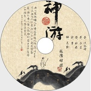

神游
============================

|  |  |
| :--: | :-- |
| [ 神游](https://emumo.xiami.com/album/412039) | **艺人**: [秘密后院](../index.md) **语种**: 国语 **唱片公司**:  **发行时间**: 2010年09月17日 **专辑类别**: EP, 单曲 **专辑风格**:  **播放数**: 6096 **收藏数**: 96 **评论数**: 43  |

## 简介

无人处孤独 人多时寂寞 独以神游 同日月交杯 与天地往来 潜行千里 进退皆缘 舞榭歌台 人聚人散 谁记： 当日西安 旧时西南 缘来一院 缘来曾见 后院最新动向：9月15日，在湛江出席”听月--湛江商业银行客户中秋联谊专场音乐会，9月17，18日参加泉州惠安“秘密后院+萧• 十三•郎 ”惠安故事酒吧专场 9月19日从惠安赶至厦门搭乘长达36小时的火车，于9月21日晨5时半到达古都西安，正式开启秋季巡演~~ 本次巡演，每场演出均准备了30张限量赠碟，收录改编李叔同的最新作品5首，皆为现场录音制作，让广大秘密后援先听为快！曲目如下：1.忆儿时，2.春景，3.秋夜，4. 梦，5.送别。

## 曲目

## 评论

|  |  |  |
| :-- | :-- | :-- |
|  [虾米用户](https://emumo.xiami.com/u/43492923) 行到水穷我才开始害怕，夕... 2018-11-14 15:56 赞(0) 踩(0) | 
▽
 |
|  [虾米用户](https://emumo.xiami.com/u/234059)  2012-09-06 19:54 赞(0) 踩(0) | 
感觉这个版本的几首更好听一些~
 |
|  [虾米用户](https://emumo.xiami.com/u/9724527)  2012-08-01 17:56 赞(0) 踩(0) | 
气氛很到位
 |
|  [虾米用户](https://emumo.xiami.com/u/1168742) Re. 2012-07-04 16:27 赞(0) 踩(0) | 
……
 |
|  [虾米用户](https://emumo.xiami.com/u/9451706)  2012-06-20 16:50 赞(0) 踩(0) | 
不错 好感觉
 |
|  [虾米用户](https://emumo.xiami.com/u/812392) q音网易搜央央小月，酷g... 2012-06-03 21:02 赞(0) 踩(0) | 
适合游神之时，国内不可多得的拥有浓烈人文特色的乐队...一壶酒，看似平淡，喝一杯酒不醉人人自醉，听歌...
 |
|  [虾米用户](https://emumo.xiami.com/u/9267149)  2012-05-24 13:57 赞(0) 踩(0) | 
找了好久了
 |
|  [虾米用户](https://emumo.xiami.com/u/9267149)  2012-05-24 13:56 赞(0) 踩(0) | 
找了好久了
 |
|  [虾米用户](https://emumo.xiami.com/u/3903670)  2012-03-16 22:57 赞(0) 踩(0) | 
打动心灵深处的神曲
 |
|  [虾米用户](https://emumo.xiami.com/u/7952020)  2012-02-07 22:29 赞(0) 踩(0) | 
有韵味，适合自己喝酒时候听
 |
|  [虾米用户](https://emumo.xiami.com/u/1030130) 和合 2012-01-22 18:19 赞(0) 踩(0) | 
国学。
 |
|  [虾米用户](https://emumo.xiami.com/u/6123062)  2011-12-09 20:48 赞(0) 踩(0) | 
曲的色调比之前的几辑温暖了很多。
 |
|  [虾米用户](https://emumo.xiami.com/u/198653)  2011-11-28 10:31 赞(0) 踩(0) | 
弟子规收到哪里去了=。=
 |
| ⇒ |  [虾米用户](https://emumo.xiami.com/u/5389316)  2011-11-29 23:53 赞(0) 踩(0) | 
同问  —  —|||
 |
| ⇒ |  [虾米用户](https://emumo.xiami.com/u/4307951)  2012-08-13 17:14 赞(0) 踩(0) | 
弟子规专辑还没出来·
 |
|  [虾米用户](https://emumo.xiami.com/u/2576240)   2011-11-18 13:10 赞(0) 踩(0) | 
神游 5首
 |
|  [虾米用户](https://emumo.xiami.com/u/6085429)  2011-10-29 10:11 赞(0) 踩(0) | 
皮鼓的弹性真好。
 |
|  [虾米用户](https://emumo.xiami.com/u/4818152)  2011-10-26 18:24 赞(0) 踩(0) | 
唐诗宋词都来点，古风盎然的
 |
|  [虾米用户](https://emumo.xiami.com/u/4173293)  2011-09-27 14:01 赞(0) 踩(0) | 
无人处孤独 人多时寂寞 独以神游 同日月交杯 与天地往来 潜行千里 进退皆缘 舞榭歌台 人聚人散
 |
|  [虾米用户](https://emumo.xiami.com/u/2335628)  2011-09-20 13:51 赞(0) 踩(0) | 
《两忘》什么时候出来呀？
 |
|  [虾米用户](https://emumo.xiami.com/u/3411455)   2011-09-17 21:54 赞(0) 踩(0) | 
虽然只有四首但是都是精品
 |
|  [虾米用户](https://emumo.xiami.com/u/5836291)  2011-09-15 20:32 赞(0) 踩(0) | 
最爱《忆儿时》、《送别》
 |
|  [虾米用户](https://emumo.xiami.com/u/5735067)  2011-09-09 16:31 赞(0) 踩(0) | 
喜欢就喜欢
 |
|  [虾米用户](https://emumo.xiami.com/u/326860) 暂无签名~ 2011-08-08 11:30 赞(0) 踩(0) | 
怀念。那股味道。
 |
|  [虾米用户](https://emumo.xiami.com/u/573642) 常不在线请留言 2011-07-26 14:01 赞(0) 踩(0) | 
小匡演绎的李叔同最有韵味
 |
|  [虾米用户](https://emumo.xiami.com/u/4901725)  2011-07-18 22:10 赞(0) 踩(0) | 

 |
|  [虾米用户](https://emumo.xiami.com/u/665706) 好久不来，发现好友不在了... 2011-06-28 09:50 赞(0) 踩(0) | 
神游
 |
|  [虾米用户](https://emumo.xiami.com/u/4100653)  2011-05-28 23:06 赞(0) 踩(0) | 
中国达人秀
 |
|  [虾米用户](https://emumo.xiami.com/u/79199)  2011-04-18 01:21 赞(0) 踩(0) | 
好听的
 |
|  [虾米用户](https://emumo.xiami.com/u/2743788)  2011-02-27 19:26 赞(0) 踩(0) | 
心静则神游
 |
|  [虾米用户](https://emumo.xiami.com/u/373385)  2011-02-02 00:51 赞(0) 踩(0) | 
心远地自偏，独乐江湖边。真要觉得好听，何须鼓掌，相逢一笑足矣。记秘密后院的音乐
 |
|  [虾米用户](https://emumo.xiami.com/u/2237705)  2011-01-12 10:01 赞(0) 踩(0) | 
喜欢这种感觉
 |
|  [虾米用户](https://emumo.xiami.com/u/2171911)  2011-01-12 00:44 赞(0) 踩(0) | 
神游，神作！ 伟大的作品！
 |
|  [虾米用户](https://emumo.xiami.com/u/501872)  2010-11-28 13:44 赞(0) 踩(0) | 
很好听啊...感觉和白水差不多
 |
| ⇒ |  [虾米用户](https://emumo.xiami.com/u/1878046)  2011-03-27 22:28 赞(0) 踩(0) | 
我也觉得~
 |
| ⇒ |  [虾米用户](https://emumo.xiami.com/u/535462)   2011-08-20 01:05 赞(0) 踩(0) | 
差别很大，毕竟后院是用普通话在唱歌，走的更偏古风。
 |
| ⇒ |  [虾米用户](https://emumo.xiami.com/u/198653)  2011-11-28 10:46 赞(0) 踩(0) | 
因为你是贵阳的……不熟悉川南口音的听白水还是有点别扭= =不过白水的现场赞爆了！
 |
|  [虾米用户](https://emumo.xiami.com/u/1526411)  2010-11-24 15:44 赞(0) 踩(0) | 
我竟然是第一个试听的~~
 |
|  [虾米用户](https://emumo.xiami.com/u/906933)  2010-11-24 13:54 赞(0) 踩(0) | 
还有类似的 音乐专辑么
 |
| ⇒ |  [虾米用户](https://emumo.xiami.com/u/108876)  2010-11-25 07:40 赞(0) 踩(0) | 
窦唯的有些挺类似的 还有  西皮士的
 |
| ⇒ |  [虾米用户](https://emumo.xiami.com/u/535462)   2011-08-20 01:09 赞(0) 踩(0) | 
<q><b>psr0071说：</b></q>
 |
| ⇒ |  [虾米用户](https://emumo.xiami.com/u/940867)  2011-12-17 22:33 赞(0) 踩(0) | 
<q><b>superfei说：</b></q>
 |
|  [虾米用户](https://emumo.xiami.com/u/1592722)  2010-11-24 13:38 赞(0) 踩(0) | 
沙发
 |
