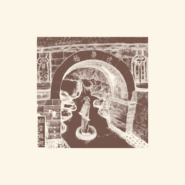

逢渠桥
============================

|  |  |
| :--: | :-- |
| [ 逢渠桥](https://emumo.xiami.com/album/5021388398) | **艺人**: [秘密后院](../index.md) **语种**: 国语 **唱片公司**: Self-Released **发行时间**: 2020年09月03日 **专辑类别**: EP, 单曲 **专辑风格**: 民谣 Folk **播放数**: 20243 **收藏数**: 22 **评论数**: 6  |

## 简介

逢渠桥

《云游·洞山》之一

词曲/吉他/采样：匡笑余

三弦/吉他：邹广超

口琴/女声：贩贩

男声合声：哓哓

鼓/录制：阿星

编曲：秘密后院

 

原画手绘：破水

封面设计：何子健

 

1关于《逢渠桥》

江西宜丰县洞山密林古道间，有桥名逢渠。

北宋绍圣五年，纪念洞山祖师良价禅师睹影逢渠，于此悟道而建。

渠者，古语意指“他”，与今之粤语“佢”同音同义。

逢渠，即逢他。

他即自己。

良价禅师留偈云：

切忌从他觅，迢迢与我疏

我今独自往，处处得逢渠

渠今正是我，我今不是渠

应须恁么会，方得契如如

庚子六月，与亲眷友人结夏洞山，古道藏香火，深林正逢渠，行吟过江湖，作歌恰笑余。

 

2关于《云游·洞山》

《云游》是秘密后院崭新的音乐计划。

以采风创作为目的，江湖游走，并因此产生后续专辑。

《云游·洞山》是这个系列的第一张，因结夏洞山命名。

自《逢渠桥》始，陆续发布四首单曲之后，结集做完整篇发布。

 

秘密后院：匡笑余

18/08/2020

## 曲目

## 评论

|  |  |  |  |
| :-- | :-- | :-- | :-- |
|  [虾米用户](https://emumo.xiami.com/u/330004023)  2020-09-06 15:41 赞(0) 踩(0) | 
不错
 |
|  [虾米用户](https://emumo.xiami.com/u/121702052) 超脱 2020-09-06 06:39 赞(0) 踩(0) | 

 |
|  [虾米用户](https://emumo.xiami.com/u/318395521)  2020-09-03 17:46 赞(0) 踩(0) | 
真好
 |
|  [虾米用户](https://emumo.xiami.com/u/12759863) 天下大美，本无常主。有缘... 2020-09-03 13:16 赞(4) 踩(0) | 
后院不好找，你不知道在哪儿，也不知道哪条路通往这个神秘安详的世外桃源。或许，某天你受朋友之邀，跋山涉水后推开柴扉，山野花草遮掩住了所有的人，只剩你自己静观世事沧桑。
 |
|  [虾米用户](https://emumo.xiami.com/u/8063623)  2020-09-03 08:57 赞(0) 踩(0) | 
一如既往
 |
|  [虾米用户](https://emumo.xiami.com/u/2447946) 需要阳光音乐 2020-09-03 01:27 赞(1) 踩(0) | 
十年磨一剑
 |
