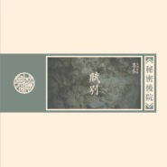

赋别
============================

|  |  |
| :--: | :-- |
| [ 赋别](https://emumo.xiami.com/album/5021431187) | **艺人**: [秘密后院](../index.md) **语种**: 国语 **唱片公司**: Self-Released **发行时间**: 2020年09月10日 **专辑类别**: EP, 单曲 **专辑风格**: 民谣流行 Folk Pop **播放数**: 31619 **收藏数**: 41 **评论数**: 7  |

## 简介

《赋别》是秘密后院2020年悄无声息发佈的新专辑《三个短篇》其中之一，一套三张各成篇章的CD，另两个短篇分别是《三清巷》和《沉园二首》。

《赋别》来自郑愁予老先生的诗，距离我给他老人家去电邮申请版权，也已经过去三年了，内心常生惶恐，失信于人固然不可，失信于老人家就是罪过。

我也是离乡的人和命，我知道随著世态人心的变迁，故乡终有一天会成为单纯的思念和纪念。

我先是从原诗摘出一段，写了《念此际》，直到现在我都能清晰回忆起写这首歌的场景——风雨大醉，踉跄归家，脚踏水洼，忽而成歌。

《赋别》的诵读，上承自《寻隐者不遇／一念》和《燕青辞行／道情丙申卷》，这都是一种读流年的自我方式。

专辑购买，请谘询：门唱片

秘密后院：匡笑余

27/08/2020

## 曲目

## 评论

|  |  |  |
| :-- | :-- | :-- |
|  [虾米用户](https://emumo.xiami.com/u/12759863) 天下大美，本无常主。有缘... 2020-09-10 21:54 赞(3) 踩(0) | 
开心的时候，请来后院 难过的时候，请来后院 安静的时候，请来后院 热闹的时候，请来后院
 |
|  [虾米用户](https://emumo.xiami.com/u/314515234)  2020-09-10 19:08 赞(1) 踩(0) | 
后院的曲风不是更该配周梦蝶的诗么？
 |
|  [虾米用户](https://emumo.xiami.com/u/7576962) 大锯子 2020-09-10 01:18 赞(2) 踩(0) | 
月白风清，万籁俱寂。窗放群山，怀人不见。
 |
|  [虾米用户](https://emumo.xiami.com/u/6492144) 衰人美如斯 2020-09-10 00:20 赞(0) 踩(0) | 
第二～～
 |
|  [虾米用户](https://emumo.xiami.com/u/293706735) 新浪微博：@归德府閒人 2020-09-10 00:10 赞(4) 踩(0) | 
水乱明霞，途径迷惘，舟轻荡。 人间草木几回春？ 红尘百戏，江湖相忘，世事变迁无常。 日落竹林山寺，夜渡江客人还。 芒鞋踏破九重山，蓑衣斗笠浮云处。 山城停泊轻烟下。
 |
|  [虾米用户](https://emumo.xiami.com/u/356180625) 春与秋其代序 2020-09-10 00:01 赞(0) 踩(0) | 
我是第一哈哈哈哈哈
 |
