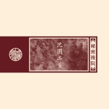

沈园二首
============================

|  |  |
| :--: | :-- |
| [ 沈园二首](https://emumo.xiami.com/album/5021467731) | **艺人**: [秘密后院](../index.md) **语种**: 国语 **唱片公司**: Self-Released **发行时间**: 2020年09月17日 **专辑类别**: EP, 单曲 **专辑风格**: 民谣流行 Folk Pop **播放数**: 68881 **收藏数**: 200 **评论数**: 18  |

## 简介

原诗：陆游

曲/吉他/采样/唱：匡笑余

吉他/中阮：邹广超

箫：哓哓

古琴：佘立宇

编曲：秘密后院

录音製作：阿星

出品：门唱片

《沈园二首》是秘密后院2020年悄无声息发佈的新专辑《三个短篇》其中之一，一套三张 各成篇章的CD。另两个短篇分别是《三清巷》和《赋别》。

《沈园二首/现场版》选自2018重庆演出的现场，《沈园二首/创作版》则还原了2016年写歌时的情绪。

因一首歌衍生出几首曲子，是我一直想玩 的事。词意人声诉之不尽的，就让琴箫继续倾吐吧。所以乐队分别又做了箫、古琴、吉他和阮，三首纯器乐曲的呈现。

专辑购买，请咨询：门唱片

## 曲目

## 评论

|  |  |  |
| :-- | :-- | :-- |
|  [虾米用户](https://emumo.xiami.com/u/3914044) “” 2020-09-23 07:55 赞(0) 踩(0) | 
沈园~沈园
 |
|  [虾米用户](https://emumo.xiami.com/u/25233309)  2020-09-22 08:33 赞(0) 踩(0) | 
挺有特色的。
 |
|  [虾米用户](https://emumo.xiami.com/u/3714518) 死人 2020-09-18 16:30 赞(0) 踩(0) | 
想去现场
 |
|  [虾米用户](https://emumo.xiami.com/u/547627) 一台漫游银河系的机器人 2020-09-18 15:01 赞(1) 踩(0) | 
想买实体专
 |
|  [虾米用户](https://emumo.xiami.com/u/20421407) 欢迎来到治愈荒芜的国度。 2020-09-18 10:43 赞(0) 踩(0) | 
瞬间让人静下来。惊喜
 |
|  [虾米用户](https://emumo.xiami.com/u/39477610) 强哥 2020-09-18 10:36 赞(0) 踩(0) | 
可以
 |
|  [虾米用户](https://emumo.xiami.com/u/15233809) 有阴影的地方，必定有光。 2020-09-18 07:06 赞(2) 踩(0) | 
无意中点进来，声声入耳，惊艳！
 |
|  [虾米用户](https://emumo.xiami.com/u/347352104) 再见 我不爱你 2020-09-17 23:27 赞(1) 踩(0) | 

 |
|  [虾米用户](https://emumo.xiami.com/u/35241662) 清浊自甚 神灵明鉴 2020-09-17 22:41 赞(0) 踩(0) | 

 |
|  [虾米用户](https://emumo.xiami.com/u/3154605)  2020-09-17 22:05 赞(0) 踩(0) | 
无友伴酒何以听啊 
 |
|  [虾米用户](https://emumo.xiami.com/u/46973033) …… 2020-09-17 20:50 赞(0) 踩(0) | 

 |
|  [虾米用户](https://emumo.xiami.com/u/959782)  2020-09-17 20:33 赞(0) 踩(0) | 
庆幸在南宁KING OF LIVE感受过&amp;amp;lt;神游&amp;amp;gt;现场.很棒.!!
 |
|  [虾米用户](https://emumo.xiami.com/u/344018512) 我还没想好要写什么... 2020-09-17 19:04 赞(0) 踩(0) | 
D
 |
|  [虾米用户](https://emumo.xiami.com/u/441548640)  2020-09-17 18:13 赞(0) 踩(0) | 
喜欢
 |
|  [虾米用户](https://emumo.xiami.com/u/312067377)  2020-09-17 11:35 赞(0) 踩(0) | 
好听
 |
|  [虾米用户](https://emumo.xiami.com/u/48656505)  2020-09-17 10:28 赞(0) 踩(0) | 
好听，感动
 |
|  [虾米用户](https://emumo.xiami.com/u/121702052) 超脱 2020-09-17 10:16 赞(0) 踩(0) | 

 |
|  [虾米用户](https://emumo.xiami.com/u/363856294)  2020-09-17 00:42 赞(0) 踩(0) | 
又回沈园，那种夏夜的淡然…
 |
