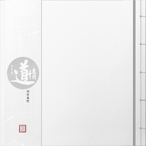

道情·丙申卷
============================

|  |  |
| :--: | :-- |
| [ 道情·丙申卷](https://emumo.xiami.com/album/5022021316) | **艺人**: [秘密后院](../index.md) **语种**: 国语 **唱片公司**: Self-Released **发行时间**: 2018年02月03日 **专辑类别**: 录音室专辑 **专辑风格**: 世界音乐 World Music **播放数**: 24648 **收藏数**: 291 **评论数**: 20  |

## 简介

道家所唱者，飞御天表，游览太虚，俯视八紘，志在冲漠之上，寄傲宇宙之间，慨古惑今，有乐道徜徉之情，故曰「道情」。

 ──明朱权《太和正音谱》之《词林须知》

 .

道情是秘密后院创作的持续主题。

2018年，秘密后院发行了《道情·丙申卷》。此乃「道情系列」之二，仍然延续了2016《道情·乙未卷》从装帧到内容的一贯性。

和乙未卷一样，除了自己创作的曲目，专辑中仍有大量道家人物的诗词文本。

 

卑微的唱道者涉世而来

不惊波澜

不兴水波

只唱些道心人情

 

演奏/编曲/製作：秘密后院

录音：阿星

专辑设计：世通

 

这其实已是张老专辑，自专辑发行之后，还未于任何平台上架，此次首次全网发布。

购买实体专辑请联系：门唱片。

## 曲目

## 评论

|  |  |  |  |
| :-- | :-- | :-- | :-- |
|  [虾米用户](https://emumo.xiami.com/u/6224452) snapebubu 2020-12-24 22:36 赞(0) 踩(0) | 
️
 |
|  [虾米用户](https://emumo.xiami.com/u/432431416) 戏曲/音乐剧/爵士乐/歌... 2020-12-13 13:16 赞(0) 踩(0) | 
巡演安排
 |
|  [虾米用户](https://emumo.xiami.com/u/51485746)  2020-11-28 05:49 赞(0) 踩(0) | 
有点意思，很适合睡觉前听也适合起床听。舒服
 |
|  [虾米用户](https://emumo.xiami.com/u/210937971) 我还没想好要写什么... 2020-11-27 23:12 赞(1) 踩(0) | 
澄明，心拙粗茶，砺器素衣，旧牒残局，余炭
 |
|  [虾米用户](https://emumo.xiami.com/u/279014778) 这家伙很聪明什么也没留下... 2020-11-27 21:54 赞(0) 踩(0) | 
好汀╮(╯▽╰)╭
 |
|  [虾米用户](https://emumo.xiami.com/u/27224600)  2020-11-27 17:20 赞(0) 踩(0) | 
太爱了
 |
|  [虾米用户](https://emumo.xiami.com/u/99436046) “ hey ” 2020-11-27 16:00 赞(0) 踩(0) | 
dd
 |
|  [虾米用户](https://emumo.xiami.com/u/767612) 我还没想好要写什么... 2020-11-27 11:08 赞(0) 踩(0) | 
巡演了，招呼一声...
 |
|  [虾米用户](https://emumo.xiami.com/u/10900514)  2020-11-27 08:19 赞(0) 踩(0) | 
支持
 |
|  [虾米用户](https://emumo.xiami.com/u/3714518) 死人 2020-11-27 00:03 赞(0) 踩(0) | 
开心
 |
|  [虾米用户](https://emumo.xiami.com/u/293706735) 新浪微博：@归德府閒人 2020-11-26 22:07 赞(0) 踩(0) | 
好味！
 |
|  [虾米用户](https://emumo.xiami.com/u/73) 不想說最後道別那兩個字，... 2020-11-26 17:42 赞(0) 踩(0) | 
唱一曲歸來未晚，這張舊年專輯終於數字上線了！
 |
|  [虾米用户](https://emumo.xiami.com/u/43318726)  2020-11-26 16:55 赞(0) 踩(0) | 
支持
 |
|  [虾米用户](https://emumo.xiami.com/u/121702052) 超脱 2020-11-26 16:03 赞(0) 踩(0) | 

 |
|  [虾米用户](https://emumo.xiami.com/u/212185504) 街边孩童嬉闹，抬眼花自笑 2020-11-26 16:00 赞(0) 踩(0) | 
来了来了
 |
|  [虾米用户](https://emumo.xiami.com/u/8308693) 或许某一天一把琴两亩地 2020-11-26 15:51 赞(0) 踩(0) | 
沙发
 |
|  [虾米用户](https://emumo.xiami.com/u/212449374) 那风，那云，那雷。写写写... 2020-11-26 15:23 赞(1) 踩(0) | 
每每遇到这样的音乐，嫉妒之心油然而生。但，爱胜于嫉妒。
 |
|  [虾米用户](https://emumo.xiami.com/u/212356465) 庸人罢了 2020-11-26 14:19 赞(0) 踩(0) | 
晚来的道情
 |
|  [虾米用户](https://emumo.xiami.com/u/3289590) 我还没想好要写什么... 2020-11-26 12:23 赞(0) 踩(0) | 
还不错
 |
|  [虾米用户](https://emumo.xiami.com/u/316261284) ☁:星屿___ 2020-11-26 12:23 赞(0) 踩(0) | 
✨
 |
