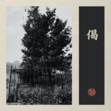

偈
============================

|  |  |
| :--: | :-- |
| [ 偈](https://emumo.xiami.com/album/5022302413) | **艺人**: [秘密后院](../index.md) **语种**: 国语 **唱片公司**: Self-Released **发行时间**: 2020年12月29日 **专辑类别**: EP, 单曲 **专辑风格**: 民谣 Folk **播放数**: 28600 **收藏数**: 17 **评论数**: 3  |

## 简介

偈

《云游·洞山》之三

1

据《指月录》记载，该罗汉松系良价禅师弟子青林师虔禅师所植。植松时，青林师虔禅师作偈曰：“常常三尺余，郁郁覆芳草。不知何代人，得见此松老。”二00五年七月，该千年罗汉松被风吹倒，翌年复萌。

——录自洞山普利禅寺《洞山罗汉松碑》

2

关于《云游·洞山》

《云游》是秘密后院崭新的音乐计划。

以采风创作为目的，江湖游走，并因此产生后续专辑。

《云游·洞山》是这个系列的第一张，因结夏洞山命名。

自《逢渠桥》始，陆续发布四首单曲之后，结集做完整篇发布。

秘密后院：匡笑余

7/12/2020是日大雪

## 曲目

## 评论

|  |  |  |
| :-- | :-- | :-- |
|  [虾米用户](https://emumo.xiami.com/u/311041014) 岁月长，衣衫薄。来日方长... 2020-12-31 22:35 赞(1) 踩(0) | 
浮生半梦醒，荒海度余生
 |
|  [虾米用户](https://emumo.xiami.com/u/807297)  2020-12-31 12:29 赞(2) 踩(0) | 
人生在世忽然而已……
 |
|  [虾米用户](https://emumo.xiami.com/u/55298997) 虾米制造惊喜，网易保管回... 2020-12-30 21:10 赞(2) 踩(0) | 
长长的调，平常而不平凡，浅尝回味久久
 |
