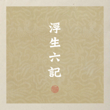

秘密后院
============================

|  |  |
| :--: | :-- |
| [ 秘密后院](https://i.xiami.com/mimihouyuan) | **地区**: China 中国大陆 **风格**: 中国风 China-Wave, 传统民谣 Traditional Folk **播放数**: 4521327 **粉丝数**: 12212 **评论数**: 391  |

## 档案

秘密後院，一支極具中國傳統人文情懷的獨立民謠樂隊。以民謠為基，傳統為本，吉他、彈撥民樂、古琴、簫、鼓為器，道情為意，致力於生命自身的觀照。成立於二零零六年廣州，樂隊成員多已而立。秉承傳統，風格古樸，作風低調。早期以傳統詩詞展現中國文字之美，又試以出世之眼觀世間有情。清靜雅致，沉謐內斂，簡約素樸，志在修舊。音樂是他們的世間法，故曰“不說此生話，只言三世情”。 秘密後院的音樂摒棄了一切浮光掠影的繁華和喧囂，獨以詩詞語言和雅致內斂的編曲，來展現中國文字之美、傳統文化的動人之處。      2006年，DEMO《後院的秘密》   2007年，DEMO《靜》   2008年，Live《去年夏天》   2008年，樂隊成員作品合輯《後院•諸子列傳（之壹）》   2009年，專輯《江湖邊》   2011年，專輯《神遊•李叔同先生樂歌小唱集》   2012年，雙CD專輯《一念》   2012年，專輯《江湖邊》星外星再版   2013年，專輯《弟子歸》   2014年，雙張專輯《後院的秘密x靜》再版   2015年，專輯《人間世》   2016年，專輯《道情（乙未卷）》    2018年，專輯《道情（丙申卷）》  2019年，專輯《江湖邊》門唱片再版   2019年，雙專輯現場錄音《浮生六記》＋《弟子歸》  2020年，專輯《三個短篇》    現階段成員：   主創/唱/木吉他：匡笑余   彈撥樂：鄒廣超   古琴：佘立宇   簫/塤/笛：謝翔（嘵嘵）   口琴/電鋼琴/女聲：黃凡（販販）

## 专辑

| 名称 | 语种 | 唱片公司 | 发行时间 | 专辑类别 | 专辑风格 |
| :--: | :-- | :-- | :-- | :-- | :-- |
| [ 洞山联句](./albums/5022614669.md) | 国语 | Self-Released | 2021年01月28日 | EP, 单曲 | 民谣 Folk |
| [ 偈](./albums/5022302413.md) | 国语 | Self-Released | 2020年12月29日 | EP, 单曲 | 民谣 Folk |
| [ 林下](./albums/5021780044.md) | 国语 | Self-Released | 2020年10月28日 | EP, 单曲 | 民谣 Folk |
| [ 三清巷](./albums/5021632732.md) | 国语 | Self-Released | 2020年10月08日 | EP, 单曲 | 民谣 Folk |
| [ 浮生六记](./albums/5021500904.md) | 国语 | Self-Released | 2020年09月24日 | EP, 单曲 | 民谣 Folk |
| [ 沈园二首](./albums/5021467731.md) | 国语 | Self-Released | 2020年09月17日 | EP, 单曲 | 民谣流行 Folk Pop |
| [ 赋别](./albums/5021431187.md) | 国语 | Self-Released | 2020年09月10日 | EP, 单曲 | 民谣流行 Folk Pop |
| [ 逢渠桥](./albums/5021388398.md) | 国语 | Self-Released | 2020年09月03日 | EP, 单曲 | 民谣 Folk |
| [ 道情·丙申卷](./albums/5022021316.md) | 国语 | Self-Released | 2018年02月03日 | 录音室专辑 | 世界音乐 World Music |
| [ 神游](./albums/412039.md) | 国语 |  | 2010年09月17日 | EP, 单曲 |  |
| [ 江湖边](./albums/332506.md) | 国语 | 铁黎学校 | 2009年06月06日 | 录音室专辑 | 独立民谣 Indie Folk, 中国民乐 Chinese Folk Music |
| [ 后院·诸子列传 之一](./albums/305398.md) | 国语 |  | 2008年10月01日 | 录音室专辑 |  |
| [ 去年夏天live@728](./albums/397544.md) | 国语 |  | 2008年07月28日 | 现场专辑 |  |
| [ 秘密后院.静](./albums/228991.md) | 国语 |  | 2007年07月01日 | 录音室专辑 |  |
| [ 后院的秘密](./albums/228990.md) | 国语 |  | 2006年06月01日 | EP, 单曲 |  |

## 评论

|  |  |  |
| :-- | :-- | :-- |
|  [虾米用户](https://emumo.xiami.com/u/402001484) 前尘终为尘 2021-01-17 23:45 赞(0) 踩(0) | 
后院会去哪里呢？
 |
|  [虾米用户](https://emumo.xiami.com/u/951418) 一切过往，皆为序章。 2021-01-03 22:39 赞(0) 踩(0) | 
仓
 |
|  [虾米用户](https://emumo.xiami.com/u/12703999) 虾米，再见。 2020-11-26 23:37 赞(0) 踩(0) | 
为何《道情》整张专辑都没有了？
 |
|  [虾米用户](https://emumo.xiami.com/u/2279444) 爱在左，同情在右。 2020-10-28 07:08 赞(0) 踩(0) | 
巡演希望有南京
 |
|  [虾米用户](https://emumo.xiami.com/u/933157) 泥豪啊同志！ 2020-10-17 11:35 赞(0) 踩(0) | 
已
 |
|  [虾米用户](https://emumo.xiami.com/u/2233259) 毛裤 2020-09-26 15:35 赞(3) 踩(0) | 
为什么那么多年轻人觉得民乐土呢 明明好听到爆炸
 |
|  [虾米用户](https://emumo.xiami.com/u/121702052) 超脱 2020-09-06 06:41 赞(0) 踩(0) | 
.
 |
|  [虾米用户](https://emumo.xiami.com/u/1308967) 虾米听重型极端音乐这块的... 2020-02-26 22:23 赞(0) 踩(0) | 
道情何处去了呀。
 |
|  [虾米用户](https://emumo.xiami.com/u/432411603)  2019-12-11 23:24 赞(0) 踩(0) | 
晕~歌些喃？。。。。。。。。。。。。。
 |
|  [虾米用户](https://emumo.xiami.com/u/1618810) 毙 2019-10-14 17:37 赞(1) 踩(0) | 
原来周浩的纪录片用过秘密后院的歌啊
 |
|  [虾米用户](https://emumo.xiami.com/u/274035046) 人宅心浪 2019-09-12 09:31 赞(3) 踩(0) | 
如何才能听到所有的歌？有其他网站还是付费？在哪付费？好听的歌值得付出而得。
 |
| ⇒ |  [虾米用户](https://emumo.xiami.com/u/212356465) 庸人罢了 2019-12-21 14:57 赞(0) 踩(0) | 
网易云比这里多一点
 |
|  [虾米用户](https://emumo.xiami.com/u/8700921) 一钩新月天如水 2019-08-29 09:09 赞(1) 踩(0) | 
《归隐》和《太上》怎么没了啊？
 |
|  [虾米用户](https://emumo.xiami.com/u/240891898)  2019-08-20 22:25 赞(0) 踩(0) | 
终于又多了三首能听
 |
|  [虾米用户](https://emumo.xiami.com/u/172344216)  2019-08-19 07:39 赞(0) 踩(0) | 
觉得曲风过于单一 不是说唱的不好 只是每首的味道差不多
 |
|  [虾米用户](https://emumo.xiami.com/u/100134108) 我还没想好要写什么... 2019-06-12 22:44 赞(2) 踩(0) | 
何时再上架？？ 
 |
|  [虾米用户](https://emumo.xiami.com/u/212356465) 庸人罢了 2019-06-01 18:29 赞(2) 踩(0) | 
没了我擦，还好下了几首最喜欢的
 |
|  [虾米用户](https://emumo.xiami.com/u/23114475) 万籁皆有声 2019-05-23 10:18 赞(0) 踩(0) | 
版权在哪呀？
 |
|  [虾米用户](https://emumo.xiami.com/u/49078998) 抽抽烟 听听歌 2019-05-05 05:03 赞(0) 踩(0) | 
为什么不见了 惨
 |
|  [虾米用户](https://emumo.xiami.com/u/12832061) 行善沒有條件 2019-04-28 22:26 赞(0) 踩(0) | 
居然沒有了
 |
|  [虾米用户](https://emumo.xiami.com/u/12832061) 行善沒有條件 2019-04-28 22:26 赞(0) 踩(0) | 
居然都沒有了
 |
|  [虾米用户](https://emumo.xiami.com/u/1423363)  2019-04-27 18:18 赞(0) 踩(0) | 
没了 来解释一下
 |
|  [虾米用户](https://emumo.xiami.com/u/49905125)  2019-04-11 20:31 赞(1) 踩(0) | 
专辑下架了？？弟子规什么的十多天前还能听。。。
 |
|  [虾米用户](https://emumo.xiami.com/u/44191355) Bidalaska 2019-02-14 14:20 赞(0) 踩(0) | 
好乐队，关注了 
 |
|  [虾米用户](https://emumo.xiami.com/u/43492923) 行到水穷我才开始害怕，夕... 2018-11-14 15:54 赞(1) 踩(0) | 
▽
 |
|  [虾米用户](https://emumo.xiami.com/u/7410142) 假使观看远山的晚霞。 2018-10-27 21:08 赞(1) 踩(0) | 
什么时候再来上海。
 |
|  [虾米用户](https://emumo.xiami.com/u/228843687) 懒惰统治人间 2018-10-10 20:36 赞(0) 踩(0) | 
。
 |
|  [虾米用户](https://emumo.xiami.com/u/331760842)  2018-09-04 16:04 赞(0) 踩(0) | 
你好 我这里有一个使用权 想跟您讨论一下 有时间 请回复一下 谢谢～
 |
|  [虾米用户](https://emumo.xiami.com/u/378109152)  2018-07-24 02:07 赞(4) 踩(0) | 
感觉后院的歌里藏着很深很深的孤独。生命的快乐与悲伤，除了偶尔在酒后吐露，还能从你们的歌里表达和分享，如饮醇酒，百转千回，首首感叹～ 还有，期待更多的经典老歌被你们演绎
 |
| ⇒ |  [虾米用户](https://emumo.xiami.com/u/376889075)  2018-09-02 19:41 赞(0) 踩(0) | 
每一首音乐都有灵魂，都是故事，就看你是否懂得曲词唱者的内心世界了。
 |
|  [虾米用户](https://emumo.xiami.com/u/331316731) 沒了初夜的驚慌，只剩汽笛... 2018-07-18 14:27 赞(1) 踩(0) | 
喜歡
 |
|  [虾米用户](https://emumo.xiami.com/u/26361906) 绝口不提，向平白倒去。 2018-06-20 15:01 赞(0) 踩(0) | 
想听相似的，更好的朋友们可以了解一下白水。
 |
|  [虾米用户](https://emumo.xiami.com/u/317721605) 我知道东北有座高山，我大... 2018-06-07 19:55 赞(2) 踩(0) | 
其实挺做作的，歌词也是有点不伦不类。算加入民族乐器的民谣吧，不做作会上个台阶
 |
| ⇒ |  [虾米用户](https://emumo.xiami.com/u/8308693) 或许某一天一把琴两亩地 2019-02-23 20:55 赞(0) 踩(0) | 
做融合挺好
 |
| ⇒ |  [虾米用户](https://emumo.xiami.com/u/25595775) Metalring 2020-05-29 23:24 赞(0) 踩(0) | 
做作？你了解後院嗎？人家音樂什麼樣，生活中也是什麼樣，這是中國最純粹的組合。做作給誰看啊？
 |
|  [虾米用户](https://emumo.xiami.com/u/247143670) 我只是不想做～ 2018-03-22 12:16 赞(0) 踩(0) | 
刚刚听到秘密后院，还好还好我听到了。早晨听杨猛的歌类似于推荐看到的秘密后院，又是一个大爱的音乐人！   啥也不说了，这些歌听个遍先！
 |
|  [虾米用户](https://emumo.xiami.com/u/45298985) Wechat:dqx19... 2018-03-05 09:39 赞(0) 踩(0) | 
+
 |
|  [虾米用户](https://emumo.xiami.com/u/49078998) 抽抽烟 听听歌 2018-02-19 10:41 赞(2) 踩(0) | 
没有你们 这人生可能撑不下去
 |
| ⇒ |  [虾米用户](https://emumo.xiami.com/u/353297987) 一个伪摇滚伪文艺女子 2018-03-05 10:34 赞(0) 踩(0) | 
你的了然和了了都是我用过网名
 |
| ⇒ |  [虾米用户](https://emumo.xiami.com/u/49078998) 抽抽烟 听听歌 2018-03-06 22:50 赞(0) 踩(0) | 
<q><b>歌女说：</b></q>
 |
|  [虾米用户](https://emumo.xiami.com/u/3583995) 一個人的戰爭 2018-02-12 02:29 赞(1) 踩(0) | 
.
 |
| ⇒ |  [虾米用户](https://emumo.xiami.com/u/331316731) 沒了初夜的驚慌，只剩汽笛... 2018-07-18 14:28 赞(0) 踩(0) | 
又看到你了
 |
|  [虾米用户](https://emumo.xiami.com/u/49748006) Fly me to th... 2018-01-12 22:14 赞(0) 踩(0) | 
get
 |
|  [虾米用户](https://emumo.xiami.com/u/4218777) 博学之,审问之,慎思之,... 2017-12-19 21:37 赞(2) 踩(0) | 
一直默默喜欢你们，默默听歌，如待知交。
 |
|  [虾米用户](https://emumo.xiami.com/u/189295034)   2017-12-04 21:16 赞(3) 踩(0) | 
高三 大二
 |
|  [虾米用户](https://emumo.xiami.com/u/146759868)   2017-11-19 13:18 赞(2) 踩(0) | 
秘密后院，你唱的歌真好听！  
 |
|  [虾米用户](https://emumo.xiami.com/u/45577538) 我的灵魂安葬处。 2017-10-20 08:29 赞(1) 踩(0) | 
来长沙  
 |
|  [虾米用户](https://emumo.xiami.com/u/53665746) 无 2017-10-13 13:52 赞(0) 踩(0) | 

 |
|  [虾米用户](https://emumo.xiami.com/u/66823378)  2017-10-07 15:32 赞(1) 踩(0) | 
get
 |
|  [虾米用户](https://emumo.xiami.com/u/327557961) 花開有時 花落有時 2017-09-30 18:05 赞(0) 踩(0) | 
道之
 |
|  [虾米用户](https://emumo.xiami.com/u/11034409) 我还没想好要写什么... 2017-09-05 19:56 赞(0) 踩(0) | 
2017年还有机会来北京吗？
 |
|  [虾米用户](https://emumo.xiami.com/u/7616503) 暂无签名~ 2017-08-22 02:56 赞(0) 踩(0) | 
会不会太清寂了
 |
|  [虾米用户](https://emumo.xiami.com/u/484975) Are you ther 2017-07-08 16:23 赞(0) 踩(0) | 
秘密后院又回来啦
 |
|  [虾米用户](https://emumo.xiami.com/u/305984613) 南无阿弥陀佛！ 2017-06-20 10:41 赞(1) 踩(0) | 
欣赏古风的味道！
 |
|  [虾米用户](https://emumo.xiami.com/u/53760165)  2017-06-11 10:27 赞(1) 踩(0) | 
这是什么乐器
 |
|  [虾米用户](https://emumo.xiami.com/u/45385073) 爱虾米期待再相遇为新：t... 2017-06-06 02:13 赞(0) 踩(0) | 
喜欢
 |
|  [虾米用户](https://emumo.xiami.com/u/49005699)  2017-05-07 14:15 赞(0) 踩(0) | 
这是2016年巡演讯息，那2017年的么有呀
 |
| ⇒ |  [虾米用户](https://emumo.xiami.com/u/8675881) Quid pro quo... 2017-05-13 00:28 赞(0) 踩(0) | 
5-26在杭州，5-28在苏州，其余没有了
 |
|  [虾米用户](https://emumo.xiami.com/u/279561690)  2017-05-01 22:49 赞(0) 踩(0) | 
非常非常喜欢！
 |
|  [虾米用户](https://emumo.xiami.com/u/261888656) 虽止步立锥之地，却已神游... 2017-04-10 20:50 赞(10) 踩(0) | 
如果说秘密后院是民谣乐队的话，那中国就这么一支民谣乐队。
 |
| ⇒ |  [虾米用户](https://emumo.xiami.com/u/44191355) Bidalaska 2019-02-14 14:20 赞(0) 踩(0) | 
  
 |
|  [虾米用户](https://emumo.xiami.com/u/8337431) 以乐会友 2017-04-04 14:50 赞(1) 踩(0) | 
324
 |
| ⇒ |  [虾米用户](https://emumo.xiami.com/u/151092)  2017-05-23 07:14 赞(0) 踩(0) | 
benben
 |
|  [虾米用户](https://emumo.xiami.com/u/99168462) 再见虾米 2017-03-28 21:16 赞(0) 踩(0) | 
好
 |
|  [虾米用户](https://emumo.xiami.com/u/265330570)  2017-03-26 14:42 赞(0) 踩(0) | 
非常棒
 |
|  [虾米用户](https://emumo.xiami.com/u/282639812) 我还没想好要写什么... 2017-03-23 11:46 赞(0) 踩(0) | 
感谢这样的音乐
 |
|  [虾米用户](https://emumo.xiami.com/u/7013434)  2017-03-12 20:18 赞(0) 踩(0) | 
至空
 |
|  [虾米用户](https://emumo.xiami.com/u/30851491)  2017-02-21 13:31 赞(0) 踩(0) | 
非常不错。哈哈
 |
|  [虾米用户](https://emumo.xiami.com/u/46464728) 不浪漫毋宁死 2017-01-13 20:22 赞(0) 踩(0) | 
何時歸來
 |
|  [虾米用户](https://emumo.xiami.com/u/22444238) 邱比官方虾米 2016-12-31 14:38 赞(4) 踩(0) | 
get
 |
| ⇒ |  [虾米用户](https://emumo.xiami.com/u/66823378)  2017-10-07 16:12 赞(0) 踩(0) | 
比比你也喜欢中国风吗 
 |
|  [虾米用户](https://emumo.xiami.com/u/5543434)   2016-12-04 18:01 赞(0) 踩(0) | 
什么时候来上海
 |
|  [虾米用户](https://emumo.xiami.com/u/97747450) 我还没想好要写什么... 2016-12-02 16:00 赞(1) 踩(0) | 
6176
 |
|  [虾米用户](https://emumo.xiami.com/u/2686904)  2016-10-17 11:09 赞(0) 踩(0) | 
昨天偶然买了三张专辑，没CD机听，找了在线
 |
|  [虾米用户](https://emumo.xiami.com/u/31183533)  2016-10-11 15:39 赞(1) 踩(0) | 
故意盎然，云海天山，轻舟一叶，心已远~
 |
|  [虾米用户](https://emumo.xiami.com/u/40727682) 后会有期 2016-10-10 21:20 赞(0) 踩(0) | 

 |
|  [虾米用户](https://emumo.xiami.com/u/45253256)  2016-09-05 11:20 赞(0) 踩(0) | 
喜欢还要理由？
 |
|  [虾米用户](https://emumo.xiami.com/u/17792105) 伪音乐粉 2016-09-03 21:46 赞(1) 踩(0) | 
古风。那时素朴，遗世独立
 |
|  [虾米用户](https://emumo.xiami.com/u/4367247)  2016-08-18 10:26 赞(4) 踩(0) | 
不俗即仙骨，多情乃佛心。
 |
|  [虾米用户](https://emumo.xiami.com/u/4487129)  2016-08-17 21:25 赞(0) 踩(0) | 
!!!
 |
|  [虾米用户](https://emumo.xiami.com/u/1681248) Everything w... 2016-08-03 19:51 赞(1) 踩(0) | 
8月7号重庆见咯
 |
|  [虾米用户](https://emumo.xiami.com/u/8506033) 我还没想好要写什么... 2016-07-31 22:31 赞(2) 踩(0) | 
我昨天去了上海现场，听了一年多，真是兴奋啊！我和儿子还有幸合影！我准备给他们培养和00后粉丝！ 
 |
|  [虾米用户](https://emumo.xiami.com/u/4367247)  2016-07-30 23:19 赞(2) 踩(0) | 
今天去听了上海现场！超级赞！
 |
|  [虾米用户](https://emumo.xiami.com/u/202913642)  2016-07-20 11:46 赞(0) 踩(0) | 
真是相见恨晚  
 |
|  [虾米用户](https://emumo.xiami.com/u/156227728) Cee 2016-06-21 22:05 赞(0) 踩(0) | 
江湖边
 |
|  [虾米用户](https://emumo.xiami.com/u/13175365)  2016-05-16 19:55 赞(0) 踩(0) | 
一下就猜中我心中格调 虾米好牛
 |
|  [虾米用户](https://emumo.xiami.com/u/10898826) 手艺人 2016-05-13 22:16 赞(0) 踩(0) | 
惊艳
 |
|  [虾米用户](https://emumo.xiami.com/u/43625076) 一期一会，不见不念 2016-05-04 14:50 赞(1) 踩(0) | 
偶遇的惊艳！ 如墨的嗓音 真正的中国风！ 大爱！！！
 |
|  [虾米用户](https://emumo.xiami.com/u/39548287) Spotify&QQ同名... 2016-04-23 09:14 赞(0) 踩(0) | 
⌬
 |
|  [虾米用户](https://emumo.xiami.com/u/32558701) bo ku wa～虛菩提... 2016-04-16 12:48 赞(3) 踩(0) | 
后♂庭的秘♂密
 |
|  [虾米用户](https://emumo.xiami.com/u/5124043) 我还没想好要写什么... 2016-04-13 13:46 赞(0) 踩(0) | 
上班中 老板不在 可以听听歌 换来换去 直到这里
 |
|  [虾米用户](https://emumo.xiami.com/u/16070455) ❤️ 2016-04-07 23:21 赞(0) 踩(0) | 

 |
|  [虾米用户](https://emumo.xiami.com/u/64165948)   2016-04-07 22:37 赞(0) 踩(0) | 
很有味道 纯正中国风格
 |
|  [虾米用户](https://emumo.xiami.com/u/130311942) 默默来听个歌 2016-04-04 12:43 赞(0) 踩(0) | 
现在听的人不算太多，马上来听
 |
|  [虾米用户](https://emumo.xiami.com/u/34226296)  2016-03-15 12:26 赞(2) 踩(0) | 
相见恨晚
 |
|  [虾米用户](https://emumo.xiami.com/u/3276327) 山有木兮木有枝。 2016-03-11 22:23 赞(0) 踩(0) | 
黎根叔叔
 |
|  [虾米用户](https://emumo.xiami.com/u/40503551)  2016-02-22 13:19 赞(4) 踩(0) | 
这是我想要的江湖
 |
|  [虾米用户](https://emumo.xiami.com/u/11336740) 谁用乌云换日星 2016-01-29 19:06 赞(2) 踩(0) | 
宣纸般古雅的音质
 |
|  [虾米用户](https://emumo.xiami.com/u/23618525) 心净无染  自然 2016-01-28 12:11 赞(3) 踩(0) | 
无法不爱，作为一个喜欢国学和音乐的人
 |
|  [虾米用户](https://emumo.xiami.com/u/51631029)   2016-01-09 22:40 赞(0) 踩(0) | 
广告可以
 |
|  [虾米用户](https://emumo.xiami.com/u/11354653)  2016-01-03 18:46 赞(0) 踩(0) | 
好听
 |
|  [虾米用户](https://emumo.xiami.com/u/46665222) 处女座 2015-12-28 15:31 赞(0) 踩(0) | 
专辑出了么？想要。
 |
|  [虾米用户](https://emumo.xiami.com/u/4290729)  2015-12-23 12:16 赞(0) 踩(0) | 
《空诚计》听哭
 |
|  [虾米用户](https://emumo.xiami.com/u/17806314) 以梦为马 以己为光 2015-12-18 23:41 赞(0) 踩(0) | 
(*ﾟ▽ﾟ)ﾉ
 |
|  [虾米用户](https://emumo.xiami.com/u/1308967) 虾米听重型极端音乐这块的... 2015-11-30 16:08 赞(0) 踩(0) | 
和大乔小乔一样
 |
|  [虾米用户](https://emumo.xiami.com/u/40023105)  2015-11-26 16:37 赞(0) 踩(0) | 
纯净
 |
|  [虾米用户](https://emumo.xiami.com/u/954284) 圣人不死，大盗不止。 2015-11-23 23:24 赞(1) 踩(0) | 
醉逍遥.水调歌头 酒醉笑谈缘，夜深不知眠。碧浪观潮迭起，隐迹人世间。踏遍四海江湖，写尽天地诗篇，逍遥赴山巅。犹记庄周语，自在享清闲。善者死，恶者亡，意难宣。眼冷心热，胸存万慨寄管弦。抬手撩拨云际，俯身宁勿妄言，独游山水前。万物皆刍狗，道是无情天。
 |
|  [虾米用户](https://emumo.xiami.com/u/45684855)  2015-11-21 23:29 赞(0) 踩(0) | 
虞美人？
 |
|  [虾米用户](https://emumo.xiami.com/u/45684855)  2015-11-21 09:50 赞(2) 踩(0) | 
喜欢，中国人自己的音乐，有味道，有回味
 |
|  [虾米用户](https://emumo.xiami.com/u/16255463) @Revolution9... 2015-10-21 14:57 赞(0) 踩(0) | 

 |
|  [虾米用户](https://emumo.xiami.com/u/6449676)  2015-10-20 18:58 赞(2) 踩(0) | 
晨钟与梦生，叶落伴送别，忆儿时，灰飞且两忘！
 |
|  [虾米用户](https://emumo.xiami.com/u/72902370) 梦里全是信仰 2015-10-15 14:40 赞(2) 踩(0) | 
喜欢
 |
|  [虾米用户](https://emumo.xiami.com/u/4234256)  2015-10-07 10:36 赞(1) 踩(0) | 
由鳳兮入坑
 |
|  [虾米用户](https://emumo.xiami.com/u/32031632)  2015-10-07 08:23 赞(1) 踩(0) | 
干净，纯粹，古典，悠扬。
 |
|  [虾米用户](https://emumo.xiami.com/u/7254217)  2015-09-18 00:02 赞(0) 踩(0) | 
不俗，追了两天了
 |
|  [虾米用户](https://emumo.xiami.com/u/2322277)  2015-09-03 00:16 赞(1) 踩(0) | 
08年听到的“皈依”为什么没有收录？个人认为那首是秘密后院最好的歌！
 |
|  [虾米用户](https://emumo.xiami.com/u/705194)  2015-09-02 15:58 赞(0) 踩(0) | 
一曲中的，余无需赘言！
 |
|  [虾米用户](https://emumo.xiami.com/u/60189186)  2015-09-02 15:33 赞(0) 踩(0) | 
古雅
 |
|  [虾米用户](https://emumo.xiami.com/u/8675881) Quid pro quo... 2015-09-01 21:28 赞(1) 踩(0) | 
只是不知道哪里可以买到正版的专辑，微薄心意，略表支持。
 |
| ⇒ |  [虾米用户](https://emumo.xiami.com/u/339)  2015-09-02 19:07 赞(0) 踩(0) | 
<a href="https://item.taobao.com/item.htm?spm=a230r.1.14.22.S6C57o&amp;amp;id=520403428051&amp;amp;ns=1&amp;amp;abbucket=2#detail" target="_blank" rel="nofollow noreferrer noopener">https://item.taobao.com/item.htm?spm=a230r.1.14.22.S6C57o&amp;amp;id=520403428051&amp;amp;ns=1&amp;amp;abbucket=2#detail</a>  这家店有新专辑《人间世》的网络版预购，以及4张（套）唱片的销售。
 |
| ⇒ |  [虾米用户](https://emumo.xiami.com/u/8675881) Quid pro quo... 2015-09-02 22:17 赞(0) 踩(0) | 
<q><b>bunnymen说：</b></q>
 |
| ⇒ |  [虾米用户](https://emumo.xiami.com/u/339)  2015-09-11 21:50 赞(0) 踩(0) | 
<q><b>agulhas说：</b></q>
 |
| ⇒ |  [虾米用户](https://emumo.xiami.com/u/4234256)  2015-10-07 10:06 赞(0) 踩(0) | 
<q><b>bunnymen说：</b></q>
 |
|  [虾米用户](https://emumo.xiami.com/u/22424206)  2015-09-01 17:27 赞(0) 踩(0) | 
有一种声音，可以触及灵魂。做个灵魂的歌者，我喜欢。
 |
|  [虾米用户](https://emumo.xiami.com/u/50220911) easy... 2015-09-01 15:30 赞(0) 踩(0) | 
相见恨晚
 |
|  [虾米用户](https://emumo.xiami.com/u/54188465)  2015-09-01 11:48 赞(0) 踩(0) | 
太有FEEL
 |
|  [虾米用户](https://emumo.xiami.com/u/11332574) 苟活之心，日月可鉴 2015-09-01 08:04 赞(3) 踩(0) | 
古韵悠，古词句句穿喉，主唱的歌声沧桑有味，几首听下来，竟已泪流。。。
 |
|  [虾米用户](https://emumo.xiami.com/u/54052147) 2B or not 2B 2015-08-31 21:33 赞(0) 踩(0) | 
喜欢 谢谢带来好音乐！才知古曲风也可以是这样好听 
 |
|  [虾米用户](https://emumo.xiami.com/u/33043895) stay pure 2015-08-31 20:48 赞(0) 踩(0) | 
旷然之美
 |
|  [虾米用户](https://emumo.xiami.com/u/33043895) stay pure 2015-08-31 20:48 赞(0) 踩(0) | 
旷然之美
 |
|  [虾米用户](https://emumo.xiami.com/u/44880676)  2015-08-31 18:10 赞(0) 踩(0) | 
相见恨晚！
 |
|  [虾米用户](https://emumo.xiami.com/u/44880676)  2015-08-31 18:10 赞(0) 踩(0) | 
相见恨晚！
 |
|  [虾米用户](https://emumo.xiami.com/u/651598) 我还没想好要写什么... 2015-08-31 16:04 赞(0) 踩(0) | 
喜欢
 |
|  [虾米用户](https://emumo.xiami.com/u/59550946)  2015-08-31 14:15 赞(0) 踩(0) | 
古风
 |
|  [虾米用户](https://emumo.xiami.com/u/59405044)  2015-08-31 11:26 赞(0) 踩(0) | 
古韵悠长 好听
 |
|  [虾米用户](https://emumo.xiami.com/u/4735916) 世界不过七个音符 2015-08-31 10:54 赞(0) 踩(0) | 
！超好听！恨知君太晚！
 |
|  [虾米用户](https://emumo.xiami.com/u/39220823) theimportanc... 2015-08-18 17:58 赞(0) 踩(0) | 
来世不可待 往世不可追也
 |
|  [虾米用户](https://emumo.xiami.com/u/505973) 没小仇，忘我也只是种追求 2015-08-11 12:10 赞(0) 踩(0) | 
很特别，耐听，安静～
 |
|  [虾米用户](https://emumo.xiami.com/u/47711130) 让她降落。 2015-08-02 23:30 赞(1) 踩(0) | 
08 刚刚来刷的时候发现已经下载的有你们的歌了
 |
|  [虾米用户](https://emumo.xiami.com/u/47711130) 让她降落。 2015-08-02 23:30 赞(0) 踩(0) | 
08 刚刚来刷的时候发现已经下载的有你们的歌了
 |
|  [虾米用户](https://emumo.xiami.com/u/47711130) 让她降落。 2015-08-02 23:30 赞(0) 踩(0) | 
08 刚刚来刷的时候发现已经下载的有你们的歌了
 |
|  [虾米用户](https://emumo.xiami.com/u/52738180) 生尽欢 死无憾 2015-07-24 19:35 赞(0) 踩(0) | 
我真的超喜欢
 |
|  [虾米用户](https://emumo.xiami.com/u/4489018)  2015-07-14 00:23 赞(0) 踩(0) | 
动人
 |
|  [虾米用户](https://emumo.xiami.com/u/12850356)   2015-07-09 10:09 赞(0) 踩(0) | 
啊！终于有歌了！
 |
|  [虾米用户](https://emumo.xiami.com/u/17115825) 星辰下有我的梦 2015-07-01 20:34 赞(0) 踩(0) | 
很喜欢新歌，一种心静的感觉
 |
|  [虾米用户](https://emumo.xiami.com/u/8999073) 恕 2015-06-25 22:53 赞(1) 踩(0) | 
入心田
 |
|  [虾米用户](https://emumo.xiami.com/u/35135780)  2015-06-25 16:52 赞(0) 踩(0) | 
意外接触到的，很喜欢这种风格呢  
 |
|  [虾米用户](https://emumo.xiami.com/u/22125391) 我还没想好要写什么... 2015-06-13 17:54 赞(0) 踩(0) | 
听到的太晚了。。但是循环播放两天了，  梦把铁石心肠的我听哭了！
 |
|  [虾米用户](https://emumo.xiami.com/u/50042876)   2015-05-13 21:44 赞(0) 踩(0) | 
喜欢 安静的 民谣
 |
|  [虾米用户](https://emumo.xiami.com/u/43888261)  2015-05-05 21:20 赞(0) 踩(0) | 
后院诸子列传呢
 |
|  [虾米用户](https://emumo.xiami.com/u/43657673)  2015-05-04 23:07 赞(0) 踩(0) | 
很有味的歌声 做的很棒，期待中！
 |
|  [虾米用户](https://emumo.xiami.com/u/23784835) 雲深古剎記何年. 2015-04-29 20:20 赞(0) 踩(0) | 
有没有人知道他们的头像是什么画风~
 |
| ⇒ |  [虾米用户](https://emumo.xiami.com/u/12832061) 行善沒有條件 2015-07-06 16:22 赞(0) 踩(0) | 
水墨的寫意白描～
 |
| ⇒ |  [虾米用户](https://emumo.xiami.com/u/23784835) 雲深古剎記何年. 2015-07-06 16:33 赞(0) 踩(0) | 
<q><b>苦小姐说：</b></q>
 |
|  [虾米用户](https://emumo.xiami.com/u/15958786)  2015-04-21 11:19 赞(0) 踩(0) | 
有没有淘宝店哟，给个地址，想买cd
 |
|  [虾米用户](https://emumo.xiami.com/u/48197101)  2015-04-04 10:29 赞(0) 踩(0) | 
大爱！谢谢这么好听的声音
 |
|  [虾米用户](https://emumo.xiami.com/u/16615967)  2015-01-28 20:45 赞(0) 踩(0) | 
希望你们一直这样，纯净
 |
|  [虾米用户](https://emumo.xiami.com/u/5815280)  2015-01-26 20:16 赞(0) 踩(0) | 
秘密后院
 |
|  [虾米用户](https://emumo.xiami.com/u/30874937)  2015-01-14 13:25 赞(0) 踩(0) | 
破红尘
 |
|  [虾米用户](https://emumo.xiami.com/u/26381576) 我情愿消灭了一切执念，冰... 2015-01-11 14:33 赞(0) 踩(0) | 
这个只是做着玩玩的吗。
 |
| ⇒ |  [虾米用户](https://emumo.xiami.com/u/7496296) 迷幻 电子 冥想 2015-02-22 21:19 赞(0) 踩(0) | 
不要这样说后院好吗:)
 |
|  [虾米用户](https://emumo.xiami.com/u/16107812)  2015-01-08 01:48 赞(0) 踩(0) | 
快补齐专辑吧！
 |
|  [虾米用户](https://emumo.xiami.com/u/39932813) 暂无签名~ 2015-01-04 12:25 赞(0) 踩(0) | 
！！
 |
|  [虾米用户](https://emumo.xiami.com/u/4218777) 博学之,审问之,慎思之,... 2014-12-19 19:05 赞(0) 踩(0) | 
你们特别特别棒！不知道怎么表达了，反正就是顶好的国风，加油！
 |
|  [虾米用户](https://emumo.xiami.com/u/9214567)  2014-12-10 21:23 赞(1) 踩(0) | 
来自知乎邹小樱：  于是，某天，当时我所在的乐队 “秘密后院”发行了最新专辑，然后我想着，丁丁不是喜欢禅啊、佛什么的吗，于是我就想给他听听去。  于是我加了他的泡泡。留言是：丁总，我们乐队出了一张新专辑，我想给你听听。  结果，他拒绝了我的好友添加邀请，并附言：我们认识吗？  网易泡泡添加好友、拒绝邀请，是有20个字附言的规定的，于是，我就这么跟他一来一回地开始聊起来了……  我：我们认识，见过你好几次的。我在网站部娱乐中心。  丁丁：你们乐队叫什么名字？  我：秘密后院。  丁丁：什么风格？  我：民谣，加一点民族乐器，三弦之类的。  ……
 |
| ⇒ |  [虾米用户](https://emumo.xiami.com/u/13404111) 人可生如蚁而美如神 2015-03-19 15:43 赞(0) 踩(0) | 
丁三石？？
 |
| ⇒ |  [虾米用户](https://emumo.xiami.com/u/9214567)  2015-03-19 21:39 赞(0) 踩(0) | 
<q><b>SIU SING说：</b></q>
 |
|  [虾米用户](https://emumo.xiami.com/u/29891901) 暂无签名~ 2014-12-10 11:49 赞(0) 踩(0) | 
秘密后院 传统民谣
 |
|  [虾米用户](https://emumo.xiami.com/u/7290258)   2014-12-06 11:10 赞(0) 踩(0) | 
很吸引人
 |
|  [虾米用户](https://emumo.xiami.com/u/9537075)  2014-12-01 13:03 赞(0) 踩(0) | 
好听
 |
|  [虾米用户](https://emumo.xiami.com/u/41958861) Rock the bes... 2014-11-29 00:07 赞(0) 踩(0) | 
静
 |
|  [虾米用户](https://emumo.xiami.com/u/9191573)  2014-11-24 12:37 赞(0) 踩(0) | 
很有味的一张专辑
 |
|  [虾米用户](https://emumo.xiami.com/u/17520744) 落英不忍拭素手 2014-11-17 18:15 赞(0) 踩(0) | 
喜欢这种安静醇厚的感觉。
 |
|  [虾米用户](https://emumo.xiami.com/u/37129164) 做一个湿人一样的歌者 2014-11-17 01:17 赞(0) 踩(0) | 
美
 |
|  [虾米用户](https://emumo.xiami.com/u/368924) Wechat:Compo... 2014-10-21 16:13 赞(0) 踩(0) | 
<a href="http://emumo.xiami.com/u/1399592" target="_blank" rel="nofollow" name_card="1399592">@ciaoyanyan</a>
 |
|  [虾米用户](https://emumo.xiami.com/u/8598010) 你不是坏孩子 你是怪孩子 2014-10-20 19:02 赞(0) 踩(0) | 
哎呀！！
 |
|  [虾米用户](https://emumo.xiami.com/u/33888254)  2014-10-16 01:14 赞(0) 踩(0) | 
相濡以沫，不如相忘于江湖。我爱你们。
 |
|  [虾米用户](https://emumo.xiami.com/u/13552)  2014-10-09 13:00 赞(0) 踩(0) | 
一念深处即洞天
 |
|  [虾米用户](https://emumo.xiami.com/u/8583712) 上传反动、色情等照片将导... 2014-09-10 04:30 赞(0) 踩(0) | 
Orz
 |
|  [虾米用户](https://emumo.xiami.com/u/7795058) 弦如字画，或空月过鸟 2014-09-03 18:14 赞(0) 踩(0) | 
哈哈~·听听
 |
|  [虾米用户](https://emumo.xiami.com/u/2064842)  2014-08-19 18:10 赞(0) 踩(0) | 
听了一首梦，非常喜欢
 |
|  [虾米用户](https://emumo.xiami.com/u/7374140)  2014-08-17 20:17 赞(0) 踩(0) | 
匡叔的声音总能让我暴躁的心情，瞬间平静下来。
 |
|  [虾米用户](https://emumo.xiami.com/u/155947) 一期一会 2014-08-16 09:29 赞(0) 踩(0) | 
不說此生話，只言三世情
 |
|  [虾米用户](https://emumo.xiami.com/u/39896984)  2014-08-12 17:48 赞(1) 踩(0) | 
我的一段抑郁岁月拜其所赐
 |
|  [虾米用户](https://emumo.xiami.com/u/8675881) Quid pro quo... 2014-08-10 22:47 赞(0) 踩(0) | 
呜呜呜，没有 梦生 。
 |
|  [虾米用户](https://emumo.xiami.com/u/10286698)  2014-08-05 10:51 赞(0) 踩(0) | 
恭候多时...这周五，北京见！
 |
|  [虾米用户](https://emumo.xiami.com/u/14765334) 这家伙很蠢什么也没留下… 2014-07-31 23:02 赞(0) 踩(0) | 
皈依
 |
|  [虾米用户](https://emumo.xiami.com/u/30177762)   2014-07-29 15:36 赞(0) 踩(0) | 
干净，纯粹，古典，悠扬。
 |
|  [虾米用户](https://emumo.xiami.com/u/7971186)  2014-07-11 12:48 赞(1) 踩(0) | 
脑残粉
 |
|  [虾米用户](https://emumo.xiami.com/u/10052412) 暂无签名~ 2014-07-01 00:08 赞(0) 踩(0) | 
说心里话，不喜欢主唱。。。
 |
|  [虾米用户](https://emumo.xiami.com/u/27873432)  2014-06-06 08:24 赞(0) 踩(0) | 
强烈抗议，最经典的“江湖边”专辑哪里去了？
 |
| ⇒ |  [虾米用户](https://emumo.xiami.com/u/12317756) We 2014-07-04 23:52 赞(0) 踩(0) | 
是啊，虾米咋啦？
 |
|  [虾米用户](https://emumo.xiami.com/u/11543130)  2014-05-27 19:31 赞(0) 踩(0) | 
简单而淡然，听着听着，很舒服
 |
|  [虾米用户](https://emumo.xiami.com/u/36961436)  2014-05-24 01:17 赞(0) 踩(0) | 
喜欢临水而歌的清幽感
 |
|  [虾米用户](https://emumo.xiami.com/u/1200817) Saecula Saec... 2014-05-23 22:03 赞(0) 踩(0) | 
我会告诉你他们的歌用粤语唱毫无违和感吗
 |
|  [虾米用户](https://emumo.xiami.com/u/89262) 音乐于我这乏味的一生如同... 2014-05-03 11:32 赞(0) 踩(0) | 
路过
 |
|  [虾米用户](https://emumo.xiami.com/u/1157611) 跳动的世界里找你的频率 2014-04-21 15:21 赞(0) 踩(0) | 
快把专辑补充完整吧。
 |
|  [虾米用户](https://emumo.xiami.com/u/661140) 光河不息 2014-04-17 05:15 赞(2) 踩(0) | 
我一直觉得秘密后院才是最正宗的中国风
 |
|  [虾米用户](https://emumo.xiami.com/u/35435487)  2014-04-16 00:08 赞(0) 踩(0) | 
为什么没有解放街73号，和灰飞
 |
|  [虾米用户](https://emumo.xiami.com/u/5914419) 吃天妇罗的天妇罗 2014-04-15 15:57 赞(0) 踩(0) | 
为什么找不到江湖边的那张专辑了
 |
|  [虾米用户](https://emumo.xiami.com/u/9571750)  2014-04-03 09:36 赞(0) 踩(0) | 
战死
 |
|  [虾米用户](https://emumo.xiami.com/u/31974595)  2014-04-02 21:27 赞(0) 踩(0) | 
歌词很好
 |
|  [虾米用户](https://emumo.xiami.com/u/1609946) 一即一切 2014-03-29 14:20 赞(0) 踩(0) | 
心 境不二
 |
|  [虾米用户](https://emumo.xiami.com/u/34087582)  2014-03-15 14:22 赞(0) 踩(0) | 
刚毕业时候听到过  终于找到了 支持下
 |
|  [虾米用户](https://emumo.xiami.com/u/3675638) 这是一个漫长的白日梦 2014-03-14 03:41 赞(0) 踩(0) | 
谢谢推荐
 |
|  [虾米用户](https://emumo.xiami.com/u/270887) 拜啰嗦 2014-03-07 00:58 赞(0) 踩(0) | 
人声有点小。还是我不太习惯？
 |
|  [虾米用户](https://emumo.xiami.com/u/27873432)  2014-03-05 15:04 赞(0) 踩(0) | 
超爱后院，尤其是那首梦生
 |
|  [虾米用户](https://emumo.xiami.com/u/33438936) 长亭外，古道边。 2014-03-02 22:16 赞(0) 踩(0) | 
唱得很有感觉
 |
|  [虾米用户](https://emumo.xiami.com/u/33224405)  2014-02-26 11:15 赞(0) 踩(0) | 
起码能让我平静下来
 |
|  [虾米用户](https://emumo.xiami.com/u/1138880)  2014-02-20 21:40 赞(0) 踩(0) | 
!
 |
|  [虾米用户](https://emumo.xiami.com/u/7936638)  2014-02-14 15:17 赞(0) 踩(0) | 
2月14日
 |
|  [虾米用户](https://emumo.xiami.com/u/30003165)   2014-01-17 13:17 赞(0) 踩(0) | 
很特别的专辑
 |
|  [虾米用户](https://emumo.xiami.com/u/2434838)   2014-01-02 00:35 赞(0) 踩(0) | 
江湖
 |
|  [虾米用户](https://emumo.xiami.com/u/8817245)  2013-12-19 17:51 赞(0) 踩(0) | 
我常常在睡前听，在一个人的火车旅途中听。看书的时候听。。挺好
 |
|  [虾米用户](https://emumo.xiami.com/u/8422144) 我还没想好要写什么... 2013-12-14 23:01 赞(0) 踩(0) | 
全都听了，下下来慢慢听的，很浅显，想要表达的意境都用在取名上了，音乐里没听出来
 |
| ⇒ |  [虾米用户](https://emumo.xiami.com/u/3640659)  2013-12-20 09:44 赞(0) 踩(0) | 
头回听说音乐还有高深浅显之分。
 |
|  [虾米用户](https://emumo.xiami.com/u/13581869)  2013-12-13 21:36 赞(0) 踩(0) | 
千里一息
 |
|  [虾米用户](https://emumo.xiami.com/u/9065885) 音乐是惊喜 2013-12-11 14:03 赞(0) 踩(0) | 
坚持传承本身就是一件很棒的事情
 |
|  [虾米用户](https://emumo.xiami.com/u/10239955) after hanabi 2013-12-05 10:56 赞(0) 踩(0) | 
支持啊
 |
|  [虾米用户](https://emumo.xiami.com/u/3510038) 海天之恋 2013-12-02 22:44 赞(0) 踩(0) | 
H.E.R.R.的标签 月魂Darkwave欧美荷兰暗潮neoclassicalneofolk ↓↓↓ 艺人 / 标签 / 月魂  哥是这样移步至此后院的 特此留念~
 |
|  [虾米用户](https://emumo.xiami.com/u/2491956) 我还没想好要写什么... 2013-11-30 14:51 赞(0) 踩(0) | 
声音略青涩，继续努力
 |
|  [虾米用户](https://emumo.xiami.com/u/220587)  2013-11-30 01:40 赞(0) 踩(0) | 
嗷，来深圳了一定去。
 |
| ⇒ |  [虾米用户](https://emumo.xiami.com/u/3046) Love Fighter 2013-12-03 11:21 赞(0) 踩(0) | 
2014年1月4号~B10 <a href="http://www.douban.com/event/20358350/" target="_blank" rel="nofollow noreferrer noopener">http://www.douban.com/event/20358350/</a>
 |
|  [虾米用户](https://emumo.xiami.com/u/4131514)  2013-11-29 17:01 赞(0) 踩(0) | 
哇哇哇，终于有了。跪求歌词TAT
 |
|  [虾米用户](https://emumo.xiami.com/u/9190917) ぶqi◆onツgル 2013-11-29 12:22 赞(0) 踩(0) | 
第一首没有
 |
|  [虾米用户](https://emumo.xiami.com/u/672521) 同意 2013-11-29 12:11 赞(0) 踩(0) | 
终于有了！！！！！！！！！
 |
|  [虾米用户](https://emumo.xiami.com/u/7392978)  莪嫒沵狆国，杺嫒哋毋儭 2013-11-29 00:01 赞(0) 踩(0) | 
牛逼。
 |
|  [虾米用户](https://emumo.xiami.com/u/28559633) 在11/26感恩节最新上... 2013-11-28 19:42 赞(195) 踩(0) | 
我刚入驻了虾米音乐人，欢迎大家来我的个人主页，收听我的最新音乐
 |
| ⇒ |  [虾米用户](https://emumo.xiami.com/u/7392978)  莪嫒沵狆国，杺嫒哋毋儭 2013-11-29 00:02 赞(0) 踩(0) | 
当代最牛逼
 |
| ⇒ |  [虾米用户](https://emumo.xiami.com/u/299141)  2013-11-29 08:48 赞(0) 踩(0) | 
来北京吧。
 |
| ⇒ |  [虾米用户](https://emumo.xiami.com/u/3948414) 灯下草虫鸣 2013-12-07 16:08 赞(0) 踩(0) | 
依然跪求《江湖边》啊 我好喜欢《灰飞》QAQ
 |
| ⇒ |  [虾米用户](https://emumo.xiami.com/u/8849536) 隽存三分侠义 常怀赤子之... 2015-10-09 09:48 赞(0) 踩(0) | 
看好你们 加油
 |
| ⇒ |  [虾米用户](https://emumo.xiami.com/u/43888261)  2016-01-10 17:07 赞(0) 踩(0) | 
好听得很，女声也不错
 |
| ⇒ |  [虾米用户](https://emumo.xiami.com/u/43888261)  2016-01-10 17:08 赞(0) 踩(0) | 
我以前的头像也是这个
 |
| ⇒ |  [虾米用户](https://emumo.xiami.com/u/8506033) 我还没想好要写什么... 2016-07-31 22:34 赞(0) 踩(0) | 
昨天上海谢谢你们带来好音乐！有一阵子听入神了……谢谢！
 |
| ⇒ |  [虾米用户](https://emumo.xiami.com/u/21761570)  2017-10-30 09:54 赞(0) 踩(0) | 
想加您微信
 |
| ⇒ |  [虾米用户](https://emumo.xiami.com/u/313257122)  2018-01-11 20:57 赞(0) 踩(0) | 
真好听！谢谢你们！最最爱《梦》！
 |
| ⇒ |  [虾米用户](https://emumo.xiami.com/u/353165069)  2018-03-29 14:37 赞(0) 踩(0) | 
你还是有好多歌听不了 
 |
| ⇒ |  [虾米用户](https://emumo.xiami.com/u/1060183) 暂无签名~ 2018-04-09 14:36 赞(0) 踩(0) | 
最牛逼乐队之一！
 |
| ⇒ |  [虾米用户](https://emumo.xiami.com/u/345293749)  2019-10-19 01:45 赞(0) 踩(0) | 
喜欢你，希望我们都能好好的
 |
|  [虾米用户](https://emumo.xiami.com/u/1060183) 暂无签名~ 2013-11-28 15:52 赞(0) 踩(0) | 
来砸北京！
 |
|  [虾米用户](https://emumo.xiami.com/u/73) 等风景都看透 谁陪我看细... 2013-11-28 14:54 赞(0) 踩(0) | 
@江湖边老酒馆 你们终于来了！[花]
 |
|  [虾米用户](https://emumo.xiami.com/u/2604752) 理论乃灰色，生命之树长青 2013-11-28 13:24 赞(0) 踩(0) | 
欢迎入驻
 |
|  [虾米用户](https://emumo.xiami.com/u/2823214)  2013-11-23 11:02 赞(0) 踩(0) | 
江湖
 |
|  [虾米用户](https://emumo.xiami.com/u/806724)  2013-11-13 00:48 赞(0) 踩(0) | 
这都没有了！！！
 |
|  [虾米用户](https://emumo.xiami.com/u/154641) 然后青天在上，星日朗朗 2013-11-06 09:31 赞(0) 踩(0) | 
一曲晨钟简直好听cry，词儿美曲儿美，男声本不是我喜欢的类型，但是放在一起恰恰就刚刚好。
 |
|  [虾米用户](https://emumo.xiami.com/u/154641) 然后青天在上，星日朗朗 2013-11-01 15:22 赞(0) 踩(0) | 
这不科学！我可是特意从微博慕名而来的！！
 |
|  [虾米用户](https://emumo.xiami.com/u/3046) Love Fighter 2013-09-29 14:29 赞(0) 踩(0) | 
前几日月圆之时，在月影之下酌杯小酒，听着秘密后院的《解放街73号》，好不惬意。
 |
|  [虾米用户](https://emumo.xiami.com/u/1609946) 一即一切 2013-09-15 23:16 赞(0) 踩(0) | 
陶艺创作室音乐
 |
|  [虾米用户](https://emumo.xiami.com/u/18613283) 苍狼 2013-09-09 11:51 赞(0) 踩(0) | 
喜欢听
 |
|  [虾米用户](https://emumo.xiami.com/u/3948414) 灯下草虫鸣 2013-08-19 15:56 赞(0) 踩(0) | 
为啥歌都没了QAQ
 |
|  [虾米用户](https://emumo.xiami.com/u/3223739)  2013-06-22 19:55 赞(0) 踩(0) | 
私密后院
 |
|  [虾米用户](https://emumo.xiami.com/u/5634512)  2013-06-14 22:59 赞(0) 踩(0) | 
操他大爷。一首都没有
 |
|  [虾米用户](https://emumo.xiami.com/u/13833365) 开心點 2013-05-31 11:24 赞(0) 踩(0) | 
TT
 |
|  [虾米用户](https://emumo.xiami.com/u/6734334)   2013-05-02 13:03 赞(0) 踩(0) | 
老早就听了
 |
|  [虾米用户](https://emumo.xiami.com/u/1036356)   2013-03-19 17:34 赞(9) 踩(0) | 
《江湖边》歌词地址：<a href="http://music.douban.com/review/5468625/" target="_blank" rel="nofollow noreferrer noopener">http://music.douban.com/review/5468625/</a>
 |
|  [虾米用户](https://emumo.xiami.com/u/299141)  2013-03-12 12:57 赞(0) 踩(0) | 
现在动弹不得的时候，唯有听秘密后院。
 |
|  [虾米用户](https://emumo.xiami.com/u/205735) 芒果的体型能变成黄瓜的么 2013-02-04 10:55 赞(0) 踩(0) | 
只有介绍没有歌儿，看着心痒痒~~，唉唉。
 |
| ⇒ |  [虾米用户](https://emumo.xiami.com/u/12345659)  2013-02-06 15:42 赞(0) 踩(0) | 
豆瓣有~推荐晨钟
 |
| ⇒ |  [虾米用户](https://emumo.xiami.com/u/205735) 芒果的体型能变成黄瓜的么 2013-02-06 22:58 赞(0) 踩(0) | 
<q><b>蔷薇纸有打不死的皮球说：</b></q>
 |
| ⇒ |  [虾米用户](https://emumo.xiami.com/u/7527422)  2013-07-24 11:14 赞(0) 踩(0) | 
<q><b>蔷薇纸有打不死的皮球说：</b></q>
 |
| ⇒ |  [虾米用户](https://emumo.xiami.com/u/806724)  2013-11-13 00:57 赞(0) 踩(0) | 
<q><b>大雁池塘说：</b></q>
 |
|  [虾米用户](https://emumo.xiami.com/u/9887252) forever youn... 2013-01-22 19:36 赞(0) 踩(0) | 
撩人情思
 |
|  [虾米用户](https://emumo.xiami.com/u/1542470) KNOT 2012-12-06 08:28 赞(0) 踩(0) | 
放几首让大家认识认识~哎~
 |
|  [虾米用户](https://emumo.xiami.com/u/7359517) 暂无签名~ 2012-12-04 14:31 赞(0) 踩(0) | 
江湖边，
 |
|  [虾米用户](https://emumo.xiami.com/u/7392978)  莪嫒沵狆国，杺嫒哋毋儭 2012-11-26 22:24 赞(0) 踩(0) | 
碟太贵，只买了几盘
 |
|  [虾米用户](https://emumo.xiami.com/u/3916095) 空有其有 無用之用 2012-11-25 00:00 赞(0) 踩(0) | 
靠 咋下架了！！！！！！
 |
|  [虾米用户](https://emumo.xiami.com/u/6634770) 因为我来自风的故乡 2012-11-18 16:54 赞(0) 踩(0) | 
上次进来的时候还能听呢
 |
|  [虾米用户](https://emumo.xiami.com/u/2860963) 690313618/No... 2012-11-04 16:14 赞(0) 踩(0) | 
温和的古风民谣
 |
|  [虾米用户](https://emumo.xiami.com/u/1036356)   2012-10-23 22:59 赞(14) 踩(0) | 
试听地址<a href="http://site.douban.com/secretby/" target="_blank" rel="nofollow noreferrer noopener">http://site.douban.com/secretby/</a>
 |
|  [虾米用户](https://emumo.xiami.com/u/1036823) 无风放筝 2012-10-21 13:44 赞(0) 踩(0) | 
尼玛地
 |
|  [虾米用户](https://emumo.xiami.com/u/11116158) 因真理，得自由 2012-10-19 15:16 赞(0) 踩(0) | 
文艺至死
 |
|  [虾米用户](https://emumo.xiami.com/u/9192610)  2012-10-16 11:57 赞(0) 踩(0) | 
为什么没有了啊
 |
|  [虾米用户](https://emumo.xiami.com/u/3396785)  2012-10-13 23:05 赞(0) 踩(0) | 
啊啊啊啊，歌全没了……
 |
|  [虾米用户](https://emumo.xiami.com/u/10949560)  2012-10-06 15:01 赞(0) 踩(0) | 
舒服
 |
|  [虾米用户](https://emumo.xiami.com/u/626275)  2012-09-28 20:40 赞(0) 踩(0) | 
我了个大艹……
 |
|  [虾米用户](https://emumo.xiami.com/u/9000642) 我荒谬的旧伤口 2012-09-27 18:52 赞(0) 踩(0) | 
梦 李叔同 喜欢
 |
|  [虾米用户](https://emumo.xiami.com/u/8069492) 曲高和寡 2012-09-15 20:27 赞(0) 踩(0) | 
反美抗日！！！抵制日货！！！抵制购买美货！！！美货能不买就不买！！！
 |
|  [虾米用户](https://emumo.xiami.com/u/5158054) 大不同 2012-09-10 22:28 赞(0) 踩(0) | 
歌呢？哪去了？
 |
| ⇒ |  [虾米用户](https://emumo.xiami.com/u/535462)   2012-09-12 20:23 赞(0) 踩(0) | 
被删了，在这儿听：<a href="http://www.kuwo.cn/mingxing/" target="_blank" rel="nofollow noreferrer noopener">http://www.kuwo.cn/mingxing/</a>秘密后院/album.htm#@
 |
| ⇒ |  [虾米用户](https://emumo.xiami.com/u/5158054) 大不同 2012-09-12 23:41 赞(0) 踩(0) | 
<q><b>superfei说：</b></q>
 |
| ⇒ |  [虾米用户](https://emumo.xiami.com/u/10218252)  2012-09-27 13:15 赞(0) 踩(0) | 
<q><b>superfei说：</b></q>
 |
| ⇒ |  [虾米用户](https://emumo.xiami.com/u/10391543) xxblur 2012-11-28 11:39 赞(0) 踩(0) | 
<q><b>孔大壮说：</b></q>
 |
| ⇒ |  [虾米用户](https://emumo.xiami.com/u/535462)   2012-12-11 22:28 赞(0) 踩(0) | 
<q><b>孔大壮说：</b></q>
 |
|  [虾米用户](https://emumo.xiami.com/u/2403435) 爱音乐，爱生活 2012-08-30 14:38 赞(0) 踩(0) | 
很安静，很有古韵
 |
|  [虾米用户](https://emumo.xiami.com/u/10389245) 学习与自然和谐相处 2012-08-28 10:11 赞(0) 踩(0) | 
令人内心安静的歌曲。
 |
|  [虾米用户](https://emumo.xiami.com/u/10376064) 幸福 2012-08-26 21:20 赞(0) 踩(0) | 
喜欢他们的诗经、古诗词，很有味道，重要是有阳刚气
 |
|  [虾米用户](https://emumo.xiami.com/u/458122)  2012-08-25 23:30 赞(0) 踩(0) | 
古风，惊喜！
 |
|  [虾米用户](https://emumo.xiami.com/u/2359982)  2012-08-24 17:40 赞(0) 踩(0) | 
喜欢
 |
|  [虾米用户](https://emumo.xiami.com/u/10235206)  2012-08-16 11:13 赞(1) 踩(0) | 
一个人絮絮叨叨的说着过往的江湖琐事，安静，温馨
 |
|  [虾米用户](https://emumo.xiami.com/u/10222421)  2012-08-15 15:18 赞(0) 踩(0) | 
好听
 |
|  [虾米用户](https://emumo.xiami.com/u/2890857)  2012-08-13 16:04 赞(0) 踩(0) | 
偶尔听听，还不错，解暑。
 |
|  [虾米用户](https://emumo.xiami.com/u/3396785)  2012-08-12 11:08 赞(0) 踩(0) | 
8.10麻雀瓦舍8.12 江湖酒吧
 |
|  [虾米用户](https://emumo.xiami.com/u/10170818) lion 2012-08-11 14:02 赞(0) 踩(0) | 
干干净净的音乐
 |
|  [虾米用户](https://emumo.xiami.com/u/111141) for pure eup... 2012-08-11 07:27 赞(0) 踩(0) | 
晨钟暮鼓 琴瑟和弦 得道之乐
 |
|  [虾米用户](https://emumo.xiami.com/u/4361864)  2012-08-06 16:52 赞(0) 踩(0) | 
喜欢！！！
 |
|  [虾米用户](https://emumo.xiami.com/u/6855015)  2012-08-05 17:46 赞(0) 踩(0) | 
江湖边
 |
|  [虾米用户](https://emumo.xiami.com/u/7944228)  2012-07-28 15:00 赞(0) 踩(0) | 
喜欢
 |
|  [虾米用户](https://emumo.xiami.com/u/5877889)  2012-07-27 13:10 赞(0) 踩(0) | 
好听的民谣，新民谣
 |
|  [虾米用户](https://emumo.xiami.com/u/7685641)  2012-07-25 00:19 赞(0) 踩(0) | 
哥也彷徨最近的风格。还翻三倒四听行者小云给的没歌名的轨道1轨道23456789~~
 |
|  [虾米用户](https://emumo.xiami.com/u/9485666) 独自面对，素颜修行 2012-07-24 10:05 赞(0) 踩(0) | 
中国风，悠然
 |
|  [虾米用户](https://emumo.xiami.com/u/4447281)  2012-07-23 18:04 赞(0) 踩(0) | 
在虾米偶遇家乡的乐队。。
 |
|  [虾米用户](https://emumo.xiami.com/u/397095)  2012-07-19 08:42 赞(0) 踩(0) | 
终于找寻到这样的中国古典名曲演绎
 |
|  [虾米用户](https://emumo.xiami.com/u/3235848)  2012-07-18 20:10 赞(0) 踩(0) | 
悠然哉
 |
|  [虾米用户](https://emumo.xiami.com/u/7541948)   2012-07-18 10:12 赞(0) 踩(0) | 
浪迹天涯，胡归，胡不归，晓风染来霜林醉。
 |
|  [虾米用户](https://emumo.xiami.com/u/1529410) 隐于市 2012-07-09 16:28 赞(0) 踩(0) | 
一曲晨钟悠然 暮鼓悠然
 |
|  [虾米用户](https://emumo.xiami.com/u/9190917) ぶqi◆onツgル 2012-07-09 12:41 赞(0) 踩(0) | 
喜欢
 |
|  [虾米用户](https://emumo.xiami.com/u/6898663)  2012-07-08 21:55 赞(0) 踩(0) | 
怎么能这么棒 呢
 |
|  [虾米用户](https://emumo.xiami.com/u/1892211) 持久专注简单 2012-07-07 18:32 赞(0) 踩(0) | 
酒过三巡，醉中添酒话，心明
 |
|  [虾米用户](https://emumo.xiami.com/u/1892211) 持久专注简单 2012-07-07 18:30 赞(0) 踩(0) | 
秘密后院版本的忆儿时，酒过三巡的爷们，酒话绵绵，别是一番滋味
 |
|  [虾米用户](https://emumo.xiami.com/u/9485666) 独自面对，素颜修行 2012-06-29 13:11 赞(0) 踩(0) | 
喜欢
 |
|  [虾米用户](https://emumo.xiami.com/u/4206169)  2012-06-25 09:35 赞(0) 踩(0) | 
似醉还醒，似梦迷离！
 |
|  [虾米用户](https://emumo.xiami.com/u/8074429)  2012-06-09 20:52 赞(0) 踩(0) | 
醉态可掬~~极妙~~~力荐
 |
|  [虾米用户](https://emumo.xiami.com/u/8414609)  2012-06-03 20:25 赞(0) 踩(0) | 
就是喜欢这个味
 |
|  [虾米用户](https://emumo.xiami.com/u/2029515) 渤年 2012-05-26 18:35 赞(0) 踩(0) | 
故作神秘，痕迹太重，装，，，，，，
 |
| ⇒ |  [虾米用户](https://emumo.xiami.com/u/1529410) 隐于市 2012-07-09 16:28 赞(0) 踩(0) | 
赞成，是有一点装。 但词曲还是好的。
 |
|  [虾米用户](https://emumo.xiami.com/u/2029515) 渤年 2012-05-26 18:34 赞(0) 踩(0) | 
故作神秘，痕迹太重，装，，，，，，
 |
|  [虾米用户](https://emumo.xiami.com/u/2375136) 暂无签名~ 2012-04-29 22:24 赞(0) 踩(0) | 
晓风宿醉 搵游子泪
 |
|  [虾米用户](https://emumo.xiami.com/u/6431720) 海狗还想继续做海狗 2012-04-11 22:49 赞(0) 踩(0) | 
在清醒中迷失 从迷失中清醒
 |
|  [虾米用户](https://emumo.xiami.com/u/8718867)  2012-04-03 16:44 赞(0) 踩(0) | 
风也停了水也停了时间凝固了
 |
|  [虾米用户](https://emumo.xiami.com/u/3903670)  2012-03-16 22:59 赞(0) 踩(0) | 
民风~世界风~
 |
|  [虾米用户](https://emumo.xiami.com/u/8370640)  2012-03-10 14:19 赞(0) 踩(0) | 
我听过现场，好听没的说......对了，必须喝点什么，比如零零飞
 |
|  [虾米用户](https://emumo.xiami.com/u/5541173)  2012-03-09 11:19 赞(0) 踩(0) | 
一把吉他可以弹出古琴的悠远古雅或者刀光剑影，你信吗？
 |
|  [虾米用户](https://emumo.xiami.com/u/3257973)  2012-03-06 11:47 赞(0) 踩(0) | 
淡淡的忧伤……
 |
|  [虾米用户](https://emumo.xiami.com/u/621833)  2012-03-05 18:23 赞(0) 踩(0) | 
有点意思
 |
|  [虾米用户](https://emumo.xiami.com/u/8126672)  2012-03-04 13:50 赞(0) 踩(0) | 
低调
 |
|  [虾米用户](https://emumo.xiami.com/u/7893042) 搞发子，加油 2012-03-03 14:37 赞(0) 踩(0) | 
动听的音乐 平静的心
 |
|  [虾米用户](https://emumo.xiami.com/u/2707880)  2012-03-02 10:12 赞(0) 踩(0) | 
秘密后院
 |
|  [虾米用户](https://emumo.xiami.com/u/8235739)  2012-02-29 20:01 赞(0) 踩(0) | 
平平淡淡才是真
 |
|  [虾米用户](https://emumo.xiami.com/u/7693524)  2012-02-22 14:13 赞(0) 踩(0) | 
喜欢他们像低述一样的音调，喜欢他们声音里透出的安静的味道，喜欢他们带着中国古老的诗歌淡淡吟唱。
 |
|  [虾米用户](https://emumo.xiami.com/u/8113997) 在歌声中永生 2012-02-21 11:13 赞(0) 踩(0) | 
喜欢不需要理由
 |
|  [虾米用户](https://emumo.xiami.com/u/812392) 【封面控】毛驴牌❤小众好... 2012-02-18 22:40 赞(0) 踩(0) | 
嗯，这个也不错，明天看书就听他了。。。
 |
|  [虾米用户](https://emumo.xiami.com/u/2587897)  2012-02-17 15:14 赞(0) 踩(0) | 
因她而结缘于你
 |
|  [虾米用户](https://emumo.xiami.com/u/5636348)  2012-02-08 10:38 赞(0) 踩(0) | 
感谢虾米啊，感谢大侠，自认沉浸在音乐中很多年了，还是第一次听到后院的歌，再一次丰富了俺的音乐经历。祝我们的家园越来越好。
 |
|  [虾米用户](https://emumo.xiami.com/u/6739422) 心有山海，静而无边 2012-02-05 18:26 赞(0) 踩(0) | 
有味道~
 |
|  [虾米用户](https://emumo.xiami.com/u/7917964)  2012-02-05 13:34 赞(0) 踩(0) | 
有味道，喜欢
 |
|  [虾米用户](https://emumo.xiami.com/u/3704800)  2012-02-01 17:19 赞(0) 踩(0) | 
的确很秘密。。转弯来到这里，很喜欢
 |
|  [虾米用户](https://emumo.xiami.com/u/6008030)  2012-01-25 19:09 赞(0) 踩(0) | 
秘密后院，秘密喜欢了很久，古韵古风，简单的木吉他背后，藏着东方文化神奇的秘密
 |
|  [虾米用户](https://emumo.xiami.com/u/2291475) 爱拼才会赢 2012-01-18 14:53 赞(0) 踩(0) | 
民谣
 |
|  [虾米用户](https://emumo.xiami.com/u/6987805)   2012-01-17 22:35 赞(0) 踩(0) | 
支持秘密后院的创作理念，希望中国音乐以此为起点返璞归真。
 |
|  [虾米用户](https://emumo.xiami.com/u/6987805)   2012-01-17 22:29 赞(0) 踩(0) | 
很早以前就觉得，连音乐都西化了许久的中国，或许该是到了回归本源的时候了。我们有五千年之久的历史根基，为何偏偏事事都要效仿西方。经济政治可以理解，为何连文化也要？书写习惯，生活习惯，服饰，礼仪，甚至音乐……
 |
|  [虾米用户](https://emumo.xiami.com/u/7677080)  2012-01-16 14:57 赞(0) 踩(0) | 
神奇的音乐
 |
|  [虾米用户](https://emumo.xiami.com/u/796570)  2012-01-12 17:44 赞(0) 踩(0) | 
感觉到了
 |
|  [虾米用户](https://emumo.xiami.com/u/7529610)  2012-01-06 19:18 赞(0) 踩(0) | 
太妙了~唱词当和声韵味十足,简直就象一幅大家手笔的国画，寥寥几笔勾勒给出了无限的想象。
 |
|  [虾米用户](https://emumo.xiami.com/u/5158054) 大不同 2011-12-28 16:50 赞(0) 踩(0) | 
有古韵  值得静静听一听
 |
|  [虾米用户](https://emumo.xiami.com/u/6217026)  2011-12-24 10:10 赞(0) 踩(0) | 
厚重，韵味！
 |
|  [虾米用户](https://emumo.xiami.com/u/6277196)  2011-12-22 13:16 赞(0) 踩(0) | 
.......
 |
|  [虾米用户](https://emumo.xiami.com/u/572626) 不能让好的被埋没，也不能... 2011-12-13 10:44 赞(0) 踩(0) | 
送给亲爱的小猪
 |
|  [虾米用户](https://emumo.xiami.com/u/3680257)  2011-12-10 09:19 赞(0) 踩(0) | 
第一个音符就决定收了他！
 |
|  [虾米用户](https://emumo.xiami.com/u/2727912)  2011-12-08 10:57 赞(0) 踩(0) | 
恨晚
 |
|  [虾米用户](https://emumo.xiami.com/u/3357649) 我还没想好要写什么... 2011-12-07 17:49 赞(0) 踩(0) | 
都是诗词啊。。哈。。埙还是比较好的
 |
|  [虾米用户](https://emumo.xiami.com/u/7122384)  2011-12-06 11:36 赞(0) 踩(0) | 
e
 |
|  [虾米用户](https://emumo.xiami.com/u/661140) 光河不息 2011-12-05 07:09 赞(0) 踩(0) | 
我的神啊……味道太赞了！
 |
|  [虾米用户](https://emumo.xiami.com/u/1131626)  2011-12-02 01:57 赞(0) 踩(0) | 
雅
 |
|  [虾米用户](https://emumo.xiami.com/u/1686601) 死于后摇 2011-11-28 01:28 赞(0) 踩(0) | 
完全动心了.....
 |
|  [虾米用户](https://emumo.xiami.com/u/6760885)  2011-11-25 19:05 赞(0) 踩(0) | 
有滋有味
 |
|  [虾米用户](https://emumo.xiami.com/u/1049889)  我是你流浪过的一个地方 2011-11-18 20:48 赞(0) 踩(0) | 
禅意是一种生活！
 |
|  [虾米用户](https://emumo.xiami.com/u/1464097)  2011-11-14 11:46 赞(0) 踩(0) | 
干净的音乐！触手可及的质感，心会跟着节奏走！
 |
|  [虾米用户](https://emumo.xiami.com/u/6704470)  2011-11-09 20:07 赞(0) 踩(0) | 
啊啊啊
 |
|  [虾米用户](https://emumo.xiami.com/u/988243)  2011-11-04 13:26 赞(0) 踩(0) | 
真正的心灵音乐
 |
|  [虾米用户](https://emumo.xiami.com/u/1906959)  2011-10-23 16:46 赞(0) 踩(0) | 
中国的歌曲,和胃口
 |
|  [虾米用户](https://emumo.xiami.com/u/3047390)  2011-10-22 20:35 赞(0) 踩(0) | 
晨钟
 |
|  [虾米用户](https://emumo.xiami.com/u/3702477)  2011-10-17 01:44 赞(0) 踩(0) | 
适合夜晚
 |
|  [虾米用户](https://emumo.xiami.com/u/1385892)  2011-10-10 22:09 赞(0) 踩(0) | 
心境
 |
|  [虾米用户](https://emumo.xiami.com/u/188661) 我还没想好要写什么... 2011-08-24 00:57 赞(0) 踩(0) | 
喜欢~
 |
|  [虾米用户](https://emumo.xiami.com/u/2374630) 忍受冷酷的冬天，期待美丽... 2011-08-21 12:57 赞(0) 踩(0) | 
动人
 |
|  [虾米用户](https://emumo.xiami.com/u/567533)  2011-07-21 08:26 赞(0) 踩(0) | 
干净的沧桑
 |
|  [虾米用户](https://emumo.xiami.com/u/4901725)  2011-07-18 22:15 赞(0) 踩(0) | 

 |
|  [虾米用户](https://emumo.xiami.com/u/4742784)  2011-07-05 13:27 赞(0) 踩(0) | 
安静舒服
 |
|  [虾米用户](https://emumo.xiami.com/u/2123939)  2011-06-20 19:43 赞(0) 踩(0) | 
似茶似禅，说不清道不明。丨刚听秘密后院的时候，真没想过黎叔会回复我的豆油，往来了很多豆油聊聊音乐聊聊生活态度。后来，我因为种种原因注销了以前的账号。以后若去了广州，若后院还在，一定要去现场听听看。
 |
|  [虾米用户](https://emumo.xiami.com/u/2123939)  2011-06-20 19:42 赞(0) 踩(0) | 
似茶似禅，说不清道不明。丨刚听秘密后院的时候，在豆瓣上曾给黎叔发过豆油，真没想过他会回复我，后来往来了很多豆油聊聊音乐聊聊生活态度。后来，我因为种种原因注销了以前的账号。以后若去了广州，若后院还在，一定要去现场听听看。
 |
|  [虾米用户](https://emumo.xiami.com/u/1345140)  2011-06-15 10:50 赞(0) 踩(0) | 
也许会喜欢..
 |
|  [虾米用户](https://emumo.xiami.com/u/431359)  2011-06-13 15:47 赞(0) 踩(0) | 
熟悉的感动。
 |
|  [虾米用户](https://emumo.xiami.com/u/1171742)  2011-06-13 14:49 赞(0) 踩(0) | 
古风
 |
|  [虾米用户](https://emumo.xiami.com/u/1141504)  2011-06-06 09:50 赞(0) 踩(0) | 
古风、自然、
 |
|  [虾米用户](https://emumo.xiami.com/u/166960)  2011-05-14 01:50 赞(0) 踩(0) | 
心宁
 |
|  [虾米用户](https://emumo.xiami.com/u/3851424)  2011-05-06 16:19 赞(0) 踩(0) | 
很有古典韵味
 |
|  [虾米用户](https://emumo.xiami.com/u/1316483) 我还没想好要写什么... 2011-04-29 23:03 赞(0) 踩(0) | 
点燃一注香，禅味渐渐弥散开来。这就是他们的乐曲。
 |
|  [虾米用户](https://emumo.xiami.com/u/2295982)  2011-04-27 12:28 赞(0) 踩(0) | 
just love it
 |
|  [虾米用户](https://emumo.xiami.com/u/561090) 重新在路上。 2011-04-13 19:07 赞(0) 踩(0) | 
非常好的音乐，反复听不会腻。 极难得的中国原创
 |
|  [虾米用户](https://emumo.xiami.com/u/3551161)  2011-04-10 10:24 赞(0) 踩(0) | 
安静的生活
 |
|  [虾米用户](https://emumo.xiami.com/u/1205546) 温澜潮生 2011-03-16 18:35 赞(0) 踩(0) | 
前生是韶关原创音乐乐团  三两个年轻人与一个不甚年轻的人组成的一个不曾“年轻”的乐队  以传统诗词展现中国文字之美  以出世之眼观世间有情  清静雅致  沉谧内敛  不以音嚣于世  不以乐逐于时 自给自足 自得其乐 悠然来去 自然而然  听到南华寺了吗？
 |
|  [虾米用户](https://emumo.xiami.com/u/3036159)  2011-03-02 00:05 赞(0) 踩(0) | 
点
 |
|  [虾米用户](https://emumo.xiami.com/u/2171911)  2011-01-10 19:56 赞(0) 踩(0) | 
感谢你们，演绎我的风格，也是我们大家的风格！
 |
|  [虾米用户](https://emumo.xiami.com/u/2407628)  2011-01-09 14:27 赞(0) 踩(0) | 
江湖边，好朋友
 |
|  [虾米用户](https://emumo.xiami.com/u/1592722)  2010-11-24 14:10 赞(0) 踩(0) | 
喜欢。
 |
|  [虾米用户](https://emumo.xiami.com/u/937682)  2010-08-18 00:27 赞(0) 踩(0) | 
游走在生死与古今的边缘 姿态暧昧而自如
 |
|  [虾米用户](https://emumo.xiami.com/u/198653)  2010-08-11 13:25 赞(0) 踩(0) | 
爱上他们，一瞬间的事
 |
|  [虾米用户](https://emumo.xiami.com/u/920861)  2010-05-30 17:38 赞(0) 踩(0) | 
从晨钟开始，便将我听醉了。 是我一个喜欢民谣的朋友推荐的
 |
|  [虾米用户](https://emumo.xiami.com/u/111538)  2009-04-18 22:06 赞(0) 踩(0) | 
识古意，吟今生。
 |
|  [虾米用户](https://emumo.xiami.com/u/761) 歌即生命 2008-12-12 02:15 赞(0) 踩(0) | 
清静，可以为天下正。
 |
