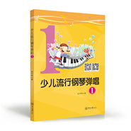
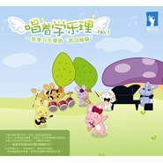

张宇桦
============================

|  |  |
| :--: | :-- |
| [ 张宇桦](https://i.xiami.com/zyh) | **播放数**: 11619297 **粉丝数**: 5650 **评论数**: 77 **地区**: China 中国大陆 **风格**: 轻音乐 Easy Listening, 轻音乐流行 Light Pop  |

## 档案

著名音乐人，音乐制作人，制作过多张唱片，担任多张音乐唱片的制作人、音乐总监，多首词曲音乐作品在多个音乐榜上榜。2013年9月6日在广州星海音乐厅举办《唱跳学乐理》张宇桦作品音乐会。原创钢琴专辑《星空下的钢琴曲》(1、2)专辑网络试听已经超过5亿+。制作的专辑有《星空下的钢琴曲》（1、2）、《宝宝钢琴曲》、《唱着学乐理》、《弹唱学乐理》、《唱跳学乐理》（DVD）、《音乐小宝宝》、《开心过新年》、《我很可爱》、《爱上尤克里里》、《李怡霖》同名专辑、《爱情你好》、《钢琴与古诗》等。张宇桦编著了中国首本少儿流行钢琴弹唱教材《少儿流行钢琴弹唱》，推广流行钢琴弹唱，让更多人喜欢流行钢琴。原创专辑《唱着学乐理》把一首首乐理知识变成歌，唱歌就能学习乐理知识等等，深受大家喜欢。获得喜马拉雅2017年度潜力新星，2018年度主播大赏|音乐十大实力主播，广东优秀音乐家奖、广东优秀音乐人奖、十佳咪咕音乐人等。 
代表作品：《小童年》、《我很可爱》、《毕业十年》、《妈妈陪我一起长大》、《五线谱》、《有梦想就来拼》、《春去花落知多少》、《何时归家去》、《优美的小调》、《风中的蒲公英》、《清晨的美好》、《萤火虫的舞蹈》、《木山口听风》、《被遗忘的89键》、《怡霖的美》钢琴曲等。其中《星空下的钢琴曲》被多个当红综艺节目，电视台栏目，电台主播，选为背景音乐。《萤火虫的舞蹈》支付宝95公益账单背景音乐，让更多的人一起加入种树做公益，保护我们的地球；《怡霖的美》喜马拉雅2018年度收听报告账单背景音乐等。 
张宇桦编著的教材： 
《少儿流行钢琴弹唱》 中国首本少儿流行钢琴教材 
《流行钢琴弹唱 流行儿歌》100首必学世界儿歌 
《流行钢琴弹唱 流行歌曲》 100首经典流行歌曲 
《流行钢琴弹唱 流行中国风》 103首中国各地民歌，流行古风 
《弹唱学乐理》唱歌就能学习乐理知识 
《星空下的钢琴曲》流行钢琴曲 网络试听5亿+ 
《爱上尤克里里 弹唱篇》 弹唱+指弹快速入门的宝典 
《一个星期学会尤克里里弹唱》等

## 专辑

| 名称 | 语种 | 唱片公司 | 发行时间 | 专辑类别 | 专辑风格 |
| :--: | :-- | :-- | :-- | :-- | :-- |
| [ 大自然琴声](./albums/5020902639.md) | 纯音乐 | 独立发行 | 2020年06月16日 | 录音室专辑 | 器乐流行 Instrumental Pop, 轻音乐 Easy Listening |
| [ 星空下的钢琴曲3](./albums/2105060045.md) | 纯音乐 | 独立发行 | 2019年08月08日 | 录音室专辑 | 轻音乐 Easy Listening |
| [ 我很可爱 张雅淇](./albums/2100240408.md) | 国语 | 盛佰文化 | 2019年06月06日 | 录音室专辑 | 国语流行 Mandarin Pop, 儿童音乐 Children's Music |
| [ 弹唱学乐理 (演唱版本)《弹唱学乐理》《唱着学乐理》《唱跳学乐理》演唱版本](./albums/2102950449.md) | 国语 | 盛佰文化 | 2018年09月01日 | 录音室专辑 | 国语流行 Mandarin Pop, 儿歌 Nursery Rhyme, 有声书 Audio Book |
| [ 弹唱学乐理 (原版伴奏)《弹唱学乐理》《唱着学乐理》《唱跳学乐理》原版伴奏](./albums/2102649692.md) | 国语 | 盛佰文化 | 2018年09月01日 | 录音室专辑 | 儿歌 Nursery Rhyme, 儿童音乐 Children's Music, 胎教音乐 Prenatal Music |
| [ 开心过新年 张雅淇](./albums/225542723.md) | 国语 | 盛佰文化 | 2018年06月06日 | 录音室专辑 | 流行 Pop, 儿童音乐 Children's Music, 儿歌 Nursery Rhyme |
| [ 爱上尤克里里Love ukulele](./albums/2102757238.md) | 国语 | 盛佰文化 | 2018年03月18日 | 录音室专辑 | 儿童音乐 Children's Music, 童声合唱团 Children's Chorus, 流行 Pop |
| [ 弹唱学乐理(钢琴版)一本乐理+流行钢琴弹唱的武功秘籍](./albums/180783657.md) | 国语 | 盛佰文化 | 2017年02月24日 | 录音室专辑 | 轻音乐 Easy Listening, 轻音乐流行 Light Pop |
| [ 宝宝钢琴曲](./albums/2102661703.md) | 国语 | 盛佰文化 | 2016年12月09日 | 录音室专辑 | 轻音乐流行 Light Pop, 轻音乐 Easy Listening |
| [ 《音乐小宝宝》专辑 原版伴奏](./albums/2102649858.md) | 国语 |  | 2016年11月08日 | 录音室专辑 | 儿童音乐 Children's Music, 儿歌 Nursery Rhyme, 胎教音乐 Prenatal Music |
| [ 少儿流行钢琴弹唱1](./albums/2102655028.md) | 国语 | 盛佰文化 | 2016年01月01日 | 有声书 | 流行 Pop, 儿童音乐 Children's Music |
| [ 星空下的钢琴曲2](./albums/2100175399.md) | 国语 | 盛佰文化 | 2015年08月08日 | 录音室专辑 | 沙发音乐 Lounge, 器乐独奏 Solo Instrumental, 轻音乐 Easy Listening |
| [ 音乐小宝宝亲子教育系列唱片](./albums/206899711.md) | 国语 | 盛佰文化 | 2014年08月18日 | 录音室专辑 | 童稚流行 Twee Pop, 儿歌 Nursery Rhyme, 胎教音乐 Prenatal Music |
| [ 星空下的钢琴曲1](./albums/1787376814.md) | 国语 | 盛佰文化 | 2013年12月18日 | 录音室专辑 | 沙发音乐 Lounge, 放松新世纪 Relaxation New Age, 轻音乐 Easy Listening |
| [ 唱着学乐理](./albums/980555356.md) | 国语 | 盛佰文化 | 2010年12月29日 | 录音室专辑 | 儿歌 Nursery Rhyme, 儿童音乐 Children's Music, 童声合唱团 Children's Chorus |

## 评论

|  |  |  |  |
| :-- | :-- | :-- | :-- |
|  [虾米用户](https://emumo.xiami.com/u/276944698) 不要自我设限..... 2020-10-12 13:26 赞(0) 踩(0) | 
✔️✔️✔️
 |
|  [虾米用户](https://emumo.xiami.com/u/1738111) enjoy music 2020-03-21 07:30 赞(1) 踩(0) | 
哇塞喜欢，虾米简直是宝藏 
 |
|  [虾米用户](https://emumo.xiami.com/u/5635270)  2020-03-02 14:09 赞(2) 踩(0) | 
很幸运，能遇到张宇桦这样，用心做音乐又如此有才华的音乐人!
 |
|  [虾米用户](https://emumo.xiami.com/u/344649875)  2020-02-17 23:19 赞(1) 踩(0) | 
旋律非常的棒
 |
|  [虾米用户](https://emumo.xiami.com/u/358104299) 悲观的唯心存在现实解构虚... 2019-12-22 07:05 赞(1) 踩(0) | 
14441
 |
|  [虾米用户](https://emumo.xiami.com/u/429035749) 我是艺术家 2019-08-24 21:44 赞(3) 踩(0) | 
我是一个音乐生 但我有时对音乐有时候感觉是枯燥无味的  因为我是为了完成老师老师的任务 并没有真正投入全身心去做 但您发现了音乐的新大陆 可以结合实际生活来编写优雅的曲子 并且把枯燥无味的乐理知识言简意赅的转变成悦耳动听的音乐 谢谢您的用心 您让我发现了音乐的魅力 让我更加爱音乐！感谢！  
 |
|  [虾米用户](https://emumo.xiami.com/u/36586391) 宝贝的成长。 2019-07-05 12:20 赞(0) 踩(0) | 
优美，亲切。如果有人还记得很早前也在广州的&amp;ldquo;天使的和声&amp;rdquo;小站，那我们也能做老朋友了
 |
|  [虾米用户](https://emumo.xiami.com/u/7151428) 暖暖的～～ 2019-06-20 22:04 赞(0) 踩(0) | 
  
 |
|  [虾米用户](https://emumo.xiami.com/u/413023776) 喜欢夜的钢琴曲 2019-05-14 11:02 赞(0) 踩(0) | 
我才学钢琴半年，能谈什么曲子呢 
 |
|  [虾米用户](https://emumo.xiami.com/u/354333075)  2019-05-10 22:38 赞(1) 踩(0) | 
非常喜欢你的作品  
 |
|  [虾米用户](https://emumo.xiami.com/u/9003931) 千淘万漉虽辛苦 2019-03-30 10:03 赞(0) 踩(0) | 
有点意思。
 |
|  [虾米用户](https://emumo.xiami.com/u/361037631)  2019-03-06 20:30 赞(1) 踩(0) | 
******
 |
|  [虾米用户](https://emumo.xiami.com/u/334316278) 我还没想好要写什么... 2019-02-09 13:09 赞(7) 踩(0) | 
喜欢，可以反复听下去。
 |
|  [虾米用户](https://emumo.xiami.com/u/369588905)  2018-10-28 10:29 赞(2) 踩(0) | 
喜欢你的音乐。不过想建议你买个较好的钢琴。
 |
|  [虾米用户](https://emumo.xiami.com/u/12221090) 逍遥于天地而心意自得 2018-09-27 13:04 赞(1) 踩(0) | 
赞
 |
|  [虾米用户](https://emumo.xiami.com/u/304506374) 诗和歌是我永远的朋友! 2018-09-14 23:59 赞(3) 踩(0) | 
喜欢风中的蒲公英像征自由的旅行不知何处是吾家心安处便是吾家
 |
|  [虾米用户](https://emumo.xiami.com/u/65265104) 变化是永恒的 2018-07-29 12:32 赞(1) 踩(0) | 
求谱子   
 |
| ⇒ |  [虾米用户](https://emumo.xiami.com/u/258165896)  2019-02-11 09:32 赞(0) 踩(0) | 
淘宝上有星空下的钢琴曲这本书，全部歌曲都有，我有一本哈哈！
 |
|  [虾米用户](https://emumo.xiami.com/u/321219309) 江湖险恶，不行就撤 2018-07-11 13:59 赞(3) 踩(0) | 
都很好听，强烈推荐，不落俗套的好听。
 |
|  [虾米用户](https://emumo.xiami.com/u/258165896)  2018-06-03 11:06 赞(0) 踩(0) | 
好听
 |
|  [虾米用户](https://emumo.xiami.com/u/258165896)  2018-06-03 11:05 赞(1) 踩(0) | 
好听！   
 |
|  [虾米用户](https://emumo.xiami.com/u/310800583)  2018-05-03 02:42 赞(0) 踩(0) | 
喜欢
 |
|  [虾米用户](https://emumo.xiami.com/u/11728762) 最爱《新白娘子传奇》里的... 2018-04-20 08:25 赞(2) 踩(0) | 
好喜欢你做的旋律！！！！！
 |
|  [虾米用户](https://emumo.xiami.com/u/355067715)   2018-03-25 10:33 赞(2) 踩(0) | 
好听
 |
|  [虾米用户](https://emumo.xiami.com/u/334589755)  2018-02-10 08:55 赞(1) 踩(0) | 
是我迟到了吗？
 |
|  [虾米用户](https://emumo.xiami.com/u/254488441)  2017-12-19 12:20 赞(1) 踩(0) | 
伴奏怎么下载啊
 |
| ⇒ |  [虾米用户](https://emumo.xiami.com/u/258165896)  2017-12-19 18:01 赞(0) 踩(0) | 
电脑下载虾米音乐电脑版本，就可以下载到电脑本地了！ 现在每一个播放器都是这样的方法，才能下载到电脑！
 |
| ⇒ |  [虾米用户](https://emumo.xiami.com/u/258165896)  2017-12-19 18:01 赞(0) 踩(0) | 
电脑下载虾米音乐电脑版本，就可以下载到电脑本地了！ 现在每一个播放器都是这样的方法，才能下载到电脑！
 |
|  [虾米用户](https://emumo.xiami.com/u/16968900)  2017-10-30 10:15 赞(2) 踩(0) | 
《唱着学乐理》这张专辑是作曲家张宇桦老师把乐理知识写进一首首曲调优美的歌曲里面，让大家更通俗方便的学习乐理。不是枯燥的理论知识，而是一首首优美的歌曲不是让人犯晕的高深道理，而是连三岁孩童都能熟记的歌词 不是让你花很多时间来学习，只需要听听唱片——就能学到基础乐理的精髓所在！
 |
|  [虾米用户](https://emumo.xiami.com/u/258165896)  2017-10-30 09:55 赞(3) 踩(0) | 
217-01-27期，《奇葩大会》第二期31:15何炅老师说话的配乐用了张宇桦老师《优美的小调》这首歌曲耶！太棒了！[强][强][强][强][强][强]祝大家新年快乐！万事如意！身体健康！财源滚滚来！
 |
|  [虾米用户](https://emumo.xiami.com/u/296680489)  2017-10-13 23:42 赞(1) 踩(0) | 
真美好！
 |
|  [虾米用户](https://emumo.xiami.com/u/2021147) 我行我素 2017-10-13 22:43 赞(1) 踩(0) | 
刚聆听完《优美的小调》，回想起那些在琴键上消耗的时光，曲子走入了我的心里，勾起了无数回忆，我谈小调总是有问题，因为我天生小指比别人短一截，谈的时候换指总是换不过来，我烦小调，它那么忧伤，但我又爱小调，因为爱的对立给了我生动的一课，那些你曾经计较的，最终都会成就你。
 |
|  [虾米用户](https://emumo.xiami.com/u/284834078)  2017-10-07 18:40 赞(4) 踩(0) | 
喜欢这种音域广阔、青葱跳跃、畅想愉快、带着很强生命节奏的钢琴乐曲。
 |
|  [虾米用户](https://emumo.xiami.com/u/259372023)  2017-03-25 20:16 赞(1) 踩(0) | 
666666
 |
|  [虾米用户](https://emumo.xiami.com/u/52719153)  2017-03-17 10:34 赞(1) 踩(0) | 
很好的音乐启蒙素材
 |
|  [虾米用户](https://emumo.xiami.com/u/260869257)  2017-01-10 16:25 赞(1) 踩(0) | 
做BB的胎教音乐 
 |
|  [虾米用户](https://emumo.xiami.com/u/258165896)  2016-12-30 23:20 赞(2) 踩(0) | 
《四大名助第四季20161229的这一期》，在16:23-17:00的背景音乐用的是张宇桦老师写的《星空下的钢琴曲》里面的《风中的蒲公英》这首曲子的配乐！
 |
|  [虾米用户](https://emumo.xiami.com/u/211551733)   2016-12-11 18:19 赞(1) 踩(0) | 
太棒了
 |
|  [虾米用户](https://emumo.xiami.com/u/189481256)  2016-06-13 12:27 赞(2) 踩(0) | 
每个乐点直击内心！
 |
|  [虾米用户](https://emumo.xiami.com/u/94395150)   2016-05-28 22:10 赞(3) 踩(0) | 
充盈感情上漂浮着灵魂的孤单
 |
|  [虾米用户](https://emumo.xiami.com/u/9645212)  2016-05-13 19:55 赞(2) 踩(0) | 
好听，支持！
 |
|  [虾米用户](https://emumo.xiami.com/u/17811967) 自由 . 自在 2016-01-27 22:17 赞(3) 踩(0) | 
听你的曲子 感觉 是踩着水滴
 |
|  [虾米用户](https://emumo.xiami.com/u/11410153) 心有猛虎，细嗅蔷薇。 2015-12-06 19:25 赞(2) 踩(0) | 
好听
 |
|  [虾米用户](https://emumo.xiami.com/u/88784264) 紫梦园时尚编织屋 2015-12-05 02:36 赞(2) 踩(0) | 
优美
 |
|  [虾米用户](https://emumo.xiami.com/u/85323246)   2015-11-22 00:16 赞(2) 踩(0) | 
想着你很快乐，    
 |
|  [虾米用户](https://emumo.xiami.com/u/49720316)   2015-09-27 00:31 赞(2) 踩(0) | 
好棒\^O^/，超喜欢风中的蒲公英
 |
|  [虾米用户](https://emumo.xiami.com/u/63354888)  2015-09-12 02:06 赞(2) 踩(0) | 
好喜欢听这首清晨的美好
 |
|  [虾米用户](https://emumo.xiami.com/u/11389164)  2015-04-24 21:36 赞(2) 踩(0) | 
******
 |
|  [虾米用户](https://emumo.xiami.com/u/11022923) 新盘 2015-02-10 05:23 赞(2) 踩(0) | 
舒适,宁静
 |
|  [虾米用户](https://emumo.xiami.com/u/46519931)  2015-01-31 07:03 赞(2) 踩(0) | 
儿童
 |
|  [虾米用户](https://emumo.xiami.com/u/9645212)  2015-01-27 23:05 赞(3) 踩(0) | 
简单优美的钢琴曲子
 |
|  [虾米用户](https://emumo.xiami.com/u/40792872) 唱给你听呀~ 2014-09-18 01:46 赞(2) 踩(0) | 
听了你的钢琴曲～ 给个小小的建议可以么？我觉得曲子旋律不错，就是钢琴的左手伴奏有点单一，一直是均匀的八分琶音。。。如果你能够在左手上突破这种伴奏的框架，曲子整体会有更大的提升空间！已经很棒的作品了，继续加油朋友 ：）挺你！！！
 |
| ⇒ |  [虾米用户](https://emumo.xiami.com/u/30194302)  2014-09-19 12:14 赞(0) 踩(0) | 
写的简单点，我们才可以弹！哈哈！
 |
|  [虾米用户](https://emumo.xiami.com/u/30703551)  2014-08-02 00:58 赞(3) 踩(0) | 
又有新专辑听了，太棒了！亲子唱片好好听！
 |
|  [虾米用户](https://emumo.xiami.com/u/35834911)  2014-04-26 23:46 赞(3) 踩(0) | 
喜欢
 |
|  [虾米用户](https://emumo.xiami.com/u/12948310) 音乐是上帝派来慰藉灵魂的... 2014-04-11 20:14 赞(4) 踩(0) | 
支持！
 |
|  [虾米用户](https://emumo.xiami.com/u/22269) 暂无签名~ 2014-01-11 16:44 赞(3) 踩(0) | 
音乐启蒙
 |
|  [虾米用户](https://emumo.xiami.com/u/11389164)  2014-01-09 18:56 赞(2) 踩(0) | 
******
 |
|  [虾米用户](https://emumo.xiami.com/u/30762561)  2013-12-30 00:30 赞(2) 踩(0) | 
要歌谱！
 |
|  [虾米用户](https://emumo.xiami.com/u/30448819)  2013-12-24 23:27 赞(5) 踩(0) | 
三张唱片都很好听！赞一个！感谢为儿童启蒙教育做出的奉献，太感谢了！
 |
|  [虾米用户](https://emumo.xiami.com/u/30376991)  2013-12-23 22:37 赞(4) 踩(0) | 
路过！好听！留下！继续听!发现！更多好听!
 |
|  [虾米用户](https://emumo.xiami.com/u/30194302)  2013-12-23 21:53 赞(3) 踩(0) | 
好听！点赞！！！
 |
|  [虾米用户](https://emumo.xiami.com/u/1448035) tiger & rose 2013-11-10 16:46 赞(2) 踩(0) | 
大拇哥！！！
 |
|  [虾米用户](https://emumo.xiami.com/u/25699431)  2013-10-30 12:00 赞(2) 踩(0) | 
老爸我们今天听哪张呀？听《唱着学乐理》吧！！！哈哈！赞！
 |
|  [虾米用户](https://emumo.xiami.com/u/3235848)  2013-10-29 03:18 赞(2) 踩(0) | 
小盆友这么学乐理会简单很多吧
 |
|  [虾米用户](https://emumo.xiami.com/u/23554515)  2013-10-02 21:38 赞(2) 踩(0) | 
一张学习乐理的“武功秘籍”唱片！赞！
 |
|  [虾米用户](https://emumo.xiami.com/u/3432181)  2013-09-30 22:43 赞(78) 踩(0) | 
我刚入驻了虾米音乐人，欢迎大家来我的个人主页，收听我的最新音乐
 |
| ⇒ |  [虾米用户](https://emumo.xiami.com/u/31825593) Miss.D&M 2014-09-21 10:44 赞(0) 踩(0) | 
我也来晚了，再次见到你也在这里，很开心，音乐很喜欢，期待你的新曲～
 |
| ⇒ |  [虾米用户](https://emumo.xiami.com/u/3432181)  2014-09-25 23:39 赞(0) 踩(0) | 
<q><b>Miss.D&amp;M说：</b></q>
 |
| ⇒ |  [虾米用户](https://emumo.xiami.com/u/10421076) 永远的星空 2016-01-21 23:35 赞(0) 踩(0) | 
已关注
 |
| ⇒ |  [虾米用户](https://emumo.xiami.com/u/186086409)  2016-06-09 11:13 赞(0) 踩(0) | 
你是最棒的
 |
| ⇒ |  [虾米用户](https://emumo.xiami.com/u/255267467)  2016-12-19 21:45 赞(0) 踩(0) | 
我记得盛佰童星里面有一首歌叫盛佰花开
 |
| ⇒ |  [虾米用户](https://emumo.xiami.com/u/23422150)  2016-12-21 10:37 赞(0) 踩(0) | 
<q><b>今生不求爱说：</b></q>
 |
| ⇒ |  [虾米用户](https://emumo.xiami.com/u/11728762) 最爱《新白娘子传奇》里的... 2018-04-20 08:25 赞(0) 踩(0) | 
无意间听到，太好听了，必须支持
 |
| ⇒ |  [虾米用户](https://emumo.xiami.com/u/338494637)  2018-09-06 20:08 赞(0) 踩(0) | 
支付宝用了你的音乐，萤火虫的舞蹈真好听。
 |
| ⇒ |  [虾米用户](https://emumo.xiami.com/u/327212715) 活就好好活死就好好死。 2019-01-28 21:52 赞(0) 踩(0) | 
张宇桦，你弹钢琴的时候肯定很潇洒！因为你人长得帅
 |
| ⇒ |  [虾米用户](https://emumo.xiami.com/u/446033371)  2020-11-18 12:52 赞(0) 踩(0) | 
请问一下，哪里可以买得到您的《唱着学乐理》这个专辑的歌谱？
 |
