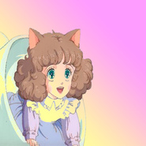

Baby Talk ベビー・トーク♥
============================

|  |  |
| :--: | :-- |
| [ Baby Talk ベビー・トーク♥](https://emumo.xiami.com/album/2102862579) | **艺人**: [传琦SAMA](../index.md) **语种**: 英语 **唱片公司**: 独立发行 **发行时间**: 2017年09月24日 **专辑类别**: 录音室专辑 **专辑风格**: 蒸汽波 Vaporwave, 电子 Electronic **播放数**: 190502 **收藏数**: 69 **评论数**: 14  |

## 简介

Baby Talk ベビー・トーク♥ 
 

 

## 曲目

## 评论

|  |  |  |
| :-- | :-- | :-- |
|  [虾米用户](https://emumo.xiami.com/u/52056952) 人生即是到來、相遇、陪伴... 2020-05-17 21:19 赞(0) 踩(0) | 
♪(&amp;prime;&amp;epsilon;&amp;prime;‧̣̥̇)
 |
|  [虾米用户](https://emumo.xiami.com/u/39401255)  2019-06-15 16:02 赞(0) 踩(0) | 
意外的好听
 |
|  [虾米用户](https://emumo.xiami.com/u/254314126)  2019-02-27 16:37 赞(0) 踩(0) | 
不错不错
 |
|  [虾米用户](https://emumo.xiami.com/u/19941586) 如果我是完美的 如果我是... 2018-12-03 13:40 赞(1) 踩(0) | 
封面漂亮歌好听
 |
|  [虾米用户](https://emumo.xiami.com/u/6879731) 失终人口回归 2017-11-21 20:45 赞(0) 踩(0) | 
(๑&amp;bull;ั็&amp;omega;&amp;bull;็ั๑)   
 |
|  [虾米用户](https://emumo.xiami.com/u/86707926) 超自然的冥想 2017-09-26 14:55 赞(0) 踩(0) | 
_
 |
|  [虾米用户](https://emumo.xiami.com/u/74891292)  2017-09-26 04:41 赞(0) 踩(0) | 
酷酷酷
 |
|  [虾米用户](https://emumo.xiami.com/u/46583488)  2017-09-26 01:18 赞(3) 踩(0) | 
あのちゃんが可愛すぎる   封面是Ano
 |
| ⇒ |  [虾米用户](https://emumo.xiami.com/u/6879731) 失终人口回归 2017-11-21 20:45 赞(0) 踩(0) | 
谁是Ano?
 |
|  [虾米用户](https://emumo.xiami.com/u/24143615) 嘘! 2017-09-24 20:03 赞(0) 踩(0) | 
-0-
 |
|  [虾米用户](https://emumo.xiami.com/u/13810266) 我觉得自己像一位艺术家 2017-09-24 18:57 赞(2) 踩(0) | 
中文也有不错的蒸汽波 
 |
|  [虾米用户](https://emumo.xiami.com/u/48373788) 模仿他人无异于自杀。 2017-09-24 15:32 赞(1) 踩(0) | 
封面好鸡儿好看吧
 |
|  [虾米用户](https://emumo.xiami.com/u/55297664) 我还没想好要写什么... 2017-09-24 12:21 赞(0) 踩(0) | 
男神么么
 |
|  [虾米用户](https://emumo.xiami.com/u/31531934) 恋の道に近道はない 2017-09-24 12:19 赞(0) 踩(0) | 
你好棒啊前天做的曲子嗎 
 |
