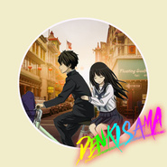

就這樣依偎在我的身後♡
============================

|  |  |
| :--: | :-- |
| [ 就這樣依偎在我的身後♡](https://emumo.xiami.com/album/2105521335) | **艺人**: [传琦SAMA](../index.md) **语种**: 国语 **唱片公司**:  **发行时间**: 2019年11月26日 **专辑类别**: EP, 单曲 **专辑风格**: 轻音乐 Easy Listening, 器乐嘻哈 Instrumental Hip Hop, 原声 Soundtrack **播放数**: 4716 **收藏数**: 3 **评论数**: 6  |

## 简介

現在做的曲子越來越有OST的感覺了呢.  
在創作這首曲子的時候,  
我腦海中浮現的畫面就是清晨騎著脚踏車載著心愛的女孩一起去學校.  
女孩依偎在我的身後,  
這種甜蜜的感覺真是美的不要不要的.  
很可惜,因爲本身靦腆内向的原因,大學之前都沒有談過一次校園戀愛.  
我一直都想嘗試那樣的青澀戀情.  
到現在只剩下遺憾.  
不過還好,經過我的努力,我把想要做但沒做成的事情用音樂表現出來了.  
所以,  
謝謝音樂~  
謝謝收聽~

## 曲目

## 评论

|  |  |  |  |
| :-- | :-- | :-- | :-- |
|  [虾米用户](https://emumo.xiami.com/u/6078577) 故事的小黄花，从出生那年... 2020-03-10 15:35 赞(0) 踩(0) | 
冰果耶
 |
|  [虾米用户](https://emumo.xiami.com/u/7915766) 我还没想好要写什么... 2020-03-09 00:20 赞(0) 踩(0) | 
喜欢了 介绍里的那段文字…
 |
|  [虾米用户](https://emumo.xiami.com/u/62553890)  ♡ 2019-11-28 23:14 赞(0) 踩(0) | 
鸡蛋糕跟你嘴角果酱我都想要尝
 |
|  [虾米用户](https://emumo.xiami.com/u/52056952) 人生即是到來、相遇、陪伴... 2019-11-26 23:06 赞(0) 踩(0) | 

 |
|  [虾米用户](https://emumo.xiami.com/u/31531934) 恋の道に近道はない 2019-11-26 15:53 赞(0) 踩(0) | 
get
 |
|  [虾米用户](https://emumo.xiami.com/u/43443614) 微信M7-Bonnie，... 2019-11-26 14:55 赞(0) 踩(0) | 
上新啦
 |
